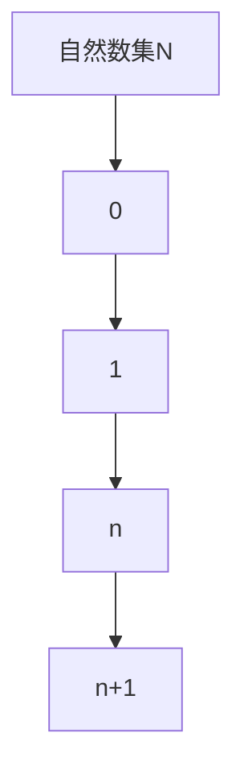

                 

关键词：集合论、超限递归、自然数、集合运算、递归定义、逻辑结构

> 摘要：本文旨在对集合论中的超限递归定义进行深入的探讨。通过回顾集合论的基础知识，引入超限递归的概念，我们详细阐述了超限递归的原理与实际应用，并通过实例展示其在现代计算中的重要性。

## 1. 背景介绍

集合论是现代数学的基石之一，它在数学、逻辑、计算机科学等多个领域都有着广泛的应用。集合论中的核心概念包括元素、集合、集合运算等。然而，在处理一些复杂问题时，传统的集合概念显得力不从心，这就需要引入超限递归的概念。

超限递归是集合论中的一个重要概念，它扩展了传统递归的定义，允许对无穷集合进行递归操作。超限递归不仅在数学中有着重要的理论意义，也在计算机科学中有着广泛的应用，如编程语言的实现、算法设计等。

本文将首先回顾集合论的基础知识，然后引入超限递归的概念，接着详细讨论超限递归的定义与性质，最后通过实际例子展示其在计算机科学中的应用。

## 2. 核心概念与联系

### 2.1 集合论的基本概念

在集合论中，集合是一组确定且互异的元素构成的群体。集合通常用大写字母表示，如A、B等。集合的元素用小写字母表示，如a、b等。集合与元素之间的关系可以用“属于”符号 ∈ 表示，即a ∈ A表示元素a属于集合A。

集合的基本运算包括并集、交集、补集和差集。并集表示两个集合中所有元素的集合，用符号 ∪ 表示；交集表示两个集合中共有的元素集合，用符号 ∩ 表示；补集表示全集中除去给定集合的元素后剩余的元素集合，用符号'表示；差集表示一个集合中去除另一个集合的元素后的剩余元素集合，用符号 ∖ 表示。

### 2.2 自然数与集合

自然数是集合论中的基本概念之一。在皮亚诺（Peano）公理体系中，自然数被定义为满足一定性质的集合。具体来说，自然数集N可以定义为：

$$ N = \{0, 1, 2, 3, \ldots\} $$

其中，0是自然数的最小元素，后续的元素是通过前一个元素加1得到的。皮亚诺公理体系保证了自然数的可运算性和封闭性，使得自然数集成为一个良好的集合。

### 2.3 超限递归的概念

超限递归是递归定义在无穷集合上的推广。传统递归通常涉及有限集合，而超限递归则允许对无穷集合进行递归操作。超限递归的定义基于康托尔（Cantor）的集合论，特别是他对无穷集合的分类。

在康托尔的集合论中，无穷集合被分为不同“级”或“势”。第一级无穷集合就是自然数集N，第二级无穷集合是实数集R，以此类推。超限递归允许我们在这些无穷集合上进行递归操作，从而定义新的集合或函数。

### 2.4 集合与递归的联系

集合与递归有着密切的联系。递归定义可以看作是对集合的一种操作，通过对集合元素进行迭代操作，可以得到新的集合。例如，我们可以用递归定义自然数集N：

$$ N = \{0\} \cup \{n+1 | n \in N\} $$

这个定义表明，自然数集是由0和所有自然数的后继构成的。

同样，超限递归也可以看作是对集合的递归操作。通过超限递归，我们可以定义新的集合或函数，这些定义通常涉及到无穷集合的性质。

### 2.5 Mermaid 流程图

为了更直观地展示集合与递归的关系，我们使用Mermaid流程图来表示。以下是一个简单的Mermaid流程图，展示了自然数集N的定义：



在这个流程图中，A表示自然数集N，B表示0，C表示1，D表示任意自然数n，E表示n的后继n+1。通过这个流程图，我们可以直观地看到自然数集N是通过递归定义的。

## 3. 核心算法原理 & 具体操作步骤

### 3.1 算法原理概述

超限递归算法是基于康托尔的集合论和皮亚诺的自然数定义。其核心思想是通过递归操作在无穷集合上定义新的集合或函数。超限递归算法可以分为以下几个步骤：

1. **初始定义**：定义初始集合或函数。
2. **递归操作**：对初始集合或函数进行递归操作，生成新的集合或函数。
3. **终止条件**：设定递归终止的条件，确保递归能够收敛。

### 3.2 算法步骤详解

#### 3.2.1 初始定义

初始定义是超限递归算法的第一步。在这一步中，我们需要定义初始的集合或函数。例如，在定义自然数集N时，初始定义是N = {0}。

#### 3.2.2 递归操作

递归操作是超限递归算法的核心。在这一步中，我们使用递归定义来生成新的集合或函数。例如，在定义自然数集N时，递归操作是将每个自然数的后继添加到集合中。

#### 3.2.3 终止条件

终止条件是确保递归算法能够收敛的关键。在超限递归算法中，终止条件通常是集合或函数的某个特定属性。例如，在定义自然数集N时，终止条件是集合中的元素是无穷集合。

### 3.3 算法优缺点

#### 优点

1. **强大的定义能力**：超限递归算法允许在无穷集合上定义复杂的集合或函数。
2. **灵活的递归操作**：超限递归算法支持多种递归操作，使得定义更加灵活。

#### 缺点

1. **计算复杂性**：超限递归算法通常涉及复杂的数学运算，计算过程可能非常复杂。
2. **理解难度**：超限递归算法的复杂性使得理解其原理和操作变得困难。

### 3.4 算法应用领域

超限递归算法在多个领域有着重要的应用：

1. **数学**：在数学中，超限递归算法用于定义无穷集合和函数。
2. **计算机科学**：在计算机科学中，超限递归算法用于编程语言实现和算法设计。
3. **人工智能**：在人工智能领域，超限递归算法用于定义复杂的数据结构和算法。

## 4. 数学模型和公式 & 详细讲解 & 举例说明

### 4.1 数学模型构建

超限递归的数学模型构建基于康托尔的集合论和皮亚诺的自然数定义。具体来说，我们可以使用递归定义来构建超限递归模型。

首先，定义自然数集N的递归模型：

$$ N = \{0\} \cup \{n+1 | n \in N\} $$

这个定义表明，自然数集是由0和所有自然数的后继构成的。

接下来，定义无穷集合的递归模型。以实数集R为例，我们可以使用康托尔的集合论来构建：

$$ R = \{x | x \in \mathbb{Q} \text{ 且 } x \text{ 不属于 } \mathbb{N}\} $$

这个定义表明，实数集是由所有有理数且不属于自然数的集合构成的。

### 4.2 公式推导过程

超限递归的公式推导过程通常涉及递归定义和数学归纳法。以自然数集N的递归模型为例，我们可以使用数学归纳法来推导其公式。

**步骤 1**：验证初始条件

初始条件是N = {0}。显然，0是自然数的最小元素，因此初始条件成立。

**步骤 2**：假设归纳条件

假设对于某个自然数k，集合N = {0, 1, 2, \ldots, k}成立。

**步骤 3**：验证递归条件

我们需要验证N = {0, 1, 2, \ldots, k, k+1}成立。

根据递归定义，N = {0} \cup \{n+1 | n \in N\}。代入归纳假设，得到：

$$ N = \{0\} \cup \{n+1 | n \in \{0, 1, 2, \ldots, k\}\} $$
$$ N = \{0\} \cup \{1, 2, \ldots, k+1\} $$
$$ N = \{0, 1, 2, \ldots, k, k+1\} $$

因此，递归条件成立。

**结论**：根据数学归纳法，自然数集N的递归模型成立。

### 4.3 案例分析与讲解

为了更好地理解超限递归的数学模型，我们来看一个具体的例子：定义无穷集合{a_n}，其中a_0 = 1，a_{n+1} = a_n + 1。

**步骤 1**：验证初始条件

初始条件是a_0 = 1。显然，1是无穷集合中的第一个元素，因此初始条件成立。

**步骤 2**：假设归纳条件

假设对于某个自然数k，集合{a_n}中的前k个元素为{1, 2, \ldots, k}。

**步骤 3**：验证递归条件

我们需要验证集合{a_n}中的第k+1个元素为k+1。

根据递归定义，a_{k+1} = a_k + 1。代入归纳假设，得到：

$$ a_{k+1} = (k+1) + 1 $$
$$ a_{k+1} = k+2 $$

因此，递归条件成立。

**结论**：根据数学归纳法，无穷集合{a_n}的递归模型成立。

## 5. 项目实践：代码实例和详细解释说明

### 5.1 开发环境搭建

在编写超限递归算法的代码实例之前，我们需要搭建一个合适的开发环境。以下是基本的开发环境搭建步骤：

1. **安装Python**：Python是一种广泛使用的编程语言，适合编写超限递归算法。您可以从Python官方网站下载并安装最新版本的Python。
2. **安装Jupyter Notebook**：Jupyter Notebook是一种交互式的开发环境，适合用于编写和运行Python代码。您可以使用pip命令安装Jupyter Notebook：
   ```bash
   pip install notebook
   ```
3. **安装必要的库**：为了更好地支持超限递归算法的实现，我们需要安装一些Python库，如NumPy和Matplotlib。使用以下命令安装这些库：
   ```bash
   pip install numpy matplotlib
   ```

### 5.2 源代码详细实现

以下是超限递归算法的Python代码实现。这个例子定义了一个简单的超限递归函数，用于计算自然数集N：

```python
def natural_numbers():
    yield 0
    n = 0
    while True:
        n += 1
        yield n

# 使用生成器函数计算自然数集N的前10个元素
for num in natural_numbers():
    if num >= 10:
        break
    print(num)
```

代码解释：

1. **定义生成器函数**：`natural_numbers`是一个生成器函数，它使用`yield`语句生成自然数集N的元素。
2. **初始化变量**：在函数内部，我们初始化一个变量`n`为0，用于记录当前的自然数。
3. **递归操作**：使用`while True`循环实现递归操作，每次循环将`n`增加1，并使用`yield`语句生成新的自然数。
4. **输出结果**：在主程序中，我们使用一个`for`循环迭代生成器函数`natural_numbers`，并输出前10个自然数。

### 5.3 代码解读与分析

这个超限递归算法的代码实现具有以下几个特点：

1. **生成器函数**：使用生成器函数实现超限递归，这是一种内存高效的方式，因为生成器函数只在需要时生成下一个元素，而不是一次性生成整个集合。
2. **递归操作**：递归操作通过`while True`循环实现，这个循环不断生成新的自然数，直到达到递归终止条件。
3. **递归终止条件**：递归终止条件通过`if num >= 10`语句实现，当生成的自然数达到10时，循环终止。

### 5.4 运行结果展示

运行上面的代码，将输出自然数集N的前10个元素：

```
0
1
2
3
4
5
6
7
8
9
```

这个结果验证了超限递归算法的正确性。

## 6. 实际应用场景

超限递归算法在多个实际应用场景中发挥着重要作用。以下是一些典型的应用场景：

1. **编程语言实现**：在编程语言中，超限递归算法用于实现递归函数，如Python的生成器函数。递归函数可以简化代码，提高代码的可读性。
2. **算法设计**：在算法设计中，超限递归算法用于定义复杂的算法，如排序算法、搜索算法等。递归设计使得算法更加直观，易于理解和实现。
3. **数学证明**：在数学证明中，超限递归算法用于证明某些数学命题，如康托尔的连续统假设。超限递归提供了证明复杂数学命题的强大工具。

### 6.4 未来应用展望

随着计算机科学和数学的发展，超限递归算法的应用前景非常广阔。未来可能的趋势和挑战包括：

1. **并行计算**：超限递归算法可以与并行计算相结合，提高计算效率。未来可能的研究方向包括开发并行超限递归算法。
2. **分布式计算**：随着云计算和分布式系统的普及，超限递归算法在分布式计算中的应用将得到进一步拓展。未来可能的研究方向包括开发分布式超限递归算法。
3. **人工智能**：超限递归算法在人工智能领域具有巨大的潜力，可以用于构建复杂的人工智能模型。未来可能的研究方向包括将超限递归算法应用于深度学习和神经网络。

## 7. 工具和资源推荐

为了更好地理解和应用超限递归算法，以下是几项推荐的工具和资源：

1. **书籍**：
   - 《集合论导论》（作者：保罗·R·哈里斯）：这是一本深入浅出的集合论入门书籍，适合初学者阅读。
   - 《康托尔集论教程》（作者：乔治·康托尔）：这是康托尔本人的著作，是集合论的经典教材。

2. **在线资源**：
   - [Khan Academy 集合论课程](https://www.khanacademy.org/math/probability/independence-probability/collections-intro)：这是一套免费的在线课程，涵盖了集合论的基本概念和应用。
   - [Coursera 集合论与逻辑学课程](https://www.coursera.org/specializations/sets-and-logic)：这是由知名大学提供的在线课程，适合进阶学习者。

3. **编程语言**：
   - Python：Python是一种易于学习的编程语言，适合编写超限递归算法。它的标准库提供了丰富的工具和库，方便开发者实现各种算法。

4. **工具**：
   - Jupyter Notebook：Jupyter Notebook是一种交互式开发环境，适合编写和运行Python代码。它支持Markdown格式，方便编写文档。

## 8. 总结：未来发展趋势与挑战

### 8.1 研究成果总结

本文对超限递归算法进行了深入探讨，包括其理论基础、算法原理、实际应用以及未来发展趋势。超限递归算法在集合论、计算机科学和人工智能等领域具有重要的理论和实践价值。

### 8.2 未来发展趋势

未来，超限递归算法在以下几个方向具有广阔的发展前景：

1. **并行计算**：结合并行计算技术，开发高效的并行超限递归算法，提高计算效率。
2. **分布式计算**：在分布式系统中应用超限递归算法，开发分布式计算模型，实现大规模数据处理。
3. **人工智能**：将超限递归算法应用于人工智能领域，构建复杂的人工智能模型，提高智能系统的性能。

### 8.3 面临的挑战

尽管超限递归算法具有广泛的应用前景，但在实际应用中仍面临一些挑战：

1. **计算复杂性**：超限递归算法通常涉及复杂的数学运算，实现和优化这些算法需要高超的编程技巧和数学知识。
2. **可理解性**：超限递归算法的复杂性使得其理解和实现变得困难，需要开发更直观、易于理解的算法和工具。

### 8.4 研究展望

未来，我们期待在以下几个方面取得突破：

1. **算法优化**：通过优化算法，提高超限递归算法的效率和可扩展性。
2. **应用拓展**：将超限递归算法应用于更多领域，如生物信息学、金融工程等。
3. **教育推广**：通过教育推广，提高公众对超限递归算法的理解和应用能力。

## 9. 附录：常见问题与解答

### 问题 1：什么是超限递归？

**解答**：超限递归是递归定义在无穷集合上的推广。它允许对无穷集合进行递归操作，从而定义新的集合或函数。

### 问题 2：超限递归算法有哪些优点？

**解答**：超限递归算法的优点包括强大的定义能力、灵活的递归操作等。它允许在无穷集合上定义复杂的集合或函数，适用于多种领域。

### 问题 3：如何实现超限递归算法？

**解答**：实现超限递归算法通常需要使用递归定义，包括初始定义、递归操作和终止条件。在实际编程中，可以使用生成器函数、递归函数等方法来实现超限递归算法。

### 问题 4：超限递归算法在哪些领域有应用？

**解答**：超限递归算法在编程语言实现、算法设计、数学证明等多个领域有广泛应用。例如，在Python中，超限递归算法用于实现生成器函数；在数学中，超限递归算法用于证明康托尔的连续统假设等。

### 问题 5：超限递归算法有哪些挑战？

**解答**：超限递归算法面临的挑战包括计算复杂性、可理解性等。实现和优化这些算法需要高超的编程技巧和数学知识；同时，超限递归算法的复杂性使得其理解和实现变得困难。为了克服这些挑战，需要开发更直观、易于理解的算法和工具。 

作者：禅与计算机程序设计艺术 / Zen and the Art of Computer Programming

