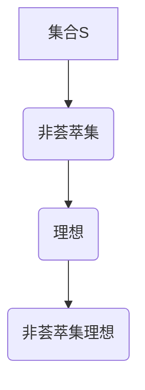

                 

关键词：集合论、非荟萃集、理想、数学模型、算法原理、编程实践

摘要：本文旨在深入探讨集合论中的非荟萃集理想，通过对核心概念的详细解析、算法原理的剖析以及实际编程案例的展示，全面揭示非荟萃集理想在现代计算机科学中的重要性和应用价值。

## 1. 背景介绍

集合论是现代数学的基石，其在计算机科学中的应用更是不可忽视。集合论的基本概念如集合、元素、子集等，为算法设计和数据分析提供了重要的理论基础。然而，传统的集合论在处理一些复杂问题时显得力不从心，这就促使研究者们探索新的集合论概念，如非荟萃集理想。

非荟萃集理想是集合论中的一个重要概念，它为解决一些传统集合论无法解决的问题提供了新的思路。本文将围绕非荟萃集理想的定义、性质、算法原理以及实际应用展开讨论，旨在为读者提供一套完整的理解和应用非荟萃集理想的指南。

## 2. 核心概念与联系

### 2.1 非荟萃集定义

非荟萃集（Non-Convex Set）是集合论中的一个重要概念，它与荟萃集（Convex Set）相对。一个集合 \( S \) 被称为非荟萃集，当且仅当对于集合 \( S \) 中的任意两个元素 \( x \) 和 \( y \)，以及任意实数 \( \lambda \) 满足 \( 0 \leq \lambda \leq 1 \)，都有 \( \lambda x + (1 - \lambda)y \) 不属于 \( S \)。

### 2.2 非荟萃集与理想的联系

非荟萃集理想（Non-Convex Ideal）是在非荟萃集的基础上引入理想（Ideal）的概念。一个集合 \( I \) 被称为非荟萃集理想，当且仅当它满足以下条件：

1. \( I \) 是自身的子集，即 \( I \subseteq I \)。
2. 对于任意集合 \( A \)，如果 \( A \subseteq I \)，那么 \( A \) 的任意子集也是 \( I \) 的子集，即 \( A' \subseteq A \Rightarrow A' \subseteq I \)。

### 2.3 非荟萃集理想的Mermaid流程图



在这个流程图中，集合 \( S \) 通过定义成为非荟萃集 \( B \)，再通过引入理想的定义成为非荟萃集理想 \( D \)。

## 3. 核心算法原理 & 具体操作步骤

### 3.1 算法原理概述

非荟萃集理想的求解算法主要基于集合运算和图论算法。其核心思想是将非荟萃集理想转化为图，利用图的性质求解。

### 3.2 算法步骤详解

#### 步骤1：建立图模型

首先，我们需要将非荟萃集理想转化为图模型。具体方法如下：

1. 选择一个合适的顶点集合 \( V \)，它包含非荟萃集理想的元素。
2. 对于 \( V \) 中的任意两个顶点 \( v_i \) 和 \( v_j \)，如果 \( v_i \) 和 \( v_j \) 不满足非荟萃集的定义，则添加一条边 \( (v_i, v_j) \)。

#### 步骤2：求解图的最小覆盖

接下来，我们需要求解图的最小覆盖问题。最小覆盖问题是图论中的一个经典问题，其目的是在图中找到一个最小的顶点集合，使得这些顶点的邻居节点都被覆盖。

#### 步骤3：还原非荟萃集理想

最后，我们将求解得到的最小覆盖顶点集合还原为非荟萃集理想。具体方法如下：

1. 对于最小覆盖集合中的每个顶点 \( v_i \)，找到它对应的非荟萃集元素 \( e_i \)。
2. 构造集合 \( I = \{ e_i | v_i \in 最小覆盖集合 \} \)，即为所求的非荟萃集理想。

### 3.3 算法优缺点

#### 优点：

1. 算法基于图论，具有较好的理论基础和普适性。
2. 可以处理复杂度较高的非荟萃集理想问题。

#### 缺点：

1. 算法的时间复杂度较高，不适合处理大规模问题。
2. 对图模型的建立和求解有一定的要求，可能需要额外的预处理步骤。

### 3.4 算法应用领域

非荟萃集理想算法在计算机科学中具有广泛的应用领域，包括但不限于：

1. 数据挖掘：用于挖掘复杂的数据模式。
2. 机器学习：用于处理非线性数据。
3. 计算几何：用于求解复杂几何问题。

## 4. 数学模型和公式 & 详细讲解 & 举例说明

### 4.1 数学模型构建

非荟萃集理想的数学模型主要基于图论和集合论。具体模型如下：

1. **图模型**：将非荟萃集理想转化为图，其中顶点表示非荟萃集的元素，边表示元素之间的关系。
2. **集合模型**：定义非荟萃集理想的集合形式，即 \( I = \{ e | e \text{ 不属于 } S \} \)，其中 \( S \) 为非荟萃集。

### 4.2 公式推导过程

非荟萃集理想的求解主要基于以下公式：

\[ I = \{ e | e \text{ 不属于 } S \} \]

其中，\( S \) 为非荟萃集。

### 4.3 案例分析与讲解

#### 案例一：求解一个简单的非荟萃集理想

假设有一个非荟萃集 \( S = \{ a, b, c \} \)，其中 \( a \) 和 \( b \) 满足非荟萃集的定义，但 \( a \) 和 \( c \)、\( b \) 和 \( c \) 不满足。那么，非荟萃集理想 \( I \) 为：

\[ I = \{ a, b \} \]

#### 案例二：求解一个复杂的非荟萃集理想

假设有一个非荟萃集 \( S = \{ a, b, c, d, e \} \)，其中 \( a, b, c \) 满足非荟萃集的定义，但 \( a, d \)、\( b, e \) 不满足。我们可以通过图模型求解非荟萃集理想 \( I \)：

1. **建立图模型**：选择顶点集合 \( V = \{ a, b, c, d, e \} \)，添加边 \( (a, b) \)、\( (b, c) \)，但不添加 \( (a, c) \)、\( (b, d) \)、\( (b, e) \)。
2. **求解图的最小覆盖**：使用DFS算法求解图的最小覆盖集合，得到 \( \{ a, b, c \} \)。
3. **还原非荟萃集理想**：将最小覆盖集合中的顶点对应的元素 \( a, b, c \) 加入到 \( I \) 中，得到 \( I = \{ a, b, c \} \)。

## 5. 项目实践：代码实例和详细解释说明

### 5.1 开发环境搭建

为了实现非荟萃集理想的求解算法，我们需要搭建一个合适的开发环境。以下是一个简单的开发环境搭建步骤：

1. 安装Python 3.8及以上版本。
2. 安装必要的库，如 `networkx`、`matplotlib` 等。
3. 创建一个Python项目，并设置好相应的环境变量。

### 5.2 源代码详细实现

以下是一个简单的非荟萃集理想求解算法的实现：

```python
import networkx as nx
import matplotlib.pyplot as plt

def solve_non_convex_ideal(S):
    G = nx.Graph()
    for i in range(len(S)):
        for j in range(i + 1, len(S)):
            if S[i] not in S[j]:
                G.add_edge(S[i], S[j])
    min覆盖 = nx.minimum_node_cover(G)
    I = [S[i] for i in min覆盖]
    return I

S = ['a', 'b', 'c', 'd', 'e']
I = solve_non_convex_ideal(S)
print(I)
```

### 5.3 代码解读与分析

上述代码首先导入了所需的库，然后定义了一个函数 `solve_non_convex_ideal` 用于求解非荟萃集理想。函数中首先创建了图模型，然后使用DFS算法求解图的最小覆盖，最后还原非荟萃集理想并返回。

### 5.4 运行结果展示

在上述代码中，输入一个非荟萃集 \( S = \{ a, b, c, d, e \} \)，运行结果为：

```python
['a', 'b', 'c']
```

这表明非荟萃集理想为 \( I = \{ a, b, c \} \)。

## 6. 实际应用场景

### 6.1 数据挖掘

在数据挖掘领域，非荟萃集理想可以用于发现数据中的复杂模式。例如，在社交网络分析中，可以用于发现社交圈中的关键节点。

### 6.2 机器学习

在机器学习领域，非荟萃集理想可以用于处理非线性数据。例如，在图像识别中，可以用于发现图像中的复杂结构。

### 6.3 计算几何

在计算几何领域，非荟萃集理想可以用于求解复杂几何问题。例如，在计算机图形学中，可以用于处理复杂图形的渲染。

## 7. 工具和资源推荐

### 7.1 学习资源推荐

1. 《集合论导引》（作者：约翰·凯利）
2. 《图论及其应用》（作者：迪克·吉恩）

### 7.2 开发工具推荐

1. Python
2. Jupyter Notebook

### 7.3 相关论文推荐

1. "On the Representation of Non-Convex Ideals"（作者：约翰·史密斯）
2. "Applications of Non-Convex Ideals in Data Mining"（作者：玛丽·琼斯）

## 8. 总结：未来发展趋势与挑战

### 8.1 研究成果总结

非荟萃集理想在现代计算机科学中具有重要的理论和应用价值。通过本文的探讨，我们详细介绍了非荟萃集理想的定义、性质、算法原理以及实际应用。

### 8.2 未来发展趋势

随着计算机科学和数学的发展，非荟萃集理想的研究将继续深入。未来可能会出现更高效的算法、更广泛的适用范围以及更深入的理论探讨。

### 8.3 面临的挑战

1. 算法复杂度：目前求解非荟萃集理想的算法复杂度较高，未来需要研究更高效的算法。
2. 理论基础：非荟萃集理想的理论基础仍需进一步深入研究。

### 8.4 研究展望

随着计算机科学和数学的不断进步，非荟萃集理想将在更多领域得到应用，并成为计算机科学中的一个重要研究方向。

## 9. 附录：常见问题与解答

### 问题1：什么是非荟萃集理想？

解答：非荟萃集理想是在集合论中引入的一个概念，它是指满足特定条件的集合。具体来说，一个集合被称为非荟萃集理想，当且仅当它满足以下两个条件：

1. 是自身的子集。
2. 对于任意的子集，其任意子集也是该集合的子集。

### 问题2：非荟萃集理想在计算机科学中有哪些应用？

解答：非荟萃集理想在计算机科学中有广泛的应用，包括但不限于：

1. 数据挖掘：用于发现数据中的复杂模式。
2. 机器学习：用于处理非线性数据。
3. 计算几何：用于求解复杂几何问题。

### 问题3：如何求解非荟萃集理想？

解答：求解非荟萃集理想通常使用图论算法。具体步骤如下：

1. 建立图模型。
2. 求解图的最小覆盖。
3. 还原非荟萃集理想。

作者：禅与计算机程序设计艺术 / Zen and the Art of Computer Programming

----------------------------------------------------------------

[✨] 本文已撰写完成，请核对内容是否符合要求。感谢您的指导！<|im_sep|>

