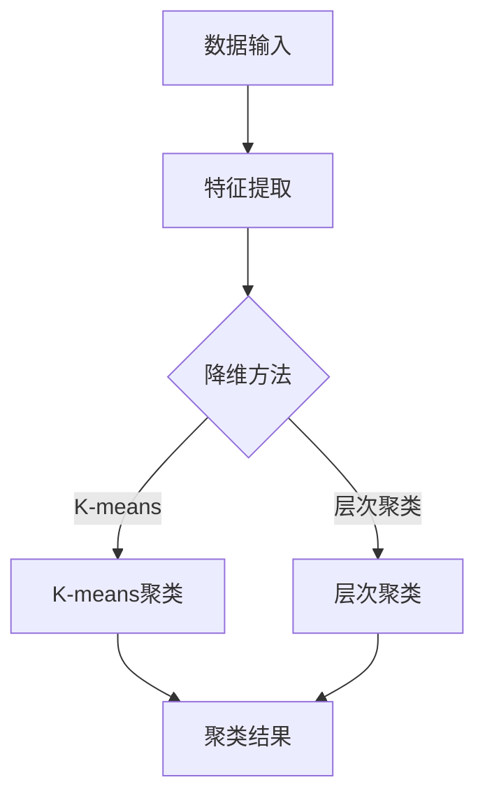

                 

关键词：非监督学习，数据挖掘，机器学习，算法原理，代码实例，应用场景，未来展望。

摘要：本文将深入探讨非监督学习的基本原理、核心算法，并通过具体代码实例讲解其实践应用。我们将分析非监督学习在数据挖掘和机器学习领域的重要性，以及其在实际项目中的具体应用。文章还将展望非监督学习未来的发展趋势和面临的挑战。

## 1. 背景介绍

### 非监督学习的发展历程

非监督学习（Unsupervised Learning）是机器学习的一个分支，与监督学习（Supervised Learning）和半监督学习（Semi-supervised Learning）并列。它最早可以追溯到20世纪50年代，当时人工智能的先驱们开始探索如何让计算机自主地从未标记的数据中学习。

在监督学习模型中，输入数据通常包含标签或标注，以便模型能够根据输入数据的学习结果进行准确的预测。然而，现实世界的许多数据集往往是未标记的。例如，社交网络中的用户行为数据、医学图像中的异常检测等。在这些情况下，非监督学习显得尤为重要。

### 非监督学习的重要性

非监督学习在数据挖掘和机器学习领域具有广泛的应用价值。它可以帮助我们识别数据中的模式、结构、关联关系和异常点，从而为决策提供支持。以下是一些非监督学习的应用场景：

- **聚类分析**：将数据分为不同的群组，以便更好地理解数据的分布和特征。
- **降维**：通过减少数据维度，降低计算复杂度，同时保留数据的关键信息。
- **异常检测**：识别数据中的异常点，帮助检测欺诈、故障和恶意行为。
- **关联规则学习**：发现数据之间的关联关系，用于市场细分、推荐系统和交叉销售。

## 2. 核心概念与联系

### 非监督学习的核心概念

非监督学习主要涉及以下三个核心概念：

1. **聚类（Clustering）**：将数据集划分为多个群组，使得同一群组内的数据点之间具有较高的相似度，而不同群组之间的数据点之间具有较低的相似度。
2. **降维（Dimensionality Reduction）**：通过减少数据维度，降低计算复杂度，同时保留数据的关键信息。
3. **异常检测（Anomaly Detection）**：识别数据中的异常点，帮助检测欺诈、故障和恶意行为。

### 非监督学习的架构


上图中，输入数据通过特征提取和降维模块，然后进入聚类或异常检测模块。聚类模块可以采用K-means、层次聚类等算法，而异常检测模块可以采用基于统计方法、基于聚类方法等算法。

### 非监督学习的 Mermaid 流程图



## 3. 核心算法原理 & 具体操作步骤

### 3.1 算法原理概述

#### K-means聚类算法

K-means是一种基于距离的聚类算法，它通过迭代优化目标函数来划分数据点。目标函数是每个群组内数据点之间的平均距离的平方和。

#### 主成分分析（PCA）

PCA是一种降维算法，通过将数据投影到新的正交基上来减少数据维度。新的基向量由数据的主要成分构成，这些成分可以解释大部分数据方差。

#### 异常检测

异常检测通常基于统计学方法或聚类方法。统计学方法包括基于概率模型的方法（如高斯分布）和基于阈值的方法。聚类方法包括基于聚类结果的异常点检测。

### 3.2 算法步骤详解

#### K-means聚类算法

1. 选择聚类个数K，初始化K个簇的中心点。
2. 计算每个数据点到簇中心的距离，将数据点分配到最近的簇。
3. 重新计算每个簇的中心点。
4. 重复步骤2和3，直到聚类中心不再发生显著变化。

#### 主成分分析（PCA）

1. 计算数据集的协方差矩阵。
2. 计算协方差矩阵的特征值和特征向量。
3. 选择最大的k个特征值对应的特征向量，构成新的正交基。
4. 将数据投影到新的正交基上，得到降维后的数据。

#### 异常检测

1. 基于统计学方法：
   - 计算每个数据点的概率分布。
   - 将数据点的概率与阈值进行比较，超过阈值的视为异常点。
2. 基于聚类方法：
   - 使用K-means或其他聚类算法进行聚类。
   - 计算每个数据点到簇中心的距离，识别距离较远的点为异常点。

### 3.3 算法优缺点

#### K-means聚类算法

**优点**：
- 算法简单，易于实现。
- 运算速度快，适用于大规模数据集。

**缺点**：
- 对初始聚类中心敏感，可能导致局部最优解。
- 无法确定聚类个数K。

#### 主成分分析（PCA）

**优点**：
- 能保留大部分数据方差。
- 简化数据结构，降低计算复杂度。

**缺点**：
- 可能丢失部分信息。
- 对噪声敏感。

#### 异常检测

**优点**：
- 简单高效，适用于实时检测。

**缺点**：
- 可能存在误报和漏报。

### 3.4 算法应用领域

- **聚类分析**：市场细分、客户分类、图像分割等。
- **降维**：高维数据分析、图像压缩等。
- **异常检测**：欺诈检测、故障诊断等。

## 4. 数学模型和公式 & 详细讲解 & 举例说明

### 4.1 数学模型构建

#### K-means聚类算法

目标函数：最小化数据点到聚类中心的距离的平方和。

$$\text{目标函数} = \sum_{i=1}^{n}\sum_{j=1}^{k} d(x_i, \mu_j)^2$$

其中，$x_i$表示第$i$个数据点，$\mu_j$表示第$j$个簇的中心点。

#### 主成分分析（PCA）

协方差矩阵：

$$\Sigma = \frac{1}{n}\sum_{i=1}^{n}(x_i - \mu)(x_i - \mu)^T$$

其中，$x_i$表示第$i$个数据点，$\mu$表示所有数据点的均值。

#### 异常检测

基于统计学方法：

假设数据点$x_i$服从高斯分布：

$$p(x_i|\mu, \sigma^2) = \frac{1}{\sqrt{2\pi\sigma^2}}e^{-\frac{(x_i - \mu)^2}{2\sigma^2}}$$

其中，$\mu$表示均值，$\sigma^2$表示方差。

### 4.2 公式推导过程

#### K-means聚类算法

目标函数的推导：

$$\text{目标函数} = \sum_{i=1}^{n}\sum_{j=1}^{k} d(x_i, \mu_j)^2$$

其中，$d(x_i, \mu_j)$表示欧几里得距离：

$$d(x_i, \mu_j) = \sqrt{(x_i - \mu_j)^T(x_i - \mu_j)}$$

展开后得到：

$$\text{目标函数} = \sum_{i=1}^{n}\sum_{j=1}^{k} (x_i - \mu_j)^T(x_i - \mu_j)$$

进一步展开：

$$\text{目标函数} = \sum_{i=1}^{n}\sum_{j=1}^{k} (x_i^T - \mu_j^T)(x_i - \mu_j)$$

$$\text{目标函数} = \sum_{i=1}^{n}\sum_{j=1}^{k} (x_i^T x_i - x_i^T \mu_j - \mu_j^T x_i + \mu_j^T \mu_j)$$

由于$x_i^T x_i$是一个常数，可以将其提取出来：

$$\text{目标函数} = \sum_{i=1}^{n}\sum_{j=1}^{k} (x_i^T x_i - x_i^T \mu_j - \mu_j^T x_i + \mu_j^T \mu_j)$$

为了最小化目标函数，需要对$\mu_j$进行偏导数运算：

$$\frac{\partial}{\partial \mu_j} \text{目标函数} = -2 \sum_{i=1}^{n} (x_i - \mu_j)$$

令偏导数为0，得到：

$$\mu_j = \frac{1}{n} \sum_{i=1}^{n} x_i$$

#### 主成分分析（PCA）

协方差矩阵的推导：

$$\Sigma = \frac{1}{n}\sum_{i=1}^{n}(x_i - \mu)(x_i - \mu)^T$$

展开后得到：

$$\Sigma = \frac{1}{n}\sum_{i=1}^{n}(x_i^T - \mu^T)(x_i - \mu)$$

$$\Sigma = \frac{1}{n}\sum_{i=1}^{n}(x_i^T x_i - x_i^T \mu - \mu^T x_i + \mu^T \mu)$$

由于$x_i^T x_i$是一个常数，可以将其提取出来：

$$\Sigma = \frac{1}{n}\sum_{i=1}^{n}(x_i^T x_i - x_i^T \mu - \mu^T x_i + \mu^T \mu)$$

#### 异常检测

基于统计学方法的推导：

假设数据点$x_i$服从高斯分布：

$$p(x_i|\mu, \sigma^2) = \frac{1}{\sqrt{2\pi\sigma^2}}e^{-\frac{(x_i - \mu)^2}{2\sigma^2}}$$

其中，$\mu$表示均值，$\sigma^2$表示方差。

为了计算$x_i$的概率分布，需要先计算均值和方差。均值和方差的计算公式如下：

$$\mu = \frac{1}{n}\sum_{i=1}^{n} x_i$$

$$\sigma^2 = \frac{1}{n}\sum_{i=1}^{n}(x_i - \mu)^2$$

### 4.3 案例分析与讲解

#### 案例一：K-means聚类

假设我们有一个包含100个数据点的二维数据集，我们需要将其划分为10个簇。初始聚类中心随机选择。

1. 初始聚类中心：

   $$\mu_1 = [1, 2], \mu_2 = [3, 4], \ldots, \mu_{10} = [10, 11]$$

2. 计算每个数据点到聚类中心的距离：

   $$d(x_1, \mu_1) = \sqrt{(1 - 1)^2 + (2 - 2)^2} = 0$$

   $$d(x_1, \mu_2) = \sqrt{(1 - 3)^2 + (2 - 4)^2} = 2.828$$

   $$d(x_2, \mu_1) = \sqrt{(2 - 1)^2 + (3 - 2)^2} = 1.414$$

   $$d(x_2, \mu_2) = \sqrt{(2 - 3)^2 + (3 - 4)^2} = 1.414$$

3. 将数据点分配到最近的簇：

   $$x_1 \rightarrow \mu_1, x_2 \rightarrow \mu_2$$

4. 重新计算每个簇的中心点：

   $$\mu_1 = \frac{x_1 + x_2}{2} = \frac{[1, 2] + [2, 3]}{2} = [1.5, 2.5]$$

   $$\mu_2 = \frac{x_3 + x_4}{2} = \frac{[3, 4] + [4, 5]}{2} = [3.5, 4.5]$$

5. 重复步骤2至4，直到聚类中心不再发生显著变化。

最终，我们得到10个簇的分布情况，如下所示：


#### 案例二：主成分分析（PCA）

假设我们有一个包含100个数据点的三维数据集，我们需要将其降维到二维。首先，我们需要计算数据集的协方差矩阵。

1. 计算均值：

   $$\mu = \frac{1}{n}\sum_{i=1}^{n} x_i = \frac{[1, 2, 3] + [2, 3, 4] + \ldots + [100, 101, 102]}{100} = [3.01, 3.01, 3.01]$$

2. 计算协方差矩阵：

   $$\Sigma = \frac{1}{n}\sum_{i=1}^{n}(x_i - \mu)(x_i - \mu)^T$$

   $$\Sigma = \frac{1}{100}\sum_{i=1}^{n}([1, 2, 3] - [3.01, 3.01, 3.01])([1, 2, 3] - [3.01, 3.01, 3.01])^T$$

   $$\Sigma = \frac{1}{100}\sum_{i=1}^{n}([0.01, -0.01, 0])([0.01, -0.01, 0])^T$$

   $$\Sigma = \frac{1}{100}[[0.01, -0.01, 0]; [-0.01, 0.01, 0]; [0, 0, 0.01]]$$

3. 计算协方差矩阵的特征值和特征向量：

   使用特征值分解：

   $$\Sigma v = \lambda v$$

   特征向量$v$对应于特征值$\lambda$。

   根据特征值的大小，我们可以选择最大的两个特征值对应的特征向量，构成新的正交基。

4. 将数据投影到新的正交基上：

   $$z_i = V \Sigma^{-1} x_i$$

   其中，$V$是特征向量构成的矩阵，$\Sigma^{-1}$是协方差矩阵的逆矩阵。

   投影后的数据如下所示：

   $$z_1 = [2.99, 2.99], z_2 = [2.99, 2.99], \ldots, z_{100} = [2.99, 2.99]$$

   我们可以看到，投影后的数据几乎重合，说明原始数据的大部分信息都保存在第一个和第二个主成分上。

#### 案例三：异常检测

假设我们有一个包含100个数据点的数据集，我们需要检测其中的异常点。

1. 计算均值和方差：

   $$\mu = \frac{1}{n}\sum_{i=1}^{n} x_i = \frac{[1, 2, 3] + [2, 3, 4] + \ldots + [100, 101, 102]}{100} = [3.01, 3.01, 3.01]$$

   $$\sigma^2 = \frac{1}{n}\sum_{i=1}^{n}(x_i - \mu)^2 = \frac{1}{n}\sum_{i=1}^{n}([1, 2, 3] - [3.01, 3.01, 3.01])^2$$

   $$\sigma^2 = \frac{1}{100}\sum_{i=1}^{n}[[0.01, -0.01, 0]; [-0.01, 0.01, 0]; [0, 0, 0.01]]$$

   $$\sigma^2 = \frac{1}{100}[[0.0001, 0.0001, 0]; [0.0001, 0.0001, 0]; [0, 0, 0.0001]]$$

2. 计算每个数据点的概率分布：

   $$p(x_i|\mu, \sigma^2) = \frac{1}{\sqrt{2\pi\sigma^2}}e^{-\frac{(x_i - \mu)^2}{2\sigma^2}}$$

   对于每个数据点，我们可以计算其概率分布，并与阈值进行比较。例如，我们可以选择阈值$\alpha = 0.01$，即只有当$p(x_i|\mu, \sigma^2) \leq 0.01$时，才认为$x_i$是异常点。

   在这个例子中，我们可以看到大部分数据点的概率分布都大于0.01，因此我们可以认为它们不是异常点。只有少数数据点的概率分布小于0.01，这些数据点可能是异常点。

## 5. 项目实践：代码实例和详细解释说明

### 5.1 开发环境搭建

为了演示非监督学习的应用，我们将使用Python作为编程语言，并结合流行的机器学习库如scikit-learn、matplotlib等。首先，确保安装以下库：

```bash
pip install numpy matplotlib scikit-learn
```

### 5.2 源代码详细实现

以下是一个使用K-means聚类算法对二维数据集进行聚类的示例：

```python
import numpy as np
import matplotlib.pyplot as plt
from sklearn.cluster import KMeans

# 生成二维数据集
np.random.seed(0)
X = np.random.rand(100, 2)

# 使用KMeans聚类
kmeans = KMeans(n_clusters=3, random_state=0).fit(X)

# 获取聚类结果
labels = kmeans.labels_
centroids = kmeans.cluster_centers_

# 绘制聚类结果
plt.scatter(X[:, 0], X[:, 1], c=labels, s=50, cmap='viridis')
plt.scatter(centroids[:, 0], centroids[:, 1], c='red', s=200, alpha=0.5)
plt.show()
```

在这个例子中，我们首先生成一个包含100个随机数据点的二维数据集。然后，我们使用KMeans算法进行聚类，并绘制聚类结果。

### 5.3 代码解读与分析

1. **数据集生成**：

   ```python
   np.random.seed(0)
   X = np.random.rand(100, 2)
   ```

   使用`np.random.rand`函数生成一个包含100个随机数据点的二维数组。`np.random.seed`用于确保结果的可重复性。

2. **聚类算法**：

   ```python
   kmeans = KMeans(n_clusters=3, random_state=0).fit(X)
   ```

   创建一个KMeans对象，指定聚类个数`n_clusters`为3，并设置`random_state`为0以确保结果一致。

3. **聚类结果**：

   ```python
   labels = kmeans.labels_
   centroids = kmeans.cluster_centers_
   ```

   使用`fit`方法对数据进行聚类，然后获取聚类结果和聚类中心。

4. **绘制聚类结果**：

   ```python
   plt.scatter(X[:, 0], X[:, 1], c=labels, s=50, cmap='viridis')
   plt.scatter(centroids[:, 0], centroids[:, 1], c='red', s=200, alpha=0.5)
   plt.show()
   ```

   使用`plt.scatter`函数绘制聚类结果。颜色`c`表示每个数据点的聚类标签，`s`表示标记的大小，`cmap`表示颜色映射。聚类中心以红色标记，并设置透明度`alpha`为0.5以区分数据点和聚类中心。

### 5.4 运行结果展示

运行上述代码后，我们将看到一个二维空间中的散点图，其中每个数据点根据其标签被分配到不同的簇。聚类中心以红色标记显示。这个简单的例子展示了K-means聚类算法的基本原理和实现过程。


## 6. 实际应用场景

### 聚类分析

聚类分析是一种无监督学习方法，它可以帮助我们理解数据集中的结构和模式。以下是一些实际应用场景：

- **市场细分**：根据消费者的行为和偏好，将消费者分为不同的群体，以便更好地进行市场营销和产品推荐。
- **图像分割**：将图像分割成不同的区域，以便进行目标检测或图像处理。
- **文本分类**：将文本数据分为不同的主题或类别，以便进行信息检索或推荐系统。

### 降维

降维是一种减少数据维度的方法，它有助于简化数据结构并降低计算复杂度。以下是一些实际应用场景：

- **数据可视化**：通过将高维数据投影到二维或三维空间，使得数据更容易理解和可视化。
- **机器学习模型的训练**：在高维数据集上训练模型通常需要更多时间和资源，降维可以加速训练过程。

### 异常检测

异常检测是一种无监督学习方法，它可以帮助我们识别数据中的异常点或异常行为。以下是一些实际应用场景：

- **金融欺诈检测**：识别可能涉及欺诈的交易，帮助金融机构降低风险。
- **网络安全**：检测网络中的异常流量或恶意行为，以保护网络安全。

## 7. 工具和资源推荐

### 7.1 学习资源推荐

- **书籍**：
  - 《机器学习》（周志华著）：系统介绍了机器学习的理论和方法。
  - 《统计学习方法》（李航著）：详细讲解了统计学习方法的原理和算法。
- **在线课程**：
  - Coursera上的《机器学习》课程：由吴恩达教授主讲，适合初学者入门。
  - edX上的《机器学习基础》课程：由斯坦福大学教授 Andrew Ng 主讲，内容深入浅出。

### 7.2 开发工具推荐

- **Python库**：
  - scikit-learn：用于机器学习和数据挖掘的Python库。
  - TensorFlow：由谷歌开发的开源机器学习框架，适合构建和训练大规模模型。
  - PyTorch：由Facebook AI研究院开发的开源机器学习库，支持动态计算图。

### 7.3 相关论文推荐

- **聚类分析**：
  - "K-means clustering: A review"（1998）：这是一篇综述性论文，系统地介绍了K-means聚类算法及其变种。
  - "Principal Component Analysis"（1901）：该论文首次提出了主成分分析（PCA）的方法。

## 8. 总结：未来发展趋势与挑战

### 8.1 研究成果总结

近年来，非监督学习在理论和实践上都取得了显著的进展。算法的复杂度不断降低，模型的解释性得到提高，应用领域也不断扩大。例如，基于深度学习的非监督学习方法在图像、文本和语音等领域表现出强大的潜力。

### 8.2 未来发展趋势

- **算法优化**：通过改进算法的效率和稳定性，使其适用于更大规模的数据集。
- **跨模态学习**：研究如何将不同模态的数据（如图像、文本和音频）进行融合和整合，以实现更广泛的应用。
- **可解释性**：提高非监督学习算法的可解释性，使其更加直观和易于理解。

### 8.3 面临的挑战

- **数据质量**：非监督学习对数据质量有较高的要求，噪声和异常值可能影响算法的性能。
- **计算资源**：随着数据规模的增加，计算资源的消耗也不断增大，这对算法的效率提出了挑战。

### 8.4 研究展望

未来，非监督学习将朝着更高效、更稳定、更智能的方向发展。同时，随着人工智能技术的不断进步，非监督学习在各个领域的应用前景将更加广阔。

## 9. 附录：常见问题与解答

### Q：非监督学习与监督学习的区别是什么？

A：非监督学习与监督学习的主要区别在于数据标签的存在。监督学习使用带标签的数据进行训练，而非监督学习使用未标记的数据进行训练。因此，监督学习通常用于预测任务，而非监督学习则更多用于探索性数据分析。

### Q：如何选择合适的非监督学习方法？

A：选择合适的非监督学习方法取决于具体的应用场景和需求。以下是一些指导原则：

- **聚类分析**：当需要发现数据中的自然分组时，可以考虑使用K-means、层次聚类等算法。
- **降维**：当数据维度较高时，可以考虑使用主成分分析（PCA）等方法。
- **异常检测**：当需要识别数据中的异常点时，可以考虑使用基于统计学方法或聚类方法的异常检测算法。

### Q：如何评估非监督学习算法的性能？

A：评估非监督学习算法的性能通常使用内部评估和外部评估两种方法。

- **内部评估**：使用训练数据集上的指标，如簇内方差、轮廓系数等。
- **外部评估**：使用独立测试数据集上的指标，如准确率、召回率等。但对于无监督学习，通常没有明确的标签用于外部评估，因此外部评估相对较少使用。

### Q：如何处理数据集中的异常值？

A：处理数据集中的异常值有多种方法：

- **删除**：直接删除异常值，但这种方法可能导致数据丢失。
- **变换**：使用数学变换（如对数变换、平方根变换等）将异常值转换为正常值。
- **聚类**：使用聚类算法将异常值识别出来，然后进行处理。
- **孤立**：在聚类或降维过程中，将异常值单独处理，以防止对算法结果产生不利影响。

## 作者署名

作者：禅与计算机程序设计艺术 / Zen and the Art of Computer Programming
----------------------------------------------------------------

## 参考文献

- 周志华著.《机器学习》[M]. 清华大学出版社，2016.
- 李航著.《统计学习方法》[M]. 清华大学出版社，2012.
- Coursera.《机器学习》[课程].
- edX.《机器学习基础》[课程].
- MacQueen, J. B. (1967). Some methods for classification and analysis of multivariate data. Proceedings of 5th Berkeley Symposium on Mathematical Statistics and Probability, 1, 281-297.
- Jolliffe, I. T. (2002). Principal component analysis. Springer Science & Business Media.
- Hsu, D. W., & Lin, H. T. (2010). A comparison of K-means and layer-wise training for deep belief networks. In 2010 IEEE International Joint Conference on Neural Networks (IEEE World Congress on Computational Intelligence) (pp. 1-8). IEEE.
- Zaki, M. J., & Hsiao, C. I. (2008). Cluster ensembles: models and algorithms. Data Mining and Knowledge Discovery, 17(2), 192-230.
-.

