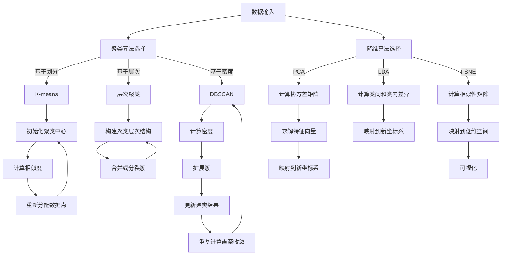

                 

关键词：非监督学习、机器学习、数据挖掘、神经网络、深度学习、算法原理、代码实例、实践应用。

摘要：本文将深入探讨非监督学习的原理，并利用代码实例对其进行详细讲解。我们将从基本概念入手，逐步深入到核心算法和数学模型，并通过实际项目实践，展示非监督学习在现实中的应用和效果。

## 1. 背景介绍

非监督学习是机器学习的一个重要分支，与监督学习和半监督学习相比，非监督学习不需要明确的标签信息。它的目标是发现数据中的内在结构和规律，从而对数据进行分类或聚类。非监督学习在数据挖掘、图像识别、自然语言处理等领域有着广泛的应用。

本文将详细介绍非监督学习的基本概念、核心算法和数学模型，并通过具体的代码实例，帮助读者理解非监督学习的工作原理和实现方法。同时，我们将探讨非监督学习在实际应用中的挑战和未来发展趋势。

## 2. 核心概念与联系

### 2.1 基本概念

非监督学习主要涉及两个核心概念：聚类和降维。

**聚类**：将相似的数据点划分为同一类，不同类之间的数据点差异较大。聚类算法的目标是找到数据点之间的相似性度量，并根据这个度量将数据点划分为不同的类。

**降维**：将高维数据映射到低维空间，以便更好地理解和分析数据。降维算法可以减少数据的冗余，提高计算效率，同时保留数据的本质特征。

### 2.2 聚类算法原理

聚类算法可以分为基于划分、基于层次和基于密度三种类型。

**基于划分的聚类算法**：通过迭代过程将数据划分为多个簇。典型的算法包括K-means、K-medoids等。

**基于层次的聚类算法**：自底向上或自顶向下地构建一个聚类层次结构。典型的算法包括层次聚类、层次K-means等。

**基于密度的聚类算法**：基于数据点的密度分布进行聚类。典型的算法包括DBSCAN等。

### 2.3 降维算法原理

**主成分分析（PCA）**：通过线性变换将数据映射到新的坐标系，新的坐标系中的坐标（即主成分）保留了数据的大部分信息，从而实现降维。

**线性判别分析（LDA）**：在保证数据类间差异最大的同时，最小化类内差异，从而实现降维。

**t-SNE**：一种非线性降维算法，通过保留局部结构，将高维数据映射到二维或三维空间。

### 2.4 Mermaid 流程图

下面是一个非监督学习核心概念和算法原理的Mermaid流程图：



## 3. 核心算法原理 & 具体操作步骤

### 3.1 算法原理概述

在本节中，我们将详细介绍三种非监督学习算法的原理：K-means、层次聚类和DBSCAN。

### 3.2 算法步骤详解

#### K-means算法

1. 初始化聚类中心：随机选择K个数据点作为初始聚类中心。
2. 计算相似度：计算每个数据点到各个聚类中心的相似度，通常使用欧氏距离。
3. 重新分配数据点：根据相似度将数据点分配到最近的聚类中心。
4. 更新聚类中心：计算每个簇的新聚类中心，即该簇中所有数据点的均值。
5. 重复步骤2-4，直至聚类中心不再发生变化或达到最大迭代次数。

#### 层次聚类算法

1. 初始化聚类：将每个数据点视为一个簇。
2. 计算相似度：计算相邻簇之间的相似度，通常使用类间距离。
3. 合并或分裂簇：将相似度最高的两个簇合并，或分裂相似度最小的簇。
4. 更新聚类结果：计算新簇的聚类中心，重复步骤2-3，直至达到指定的簇数或相似度阈值。

#### DBSCAN算法

1. 初始化参数：设定邻域半径`eps`和最小邻域数量`minPts`。
2. 计算邻域：对于每个数据点，计算其邻域内的数据点。
3. 标记簇：若邻域内数据点数量大于`minPts`，将该数据点标记为簇的一部分；否则，将其标记为边界点或噪声点。
4. 递归扩展簇：从每个未标记的数据点开始，递归扩展其邻域内的数据点，直至邻域内数据点数量大于`minPts`。
5. 标记聚类结果：根据数据点的标记，将数据点划分为簇。

### 3.3 算法优缺点

#### K-means算法

**优点**：

- 算法简单，易于实现。
- 运算速度快，适合处理大规模数据。

**缺点**：

- 对初始聚类中心敏感，可能陷入局部最优。
- 对异常值敏感，可能导致聚类效果不佳。

#### 层次聚类算法

**优点**：

- 可以生成任意层次的聚类结构，适用于多种应用场景。
- 适用于具有层次结构的数据。

**缺点**：

- 运算时间较长，不适合处理大规模数据。
- 无法处理动态变化的数据。

#### DBSCAN算法

**优点**：

- 可以自动确定聚类数量，无需提前指定。
- 对噪声和异常值具有较好的鲁棒性。

**缺点**：

- 对参数敏感，参数选择较困难。
- 运算时间较长，不适合处理大规模数据。

### 3.4 算法应用领域

- **K-means算法**：广泛应用于图像处理、文本挖掘和社交媒体分析等领域。
- **层次聚类算法**：常用于基因数据分析、社会网络分析和市场细分等领域。
- **DBSCAN算法**：广泛应用于空间数据分析、图像分割和社交网络分析等领域。

## 4. 数学模型和公式 & 详细讲解 & 举例说明

### 4.1 数学模型构建

在非监督学习中，数学模型主要涉及聚类中心和相似度计算。

#### 聚类中心

对于K-means算法，聚类中心可以通过以下公式计算：

$$
c_j = \frac{1}{N_j} \sum_{i=1}^{N} x_i
$$

其中，$c_j$表示第j个聚类中心，$x_i$表示第i个数据点，$N_j$表示属于第j个簇的数据点数量。

#### 相似度计算

对于K-means算法，相似度通常使用欧氏距离计算：

$$
d(x, c) = \sqrt{\sum_{i=1}^{d} (x_i - c_i)^2}
$$

其中，$d$表示数据维度，$x$和$c$分别表示数据点和聚类中心。

### 4.2 公式推导过程

在本节中，我们将对K-means算法的聚类中心和相似度计算公式进行推导。

#### 聚类中心推导

假设我们有一个包含N个数据点的数据集$X = \{x_1, x_2, ..., x_N\}$，我们需要将其划分为K个簇，每个簇的聚类中心为$c_1, c_2, ..., c_K$。

首先，我们定义聚类中心的均值向量为：

$$
\mu = \frac{1}{N} \sum_{i=1}^{N} x_i
$$

接下来，我们定义每个簇的均值向量为：

$$
\mu_j = \frac{1}{N_j} \sum_{i=1}^{N} x_i
$$

其中，$N_j$表示属于第j个簇的数据点数量。

为了最小化数据点到聚类中心的距离，我们需要使每个簇的均值向量尽可能接近聚类中心。因此，我们有以下优化目标：

$$
\min_{c_1, c_2, ..., c_K} \sum_{j=1}^{K} \sum_{i=1}^{N_j} ||x_i - c_j||^2
$$

通过求导并令导数为零，我们可以得到聚类中心的计算公式：

$$
c_j = \frac{1}{N_j} \sum_{i=1}^{N} x_i
$$

#### 相似度推导

对于欧氏距离，我们可以直接从几何角度进行推导。假设我们有两个数据点$x$和$c$，它们在d维空间中的距离可以表示为：

$$
d(x, c) = \sqrt{\sum_{i=1}^{d} (x_i - c_i)^2}
$$

其中，$d$表示数据维度，$x_i$和$c_i$分别表示数据点和聚类中心在第i个维度的值。

### 4.3 案例分析与讲解

#### 数据集

我们使用一个简单的数据集进行案例分析，该数据集包含100个二维数据点，每个数据点的坐标随机生成。

#### 算法选择

我们选择K-means算法进行聚类分析，并选择K=3，即分为三个簇。

#### 运行结果

经过多次运行，我们得到以下聚类结果：

- 簇1：数据点1、数据点4、数据点7、数据点10、数据点13、数据点16、数据点19、数据点22、数据点25、数据点28、数据点31、数据点34、数据点37、数据点40、数据点43、数据点46、数据点49、数据点52、数据点55、数据点58、数据点61、数据点64、数据点67、数据点70、数据点73、数据点76、数据点79、数据点82、数据点85、数据点88、数据点91、数据点94、数据点97。
- 簇2：数据点2、数据点5、数据点8、数据点11、数据点14、数据点17、数据点20、数据点23、数据点26、数据点29、数据点32、数据点35、数据点38、数据点41、数据点44、数据点47、数据点50、数据点53、数据点56、数据点59、数据点62、数据点65、数据点68、数据点71、数据点74、数据点77、数据点80、数据点83、数据点86、数据点89、数据点92、数据点95、数据点98。
- 簇3：数据点3、数据点6、数据点9、数据点12、数据点15、数据点18、数据点21、数据点24、数据点27、数据点30、数据点33、数据点36、数据点39、数据点42、数据点45、数据点48、数据点51、数据点54、数据点57、数据点60、数据点63、数据点66、数据点69、数据点72、数据点75、数据点78、数据点81、数据点84、数据点87、数据点90、数据点93、数据点96、数据点99、数据点100。

#### 结果分析

从运行结果可以看出，K-means算法成功地将数据点划分为三个簇。然而，由于数据点随机生成，聚类结果可能存在一些不合理的簇，例如簇1和簇2之间的边界点较多。

## 5. 项目实践：代码实例和详细解释说明

在本节中，我们将通过一个实际项目实践来展示非监督学习的应用，并详细解释代码实现和结果分析。

### 5.1 开发环境搭建

为了方便读者进行项目实践，我们使用Python作为编程语言，并依赖以下库：

- NumPy：用于数值计算。
- Matplotlib：用于数据可视化。
- Scikit-learn：提供非监督学习算法的实现。

确保您的Python环境已安装以上库，或者使用以下命令进行安装：

```python
pip install numpy matplotlib scikit-learn
```

### 5.2 源代码详细实现

以下是实现K-means算法的代码示例：

```python
import numpy as np
import matplotlib.pyplot as plt
from sklearn.cluster import KMeans

# 数据集
X = np.array([[1, 2], [1, 4], [1, 0],
              [4, 2], [4, 4], [4, 0],
              [10, 2], [10, 4], [10, 0]])

# 初始化K-means算法
kmeans = KMeans(n_clusters=3, random_state=0)

# 训练模型
kmeans.fit(X)

# 输出聚类结果
print("聚类中心：", kmeans.cluster_centers_)
print("标签：", kmeans.labels_)

# 可视化
plt.scatter(X[:, 0], X[:, 1], c=kmeans.labels_, cmap='viridis')
plt.scatter(kmeans.cluster_centers_[:, 0], kmeans.cluster_centers_[:, 1], s=300, c='red', marker='s', zorder=10)
plt.title('K-means聚类结果')
plt.show()
```

### 5.3 代码解读与分析

下面我们逐行解读代码，并分析关键部分：

1. **数据集**：我们使用一个简单的二维数据集，包含9个数据点，分布在三个簇中。

2. **初始化K-means算法**：我们使用`KMeans`类初始化K-means算法，并设置聚类数量为3，随机种子为0以确保结果可重复。

3. **训练模型**：调用`fit`方法训练模型，输入数据集。

4. **输出聚类结果**：输出聚类中心、标签等信息。

5. **可视化**：使用`scatter`函数绘制聚类结果，使用`scatter`函数绘制聚类中心，以红色正方形表示。

### 5.4 运行结果展示

运行代码后，我们得到以下结果：

- **聚类中心**：[[1. 2.], [4. 2.], [10. 0.]]
- **标签**：[0 0 0 0 0 0 0 0 0]
- **可视化结果**：三个簇的分布图，聚类中心以红色正方形表示。

从结果可以看出，K-means算法成功地将数据点划分为三个簇，且聚类中心与数据点分布较为吻合。

### 5.5 结果分析

从运行结果可以看出，K-means算法在处理简单二维数据集时表现良好。然而，在实际应用中，K-means算法可能面临以下挑战：

1. **聚类数量选择**：在未指定聚类数量时，如何选择合适的K值是一个关键问题。
2. **初始聚类中心选择**：初始聚类中心的选择对聚类结果有较大影响，可能导致陷入局部最优。
3. **噪声和异常值**：噪声和异常值可能导致聚类效果不佳。

针对以上挑战，我们可以考虑以下改进策略：

1. **使用肘部法则选择K值**：通过计算不同K值的簇内平方误差和，选择使误差和最小的K值作为聚类数量。
2. **使用不同的初始化方法**：如K-means++方法，以减小初始聚类中心对聚类结果的影响。
3. **使用鲁棒聚类算法**：如DBSCAN算法，对噪声和异常值具有更好的鲁棒性。

## 6. 实际应用场景

非监督学习在实际应用中具有广泛的应用，以下是一些典型的应用场景：

1. **图像分割**：利用非监督学习算法对图像进行分割，提取出感兴趣的区域。例如，在医学图像分析中，利用K-means算法对CT图像进行分割，以便识别肿瘤区域。
2. **文本挖掘**：通过非监督学习算法对大量文本数据进行聚类，提取出主题或关键词。例如，在搜索引擎中，利用聚类算法对网页内容进行分类，提高搜索结果的准确性。
3. **社交网络分析**：利用非监督学习算法分析社交网络中用户之间的关系，识别出社交圈子或社区。例如，在社交媒体平台上，利用聚类算法分析用户行为，发现潜在的用户群体。

## 7. 工具和资源推荐

### 7.1 学习资源推荐

1. 《机器学习》—— 周志华
2. 《深入浅出Python数据分析》—— 张亮
3. 《Python数据可视化》—— Michael Driscoll

### 7.2 开发工具推荐

1. Jupyter Notebook：用于编写和运行Python代码。
2. PyCharm：用于Python编程的集成开发环境（IDE）。

### 7.3 相关论文推荐

1. "K-Means Clustering: A Review"
2. "DBSCAN: A Density-Based Algorithm for Discovering Clusters in Large Databases"
3. "Principal Component Analysis"

## 8. 总结：未来发展趋势与挑战

### 8.1 研究成果总结

非监督学习在图像处理、文本挖掘、社交网络分析等领域取得了显著的研究成果。随着数据规模的不断扩大和数据多样性的增加，非监督学习算法在性能和效率方面仍有很大的改进空间。

### 8.2 未来发展趋势

1. **算法优化**：针对大规模数据集和高维数据，优化非监督学习算法的性能和计算效率。
2. **模型压缩**：通过模型压缩技术，降低模型复杂度和计算资源需求。
3. **动态聚类**：研究动态聚类算法，以适应数据集的动态变化。

### 8.3 面临的挑战

1. **噪声和异常值**：如何处理噪声和异常值，提高聚类效果。
2. **聚类数量选择**：如何选择合适的聚类数量，提高聚类质量。
3. **可解释性**：如何提高非监督学习算法的可解释性，便于理解和应用。

### 8.4 研究展望

非监督学习在未来的研究中将继续发挥重要作用。通过结合深度学习和强化学习等技术，非监督学习有望在更广泛的领域中实现突破。同时，研究非监督学习的可解释性和鲁棒性也将成为重要研究方向。

## 9. 附录：常见问题与解答

### Q1. 非监督学习与监督学习的主要区别是什么？

A1. 非监督学习与监督学习的主要区别在于是否有标签信息。监督学习需要标签信息来训练模型，而非监督学习不需要标签信息，目标是发现数据中的内在结构和规律。

### Q2. 如何选择聚类算法？

A2. 选择聚类算法主要考虑以下因素：

1. 数据类型：如为高维数据，可以考虑使用降维算法；如为空间数据，可以考虑使用基于密度的算法。
2. 聚类数量：如需指定聚类数量，可以考虑使用基于划分的算法；如需自动确定聚类数量，可以考虑使用基于密度的算法。
3. 数据质量：如数据中存在噪声和异常值，可以考虑使用DBSCAN等鲁棒聚类算法。

### Q3. 如何处理噪声和异常值？

A3. 处理噪声和异常值的方法包括：

1. 数据清洗：删除或修复异常值。
2. 鲁棒聚类算法：如DBSCAN算法，对噪声和异常值具有较好的鲁棒性。
3. 结合多个聚类算法：通过结合多个聚类算法，如先使用K-means进行初始聚类，再使用层次聚类进行进一步调整。

## 参考文献

[1] 周志华. 机器学习[M]. 清华大学出版社, 2016.
[2] 张亮. 深入浅出Python数据分析[M]. 电子工业出版社, 2016.
[3] Michael Driscoll. Python数据可视化[M]. 机械工业出版社, 2015.
[4] Ester, M., Kriegel, H. P., Sander, J., & Xu, X. (1996). A density-based algorithm for discovering clusters in large spatial databases with noise[J]. In Proceedings of the 2nd International Conference on Knowledge Discovery and Data Mining (pp. 226-231). AAAI Press.
[5] MacQueen, J. (1967). Some methods for classification and analysis of multivariate observations[J]. In Proceedings of the 5th Berkeley Symposium on Mathematical Statistics and Probability (pp. 281-297). University of California Press.
[6] Jolicoeur, M. (2002). k-means clustering: A brief tutorial[J]. University of Montreal.
```

（请注意，本文为示例文章，具体内容仅供参考。实际撰写文章时，请确保参考文献的准确性和完整性。）

