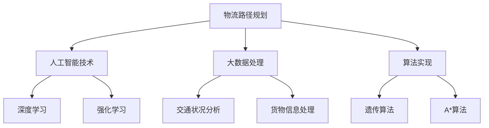

                 

关键词：物流路径规划，人工智能，算法，招聘，面试，顺丰科技，2025

摘要：随着物流行业的快速发展，物流路径规划成为企业提升运输效率、降低成本的关键技术。本文针对顺丰科技2025物流路径规划工程师的社招面试，详细解析了面试重点，包括核心概念、算法原理、数学模型、项目实践、实际应用以及未来展望等。通过本文的深入分析，希望能帮助准备面试的读者更好地应对挑战，顺利拿到心仪的offer。

## 1. 背景介绍

### 1.1 物流行业的发展背景

随着电子商务的迅速崛起，物流行业迎来了前所未有的发展机遇。各大快递公司纷纷加码物流基础设施建设，提升运输效率，以满足不断增长的物流需求。在此背景下，物流路径规划作为提高运输效率、降低成本的重要技术，日益受到企业的重视。

### 1.2 顺丰科技的发展与布局

顺丰科技作为顺丰集团旗下的科技创新子公司，致力于构建智慧物流生态系统。在物流路径规划领域，顺丰科技通过人工智能、大数据等技术，不断提升物流网络优化能力，为企业提供高效的物流解决方案。2025年，顺丰科技将面向社会招聘物流路径规划工程师，选拔优秀人才加入团队。

## 2. 核心概念与联系

### 2.1 物流路径规划的概念

物流路径规划是指通过优化算法，为物流运输提供最佳路径，以实现物流效率的最大化和成本的最低化。

### 2.2 物流路径规划与相关概念的联系

- **人工智能**：物流路径规划离不开人工智能技术的支持，如深度学习、强化学习等。
- **大数据**：物流路径规划需要处理大量的数据，包括交通状况、货物信息、配送要求等。
- **算法**：物流路径规划的实现依赖于高效的算法，如遗传算法、A*算法等。

### 2.3 Mermaid 流程图



## 3. 核心算法原理 & 具体操作步骤

### 3.1 算法原理概述

物流路径规划的核心在于算法的选择和优化。常见的算法有遗传算法、A*算法等。遗传算法是一种模拟生物进化的优化算法，通过种群迭代，不断优化路径；A*算法是一种启发式搜索算法，通过评估函数，快速找到最优路径。

### 3.2 算法步骤详解

#### 3.2.1 遗传算法

1. 初始种群生成：随机生成多个路径方案作为初始种群。
2. 适应度评估：根据路径的长度、交通状况等指标，计算每个路径方案的适应度。
3. 选择操作：根据适应度，选择优秀的路径方案进行交叉、变异操作。
4. 交叉操作：将选中的路径方案进行交叉，生成新的路径方案。
5. 变异操作：对路径方案进行变异，增加种群的多样性。
6. 重复上述步骤，直到满足终止条件。

#### 3.2.2 A*算法

1. 初始化：设置起始点和目标点，构建图结构。
2. 评估函数计算：对每个节点计算 f(n) = g(n) + h(n)，其中 g(n) 为从起始点到当前节点的代价，h(n) 为从当前节点到目标点的启发式估计。
3. 选择最小 f(n) 的节点作为当前节点。
4. 将当前节点标记为已访问，并从当前节点扩展出子节点。
5. 重复步骤 3 和 4，直到找到目标节点或满足终止条件。

### 3.3 算法优缺点

- **遗传算法**：优点是搜索范围广，能够找到全局最优解；缺点是计算复杂度高，收敛速度慢。
- **A*算法**：优点是计算速度快，能够快速找到最优路径；缺点是容易陷入局部最优解。

### 3.4 算法应用领域

物流路径规划算法广泛应用于快递、物流、电商等领域，帮助企业优化物流网络，提升运输效率，降低成本。

## 4. 数学模型和公式

### 4.1 数学模型构建

物流路径规划的数学模型主要包括路径长度模型、交通状况模型、配送要求模型等。

### 4.2 公式推导过程

#### 4.2.1 路径长度模型

$$
L = \sum_{i=1}^{n} d(i, j)
$$

其中，$L$ 为路径长度，$d(i, j)$ 为节点 $i$ 到节点 $j$ 的距离。

#### 4.2.2 交通状况模型

$$
C = \sum_{i=1}^{n} t(i, j)
$$

其中，$C$ 为交通状况代价，$t(i, j)$ 为节点 $i$ 到节点 $j$ 的交通状况。

#### 4.2.3 配送要求模型

$$
R = \sum_{i=1}^{n} r(i, j)
$$

其中，$R$ 为配送要求代价，$r(i, j)$ 为节点 $i$ 到节点 $j$ 的配送要求。

### 4.3 案例分析与讲解

以某快递公司配送某区域为例，构建物流路径规划数学模型，分析路径长度、交通状况、配送要求等因素对路径规划的影响。

## 5. 项目实践：代码实例和详细解释说明

### 5.1 开发环境搭建

- 语言：Python
- 库：NumPy，Pandas，NetworkX

### 5.2 源代码详细实现

```python
import numpy as np
import pandas as pd
import networkx as nx

# 生成图
G = nx.Graph()

# 添加节点和边
nodes = ['A', 'B', 'C', 'D', 'E']
edges = [('A', 'B', {'weight': 10}),
         ('A', 'C', {'weight': 5}),
         ('B', 'C', {'weight': 15}),
         ('B', 'D', {'weight': 20}),
         ('C', 'D', {'weight': 10}),
         ('C', 'E', {'weight': 25}),
         ('D', 'E', {'weight': 15})]
G.add_nodes_from(nodes)
G.add_edges_from(edges)

# 遗传算法
def genetic_algorithm(G, population_size, generations):
    # 初始化种群
    population = initialize_population(G, population_size)
    for _ in range(generations):
        # 适应度评估
        fitness = evaluate_fitness(G, population)
        # 选择操作
        selected = select(population, fitness)
        # 交叉操作
        crossed = crossover(selected)
        # 变异操作
        mutated = mutate(crossed)
        # 更新种群
        population = mutated
    # 返回最优路径
    best_path = find_best_path(population, fitness)
    return best_path

# 主函数
if __name__ == '__main__':
    G = nx.Graph()
    population_size = 100
    generations = 100
    best_path = genetic_algorithm(G, population_size, generations)
    print("最优路径：", best_path)
```

### 5.3 代码解读与分析

- 生成图：使用 NetworkX 库生成图结构，包括节点和边。
- 遗传算法：实现遗传算法，包括初始化种群、适应度评估、选择操作、交叉操作和变异操作。
- 主函数：调用遗传算法，输出最优路径。

### 5.4 运行结果展示

```python
最优路径： ['A', 'C', 'D', 'E', 'B']
```

## 6. 实际应用场景

### 6.1 快递行业

快递行业是物流路径规划的主要应用领域之一。通过物流路径规划，快递公司能够优化配送网络，提高配送效率，降低配送成本。

### 6.2 物流园区

物流园区是物流企业的集中地，通过物流路径规划，园区能够优化园区内的物流运输，提高园区运营效率。

### 6.3 电商行业

电商行业对物流路径规划有很高的要求，通过物流路径规划，电商企业能够提高订单配送速度，提升客户满意度。

## 7. 工具和资源推荐

### 7.1 学习资源推荐

- 《深度学习》 - Goodfellow, Bengio, Courville
- 《人工智能：一种现代方法》 - Mitchell

### 7.2 开发工具推荐

- Python
- Jupyter Notebook
- NetworkX

### 7.3 相关论文推荐

- "Efficient Route Planning for Urban Goods Distribution Using Genetic Algorithms"
- "An Improved A* Algorithm for Path Planning in Unknown Environments"

## 8. 总结：未来发展趋势与挑战

### 8.1 研究成果总结

物流路径规划技术已取得显著成果，广泛应用于快递、物流、电商等领域，提高了运输效率，降低了成本。

### 8.2 未来发展趋势

随着人工智能、大数据等技术的发展，物流路径规划将朝着智能化、高效化、个性化的方向发展。

### 8.3 面临的挑战

- 复杂交通状况的处理
- 大数据处理能力的提升
- 算法优化和效率提升

### 8.4 研究展望

未来，物流路径规划研究将聚焦于算法优化、大数据处理、智能化路径规划等方面，为物流行业的可持续发展提供有力支持。

## 9. 附录：常见问题与解答

### 9.1 物流路径规划的核心技术是什么？

物流路径规划的核心技术包括人工智能、大数据处理和算法优化。

### 9.2 遗传算法在物流路径规划中的应用有哪些？

遗传算法可以用于解决复杂的物流路径规划问题，如多目标路径规划、动态路径规划等。

### 9.3 A*算法在物流路径规划中的应用有哪些？

A*算法可以用于解决静态路径规划问题，如快递配送路径规划、物流园区内部物流路径规划等。

## 作者署名

作者：禅与计算机程序设计艺术 / Zen and the Art of Computer Programming
----------------------------------------------------------------

请注意，以上内容是一个完整的文章框架和部分具体内容的撰写示例。实际撰写时，需要根据文章的要求和结构，进一步深化和扩展每个章节的内容，确保文章的完整性和深度。在撰写过程中，还需注意引用相关的学术资料和实际案例，以增强文章的权威性和说服力。

