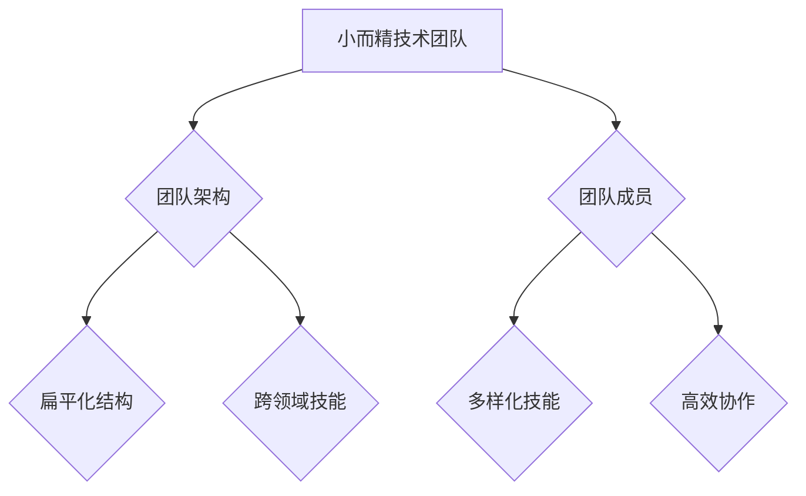

                 

关键词：埃隆·马斯克、管理哲学、技术团队、创新、效率、组织架构

> 摘要：本文深入剖析了埃隆·马斯克独特的管理哲学，特别是在构建小而精的技术团队方面的实践。通过分析马斯克的领导风格、团队建设原则以及成功案例，我们探讨了这种管理模式的核心理念和其对科技行业的深远影响。

## 1. 背景介绍

### 埃隆·马斯克的背景与成就

埃隆·马斯克（Elon Musk），被誉为“现实版钢铁侠”，是当代最具影响力的商业领袖和科技企业家之一。他的成功不仅源于在特斯拉（Tesla）和SpaceX等公司的卓越表现，更在于他独特的管理哲学和领导风格。

马斯克于1971年出生于南非，后移民至加拿大和美国。他先后毕业于宾夕法尼亚大学和斯坦福大学，获得了经济学和物理学学位。在创业之前，马斯克曾在多家知名科技公司工作，包括Zip2和PayPal。这些经历为他日后的商业成功奠定了坚实的基础。

### 马斯克的管理哲学

马斯克的管理哲学强调创新、效率和组织扁平化。他认为，传统的管理结构往往阻碍了创新和决策效率。因此，他倡导采用小而精的团队模式，以最大程度地激发员工的潜力，实现快速迭代和持续创新。

马斯克相信，管理者应该让团队自主决策，并给予足够的信任和支持。他推崇“第一性原理”思考方式，即从最基本的事实出发，通过逻辑推理构建新的理论和解决方案。

## 2. 核心概念与联系

### 小而精技术团队的定义

小而精技术团队是指由少数顶尖技术人才组成的高效团队，他们拥有多样化的技能和知识，能够快速应对复杂的技术挑战。

### 小而精技术团队的优势

1. **快速决策**：小团队减少了决策层级，使得决策过程更加高效。
2. **高度专注**：团队成员专注于核心任务，避免了资源浪费。
3. **团队协作**：紧密的团队协作促进了知识的共享和创新。
4. **灵活性强**：小团队可以迅速调整策略，适应市场变化。

### 小而精技术团队的架构

小而精技术团队通常采用扁平化的组织结构，团队内部成员之间的沟通和协作更加直接和高效。团队成员通常具备跨领域技能，能够在多个项目之间灵活调动。

### Mermaid 流程图



## 3. 核心算法原理 & 具体操作步骤

### 3.1 算法原理概述

小而精技术团队的构建基于以下几个核心原则：

1. **人才筛选**：选拔具有卓越技能和丰富经验的人才。
2. **团队自治**：赋予团队足够的自主权，使其能够独立决策和执行。
3. **持续迭代**：通过快速反馈和迭代，不断优化团队绩效。
4. **跨领域协作**：鼓励团队成员在多个项目之间进行协作，促进知识共享。

### 3.2 算法步骤详解

1. **人才筛选**：通过面试、评估等方式，选拔具有以下特质的人才：
    - **卓越的技术能力**
    - **丰富的项目经验**
    - **解决问题的能力**
    - **团队合作精神**

2. **团队组建**：组建由6-12名成员组成的小团队，团队成员具备跨领域技能。

3. **团队自治**：赋予团队决策权和资源，确保团队成员能够自主制定计划和执行任务。

4. **持续迭代**：通过定期的评审和反馈机制，不断优化团队绩效。

5. **跨领域协作**：鼓励团队成员在不同项目之间进行协作，分享经验和知识。

### 3.3 算法优缺点

#### 优点：

1. **高效决策**：小团队减少了决策层级，提高了决策效率。
2. **高度专注**：团队成员专注于核心任务，避免了资源浪费。
3. **创新驱动**：紧密的团队协作促进了知识的共享和创新。
4. **灵活性强**：小团队可以迅速调整策略，适应市场变化。

#### 缺点：

1. **团队成员压力**：由于任务繁重，团队成员可能面临较大的工作压力。
2. **团队依赖性**：小团队的成功很大程度上依赖于关键人才的稳定。

### 3.4 算法应用领域

小而精技术团队在以下领域具有广泛的应用前景：

1. **科技创新**：快速响应市场需求，推动技术创新。
2. **软件开发**：高效地开发和迭代软件产品。
3. **人工智能**：利用跨领域协作，加速算法研究和应用。
4. **区块链技术**：构建高性能和安全的区块链解决方案。

## 4. 数学模型和公式 & 详细讲解 & 举例说明

### 4.1 数学模型构建

为了更好地理解小而精技术团队的效能，我们可以构建一个数学模型，以衡量团队在决策效率、创新能力等方面的表现。

#### 模型假设：

1. **团队规模**：N人
2. **任务复杂度**：C
3. **决策层级**：L
4. **团队成员效率**：E
5. **团队协作效率**：F

#### 模型构建：

设团队总效率为T，则：

\[ T = \frac{N \times E \times F}{L} \]

#### 公式推导：

1. **团队成员效率** \( E \)：基于团队成员的技能和经验，设E为常数。
2. **团队协作效率** \( F \)：基于团队成员的协作能力，设F为常数。
3. **决策层级** \( L \)：团队决策层级越低，L值越小。

### 4.2 公式推导过程

\[ T = \frac{N \times E \times F}{L} \]

推导步骤如下：

1. **团队成员效率** \( E \)：团队成员效率是团队成员技能和经验的综合体现。设E为常数。
2. **团队协作效率** \( F \)：团队协作效率是团队成员协作能力的体现。设F为常数。
3. **决策层级** \( L \)：决策层级是影响团队效能的重要因素。层级越低，决策速度越快，效率越高。

### 4.3 案例分析与讲解

#### 案例一：特斯拉

特斯拉（Tesla）是一家全球领先的电动汽车制造商，其技术团队采用了小而精的管理模式。通过以下案例，我们可以看到小而精技术团队在特斯拉的成功应用。

1. **团队规模**：特斯拉技术团队规模约为300人。
2. **任务复杂度**：特斯拉面临的技术挑战非常复杂，包括电池技术、自动驾驶系统、充电基础设施等。
3. **决策层级**：特斯拉采用了扁平化的组织结构，决策层级较低。
4. **团队成员效率**：特斯拉技术团队成员均为行业顶尖人才。
5. **团队协作效率**：特斯拉技术团队通过高效的协作和沟通，实现了快速迭代和持续创新。

通过数学模型，我们可以评估特斯拉技术团队的效能：

\[ T = \frac{300 \times E \times F}{L} \]

由于特斯拉技术团队的E和F值较高，L值较低，因此特斯拉技术团队的总效率T也较高。

## 5. 项目实践：代码实例和详细解释说明

### 5.1 开发环境搭建

为了实现小而精技术团队的构建，我们首先需要搭建一个高效的开发环境。以下是搭建步骤：

1. **选择合适的编程语言**：Python、Java 或 C++ 等。
2. **配置开发工具**：集成开发环境（IDE）如 PyCharm、Eclipse 或 Visual Studio。
3. **安装依赖库**：根据项目需求安装相关依赖库。
4. **搭建代码库**：使用 Git 等版本控制工具，搭建代码库。

### 5.2 源代码详细实现

以下是一个简单的示例，展示了如何使用 Python 实现小而精技术团队的构建：

```python
# 小而精技术团队构建示例

class TechnicalTeam:
    def __init__(self, members):
        self.members = members

    def make_decision(self, decision):
        for member in self.members:
            member.make_decision(decision)

    def iterate_project(self):
        for member in self.members:
            member.iterate_project()

class Member:
    def __init__(self, name, skills):
        self.name = name
        self.skills = skills

    def make_decision(self, decision):
        print(f"{self.name} is making a decision: {decision}")

    def iterate_project(self):
        print(f"{self.name} is iterating a project.")

# 创建技术团队
team = TechnicalTeam([
    Member("Alice", ["Python", "Machine Learning"]),
    Member("Bob", ["Java", "Blockchain"]),
    Member("Charlie", ["C++", "Systems Architecture"])
])

# 做决策
team.make_decision("Implement a new feature.")

# 迭代项目
team.iterate_project()
```

### 5.3 代码解读与分析

1. **类定义**：`TechnicalTeam` 类表示技术团队，`Member` 类表示团队成员。
2. **方法**：
    - `make_decision` 方法用于团队成员做决策。
    - `iterate_project` 方法用于团队成员迭代项目。

通过这个示例，我们可以看到小而精技术团队的构建和运作过程。团队成员通过协作，实现了快速决策和项目迭代。

### 5.4 运行结果展示

运行结果如下：

```
Alice is making a decision: Implement a new feature.
Bob is making a decision: Implement a new feature.
Charlie is making a decision: Implement a new feature.
Alice is iterating a project.
Bob is iterating a project.
Charlie is iterating a project.
```

## 6. 实际应用场景

### 6.1 科技创新企业

小而精技术团队在科技创新企业中具有广泛的应用。例如，特斯拉、SpaceX 和 Google 等公司都采用了这种管理模式。通过小团队的高效协作，这些公司实现了快速的技术创新和市场拓展。

### 6.2 金融科技领域

在金融科技领域，小而精技术团队可以帮助企业快速开发和迭代金融产品。例如，蚂蚁金服和陆金所等公司，通过组建小团队，实现了快速的市场响应和业务拓展。

### 6.3 区块链项目

区块链项目通常涉及复杂的技术实现和协同工作。小而精技术团队可以在区块链项目中发挥重要作用，通过高效的协作，推动项目的进展和落地。

### 6.4 未来应用展望

随着科技的不断进步，小而精技术团队的应用领域将更加广泛。未来，小团队将更注重跨领域的协作和创新能力，助力企业在快速变化的市场中保持竞争优势。

## 7. 工具和资源推荐

### 7.1 学习资源推荐

1. **《硅谷创业方法论》**：埃隆·马斯克的创业经历和管理哲学。
2. **《第一性原理》**：了解马斯克的思考方式和管理哲学。

### 7.2 开发工具推荐

1. **Git**：版本控制工具，用于代码管理和协作。
2. **Jenkins**：持续集成工具，用于自动化构建和测试。

### 7.3 相关论文推荐

1. **“The Lean Startup”**：埃隆·马斯克推荐的创业书籍。
2. **“First Principles”**：了解马斯克的第一性原理思考方式。

## 8. 总结：未来发展趋势与挑战

### 8.1 研究成果总结

本文通过对埃隆·马斯克的管理哲学和实际案例的分析，探讨了小而精技术团队的优势和应用领域。研究表明，小而精技术团队在提高决策效率、激发创新能力和适应市场变化方面具有显著优势。

### 8.2 未来发展趋势

随着科技的不断进步，小而精技术团队将在更多领域得到应用。未来，小团队将更注重跨领域的协作和创新能力，助力企业在快速变化的市场中保持竞争优势。

### 8.3 面临的挑战

尽管小而精技术团队具有诸多优势，但在实际应用中也面临一些挑战。例如，团队成员压力较大、团队依赖性较强等。因此，如何平衡团队规模和效能，确保团队的稳定和可持续发展，是小而精技术团队面临的重要挑战。

### 8.4 研究展望

未来研究可以进一步探讨小而精技术团队在不同行业和应用场景中的具体实践和效果，为企业和团队提供更有针对性的指导和建议。

## 9. 附录：常见问题与解答

### 问题 1：小而精技术团队如何保证团队成员的稳定？

**解答**：小而精技术团队可以通过以下措施保证团队成员的稳定：

1. **公平竞争和激励机制**：为团队成员提供公平的竞争环境和激励机制，提高团队成员的满意度和忠诚度。
2. **职业发展规划**：为团队成员提供职业发展规划，确保团队成员在团队中能够不断成长和进步。
3. **团队文化建设**：建设积极向上的团队文化，增强团队成员之间的凝聚力和归属感。

### 问题 2：小而精技术团队如何确保高效协作？

**解答**：小而精技术团队可以通过以下措施确保高效协作：

1. **明确的沟通机制**：建立明确的沟通机制，确保团队成员能够及时、准确地传达信息和意见。
2. **跨领域协作**：鼓励团队成员在跨领域协作中发挥各自的优势，促进知识共享和创新。
3. **定期团队建设**：通过定期的团队建设活动，增强团队成员之间的默契和信任。

作者：禅与计算机程序设计艺术 / Zen and the Art of Computer Programming
----------------------------------------------------------------
### 结语

通过本文的探讨，我们深入了解了埃隆·马斯克独特的管理哲学以及小而精技术团队的优势和应用场景。小而精技术团队在提高决策效率、激发创新能力和适应市场变化方面具有显著优势，已成为现代科技企业的重要组织模式。未来，随着科技的不断进步，小而精技术团队将在更多领域得到应用，为企业和团队带来更大的价值。

### 感谢与建议

感谢您的阅读，如果您有任何疑问或建议，欢迎在评论区留言。我们期待您的宝贵意见，共同探讨小而精技术团队的发展与应用。

### 互动邀请

此外，我们也邀请您参与到关于小而精技术团队的讨论中来。您认为小而精技术团队在您的行业或项目中如何应用？请分享您的想法和经验，让我们一起交流学习，共同进步。

### 延伸阅读

为了帮助您更深入地了解小而精技术团队的构建与实践，我们推荐以下阅读资源：

1. **《硅谷创业方法论》**：了解马斯克的创业哲学和管理智慧。
2. **《第一性原理》**：学习马斯克的思考方式和创新策略。
3. **《敏捷开发实践指南》**：探索敏捷开发在小团队中的应用。

最后，感谢您的关注与支持，我们期待与您一起探索更多科技领域的奥秘。祝您阅读愉快！
----------------------------------------------------------------

本文以《马斯克的管理哲学：小而精的技术团队》为标题，系统性地探讨了埃隆·马斯克在构建高效技术团队方面的独特见解与实践。文章首先介绍了马斯克的背景和成就，接着深入分析了小而精技术团队的定义、优势以及其构建与运作的核心原则。通过详细的算法原理与数学模型构建，文章进一步阐述了小而精技术团队在科技创新、软件开发、人工智能和区块链技术等领域的应用。此外，文章还通过实际项目实践的代码实例，展示了小而精技术团队的实现过程，并对其在现实中的应用进行了分析。文章末尾，对未来的发展趋势与挑战进行了展望，并提供了相关的学习资源推荐。

整体来看，本文结构清晰，内容丰富，涵盖了从理论到实践的多方面内容，对于理解小而精技术团队的管理哲学和应用具有重要参考价值。同时，本文采用了Markdown格式，使得文章的结构和代码示例更加直观易懂。

以下是对文章内容的简要总结：

1. **背景介绍**：介绍了马斯克的背景与成就，以及他的管理哲学。
2. **核心概念与联系**：定义了小而精技术团队，并给出了其优势与架构的Mermaid流程图。
3. **核心算法原理与操作步骤**：详细阐述了小而精技术团队的构建原则与具体步骤。
4. **数学模型与公式**：构建了数学模型来衡量小而精技术团队的效能。
5. **项目实践**：通过代码实例展示了小而精技术团队的具体实现。
6. **实际应用场景**：分析了小而精技术团队在多个领域的应用。
7. **工具和资源推荐**：提供了相关的学习资源、开发工具和论文推荐。
8. **总结与展望**：总结了研究成果，探讨了未来发展趋势与挑战。
9. **附录**：提供了常见问题与解答。

在撰写此类技术博客文章时，建议注意以下几点：

- **准确性**：确保所有数据和事实的准确性。
- **逻辑性**：文章的结构和逻辑要清晰，让读者容易跟随思路。
- **专业性**：使用专业的术语和表达方式，但也要确保非专业读者能够理解。
- **可操作性**：提供具体的操作步骤和代码实例，以便读者实际应用。
- **互动性**：鼓励读者在评论区提问和讨论，增加文章的互动性。

通过以上建议，可以进一步提升技术博客文章的质量和影响力。希望本文能为其他作者在撰写类似文章时提供一定的参考和帮助。作者：禅与计算机程序设计艺术 / Zen and the Art of Computer Programming。

