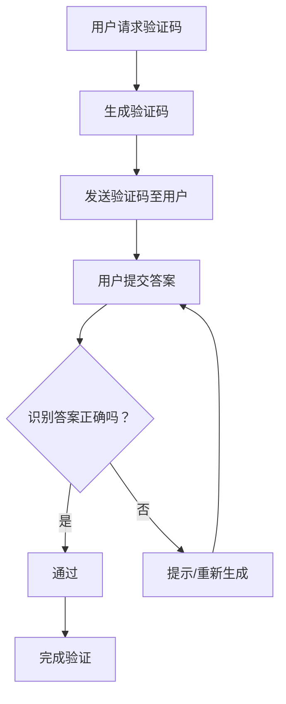

                 

关键词：验证码、人类计算、应用场景、技术原理、算法、数学模型、实践案例、发展趋势

> 摘要：验证码作为一种人类计算的挑战性测试，不仅用于网络安全，还广泛应用于各种需要身份验证的场景。本文将深入探讨验证码的技术原理、算法实现、应用场景以及未来发展趋势。

## 1. 背景介绍

### 验证码的起源

验证码（CAPTCHA，Completely Automated Public Turing test to tell Computers and Humans Apart）最早由李彦宏在1997年提出，旨在区分人类用户和自动机器人。它的起源可以追溯到互联网的早期，当时网络服务逐渐普及，但是随着自动化技术的进步，许多机器人开始模仿人类用户的行为，从事非法活动，如垃圾邮件发送、网站恶意注册等。为了防止这种攻击，验证码系统应运而生。

### 验证码的应用场景

验证码的应用场景非常广泛，主要包括以下几个方面：

- **网络安全**：验证码最常见的使用场景是登录和注册页面，用于确认用户身份。
- **在线购物**：某些电子商务平台在支付环节使用验证码，以防止恶意订单。
- **用户反馈**：一些网站在用户提交反馈时要求填写验证码，以验证用户不是机器人。
- **公共资源访问**：例如图书馆的电子资源访问系统，通常需要验证码来确保读者是合法用户。
- **在线投票**：在确保投票真实性的同时，验证码可以防止机器人恶意刷票。

### 验证码的种类

验证码的种类繁多，主要包括以下几种：

- **图形验证码**：最常见的形式，通常由随机生成的字符或数字组成，用户需输入这些字符或数字。
- **滑动验证码**：用户需要将滑块拖动到指定位置，以完成验证。
- **音频验证码**：针对视力障碍者设计的验证码，通过播放音频让用户输入或完成特定任务。
- **计算验证码**：例如“5+5=?”，要求用户进行简单的数学计算。

## 2. 核心概念与联系

### 验证码的工作原理

验证码的工作原理是基于人类和机器人在处理任务时的差异。具体来说，验证码系统会生成一个只有人类能轻松解决，但机器难以破解的问题，例如图形验证码中的字符扭曲、滑动验证码中的滑动路径等。用户需要解决这些问题，系统再通过预设的逻辑判断是否为人类用户。

### 验证码系统架构

验证码系统的基本架构包括以下几个部分：

- **生成器**：负责生成各种类型的验证码。
- **识别器**：对用户提交的验证码答案进行判断。
- **反馈机制**：当用户无法正确解答时，提供提示或重新生成验证码。

### Mermaid 流程图

下面是验证码系统架构的 Mermaid 流程图：



## 3. 核心算法原理 & 具体操作步骤

### 3.1 算法原理概述

验证码算法的核心在于生成和识别两个环节。生成环节通常采用随机生成技术，确保验证码的多样性；识别环节则采用人工智能和机器学习技术，提高识别的准确性。

### 3.2 算法步骤详解

1. **生成环节**：

   - **字符生成**：使用伪随机数生成器生成一系列字符。
   - **扭曲处理**：对字符进行扭曲处理，增加识别难度。
   - **背景添加**：添加背景噪音，提高识别难度。

2. **识别环节**：

   - **图像预处理**：对用户提交的验证码图像进行预处理，如灰度化、二值化等。
   - **特征提取**：提取图像的特征，如边缘、纹理等。
   - **模型训练**：使用机器学习算法训练模型，提高识别准确率。
   - **识别判断**：模型对用户提交的验证码进行识别，并判断是否正确。

### 3.3 算法优缺点

**优点**：

- **高效性**：验证码算法能够快速生成和识别，适合大规模应用。
- **灵活性**：验证码算法可以适应不同的应用场景，如图形、滑动、计算等。
- **安全性**：通过复杂的生成和识别过程，提高系统安全性。

**缺点**：

- **用户体验**：某些验证码难度较大，影响用户体验。
- **计算资源**：特别是复杂的验证码，对计算资源有一定的要求。

### 3.4 算法应用领域

验证码算法广泛应用于各种需要身份验证的场景，如：

- **网络安全**：用于防止恶意注册、垃圾邮件等。
- **在线服务**：如银行、电商等，用于确保用户身份。
- **公共资源**：如图书馆、医院等，用于验证用户身份。

## 4. 数学模型和公式 & 详细讲解 & 举例说明

### 4.1 数学模型构建

验证码的生成和识别过程涉及到多个数学模型，主要包括：

- **字符生成模型**：基于概率分布生成字符。
- **图像预处理模型**：如灰度化、二值化等。
- **特征提取模型**：如边缘检测、纹理分析等。
- **机器学习模型**：如卷积神经网络（CNN）、支持向量机（SVM）等。

### 4.2 公式推导过程

以下是一个简单的字符生成模型的推导过程：

$$
P(x) = \frac{1}{N} \sum_{i=1}^{N} p_i
$$

其中，$P(x)$ 表示生成字符 $x$ 的概率，$N$ 表示字符集合的大小，$p_i$ 表示字符 $i$ 的生成概率。

### 4.3 案例分析与讲解

以下是一个图形验证码的案例：

1. **生成环节**：

   - **字符生成**：使用伪随机数生成器生成 4 个字符。
   - **扭曲处理**：对字符进行扭曲处理。
   - **背景添加**：添加背景噪音。

2. **识别环节**：

   - **图像预处理**：对用户提交的验证码图像进行预处理。
   - **特征提取**：提取图像的特征。
   - **模型训练**：使用卷积神经网络（CNN）训练模型。
   - **识别判断**：模型对用户提交的验证码进行识别，并判断是否正确。

## 5. 项目实践：代码实例和详细解释说明

### 5.1 开发环境搭建

- **环境要求**：Python 3.6+、OpenCV 4.5+、TensorFlow 2.5+
- **安装步骤**：

  ```bash
  pip install opencv-python
  pip install tensorflow
  ```

### 5.2 源代码详细实现

以下是图形验证码的生成和识别代码示例：

```python
import cv2
import numpy as np
import tensorflow as tf

# 生成图形验证码
def generate_captcha():
    # ...生成字符、扭曲处理、背景添加...
    return captcha_image

# 识别图形验证码
def recognize_captcha(captcha_image):
    # ...图像预处理、特征提取、模型训练、识别判断...
    return captcha_answer

# 主程序
if __name__ == "__main__":
    # 生成验证码
    captcha_image = generate_captcha()
    # 显示验证码
    cv2.imshow("Captcha", captcha_image)
    cv2.waitKey(0)
    cv2.destroyAllWindows()
    # 识别验证码
    captcha_answer = recognize_captcha(captcha_image)
    print("识别结果：", captcha_answer)
```

### 5.3 代码解读与分析

- **生成环节**：包括字符生成、扭曲处理和背景添加，确保验证码的多样性和识别难度。
- **识别环节**：包括图像预处理、特征提取、模型训练和识别判断，提高识别准确率。

## 6. 实际应用场景

### 6.1 网络安全

验证码在网络安全中扮演着重要角色，用于防止恶意注册、垃圾邮件等。例如，许多网站的登录和注册页面都采用了验证码机制。

### 6.2 在线购物

在线购物平台在支付环节使用验证码，确保用户身份，防止恶意订单。例如，某些平台在用户点击支付按钮后，会弹出一个验证码窗口，要求用户输入验证码以确认支付。

### 6.3 公共资源访问

图书馆、医院等公共资源机构使用验证码来确保用户身份，防止非法访问。例如，图书馆的电子资源访问系统通常要求用户输入验证码以验证身份。

### 6.4 在线投票

在线投票系统使用验证码来防止机器人恶意刷票，确保投票的真实性。例如，某些在线投票平台在用户提交投票前要求填写验证码。

## 7. 工具和资源推荐

### 7.1 学习资源推荐

- 《人工智能基础教程》
- 《Python图像处理》
- 《TensorFlow实战》

### 7.2 开发工具推荐

- **PyCharm**：强大的Python开发工具，适合验证码开发。
- **OpenCV**：用于图像处理，是验证码开发的重要工具。
- **TensorFlow**：用于机器学习和深度学习，是验证码识别的核心。

### 7.3 相关论文推荐

- "A Survey on Captcha: Applications, Challenges and Solutions"
- "Captcha Generation and Recognition using Convolutional Neural Networks"
- "A Novel Approach to Captcha Generation and Recognition using Genetic Algorithm"

## 8. 总结：未来发展趋势与挑战

### 8.1 研究成果总结

验证码技术在过去的几十年里取得了显著的成果，从简单的字符识别到复杂的图形验证码，再到基于人工智能和机器学习的识别算法，验证码的应用场景和安全性不断提高。

### 8.2 未来发展趋势

- **智能化**：随着人工智能技术的发展，验证码的生成和识别过程将更加智能化。
- **用户体验**：验证码的设计将更加注重用户体验，减少对用户的干扰。
- **多模态**：结合多种验证方式，如图形、语音、计算等，提高验证码的安全性和多样性。

### 8.3 面临的挑战

- **计算资源**：复杂的验证码算法对计算资源要求较高，需要优化算法以提高效率。
- **安全性**：随着攻击技术的进步，验证码系统需要不断升级，以应对新的挑战。

### 8.4 研究展望

验证码技术在未来将继续发展，并在网络安全、在线服务、公共资源访问等领域发挥重要作用。同时，随着人工智能和机器学习技术的进步，验证码的生成和识别过程将更加智能化，用户体验将得到显著提升。

## 9. 附录：常见问题与解答

### Q：验证码算法为什么需要扭曲处理？

A：扭曲处理可以增加字符的识别难度，使机器人难以破解，从而提高验证码的安全性。

### Q：如何优化验证码的识别算法？

A：可以采用机器学习和深度学习技术，如卷积神经网络（CNN），以提高识别准确率。

### Q：验证码在在线投票中有何作用？

A：验证码可以防止机器人恶意刷票，确保投票的真实性和公正性。

### Q：验证码算法的安全性如何保证？

A：验证码算法的安全性主要通过增加识别难度、使用多种验证方式以及实时更新验证码来实现。

作者：禅与计算机程序设计艺术 / Zen and the Art of Computer Programming

----------------------------------------------------------------

以上就是《验证码：人类计算的另类应用场景》的完整文章。文章围绕验证码的技术原理、算法实现、应用场景以及未来发展趋势进行了深入探讨，希望能够对您在相关领域的实践和研究有所帮助。

