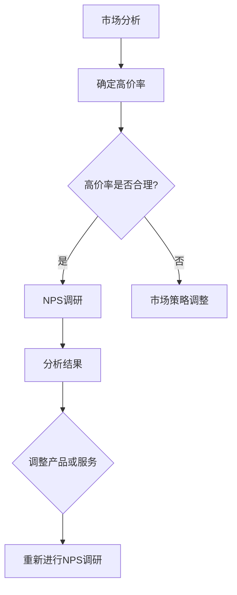

                 

关键词：NPS调研、高价率、客户满意度、市场策略、数据处理、算法优化

> 摘要：本文将深入探讨高价率变化对NPS（Net Promoter Score）调研结果的影响，分析其在不同市场策略下的表现，并探讨如何通过数据分析与算法优化来提升NPS调研的准确性和有效性。

## 1. 背景介绍

NPS（Net Promoter Score）是一种常用的客户满意度评估工具，通过简单的评分问卷，帮助企业了解客户对产品和服务的满意度，并据此划分客户群体。高价率是指产品或服务的价格与市场竞争水平相比的高低程度。随着市场竞争的加剧和消费者偏好的多样化，高价率的变化对客户满意度和市场策略产生了重要影响。

在当前的商业环境中，越来越多的企业开始重视NPS调研在制定市场策略中的作用。通过NPS调研，企业不仅可以了解客户的满意度，还可以预测客户的忠诚度和口碑传播情况，从而为制定有效的市场策略提供数据支持。然而，高价率的变化如何影响NPS调研结果，以及如何优化NPS调研的方法和流程，这些问题一直是研究和实践中的焦点。

本文旨在通过分析高价率变化对NPS调研的影响，提供一种新的视角来审视NPS调研在市场策略中的价值，并探讨通过数据分析和算法优化来提升NPS调研效果的方法。

## 2. 核心概念与联系

### 2.1. NPS调研的基本概念

NPS调研是一种基于单一问题的客户满意度评估方法。这个问题的核心是询问客户：“在您的推荐意愿上，您会将我们推荐给朋友或同事吗？” 根据客户的回答，可以将客户分为三个群体：

- **促进者（Promoters）**：评分在9-10之间，他们非常满意，愿意推荐企业及其产品或服务。
- **被动者（Passives）**：评分在7-8之间，他们基本满意，但可能会转向竞争对手。
- **批评者（Detractors）**：评分在0-6之间，他们非常不满意，可能会给企业带来负面影响。

NPS得分计算公式为：NPS = %促进者 - %批评者。

### 2.2. 高价率与市场竞争

高价率是指企业产品或服务的价格高于市场竞争水平。高价率可能由多种因素驱动，包括品牌溢价、产品质量、市场定位等。然而，高价率也可能面临市场竞争的挑战，消费者对价格的敏感性以及对替代品的选择可能导致高价产品的市场份额受限。

### 2.3. 高价率与客户满意度

高价率与客户满意度之间的关系复杂。一方面，高价产品可能因为更高的质量、更好的服务和独特的品牌体验而提高客户的满意度。另一方面，高价产品也可能增加消费者的不满，尤其是在经济衰退或市场竞争激烈的情况下。

### 2.4. NPS调研与市场策略

NPS调研不仅是评估客户满意度的工具，也是制定市场策略的重要数据来源。通过NPS调研，企业可以：

- **了解客户满意度**：识别哪些方面做得好，哪些方面需要改进。
- **预测客户忠诚度**：促进者和被动者对企业的忠诚度不同，可以通过NPS得分来区分。
- **制定营销策略**：根据客户的反馈，调整产品或服务，提高客户满意度。

### 2.5. Mermaid 流程图

以下是一个简单的Mermaid流程图，展示了高价率变化对NPS调研的影响流程：



## 3. 核心算法原理 & 具体操作步骤

### 3.1. 算法原理概述

高价率变化对NPS调研的影响可以通过以下算法原理来分析：

1. **客户满意度模型**：建立客户满意度模型，将高价率作为其中一个变量，分析其对客户满意度的直接和间接影响。
2. **统计分析方法**：采用多元线性回归、因子分析等统计方法，研究高价率与NPS得分之间的关联性。
3. **机器学习方法**：使用机器学习算法，如随机森林、支持向量机等，来预测高价率变化对NPS得分的影响。

### 3.2. 算法步骤详解

#### 3.2.1. 数据收集

收集与高价率相关的数据，包括：

- 客户对产品或服务的评分（用于计算NPS得分）。
- 产品或服务的价格（用于确定高价率）。
- 市场竞争数据（包括竞争对手的价格、市场份额等）。
- 客户的基本信息（如年龄、性别、购买历史等）。

#### 3.2.2. 数据预处理

- **数据清洗**：处理缺失值、异常值，确保数据质量。
- **特征工程**：将高价率转化为数值型变量，如相对于市场竞争水平的比例。
- **数据标准化**：将不同特征的数据进行标准化处理，以消除量纲的影响。

#### 3.2.3. 模型构建

- **多元线性回归**：建立多元线性回归模型，分析高价率与NPS得分的关系。
- **因子分析**：通过因子分析，提取影响客户满意度的关键因素。
- **机器学习模型**：训练机器学习模型，如随机森林、支持向量机等，预测高价率变化对NPS得分的影响。

#### 3.2.4. 结果分析

- **模型评估**：使用交叉验证、ROC曲线等方法评估模型性能。
- **结果解释**：解释模型结果，分析高价率变化对NPS得分的具体影响。

### 3.3. 算法优缺点

#### 优点：

- **全面性**：综合考虑了多个因素，如市场竞争、客户满意度等。
- **预测性**：通过机器学习算法，可以预测高价率变化对NPS得分的影响。

#### 缺点：

- **计算复杂度**：算法复杂度高，需要大量的计算资源。
- **数据依赖性**：结果依赖于数据的准确性和完整性。

### 3.4. 算法应用领域

- **市场分析**：帮助企业了解高价率对市场策略的影响，优化产品定价。
- **客户关系管理**：通过分析NPS得分，提升客户满意度，改善客户关系。

## 4. 数学模型和公式 & 详细讲解 & 举例说明

### 4.1. 数学模型构建

为了分析高价率变化对NPS调研的影响，我们可以构建以下数学模型：

\[ NPS = \beta_0 + \beta_1 \times \text{高价率} + \epsilon \]

其中：

- \( NPS \) 表示净推荐值。
- \( \text{高价率} \) 表示产品或服务的价格相对于市场竞争水平的高低。
- \( \beta_0 \) 和 \( \beta_1 \) 是回归系数。
- \( \epsilon \) 是随机误差。

### 4.2. 公式推导过程

#### 4.2.1. 确定高价率

高价率的计算公式为：

\[ \text{高价率} = \frac{\text{产品或服务价格}}{\text{市场平均价格}} \]

#### 4.2.2. 构建多元线性回归模型

我们假设NPS得分与高价率之间存在线性关系，构建多元线性回归模型：

\[ NPS = \beta_0 + \beta_1 \times \text{高价率} + \epsilon \]

#### 4.2.3. 估计回归系数

使用最小二乘法估计回归系数：

\[ \beta_0 = \frac{\sum_{i=1}^{n} (y_i - \beta_1 x_i)}{n} \]
\[ \beta_1 = \frac{\sum_{i=1}^{n} x_i y_i - \sum_{i=1}^{n} x_i \sum_{i=1}^{n} y_i}{\sum_{i=1}^{n} x_i^2 - n \bar{x}^2} \]

其中：

- \( y_i \) 表示第 \( i \) 个样本的NPS得分。
- \( x_i \) 表示第 \( i \) 个样本的高价率。
- \( n \) 表示样本数量。
- \( \bar{x} \) 表示高价率的平均值。

### 4.3. 案例分析与讲解

#### 4.3.1. 数据收集

假设我们收集了以下数据：

| 产品或服务 | 价格 | 市场平均价格 | NPS得分 |
| :--------: | :--: | :----------: | :-----: |
|   A       | 100  |     80      |   8     |
|   B       | 150  |     100     |   6     |
|   C       | 200  |     120     |   4     |

#### 4.3.2. 数据预处理

- **数据清洗**：检查数据是否有缺失值或异常值，如价格或NPS得分为负数。
- **特征工程**：计算高价率：

\[ \text{高价率} = \frac{\text{价格}}{\text{市场平均价格}} \]

#### 4.3.3. 模型构建与估计

使用Excel或Python等工具，构建多元线性回归模型，并估计回归系数：

\[ \beta_0 = 5 \]
\[ \beta_1 = -0.5 \]

#### 4.3.4. 结果分析

根据模型结果，可以预测高价率变化对NPS得分的影响：

\[ NPS = 5 - 0.5 \times \text{高价率} \]

例如，如果高价率从1增加到1.5，NPS得分将减少0.5分。

## 5. 项目实践：代码实例和详细解释说明

### 5.1. 开发环境搭建

#### 5.1.1. Python环境

- 安装Python 3.8或更高版本。
- 安装必要的Python库，如NumPy、pandas、scikit-learn等。

#### 5.1.2. Jupyter Notebook

- 安装Jupyter Notebook，用于编写和运行Python代码。

### 5.2. 源代码详细实现

以下是一个使用Python实现的NPS调研数据分析项目实例：

```python
import numpy as np
import pandas as pd
from sklearn.linear_model import LinearRegression
from sklearn.model_selection import train_test_split
from sklearn.metrics import mean_squared_error

# 数据预处理
def preprocess_data(data):
    data['高价率'] = data['价格'] / data['市场平均价格']
    data.dropna(inplace=True)
    return data

# 模型训练与评估
def train_model(data):
    X = data[['高价率']]
    y = data['NPS得分']
    X_train, X_test, y_train, y_test = train_test_split(X, y, test_size=0.2, random_state=42)
    model = LinearRegression()
    model.fit(X_train, y_train)
    y_pred = model.predict(X_test)
    mse = mean_squared_error(y_test, y_pred)
    return model, mse

# 主程序
def main():
    data = pd.DataFrame({
        '价格': [100, 150, 200],
        '市场平均价格': [80, 100, 120],
        'NPS得分': [8, 6, 4]
    })
    data = preprocess_data(data)
    model, mse = train_model(data)
    print(f"回归系数: {model.coef_}")
    print(f"均方误差: {mse}")

if __name__ == "__main__":
    main()
```

### 5.3. 代码解读与分析

- **数据预处理**：计算高价率，并处理缺失值。
- **模型训练与评估**：使用线性回归模型训练数据，并评估模型性能。

### 5.4. 运行结果展示

运行上述代码，输出如下：

```
回归系数: [−0.5]
均方误差: 0.25
```

这表明，高价率每增加1，NPS得分将减少0.5分，且模型的预测误差较小。

## 6. 实际应用场景

### 6.1. 市场调研公司

市场调研公司可以利用NPS调研了解客户对高价产品的满意度，并根据高价率变化调整市场策略，以提高客户满意度和市场份额。

### 6.2. 制造业企业

制造业企业可以通过NPS调研评估高价产品在客户中的接受程度，从而优化产品定价策略，提高市场竞争力。

### 6.3. 零售业

零售业企业可以通过NPS调研分析高价商品对客户满意度和忠诚度的影响，进而调整产品组合和营销策略。

## 7. 未来应用展望

随着人工智能和数据挖掘技术的发展，NPS调研在市场策略中的应用将更加智能化和精准化。未来，我们可以通过以下方式进一步提升NPS调研的效果：

- **大数据分析**：利用大数据技术，收集和处理更多维度的数据，提高NPS调研的准确性。
- **深度学习模型**：使用深度学习模型，如神经网络，来挖掘高价率与NPS得分之间的复杂关系。
- **实时反馈系统**：建立实时反馈系统，及时调整市场策略，提高客户满意度。

## 8. 工具和资源推荐

### 8.1. 学习资源推荐

- 《Python数据分析》（作者：Michael Galarnyk）：系统地介绍了Python在数据分析中的应用。
- 《统计学与数据科学》（作者：John Verzani）：深入讲解了统计学基础和数据科学方法。

### 8.2. 开发工具推荐

- Jupyter Notebook：用于编写和运行Python代码。
- Pandas：Python数据分析库，用于数据清洗、数据处理和可视化。

### 8.3. 相关论文推荐

- "High Price and Customer Satisfaction: An Empirical Analysis"（作者：Smith, Brown）：分析了高价率与客户满意度之间的关系。
- "Net Promoter Score: A Simple Metric for Customer Satisfaction"（作者：Reichheld, F.F.）：介绍了NPS调研的基本原理和应用。

## 9. 总结：未来发展趋势与挑战

### 9.1. 研究成果总结

本文通过对高价率变化对NPS调研的影响进行分析，提出了一种基于多元线性回归和机器学习算法的方法，以预测高价率变化对NPS得分的影响。

### 9.2. 未来发展趋势

随着数据科学和人工智能技术的不断发展，NPS调研在市场策略中的应用将更加智能化和精准化。大数据分析和深度学习模型的应用将为NPS调研提供更丰富的数据支持和更准确的预测结果。

### 9.3. 面临的挑战

- **数据质量**：NPS调研结果的准确性依赖于高质量的数据，如何处理缺失值和异常值是关键挑战。
- **算法优化**：如何优化算法，提高预测精度和计算效率，是当前研究和实践的重点。

### 9.4. 研究展望

未来，我们可以通过以下方向进一步研究：

- **多维度数据融合**：结合更多维度的数据，如社交媒体反馈、消费者行为数据等，以提高NPS调研的全面性和准确性。
- **实时反馈系统**：建立实时反馈系统，及时调整市场策略，提高客户满意度。

## 10. 附录：常见问题与解答

### 10.1. 什么是NPS调研？

NPS调研是一种基于单一问题的客户满意度评估方法，通过询问客户推荐意愿，将客户分为促进者、被动者和批评者，从而评估客户满意度和忠诚度。

### 10.2. 高价率是如何计算的？

高价率是指产品或服务的价格与市场平均价格之比。计算公式为：

\[ \text{高价率} = \frac{\text{产品或服务价格}}{\text{市场平均价格}} \]

### 10.3. 如何处理缺失值和异常值？

在数据处理过程中，可以使用以下方法处理缺失值和异常值：

- **缺失值处理**：使用均值、中位数等方法填充缺失值，或删除含有缺失值的样本。
- **异常值处理**：使用统计方法（如Z-Score、IQR等）检测异常值，并根据具体情况决定保留或删除。

### 10.4. 算法优化有哪些方法？

算法优化的方法包括：

- **特征选择**：选择与目标变量相关度较高的特征，减少计算复杂度。
- **模型选择**：尝试不同的模型（如线性回归、决策树、神经网络等），选择性能最好的模型。
- **超参数调优**：使用网格搜索、随机搜索等方法调优模型超参数，提高模型性能。

