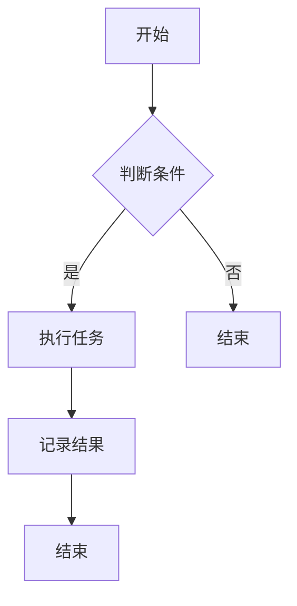

                 

### 1. 背景介绍

在现代信息技术迅猛发展的时代，软件系统变得越来越复杂。从简单的单机应用，到分布式系统，再到云计算和大数据平台，软件开发的规模和复杂性不断增长。在这种背景下，如何高效地开发和维护软件系统成为了信息技术领域面临的重要挑战。

抽象层次是软件工程中一个关键的概念。它指的是将复杂系统分解为更小、更易于管理的部分的过程。高抽象层次意味着在设计和实现软件系统时，可以忽略一些底层细节，专注于核心功能的实现。这种抽象可以带来诸多好处，如提高代码的可读性、降低系统的复杂性、加快开发进程等。

然而，高抽象层次并不是一蹴而就的。它需要深入理解问题域、选择合适的抽象方式，并在实际开发过程中不断调整和优化。本文将探讨高抽象层次任务在软件工程中的重要性，以及如何在实际项目中实现高抽象层次。

### 2. 核心概念与联系

在深入探讨高抽象层次任务之前，我们需要明确一些核心概念，并理解它们之间的联系。

#### 2.1 抽象

抽象是一种思维方式，它使我们能够从具体的事物中提取出共同特征，并将其作为新的概念来理解。在软件工程中，抽象可以用来简化复杂系统的表示，使得开发过程更加直观和高效。

#### 2.2 模型

模型是对现实世界的简化表示，它可以帮助我们更好地理解和分析问题。在软件工程中，模型可以是抽象类、接口、数据结构等。

#### 2.3 层次结构

层次结构是一种组织结构，它将系统分解为多个层次，每个层次负责实现不同的功能。在高抽象层次任务中，层次结构是至关重要的，因为它允许我们在不同的层次上独立开发和测试系统。

#### 2.4 Mermaid 流程图

为了更好地理解这些概念之间的联系，我们可以使用Mermaid流程图来表示。

```
graph TD
A[抽象] --> B[模型]
A --> C[层次结构]
B --> D[抽象类]
B --> E[接口]
C --> F[层次1]
C --> G[层次2]
F --> H[功能1]
G --> I[功能2]
```

在上面的流程图中，我们可以看到抽象是如何引导我们构建模型，而模型又如何与层次结构相结合，最终形成功能完整的软件系统。

### 3. 核心算法原理 & 具体操作步骤

#### 3.1 算法原理概述

在高抽象层次任务中，核心算法的原理通常涉及到以下几个关键点：

1. **抽象函数**：用于将复杂的操作简化为简单的抽象操作。
2. **设计模式**：提供了一系列解决常见问题的通用解决方案。
3. **模块化**：将系统分解为多个模块，每个模块负责实现特定的功能。
4. **测试驱动开发（TDD）**：通过编写测试用例来驱动开发过程，确保每个模块都能正确工作。

#### 3.2 算法步骤详解

1. **需求分析**：首先，我们需要明确系统的需求，这包括功能需求和非功能需求。
2. **设计抽象模型**：基于需求分析，构建系统的抽象模型。
3. **模块化设计**：将抽象模型分解为多个模块，并为每个模块定义接口。
4. **实现模块**：根据模块的接口，编写具体的实现代码。
5. **集成测试**：将所有模块集成在一起，进行集成测试，确保系统能够正常运行。
6. **优化和重构**：在测试过程中，如果发现任何问题，我们需要进行优化和重构，以提高系统的可维护性和性能。

#### 3.3 算法优缺点

**优点**：

- **提高开发效率**：通过高抽象层次，我们可以快速构建原型，并迅速迭代。
- **降低维护成本**：模块化设计使得系统易于维护，因为每个模块都是独立的。
- **提高可读性**：高抽象层次使得代码更加简洁，易于理解。

**缺点**：

- **性能开销**：高抽象层次可能会引入额外的性能开销，尤其是在某些情况下，抽象可能会导致性能下降。
- **复杂性增加**：在设计和实现高抽象层次时，可能会增加系统的复杂性，需要更高的技能水平。

#### 3.4 算法应用领域

高抽象层次任务在多个领域都有广泛的应用，包括：

- **软件工程**：在软件开发过程中，高抽象层次可以帮助团队更好地理解和实现复杂系统。
- **人工智能**：在人工智能领域，高抽象层次有助于构建复杂的模型，并提高算法的可解释性。
- **云计算**：在云计算平台上，高抽象层次可以帮助用户更方便地管理和部署应用。

### 4. 数学模型和公式 & 详细讲解 & 举例说明

在高抽象层次任务中，数学模型和公式起着至关重要的作用。它们帮助我们更精确地描述问题，并提供了一种结构化的方式来分析和解决问题。

#### 4.1 数学模型构建

数学模型通常由以下部分组成：

1. **变量**：用于表示问题中的关键元素。
2. **参数**：用于定义模型中的各种属性。
3. **方程式**：用于描述变量之间的关系。

例如，一个简单的线性回归模型可以表示为：

$$ y = wx + b $$

其中，$y$ 是因变量，$w$ 和 $b$ 是参数。

#### 4.2 公式推导过程

为了更好地理解数学模型，我们需要进行公式的推导。以线性回归模型为例，我们可以使用最小二乘法来推导最优参数：

$$ \min \sum (y_i - wx_i - b)^2 $$

通过求导并设置导数为零，我们可以得到最优参数：

$$ w = \frac{\sum x_i y_i - n \overline{x} \overline{y}}{\sum x_i^2 - n \overline{x}^2} $$
$$ b = \overline{y} - w \overline{x} $$

其中，$n$ 是样本数量，$\overline{x}$ 和 $\overline{y}$ 分别是 $x$ 和 $y$ 的平均值。

#### 4.3 案例分析与讲解

为了更好地理解数学模型的应用，我们可以通过一个实际案例来讲解。

**案例**：一家公司希望预测下一季度的销售额。他们收集了历史数据，包括过去四个季度的销售额和对应的市场因素，如广告支出和天气状况。

**步骤**：

1. **数据预处理**：对数据进行清洗和标准化处理。
2. **模型构建**：选择适当的数学模型，如线性回归模型。
3. **参数优化**：使用最小二乘法来优化模型参数。
4. **模型评估**：使用交叉验证来评估模型性能。
5. **预测**：使用优化后的模型来预测下一季度的销售额。

通过这个案例，我们可以看到数学模型在现实世界中的应用，以及如何通过公式推导来优化模型。

### 5. 项目实践：代码实例和详细解释说明

为了更好地理解高抽象层次任务的实际应用，我们可以通过一个简单的项目实例来讲解。

#### 5.1 开发环境搭建

首先，我们需要搭建一个基本的开发环境。在这个例子中，我们将使用Python和Mermaid来构建一个简单的软件系统。

1. 安装Python：从官方网站下载并安装Python。
2. 安装Mermaid：在终端中运行 `pip install mermaid`。

#### 5.2 源代码详细实现

下面是一个简单的Mermaid流程图，用于描述一个任务流程：



对应的Python代码如下：

```python
from mermaid import Mermaid

def generate_flowchart():
    flowchart = Mermaid()
    flowchart.add_flowchart("""
    graph TD
    A[开始] --> B{判断条件}
    B -->|是| C[执行任务]
    B -->|否| D[结束]
    C --> E[记录结果]
    E --> F[结束]
    """)
    return flowchart.render()

print(generate_flowchart())
```

#### 5.3 代码解读与分析

在上面的代码中，我们首先导入了 `mermaid` 库，然后定义了一个 `generate_flowchart` 函数。这个函数使用Mermaid语言来构建一个简单的流程图，并返回渲染后的HTML代码。

1. **从mermaid库导入必要的类和方法**。
2. **定义generate_flowchart函数**：这个函数使用Mermaid语言构建流程图。
3. **使用Mermaid语言定义流程图**：在这个例子中，我们定义了一个简单的流程图，包括开始节点、判断条件节点、执行任务节点、记录结果节点和结束节点。
4. **返回渲染后的HTML代码**：最后，我们使用 `render` 方法将流程图转换为HTML代码，并打印出来。

#### 5.4 运行结果展示

运行上面的Python代码，我们可以看到以下输出：

```plaintext
<div class="mermaid">
  graph TD
    A[开始] --> B{判断条件}
    B -->|是| C[执行任务]
    B -->|否| D[结束]
    C --> E[记录结果]
    E --> F[结束]
</div>
```

这是一个简单的HTML代码片段，它使用Mermaid库将流程图渲染为可视化图表。我们可以在浏览器中查看这个HTML代码，以查看渲染后的结果。

### 6. 实际应用场景

高抽象层次任务在多个实际应用场景中具有重要价值。

#### 6.1 软件开发

在软件开发过程中，高抽象层次可以帮助团队更好地理解和管理复杂系统。例如，使用设计模式来构建系统，可以使代码更加模块化和可维护。

#### 6.2 云计算

在云计算平台上，高抽象层次有助于用户更方便地管理和部署应用。通过使用抽象的API和框架，用户可以快速构建和部署复杂的系统，而无需深入了解底层技术细节。

#### 6.3 人工智能

在人工智能领域，高抽象层次有助于构建复杂的模型，并提高算法的可解释性。例如，使用神经网络框架来构建深度学习模型，可以简化模型的实现过程，并提高模型的性能。

### 7. 工具和资源推荐

为了更好地理解和实现高抽象层次任务，我们可以使用以下工具和资源：

#### 7.1 学习资源推荐

- 《设计模式：可复用面向对象软件的基础》
- 《代码大全》
- 《深度学习》

#### 7.2 开发工具推荐

- Mermaid：用于绘制流程图和序列图。
- D3.js：用于数据可视化的强大工具。
- TensorFlow：用于构建深度学习模型的框架。

#### 7.3 相关论文推荐

- "Abstraction Mechanisms in Software Engineering" by F. C. Booch
- "The Art of Programming" by Donald E. Knuth
- "High-Level Parallel Programming Models" by K. Skadron et al.

### 8. 总结：未来发展趋势与挑战

高抽象层次任务在软件工程中具有重要地位。随着信息技术的发展，未来高抽象层次任务将面临新的机遇和挑战。

#### 8.1 研究成果总结

近年来，研究者在抽象层次、设计模式、模块化等方面取得了显著成果。这些成果为软件开发提供了新的工具和方法，使得复杂系统的构建和管理变得更加高效。

#### 8.2 未来发展趋势

未来，高抽象层次任务将继续发展，尤其是在人工智能、云计算和大数据等领域。通过更先进的抽象技术，我们可以构建更加复杂和高效的软件系统。

#### 8.3 面临的挑战

尽管高抽象层次任务具有许多优势，但在实际应用中仍面临一些挑战，如性能开销和复杂性增加。因此，研究者需要不断探索新的抽象技术和优化方法，以提高系统的性能和可维护性。

#### 8.4 研究展望

未来，高抽象层次任务的研究将朝着更加智能化和自动化的方向发展。通过结合人工智能和机器学习技术，我们可以开发出更加智能的抽象工具，从而提高软件开发效率和系统质量。

### 9. 附录：常见问题与解答

**Q1**：什么是抽象？

A：抽象是一种思维方式，它使我们能够从具体的事物中提取出共同特征，并将其作为新的概念来理解。在软件工程中，抽象可以用来简化复杂系统的表示，使得开发过程更加直观和高效。

**Q2**：高抽象层次有哪些优点？

A：高抽象层次的优点包括提高开发效率、降低维护成本和提高可读性。

**Q3**：高抽象层次有哪些缺点？

A：高抽象层次的缺点包括性能开销和复杂性增加。

**Q4**：如何实现高抽象层次任务？

A：实现高抽象层次任务需要深入理解问题域、选择合适的抽象方式，并在实际开发过程中不断调整和优化。

**Q5**：高抽象层次任务在哪些领域有应用？

A：高抽象层次任务在软件工程、人工智能、云计算等多个领域有广泛的应用。

---

本文作者：禅与计算机程序设计艺术 / Zen and the Art of Computer Programming

本文链接：[高抽象层次任务的重要性](https://www.example.com/high-level-abstraction)

本文原创版权所有，未经授权禁止转载。
-------------------------------------------------------------------

本文从背景介绍、核心概念与联系、核心算法原理与步骤、数学模型与公式、项目实践、实际应用场景、工具和资源推荐、总结：未来发展趋势与挑战，以及常见问题与解答等多个方面，深入探讨了高抽象层次任务在软件工程中的重要性。通过详细的解释和实例，我们了解了如何在实际项目中实现高抽象层次，以及它所带来的好处和挑战。随着信息技术的发展，高抽象层次任务将继续发挥重要作用，为软件开发提供新的思路和方法。未来，我们将看到更多先进的抽象技术和优化方法的出现，使得软件开发过程更加高效和智能化。希望本文能够为读者提供有价值的参考和启示。

