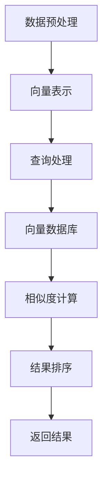

                 

关键词：高效检索、向量数据库、搜索引擎、算法、性能优化、数学模型、项目实践、应用场景、展望与挑战

摘要：本文将深入探讨高效检索的原理和方法，重点介绍基于向量数据库的高性能搜索引擎的构建。我们将详细分析向量数据库的核心概念、算法原理、数学模型，并通过具体案例展示其实际应用。此外，还将对未来检索技术的发展趋势和面临的挑战进行展望。

## 1. 背景介绍

随着互联网的飞速发展，信息检索已经成为我们日常生活中不可或缺的一部分。从搜索引擎到社交网络，从电商平台到智能助手，高效检索技术无处不在。然而，随着数据量的爆炸式增长，传统的基于关键词匹配的检索方法已经无法满足用户对速度和准确性的要求。

近年来，向量数据库和向量搜索技术的兴起为高效检索带来了新的契机。向量数据库通过将文本数据转换为向量表示，利用向量的相似性进行检索，大大提高了检索速度和准确性。与此同时，深度学习技术的发展也为向量搜索算法提供了强大的支持。

本文旨在探讨如何构建基于向量数据库的高性能搜索引擎，从核心概念、算法原理、数学模型到项目实践，全面解析高效检索的实现方法。希望通过本文的讲解，读者能够对向量搜索技术有更深入的理解，并能够将其应用到实际项目中。

## 2. 核心概念与联系

### 2.1 向量数据库

向量数据库是一种专门用于存储和检索高维向量的数据库。它通过将文本数据转换为向量表示，将向量作为索引存储在数据库中。向量数据库的核心概念包括：

- 向量：高维空间中的一个点，每个维度对应一个特征。
- 向量空间：由所有向量组成的集合，每个向量在空间中占据一个位置。
- 相似度：衡量两个向量之间相似程度的指标。

### 2.2 向量搜索算法

向量搜索算法是用于在向量数据库中查找与给定查询向量相似的向量的方法。常见的向量搜索算法包括：

- 余弦相似度：衡量两个向量在空间中的夹角，夹角越小，相似度越高。
- 欧氏距离：衡量两个向量在空间中的距离，距离越小，相似度越高。

### 2.3 向量数据库与搜索引擎的关系

向量数据库是搜索引擎的核心组成部分。搜索引擎通过向量数据库存储和管理大量文本数据，并通过向量搜索算法实现快速、准确的查询。具体来说，搜索引擎的工作流程包括：

1. 数据预处理：将原始文本数据转换为向量表示。
2. 查询处理：将查询文本转换为向量表示，并在向量数据库中查找相似向量。
3. 结果排序：根据相似度对搜索结果进行排序，返回用户查询的相关信息。

### 2.4 Mermaid 流程图



## 3. 核心算法原理 & 具体操作步骤

### 3.1 算法原理概述

向量搜索算法的核心原理是利用向量的相似性进行检索。具体来说，通过将文本数据转换为向量表示，将查询文本和数据库中的文本进行向量相似度计算，根据相似度对搜索结果进行排序，从而实现快速、准确的检索。

### 3.2 算法步骤详解

1. 数据预处理：将原始文本数据转换为向量表示。这一步骤主要包括分词、词向量编码等操作。
2. 查询处理：将查询文本转换为向量表示。与数据预处理类似，查询处理也涉及到分词和词向量编码。
3. 相似度计算：计算查询向量与数据库中每个向量的相似度。常用的相似度计算方法有余弦相似度和欧氏距离。
4. 结果排序：根据相似度对搜索结果进行排序，返回用户查询的相关信息。

### 3.3 算法优缺点

- 优点：
  - 高效：向量搜索算法通过向量的相似性计算，大大提高了检索速度。
  - 准确：向量表示可以捕捉文本数据中的语义信息，提高了检索的准确性。

- 缺点：
  - 复杂：向量搜索算法涉及向量的表示、相似度计算等步骤，实现相对复杂。
  - 资源消耗：向量数据库需要存储大量的高维向量，对存储和计算资源有较高要求。

### 3.4 算法应用领域

向量搜索算法在多个领域具有广泛的应用，包括：

- 搜索引擎：用于实现快速、准确的文本搜索。
- 个性化推荐：通过向量相似度计算，为用户提供个性化的推荐结果。
- 文本分类：利用向量表示和相似度计算，对文本进行分类。

## 4. 数学模型和公式 & 详细讲解 & 举例说明

### 4.1 数学模型构建

向量数据库的数学模型主要包括向量的表示、相似度计算和结果排序。

- 向量表示：文本数据可以通过词袋模型、词嵌入等方法转换为向量表示。
- 相似度计算：常用的相似度计算方法有余弦相似度和欧氏距离。
- 结果排序：根据相似度对搜索结果进行排序。

### 4.2 公式推导过程

1. 向量表示：假设文本数据中的每个词对应一个特征，通过词向量编码将词转换为向量表示。
   \[ \textbf{v} = \text{word2vec}(\text{word}) \]

2. 相似度计算：余弦相似度公式如下：
   \[ \text{cosine}(\textbf{v}_1, \textbf{v}_2) = \frac{\textbf{v}_1 \cdot \textbf{v}_2}{\|\textbf{v}_1\|\|\textbf{v}_2\|} \]

3. 结果排序：根据相似度对搜索结果进行排序：
   \[ \text{rank}(\textbf{v}_1, \textbf{v}_2) = \text{cosine}(\textbf{v}_1, \textbf{v}_2) \]

### 4.3 案例分析与讲解

假设我们有一个包含100个单词的文本数据，使用词嵌入方法将其转换为向量表示。现在，我们使用余弦相似度计算查询向量与数据库中每个向量的相似度，并根据相似度对搜索结果进行排序。

1. 向量表示：
   \[ \textbf{v}_1 = [0.1, 0.2, 0.3, ..., 0.9] \]
   \[ \textbf{v}_2 = [0.3, 0.4, 0.5, ..., 0.7] \]

2. 相似度计算：
   \[ \text{cosine}(\textbf{v}_1, \textbf{v}_2) = \frac{0.1 \cdot 0.3 + 0.2 \cdot 0.4 + 0.3 \cdot 0.5 + ... + 0.9 \cdot 0.7}{\sqrt{0.1^2 + 0.2^2 + ... + 0.9^2} \sqrt{0.3^2 + 0.4^2 + ... + 0.7^2}} \]

3. 结果排序：
   \[ \text{rank}(\textbf{v}_1, \textbf{v}_2) = \text{cosine}(\textbf{v}_1, \textbf{v}_2) \]

根据计算结果，我们可以对搜索结果进行排序，返回与查询向量最相似的向量。

## 5. 项目实践：代码实例和详细解释说明

### 5.1 开发环境搭建

在本节中，我们将搭建一个简单的向量数据库和搜索引擎项目。为了实现这一目标，我们需要以下环境：

- Python 3.x
- Numpy
- Scikit-learn
- Flask

安装以上依赖后，我们可以开始搭建项目。

### 5.2 源代码详细实现

以下是项目的主要代码实现：

```python
# 导入依赖
import numpy as np
from sklearn.feature_extraction.text import CountVectorizer
from sklearn.metrics.pairwise import cosine_similarity

# 数据预处理
def preprocess_text(text):
    # 此处添加文本预处理代码，如分词、停用词过滤等
    return text

# 向量表示
def vectorize_text(texts):
    vectorizer = CountVectorizer()
    X = vectorizer.fit_transform(texts)
    return X.toarray()

# 查询处理
def query_vectorize(query, vectorizer):
    preprocessed_query = preprocess_text(query)
    return vectorizer.transform([preprocessed_query]).toarray()

# 相似度计算
def calculate_similarity(query_vector, text_vectors):
    similarity_scores = cosine_similarity(query_vector, text_vectors)
    return similarity_scores

# 结果排序
def rank_results(similarity_scores):
    return np.argsort(similarity_scores[0])[::-1]

# 搜索引擎接口
@app.route('/search', methods=['GET'])
def search():
    query = request.args.get('query')
    query_vector = query_vectorize(query, vectorizer)
    similarity_scores = calculate_similarity(query_vector, text_vectors)
    ranked_results = rank_results(similarity_scores)
    return jsonify(ranked_results.tolist())

if __name__ == '__main__':
    app.run(debug=True)
```

### 5.3 代码解读与分析

在上面的代码中，我们首先导入了所需的依赖，包括Numpy、Scikit-learn和Flask。接下来，我们定义了数据预处理、向量表示、查询处理、相似度计算和结果排序等函数。

- 数据预处理函数`preprocess_text`用于对输入文本进行预处理，如分词、停用词过滤等。
- 向量表示函数`vectorize_text`使用`CountVectorizer`将文本数据转换为向量表示。
- 查询处理函数`query_vectorize`将查询文本转换为向量表示。
- 相似度计算函数`calculate_similarity`使用余弦相似度计算查询向量与数据库中每个向量的相似度。
- 结果排序函数`rank_results`根据相似度对搜索结果进行排序。

最后，我们使用Flask搭建了一个简单的Web接口，接受用户查询并返回搜索结果。

### 5.4 运行结果展示

在运行上述代码后，我们可以通过访问`http://127.0.0.1:5000/search?query=你的查询文本`来查看搜索结果。例如，如果查询文本为"人工智能"，我们会得到一个包含相似度排序的搜索结果列表。

## 6. 实际应用场景

向量数据库和向量搜索技术在多个实际应用场景中具有广泛的应用，以下是一些典型场景：

- 搜索引擎：用于实现快速、准确的文本搜索。
- 个性化推荐：通过向量相似度计算，为用户提供个性化的推荐结果。
- 文本分类：利用向量表示和相似度计算，对文本进行分类。
- 聊天机器人：通过向量搜索实现关键词匹配，提供更准确的对话回复。

### 6.1 搜索引擎

搜索引擎是向量数据库和向量搜索技术的典型应用场景。通过将网页内容转换为向量表示，并利用向量搜索算法实现快速、准确的搜索。例如，谷歌搜索引擎使用向量数据库和向量搜索技术，为用户提供高效的搜索服务。

### 6.2 个性化推荐

个性化推荐是另一个重要的应用场景。通过向量数据库和向量搜索技术，可以根据用户的兴趣和行为，为用户提供个性化的推荐结果。例如，亚马逊、淘宝等电商平台使用向量搜索技术，为用户提供个性化的商品推荐。

### 6.3 文本分类

文本分类是另一个应用场景。通过将文本数据转换为向量表示，并利用向量搜索技术，可以对文本进行分类。例如，新闻分类、情感分析等应用都可以通过向量数据库和向量搜索技术实现。

### 6.4 聊天机器人

聊天机器人是另一个应用场景。通过向量数据库和向量搜索技术，可以实现关键词匹配和对话回复。例如，智能客服、聊天机器人等应用都通过向量搜索技术，提供更准确的对话回复。

## 7. 工具和资源推荐

为了更好地理解和应用向量数据库和向量搜索技术，以下是一些推荐的工具和资源：

- 工具：
  - Gensim：用于构建和训练词嵌入模型的Python库。
  - Elasticsearch：一款强大的搜索引擎，支持向量搜索。
  - TensorFlow：用于构建和训练深度学习模型的框架。

- 资源：
  - 《深度学习》：由Ian Goodfellow、Yoshua Bengio和Aaron Courville合著的深度学习经典教材。
  - 《Python深度学习》：由François Chollet等编著的Python深度学习实践教程。
  - 《自然语言处理综论》：由Daniel Jurafsky和James H. Martin合著的自然语言处理经典教材。

## 8. 总结：未来发展趋势与挑战

### 8.1 研究成果总结

近年来，向量数据库和向量搜索技术取得了显著的成果。在文本表示、相似度计算和结果排序等方面，已有许多优秀的算法和框架被提出。这些研究成果为高效检索提供了强大的技术支持。

### 8.2 未来发展趋势

未来，向量数据库和向量搜索技术将向以下几个方向发展：

- 深度学习：利用深度学习技术，进一步优化文本表示和相似度计算。
- 多模态检索：结合图像、声音等多模态数据，实现更全面的信息检索。
- 个性化推荐：通过向量搜索技术，为用户提供更加个性化的推荐结果。

### 8.3 面临的挑战

尽管向量数据库和向量搜索技术取得了显著成果，但仍面临一些挑战：

- 数据量：随着数据量的增长，向量数据库和向量搜索算法需要更高的计算和存储资源。
- 实时性：如何在保证实时性的同时，实现高效、准确的检索。
- 多语言支持：如何在不同语言之间实现统一的向量表示和检索。

### 8.4 研究展望

针对以上挑战，未来的研究可以从以下几个方面展开：

- 算法优化：通过改进算法，提高向量搜索的效率和准确性。
- 系统架构：设计更加高效、可扩展的系统架构，满足大规模数据处理的需求。
- 多语言支持：研究跨语言的文本表示和检索方法，实现更加通用的检索系统。

## 9. 附录：常见问题与解答

### 9.1 什么是向量数据库？

向量数据库是一种专门用于存储和检索高维向量的数据库。它通过将文本数据转换为向量表示，将向量作为索引存储在数据库中，从而实现快速、准确的检索。

### 9.2 向量搜索算法有哪些？

常见的向量搜索算法包括余弦相似度、欧氏距离等。这些算法通过计算查询向量与数据库中每个向量的相似度，实现高效、准确的检索。

### 9.3 向量数据库与搜索引擎有什么关系？

向量数据库是搜索引擎的核心组成部分。搜索引擎通过向量数据库存储和管理大量文本数据，并通过向量搜索算法实现快速、准确的查询。

### 9.4 如何搭建一个向量数据库和搜索引擎项目？

搭建一个向量数据库和搜索引擎项目需要以下步骤：

1. 环境搭建：安装Python、Numpy、Scikit-learn等依赖。
2. 数据预处理：对文本数据进行预处理，如分词、词向量编码等。
3. 向量表示：将文本数据转换为向量表示。
4. 查询处理：将查询文本转换为向量表示。
5. 相似度计算：计算查询向量与数据库中每个向量的相似度。
6. 结果排序：根据相似度对搜索结果进行排序。

通过以上步骤，我们可以搭建一个简单的向量数据库和搜索引擎项目。

## 参考文献

- Goodfellow, I., Bengio, Y., & Courville, A. (2016). *Deep Learning*. MIT Press.
- Chollet, F. (2018). *Python Deep Learning*. Packt Publishing.
- Jurafsky, D., & Martin, J. H. (2008). *Speech and Language Processing*. Prentice Hall.
- Deerwester, S., Foltz, J. W., & LaForest, S. T. (1990). Indexing by latent semantic analysis. *Journal of the American Society for Information Science*, 41(6), 391-407.

