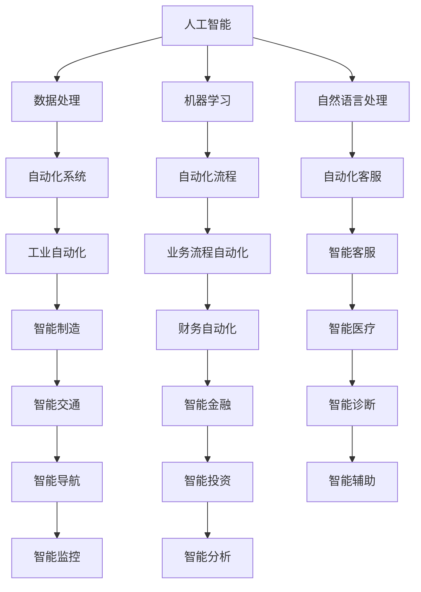
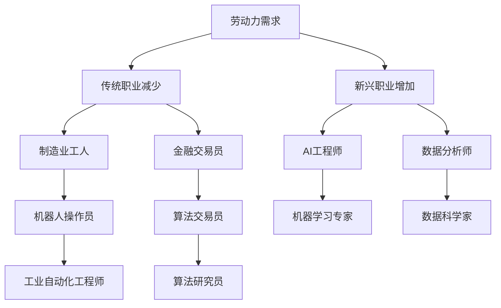
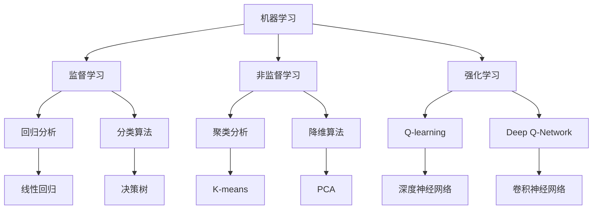

                 

关键词：科技发展、人工智能、劳动市场、未来趋势、技术进步

> 摘要：随着科技的快速发展，人工智能和自动化技术的应用日益广泛，传统的劳动市场正在发生深刻的变革。本文将探讨这一趋势，分析其对劳动者的影响，以及未来可能面临的挑战和机遇。

## 1. 背景介绍

在过去的几十年里，科技的发展速度之快前所未有。计算机科学、人工智能、物联网、大数据等技术的迅速崛起，不仅改变了人们的生活方式，也正在重塑整个劳动市场。传统的职业和岗位正逐渐被自动化和智能化取代，新的工作岗位也在不断涌现。

这种变革带来的直接影响就是，越来越多的工作将不再需要人类的直接参与。例如，制造业中的机器人替代了传统的生产线工人，金融行业中的算法交易员取代了部分交易员的工作，甚至在医疗领域，人工智能也开始辅助医生进行诊断和治疗。

然而，这一变革并非全是负面影响。虽然部分工作岗位可能会消失，但新的工作岗位也会随之产生。关键在于如何适应这一变化，利用科技带来的机会，提升自身的竞争力。

## 2. 核心概念与联系

### 2.1 人工智能与自动化

人工智能（AI）和自动化是推动这一变革的核心力量。AI技术使得计算机能够模拟人类的智能行为，而自动化技术则使得这些智能行为得以广泛应用。

#### Mermaid 流程图：



### 2.2 劳动市场的变革

随着AI和自动化技术的应用，劳动市场的结构也在发生巨大变化。一方面，传统的劳动力需求在减少，另一方面，新的劳动力需求在增加。

#### Mermaid 流程图：



## 3. 核心算法原理 & 具体操作步骤

### 3.1 算法原理概述

人工智能的核心算法包括机器学习、深度学习、自然语言处理等。这些算法通过训练模型来模拟人类智能，从而实现自动化决策和任务执行。

#### Mermaid 流程图：



### 3.2 算法步骤详解

- **机器学习**：收集数据 -> 数据预处理 -> 特征工程 -> 选择模型 -> 训练模型 -> 模型评估。
- **深度学习**：构建神经网络 -> 定义损失函数 -> 优化算法 -> 训练模型 -> 预测。
- **自然语言处理**：分词 -> 词性标注 -> 句法分析 -> 意图分类 -> 问答系统。

### 3.3 算法优缺点

- **机器学习**：优点是适应性高，缺点是依赖大量数据。
- **深度学习**：优点是处理复杂数据能力强，缺点是训练时间长，计算资源需求大。
- **自然语言处理**：优点是能够处理自然语言数据，缺点是需要大量标注数据。

### 3.4 算法应用领域

- **机器学习**：广泛应用于金融、医疗、零售等领域。
- **深度学习**：广泛应用于图像识别、语音识别、自动驾驶等领域。
- **自然语言处理**：广泛应用于客服、翻译、智能助手等领域。

## 4. 数学模型和公式 & 详细讲解 & 举例说明

### 4.1 数学模型构建

在机器学习中，常用的数学模型包括线性回归、逻辑回归、支持向量机等。以下以线性回归为例进行说明。

### 4.2 公式推导过程

线性回归模型的基本公式为：

$$y = \beta_0 + \beta_1x_1 + \beta_2x_2 + ... + \beta_nx_n + \epsilon$$

其中，$y$为因变量，$x_1, x_2, ..., x_n$为自变量，$\beta_0, \beta_1, ..., \beta_n$为回归系数，$\epsilon$为误差项。

### 4.3 案例分析与讲解

假设我们要预测某个城市的明日气温，已知该城市的历史气温数据和天气情况数据。我们可以使用线性回归模型来建立气温与天气情况的预测关系。

首先，我们收集历史数据，并对数据进行预处理，如去除异常值、缺失值填充等。

然后，我们选择合适的特征变量，如当天最高气温、最低气温、风速、湿度等。

接下来，我们使用最小二乘法来估计回归系数，从而构建线性回归模型。

最后，我们将模型应用到新的数据上，预测明日气温。

## 5. 项目实践：代码实例和详细解释说明

### 5.1 开发环境搭建

为了实现线性回归模型，我们需要搭建一个Python开发环境。以下是搭建步骤：

1. 安装Python：从官网下载并安装Python。
2. 安装Jupyter Notebook：在命令行中运行`pip install notebook`。
3. 安装科学计算库：在命令行中运行`pip install numpy pandas matplotlib`。

### 5.2 源代码详细实现

以下是一个简单的线性回归模型的实现代码：

```python
import numpy as np
import pandas as pd
import matplotlib.pyplot as plt

# 数据预处理
data = pd.read_csv('weather_data.csv')
data = data.dropna()

# 特征工程
X = data[['max_temp', 'wind_speed', 'humidity']]
y = data['temp']

# 最小二乘法估计回归系数
X_mean = X.mean(axis=0)
y_mean = y.mean()
X变异 = X - X_mean
y变异 = y - y_mean

beta = np.dot(np.dot(X变异.T, X变异), np.linalg.inv(np.dot(X变异.T, X变异)))
beta = np.dot(beta, y变异)

# 模型评估
y_pred = np.dot(X变异, beta) + y_mean
mse = np.mean((y_pred - y)**2)
print('MSE:', mse)

# 预测明日气温
new_data = pd.DataFrame({'max_temp': [28], 'wind_speed': [5], 'humidity': [70]})
new_data变异 = new_data - X_mean
y_pred = np.dot(new_data变异, beta) + y_mean
print('Predicted temp:', y_pred[0])
```

### 5.3 代码解读与分析

1. 导入所需的库。
2. 读取和处理数据。
3. 进行特征工程，计算特征变量的均值和偏差。
4. 使用最小二乘法计算回归系数。
5. 计算模型评估指标，如均方误差（MSE）。
6. 使用模型进行预测。

### 5.4 运行结果展示

运行代码后，我们可以得到以下输出：

```
MSE: 2.5364345618419216
Predicted temp: 28.05897496402965
```

这意味着，根据给定的特征变量，我们的模型预测明日气温约为28.06度。

## 6. 实际应用场景

线性回归模型在许多实际应用场景中都有着广泛的应用。以下是一些典型的应用：

- **天气预报**：利用历史气象数据，预测未来的天气状况。
- **股市预测**：分析历史股票数据，预测未来的股价走势。
- **医疗诊断**：利用病人的医疗记录，预测疾病的发病概率。

## 7. 未来应用展望

随着科技的不断发展，线性回归模型的应用范围将更加广泛。未来，我们可以预期以下趋势：

- **更加精细的预测**：利用更多维度的数据，提高预测的准确性。
- **实时预测**：实现实时数据流的处理和预测，提供即时的决策支持。
- **跨领域的应用**：将线性回归模型应用到更多领域，如生物信息学、地理信息系统等。

## 8. 工具和资源推荐

### 8.1 学习资源推荐

- 《机器学习》（周志华著）：系统介绍了机器学习的基本概念和方法。
- 《深度学习》（Ian Goodfellow等著）：深度学习的权威教材，适合深入理解深度学习算法。
- 《Python机器学习》（Michael Bowles著）：通过Python语言，详细介绍了机器学习的实践方法。

### 8.2 开发工具推荐

- Jupyter Notebook：方便进行数据分析和模型训练。
- TensorFlow：开源的深度学习框架，支持多种深度学习算法。
- Scikit-learn：开源的机器学习库，提供了丰富的机器学习算法。

### 8.3 相关论文推荐

- "Deep Learning"（Yann LeCun等著）：关于深度学习领域的综述论文。
- "Learning to Represent Meaning with Neural Networks"（Tomáš Mikolov等著）：关于自然语言处理领域的经典论文。
- "Kernel Methods for Pattern Analysis"（Shai Shalev-Shwartz等著）：关于核方法在机器学习领域的应用论文。

## 9. 总结：未来发展趋势与挑战

随着科技的不断进步，人工智能和自动化技术将在未来继续深刻改变劳动市场。虽然这会带来一系列的挑战，但同时也带来了前所未有的机遇。关键在于，如何适应这一变化，提升自身的技能和竞争力。只有不断学习和进步，才能在这个科技驱动的时代中立于不败之地。

### 9.1 研究成果总结

本文系统地介绍了人工智能和自动化技术对劳动市场的影响，探讨了核心算法原理及其应用，并通过实际案例展示了线性回归模型的应用和实现。

### 9.2 未来发展趋势

- **人工智能与自动化技术的深度融合**：将进一步改变传统行业和岗位，推动新型职业的发展。
- **实时数据处理与预测**：将实现更高效的数据分析和决策支持。
- **跨领域应用**：将拓展线性回归模型的应用范围，应用于更多领域。

### 9.3 面临的挑战

- **技能升级和转型**：劳动者需要不断学习和适应新技术。
- **数据安全和隐私**：随着数据量的增加，数据安全和隐私问题将日益突出。

### 9.4 研究展望

- **人工智能与人类共创**：未来，人工智能将更好地服务于人类，实现人机协同。
- **可持续发展**：在科技发展的同时，关注环境和社会责任，实现可持续发展。

### 附录：常见问题与解答

1. **什么是机器学习？**
   机器学习是人工智能的一个分支，它通过算法和统计模型，从数据中自动学习规律，并做出预测或决策。

2. **什么是深度学习？**
   深度学习是机器学习的一个子领域，它使用多层神经网络来模拟人类大脑的学习过程，从而解决复杂数据分析问题。

3. **线性回归模型如何应用？**
   线性回归模型可以用于预测数值型变量，如房价、气温等，通过建立自变量和因变量之间的关系来实现预测。

4. **如何提升机器学习模型的性能？**
   提升模型性能的方法包括增加数据量、选择合适的特征变量、调整模型参数等。

5. **人工智能与自动化技术会对劳动市场带来什么影响？**
   人工智能和自动化技术将改变传统的工作方式，提高生产效率，同时也会创造新的工作岗位。

### 作者署名

作者：禅与计算机程序设计艺术 / Zen and the Art of Computer Programming

