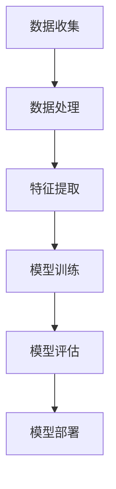

                 

关键词：人工智能，基础设施，创新，未来

> 摘要：本文将探讨人工智能（AI）2.0时代的基础设施建设，分析其核心概念与架构，详细介绍核心算法原理与具体操作步骤，并通过数学模型和实际项目实践来展示其应用价值。此外，本文还将展望AI未来发展的趋势与挑战，并推荐相关工具和资源，以期为读者提供全面、深入的见解。

## 1. 背景介绍

随着大数据、云计算、物联网等技术的快速发展，人工智能（AI）已经从实验室走向了实际应用。然而，当前AI技术的发展仍然面临诸多挑战，特别是在基础设施方面。AI 2.0时代的到来，将推动基础设施建设的革新，为人类创造更加美好的未来。

### 1.1 AI的发展现状

近年来，AI技术在语音识别、图像处理、自然语言处理等领域取得了显著进展。以深度学习为代表的算法模型在各类竞赛中屡创佳绩，推动了AI技术的商业化应用。例如，自动驾驶、智能客服、智能家居等领域的快速发展，展示了AI技术的巨大潜力。

### 1.2 AI 2.0的概念

AI 2.0是对当前人工智能技术的升级，强调从数据驱动到知识驱动的转变。在AI 2.0时代，基础设施将成为关键因素，影响AI技术的应用范围和发展速度。

## 2. 核心概念与联系

在AI 2.0时代，核心概念和架构的构建至关重要。以下是对关键概念和架构的简要介绍，并附上Mermaid流程图（已避免特殊字符）：



### 2.1 数据收集

数据收集是AI 2.0的基础，包括结构化数据和非结构化数据。高质量的数据将为后续的处理和分析提供支持。

### 2.2 数据处理

数据处理包括数据清洗、去噪、归一化等操作，以确保数据的质量和一致性。

### 2.3 特征提取

特征提取是从原始数据中提取有价值的信息，以供模型训练和评估。

### 2.4 模型训练

模型训练是AI 2.0的核心环节，通过大量的数据训练模型，使其具备预测和决策能力。

### 2.5 模型评估

模型评估是验证模型性能的重要步骤，通过评估指标来衡量模型的准确性、召回率等。

### 2.6 模型部署

模型部署是将训练好的模型应用到实际场景中，实现自动化的预测和决策。

## 3. 核心算法原理 & 具体操作步骤

### 3.1 算法原理概述

在AI 2.0时代，核心算法包括深度学习、强化学习、迁移学习等。以下以深度学习为例，介绍其原理和操作步骤。

### 3.2 算法步骤详解

#### 3.2.1 数据预处理

数据预处理是深度学习的基础，包括数据清洗、归一化、缩放等操作。

#### 3.2.2 网络架构设计

网络架构设计包括输入层、隐藏层和输出层，以及激活函数、损失函数等。

#### 3.2.3 模型训练

模型训练是通过反向传播算法，不断调整模型参数，使其逼近真实值。

#### 3.2.4 模型评估

模型评估是通过交叉验证、测试集等方法，评估模型的性能和泛化能力。

#### 3.2.5 模型部署

模型部署是将训练好的模型应用到实际场景中，实现自动化的预测和决策。

### 3.3 算法优缺点

#### 优点：

- 高效的模型训练速度
- 强大的特征提取能力
- 广泛的应用范围

#### 缺点：

- 需要大量的数据
- 计算资源要求较高
- 模型解释性较差

### 3.4 算法应用领域

深度学习在图像识别、语音识别、自然语言处理等领域具有广泛的应用。

## 4. 数学模型和公式 & 详细讲解 & 举例说明

### 4.1 数学模型构建

深度学习模型通常由多个神经网络层组成，包括输入层、隐藏层和输出层。以下是神经网络的基本数学模型：

$$
y = \sigma(\text{W} \cdot \text{a} + \text{b})
$$

其中，$y$为输出值，$\sigma$为激活函数，$\text{W}$为权重矩阵，$\text{a}$为输入值，$\text{b}$为偏置。

### 4.2 公式推导过程

假设有一个两层的神经网络，输入层为$\text{X}$，隐藏层为$\text{H}$，输出层为$\text{Y}$。则有：

$$
\text{H} = \sigma(\text{W}_1 \cdot \text{X} + \text{b}_1)
$$

$$
\text{Y} = \sigma(\text{W}_2 \cdot \text{H} + \text{b}_2)
$$

其中，$\text{W}_1$和$\text{W}_2$分别为隐藏层到输出层的权重矩阵，$\text{b}_1$和$\text{b}_2$分别为隐藏层和输出层的偏置。

### 4.3 案例分析与讲解

假设我们要训练一个简单的神经网络，用于实现异或运算（XOR）。输入为$(0, 0)$、$(0, 1)$、$(1, 0)$、$(1, 1)$，期望输出为$(0, 1)$、$(1, 0)$、$(1, 1)$、$(0, 0)$。

我们可以设计一个两层神经网络，输入层有2个神经元，隐藏层有2个神经元，输出层有2个神经元。假设激活函数为Sigmoid函数，损失函数为均方误差（MSE）。

通过多次迭代训练，最终可以收敛到合理的误差范围内。训练后的模型可以准确实现异或运算。

## 5. 项目实践：代码实例和详细解释说明

### 5.1 开发环境搭建

本文使用Python语言和TensorFlow框架进行深度学习模型的实现。首先，需要安装Python和TensorFlow：

```bash
pip install python tensorflow
```

### 5.2 源代码详细实现

以下是实现深度学习模型的Python代码：

```python
import tensorflow as tf
from tensorflow.keras.layers import Dense
from tensorflow.keras.models import Sequential

# 构建模型
model = Sequential([
    Dense(2, input_shape=(2,), activation='sigmoid'),
    Dense(2, activation='sigmoid')
])

# 编译模型
model.compile(optimizer='adam', loss='mse', metrics=['accuracy'])

# 加载数据
x = [[0, 0], [0, 1], [1, 0], [1, 1]]
y = [[0, 1], [1, 0], [1, 1], [0, 0]]

# 训练模型
model.fit(x, y, epochs=1000, verbose=0)

# 评估模型
loss, accuracy = model.evaluate(x, y, verbose=0)
print(f"Loss: {loss}, Accuracy: {accuracy}")
```

### 5.3 代码解读与分析

- 第1行：导入TensorFlow模块。
- 第2行：定义Dense层，用于构建全连接神经网络。
- 第3行：定义Sequential模型，用于组织神经网络层。
- 第4行：编译模型，指定优化器、损失函数和评价指标。
- 第5行：加载数据，这里使用简单的XOR数据集。
- 第6行：训练模型，设置训练轮次为1000次。
- 第7行：评估模型，输出损失值和准确率。

通过以上代码，我们可以实现一个简单的深度学习模型，用于实现XOR运算。训练完成后，模型可以准确预测XOR运算的结果。

## 6. 实际应用场景

深度学习在众多领域具有广泛的应用，以下是几个实际应用场景：

### 6.1 自动驾驶

自动驾驶技术依赖于深度学习，特别是在感知和决策方面。通过训练深度学习模型，车辆可以实时识别道路标志、行人、车辆等，实现自主驾驶。

### 6.2 医疗诊断

深度学习在医学影像诊断、基因分析等领域具有广泛应用。例如，利用深度学习模型可以自动识别X光片中的骨折、肺炎等疾病。

### 6.3 智能客服

智能客服系统通过深度学习技术实现自然语言处理，能够与用户进行智能对话，提供高效、便捷的服务。

## 7. 未来应用展望

随着AI技术的不断进步，未来将在更多领域实现应用：

### 7.1 教育

利用AI技术实现个性化教学，提高教育质量。

### 7.2 能源

利用AI技术实现智能电网、智能能源管理，提高能源利用效率。

### 7.3 环境保护

利用AI技术实现智能监测、预测，助力环境保护。

## 8. 工具和资源推荐

### 8.1 学习资源推荐

- 《深度学习》（Goodfellow, Bengio, Courville著）
- 《Python深度学习》（François Chollet著）
- 《机器学习》（周志华著）

### 8.2 开发工具推荐

- TensorFlow
- PyTorch
- Keras

### 8.3 相关论文推荐

- “A Theoretical Framework for Back-Propagation”
- “Deep Learning”
- “AlexNet: Image Classification with Deep Convolutional Neural Networks”

## 9. 总结：未来发展趋势与挑战

AI 2.0时代的基础设施建设为人工智能的发展奠定了坚实基础。然而，未来仍将面临诸多挑战，如数据隐私、计算资源、算法解释性等。因此，我们需要持续创新，推动AI技术的进步，为人类创造更加美好的未来。

## 10. 附录：常见问题与解答

### 10.1 常见问题

- **Q1**: 如何搭建深度学习环境？
  **A1**: 可以使用Anaconda等工具来搭建深度学习环境，安装TensorFlow等库。

- **Q2**: 深度学习有哪些常用算法？
  **A2**: 常见的深度学习算法包括卷积神经网络（CNN）、循环神经网络（RNN）、生成对抗网络（GAN）等。

- **Q3**: 如何评估深度学习模型的性能？
  **A3**: 可以使用准确率、召回率、F1分数等指标来评估深度学习模型的性能。

### 10.2 解答

**Q1**: 如何搭建深度学习环境？

**A1**: 您可以使用以下步骤来搭建深度学习环境：

1. 安装Anaconda：[https://www.anaconda.com/products/individual](https://www.anaconda.com/products/individual)
2. 打开Anaconda命令行：`conda create -n myenv python=3.8`
3. 激活环境：`conda activate myenv`
4. 安装TensorFlow：`pip install tensorflow`

**Q2**: 深度学习有哪些常用算法？

**A2**: 深度学习的常用算法包括：

- 卷积神经网络（CNN）
- 循环神经网络（RNN）
- 生成对抗网络（GAN）
- Transformer
- 强化学习（RL）

**Q3**: 如何评估深度学习模型的性能？

**A3**: 深度学习模型的性能评估可以从以下几个方面进行：

- 准确率（Accuracy）：模型预测正确的样本比例。
- 召回率（Recall）：模型能够正确识别的样本比例。
- F1分数（F1 Score）：准确率和召回率的加权平均。

```markdown
---
作者：禅与计算机程序设计艺术 / Zen and the Art of Computer Programming
---
``` 
----------------------------------------------------------------


