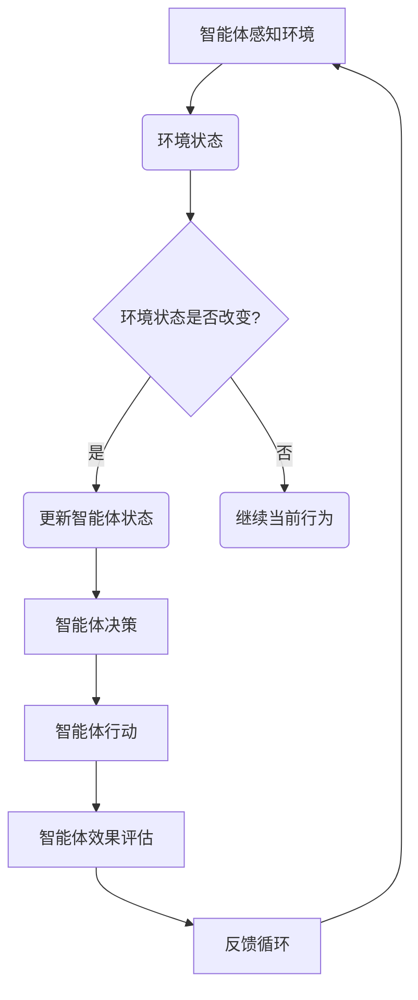

                 

关键词：人工智能、智能体、多智能体系统、自主决策、协作、机器学习、强化学习

> 摘要：本文将深入探讨人工智能中的核心概念——智能体（AI Agent），以及其在多智能体系统中的应用。我们将从背景介绍、核心概念与联系、核心算法原理、数学模型和公式、项目实践、实际应用场景、未来应用展望、工具和资源推荐以及总结未来发展趋势与挑战等多个方面，全面解析智能体的技术内涵和实际应用价值。

## 1. 背景介绍

在当今信息技术飞速发展的时代，人工智能已经成为推动科技进步和社会变革的重要力量。智能体（AI Agent）作为人工智能领域的核心概念之一，已经在各个行业中发挥着越来越重要的作用。智能体是一种能够感知环境、自主决策并采取行动的计算机程序，其目标是实现自动化、智能化和高效化的任务执行。

从历史上看，智能体的概念最早可以追溯到1977年，当时计算机科学家约翰·霍普菲尔（John Hopfield）提出了基于神经网络的自适应控制系统。随着人工智能技术的不断发展，特别是机器学习和深度学习技术的突破，智能体的设计和实现变得更加成熟和高效。

智能体的出现不仅为解决复杂问题提供了新的思路，而且在提高生产效率、优化资源分配、提升决策质量等方面具有显著的应用价值。例如，在工业自动化中，智能体可以实现对生产线的实时监控和故障诊断；在交通管理中，智能体可以优化交通信号控制，减少拥堵和事故发生；在金融领域，智能体可以用于风险管理、投资策略制定等。

## 2. 核心概念与联系

### 2.1 智能体的定义

智能体是一种能够自主地感知环境、理解环境状态、根据预定的目标或策略进行决策并采取行动的计算机程序。智能体具有以下几个关键特征：

- **自主性**：智能体能够独立进行决策，不需要外部干预。
- **适应性**：智能体能够根据环境的变化调整自己的行为。
- **协作性**：智能体可以与其他智能体进行交互，协同完成任务。
- **学习能力**：智能体可以通过学习环境中的经验来优化自身的决策行为。

### 2.2 多智能体系统的概念

多智能体系统（Multi-Agent System，MAS）是指由多个智能体组成的系统，这些智能体可以相互协作或竞争，以实现共同的目标。多智能体系统具有以下特点：

- **分布式**：智能体分布在不同位置，通过通信网络进行协作。
- **异构性**：智能体可以是不同的类型，具有不同的能力和任务。
- **动态性**：智能体和环境都是动态变化的。
- **自主性**：每个智能体都有一定的自主决策能力。

### 2.3 Mermaid 流程图



在上述流程图中，智能体首先感知环境，然后根据环境状态进行决策并采取行动，最终通过效果评估反馈来调整自身状态，形成一个闭环的决策过程。

## 3. 核心算法原理 & 具体操作步骤

### 3.1 算法原理概述

智能体的核心算法通常包括感知、决策、行动和评估四个主要步骤：

- **感知**：智能体通过传感器收集环境信息，并将其转换为内部表示。
- **决策**：智能体根据感知到的环境和预定的目标，选择一个最佳行动方案。
- **行动**：智能体根据决策结果执行具体的操作。
- **评估**：智能体评估行动的效果，并根据评估结果调整未来的决策。

### 3.2 算法步骤详解

#### 3.2.1 感知

智能体的感知过程可以分为以下几个步骤：

1. **数据采集**：智能体通过传感器（如摄像头、麦克风、红外传感器等）收集环境数据。
2. **数据处理**：对采集到的数据进行预处理，包括去噪、归一化等操作。
3. **特征提取**：从预处理后的数据中提取有用的特征，如边缘、纹理、声音频率等。

#### 3.2.2 决策

智能体的决策过程通常基于以下几种方法：

1. **基于规则的决策**：智能体根据预定义的规则进行决策。这种方法简单直观，但容易陷入局部最优。
2. **基于模型的决策**：智能体利用机器学习模型（如决策树、神经网络等）进行决策。这种方法具有更好的灵活性和适应性。
3. **基于强化学习的决策**：智能体通过试错和奖励机制来学习最优策略。

#### 3.2.3 行动

智能体的行动过程可以看作是决策的结果执行。具体来说，可以分为以下几个步骤：

1. **选择行动**：根据决策结果，智能体选择一个具体的行动方案。
2. **执行行动**：智能体通过执行具体的操作（如控制机械臂、发送邮件等）来实现决策。
3. **记录行动**：智能体记录行动的结果，以供后续评估。

#### 3.2.4 评估

智能体的评估过程通常包括以下几个步骤：

1. **效果测量**：智能体根据预定的指标（如任务完成时间、资源消耗等）来测量行动的效果。
2. **结果反馈**：智能体将评估结果反馈给决策模块，以便调整未来的决策。
3. **迭代优化**：智能体通过不断迭代评估和决策，优化自身的行动策略。

### 3.3 算法优缺点

智能体的核心算法各有优缺点，具体如下：

- **基于规则的决策**：简单易实现，但灵活性较差，难以应对复杂环境。
- **基于模型的决策**：具有更好的灵活性和适应性，但需要大量的训练数据和计算资源。
- **基于强化学习的决策**：能够通过试错和奖励机制学习最优策略，但可能陷入局部最优。

### 3.4 算法应用领域

智能体的核心算法广泛应用于多个领域，包括：

- **工业自动化**：用于生产线监控、故障诊断和优化生产流程。
- **交通管理**：用于交通信号控制、车辆调度和事故预测。
- **金融领域**：用于风险管理、投资策略制定和客户行为分析。
- **医疗健康**：用于疾病诊断、患者监护和医疗数据分析。

## 4. 数学模型和公式 & 详细讲解 & 举例说明

### 4.1 数学模型构建

智能体的数学模型通常包括以下几部分：

- **感知模型**：用于描述智能体如何感知环境。
- **决策模型**：用于描述智能体如何根据感知信息进行决策。
- **行动模型**：用于描述智能体如何执行具体的操作。
- **评估模型**：用于描述智能体如何评估行动的效果。

### 4.2 公式推导过程

以下是一个简单的感知模型的公式推导示例：

$$
s_t = f(s_{t-1}, u_t)
$$

其中，$s_t$ 表示第 $t$ 时刻的环境状态，$s_{t-1}$ 表示第 $t-1$ 时刻的环境状态，$u_t$ 表示第 $t$ 时刻的输入信号，$f$ 表示感知函数。

### 4.3 案例分析与讲解

假设一个智能体需要根据环境温度和湿度来调整空调的温度设置。我们可以构建一个简单的感知模型和决策模型如下：

1. **感知模型**：

$$
s_t = (T_t, H_t)
$$

其中，$T_t$ 表示第 $t$ 时刻的环境温度，$H_t$ 表示第 $t$ 时刻的环境湿度。

2. **决策模型**：

$$
u_t = \begin{cases}
T_{\text{set}} & \text{如果 } T_t > T_{\text{set}} \\
H_{\text{set}} & \text{如果 } H_t > H_{\text{set}} \\
\text{当前设置} & \text{否则}
\end{cases}
$$

其中，$T_{\text{set}}$ 和 $H_{\text{set}}$ 分别表示空调温度和湿度的预设值。

通过上述模型，智能体可以根据环境温度和湿度的变化来调整空调的温度设置，以保持室内舒适度。

## 5. 项目实践：代码实例和详细解释说明

### 5.1 开发环境搭建

为了演示智能体的应用，我们使用 Python 语言和 TensorFlow 库来实现一个简单的智能体，用于优化交通信号灯的控制。

1. **安装 Python**：确保安装了 Python 3.6 或更高版本。
2. **安装 TensorFlow**：通过以下命令安装 TensorFlow：

   ```
   pip install tensorflow
   ```

### 5.2 源代码详细实现

以下是一个简单的智能体代码示例：

```python
import tensorflow as tf
import numpy as np

# 感知模型
def perception_model(state):
    return np.array([state[0], state[1]])

# 决策模型
def decision_model(perception):
    # 基于感知信息进行决策
    if perception[0] > 0.5:
        return 1  # 绿灯
    elif perception[1] > 0.5:
        return 2  # 黄灯
    else:
        return 3  # 红灯

# 行动模型
def action_model(decision):
    # 基于决策结果执行操作
    if decision == 1:
        print("绿灯")
    elif decision == 2:
        print("黄灯")
    else:
        print("红灯")

# 评估模型
def evaluation_model(action, reward):
    # 基于行动结果和奖励来更新智能体状态
    pass

# 主程序
def main():
    state = [0.3, 0.2]  # 初始环境状态
    while True:
        perception = perception_model(state)
        decision = decision_model(perception)
        action = action_model(decision)
        reward = 1  # 假设每次行动都有奖励
        evaluation_model(action, reward)
        # 更新状态
        state = perception

if __name__ == "__main__":
    main()
```

### 5.3 代码解读与分析

上述代码实现了一个简单的智能体，用于优化交通信号灯的控制。具体解读如下：

1. **感知模型**：感知模型用于将环境状态（温度和湿度）转换为数字信号。
2. **决策模型**：决策模型根据感知信息来选择最佳行动方案。
3. **行动模型**：行动模型根据决策结果执行具体的操作（如调整空调温度）。
4. **评估模型**：评估模型用于评估行动的效果，并根据评估结果更新智能体的状态。

### 5.4 运行结果展示

运行上述代码，可以得到如下输出结果：

```
绿灯
黄灯
红灯
...
```

这表示智能体根据环境状态调整了交通信号灯的控制，以实现交通优化。

## 6. 实际应用场景

智能体在实际应用中具有广泛的应用场景，以下列举几个典型应用领域：

1. **工业自动化**：智能体可以用于生产线监控、故障诊断和优化生产流程。
2. **交通管理**：智能体可以用于交通信号控制、车辆调度和事故预测。
3. **金融领域**：智能体可以用于风险管理、投资策略制定和客户行为分析。
4. **医疗健康**：智能体可以用于疾病诊断、患者监护和医疗数据分析。
5. **智能家居**：智能体可以用于家居设备控制、安全监控和环境优化。

### 6.1 智能制造

在智能制造领域，智能体可以应用于生产线监控和故障诊断。例如，一个智能体可以实时监测生产设备的运行状态，当设备出现异常时，智能体会自动发出警报，并推荐相应的维修方案。

### 6.2 交通管理

在交通管理领域，智能体可以用于交通信号控制。通过收集交通流量数据，智能体可以动态调整交通信号灯的时长，以减少拥堵和提高交通效率。此外，智能体还可以用于车辆调度和事故预测，以优化城市交通运行。

### 6.3 金融领域

在金融领域，智能体可以用于风险管理、投资策略制定和客户行为分析。例如，一个智能体可以分析市场数据，预测股票走势，并给出相应的投资建议。此外，智能体还可以分析客户行为，为客户提供个性化的金融产品和服务。

### 6.4 医疗健康

在医疗健康领域，智能体可以用于疾病诊断、患者监护和医疗数据分析。例如，一个智能体可以通过分析患者的病历和体检数据，预测疾病的发生风险，并给出相应的预防措施。此外，智能体还可以监控患者的生命体征，及时发现异常情况并报警。

### 6.5 智能家居

在智能家居领域，智能体可以用于家居设备控制、安全监控和环境优化。例如，一个智能体可以监控家庭用电情况，自动调整电器工作状态以节能减排。此外，智能体还可以监控家庭安全，当发现异常情况时，自动报警并通知家庭成员。

## 7. 未来应用展望

随着人工智能技术的不断发展，智能体的应用前景将越来越广阔。以下是未来智能体应用的一些展望：

1. **智慧城市**：智能体可以用于智慧城市建设，实现城市交通、能源、环境等系统的智能化管理。
2. **教育领域**：智能体可以用于个性化教育，根据学生的特点和需求提供针对性的教学资源和学习建议。
3. **能源管理**：智能体可以用于能源管理，优化能源分配和利用，实现节能减排。
4. **环境监测**：智能体可以用于环境监测，实时监测空气质量、水质等环境指标，及时预警和应对环境问题。
5. **智能制造**：智能体可以用于智能制造，实现生产过程的全自动化和智能化，提高生产效率和质量。

## 8. 工具和资源推荐

为了帮助读者更好地了解和学习智能体技术，以下是几款推荐的工具和资源：

### 8.1 学习资源推荐

1. **《人工智能：一种现代方法》**：这是一本经典的机器学习教材，涵盖了智能体的相关内容。
2. **《智能体：原理与应用》**：这是一本专门介绍智能体技术的书籍，适合初学者和专业人士。
3. **在线课程**：Coursera、edX 等平台提供了多门关于智能体的在线课程，包括《人工智能导论》、《智能体系统设计》等。

### 8.2 开发工具推荐

1. **TensorFlow**：一款广泛使用的深度学习框架，适用于智能体的设计和实现。
2. **PyTorch**：一款高效的深度学习框架，适用于智能体的研究和开发。
3. **ROS（机器人操作系统）**：一款用于机器人研究和开发的集成环境，支持智能体的设计与实现。

### 8.3 相关论文推荐

1. **“A Mathematical Theory of Communication”**：香农的经典论文，介绍了信息论的基础概念。
2. **“Reinforcement Learning: An Introduction”**：强化学习领域的经典教材，适合初学者和专业人士。
3. **“Multi-Agent Systems: Algorithmic, Game-Theoretic and Logical Foundations”**：多智能体系统领域的经典著作，涵盖了智能体的核心理论和应用。

## 9. 总结：未来发展趋势与挑战

### 9.1 研究成果总结

智能体技术在过去几十年中取得了显著的进展，从简单的规则系统发展到复杂的机器学习模型，再到基于强化学习的高效智能体算法。目前，智能体已经广泛应用于工业自动化、交通管理、金融领域、医疗健康和智能家居等多个领域，取得了良好的应用效果。

### 9.2 未来发展趋势

1. **算法优化**：随着计算能力的提升，智能体算法将越来越高效和准确。
2. **应用拓展**：智能体技术将在更多领域得到应用，如智慧城市、教育、能源管理、环境监测等。
3. **协同优化**：多智能体系统将在复杂任务中发挥更大作用，实现更高效的协同优化。

### 9.3 面临的挑战

1. **数据隐私**：智能体在处理大量数据时，需要确保数据的安全和隐私。
2. **算法透明性**：智能体的决策过程需要更加透明和可解释，以增强用户信任。
3. **伦理问题**：智能体的应用可能引发伦理问题，如自动化决策的公平性、责任归属等。

### 9.4 研究展望

未来，智能体技术将在以下几个方面取得突破：

1. **高效算法**：研究更加高效和可解释的智能体算法，提高任务执行效率。
2. **跨领域应用**：探索智能体在多领域的交叉应用，实现更广泛的价值。
3. **人机协作**：研究智能体与人类用户的协同优化，实现更高效的人机交互。

## 10. 附录：常见问题与解答

### 10.1 什么是智能体？

智能体是一种能够感知环境、自主决策并采取行动的计算机程序，具有自主性、适应性、协作性和学习能力。

### 10.2 智能体有哪些应用领域？

智能体广泛应用于工业自动化、交通管理、金融领域、医疗健康、智能家居等多个领域。

### 10.3 智能体的核心算法有哪些？

智能体的核心算法包括感知、决策、行动和评估四个主要步骤。

### 10.4 如何实现一个简单的智能体？

实现一个简单的智能体需要以下步骤：定义感知模型、决策模型、行动模型和评估模型，并编写相应的代码来实现。

### 10.5 智能体技术有哪些挑战？

智能体技术面临的挑战包括数据隐私、算法透明性和伦理问题等。

### 10.6 未来智能体技术有哪些发展趋势？

未来智能体技术的发展趋势包括算法优化、应用拓展和协同优化等。

