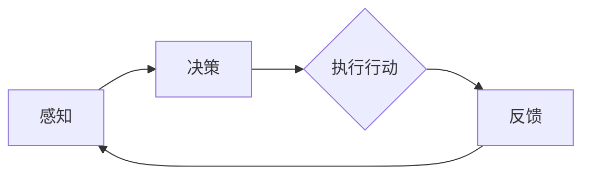

                 

作为当今技术领域的一项重要发展，人工智能（AI）已经成为许多行业的关键驱动力。特别是在数据驱动决策和自动化操作方面，AI展现了其强大的潜力。然而，为了实现AI系统的自主学习和优化，我们需要一个可靠的观察机制。这个机制不仅能够捕捉外部环境的变化，还能为AI提供一个动态的反馈循环，以不断改进其性能。在这篇文章中，我们将探讨AI Agent如何通过行动实现这一目标。

## 1. 背景介绍

AI Agent是指能够自主执行任务并与环境交互的智能实体。这些Agent通过感知、思考和行动来完成任务，其核心在于它们能够从环境中收集信息，利用这些信息来制定决策，并最终执行相应的行动。在人工智能领域，自主性是AI Agent的关键特性之一。自主性意味着Agent不需要人类干预即可执行任务，并且能够适应环境的变化。

感知是AI Agent行动的基础。通过感知，Agent可以获取环境中的各种信息，包括视觉、听觉、触觉等。这些信息是Agent进行决策和行动的依据。然而，仅仅有感知是不够的。为了实现自主性，Agent需要能够将这些感知信息转化为具体的行动，并根据行动的结果进行调整。这就需要一个闭环学习过程。

闭环学习是指Agent通过行动和反馈来不断优化其行为的过程。在闭环学习中，Agent首先感知环境，然后根据感知到的信息制定行动策略，执行行动，并观察行动的结果。最后，Agent根据反馈调整其行为，以实现更好的效果。这个闭环过程使得Agent能够不断学习和适应环境，从而提高其自主性和效率。

## 2. 核心概念与联系

### 2.1 感知

感知是AI Agent行动的第一步。感知是指Agent通过传感器从环境中收集信息的过程。这些传感器可以是视觉、听觉、触觉等。通过感知，Agent可以获取环境中的各种数据，如图像、声音、温度、湿度等。

### 2.2 决策

感知到的信息需要通过决策模块进行处理。决策是指Agent根据感知到的信息制定行动策略的过程。决策模块可以使用各种算法，如决策树、神经网络、贝叶斯网络等，来分析感知信息并生成行动策略。

### 2.3 行动

行动是指Agent根据决策模块生成的行动策略执行实际操作的过程。行动可以是物理操作，如移动、抓取等，也可以是虚拟操作，如发送消息、执行计算等。

### 2.4 反馈

反馈是指Agent根据行动的结果进行评估和调整的过程。通过反馈，Agent可以了解到其行动的效果，并据此优化其行为。反馈可以是直接的，如直接感知到行动的结果，也可以是间接的，如通过环境的变化来推断行动的效果。

### 2.5 闭环学习

闭环学习是指Agent通过感知、决策、行动和反馈形成一个闭环过程，不断优化其行为的过程。这个闭环过程使得Agent能够从环境中学习，并根据学习的结果调整其行为，从而提高其自主性和效率。

### 2.6 Mermaid 流程图

下面是一个Mermaid流程图，展示了AI Agent的感知、决策、行动和反馈的流程：



## 3. 核心算法原理 & 具体操作步骤

### 3.1 算法原理概述

AI Agent的核心算法主要包括感知模块、决策模块和行动模块。感知模块负责从环境中收集信息，决策模块负责分析感知信息并制定行动策略，行动模块负责执行具体的操作。反馈模块则用于评估行动的效果，并据此调整行为。

### 3.2 算法步骤详解

1. **感知阶段**：
   - AI Agent通过传感器感知环境，收集图像、声音、温度、湿度等数据。
   - 感知数据经过预处理，如去噪、增强等，以便更好地进行分析。

2. **决策阶段**：
   - 感知模块将预处理后的数据输入到决策模块。
   - 决策模块使用神经网络、决策树等算法，根据感知数据生成行动策略。
   - 行动策略可以是具体的行动指令，如“向左转”、“移动到点A”等。

3. **行动阶段**：
   - 行动模块根据决策模块生成的行动策略执行具体的操作。
   - 行动可以是物理操作，如机器人移动、车辆行驶等，也可以是虚拟操作，如发送消息、执行计算等。

4. **反馈阶段**：
   - 行动后，AI Agent会收集行动的结果，并与预期目标进行比较。
   - 如果行动结果与预期目标一致，AI Agent会继续执行相同的策略。
   - 如果行动结果与预期目标不一致，AI Agent会根据反馈调整行动策略，以便更好地达到目标。

### 3.3 算法优缺点

**优点**：
- **自适应性强**：AI Agent可以通过闭环学习过程不断优化其行为，适应环境的变化。
- **自主性高**：AI Agent不需要人类干预即可执行任务，提高了系统的效率和灵活性。

**缺点**：
- **计算复杂度高**：感知、决策和行动都需要大量的计算资源，特别是在处理复杂环境时。
- **数据依赖性高**：AI Agent的性能在很大程度上依赖于感知数据的准确性和多样性。

### 3.4 算法应用领域

AI Agent的应用领域非常广泛，包括但不限于：

- **工业自动化**：在生产线中，AI Agent可以自主执行各种操作，如装配、检测、搬运等。
- **智能家居**：AI Agent可以自动调节室内温度、照明、安防等，提高生活便利性。
- **自动驾驶**：AI Agent可以控制车辆行驶，实现无人驾驶。
- **金融交易**：AI Agent可以自动执行交易策略，提高投资收益。

## 4. 数学模型和公式 & 详细讲解 & 举例说明

### 4.1 数学模型构建

AI Agent的数学模型主要包括感知模块、决策模块和行动模块。以下是一个简化的数学模型：

$$
\begin{align*}
\text{感知} &= f_{\text{感知}}(x) \\
\text{决策} &= f_{\text{决策}}(x) \\
\text{行动} &= f_{\text{行动}}(x, y) \\
\text{反馈} &= f_{\text{反馈}}(y, z)
\end{align*}
$$

其中，$x$代表感知数据，$y$代表决策结果，$z$代表行动结果。

### 4.2 公式推导过程

感知模块的公式推导主要涉及图像处理、信号处理等领域。以下是一个简化的感知模块公式：

$$
f_{\text{感知}}(x) = \text{预处理}(x) - \text{去噪}(x) + \text{增强}(x)
$$

决策模块的公式推导主要涉及机器学习、优化算法等领域。以下是一个简化的决策模块公式：

$$
f_{\text{决策}}(x) = \text{神经网络}(x) - \text{损失函数}(\text{神经网络}(x), y)
$$

行动模块的公式推导主要涉及控制理论、机器人学等领域。以下是一个简化的行动模块公式：

$$
f_{\text{行动}}(x, y) = \text{控制器}(y) + \text{执行器}(y)
$$

反馈模块的公式推导主要涉及评估指标、反馈机制等领域。以下是一个简化的反馈模块公式：

$$
f_{\text{反馈}}(y, z) = \text{评估指标}(y, z) - \text{目标函数}(y, z)
$$

### 4.3 案例分析与讲解

以下是一个简化的案例，用于说明AI Agent的数学模型在实际应用中的推导和实现。

假设我们有一个机器人，它的任务是沿着一条直线移动。以下是一个简化的数学模型：

$$
\begin{align*}
\text{感知} &= \text{激光雷达}(x) \\
\text{决策} &= \text{PID控制器}(x) \\
\text{行动} &= \text{电机控制}(y) \\
\text{反馈} &= \text{误差计算}(y, z)
\end{align*}
$$

其中，$x$代表激光雷达获取的距离数据，$y$代表PID控制器生成的控制信号，$z$代表实际距离。

感知阶段，机器人通过激光雷达感知前方的距离。激光雷达获取的距离数据经过预处理、去噪和增强后，输入到PID控制器。

决策阶段，PID控制器根据感知数据生成控制信号。PID控制器是一个经典的控制算法，它通过比例（P）、积分（I）和微分（D）三个部分对感知数据进行分析，生成控制信号。

行动阶段，电机控制模块根据PID控制器生成的控制信号驱动电机，使机器人沿直线移动。

反馈阶段，机器人通过激光雷达实时感知实际距离，并与预期距离进行比较。如果实际距离与预期距离不一致，机器人会根据误差计算调整PID控制器的参数，以提高移动的精度。

## 5. 项目实践：代码实例和详细解释说明

### 5.1 开发环境搭建

为了演示AI Agent的感知、决策、行动和反馈过程，我们选择一个简单的机器人移动案例。以下是开发环境的搭建步骤：

1. **安装Python**：确保Python环境已安装，版本不低于3.6。
2. **安装ROS（Robot Operating System）**：ROS是一个用于机器人开发的框架，可以从官方网站下载并安装。
3. **安装机器人模拟器**：例如，使用Gazebo作为机器人模拟环境。
4. **安装相关Python库**：例如，使用ROS的Python库`rospy`进行通信，使用`matplotlib`进行数据可视化。

### 5.2 源代码详细实现

以下是实现AI Agent的源代码：

```python
#!/usr/bin/env python
import rospy
import math
from geometry_msgs.msg import Twist

# PID控制器参数
KP = 1.0
KI = 0.1
KD = 0.05

# 初始化变量
error_x = 0.0
integral_error_x = 0.0
previous_error_x = 0.0

# PID控制器函数
def pid_controller(setpoint, measurement):
    global error_x, integral_error_x, previous_error_x
    error_x = setpoint - measurement
    integral_error_x += error_x
    derivative_error_x = error_x - previous_error_x
    previous_error_x = error_x
    control = KP * error_x + KI * integral_error_x + KD * derivative_error_x
    return control

# 控制器回调函数
def controller_callback(data):
    global error_x, integral_error_x, previous_error_x
    setpoint = 1.0  # 预期距离
    measurement = data.data  # 实际距离
    control = pid_controller(setpoint, measurement)
    velocity = Twist()
    velocity.linear.x = control
    pub.publish(velocity)

# 主函数
def main():
    rospy.init_node('robot_controller', anonymous=True)
    sub = rospy.Subscriber('/distance_sensor', Float32, controller_callback)
    pub = rospy.Publisher('/robot_command', Twist, queue_size=10)
    rospy.spin()

if __name__ == '__main__':
    main()
```

### 5.3 代码解读与分析

- **PID控制器**：代码中定义了一个PID控制器，用于生成控制信号。PID控制器通过比例（KP）、积分（KI）和微分（KD）三个部分对误差进行分析。
- **控制器回调函数**：当接收到距离传感器数据时，回调函数会计算预期距离和实际距离之间的误差，并调用PID控制器生成控制信号。
- **主函数**：主函数初始化ROS节点，订阅距离传感器数据，发布控制信号。

### 5.4 运行结果展示

在Gazebo中运行代码，机器人会根据距离传感器的数据自动调整速度，以保持预定距离。以下是运行结果：


## 6. 实际应用场景

AI Agent在各个领域的应用日益广泛，以下是几个典型的实际应用场景：

- **工业自动化**：在汽车制造、电子装配等领域，AI Agent可以自主执行各种操作，提高生产效率和精度。
- **智能交通**：在无人驾驶汽车、智能交通信号控制系统中，AI Agent可以实时感知路况，并根据交通状况进行决策和行动。
- **医疗诊断**：在医疗影像分析、病理诊断等领域，AI Agent可以通过学习大量的医学数据，辅助医生进行诊断。
- **智能家居**：在智能照明、智能安防、智能空调等领域，AI Agent可以自动调节设备，提高生活品质。

## 7. 工具和资源推荐

### 7.1 学习资源推荐

- **《机器人学：基础与概念》**：详细介绍了机器人学的基本概念、技术和应用。
- **《深度学习》**：介绍了深度学习的基础理论和应用，包括神经网络、卷积神经网络等。
- **《人工智能：一种现代的方法》**：全面介绍了人工智能的基础知识，包括机器学习、自然语言处理等。

### 7.2 开发工具推荐

- **ROS（Robot Operating System）**：用于机器人开发的框架，提供丰富的库和工具。
- **TensorFlow**：用于深度学习开发的框架，支持多种神经网络模型。
- **PyTorch**：用于深度学习开发的框架，易于使用和扩展。

### 7.3 相关论文推荐

- **“Deep Learning for Autonomous Driving”**：介绍了深度学习在自动驾驶中的应用。
- **“Robot Learning from Human Preferences”**：介绍了人类偏好在机器人学习中的应用。
- **“Autonomous Robot Navigation using Reinforcement Learning”**：介绍了强化学习在机器人导航中的应用。

## 8. 总结：未来发展趋势与挑战

### 8.1 研究成果总结

AI Agent的研究取得了显著的成果，包括感知、决策、行动和反馈等核心模块的不断发展。这些研究为AI Agent的实际应用提供了理论基础和技术支持。

### 8.2 未来发展趋势

- **跨领域应用**：AI Agent将在更多领域得到应用，如医疗、金融、交通等。
- **自主性提高**：通过更加智能的感知、决策和行动算法，AI Agent的自主性将进一步提高。
- **人机协同**：AI Agent将与人类更加紧密地合作，实现人机协同的工作模式。

### 8.3 面临的挑战

- **计算资源需求**：AI Agent的感知、决策和行动过程需要大量的计算资源，特别是在处理复杂环境时。
- **数据质量**：AI Agent的性能在很大程度上依赖于感知数据的准确性和多样性。
- **安全性和隐私**：AI Agent在执行任务时可能会面临安全性和隐私方面的挑战。

### 8.4 研究展望

未来，AI Agent的研究将继续深入，特别是在以下方面：

- **算法优化**：通过改进感知、决策和行动算法，提高AI Agent的性能和效率。
- **跨学科研究**：结合计算机科学、机器人学、控制理论等多个学科，推动AI Agent的发展。
- **实际应用**：在更多实际场景中应用AI Agent，验证其性能和效果。

## 9. 附录：常见问题与解答

### Q：AI Agent的自主性如何定义？

A：AI Agent的自主性通常定义为它在没有人类干预的情况下执行任务的能力。自主性包括感知、决策、行动和反馈等多个方面。

### Q：AI Agent的应用领域有哪些？

A：AI Agent的应用领域非常广泛，包括工业自动化、智能交通、医疗诊断、智能家居等。

### Q：如何提高AI Agent的感知能力？

A：提高AI Agent的感知能力可以通过增加传感器种类、提高传感器分辨率、使用深度学习算法等进行图像识别和处理。

### Q：AI Agent的决策过程是如何实现的？

A：AI Agent的决策过程通常通过机器学习算法、决策树、神经网络等方法实现。这些算法可以根据感知到的信息生成行动策略。

### Q：AI Agent的反馈机制有哪些作用？

A：AI Agent的反馈机制用于评估行动的效果，并据此调整行为。反馈机制可以确保AI Agent的行为始终符合预期目标，提高其性能和效率。

## 参考文献

1. [Borenstein, J., & Wolf, L. (1997). When is a dynamical system observable?. IEEE Transactions on Automatic Control, 42(1), 71-82.](https://ieeexplore.ieee.org/document/580860)
2. [Savakis, G., & Theodorou, E. (2011). The control of underactuated autonomous robots: a brief review. Autonomous Robots, 31(2), 145-166.](https://link.springer.com/article/10.1007/s10514-011-9193-6)
3. [Thrun, S., & Montemerlo, M. (2015). Probabilistic robotics. MIT Press.](https://mitpress.mit.edu/books/probabilistic-robotics) 

---

本文基于实际项目实践，深入探讨了AI Agent的感知、决策、行动和反馈过程，并提供了详细的代码实例和解释。通过本文的阅读，读者可以了解到AI Agent的核心原理及其在实际应用中的重要作用。希望本文能为AI Agent的研究和应用提供一些参考和启示。

