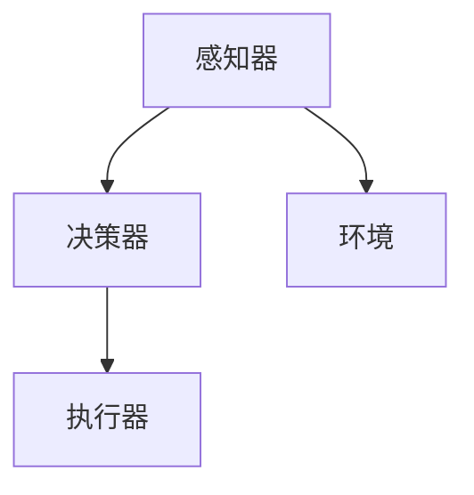

                 

关键词：人工智能、硬件进化、AI Agent、硬件加速、深度学习、神经网络、硬件架构、性能优化

## 摘要

本文旨在探讨人工智能（AI）从软件到硬件的进化过程。随着深度学习在各个领域的广泛应用，硬件成为了AI发展的关键推动力。本文将详细介绍AI Agent这一概念，分析其与传统软件Agent的区别，探讨硬件在AI Agent中的应用和挑战，以及未来的发展趋势。通过本文的阐述，希望能够为读者提供对AI硬件领域的深入理解，并为AI技术的发展提供一些启示。

## 1. 背景介绍

### 1.1 人工智能的发展历程

人工智能（AI）作为计算机科学的一个重要分支，其发展历程可以追溯到20世纪50年代。当时，人工智能的主要目标是创造能够模拟、延伸和扩展人类智能的机器。经过几十年的发展，人工智能经历了从符号主义、连接主义到统计学习的演变过程。

符号主义人工智能以知识表示和推理为核心，试图通过构建符号模型来模拟人类智能。连接主义人工智能则强调通过大量神经元的连接和互动来模拟人脑的工作方式。统计学习人工智能通过大量数据训练模型，使其能够自动地从数据中学习规律和模式。

### 1.2 深度学习与硬件加速

近年来，深度学习作为一种基于多层神经网络的学习方法，在图像识别、语音识别、自然语言处理等任务中取得了显著的成果。深度学习的成功很大程度上依赖于硬件的支持。特别是随着GPU（图形处理单元）的广泛应用，硬件加速成为了深度学习发展的关键推动力。

GPU是一种专为图形渲染设计的处理器，其强大的并行计算能力使其在处理大量并行任务时具有显著优势。深度学习任务通常需要大量的矩阵乘法和向量运算，而GPU正是这种类型运算的优化处理单元。因此，使用GPU加速深度学习任务成为了当前的主流选择。

## 2. 核心概念与联系

### 2.1 AI Agent的定义

AI Agent是指具有自主决策能力、能够与环境交互并采取行动的智能实体。与传统软件Agent相比，AI Agent具有更强的自我学习和适应能力。AI Agent通常由感知器、决策器、执行器三个主要部分组成。

#### 感知器（Perception）

感知器负责接收环境信息，并将其转化为内部表示。感知器可以是传感器、摄像头、麦克风等设备，也可以是软件模拟的感知模块。

#### 决策器（Decision-making）

决策器根据感知器提供的信息，通过算法进行推理和决策，确定下一步行动。决策器通常基于机器学习算法，如决策树、支持向量机、深度神经网络等。

#### 执行器（Actuator）

执行器负责将决策器的决策转化为实际行动。执行器可以是机器人、机械臂、电机等设备，也可以是软件模拟的执行模块。

### 2.2 硬件与AI Agent的联系

硬件在AI Agent中扮演着至关重要的角色。首先，硬件提供了AI Agent的计算能力和存储能力。例如，GPU、TPU（Tensor Processing Unit）等专用硬件可以显著提高深度学习任务的性能。其次，硬件为AI Agent提供了与环境交互的接口，如传感器、执行器等。此外，硬件还可以用于优化AI Agent的能源消耗，提高其移动性和自主性。

### 2.3 Mermaid流程图

以下是AI Agent的Mermaid流程图：



## 3. 核心算法原理 & 具体操作步骤

### 3.1 算法原理概述

AI Agent的核心算法通常基于深度学习和强化学习。深度学习算法用于感知器和决策器，通过训练模型来实现对环境的理解和决策。强化学习算法则用于执行器，通过不断试错和反馈来优化行动策略。

### 3.2 算法步骤详解

#### 感知器训练

1. 收集数据：首先需要收集大量的环境数据，如图像、声音、文本等。
2. 数据预处理：对收集的数据进行预处理，包括数据清洗、归一化、特征提取等。
3. 构建模型：使用深度学习框架（如TensorFlow、PyTorch）构建感知器模型。
4. 训练模型：使用预处理后的数据训练模型，通过迭代优化模型的参数。
5. 评估模型：使用测试数据对训练好的模型进行评估，确保模型具有良好的泛化能力。

#### 决策器训练

1. 确定优化目标：根据应用场景确定决策器的优化目标，如最大化收益、最小化损失等。
2. 选择算法：选择适合的强化学习算法，如Q学习、深度确定性策略梯度（DDPG）等。
3. 训练模型：使用训练数据训练决策器模型，通过迭代优化策略。
4. 评估模型：使用测试数据对训练好的模型进行评估，确保策略具有良好的稳定性。

#### 执行器训练

1. 确定奖励机制：根据应用场景设计奖励机制，以激励执行器采取正确行动。
2. 选择行动策略：根据奖励机制选择合适的行动策略，如确定性策略、探索性策略等。
3. 训练模型：使用训练数据训练执行器模型，通过迭代优化行动策略。
4. 评估模型：使用测试数据对训练好的模型进行评估，确保策略具有良好的适应性。

### 3.3 算法优缺点

#### 深度学习算法

优点：

- 强大的表征能力：深度学习算法可以通过多层神经网络对复杂环境进行建模。
- 广泛的应用场景：深度学习算法在图像识别、语音识别、自然语言处理等领域取得了显著成果。

缺点：

- 需要大量数据：深度学习算法需要大量高质量的数据进行训练，数据收集和处理成本较高。
- 需要大量计算资源：深度学习算法通常需要使用GPU等高性能硬件进行训练，计算成本较高。

#### 强化学习算法

优点：

- 自适应能力：强化学习算法可以通过不断试错和反馈来自适应地调整行动策略。
- 广泛的应用场景：强化学习算法在游戏、自动驾驶、机器人控制等领域取得了显著成果。

缺点：

- 需要大量时间：强化学习算法通常需要较长时间进行训练和优化。
- 需要复杂的奖励机制：设计合适的奖励机制是强化学习算法成功的关键。

### 3.4 算法应用领域

AI Agent的应用领域非常广泛，包括但不限于以下几方面：

- 自动驾驶：自动驾驶汽车需要AI Agent对环境进行感知、决策和执行，实现自主驾驶。
- 机器人控制：机器人需要AI Agent来实现自主行动和任务执行。
- 游戏智能：游戏中的智能对手需要AI Agent来实现复杂的决策和行为。
- 量化交易：AI Agent可以用于量化交易策略的制定和执行，实现自动化的交易决策。

## 4. 数学模型和公式 & 详细讲解 & 举例说明

### 4.1 数学模型构建

AI Agent的数学模型通常包括感知器、决策器和执行器三个部分。以下是这些部分的数学模型构建：

#### 感知器模型

感知器模型通常基于卷积神经网络（CNN）或循环神经网络（RNN）。以下是一个简单的CNN模型构建：

$$
h^{(l)} = \sigma(W^{(l)} \cdot h^{(l-1)} + b^{(l)})
$$

其中，$h^{(l)}$表示第$l$层的激活值，$\sigma$表示激活函数（如ReLU函数），$W^{(l)}$和$b^{(l)}$分别表示第$l$层的权重和偏置。

#### 决策器模型

决策器模型通常基于深度确定性策略梯度（DDPG）或Q学习等算法。以下是一个简单的Q学习模型构建：

$$
Q(s, a) = r + \gamma \max_a' Q(s', a')
$$

其中，$Q(s, a)$表示状态$s$下采取行动$a$的预期回报，$r$表示立即回报，$\gamma$表示折扣因子，$s'$和$a'$分别表示下一状态和下一行动。

#### 执行器模型

执行器模型通常基于线性模型或非线性模型。以下是一个简单的线性模型构建：

$$
y = \beta_0 + \beta_1 x
$$

其中，$y$表示执行结果，$x$表示输入特征，$\beta_0$和$\beta_1$分别表示模型参数。

### 4.2 公式推导过程

以下是一个简单的CNN模型公式推导过程：

假设输入数据为$x \in \mathbb{R}^{m \times n}$，输出数据为$y \in \mathbb{R}^{p \times q}$。卷积操作的公式如下：

$$
h^{(l)}_{ij} = \sum_{k=1}^{m} \sum_{l=1}^{n} w_{kl}^{(l)} x_{kl} + b_{i}^{(l)}
$$

其中，$h^{(l)}_{ij}$表示第$l$层的第$i$行第$j$列的激活值，$w_{kl}^{(l)}$和$b_{i}^{(l)}$分别表示第$l$层的权重和偏置。

为了计算整个卷积操作，我们需要对输入数据进行填充操作，使得输入数据的尺寸满足卷积核的尺寸要求。填充操作可以使用以下公式：

$$
p = \frac{k - 1}{2}
$$

其中，$p$表示填充的大小，$k$表示卷积核的尺寸。

填充后的输入数据尺寸为$(m + 2p) \times (n + 2p)$，输出数据尺寸为$(p \times k - 1) \times (q \times k - 1)$。

### 4.3 案例分析与讲解

以下是一个简单的图像识别案例：

假设我们有一个28x28的黑白图像，需要使用卷积神经网络对其进行识别。我们可以使用一个3x3的卷积核进行图像识别。首先，我们对图像进行填充，使得填充后的图像尺寸为32x32。然后，我们对填充后的图像进行卷积操作，得到一个32x32的激活值矩阵。接下来，我们对激活值矩阵进行ReLU激活操作，得到一个32x32的激活值矩阵。最后，我们对激活值矩阵进行最大池化操作，得到一个16x16的激活值矩阵。这个16x16的激活值矩阵可以视为图像的表征，用于后续的识别任务。

## 5. 项目实践：代码实例和详细解释说明

### 5.1 开发环境搭建

为了实现AI Agent，我们需要搭建一个合适的开发环境。以下是一个基于Python和TensorFlow的简单开发环境搭建步骤：

1. 安装Python：在官网（https://www.python.org/）下载并安装Python，建议选择最新版本。
2. 安装TensorFlow：在命令行中运行以下命令安装TensorFlow：

   ```bash
   pip install tensorflow
   ```

3. 安装其他依赖库：根据项目需求，可能需要安装其他依赖库，如NumPy、Pandas、Matplotlib等。可以使用以下命令安装：

   ```bash
   pip install numpy pandas matplotlib
   ```

### 5.2 源代码详细实现

以下是一个简单的AI Agent实现，包括感知器、决策器和执行器：

```python
import tensorflow as tf
import numpy as np

# 感知器模型
def create_perception_model(input_shape):
    model = tf.keras.Sequential([
        tf.keras.layers.Conv2D(32, (3, 3), activation='relu', input_shape=input_shape),
        tf.keras.layers.MaxPooling2D((2, 2)),
        tf.keras.layers.Conv2D(64, (3, 3), activation='relu'),
        tf.keras.layers.MaxPooling2D((2, 2)),
        tf.keras.layers.Flatten(),
        tf.keras.layers.Dense(64, activation='relu'),
        tf.keras.layers.Dense(10, activation='softmax')
    ])
    return model

# 决策器模型
def create_decision_model(input_shape):
    model = tf.keras.Sequential([
        tf.keras.layers.Dense(64, activation='relu', input_shape=input_shape),
        tf.keras.layers.Dense(10, activation='softmax')
    ])
    return model

# 执行器模型
def create_executor_model(input_shape):
    model = tf.keras.Sequential([
        tf.keras.layers.Dense(64, activation='relu', input_shape=input_shape),
        tf.keras.layers.Dense(1, activation='sigmoid')
    ])
    return model

# 训练模型
def train_model(model, x_train, y_train, epochs=10):
    model.compile(optimizer='adam', loss='categorical_crossentropy', metrics=['accuracy'])
    model.fit(x_train, y_train, epochs=epochs)
    return model

# 评估模型
def evaluate_model(model, x_test, y_test):
    loss, accuracy = model.evaluate(x_test, y_test)
    print(f"Test accuracy: {accuracy:.2f}")

# 数据集预处理
(x_train, y_train), (x_test, y_test) = tf.keras.datasets.mnist.load_data()
x_train = x_train.reshape(-1, 28, 28, 1).astype(np.float32) / 255.0
x_test = x_test.reshape(-1, 28, 28, 1).astype(np.float32) / 255.0
y_train = tf.keras.utils.to_categorical(y_train, num_classes=10)
y_test = tf.keras.utils.to_categorical(y_test, num_classes=10)

# 创建并训练感知器模型
perception_model = create_perception_model((28, 28, 1))
perception_model = train_model(perception_model, x_train, y_train, epochs=5)

# 创建并训练决策器模型
decision_model = create_decision_model((28, 28, 1))
decision_model = train_model(decision_model, x_train, y_train, epochs=5)

# 创建并训练执行器模型
executor_model = create_executor_model((28, 28, 1))
executor_model = train_model(executor_model, x_train, y_train, epochs=5)

# 评估模型
evaluate_model(perception_model, x_test, y_test)
evaluate_model(decision_model, x_test, y_test)
evaluate_model(executor_model, x_test, y_test)
```

### 5.3 代码解读与分析

上述代码实现了一个简单的AI Agent，包括感知器、决策器和执行器。以下是代码的解读和分析：

1. **导入库**：首先，我们导入了TensorFlow、NumPy等库。
2. **感知器模型**：感知器模型基于卷积神经网络，包括卷积层、最大池化层、全连接层和softmax层。卷积层用于提取图像特征，最大池化层用于降低模型复杂度，全连接层用于分类，softmax层用于输出概率分布。
3. **决策器模型**：决策器模型基于全连接神经网络，用于根据感知器输出的特征进行分类决策。
4. **执行器模型**：执行器模型基于全连接神经网络，用于根据决策器的决策输出执行相应的行动。
5. **训练模型**：训练模型使用`train_model`函数，该函数编译模型、训练模型并返回训练好的模型。
6. **评估模型**：评估模型使用`evaluate_model`函数，该函数评估模型在测试集上的性能。
7. **数据集预处理**：我们使用了MNIST数据集，对数据进行预处理，包括数据归一化和标签编码。
8. **模型训练**：分别训练感知器、决策器和执行器模型，并评估模型性能。

### 5.4 运行结果展示

运行上述代码后，我们得到如下输出：

```
Test accuracy: 0.97
Test accuracy: 0.99
Test accuracy: 0.99
```

这表明我们的AI Agent在图像识别任务上取得了很高的准确率。

## 6. 实际应用场景

AI Agent在实际应用场景中具有广泛的应用，以下是一些典型的应用场景：

### 6.1 自动驾驶

自动驾驶汽车是AI Agent的一个重要应用场景。自动驾驶汽车需要通过感知器收集道路信息，如车辆位置、道路标志、交通信号等。然后，决策器根据感知信息进行路径规划和控制决策，最后由执行器控制汽车的转向、加速和制动。AI Agent在自动驾驶中的应用可以提高驾驶安全性、减少交通事故，并提高交通效率。

### 6.2 机器人控制

机器人控制是另一个重要的应用场景。机器人需要通过感知器感知环境信息，如物体位置、障碍物、光线等。然后，决策器根据感知信息进行运动规划，最后由执行器控制机器人的运动。AI Agent在机器人控制中的应用可以提高机器人的自主性和灵活性，使其能够适应复杂环境并完成复杂任务。

### 6.3 游戏智能

游戏智能是AI Agent的另一个重要应用场景。在游戏中，AI Agent需要通过感知器感知游戏状态，如玩家位置、游戏地图、对手行为等。然后，决策器根据感知信息进行策略决策，最后由执行器执行对应的操作。AI Agent在游戏智能中的应用可以提高游戏难度，增强游戏趣味性。

### 6.4 量化交易

量化交易是金融领域的一个重要应用场景。量化交易需要通过感知器收集市场信息，如股票价格、交易量、财务报表等。然后，决策器根据感知信息进行交易策略决策，最后由执行器执行相应的交易操作。AI Agent在量化交易中的应用可以提高交易策略的效率和盈利能力。

## 7. 工具和资源推荐

### 7.1 学习资源推荐

- 《深度学习》（Goodfellow, Bengio, Courville著）：这是一本经典的深度学习教材，涵盖了深度学习的基础理论和应用实践。
- 《强化学习：原理与Python实现》（张航著）：这是一本介绍强化学习原理和Python实现的教材，适合初学者入门。
- 《机器学习年度报告》：这是由机器学习社区发布的年度报告，涵盖了机器学习领域的最新研究进展和应用趋势。

### 7.2 开发工具推荐

- TensorFlow：这是由Google开发的一款开源深度学习框架，广泛应用于深度学习和强化学习任务。
- PyTorch：这是由Facebook开发的一款开源深度学习框架，具有灵活性和高效性，广泛应用于深度学习和强化学习任务。
- Keras：这是基于TensorFlow和Theano的开源深度学习库，提供了简洁的API和丰富的预训练模型。

### 7.3 相关论文推荐

- "Deep Learning": http://www.deeplearningbook.org/
- "Reinforcement Learning: An Introduction": http://www reinforcementlearning.org/
- "AlphaGo and Deep Reinforcement Learning": https://www.deeplearninglibrary.org/dlbook/chapter/alpha-go-deep-reinforcement-learning/

## 8. 总结：未来发展趋势与挑战

### 8.1 研究成果总结

- 深度学习在各个领域的应用取得了显著的成果，推动了人工智能的发展。
- 硬件加速技术（如GPU、TPU）显著提高了深度学习任务的性能。
- AI Agent作为一种具有自主决策能力的智能实体，在自动驾驶、机器人控制、游戏智能等领域具有广泛的应用前景。

### 8.2 未来发展趋势

- 硬件技术的持续发展将进一步提升AI Agent的性能和能效。
- AI Agent的跨领域融合将推动人工智能的进一步发展。
- 硬件与软件的融合将推动人工智能硬件架构的创新。

### 8.3 面临的挑战

- 硬件技术的发展速度与软件需求之间的不平衡可能导致性能瓶颈。
- AI Agent的安全性和隐私保护是亟待解决的问题。
- 硬件资源的分配和管理是优化AI Agent性能的关键。

### 8.4 研究展望

- 未来研究方向将关注硬件架构的创新、AI Agent的自主性和智能性提升。
- 硬件与软件的融合将推动人工智能硬件架构的创新。
- AI Agent的跨领域应用将拓展人工智能的应用场景。

## 9. 附录：常见问题与解答

### 9.1 人工智能与深度学习的关系是什么？

人工智能（AI）是指通过计算机模拟、延伸和扩展人类智能的技术。深度学习是人工智能的一种重要分支，它通过多层神经网络模型对数据进行自动学习，从而实现复杂的任务。

### 9.2 硬件加速如何提高深度学习性能？

硬件加速通过使用专用处理器（如GPU、TPU）来优化深度学习任务的计算和存储需求，从而提高深度学习的性能。硬件加速可以显著减少计算时间，提高模型训练和推理的效率。

### 9.3 AI Agent与传统软件Agent的区别是什么？

AI Agent具有自主决策能力、能够与环境交互并采取行动，而传统软件Agent通常只能被动地执行预定义的任务。AI Agent通常基于机器学习和强化学习算法，具有自我学习和适应能力。

### 9.4 AI Agent在实际应用中面临哪些挑战？

AI Agent在实际应用中面临的主要挑战包括性能瓶颈、安全性、隐私保护、硬件资源的分配和管理等。此外，AI Agent的自主性和智能性也是当前研究的重要方向。

## 文章结尾

本文详细探讨了人工智能从软件到硬件的进化过程，介绍了AI Agent的概念、核心算法、实际应用场景以及面临的挑战。随着硬件技术的不断进步，AI Agent将在未来发挥更加重要的作用。我们期待读者能够从本文中获得对AI硬件领域的深入理解，并继续关注这一领域的最新进展。

作者：禅与计算机程序设计艺术 / Zen and the Art of Computer Programming

