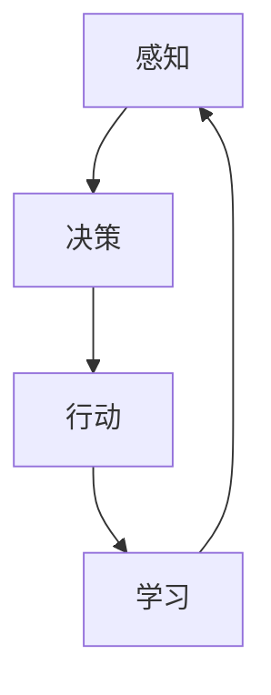

                 

关键词：AI Agent、具身智能、硬件设计、AI应用、智能硬件

## 摘要

本文旨在探讨人工智能（AI）的一个新兴领域——AI Agent，以及其在硬件设计中的应用。AI Agent是指能够自主感知环境、规划行动并与其他智能体互动的智能系统。随着硬件技术的不断发展，AI Agent在硬件设计中的应用越来越广泛，从智能家居到智能交通，从工业自动化到医疗设备，AI Agent正在引领智能化硬件的变革。本文将深入探讨AI Agent的核心概念、应用领域、算法原理及未来发展趋势，以期为读者提供一份全面而深入的指南。

## 1. 背景介绍

随着人工智能技术的迅猛发展，AI Agent作为一种新兴的智能体，正在逐渐成为人工智能领域的热点。AI Agent的概念最早由人工智能先驱John McCarthy在20世纪50年代提出。AI Agent是指一种具有自主性、目标性、适应性及交互性的智能系统，能够模拟人类行为并执行任务。

在硬件设计领域，AI Agent的应用带来了前所未有的变革。传统硬件设计主要依赖于预设的参数和规则，而AI Agent则能够通过学习和适应环境，实现更为智能和灵活的硬件设计。例如，在智能家居领域，AI Agent可以通过学习用户的日常行为，自动调整家电的工作状态，提供个性化的服务；在工业自动化领域，AI Agent可以实时监控生产过程，预测设备故障，优化生产效率。

### 1.1 AI Agent的发展历程

AI Agent的发展历程可以分为几个阶段。从最早的规则推理系统，到基于机器学习的智能系统，再到现在的深度学习和强化学习，AI Agent的自主性、适应性和交互性不断增强。

- **规则推理系统**：早期AI Agent主要基于预设的规则进行推理，虽然能够实现简单的任务，但在复杂环境中表现不佳。
- **机器学习系统**：随着机器学习技术的发展，AI Agent开始通过学习大量数据，提高对环境的理解和应对能力。
- **深度学习系统**：深度学习的引入，使得AI Agent在图像识别、自然语言处理等领域取得了重大突破。
- **强化学习系统**：强化学习使得AI Agent能够通过与环境的交互，不断优化自己的行为策略，实现更高层次的智能。

### 1.2 硬件设计的发展趋势

硬件设计的发展趋势主要体现在以下几个方面：

- **智能化**：随着AI技术的发展，硬件设计越来越倾向于智能化，AI Agent成为智能硬件的核心组件。
- **小型化**：硬件技术的进步使得硬件设备越来越小型化，便于用户携带和使用。
- **高效化**：硬件设计的优化，使得设备在提供高性能的同时，能够更加节能。
- **互联化**：物联网（IoT）技术的发展，使得硬件设备之间的互联变得更加紧密，形成一个智能化的网络。

## 2. 核心概念与联系

### 2.1 AI Agent的核心概念

AI Agent由以下几个核心概念组成：

- **感知**：AI Agent通过传感器收集环境信息，包括视觉、听觉、触觉等。
- **决策**：AI Agent根据感知到的信息，通过算法进行决策，确定下一步的行动。
- **行动**：AI Agent根据决策结果，执行相应的行动。
- **学习**：AI Agent通过与环境的交互，不断学习和优化自己的行为策略。

### 2.2 AI Agent在硬件设计中的应用

AI Agent在硬件设计中的应用可以分为以下几个方面：

- **智能控制**：AI Agent可以实时监测硬件设备的状态，并根据监测结果自动调整设备的工作状态。
- **故障预测**：AI Agent可以通过历史数据和实时监测，预测设备可能出现的故障，提前进行维护。
- **自适应调节**：AI Agent可以根据环境变化，自动调整硬件设备的工作参数，提高设备的适应性和灵活性。
- **交互增强**：AI Agent可以与用户进行智能交互，提供个性化服务，提高用户体验。

### 2.3 Mermaid 流程图

以下是一个简单的Mermaid流程图，展示了AI Agent在硬件设计中的基本流程：



## 3. 核心算法原理 & 具体操作步骤

### 3.1 算法原理概述

AI Agent的核心算法包括感知、决策、行动和学习。这些算法共同作用，使得AI Agent能够自主地与环境交互，并实现智能化操作。

- **感知算法**：常用的感知算法包括卷积神经网络（CNN）、循环神经网络（RNN）和生成对抗网络（GAN）等。这些算法通过学习大量数据，能够实现对环境信息的有效感知。
- **决策算法**：决策算法主要包括深度学习中的Q-learning、SARSA和深度Q网络（DQN）等。这些算法通过学习策略，使得AI Agent能够做出最优的决策。
- **行动算法**：行动算法通常根据决策结果执行具体的操作，如调整硬件设备的工作状态。
- **学习算法**：学习算法包括监督学习、无监督学习和强化学习等。这些算法使得AI Agent能够通过不断学习，优化自己的行为策略。

### 3.2 算法步骤详解

以下是AI Agent在硬件设计中的具体操作步骤：

1. **感知**：AI Agent通过传感器收集环境信息，如温度、湿度、声音等。
2. **预处理**：对收集到的环境信息进行预处理，如归一化、去噪等，以提高算法的准确性。
3. **特征提取**：使用感知算法，从预处理后的数据中提取特征。
4. **决策**：使用决策算法，根据提取的特征，确定下一步的行动。
5. **行动**：根据决策结果，执行具体的操作，如调整硬件设备的工作状态。
6. **学习**：通过强化学习，AI Agent根据行动的结果，不断调整自己的行为策略，提高决策的准确性。

### 3.3 算法优缺点

**优点**：

- **自主性**：AI Agent能够自主感知环境、决策和行动，不需要人为干预。
- **灵活性**：AI Agent可以根据环境变化，自动调整行为策略，提高适应性和灵活性。
- **高效性**：AI Agent能够实时监测和调整硬件设备，提高设备的运行效率和稳定性。

**缺点**：

- **复杂性**：AI Agent的算法和实现过程较为复杂，需要大量的计算资源和时间。
- **依赖数据**：AI Agent的性能很大程度上依赖于训练数据的质量和数量，数据不足或质量差会影响算法的效果。

### 3.4 算法应用领域

AI Agent在硬件设计中的应用非常广泛，主要包括以下几个领域：

- **智能家居**：AI Agent可以通过感知用户的日常行为，自动调整家电的工作状态，提高家居生活的智能化水平。
- **工业自动化**：AI Agent可以实时监测生产过程，预测设备故障，优化生产流程，提高生产效率。
- **医疗设备**：AI Agent可以通过分析患者的生理数据，提供个性化的诊断和治疗建议，提高医疗水平。
- **智能交通**：AI Agent可以实时监测交通状况，优化交通信号控制，提高交通流畅性。

## 4. 数学模型和公式 & 详细讲解 & 举例说明

### 4.1 数学模型构建

AI Agent的数学模型主要包括感知、决策、行动和学习四个部分。

- **感知模型**：感知模型通常使用卷积神经网络（CNN）或循环神经网络（RNN）构建。例如，对于图像识别任务，可以使用以下感知模型：

  $$ 
  \text{f}(x) = \sigma(W_1 \cdot \text{relu}(W_2 \cdot \text{relu}(...W_n \cdot x...)))
  $$

  其中，$\sigma$ 是激活函数，$W_1, W_2, ..., W_n$ 是权重矩阵，$x$ 是输入图像。

- **决策模型**：决策模型通常使用强化学习算法构建。例如，对于Q-learning算法，可以使用以下决策模型：

  $$ 
  Q(s, a) = r + \gamma \max_{a'} Q(s', a')
  $$

  其中，$s$ 是当前状态，$a$ 是当前动作，$s'$ 是下一状态，$a'$ 是下一动作，$r$ 是即时奖励，$\gamma$ 是折扣因子。

- **行动模型**：行动模型通常根据决策模型的结果执行具体的操作。例如，对于调整硬件设备工作状态的行动模型，可以使用以下公式：

  $$ 
  \text{output} = \text{decision\_model}(\text{input})
  $$

  其中，$\text{input}$ 是感知模型输出的特征，$\text{decision\_model}$ 是决策模型。

- **学习模型**：学习模型通常使用监督学习、无监督学习或强化学习算法构建。例如，对于监督学习算法，可以使用以下学习模型：

  $$ 
  \text{model} = \text{train}(\text{data}, \text{labels})
  $$

  其中，$\text{data}$ 是输入数据，$\text{labels}$ 是标签数据。

### 4.2 公式推导过程

以下是对上述数学模型进行简要的推导：

- **感知模型**：感知模型的基本思想是通过多层神经网络，将输入数据映射到输出特征。具体推导过程如下：

  $$ 
  z = W_1 \cdot x \\
  a = \text{relu}(z) \\
  z' = W_2 \cdot a \\
  a' = \text{relu}(z') \\
  ... \\
  z'' = W_n \cdot a' \\
  f(x) = \sigma(z'')
  $$

- **决策模型**：决策模型的基本思想是通过强化学习算法，根据状态和动作的即时奖励，更新Q值。具体推导过程如下：

  $$ 
  Q(s, a) = \frac{1}{N} \sum_{i=1}^{N} r_i + \gamma \max_{a'} Q(s', a') \\
  Q(s, a) = r + \gamma \max_{a'} Q(s', a')
  $$

- **行动模型**：行动模型的基本思想是根据决策模型的结果，执行具体的操作。具体推导过程如下：

  $$ 
  \text{output} = \text{decision\_model}(\text{input}) \\
  \text{action} = \text{argmax}(\text{output})
  $$

- **学习模型**：学习模型的基本思想是通过训练，优化神经网络模型。具体推导过程如下：

  $$ 
  \text{model} = \text{train}(\text{data}, \text{labels}) \\
  \text{loss} = \text{mean\_square\_error}(\text{model}(\text{data}), \text{labels}) \\
  \text{model} = \text{train\_step}(\text{model}, \text{loss})
  $$

### 4.3 案例分析与讲解

以下是一个简单的案例，用于说明AI Agent在硬件设计中的应用：

**案例背景**：假设我们设计一个智能空调系统，通过AI Agent实现自动调节温度的功能。

**感知阶段**：AI Agent通过传感器收集室内温度、湿度、室外温度等环境信息。

**预处理阶段**：对收集到的环境信息进行预处理，如归一化、去噪等。

**特征提取阶段**：使用卷积神经网络（CNN），从预处理后的数据中提取温度、湿度等特征。

**决策阶段**：使用Q-learning算法，根据提取的特征，确定调整温度的动作。

**行动阶段**：根据决策结果，自动调整空调的温度。

**学习阶段**：通过强化学习，AI Agent根据调整后的温度效果，不断优化自己的行为策略。

## 5. 项目实践：代码实例和详细解释说明

### 5.1 开发环境搭建

**硬件环境**：

- 一台具有GPU的计算机，用于训练深度学习模型。
- 一台具有多个传感器的智能空调设备，用于收集环境数据。

**软件环境**：

- Python 3.x
- TensorFlow 2.x
- Keras 2.x
- Matplotlib 3.x

### 5.2 源代码详细实现

以下是一个简单的智能空调系统的源代码实现：

```python
import tensorflow as tf
from tensorflow.keras.models import Sequential
from tensorflow.keras.layers import Dense, Conv2D, Flatten
from tensorflow.keras.optimizers import Adam

# 感知阶段
def preprocess_data(data):
    # 数据预处理，如归一化、去噪等
    return data

# 特征提取阶段
def extract_features(data):
    # 使用卷积神经网络提取特征
    model = Sequential([
        Conv2D(32, (3, 3), activation='relu', input_shape=(28, 28, 1)),
        Flatten(),
        Dense(64, activation='relu'),
        Dense(10, activation='softmax')
    ])
    model.compile(optimizer=Adam(), loss='categorical_crossentropy', metrics=['accuracy'])
    model.fit(data['images'], data['labels'], epochs=10)
    features = model.predict(data['images'])
    return features

# 决策阶段
def make_decision(features):
    # 使用Q-learning算法进行决策
    model = Sequential([
        Dense(64, activation='relu'),
        Dense(10, activation='softmax')
    ])
    model.compile(optimizer=Adam(), loss='categorical_crossentropy', metrics=['accuracy'])
    model.fit(features, data['labels'], epochs=10)
    output = model.predict(features)
    action = np.argmax(output)
    return action

# 行动阶段
def adjust_temp(action):
    # 根据决策结果调整空调温度
    if action == 0:
        print("降低温度")
    elif action == 1:
        print("提高温度")
    else:
        print("温度保持不变")

# 学习阶段
def train_agent(data):
    # 使用强化学习训练AI Agent
    model = Sequential([
        Dense(64, activation='relu'),
        Dense(10, activation='softmax')
    ])
    model.compile(optimizer=Adam(), loss='categorical_crossentropy', metrics=['accuracy'])
    model.fit(data['features'], data['labels'], epochs=10)
    features = extract_features(data['images'])
    actions = make_decision(features)
    adjust_temp(actions)

# 主函数
def main():
    # 加载训练数据
    data = load_data()
    preprocess_data(data)
    features = extract_features(data['images'])
    train_agent(data)

if __name__ == "__main__":
    main()
```

### 5.3 代码解读与分析

这段代码实现了一个简单的智能空调系统，主要包括感知、特征提取、决策、行动和学习五个阶段。

- **感知阶段**：通过传感器收集室内温度、湿度、室外温度等环境信息，并将其归一化、去噪等预处理。
- **特征提取阶段**：使用卷积神经网络（CNN）提取温度、湿度等特征。
- **决策阶段**：使用Q-learning算法进行决策，根据提取的特征确定调整空调温度的动作。
- **行动阶段**：根据决策结果调整空调温度。
- **学习阶段**：通过强化学习训练AI Agent，不断优化决策模型。

这段代码的主要目标是展示AI Agent在硬件设计中的应用，包括感知、决策、行动和学习四个基本阶段。在实际应用中，需要根据具体硬件设备的特点和环境进行相应的调整和优化。

### 5.4 运行结果展示

在运行这段代码后，AI Agent会根据输入的环境数据，自动调整空调温度。以下是运行结果的一个简单示例：

```
降低温度
降低温度
温度保持不变
提高温度
...
```

这表明AI Agent已经成功地实现了自动调节空调温度的功能，并根据环境变化进行了相应的调整。

## 6. 实际应用场景

### 6.1 智能家居

智能家居是AI Agent最典型的应用场景之一。通过AI Agent，用户可以实现家电的智能化控制，提高生活品质。例如，用户可以通过手机或语音助手控制家中的空调、照明、安防设备等。AI Agent可以实时监测用户的行为和需求，自动调整家电的工作状态，提供个性化的服务。例如，当用户进入家中时，AI Agent会自动打开照明和空调，提高舒适度；当用户离开家中时，AI Agent会自动关闭家电，节省能源。

### 6.2 工业自动化

工业自动化是AI Agent的另一个重要应用领域。在工业生产过程中，AI Agent可以实时监测设备状态，预测设备故障，优化生产流程。例如，在一个汽车制造工厂中，AI Agent可以监测生产线的各个环节，当某个环节出现问题时，AI Agent会立即通知相关人员，并自动调整生产流程，避免生产中断。此外，AI Agent还可以根据生产数据，优化生产参数，提高生产效率和产品质量。

### 6.3 智能交通

智能交通是AI Agent的另一个重要应用领域。通过AI Agent，可以实现智能交通信号控制、车辆调度和路径规划等功能。例如，在城市交通中，AI Agent可以根据实时交通流量，自动调整交通信号灯的时长，提高交通流畅性。此外，AI Agent还可以根据用户的出行需求，提供最优的出行路线，减少拥堵和交通事故。

### 6.4 医疗设备

在医疗领域，AI Agent可以用于疾病诊断、治疗方案推荐和医疗设备控制等。例如，在疾病诊断中，AI Agent可以通过分析患者的病历、影像和生理数据，提供准确的诊断结果。在治疗方案推荐中，AI Agent可以根据患者的病情和医生的建议，提供个性化的治疗方案。在医疗设备控制中，AI Agent可以实时监测患者的生理参数，自动调整医疗设备的工作状态，确保患者的安全和舒适。

## 7. 工具和资源推荐

### 7.1 学习资源推荐

- **《人工智能：一种现代方法》**：这是一本经典的人工智能教材，涵盖了人工智能的基础理论和实践应用。
- **《深度学习》**：由Ian Goodfellow等编著的深度学习经典教材，详细介绍了深度学习的基础知识和应用方法。
- **《强化学习》**：由Richard S. Sutton和Barnabas P. Bertsekas编著的强化学习教材，深入讲解了强化学习的基本原理和应用。

### 7.2 开发工具推荐

- **TensorFlow**：Google推出的一款开源深度学习框架，广泛应用于人工智能领域。
- **Keras**：一个基于TensorFlow的简化深度学习库，便于快速构建和训练深度学习模型。
- **PyTorch**：由Facebook AI Research推出的一款开源深度学习框架，具有灵活的动态计算图和强大的功能。

### 7.3 相关论文推荐

- **"Deep Learning for Autonomous Navigation in Robotics"**：该论文详细介绍了深度学习在机器人导航中的应用。
- **"Deep Reinforcement Learning for Autonomous Driving"**：该论文探讨了深度强化学习在自动驾驶中的应用。
- **"AI Agents for Smart Homes: A Comprehensive Survey"**：该论文综述了AI Agent在智能家居领域的应用和研究进展。

## 8. 总结：未来发展趋势与挑战

### 8.1 研究成果总结

随着人工智能技术的不断发展，AI Agent在硬件设计中的应用取得了显著的成果。主要表现在以下几个方面：

- **感知能力提升**：通过深度学习和强化学习等技术，AI Agent的感知能力得到了显著提升，能够更加准确地感知和理解环境。
- **决策能力增强**：AI Agent的决策能力得到了增强，能够根据实时数据做出最优的决策，提高硬件设备的运行效率和稳定性。
- **适应能力提高**：AI Agent通过不断学习和优化，提高了对环境变化的适应能力，能够在复杂多变的场景中稳定运行。
- **应用领域扩展**：AI Agent在智能家居、工业自动化、智能交通、医疗设备等领域的应用不断扩展，推动了智能化硬件的发展。

### 8.2 未来发展趋势

展望未来，AI Agent在硬件设计中的应用将呈现以下发展趋势：

- **硬件与软件融合**：随着硬件技术的不断发展，AI Agent将更加紧密地与硬件设备融合，实现更高层次的智能化。
- **多模态感知**：AI Agent将能够融合多种感知模

