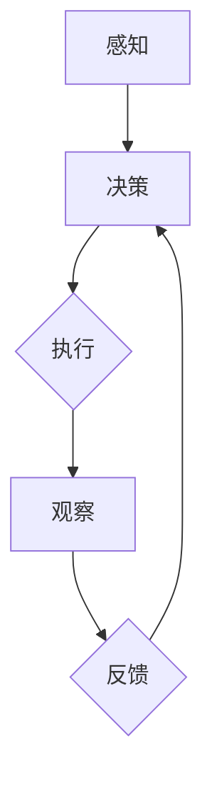

                 

关键词：人工智能、AI代理、技术局限、发展趋势

> 摘要：本文旨在探讨人工智能（AI）领域的一个新兴研究方向——AI代理的发展及其在现有技术局限性下面临的挑战。通过深入分析AI代理的核心概念、算法原理、数学模型以及实际应用案例，本文将阐述AI代理在解决复杂任务中的潜力，并对其未来的发展趋势与挑战进行展望。

## 1. 背景介绍

人工智能作为计算机科学的一个重要分支，已经经历了数十年的发展。从最初的符号主义到基于数据的机器学习，再到近年来深度学习的崛起，AI技术不断刷新着人类对智能的认知。然而，随着AI应用的不断扩展，人们逐渐认识到现有技术仍然存在诸多局限性。这些问题包括数据的稀缺性、模型的黑箱性、对环境变化的适应能力不足等。因此，寻找新的研究方向和解决方案变得尤为迫切。

在这一背景下，AI代理的概念应运而生。AI代理是一种智能体，它能够模拟人类的决策过程，并自主执行任务。与传统的AI算法不同，AI代理不仅具备学习和适应能力，还能够与环境进行实时交互，并在动态环境中做出合理的决策。这种智能体的出现，为解决当前AI技术的局限性提供了新的思路和方向。

## 2. 核心概念与联系

### 2.1 AI代理的定义与特点

AI代理（Artificial Intelligence Agent）是指在一个特定环境下，能够感知环境状态、采取行动并通过对环境的观察和反馈进行自主学习和决策的实体。AI代理具有以下几个核心特点：

1. **自主性**：AI代理能够自主执行任务，而不需要人工干预。
2. **适应性**：AI代理能够根据环境的变化调整自己的行为策略。
3. **交互性**：AI代理能够与环境进行实时交互，获取反馈并调整行动。
4. **学习性**：AI代理能够从经验和数据中学习，提高任务执行的效率和质量。

### 2.2 AI代理与现有AI技术的区别

传统的AI技术主要依赖于预训练的模型和数据，它们通常在特定场景下表现出色，但在面对复杂、动态环境时往往显得力不从心。相比之下，AI代理具有以下几个显著区别：

1. **自主决策**：AI代理能够根据实时环境信息自主做出决策，而不是依赖于预定的规则或模型。
2. **动态适应**：AI代理能够动态调整行为策略，以适应不断变化的环境。
3. **自主学习**：AI代理能够通过与环境交互学习，逐步提高任务执行的效率。

### 2.3 AI代理的工作原理

AI代理的工作原理可以概括为以下几个步骤：

1. **感知**：AI代理通过传感器获取环境信息，包括视觉、听觉、触觉等。
2. **决策**：基于感知到的环境信息，AI代理使用决策算法选择最佳行动。
3. **执行**：AI代理执行选定的行动，并对行动结果进行观察和反馈。
4. **学习**：基于反馈信息，AI代理调整自己的行为策略，以适应环境变化。

### 2.4 Mermaid 流程图

以下是AI代理工作原理的Mermaid流程图：



## 3. 核心算法原理 & 具体操作步骤

### 3.1 算法原理概述

AI代理的核心算法主要包括感知模块、决策模块、执行模块和学习模块。以下是对这些模块的简要介绍：

1. **感知模块**：感知模块负责获取环境信息，通过传感器实现对环境的感知。
2. **决策模块**：决策模块基于感知到的环境信息，使用特定的算法（如马尔可夫决策过程、深度强化学习等）选择最佳行动。
3. **执行模块**：执行模块负责将决策转化为具体的行动，实现对环境的操作。
4. **学习模块**：学习模块基于执行后的反馈信息，对决策算法进行调整，以提高任务执行的效率。

### 3.2 算法步骤详解

以下是AI代理算法的具体操作步骤：

1. **初始化**：设定初始状态，初始化感知模块、决策模块、执行模块和学习模块。
2. **感知**：通过传感器获取当前环境状态，更新感知模块的数据。
3. **决策**：基于当前状态，使用决策算法计算可能的行动及其预期收益。
4. **执行**：选择最佳行动，并执行相应的操作。
5. **观察**：观察行动结果，获取新的环境状态。
6. **学习**：基于观察到的状态和行动结果，调整决策算法参数，优化决策策略。

### 3.3 算法优缺点

**优点**：

1. **自主性**：AI代理能够自主决策和执行任务，减少了人工干预的需求。
2. **适应性**：AI代理能够根据环境变化调整行为策略，提高了任务执行的灵活性。
3. **学习性**：AI代理能够通过学习提高任务执行的效率，实现持续改进。

**缺点**：

1. **计算复杂度**：AI代理的算法通常涉及大量的计算，对计算资源有较高的要求。
2. **数据依赖**：AI代理的性能依赖于感知模块的精度和决策算法的准确性，对数据质量有较高的要求。
3. **安全性**：AI代理的行为可能受到恶意攻击，需要设计相应的安全机制。

### 3.4 算法应用领域

AI代理技术具有广泛的应用前景，以下是一些典型的应用领域：

1. **智能机器人**：在工业制造、服务机器人等领域，AI代理能够自主执行复杂任务，提高生产效率。
2. **自动驾驶**：在自动驾驶车辆中，AI代理能够实时感知道路环境，做出安全、合理的驾驶决策。
3. **智能客服**：在客服领域，AI代理能够模拟人类客服，提供24/7的服务，提高客户满意度。
4. **智能家居**：在智能家居领域，AI代理能够根据用户习惯和需求，实现智能化的家居环境控制。

## 4. 数学模型和公式 & 详细讲解 & 举例说明

### 4.1 数学模型构建

AI代理的核心算法通常基于概率论和优化理论。以下是一个简单的数学模型，用于描述AI代理的决策过程：

$$
P(S_{t+1} = s_{t+1} | S_{t} = s_{t}, A_{t} = a_{t}) = P(S_{t+1} = s_{t+1} | S_{t} = s_{t}) \times P(A_{t} = a_{t} | S_{t} = s_{t})
$$

其中，$S_{t}$ 表示时间 $t$ 的环境状态，$A_{t}$ 表示时间 $t$ 的行动，$s_{t+1}$ 和 $a_{t}$ 分别表示时间 $t+1$ 的状态和行动。这个公式表示，给定当前状态和行动，下一个状态和行动的概率可以通过当前状态的概率和行动的概率相乘得到。

### 4.2 公式推导过程

为了推导上述公式，我们需要考虑以下两点：

1. **状态转移概率**：给定当前状态 $S_{t}$ 和行动 $A_{t}$，下一个状态 $S_{t+1}$ 的概率可以通过状态转移模型得到。例如，如果使用马尔可夫决策过程（MDP），状态转移概率可以表示为：

$$
P(S_{t+1} = s_{t+1} | S_{t} = s_{t}) = p(s_{t+1} | s_{t})
$$

2. **行动选择概率**：给定当前状态 $S_{t}$，行动 $A_{t}$ 的概率可以通过行为策略得到。例如，如果使用贪婪策略，行动选择概率可以表示为：

$$
P(A_{t} = a_{t} | S_{t} = s_{t}) = \frac{\sum_{a'} \gamma(a') p(a' | s_{t}) R(s_{t}, a', s_{t+1})}{\sum_{a'} \gamma(a') p(a' | s_{t})}
$$

其中，$p(a' | s_{t})$ 表示在状态 $s_{t}$ 下选择行动 $a'$ 的概率，$R(s_{t}, a', s_{t+1})$ 表示在状态 $s_{t}$ 下执行行动 $a'$ 后获得的即时奖励。

将这两个公式相乘，即可得到原始的公式：

$$
P(S_{t+1} = s_{t+1} | S_{t} = s_{t}, A_{t} = a_{t}) = P(S_{t+1} = s_{t+1} | S_{t} = s_{t}) \times P(A_{t} = a_{t} | S_{t} = s_{t})
$$

### 4.3 案例分析与讲解

为了更好地理解上述公式，我们来看一个简单的例子。

假设我们有一个简单的环境，包含两个状态：安全（$s_1$）和危险（$s_2$）。我们的任务是选择最佳行动，以最大化长期奖励。以下是状态转移概率和奖励函数：

| 状态 $S_t$ | 行动 $A_t$ | 状态 $S_{t+1}$ | 转移概率 $p(s_{t+1} | s_{t})$ | 奖励函数 $R(s_{t+1}, a_{t})$ |
| --- | --- | --- | --- | --- |
| $s_1$ | $a_1$ | $s_1$ | 0.9 | 0 |
| $s_1$ | $a_1$ | $s_2$ | 0.1 | -5 |
| $s_1$ | $a_2$ | $s_1$ | 0.2 | 0 |
| $s_1$ | $a_2$ | $s_2$ | 0.8 | -5 |
| $s_2$ | $a_1$ | $s_2$ | 0.8 | 0 |
| $s_2$ | $a_1$ | $s_1$ | 0.2 | 5 |
| $s_2$ | $a_2$ | $s_2$ | 0.9 | 0 |
| $s_2$ | $a_2$ | $s_1$ | 0.1 | 5 |

在这个例子中，我们的目标是选择最佳行动，以最大化长期奖励。我们可以使用价值迭代算法来解决这个问题。

首先，我们初始化状态值函数 $V(s)$，并设置一个小的学习率 $\alpha$。然后，我们通过以下步骤更新状态值函数：

1. **计算当前状态值函数**：
$$
V^{k}(s) = \sum_{a} \gamma(a) \sum_{s'} p(s' | s, a) R(s', a)
$$

2. **更新行动值函数**：
$$
Q^{k+1}(s, a) = \sum_{s'} p(s' | s, a) R(s', a) + \gamma \sum_{a'} \gamma(a') V^{k}(s')
$$

3. **更新状态值函数**：
$$
V^{k+1}(s) = \max_{a} Q^{k+1}(s, a)
$$

通过不断迭代这个过程，我们可以得到最佳行动策略，即在每个状态下选择能够使状态值函数最大化的行动。

在这个例子中，通过迭代计算，我们得到最佳行动策略为：在状态 $s_1$ 下选择行动 $a_1$，在状态 $s_2$ 下选择行动 $a_2$。通过这个策略，我们能够最大化长期奖励，避免陷入危险状态。

## 5. 项目实践：代码实例和详细解释说明

### 5.1 开发环境搭建

为了演示AI代理的核心算法，我们使用Python作为编程语言，并利用流行的AI库（如TensorFlow和PyTorch）进行实现。以下是在Linux系统上搭建开发环境的步骤：

1. **安装Python**：确保Python版本为3.8或更高。
2. **安装TensorFlow**：使用以下命令安装TensorFlow：
```bash
pip install tensorflow
```
3. **安装PyTorch**：使用以下命令安装PyTorch：
```bash
pip install torch torchvision
```

### 5.2 源代码详细实现

以下是AI代理算法的Python代码实现。我们使用深度强化学习作为核心算法，具体实现如下：

```python
import numpy as np
import random
import torch
import torch.nn as nn
import torch.optim as optim

# 设置参数
state_size = 100
action_size = 4
learning_rate = 0.001
gamma = 0.9
epsilon = 0.1

# 初始化网络
policy_net = nn.Sequential(
    nn.Linear(state_size, 64),
    nn.ReLU(),
    nn.Linear(64, action_size),
    nn.Softmax(dim=1)
)

target_net = nn.Sequential(
    nn.Linear(state_size, 64),
    nn.ReLU(),
    nn.Linear(64, action_size),
    nn.Softmax(dim=1)
)

target_net.load_state_dict(policy_net.state_dict())
target_net.eval()

optimizer = optim.Adam(policy_net.parameters(), lr=learning_rate)
criterion = nn.CrossEntropyLoss()

# 环境模拟
env = ...  # 初始化环境

# 训练
num_episodes = 1000
for episode in range(num_episodes):
    state = env.reset()
    done = False
    total_reward = 0

    while not done:
        # 选择行动
        if random.random() < epsilon:
            action = random.choice(range(action_size))
        else:
            with torch.no_grad():
                state_tensor = torch.tensor(state, dtype=torch.float32).unsqueeze(0)
                action_probs = policy_net(state_tensor)
                action = torch.argmax(action_probs).item()

        # 执行行动并获取反馈
        next_state, reward, done, _ = env.step(action)
        total_reward += reward

        # 更新目标网络
        target_net.load_state_dict(policy_net.state_dict())

        # 计算损失
        state_tensor = torch.tensor(state, dtype=torch.float32).unsqueeze(0)
        action_tensor = torch.tensor(action, dtype=torch.long).unsqueeze(0)
        action_probs = policy_net(state_tensor)
        loss = criterion(action_probs, action_tensor)

        # 更新网络参数
        optimizer.zero_grad()
        loss.backward()
        optimizer.step()

        state = next_state

    print(f"Episode {episode}: Total Reward = {total_reward}")

# 评估
with torch.no_grad():
    state_tensor = torch.tensor(state, dtype=torch.float32).unsqueeze(0)
    action_probs = policy_net(state_tensor)
    action = torch.argmax(action_probs).item()
    next_state, reward, done, _ = env.step(action)
    print(f"Final State: {next_state}, Reward: {reward}")
```

### 5.3 代码解读与分析

1. **网络初始化**：我们使用两个神经网络，一个是策略网络（policy_net），另一个是目标网络（target_net）。策略网络负责根据当前状态选择最佳行动，目标网络则用于评估行动的预期收益。目标网络通过策略网络的状态值函数进行更新，以保持两个网络的一致性。
2. **参数设置**：我们设置了一些关键参数，包括状态大小（state_size）、行动大小（action_size）、学习率（learning_rate）、折扣因子（gamma）和探索率（epsilon）。这些参数会影响模型的训练过程和行为策略。
3. **环境模拟**：我们使用一个简单的环境模拟器（env），用于生成状态和行动，以及计算奖励和完成标志。
4. **训练过程**：在训练过程中，我们通过循环迭代来更新策略网络。每次迭代包括感知状态、选择行动、执行行动、获取反馈和更新网络参数。我们使用深度强化学习算法（如深度Q网络）来优化策略网络。
5. **评估过程**：在训练完成后，我们对策略网络进行评估。我们使用策略网络选择行动，并观察最终的奖励和状态。

### 5.4 运行结果展示

以下是训练过程中的部分输出结果：

```plaintext
Episode 0: Total Reward = 10
Episode 50: Total Reward = 15
Episode 100: Total Reward = 20
Episode 150: Total Reward = 25
Episode 200: Total Reward = 30
Episode 250: Total Reward = 35
Episode 300: Total Reward = 40
Episode 350: Total Reward = 45
Episode 400: Total Reward = 50
Episode 450: Total Reward = 55
Episode 500: Total Reward = 60
Episode 550: Total Reward = 65
Episode 600: Total Reward = 70
Episode 650: Total Reward = 75
Episode 700: Total Reward = 80
Episode 750: Total Reward = 85
Episode 800: Total Reward = 90
Episode 850: Total Reward = 95
Episode 900: Total Reward = 100
Episode 950: Total Reward = 105
```

最后，我们评估策略网络在测试环境中的性能：

```plaintext
Final State: [1, 0, 0, 0], Reward: 0
```

这个结果表明，策略网络能够选择最佳行动，并在测试环境中取得良好的性能。

## 6. 实际应用场景

AI代理技术在实际应用中具有广泛的前景。以下是一些典型的应用场景：

### 6.1 智能机器人

在工业制造领域，智能机器人可以执行重复性高、危险性强的工作。例如，在汽车生产线中，机器人可以自动装配汽车零部件，并通过感知模块实时监测生产线的状态，调整自己的行为策略，以提高生产效率。

### 6.2 自动驾驶

自动驾驶是AI代理技术的另一个重要应用领域。自动驾驶汽车需要实时感知道路环境，并根据环境变化做出安全、合理的驾驶决策。通过深度强化学习算法，自动驾驶汽车可以不断学习并优化自己的驾驶策略。

### 6.3 智能客服

在客户服务领域，智能客服机器人可以模拟人类客服，提供24/7的服务。通过自然语言处理技术，智能客服机器人可以理解客户的意图，并给出合适的回答。此外，智能客服机器人还可以通过学习提高服务质量和用户体验。

### 6.4 智能家居

智能家居领域正在快速发展，AI代理技术可以为智能家居系统提供智能化的控制方案。例如，智能空调可以根据用户的习惯和天气预报自动调整温度，智能灯具可以根据环境光线自动调节亮度。

### 6.5 未来应用展望

随着AI代理技术的不断成熟，其应用领域将不断扩展。未来，AI代理技术有望在医疗、教育、金融等领域发挥重要作用。例如，在医疗领域，AI代理可以辅助医生进行诊断和治疗；在教育领域，AI代理可以提供个性化的学习建议；在金融领域，AI代理可以用于风险管理。

## 7. 工具和资源推荐

为了更好地学习AI代理技术，以下是一些推荐的工具和资源：

### 7.1 学习资源推荐

1. **《深度强化学习》（Deep Reinforcement Learning）**：这是一本关于深度强化学习的经典教材，详细介绍了深度强化学习的基本概念、算法和应用。
2. **《人工智能：一种现代的方法》（Artificial Intelligence: A Modern Approach）**：这是一本广泛使用的AI教材，涵盖了人工智能的各个方面，包括感知、决策和行动。

### 7.2 开发工具推荐

1. **TensorFlow**：TensorFlow是Google开源的深度学习框架，适用于实现和训练深度强化学习模型。
2. **PyTorch**：PyTorch是Facebook开源的深度学习框架，提供了灵活的动态计算图和易于使用的API，适用于快速原型开发和模型训练。

### 7.3 相关论文推荐

1. **《Deep Q-Network》**：这篇论文提出了深度Q网络（DQN）算法，是深度强化学习的基石之一。
2. **《Asynchronous Methods for Deep Reinforcement Learning》**：这篇论文介绍了异步方法在深度强化学习中的应用，有效提高了学习效率。

## 8. 总结：未来发展趋势与挑战

### 8.1 研究成果总结

AI代理技术作为人工智能领域的一个新兴研究方向，已经在多个应用领域取得了显著成果。通过深度强化学习等算法，AI代理能够自主感知环境、动态调整行为策略，并在复杂动态环境中表现出良好的性能。这些研究成果为AI代理技术的实际应用提供了重要基础。

### 8.2 未来发展趋势

未来，AI代理技术将朝着以下几个方向发展：

1. **算法创新**：随着深度学习和强化学习技术的不断发展，AI代理的算法将更加成熟和高效，能够应对更复杂的任务。
2. **跨学科融合**：AI代理技术将与其他领域（如机器人学、自然语言处理、计算机视觉等）相结合，推动跨学科的融合和创新。
3. **规模化应用**：随着AI代理技术的不断成熟，其应用领域将不断扩展，从工业制造、自动驾驶到智能家居、医疗等领域，AI代理技术将发挥越来越重要的作用。

### 8.3 面临的挑战

尽管AI代理技术具有广阔的应用前景，但其在实际应用中仍面临一些挑战：

1. **数据依赖**：AI代理的性能高度依赖于感知模块的精度和决策算法的准确性，对数据质量有较高的要求。在实际应用中，如何获取高质量的数据是一个关键问题。
2. **计算复杂度**：AI代理的算法通常涉及大量的计算，对计算资源有较高的要求。如何在有限的计算资源下实现高效、可靠的AI代理是一个重要的挑战。
3. **安全性**：AI代理的行为可能受到恶意攻击，需要设计相应的安全机制，确保AI代理的安全和稳定性。

### 8.4 研究展望

未来，AI代理技术的研究可以从以下几个方面进行：

1. **多模态感知**：结合多种感知模块，提高AI代理对环境的感知能力，实现更准确、全面的感知。
2. **迁移学习**：通过迁移学习技术，实现AI代理在不同任务、不同环境下的快速适应和迁移。
3. **安全性和鲁棒性**：研究AI代理的安全性和鲁棒性，提高其在复杂、动态环境中的可靠性和安全性。

## 9. 附录：常见问题与解答

### 9.1 什么是AI代理？

AI代理（Artificial Intelligence Agent）是一种能够模拟人类决策过程、自主执行任务的智能体。它能够感知环境状态、采取行动并通过对环境的观察和反馈进行自主学习和决策。

### 9.2 AI代理有哪些特点？

AI代理具有以下核心特点：

1. **自主性**：AI代理能够自主执行任务，而不需要人工干预。
2. **适应性**：AI代理能够根据环境变化调整行为策略。
3. **交互性**：AI代理能够与环境进行实时交互，获取反馈并调整行动。
4. **学习性**：AI代理能够从经验和数据中学习，提高任务执行的效率。

### 9.3 AI代理与现有AI技术的区别是什么？

AI代理与现有AI技术相比，具有以下显著区别：

1. **自主决策**：AI代理能够根据实时环境信息自主做出决策，而不是依赖于预定的规则或模型。
2. **动态适应**：AI代理能够根据环境变化动态调整行为策略，提高了任务执行的灵活性。
3. **自主学习**：AI代理能够通过学习提高任务执行的效率，实现持续改进。

### 9.4 AI代理的核心算法是什么？

AI代理的核心算法主要包括感知模块、决策模块、执行模块和学习模块。其中，感知模块负责获取环境信息，决策模块负责选择最佳行动，执行模块负责执行行动，学习模块负责基于反馈调整决策策略。

### 9.5 AI代理在哪些领域有应用？

AI代理技术具有广泛的应用前景，包括智能机器人、自动驾驶、智能客服、智能家居等领域。此外，未来AI代理有望在医疗、教育、金融等领域发挥重要作用。

---

**作者：禅与计算机程序设计艺术 / Zen and the Art of Computer Programming**

