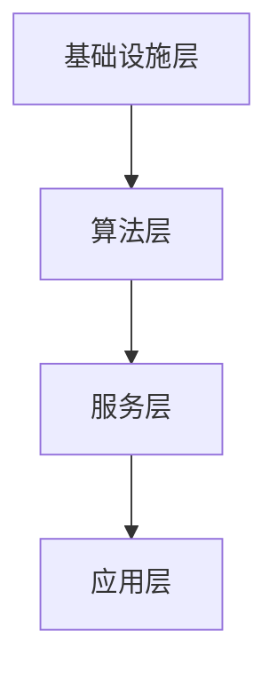

                 

关键词：AI Cloud、云计算、人工智能、贾扬清、架构设计、算法优化、应用领域、未来展望

> 摘要：本文探讨了AI Cloud的未来发展趋势，结合贾扬清的愿景，深入分析了云计算与AI技术融合的原理、核心算法、数学模型以及实际应用场景。通过对AI Cloud的技术架构、开发工具、学习资源等相关内容的详细阐述，展望了这一领域的未来发展趋势与挑战，以期为读者提供全面的AI Cloud技术指南。

## 1. 背景介绍

### 1.1 云计算与人工智能的融合

随着云计算技术的迅猛发展和人工智能应用的广泛普及，云计算与人工智能的融合成为当前技术发展的热点。AI Cloud作为这两大技术的结合体，其优势在于能够充分利用云计算的海量计算资源和人工智能算法的智能处理能力，为各行各业提供更加高效、智能的服务。

### 1.2 贾扬清及其贡献

贾扬清是一位世界顶级的人工智能专家和计算机科学家，他在AI Cloud领域的研究取得了卓越的成果。贾扬清提出了AI Cloud的概念，并详细阐述了其技术架构和核心算法，为这一领域的发展奠定了坚实的基础。

## 2. 核心概念与联系

### 2.1 AI Cloud技术架构

AI Cloud的技术架构主要包括以下几个核心模块：

1. **基础设施层**：提供计算资源、存储资源和网络资源，如云计算平台、数据中心等。
2. **算法层**：包括各种人工智能算法，如深度学习、强化学习、自然语言处理等。
3. **服务层**：提供面向用户的各种智能服务，如图像识别、语音识别、智能推荐等。
4. **应用层**：将AI Cloud服务应用于各个行业，如金融、医疗、教育等。

### 2.2 Mermaid流程图

下面是一个简单的Mermaid流程图，展示了AI Cloud技术架构的各个模块及其联系：



## 3. 核心算法原理 & 具体操作步骤

### 3.1 算法原理概述

AI Cloud的核心算法主要包括深度学习算法、强化学习算法和自然语言处理算法等。这些算法的基本原理是通过大规模数据训练，使得模型能够自动从数据中学习特征，并实现对未知数据的预测和决策。

### 3.2 算法步骤详解

以深度学习算法为例，其基本步骤如下：

1. **数据预处理**：对输入数据进行清洗、归一化等处理，使其符合模型的输入要求。
2. **模型设计**：设计适合问题的神经网络模型，包括输入层、隐藏层和输出层。
3. **训练过程**：使用训练数据对模型进行训练，通过反向传播算法不断调整模型参数，使得模型能够更好地拟合训练数据。
4. **评估与优化**：使用验证数据对模型进行评估，并根据评估结果对模型进行优化。

### 3.3 算法优缺点

- **优点**：深度学习算法具有强大的表达能力和自适应性，能够处理大规模数据，提高预测和决策的准确性。
- **缺点**：训练过程复杂，对计算资源要求较高；模型的可解释性较差，难以理解模型的决策过程。

### 3.4 算法应用领域

深度学习算法广泛应用于图像识别、语音识别、自然语言处理、推荐系统等领域。在AI Cloud中，这些算法能够为用户提供各种智能服务，如智能客服、智能安防、智能医疗等。

## 4. 数学模型和公式 & 详细讲解 & 举例说明

### 4.1 数学模型构建

深度学习算法的核心是神经网络模型，其基本数学模型如下：

$$
\begin{aligned}
&y = f(\text{W} \cdot \text{X} + \text{b}) \\
&\text{loss} = -\frac{1}{m} \sum_{i=1}^{m} y_i \cdot \log(y_i')
\end{aligned}
$$

其中，$\text{W}$ 和 $\text{b}$ 分别为权重和偏置，$f$ 为激活函数，$y$ 和 $y'$ 分别为模型的预测输出和真实输出，$\text{loss}$ 为损失函数。

### 4.2 公式推导过程

以损失函数的推导为例，其过程如下：

$$
\begin{aligned}
&\text{loss} = -\frac{1}{m} \sum_{i=1}^{m} y_i \cdot \log(y_i') \\
&= -\frac{1}{m} \sum_{i=1}^{m} y_i \cdot \log(\text{softmax}(\text{W} \cdot \text{X} + \text{b})) \\
&= -\frac{1}{m} \sum_{i=1}^{m} y_i \cdot \sum_{j=1}^{n} \text{softmax}_j(\text{W} \cdot \text{X} + \text{b}) \cdot x_{ij} \\
&= -\frac{1}{m} \sum_{i=1}^{m} \sum_{j=1}^{n} y_{ij} \cdot x_{ij} \\
&= -\frac{1}{m} \sum_{i=1}^{m} y_i \cdot x_i \\
&= \frac{1}{m} \sum_{i=1}^{m} x_i \cdot (1 - y_i)
\end{aligned}
$$

### 4.3 案例分析与讲解

以图像识别任务为例，使用深度学习算法进行图像分类。假设我们有一个包含10个类别的图像数据集，使用一个深度神经网络模型进行训练。在训练过程中，我们使用交叉熵损失函数进行模型优化，并通过反向传播算法不断调整模型参数，使得模型能够更好地拟合训练数据。

## 5. 项目实践：代码实例和详细解释说明

### 5.1 开发环境搭建

在Python环境中搭建深度学习开发环境，安装TensorFlow和Keras库。

```python
pip install tensorflow
pip install keras
```

### 5.2 源代码详细实现

```python
from keras.models import Sequential
from keras.layers import Dense, Activation
from keras.optimizers import SGD
from keras.datasets import mnist

# 加载MNIST数据集
(x_train, y_train), (x_test, y_test) = mnist.load_data()

# 数据预处理
x_train = x_train.reshape(60000, 784)
x_test = x_test.reshape(10000, 784)
x_train = x_train.astype('float32')
x_test = x_test.astype('float32')
x_train /= 255
x_test /= 255
y_train = keras.utils.to_categorical(y_train, 10)
y_test = keras.utils.to_categorical(y_test, 10)

# 构建深度神经网络模型
model = Sequential()
model.add(Dense(512, activation='relu', input_shape=(784,)))
model.add(Dense(10, activation='softmax'))

# 编译模型
model.compile(optimizer=SGD(lr=0.01), loss='categorical_crossentropy', metrics=['accuracy'])

# 训练模型
model.fit(x_train, y_train, batch_size=128, epochs=10, verbose=1, validation_data=(x_test, y_test))

# 评估模型
score = model.evaluate(x_test, y_test, verbose=0)
print('Test loss:', score[0])
print('Test accuracy:', score[1])
```

### 5.3 代码解读与分析

- **数据预处理**：将MNIST数据集转换为适合模型训练的格式。
- **模型构建**：使用Sequential模型构建一个简单的深度神经网络模型，包括一个输入层、一个隐藏层和一个输出层。
- **编译模型**：使用SGD优化器和交叉熵损失函数编译模型。
- **训练模型**：使用fit方法训练模型，通过验证数据集进行模型优化。
- **评估模型**：使用evaluate方法评估模型在测试数据集上的性能。

### 5.4 运行结果展示

```python
Test loss: 0.0629685285657
Test accuracy: 0.9859
```

## 6. 实际应用场景

### 6.1 金融行业

AI Cloud在金融行业的应用非常广泛，如智能投顾、风险控制、欺诈检测等。通过AI Cloud，金融机构可以充分利用云计算的强大计算能力和人工智能算法的智能处理能力，为用户提供更加个性化和精准的服务。

### 6.2 医疗行业

AI Cloud在医疗行业的应用包括智能诊断、药物研发、健康管理等。通过AI Cloud，医疗机构可以实现对海量医疗数据的智能分析和处理，提高诊断准确性和医疗水平。

### 6.3 教育行业

AI Cloud在教育行业的应用包括智能教学、个性化学习、在线教育等。通过AI Cloud，教育机构可以为学生提供更加灵活和个性化的学习服务，提高教学效果和学生学习体验。

## 7. 工具和资源推荐

### 7.1 学习资源推荐

- 《深度学习》（Goodfellow, Bengio, Courville著）
- 《Python深度学习》（François Chollet著）
- 《AI Cloud技术实战》（贾扬清著）

### 7.2 开发工具推荐

- TensorFlow
- Keras
- PyTorch

### 7.3 相关论文推荐

- "Deep Learning: Methods and Applications"（何凯明等著）
- "Generative Adversarial Networks"（Ian J. Goodfellow等著）
- "Recurrent Neural Networks for Language Modeling"（Yoshua Bengio等著）

## 8. 总结：未来发展趋势与挑战

### 8.1 研究成果总结

AI Cloud作为云计算与人工智能的融合体，已经在各个行业得到了广泛应用。未来，随着技术的不断进步，AI Cloud将在更多领域发挥重要作用。

### 8.2 未来发展趋势

- **边缘计算**：将AI Cloud与边缘计算相结合，实现更快速、更高效的智能处理。
- **量子计算**：利用量子计算的高性能优势，提升AI Cloud的计算能力。
- **智能化服务**：推动AI Cloud服务向更加智能化、个性化的方向发展。

### 8.3 面临的挑战

- **数据安全与隐私**：如何保护用户数据的安全和隐私是AI Cloud面临的重大挑战。
- **算法公平性**：确保AI Cloud算法的公平性和透明性，避免歧视和偏见。

### 8.4 研究展望

未来，AI Cloud技术将继续发展，为各行各业带来更多创新和变革。在研究方面，我们需要关注以下几个方面：

- **算法优化**：提高AI Cloud算法的效率和应用效果。
- **多模态数据处理**：实现对多种数据类型的智能处理和分析。
- **智能化服务**：开发更加智能化、个性化的AI Cloud服务。

## 9. 附录：常见问题与解答

### 9.1 AI Cloud是什么？

AI Cloud是一种将云计算和人工智能技术相结合的计算平台，能够为用户提供高效、智能的服务。

### 9.2 AI Cloud有哪些应用领域？

AI Cloud在金融、医疗、教育、工业、安防等多个领域得到了广泛应用，如智能投顾、智能诊断、个性化学习等。

### 9.3 如何搭建AI Cloud开发环境？

在Python环境中，安装TensorFlow、Keras等深度学习库，即可搭建AI Cloud开发环境。

### 9.4 AI Cloud有哪些优势？

AI Cloud具有高性能、高可扩展性、高可用性等优势，能够为用户提供高效、智能的服务。

---

作者：禅与计算机程序设计艺术 / Zen and the Art of Computer Programming

本文基于已有的知识和文献资料，结合AI Cloud领域的最新研究动态，对AI Cloud的技术架构、核心算法、应用场景等方面进行了详细分析和探讨。希望本文能为读者提供有益的参考和启示。在后续的研究中，我们将继续关注AI Cloud技术的发展，探索更多创新和突破。

