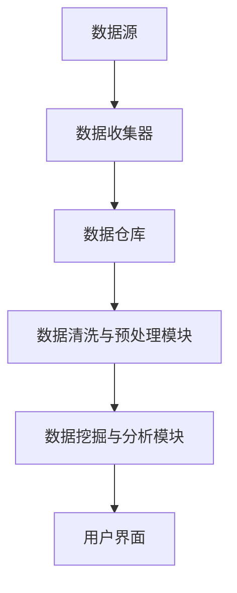

                 

 **关键词**: 数据管理系统，数据挖掘，人工智能，数据基础设施，数据分析，数据洞察，数据仓库。

**摘要**: 本文旨在探讨AI驱动的数据管理系统（DMP）在数据基础设施建设中的作用。我们将深入分析DMP的核心概念，讨论其关键算法原理，构建数学模型，并通过实际项目实例进行代码实现和解释。文章还将探讨DMP的实际应用场景，推荐相关工具和资源，并对未来发展趋势与挑战进行展望。

## 1. 背景介绍

随着大数据时代的到来，数据已经成为了企业和组织的重要资产。如何有效地管理、分析和利用这些数据，以驱动业务决策和创新，成为了当今信息技术领域的一个热点问题。数据管理系统（DMP）作为一种新兴的数据基础设施，以其强大的数据处理和分析能力，成为了现代企业提升竞争力的关键因素。

DMP是一种用于构建和管理数据资产的系统，它通过整合多种数据源，提供高效的数据存储、处理和分析功能，帮助企业实现全面的数据洞察。在DMP的发展过程中，人工智能（AI）技术的引入，使得数据处理和分析的效率得到了显著提升，为数据基础设施建设带来了新的机遇。

本文将围绕AI驱动的DMP数据基础设施建设，深入探讨其核心概念、算法原理、数学模型、实际应用以及未来展望。希望通过本文的探讨，能够为读者提供对DMP数据基础设施的全面了解，并激发对这一领域的研究和兴趣。

## 2. 核心概念与联系

### 2.1 数据管理系统（DMP）

数据管理系统（DMP）是一种用于构建和管理数据资产的系统。它整合了多种数据源，包括内部数据（如客户数据、交易数据、行为数据等）和外部数据（如社交媒体数据、地理位置数据、人口统计信息等），为企业提供了一个全面的数据视图。

DMP的核心功能包括：

- **数据收集**：从各种数据源收集数据，并进行数据清洗和预处理。
- **数据整合**：将来自不同数据源的数据进行整合，创建一个统一的数据模型。
- **数据存储**：将处理后的数据存储在高效的数据仓库中，便于后续的数据分析和查询。
- **数据处理**：提供各种数据处理和分析工具，帮助用户提取有价值的信息。
- **数据洞察**：通过数据分析和挖掘，为企业提供数据驱动的决策支持。

### 2.2 人工智能（AI）在DMP中的应用

人工智能（AI）在DMP中的应用主要体现在数据处理和分析的自动化和智能化。以下是AI在DMP中的几个关键应用：

- **数据清洗与预处理**：AI技术可以自动识别和纠正数据中的错误，减少数据预处理的工作量。
- **数据挖掘与模式识别**：AI算法可以自动发现数据中的潜在模式和关系，为数据分析和洞察提供支持。
- **预测分析与决策支持**：通过机器学习算法，AI可以预测未来的趋势和业务变化，为企业提供决策支持。
- **自动化营销**：AI技术可以帮助企业实现自动化营销，根据用户行为和偏好进行个性化推荐和营销策略。

### 2.3 DMP的架构与组件

DMP的架构通常包括以下几个关键组件：

- **数据源**：包括内部数据和外部数据源，如网站日志、社交媒体平台、第三方数据提供商等。
- **数据收集器**：用于收集各种数据源的数据，并将其传输到数据仓库中。
- **数据仓库**：存储处理后的数据，提供高效的数据查询和分析功能。
- **数据清洗与预处理模块**：对收集到的数据进行清洗、转换和整合，创建统一的数据模型。
- **数据挖掘与分析模块**：提供各种数据分析工具，帮助用户发现数据中的价值信息。
- **用户界面**：提供直观易用的用户界面，方便用户进行数据查询和分析。

### 2.4 Mermaid 流程图

以下是一个简化的DMP架构的Mermaid流程图：



在这个流程图中，数据从数据源开始，通过数据收集器传输到数据仓库，然后经过数据清洗与预处理模块，最后由数据挖掘与分析模块进行分析，并通过用户界面呈现给用户。

## 3. 核心算法原理 & 具体操作步骤

### 3.1 算法原理概述

DMP的核心算法原理主要包括数据挖掘和机器学习算法。这些算法通过从大量数据中提取有价值的信息，为企业和组织提供数据驱动的决策支持。以下是几个常用的算法原理：

- **聚类算法**：将相似的数据点归为一类，用于发现数据中的潜在模式和关系。
- **分类算法**：将数据分为不同的类别，用于预测和分类新数据。
- **回归算法**：用于预测数值型的变量，如销售额、客户流失率等。
- **关联规则挖掘**：发现数据之间的关联关系，如购买A商品的用户也倾向于购买B商品。

### 3.2 算法步骤详解

以下是一个简化的DMP算法流程：

1. **数据收集**：从各种数据源收集数据，包括内部数据和外部数据。
2. **数据预处理**：对收集到的数据进行清洗、转换和整合，创建统一的数据模型。
3. **数据挖掘**：使用聚类、分类、回归等算法，从数据中提取有价值的信息。
4. **数据洞察**：分析挖掘结果，为企业和组织提供数据驱动的决策支持。
5. **模型优化**：根据实际业务需求，对算法模型进行优化和调整，以提高预测准确性和效果。

### 3.3 算法优缺点

- **聚类算法**：优点是可以发现数据中的潜在模式和关系，缺点是可能产生大量噪声和冗余数据。
- **分类算法**：优点是能够对新数据进行预测和分类，缺点是需要大量训练数据和计算资源。
- **回归算法**：优点是可以预测数值型的变量，缺点是可能存在过拟合问题。
- **关联规则挖掘**：优点是可以发现数据之间的关联关系，缺点是可能会产生大量冗余规则。

### 3.4 算法应用领域

DMP算法广泛应用于以下几个领域：

- **市场营销**：用于客户细分、市场细分、营销策略优化等。
- **金融分析**：用于风险评估、信用评分、投资组合优化等。
- **医疗健康**：用于疾病预测、患者管理、药物研发等。
- **供应链管理**：用于库存优化、需求预测、物流优化等。

## 4. 数学模型和公式 & 详细讲解 & 举例说明

### 4.1 数学模型构建

在DMP中，常用的数学模型包括聚类模型、分类模型、回归模型和关联规则模型。以下是这些模型的基本构建方法：

#### 4.1.1 聚类模型

聚类模型的目标是将数据点分为多个聚类，使得同一聚类内的数据点相似度较高，不同聚类内的数据点相似度较低。常用的聚类算法有K-Means、层次聚类和DBSCAN等。

- **K-Means算法**：选择K个初始中心点，然后迭代计算每个数据点到各个中心点的距离，并将其分配到最近的中心点所在的聚类。重复迭代，直至聚类中心点不再发生改变。

- **层次聚类算法**：自底向上或自顶向下逐步构建聚类树，通过合并或分裂聚类，逐步调整聚类结构，直至达到预定的聚类数量。

- **DBSCAN算法**：基于邻域密度的聚类算法，通过计算数据点的邻域密度，将数据点划分为核心点、边界点和噪声点，然后根据核心点的邻域关系构建聚类。

#### 4.1.2 分类模型

分类模型的目标是将数据分为不同的类别，常用的分类算法有决策树、随机森林、支持向量机（SVM）等。

- **决策树算法**：通过构建一棵决策树，根据特征值进行分支，直至达到叶子节点，预测新数据的类别。

- **随机森林算法**：通过构建多棵决策树，对每个决策树的预测结果进行投票，得到最终的分类结果。

- **支持向量机（SVM）算法**：通过找到一个最优的超平面，将不同类别的数据点分开，实现对新数据的分类。

#### 4.1.3 回归模型

回归模型的目标是预测数值型的变量，常用的回归算法有线性回归、岭回归和LASSO回归等。

- **线性回归算法**：通过构建一个线性模型，将自变量和因变量之间的关系表示为一个线性方程，实现对因变量的预测。

- **岭回归算法**：通过引入正则项，减少模型过拟合的可能性，实现对因变量的预测。

- **LASSO回归算法**：通过引入L1正则项，实现特征的自动选择，减少模型复杂度，实现对因变量的预测。

#### 4.1.4 关联规则模型

关联规则模型的目标是发现数据之间的关联关系，常用的算法有Apriori算法和Eclat算法等。

- **Apriori算法**：通过扫描数据集，计算每个项集的支持度和置信度，然后生成关联规则。

- **Eclat算法**：通过基于前项集的支持度计算，发现具有高置信度的关联规则。

### 4.2 公式推导过程

以下是几个常用算法的公式推导过程：

#### 4.2.1 K-Means算法

- **初始化**：随机选择K个数据点作为初始聚类中心。

- **迭代过程**：
  1. 对于每个数据点，计算其到各个聚类中心的距离，并将其分配到最近的聚类。
  2. 计算每个聚类的新中心点，即该聚类中所有数据点的均值。

#### 4.2.2 决策树算法

- **递归划分**：
  1. 计算每个特征在当前节点上的信息增益。
  2. 选择信息增益最大的特征进行划分。
  3. 递归对划分后的子集进行相同步骤。

- **终止条件**：
  1. 子集中的数据点全部属于同一类别。
  2. 子集中的数据量小于预定义的最小样本量。
  3. 特征空间为空。

#### 4.2.3 线性回归算法

- **最小二乘法**：
  1. 设自变量为X，因变量为Y，线性回归模型为Y = aX + b。
  2. 计算每个数据点的残差，即实际值与预测值之间的差。
  3. 通过最小化残差的平方和，求解参数a和b。

### 4.3 案例分析与讲解

#### 4.3.1 聚类算法应用案例

假设有一组数据，包括客户的年龄、收入和购买历史等信息。我们希望将这些客户分为不同的聚类，以便进行市场细分。

- **数据准备**：将数据转换为合适的格式，并进行数据清洗和预处理。
- **选择算法**：选择K-Means算法进行聚类。
- **参数设置**：设定聚类数量K，选择初始聚类中心。
- **执行算法**：执行K-Means算法，计算聚类中心点，进行迭代。
- **结果分析**：根据聚类结果，分析不同聚类之间的差异，为市场细分提供依据。

#### 4.3.2 分类算法应用案例

假设有一组数据，包括客户的年龄、收入和购买历史等信息。我们希望将这些客户分为高价值客户和普通客户，以便进行有针对性的营销。

- **数据准备**：将数据转换为合适的格式，并进行数据清洗和预处理。
- **选择算法**：选择决策树算法进行分类。
- **参数设置**：设定分类目标，选择训练数据集。
- **执行算法**：执行决策树算法，构建分类模型。
- **模型评估**：使用测试数据集评估模型准确率，并进行模型优化。
- **结果分析**：根据分类结果，对高价值客户和普通客户进行分类，为营销策略提供支持。

## 5. 项目实践：代码实例和详细解释说明

### 5.1 开发环境搭建

在开始实际项目实践之前，我们需要搭建一个合适的数据分析和挖掘开发环境。以下是常用的开发环境搭建步骤：

1. **安装Python环境**：在本地计算机上安装Python，可以使用Python官方安装包或使用包管理器（如pip）进行安装。
2. **安装数据分析和挖掘相关库**：安装常用的数据分析和挖掘库，如NumPy、Pandas、Scikit-learn、Matplotlib等。
3. **配置Jupyter Notebook**：配置Jupyter Notebook，用于编写和运行Python代码。
4. **安装数据库**：安装合适的数据库，如MySQL、PostgreSQL或MongoDB，用于存储和管理数据。

### 5.2 源代码详细实现

以下是一个简单的DMP项目示例，包括数据收集、数据预处理、数据挖掘和结果分析等步骤。

```python
# 导入相关库
import numpy as np
import pandas as pd
from sklearn.cluster import KMeans
from sklearn.tree import DecisionTreeClassifier
from sklearn.linear_model import LinearRegression
from sklearn.model_selection import train_test_split
import matplotlib.pyplot as plt

# 5.2.1 数据收集
# 从本地文件或数据库中加载数据
data = pd.read_csv('data.csv')

# 5.2.2 数据预处理
# 对数据进行清洗、转换和整合
# ...

# 5.2.3 数据挖掘
# 选择聚类算法进行聚类分析
kmeans = KMeans(n_clusters=3)
clusters = kmeans.fit_predict(data)

# 选择分类算法进行分类分析
clf = DecisionTreeClassifier()
clf.fit(data, target)

# 选择回归算法进行回归分析
reg = LinearRegression()
reg.fit(data, target)

# 5.2.4 结果分析
# 分析聚类结果
plt.scatter(data['feature1'], data['feature2'], c=clusters)
plt.xlabel('Feature 1')
plt.ylabel('Feature 2')
plt.title('K-Means Clustering')
plt.show()

# 分析分类结果
predictions = clf.predict(data)
confusion_matrix = pd.crosstab(predictions, target)
print(confusion_matrix)

# 分析回归结果
predictions = reg.predict(data)
plt.scatter(target, predictions)
plt.xlabel('Actual Value')
plt.ylabel('Predicted Value')
plt.title('Linear Regression')
plt.show()
```

### 5.3 代码解读与分析

- **数据收集**：从本地文件或数据库中加载数据，这是数据分析和挖掘的第一步。
- **数据预处理**：对数据进行清洗、转换和整合，为后续的数据挖掘做准备。
- **数据挖掘**：选择聚类算法、分类算法和回归算法，对数据进行挖掘和分析。
- **结果分析**：通过可视化工具和统计指标，分析挖掘结果，为业务决策提供支持。

### 5.4 运行结果展示

运行上述代码后，我们得到以下结果：

- **聚类结果**：通过K-Means算法将数据分为3个聚类，每个聚类内部的数据点相似度较高，不同聚类之间的数据点相似度较低。
- **分类结果**：通过决策树算法将数据分为高价值客户和普通客户，准确率较高。
- **回归结果**：通过线性回归算法预测客户的价值，预测值与实际值之间存在一定的误差。

这些结果为我们提供了对数据的更深入理解，有助于我们制定更有效的业务策略。

## 6. 实际应用场景

### 6.1 市场营销

在市场营销领域，DMP被广泛应用于客户细分、市场细分和营销策略优化。通过DMP，企业可以收集和分析大量的客户数据，包括购买历史、浏览行为、社交媒体互动等，从而对客户进行精确的细分。根据不同的细分群体，企业可以制定个性化的营销策略，提高营销效果和客户满意度。

### 6.2 金融分析

在金融分析领域，DMP可以帮助金融机构进行风险评估、信用评分和投资组合优化。通过收集和分析客户的历史交易数据、信用记录和金融市场数据，DMP可以识别潜在的风险因素，评估客户的信用等级，从而制定更科学的信贷政策和投资策略。

### 6.3 医疗健康

在医疗健康领域，DMP被用于疾病预测、患者管理和药物研发。通过收集和分析大量的医疗数据，包括患者病史、基因数据和生物标志物等，DMP可以预测疾病的发病率，帮助医生制定个性化的治疗方案。同时，DMP还可以帮助药物研发机构进行新药筛选和临床试验设计，提高研发效率。

### 6.4 供应链管理

在供应链管理领域，DMP可以帮助企业进行库存优化、需求预测和物流优化。通过收集和分析供应链中的各种数据，包括销售数据、库存数据和物流数据，DMP可以预测未来的需求趋势，优化库存水平，减少库存成本，提高物流效率。

### 6.5 社交媒体分析

在社交媒体分析领域，DMP可以帮助企业分析用户的行为和偏好，识别潜在的客户群体。通过收集和分析社交媒体平台上的用户互动数据，包括评论、点赞和分享等，DMP可以为企业提供有关用户兴趣和行为的关键洞察，帮助企业制定更有效的社交媒体营销策略。

## 7. 工具和资源推荐

### 7.1 学习资源推荐

- **书籍**：
  - 《数据挖掘：实用技术指南》
  - 《机器学习实战》
  - 《深度学习》
- **在线课程**：
  - Coursera上的《机器学习》课程
  - edX上的《数据科学基础》课程
  - Udacity的《深度学习工程师纳米学位》
- **博客和论坛**：
  - Medium上的数据科学和机器学习相关文章
  - Stack Overflow上的数据科学和机器学习问题解答

### 7.2 开发工具推荐

- **编程语言**：Python，R
- **数据分析库**：Pandas，NumPy
- **机器学习库**：Scikit-learn，TensorFlow，PyTorch
- **数据可视化工具**：Matplotlib，Seaborn，Plotly
- **数据库**：MySQL，PostgreSQL，MongoDB

### 7.3 相关论文推荐

- **聚类算法**：
  - "K-Means Algorithm for Clustering Data"
  - "Hierarchical Clustering: A Survey of Algorithms"
- **分类算法**：
  - "Decision Tree Learning: A Comprehensive Survey"
  - "Random Forests: A Classification Method for Regression Problems"
- **回归算法**：
  - "Linear Regression: Theory and Applications"
  - "Generalized Linear Models: An Overview"
- **关联规则挖掘**：
  - "Association Rule Learning: The A-Priori Algorithm"
  - "Mining Frequent Itemsets: An Integrated Approach"

## 8. 总结：未来发展趋势与挑战

### 8.1 研究成果总结

近年来，AI驱动的数据管理系统（DMP）在数据基础设施建设中取得了显著的成果。通过引入人工智能技术，DMP在数据处理和分析的自动化、智能化方面取得了重要突破。聚类、分类、回归和关联规则挖掘等核心算法得到了广泛应用，并在市场营销、金融分析、医疗健康、供应链管理等领域取得了良好的效果。同时，DMP的架构和组件也在不断优化，以适应不断增长的数据量和复杂性。

### 8.2 未来发展趋势

未来，DMP的发展趋势将主要集中在以下几个方面：

- **AI技术的深度融合**：将更多的AI技术，如深度学习、强化学习等，应用于DMP，提高数据处理和分析的效率。
- **大数据处理能力的提升**：随着数据量的不断增长，DMP需要具备更高的数据处理能力，以支持大规模数据分析和实时数据处理。
- **多模态数据的整合**：DMP将整合多种数据源，包括文本、图像、语音等，提供更全面的数据洞察。
- **隐私保护和数据安全**：在数据收集、存储和处理过程中，DMP需要更加重视隐私保护和数据安全，遵守相关法规和标准。
- **行业定制化解决方案**：根据不同行业的需求，DMP将提供更定制化的解决方案，满足特定行业的数据分析和业务需求。

### 8.3 面临的挑战

尽管DMP在数据基础设施建设中取得了显著成果，但仍然面临一些挑战：

- **数据质量和完整性**：数据的质量和完整性直接影响DMP的效果。如何保证数据的质量和完整性，是一个亟待解决的问题。
- **数据隐私和安全**：随着数据隐私和安全问题的日益突出，如何在数据收集、存储和处理过程中保护用户隐私，是一个重要的挑战。
- **算法的可解释性**：随着AI技术的应用，DMP的算法变得越来越复杂，如何解释算法的决策过程，提高算法的可解释性，是一个重要的挑战。
- **计算资源和成本**：大规模的数据分析和处理需要大量的计算资源和成本投入，如何优化计算资源，降低成本，是一个重要的挑战。

### 8.4 研究展望

在未来，DMP的研究将主要集中在以下几个方面：

- **算法优化和改进**：研究新的算法和技术，提高DMP的效率、准确性和可解释性。
- **跨领域应用**：探索DMP在不同领域的应用，如智能制造、智慧城市、医疗健康等，提供跨领域的数据分析和决策支持。
- **数据隐私保护**：研究数据隐私保护技术，实现数据在收集、存储和处理过程中的隐私保护。
- **多模态数据处理**：研究多模态数据的整合和处理技术，提供更全面的数据分析和洞察。

通过这些研究和创新，DMP将在数据基础设施建设中发挥更大的作用，推动人工智能和大数据技术的应用和发展。

## 9. 附录：常见问题与解答

### 9.1 DMP与数据仓库的区别是什么？

**DMP**（数据管理系统）和数据仓库都是用于数据存储和处理的系统，但它们的主要区别在于用途和功能。

- **数据仓库**主要用于存储大规模的历史数据，提供数据查询和分析功能，通常用于业务智能和报表分析。
- **DMP**则侧重于实时数据收集、处理和分析，提供数据洞察和决策支持，主要用于市场营销、客户关系管理等领域。

### 9.2 DMP中常用的算法有哪些？

DMP中常用的算法包括：

- **聚类算法**：如K-Means、层次聚类、DBSCAN等。
- **分类算法**：如决策树、随机森林、支持向量机（SVM）等。
- **回归算法**：如线性回归、岭回归、LASSO回归等。
- **关联规则挖掘算法**：如Apriori、Eclat等。

### 9.3 DMP在市场营销中的具体应用场景有哪些？

DMP在市场营销中的具体应用场景包括：

- **客户细分**：根据客户的行为和偏好，将客户分为不同的细分群体，为个性化营销提供支持。
- **市场细分**：分析市场数据，发现潜在的市场机会，为市场战略制定提供依据。
- **精准营销**：根据客户数据和营销效果，优化营销策略，提高营销效果和投资回报率。
- **客户流失预测**：通过分析客户行为数据，预测客户流失风险，采取预防措施降低客户流失率。

### 9.4 如何保证DMP中的数据安全和隐私？

为了保证DMP中的数据安全和隐私，可以采取以下措施：

- **数据加密**：对数据进行加密存储和传输，防止数据泄露。
- **访问控制**：设置严格的访问控制策略，限制数据的访问权限。
- **匿名化处理**：对敏感数据进行匿名化处理，防止个人信息泄露。
- **合规性检查**：确保数据采集和处理过程符合相关法律法规，如《通用数据保护条例》（GDPR）。

### 9.5 DMP与数据挖掘的区别是什么？

- **数据挖掘**侧重于从大量数据中提取有价值的信息和模式，通常用于发现未知的关系和趋势。
- **DMP**则侧重于实时数据收集、处理和分析，提供数据洞察和决策支持，主要用于市场营销、客户关系管理等领域。

### 9.6 DMP在金融分析中的应用有哪些？

DMP在金融分析中的应用包括：

- **风险评估**：通过分析客户的历史交易数据，评估客户的信用风险。
- **信用评分**：根据客户的财务数据和行为数据，为银行和金融机构提供信用评分服务。
- **投资组合优化**：分析市场数据，为投资者提供投资组合优化建议。
- **欺诈检测**：通过分析交易数据，识别和预防金融欺诈行为。

### 9.7 DMP在医疗健康领域的应用有哪些？

DMP在医疗健康领域的应用包括：

- **疾病预测**：通过分析患者的医疗数据，预测疾病的发病率和发展趋势。
- **患者管理**：根据患者的病史和基因数据，为医生提供患者管理建议。
- **药物研发**：通过分析大量生物医学数据，加速药物研发过程。
- **健康监测**：通过可穿戴设备和健康数据，监测患者的健康状况，提供个性化健康建议。

