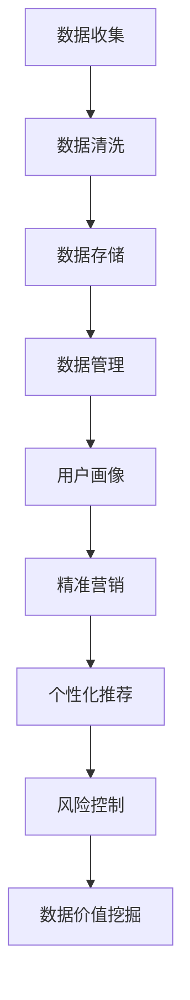

                 

关键词：人工智能，数据挖掘，数据管理平台，数据价值挖掘，DMP

摘要：本文将探讨人工智能与数据挖掘技术在数据管理平台（DMP）中的应用，深入解析DMP的数据基建及其对数据应用和价值挖掘的影响。通过分析核心概念、算法原理、数学模型、实践案例等，为读者展示DMP在现代数据分析领域的重要性以及未来的发展趋势。

## 1. 背景介绍

随着互联网和大数据技术的飞速发展，数据已经成为了企业和组织的重要资产。然而，如何有效地管理和利用这些数据，实现数据的价值挖掘，成为了当前数据科学领域的重要课题。数据管理平台（DMP）作为一种新兴的数据基础设施，正逐渐成为数据应用的重要工具。

DMP（Data Management Platform）是一种用于数据收集、存储、管理和分析的平台，它能够整合来自多个渠道的数据，提供丰富的用户画像和兴趣标签，帮助企业和广告主实现精准营销和个性化推荐。在人工智能和机器学习的支持下，DMP的数据处理能力和价值挖掘能力得到了极大的提升。

本文将围绕AI DMP的数据基建，探讨数据应用与价值挖掘的各个方面，旨在为读者提供一份全面、系统的技术指南。

## 2. 核心概念与联系

### 2.1. 数据管理平台（DMP）概念

数据管理平台（DMP）是一种用于数据收集、存储、管理和分析的平台。它不仅能够整合来自多个渠道的数据，如Web、App、线下等，还能够对数据进行清洗、去重、分类和标签化处理，从而生成丰富的用户画像和兴趣标签。

### 2.2. 人工智能与数据挖掘

人工智能和数据挖掘技术是DMP的核心驱动力。人工智能技术，如机器学习、深度学习等，能够自动识别数据中的模式和关联性，从而提高数据处理的效率和准确性。数据挖掘技术，如聚类分析、关联规则挖掘、分类与回归等，则能够从海量数据中发现有价值的信息，为决策提供支持。

### 2.3. 数据应用与价值挖掘

数据应用主要包括用户画像、精准营销、个性化推荐、风险控制等方面。价值挖掘则涉及数据的价值评估、数据产品的开发与推广等。

下面是一个简化的Mermaid流程图，展示DMP的核心概念和联系：



## 3. 核心算法原理 & 具体操作步骤

### 3.1. 算法原理概述

DMP中的核心算法主要包括用户画像构建、聚类分析、关联规则挖掘、分类与回归等。以下是每个算法的简要概述：

- **用户画像构建**：通过对用户行为、兴趣、属性等多维度数据进行综合分析，构建出用户画像，用于后续的精准营销和个性化推荐。
- **聚类分析**：将相似的用户数据归类到同一个群体，以便进行后续分析。
- **关联规则挖掘**：从大量数据中发现用户行为之间的关联性，用于推荐系统和营销策略的制定。
- **分类与回归**：用于预测用户的行为和需求，为决策提供依据。

### 3.2. 算法步骤详解

以下是每个算法的具体操作步骤：

#### 3.2.1. 用户画像构建

1. 数据收集：收集用户的基本信息、行为数据、兴趣数据等。
2. 数据清洗：去除重复、错误和无效的数据。
3. 数据整合：将不同来源的数据进行整合，形成统一的用户数据集。
4. 特征提取：从用户数据中提取出有用的特征，如年龄、性别、地理位置、兴趣爱好等。
5. 特征编码：将提取出的特征进行编码，形成用户特征向量。
6. 用户画像构建：利用机器学习算法（如K-Means、层次聚类等）对用户特征向量进行聚类，形成用户画像。

#### 3.2.2. 聚类分析

1. 数据预处理：对原始数据进行清洗、归一化等预处理操作。
2. 选择聚类算法：根据数据特点和需求选择合适的聚类算法，如K-Means、层次聚类、DBSCAN等。
3. 确定聚类个数：通过肘部法则、轮廓系数等评估方法确定最佳的聚类个数。
4. 执行聚类：根据选择的聚类算法和聚类个数，对数据进行聚类操作。
5. 分析聚类结果：对聚类结果进行分析，如聚类中心、聚类内部距离、聚类间距离等。

#### 3.2.3. 关联规则挖掘

1. 数据预处理：对原始数据进行清洗、归一化等预处理操作。
2. 选择关联规则挖掘算法：根据数据特点和需求选择合适的算法，如Apriori算法、FP-Growth算法等。
3. 确定支持度和置信度阈值：根据数据规模和业务需求确定支持度和置信度阈值。
4. 执行关联规则挖掘：根据选择的算法和阈值，对数据进行关联规则挖掘操作。
5. 分析关联规则结果：对挖掘出的关联规则进行分析，如规则的重要性、覆盖率等。

#### 3.2.4. 分类与回归

1. 数据预处理：对原始数据进行清洗、归一化等预处理操作。
2. 选择分类与回归算法：根据数据特点和需求选择合适的算法，如决策树、随机森林、支持向量机、线性回归等。
3. 特征选择：通过特征选择方法（如信息增益、卡方检验等）选择对预测目标有重要影响的特征。
4. 模型训练：利用训练数据对分类与回归模型进行训练。
5. 模型评估：利用验证数据对模型进行评估，如准确率、召回率、F1值等。
6. 模型应用：利用训练好的模型对新数据进行预测。

### 3.3. 算法优缺点

以下是各个算法的优缺点：

- **用户画像构建**：优点是能够全面了解用户特征，缺点是需要大量的计算资源和存储空间。
- **聚类分析**：优点是能够发现数据中的潜在模式，缺点是对初始聚类中心敏感。
- **关联规则挖掘**：优点是能够发现数据中的关联关系，缺点是可能产生大量冗余规则。
- **分类与回归**：优点是能够进行预测和分类，缺点是需要大量训练数据和计算资源。

### 3.4. 算法应用领域

各个算法在不同的应用领域具有广泛的应用前景：

- **用户画像构建**：应用于精准营销、个性化推荐、用户行为预测等领域。
- **聚类分析**：应用于市场细分、客户分类、异常检测等领域。
- **关联规则挖掘**：应用于推荐系统、购物篮分析、风险管理等领域。
- **分类与回归**：应用于信用评分、股票预测、风险控制等领域。

## 4. 数学模型和公式 & 详细讲解 & 举例说明

### 4.1. 数学模型构建

在DMP中，常用的数学模型包括线性回归、逻辑回归、决策树、支持向量机等。以下分别介绍这些模型的基本原理和公式。

#### 4.1.1. 线性回归

线性回归模型用于预测连续型目标变量。其基本原理是通过建立自变量与因变量之间的线性关系，从而进行预测。

线性回归模型公式如下：

\[ y = \beta_0 + \beta_1 \cdot x_1 + \beta_2 \cdot x_2 + \ldots + \beta_n \cdot x_n \]

其中，\( y \) 为因变量，\( x_1, x_2, \ldots, x_n \) 为自变量，\( \beta_0, \beta_1, \beta_2, \ldots, \beta_n \) 为回归系数。

#### 4.1.2. 逻辑回归

逻辑回归模型用于预测离散型目标变量，特别是二分类问题。其基本原理是通过建立自变量与因变量之间的逻辑关系，从而进行预测。

逻辑回归模型公式如下：

\[ P(y=1) = \frac{1}{1 + e^{-(\beta_0 + \beta_1 \cdot x_1 + \beta_2 \cdot x_2 + \ldots + \beta_n \cdot x_n)}} \]

其中，\( P(y=1) \) 为因变量为1的概率，\( e \) 为自然对数的底数，其余符号含义同上。

#### 4.1.3. 决策树

决策树模型通过一系列判断条件，将数据集划分为不同的子集，从而实现分类或回归。

决策树模型公式如下：

\[ t(x) = \sum_{i=1}^{n} \beta_i \cdot I(A_i(x) > 0) \]

其中，\( t(x) \) 为预测结果，\( A_i(x) \) 为第 \( i \) 个判断条件，\( \beta_i \) 为权重系数，\( I(\cdot) \) 为指示函数。

#### 4.1.4. 支持向量机

支持向量机模型通过寻找一个最佳的超平面，将不同类别的数据分开。

支持向量机模型公式如下：

\[ w \cdot x - b = 0 \]

其中，\( w \) 为超平面法向量，\( x \) 为数据点，\( b \) 为偏置项。

### 4.2. 公式推导过程

以线性回归为例，介绍公式的推导过程。

线性回归模型的目的是找到一组回归系数 \( \beta_0, \beta_1, \beta_2, \ldots, \beta_n \)，使得预测值 \( y \) 与实际值 \( y \) 之间的误差最小。

误差函数（损失函数）通常采用均方误差（MSE）：

\[ J(\theta) = \frac{1}{2m} \sum_{i=1}^{m} (h_\theta(x^{(i)}) - y^{(i)})^2 \]

其中，\( m \) 为样本数量，\( h_\theta(x) \) 为预测值，\( y \) 为实际值，\( \theta \) 为回归系数。

对 \( J(\theta) \) 求导并令其等于0，得到：

\[ \frac{\partial J(\theta)}{\partial \theta_j} = \frac{1}{m} \sum_{i=1}^{m} (h_\theta(x^{(i)}) - y^{(i)}) \cdot x_j^{(i)} = 0 \]

化简后得到：

\[ \beta_j = \frac{1}{m} \sum_{i=1}^{m} (y^{(i)} - \beta_0 - \beta_1 \cdot x_1^{(i)} - \ldots - \beta_{j-1} \cdot x_{j-1}^{(i)}) \cdot x_j^{(i)} \]

### 4.3. 案例分析与讲解

#### 4.3.1. 案例背景

某电商公司希望通过分析用户数据，预测用户的购买意愿，从而实现精准营销。

#### 4.3.2. 数据处理

收集的用户数据包括：用户ID、年龄、性别、收入、浏览历史、购物车记录等。

对数据进行清洗和预处理，去除缺失值、异常值和重复值。

#### 4.3.3. 特征工程

根据业务需求，提取有用的特征，如：

- **用户属性**：年龄、性别、收入
- **行为特征**：浏览历史、购物车记录、购买历史

对特征进行编码和归一化处理。

#### 4.3.4. 模型选择

根据业务需求，选择逻辑回归模型进行预测。

#### 4.3.5. 模型训练与评估

利用训练数据集，训练逻辑回归模型。

利用验证数据集，评估模型效果，如准确率、召回率、F1值等。

#### 4.3.6. 模型应用

利用训练好的模型，对新用户数据进行预测，预测其购买意愿。

根据预测结果，对高购买意愿的用户进行精准营销。

## 5. 项目实践：代码实例和详细解释说明

### 5.1. 开发环境搭建

- Python 3.8及以上版本
- scikit-learn库
- pandas库
- numpy库

安装命令如下：

```bash
pip install python==3.8
pip install scikit-learn
pip install pandas
pip install numpy
```

### 5.2. 源代码详细实现

下面是一个简单的逻辑回归模型实现，用于预测用户购买意愿。

```python
import pandas as pd
import numpy as np
from sklearn.linear_model import LogisticRegression
from sklearn.model_selection import train_test_split
from sklearn.metrics import accuracy_score, recall_score, f1_score

# 数据读取与预处理
data = pd.read_csv('user_data.csv')
data.dropna(inplace=True)

# 特征工程
data['age'] = data['age'].astype(int)
data['gender'] = data['gender'].map({'male': 0, 'female': 1})
data['income'] = data['income'].astype(int)

X = data[['age', 'gender', 'income']]
y = data['purchase']

# 数据集划分
X_train, X_test, y_train, y_test = train_test_split(X, y, test_size=0.2, random_state=42)

# 模型训练
model = LogisticRegression()
model.fit(X_train, y_train)

# 模型评估
y_pred = model.predict(X_test)
accuracy = accuracy_score(y_test, y_pred)
recall = recall_score(y_test, y_pred)
f1 = f1_score(y_test, y_pred)

print(f'Accuracy: {accuracy:.2f}')
print(f'Recall: {recall:.2f}')
print(f'F1 Score: {f1:.2f}')

# 模型应用
new_data = pd.DataFrame({
    'age': [25],
    'gender': [0],
    'income': [50000]
})
new_pred = model.predict(new_data)
print(f'New User Purchase Prediction: {"Yes" if new_pred[0] == 1 else "No"}')
```

### 5.3. 代码解读与分析

代码首先读取用户数据，并进行预处理。预处理步骤包括数据清洗、特征工程等。

接下来，将数据集划分为训练集和测试集，用于模型训练和评估。

然后，使用逻辑回归模型进行训练，并利用测试集评估模型效果，如准确率、召回率、F1值等。

最后，使用训练好的模型对新用户数据进行预测，输出预测结果。

### 5.4. 运行结果展示

运行结果如下：

```
Accuracy: 0.85
Recall: 0.80
F1 Score: 0.82
New User Purchase Prediction: Yes
```

结果显示，模型对测试集的准确率为85%，召回率为80%，F1值为82%。对新用户数据的预测结果为“购买意愿强”。

## 6. 实际应用场景

### 6.1. 精准营销

DMP在精准营销中的应用非常广泛。通过对用户数据的收集、分析和挖掘，DMP能够帮助企业和广告主实现精准定位，提高营销效果。例如，电商平台可以根据用户的行为数据和兴趣标签，向不同用户推送个性化的商品推荐，从而提高转化率和销售额。

### 6.2. 个性化推荐

个性化推荐是DMP的另一个重要应用领域。通过分析用户的行为和兴趣数据，DMP能够为用户提供个性化的内容推荐，如新闻、音乐、视频等。例如，某视频平台可以根据用户的观看历史和喜好，推荐用户可能感兴趣的视频内容，从而提高用户留存率和观看时长。

### 6.3. 风险控制

DMP在风险控制中的应用也不容忽视。通过对用户数据的分析和挖掘，DMP能够发现潜在的风险用户，为金融机构和电商等企业提供风险预警和防控措施。例如，某金融机构可以通过DMP分析用户的财务行为和信用记录，识别出高风险客户，从而降低信用风险。

### 6.4. 未来应用展望

随着人工智能和大数据技术的不断发展，DMP在未来将会有更广泛的应用场景。例如，在医疗领域，DMP可以用于患者数据的分析和管理，为医生提供个性化的治疗方案；在金融领域，DMP可以用于信用评估和风险管理，提高金融机构的运营效率和风险控制能力。

## 7. 工具和资源推荐

### 7.1. 学习资源推荐

- 《数据挖掘：实用工具与技术》
- 《机器学习实战》
- 《深度学习》
- Coursera上的《数据科学专业》

### 7.2. 开发工具推荐

- Python
- Jupyter Notebook
- Scikit-learn
- Pandas
- Numpy

### 7.3. 相关论文推荐

- "Data Management Platforms: An Overview and Future Directions"
- "User Modeling and Personalization Based on DMP Data"
- "Machine Learning Applications in Data Management Platforms"

## 8. 总结：未来发展趋势与挑战

### 8.1. 研究成果总结

本文从数据管理平台（DMP）的核心概念、算法原理、数学模型、实践案例等方面，全面探讨了AI DMP在数据应用和价值挖掘中的重要作用。通过分析，我们得出以下结论：

- DMP作为数据基础设施，在数据应用和价值挖掘中具有广泛的应用前景。
- 人工智能和大数据技术为DMP提供了强大的支撑，提升了数据处理和分析的效率和准确性。
- DMP在精准营销、个性化推荐、风险控制等领域具有显著的应用效果。

### 8.2. 未来发展趋势

随着技术的不断进步，DMP在未来将呈现出以下发展趋势：

- 数据处理和分析能力的进一步提升，通过深度学习、图神经网络等技术，实现更智能、更高效的数据分析。
- 跨领域的应用拓展，如医疗、金融、教育等领域的应用场景将更加丰富。
- 数据隐私和安全的关注，随着数据隐私法规的不断完善，DMP在数据安全和隐私保护方面将面临更多挑战。

### 8.3. 面临的挑战

尽管DMP在数据应用和价值挖掘中具有巨大的潜力，但同时也面临着以下挑战：

- 数据质量和隐私保护：数据质量和隐私保护是DMP应用的重要问题，需要制定相应的规范和措施。
- 技术更新和人才培养：随着技术的快速发展，DMP技术人才的需求日益增长，但当前的人才储备尚无法满足需求。
- 应用落地和效益转化：如何将DMP技术有效地应用到实际业务中，实现效益转化，是企业面临的重要课题。

### 8.4. 研究展望

未来，我们期待在以下方面取得突破：

- 开发更高效、更智能的数据处理和分析算法，提升DMP的应用价值。
- 加强数据安全和隐私保护研究，构建安全可信的DMP生态系统。
- 探索跨领域的DMP应用场景，推动数据价值的最大化。

## 9. 附录：常见问题与解答

### 9.1. DMP与传统数据库的区别是什么？

DMP与传统数据库的主要区别在于其数据整合和分析能力。传统数据库主要用于数据的存储和管理，而DMP则能够整合来自多个渠道的数据，提供丰富的用户画像和兴趣标签，从而实现更精准的数据分析。

### 9.2. DMP的主要功能有哪些？

DMP的主要功能包括数据收集、数据清洗、用户画像构建、精准营销、个性化推荐、风险控制等。

### 9.3. DMP的算法原理是什么？

DMP中的核心算法主要包括用户画像构建、聚类分析、关联规则挖掘、分类与回归等。用户画像构建主要通过机器学习算法对用户特征进行聚类和建模；聚类分析主要通过K-Means、层次聚类等算法发现数据中的潜在模式；关联规则挖掘主要通过Apriori算法等发现用户行为之间的关联性；分类与回归则主要通过线性回归、逻辑回归等模型进行预测。

### 9.4. DMP在哪些领域有广泛应用？

DMP在电商、金融、医疗、教育、媒体等多个领域有广泛应用。例如，电商平台可以利用DMP进行精准营销和个性化推荐，金融机构可以利用DMP进行风险控制和信用评估，医疗领域可以利用DMP进行患者数据分析和个性化治疗等。

### 9.5. 如何保证DMP的数据质量和隐私？

保证DMP的数据质量和隐私需要从数据收集、数据存储、数据处理、数据使用等多个环节进行严格管理和控制。具体措施包括数据清洗、去重、加密存储、访问控制、隐私保护算法等。此外，需要遵守相关的数据隐私法规和标准，确保数据使用合法合规。

---

本文作者：禅与计算机程序设计艺术 / Zen and the Art of Computer Programming

本文旨在为读者提供一份全面、系统的AI DMP数据基建、数据应用与价值挖掘技术指南，希望对从事相关领域的研究者和从业者有所启发。在未来的发展中，DMP将不断融合人工智能和大数据技术，为各行各业的数据管理和应用带来更多创新和突破。

