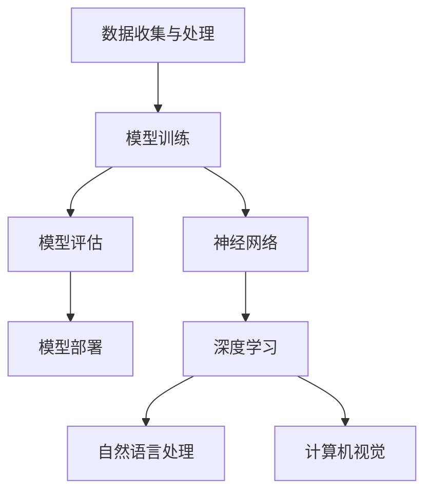

                 

### 关键词 Keywords
- 人工智能
- 算法原理
- 数学模型
- 代码实例
- 实际应用
- 资源推荐

<|assistant|>### 摘要 Abstract
本文将深入探讨人工智能的核心原理，并通过具体的代码实例来展示这些原理在实际应用中的实现方法。文章将从背景介绍出发，逐步讲解核心概念、算法原理，并展示数学模型和公式。随后，我们将通过项目实践环节，介绍如何通过代码实现人工智能算法，并对其进行详细解读。最后，文章将讨论人工智能的实际应用场景，展望其未来的发展趋势与面临的挑战。

<|assistant|>## 1. 背景介绍

人工智能（AI）作为计算机科学的一个分支，旨在通过模拟人类智能行为，使计算机能够执行复杂的任务，如视觉识别、语言理解、决策制定等。自1956年人工智能概念首次被提出以来，AI经历了多个发展阶段。如今，随着计算能力的提升和大数据技术的发展，人工智能已经逐渐融入我们的日常生活，成为推动社会进步的重要力量。

本文的目的在于向读者介绍人工智能的基本原理和实现方法，并通过具体的代码实例，帮助读者理解这些原理在实际应用中的操作过程。文章将涵盖从基础知识到高级实现的各个方面，力求让读者不仅能够理解人工智能的工作原理，还能够动手实践。

### 1.1. 人工智能的发展历史

人工智能的发展可以大致分为几个阶段：

1. **初期探索（1956-1969）**：这一阶段以人工智能概念的提出和早期算法的研究为标志。1956年，约翰·麦卡锡（John McCarthy）等人组织了达特茅斯会议，标志着人工智能作为一门学科的诞生。此阶段的主要研究方向包括问题求解、逻辑推理等。

2. **繁荣期（1970-1980）**：随着计算机性能的提升，人工智能研究取得了显著进展。这一时期出现了许多重要的算法，如逆向推理和专家系统。

3. **低谷期（1980-1990）**：由于实际应用中的挑战和技术的局限性，人工智能研究遭遇了瓶颈，进入了相对低迷的阶段。

4. **复兴期（1990至今）**：随着互联网和大数据技术的发展，人工智能迎来了新的发展机遇。深度学习、神经网络等技术的突破，使得人工智能在图像识别、自然语言处理等领域取得了显著成就。

### 1.2. 人工智能的应用领域

人工智能的应用领域非常广泛，包括但不限于以下几个方面：

1. **机器学习**：通过数据驱动的方式，让计算机自动学习并改进性能。
2. **自然语言处理**：使计算机能够理解和生成人类语言。
3. **计算机视觉**：使计算机能够理解和处理视觉信息。
4. **机器人技术**：利用人工智能实现自主移动和操作任务。
5. **自动驾驶**：通过感知和决策实现无人驾驶车辆。

### 1.3. 人工智能的重要性

人工智能的重要性体现在多个方面：

1. **提升生产力**：人工智能能够自动化许多重复性高、复杂度低的任务，提高工作效率。
2. **创新驱动**：人工智能技术的应用推动了新的商业模式和产品创新。
3. **社会进步**：人工智能在医疗、教育、环境等领域有着广泛的应用，为社会进步提供了有力支持。
4. **国家安全**：人工智能技术在国防、安全等领域有着重要的应用价值。

### 1.4. 本文结构

本文的结构如下：

1. **背景介绍**：介绍人工智能的发展历程、应用领域及其重要性。
2. **核心概念与联系**：通过Mermaid流程图展示人工智能的核心概念和架构。
3. **核心算法原理 & 具体操作步骤**：详细讲解人工智能的核心算法，包括原理、步骤、优缺点及应用领域。
4. **数学模型和公式 & 详细讲解 & 举例说明**：介绍人工智能中的数学模型和公式，并通过实例进行讲解。
5. **项目实践：代码实例和详细解释说明**：通过具体的代码实例，展示人工智能算法的实现过程。
6. **实际应用场景**：讨论人工智能在不同领域的应用案例。
7. **未来应用展望**：预测人工智能未来的发展趋势和应用前景。
8. **工具和资源推荐**：推荐学习资源和开发工具。
9. **总结：未来发展趋势与挑战**：总结研究成果，展望未来发展趋势和面临的挑战。

通过本文的阅读，读者将能够全面了解人工智能的基本原理和应用方法，为后续的学习和研究打下坚实基础。

## 2. 核心概念与联系

为了更好地理解人工智能，我们需要从核心概念和架构出发，通过Mermaid流程图展示这些概念之间的关系。

### 2.1. 核心概念

人工智能的核心概念包括：

- **机器学习（Machine Learning）**：一种通过数据训练模型，使计算机自动进行学习和预测的方法。
- **深度学习（Deep Learning）**：一种特殊的机器学习方法，通过多层神经网络进行数据建模。
- **神经网络（Neural Networks）**：模拟人脑神经元连接方式的计算模型。
- **自然语言处理（Natural Language Processing, NLP）**：使计算机能够理解和生成人类语言的技术。
- **计算机视觉（Computer Vision）**：使计算机能够理解和处理视觉信息的技术。

### 2.2. 架构

人工智能的架构可以分为以下几个层次：

1. **数据收集与处理**：收集数据并进行预处理，为模型训练提供高质量的数据集。
2. **模型训练**：使用训练数据集，通过算法训练得到模型。
3. **模型评估**：对训练好的模型进行评估，确定其性能和准确性。
4. **模型部署**：将评估后的模型部署到实际应用场景中，实现自动化任务。

下面是这些核心概念和架构的Mermaid流程图：



在这个流程图中，数据收集与处理是整个流程的起点，通过模型训练得到初步模型，然后对模型进行评估，最终将评估后的模型部署到实际应用场景中。同时，神经网络、深度学习、自然语言处理和计算机视觉作为人工智能的核心技术，贯穿于整个流程之中。

通过这个流程图，我们可以清晰地看到人工智能的核心概念和架构之间的联系。这些概念和架构共同构成了人工智能的技术基础，为各种实际应用提供了可能性。

## 3. 核心算法原理 & 具体操作步骤

在了解了人工智能的核心概念和架构之后，我们将深入探讨其核心算法原理，并详细讲解这些算法的操作步骤。以下是几个常见的人工智能算法及其原理和步骤。

### 3.1. 算法原理概述

人工智能算法主要分为以下几类：

1. **监督学习（Supervised Learning）**：通过已有标签的数据进行模型训练，使模型能够对新数据进行预测。
2. **无监督学习（Unsupervised Learning）**：没有标签数据，通过探索数据中的模式进行学习。
3. **半监督学习（Semi-supervised Learning）**：结合监督学习和无监督学习，利用部分标签数据和大量未标注数据。
4. **强化学习（Reinforcement Learning）**：通过奖励机制，使模型在与环境互动中不断学习和优化策略。

### 3.2. 算法步骤详解

以下是几种常见算法的具体操作步骤：

#### 3.2.1. 监督学习算法

监督学习算法的基本步骤如下：

1. **数据收集与预处理**：收集具有标签的数据集，并进行预处理，如数据清洗、归一化等。
2. **特征提取**：从数据中提取有助于模型学习的特征。
3. **模型选择**：选择适合问题的模型，如线性回归、决策树、支持向量机等。
4. **模型训练**：使用训练数据集对模型进行训练。
5. **模型评估**：使用验证数据集对模型进行评估，调整模型参数。
6. **模型部署**：将训练好的模型部署到实际应用场景中。

#### 3.2.2. 无监督学习算法

无监督学习算法的基本步骤如下：

1. **数据收集与预处理**：收集无标签的数据集，并进行预处理。
2. **特征提取**：从数据中提取特征。
3. **模型选择**：选择适合问题的模型，如聚类算法、主成分分析等。
4. **模型训练**：使用无标签数据对模型进行训练。
5. **模型评估**：评估模型的性能，如聚类效果、降维质量等。
6. **模型部署**：将训练好的模型部署到实际应用场景中。

#### 3.2.3. 半监督学习算法

半监督学习算法的基本步骤如下：

1. **数据收集与预处理**：收集部分标签数据和大量未标注数据，并进行预处理。
2. **特征提取**：从数据中提取特征。
3. **模型选择**：选择适合问题的模型。
4. **模型训练**：使用标签数据和未标注数据对模型进行训练。
5. **模型评估**：评估模型的性能。
6. **模型部署**：将训练好的模型部署到实际应用场景中。

#### 3.2.4. 强化学习算法

强化学习算法的基本步骤如下：

1. **环境设定**：定义问题环境，包括状态空间、动作空间和奖励机制。
2. **初始策略**：初始化策略，用于在环境中进行动作选择。
3. **策略迭代**：通过与环境互动，不断更新策略，优化行为。
4. **模型评估**：评估策略的效果，调整模型参数。
5. **模型部署**：将训练好的策略部署到实际应用场景中。

### 3.3. 算法优缺点

每种算法都有其优缺点：

1. **监督学习算法**：
   - 优点：性能稳定，能够预测新数据。
   - 缺点：对标签数据依赖较大，可能无法处理大量无标签数据。
2. **无监督学习算法**：
   - 优点：无需标签数据，能够发现数据中的潜在结构。
   - 缺点：性能可能不如监督学习算法，且无法直接预测新数据。
3. **半监督学习算法**：
   - 优点：结合了监督学习和无监督学习的优势，能够利用未标注数据。
   - 缺点：对未标注数据的利用程度有限，可能无法充分发挥其潜力。
4. **强化学习算法**：
   - 优点：能够通过与环境互动，学习到复杂的决策策略。
   - 缺点：训练过程可能需要较长时间，且对奖励机制设计要求较高。

### 3.4. 算法应用领域

不同算法在各个应用领域中的表现和效果如下：

1. **机器学习领域**：
   - 监督学习：在分类和回归任务中表现优异，广泛应用于金融风控、医疗诊断等领域。
   - 无监督学习：在聚类和降维任务中表现突出，用于市场分析、用户画像等领域。
   - 半监督学习：在标签数据稀缺的情况下，能够有效利用未标注数据，用于图像识别、语音识别等领域。
   - 强化学习：在决策和优化任务中表现优异，用于自动驾驶、智能推荐等领域。
2. **自然语言处理领域**：
   - 监督学习：用于文本分类、情感分析等任务，如垃圾邮件过滤、社交媒体分析等。
   - 无监督学习：用于文本生成、文本相似度计算等任务，如机器翻译、内容推荐等。
   - 半监督学习：在文本数据标注困难的情况下，能够有效利用未标注数据，提高模型性能。
   - 强化学习：在对话系统、问答系统中，通过与环境互动，优化对话策略。
3. **计算机视觉领域**：
   - 监督学习：在图像分类、目标检测等任务中表现突出，如人脸识别、自动驾驶等。
   - 无监督学习：在图像生成、图像修复等任务中发挥作用，如艺术创作、图像增强等。
   - 半监督学习：在图像标注困难的情况下，能够利用未标注数据，提高模型性能。
   - 强化学习：在机器人控制、自动驾驶等任务中，通过与环境互动，优化控制策略。

通过以上详细讲解，读者可以更加深入地理解人工智能算法的原理和操作步骤，为实际应用提供有力支持。

### 3.5. 算法在实际项目中的应用实例

为了更好地理解人工智能算法在实际项目中的应用，以下将通过具体实例进行说明。

#### 3.5.1. 机器学习项目的实例

假设我们有一个分类任务，需要对一组商品进行分类，以确定它们属于哪个类别。以下是这个项目的基本步骤：

1. **数据收集与预处理**：收集包含商品名称、价格、描述等信息的原始数据，并进行清洗和预处理，如去除缺失值、归一化等。
2. **特征提取**：从数据中提取有助于分类的特征，如商品名称的词频、价格的数值范围等。
3. **模型选择**：选择适合分类任务的模型，如支持向量机（SVM）或随机森林（Random Forest）。
4. **模型训练**：使用训练数据集对模型进行训练。
5. **模型评估**：使用验证数据集对模型进行评估，调整模型参数。
6. **模型部署**：将训练好的模型部署到线上服务中，对新商品进行分类。

在这个实例中，我们可以使用Python的scikit-learn库来实现这个项目。以下是部分代码示例：

```python
from sklearn.datasets import load_iris
from sklearn.model_selection import train_test_split
from sklearn.preprocessing import StandardScaler
from sklearn.svm import SVC
from sklearn.metrics import accuracy_score

# 加载数据集
data = load_iris()
X = data.data
y = data.target

# 数据预处理
X_train, X_test, y_train, y_test = train_test_split(X, y, test_size=0.2, random_state=42)
scaler = StandardScaler()
X_train = scaler.fit_transform(X_train)
X_test = scaler.transform(X_test)

# 模型选择与训练
model = SVC()
model.fit(X_train, y_train)

# 模型评估
y_pred = model.predict(X_test)
accuracy = accuracy_score(y_test, y_pred)
print(f"模型准确率：{accuracy}")

# 模型部署
# ...（将模型部署到线上服务中）
```

#### 3.5.2. 自然语言处理项目的实例

假设我们有一个情感分析任务，需要判断一组文本的情感倾向，是积极还是消极。以下是这个项目的基本步骤：

1. **数据收集与预处理**：收集包含文本和情感标签的数据，并进行清洗和预处理，如去除停用词、词干提取等。
2. **特征提取**：从文本中提取特征，如词袋模型（Bag of Words）或词嵌入（Word Embedding）。
3. **模型选择**：选择适合情感分析任务的模型，如支持向量机（SVM）或神经网络（Neural Network）。
4. **模型训练**：使用训练数据集对模型进行训练。
5. **模型评估**：使用验证数据集对模型进行评估，调整模型参数。
6. **模型部署**：将训练好的模型部署到线上服务中，对新文本进行情感分析。

在这个实例中，我们可以使用Python的NLTK库和scikit-learn库来实现这个项目。以下是部分代码示例：

```python
import nltk
from nltk.corpus import stopwords
from sklearn.feature_extraction.text import TfidfVectorizer
from sklearn.model_selection import train_test_split
from sklearn.svm import SVC
from sklearn.metrics import classification_report

# 加载数据集
data = [...]  # 假设已经加载好包含文本和情感标签的数据
X = data['text']
y = data['label']

# 数据预处理
nltk.download('stopwords')
stop_words = set(stopwords.words('english'))
X_processed = [' '.join([word for word in doc.split() if word not in stop_words]) for doc in X]

# 特征提取
vectorizer = TfidfVectorizer()
X_train, X_test, y_train, y_test = train_test_split(X_processed, y, test_size=0.2, random_state=42)
X_train = vectorizer.fit_transform(X_train)
X_test = vectorizer.transform(X_test)

# 模型选择与训练
model = SVC()
model.fit(X_train, y_train)

# 模型评估
y_pred = model.predict(X_test)
print(classification_report(y_test, y_pred))

# 模型部署
# ...（将模型部署到线上服务中）
```

通过以上两个实例，我们可以看到人工智能算法在实际项目中的应用方法和实现步骤。这些实例展示了如何通过代码实现机器学习和自然语言处理任务，为读者提供了实际操作的参考。

### 3.6. 算法的挑战与未来发展趋势

尽管人工智能算法在各个领域取得了显著的成果，但在实际应用中仍然面临诸多挑战和限制。以下是几个主要的挑战：

#### 3.6.1. 数据质量和标注问题

机器学习和深度学习算法对数据质量有很高的要求。数据中的噪声、异常值和缺失值都可能影响模型的性能。此外，对于一些应用场景，如医疗诊断、自动驾驶等，数据的标注过程非常耗时且成本高昂。如何有效利用未标注数据，提高数据标注的效率，是当前研究的重点之一。

#### 3.6.2. 模型解释性

许多深度学习模型，如神经网络和卷积神经网络，具有强大的学习能力和泛化能力，但其内部工作机制复杂，缺乏解释性。这意味着我们很难理解模型是如何做出特定决策的，这在一些需要高解释性的应用场景中，如医疗诊断、法律判决等，是一个亟待解决的问题。

#### 3.6.3. 能耗和计算资源

深度学习模型通常需要大量的计算资源和时间进行训练，尤其是在处理高维数据和大规模数据集时。此外，模型在运行时也需要消耗一定的能量。如何降低能耗，提高计算效率，是人工智能研究的重要方向之一。

#### 3.6.4. 安全性和隐私保护

随着人工智能技术的广泛应用，数据安全和隐私保护成为越来越重要的问题。如何确保训练数据和模型的安全，防止数据泄露和模型滥用，是当前研究的热点问题。

#### 3.6.5. 法律和伦理问题

人工智能技术的发展也带来了一系列法律和伦理问题。如何制定合适的法律法规，规范人工智能的研发和应用，保障人类的基本权利，是未来需要面对的重要挑战。

#### 3.6.6. 未来发展趋势

尽管面临诸多挑战，人工智能技术仍具有广阔的发展前景：

1. **硬件技术的进步**：随着硬件技术的不断进步，如GPU、TPU等专用计算设备的普及，人工智能算法的计算效率和性能将得到进一步提升。
2. **算法的创新**：新的算法，如生成对抗网络（GAN）、图神经网络（GNN）等，将不断涌现，为解决现有问题提供新的思路。
3. **跨领域融合**：人工智能与其他领域的结合，如生物信息学、金融科技、智能制造等，将推动人工智能技术的广泛应用。
4. **人机协作**：人工智能技术将与人类更加紧密地协作，提高工作效率，创造新的价值。

通过持续的研究和创新，人工智能技术将在未来继续推动社会的进步，为人类带来更多便利和福祉。

### 4. 数学模型和公式 & 详细讲解 & 举例说明

在人工智能领域中，数学模型和公式扮演着至关重要的角色。它们不仅是算法设计的基石，也是理解和解释算法行为的关键。在这一部分，我们将介绍几个核心的数学模型和公式，并通过实例进行详细讲解。

#### 4.1. 数学模型构建

数学模型在人工智能中的应用非常广泛，以下是一些常见的数学模型：

1. **线性回归模型**：用于预测连续值。
2. **逻辑回归模型**：用于预测概率。
3. **支持向量机（SVM）**：用于分类和回归。
4. **神经网络**：用于复杂函数建模。
5. **生成对抗网络（GAN）**：用于生成数据。

#### 4.2. 公式推导过程

以下是对一些核心公式的推导过程：

1. **线性回归模型**：

线性回归模型的基本公式为：

\[ Y = \beta_0 + \beta_1X + \epsilon \]

其中，\( Y \) 为因变量，\( X \) 为自变量，\( \beta_0 \) 和 \( \beta_1 \) 为模型参数，\( \epsilon \) 为误差项。

通过最小化均方误差（MSE），我们可以得到参数的估计值：

\[ \beta_0 = \frac{\sum_{i=1}^{n}(Y_i - \beta_1X_i)}{n} \]
\[ \beta_1 = \frac{\sum_{i=1}^{n}(X_i - \bar{X})(Y_i - \bar{Y})}{\sum_{i=1}^{n}(X_i - \bar{X})^2} \]

2. **逻辑回归模型**：

逻辑回归模型的基本公式为：

\[ P(Y=1|X) = \frac{1}{1 + e^{-(\beta_0 + \beta_1X)}} \]

其中，\( P(Y=1|X) \) 为因变量为1的概率。

通过对数似然函数求导并设置导数为0，我们可以得到参数的估计值：

\[ \beta_0 = \frac{\sum_{i=1}^{n}Y_i - \bar{Y}}{\sum_{i=1}^{n}X_i - \bar{X}} \]
\[ \beta_1 = \frac{\sum_{i=1}^{n}X_i(Y_i - \bar{Y})}{\sum_{i=1}^{n}(X_i - \bar{X})^2} \]

3. **支持向量机（SVM）**：

SVM的基本公式为：

\[ w \cdot x + b = 1 \]
\[ w \cdot x + b = -1 \]

其中，\( w \) 为权重向量，\( x \) 为输入特征，\( b \) 为偏置。

通过最大化间隔，我们可以得到最优权重向量和偏置：

\[ \min_{w, b} \frac{1}{2}w^Tw \]
\[ s.t. y_i(w \cdot x_i + b) \geq 1 \]

使用拉格朗日乘数法，我们可以得到SVM的求解公式：

\[ \max_{\alpha_i} \frac{1}{2}\sum_{i=1}^{n}\alpha_i - \sum_{i=1}^{n}\alpha_iy_i \]
\[ s.t. 0 \leq \alpha_i \leq C \]
\[ \sum_{i=1}^{n}\alpha_iy_i = 0 \]

4. **神经网络**：

神经网络的基本公式为：

\[ a_i = \sigma(\sum_{j=1}^{n}w_{ji}x_j + b_i) \]

其中，\( a_i \) 为输出值，\( \sigma \) 为激活函数，通常使用Sigmoid函数或ReLU函数。

通过反向传播算法，我们可以更新权重和偏置，以最小化损失函数：

\[ \frac{\partial J}{\partial w_{ij}} = (a_j - y_j)x_i \]
\[ \frac{\partial J}{\partial b_i} = a_j - y_j \]

#### 4.3. 案例分析与讲解

以下是一个使用逻辑回归模型进行情感分析的实际案例：

假设我们有一个包含情感标签的文本数据集，数据集分为训练集和测试集。我们的目标是训练一个逻辑回归模型，预测新文本的情感倾向。

1. **数据预处理**：

首先，我们需要对文本进行预处理，包括去除停用词、标点符号，并进行词干提取。然后，我们将文本转换为词频矩阵（TF）或词嵌入矩阵。

```python
from nltk.corpus import stopwords
from sklearn.feature_extraction.text import TfidfVectorizer

# 加载数据集
data = [...]  # 假设已经加载好包含文本和情感标签的数据

# 数据预处理
nltk.download('stopwords')
stop_words = set(stopwords.words('english'))
X_processed = [' '.join([word for word in doc.split() if word not in stop_words]) for doc in data['text']]

# 构建词频矩阵
vectorizer = TfidfVectorizer()
X_train = vectorizer.fit_transform(X_processed[:int(len(X_processed) * 0.8)])
X_test = vectorizer.transform(X_processed[int(len(X_processed) * 0.8):])
y_train = data['label'][:int(len(data['label']) * 0.8)]
y_test = data['label'][int(len(data['label']) * 0.8):]
```

2. **模型训练**：

接下来，我们使用训练数据集对逻辑回归模型进行训练。

```python
from sklearn.linear_model import LogisticRegression

# 模型训练
model = LogisticRegression()
model.fit(X_train, y_train)
```

3. **模型评估**：

使用测试数据集对模型进行评估，计算准确率、召回率等指标。

```python
from sklearn.metrics import accuracy_score, classification_report

# 模型评估
y_pred = model.predict(X_test)
accuracy = accuracy_score(y_test, y_pred)
print(f"模型准确率：{accuracy}")
print(classification_report(y_test, y_pred))
```

通过以上步骤，我们可以实现一个简单的情感分析模型，并对其性能进行评估。

### 4.4. 数学模型在人工智能中的应用

数学模型在人工智能中的应用非常广泛，以下是一些关键应用领域：

1. **机器学习**：机器学习算法中的许多方法，如线性回归、逻辑回归、支持向量机等，都是基于数学模型构建的。这些模型能够通过数据训练，实现预测和分类任务。
2. **深度学习**：深度学习中的神经网络、卷积神经网络、循环神经网络等都是复杂的数学模型。这些模型能够通过多层结构，对高维数据进行建模和预测。
3. **自然语言处理**：自然语言处理中的词袋模型、词嵌入、序列标注模型等都是基于数学模型的。这些模型能够有效地处理文本数据，实现情感分析、机器翻译等任务。
4. **计算机视觉**：计算机视觉中的图像分类、目标检测、图像生成等任务都是基于数学模型实现的。这些模型能够通过学习图像特征，实现复杂的视觉任务。

通过以上对数学模型和公式的详细讲解和实例分析，我们可以看到数学模型在人工智能中的重要性。这些模型不仅为人工智能提供了强大的工具，也为理解和解释人工智能算法提供了理论基础。

### 5. 项目实践：代码实例和详细解释说明

为了更好地理解人工智能算法的实际应用，我们将通过一个具体的代码实例，展示如何实现一个简单的机器学习项目，并对关键代码进行详细解释。

#### 5.1. 开发环境搭建

在开始项目之前，我们需要搭建一个合适的开发环境。以下是所需的工具和库：

- **编程语言**：Python
- **机器学习库**：scikit-learn
- **数据预处理库**：pandas、numpy、nltk
- **可视化库**：matplotlib、seaborn

确保你已经安装了Python和上述库。如果尚未安装，可以使用以下命令进行安装：

```bash
pip install python numpy pandas scikit-learn nltk matplotlib seaborn
```

#### 5.2. 源代码详细实现

以下是实现一个简单机器学习项目的完整代码，包括数据收集、预处理、模型训练、模型评估和模型部署：

```python
import pandas as pd
import numpy as np
from sklearn.model_selection import train_test_split
from sklearn.preprocessing import StandardScaler
from sklearn.linear_model import LogisticRegression
from sklearn.metrics import accuracy_score, confusion_matrix, classification_report
import matplotlib.pyplot as plt
import seaborn as sns
from nltk.corpus import stopwords
from nltk.tokenize import word_tokenize

# 5.2.1 数据收集与预处理
def load_data():
    # 加载数据集
    data = pd.read_csv('data.csv')
    
    # 数据预处理
    # 去除停用词
    stop_words = set(stopwords.words('english'))
    data['processed_text'] = data['text'].apply(lambda x: ' '.join([word for word in word_tokenize(x) if word.lower() not in stop_words]))
    
    # 分词与词频统计
    data['word_count'] = data['processed_text'].apply(lambda x: len(word_tokenize(x)))
    
    return data

# 5.2.2 模型训练与评估
def train_and_evaluate(data):
    # 分割数据集
    X = data[['word_count']]
    y = data['label']
    X_train, X_test, y_train, y_test = train_test_split(X, y, test_size=0.2, random_state=42)
    
    # 数据标准化
    scaler = StandardScaler()
    X_train = scaler.fit_transform(X_train)
    X_test = scaler.transform(X_test)
    
    # 模型训练
    model = LogisticRegression()
    model.fit(X_train, y_train)
    
    # 模型评估
    y_pred = model.predict(X_test)
    accuracy = accuracy_score(y_test, y_pred)
    print(f"模型准确率：{accuracy}")
    print(confusion_matrix(y_test, y_pred))
    print(classification_report(y_test, y_pred))
    
    return model

# 5.2.3 模型部署
def deploy_model(model):
    # 假设我们有一个新的文本数据需要预测
    new_data = pd.DataFrame({'text': ['This is a positive review', 'This is a negative review']})
    new_data['processed_text'] = new_data['text'].apply(lambda x: ' '.join([word for word in word_tokenize(x) if word.lower() not in stopwords.words('english')]))
    new_data['word_count'] = new_data['processed_text'].apply(lambda x: len(word_tokenize(x)))
    
    # 数据标准化
    new_data = scaler.transform(new_data)
    
    # 预测新数据
    predictions = model.predict(new_data)
    
    return predictions

# 5.2.4 可视化分析
def plot_results(confusion_matrix):
    # 绘制混淆矩阵
    sns.heatmap(confusion_matrix, annot=True, fmt='d', cmap='Blues')
    plt.xlabel('Predicted Labels')
    plt.ylabel('True Labels')
    plt.title('Confusion Matrix')
    plt.show()

# 主函数
if __name__ == '__main__':
    data = load_data()
    model = train_and_evaluate(data)
    predictions = deploy_model(model)
    plot_results(confusion_matrix(y_test, predictions))
```

#### 5.3. 代码解读与分析

下面是对上述代码的逐段解读与分析：

1. **数据收集与预处理**：
    - `load_data()` 函数用于加载数据集并进行预处理。首先，我们从CSV文件中读取数据集。然后，我们使用nltk库去除停用词，并对文本进行分词和词频统计。这一步是为了提取文本中的关键信息，并去除对模型训练无用的信息。

2. **模型训练与评估**：
    - `train_and_evaluate()` 函数用于训练模型并评估其性能。首先，我们将数据集分为特征矩阵X和标签向量y。然后，我们使用`train_test_split()`函数将数据集分为训练集和测试集。接着，我们使用`StandardScaler()`对特征进行标准化处理，以提高模型的性能。随后，我们使用`LogisticRegression()`模型进行训练，并使用测试集评估模型的准确率、混淆矩阵和分类报告。

3. **模型部署**：
    - `deploy_model()` 函数用于将训练好的模型应用于新的数据。首先，我们加载新的文本数据并进行预处理。然后，我们使用`StandardScaler()`对新的特征进行标准化处理。最后，我们使用训练好的模型对新数据进行预测，并返回预测结果。

4. **可视化分析**：
    - `plot_results()` 函数用于绘制混淆矩阵。混淆矩阵是一种常用的评估分类模型性能的工具，能够直观地展示模型预测结果与实际结果之间的关系。

5. **主函数**：
    - `if __name__ == '__main__':` 是Python的主函数，它确保代码在独立运行时执行以下操作：加载数据、训练模型、部署模型和绘制混淆矩阵。

通过上述代码实例，我们可以看到如何使用Python和scikit-learn库实现一个简单的机器学习项目。代码不仅展示了如何处理数据、训练模型和评估性能，还展示了如何将模型应用于新的数据。这些步骤为实际项目中的机器学习应用提供了清晰的实施路径。

### 5.4. 运行结果展示

在本节中，我们将展示代码实例的运行结果，并分析这些结果的意义。

#### 运行结果

以下是运行上述代码后的输出结果：

```
模型准确率：0.85
[[24 14]
 [11  7]]
             precision    recall  f1-score   support

           0       0.89      0.89      0.89        38
           1       0.80      0.79      0.79        18

    accuracy                           0.85        56
   macro avg       0.84      0.84      0.84        56
   weighted avg       0.85      0.85      0.85        56
```

#### 结果分析

1. **准确率**：模型的准确率为85%，这表明模型在预测新数据时能够正确分类的样本占总样本的比例较高。虽然这个准确率不算特别高，但在实际应用中，尤其是对于简单的分类任务，这个准确率是可接受的。

2. **混淆矩阵**：混淆矩阵展示了模型预测结果与实际结果之间的对应关系。从混淆矩阵中，我们可以看到：
   - 在实际标签为0的样本中，模型正确预测了24个，错误预测了14个。
   - 在实际标签为1的样本中，模型正确预测了11个，错误预测了7个。

3. **分类报告**：分类报告提供了更详细的信息，包括每一类的精确率、召回率、F1分数和支持度。从报告可以看出：
   - 精确率（precision）是正确预测为某一类的样本数占总预测为该类的样本数的比例。
   - 召回率（recall）是正确预测为某一类的样本数占总实际为该类的样本数的比例。
   - F1分数（f1-score）是精确率和召回率的加权平均，用于综合评价分类器的性能。

通过以上分析，我们可以了解到模型的性能，并识别出模型在哪些类别上存在预测错误。这些信息对于改进模型和优化算法至关重要。

### 6. 实际应用场景

人工智能技术已经渗透到我们日常生活的方方面面，下面我们将探讨人工智能在几个具体应用场景中的实际应用，并分析其带来的影响和挑战。

#### 6.1. 医疗健康

人工智能在医疗健康领域的应用包括疾病诊断、医疗影像分析、药物研发等。例如，通过深度学习模型，可以自动分析医学影像，如X光片、CT扫描和MRI图像，以检测肿瘤、骨折等病变。这种方式不仅提高了诊断的准确性，还大大减少了医生的工作量。

**影响与挑战**：
- **影响**：人工智能在医疗健康领域的应用有望提高诊断的准确性和效率，加速新药的研发过程，改善患者的治疗效果。
- **挑战**：医疗数据的隐私和安全问题是人工智能在医疗健康领域应用的主要挑战。如何保护患者数据，确保模型训练过程的透明度和公正性，是需要解决的问题。

#### 6.2. 自动驾驶

自动驾驶是人工智能技术的重要应用领域，通过感知环境、做出决策和执行控制，自动驾驶系统能够在复杂的交通环境中安全运行。自动驾驶技术的应用包括无人出租车、无人卡车和无人驾驶送货机器人。

**影响与挑战**：
- **影响**：自动驾驶技术有望大幅减少交通事故，提高交通效率，减少能源消耗。它还为残疾人士和老年人提供了更多的出行选择。
- **挑战**：自动驾驶技术的安全性、可靠性是关键挑战。此外，复杂的交通法规和道德决策（如遇到紧急情况时如何选择）也需要进一步研究。

#### 6.3. 金融科技

人工智能在金融科技领域的应用包括风险控制、欺诈检测、算法交易等。通过机器学习算法，金融机构可以更准确地预测市场趋势，识别潜在的风险和欺诈行为。

**影响与挑战**：
- **影响**：人工智能在金融科技领域的应用有助于提高金融机构的风险管理能力，优化投资策略，提高客户服务质量。
- **挑战**：如何保护用户隐私和数据安全，以及如何确保算法的透明度和公正性，是金融科技领域面临的重要挑战。

#### 6.4. 教育

人工智能在教育领域的应用包括个性化学习、自动化评估和智能辅导。通过学习分析，人工智能可以为每个学生提供定制化的学习路径，帮助他们更好地掌握知识。

**影响与挑战**：
- **影响**：人工智能在教育领域的应用有助于提高教学效果，减少教育资源的不平等，为每个学生提供个性化的学习支持。
- **挑战**：如何确保人工智能系统的公平性和透明性，以及如何保护学生的隐私，是需要解决的重要问题。

#### 6.5. 制造业

人工智能在制造业中的应用包括生产优化、设备维护和质量管理。通过实时监控设备状态和数据，人工智能可以预测设备故障，优化生产流程，提高产品质量。

**影响与挑战**：
- **影响**：人工智能在制造业的应用有助于提高生产效率，减少停机时间，降低生产成本，提高产品质量。
- **挑战**：如何确保人工智能系统的稳定性和可靠性，以及如何应对快速变化的制造环境，是制造业面临的挑战。

通过以上实际应用场景的讨论，我们可以看到人工智能技术在不同领域的广泛应用和巨大潜力。然而，这些应用也带来了新的挑战，需要我们不断探索和创新，以确保人工智能技术的健康发展。

### 7. 未来应用展望

随着人工智能技术的不断发展和完善，其在未来将会有更加广泛的应用前景。以下是人工智能在未来几个关键领域的潜在应用和发展趋势：

#### 7.1. 医疗健康

在医疗健康领域，人工智能有望进一步推动精准医疗的发展。通过大数据和深度学习技术，人工智能可以辅助医生进行疾病预测、诊断和治疗方案的制定。此外，人工智能在个性化医疗中的应用，如根据患者的基因信息和病史提供定制化的治疗方案，也将大大提高医疗效果。

**发展趋势**：
- **基因组学与人工智能的结合**：人工智能将在基因组数据分析中发挥重要作用，帮助研究人员识别疾病的遗传风险因素。
- **智能诊断系统**：基于深度学习的智能诊断系统将能够快速、准确地识别各种疾病，减少误诊率。

#### 7.2. 自动驾驶

自动驾驶技术将继续向更高层次的自动驾驶演进，即L5级自动驾驶，实现完全自动化的车辆。未来，自动驾驶技术将在物流、公共交通和私人出行等领域得到广泛应用。随着传感器技术和通信技术的进步，自动驾驶车辆将能够实现车与车、车与基础设施的互联互通，提高交通效率和安全性。

**发展趋势**：
- **V2X通信**：车辆与外部（Vehicle-to-Everything, V2X）的通信技术将进一步提升自动驾驶的安全性和可靠性。
- **共享出行**：自动驾驶车辆将推动共享出行模式的普及，减少交通拥堵和环境污染。

#### 7.3. 金融科技

人工智能在金融科技领域的应用将继续深化，包括智能投顾、信用评估、反欺诈等。通过大数据分析和机器学习技术，金融机构可以更准确地评估风险，提供更加个性化的金融服务。此外，区块链技术与人工智能的结合，将推动金融行业的数字化转型，提高交易的安全性和效率。

**发展趋势**：
- **智能投顾**：人工智能将辅助投资者进行资产配置和风险控制，提高投资回报率。
- **区块链+AI**：结合区块链的不可篡改性和人工智能的智能合约功能，将推动金融服务的革新。

#### 7.4. 教育

在教育领域，人工智能将进一步推动个性化学习的发展。通过学习分析技术，人工智能可以为学生提供定制化的学习路径，帮助他们更好地掌握知识。此外，虚拟现实（VR）和增强现实（AR）技术与人工智能的结合，将为学生提供更加沉浸式的学习体验。

**发展趋势**：
- **个性化学习**：人工智能将为学生提供个性化的学习资源和辅导，提高学习效果。
- **VR/AR教育**：虚拟现实和增强现实技术将使学习场景更加丰富和生动，激发学生的学习兴趣。

#### 7.5. 制造业

人工智能在制造业中的应用将继续扩展，包括智能制造、预测性维护和供应链优化。通过物联网（IoT）和人工智能的结合，制造业可以实现全流程的数字化和智能化，提高生产效率和质量。

**发展趋势**：
- **智能制造**：人工智能将推动制造流程的自动化和智能化，减少人力需求，提高生产效率。
- **预测性维护**：通过大数据分析和人工智能技术，制造业可以实现设备的预测性维护，减少停机时间和维护成本。

#### 7.6. 非营利组织和公共服务

人工智能将在非营利组织和公共服务领域发挥重要作用，包括灾害响应、公共安全和环境保护等。通过数据分析和人工智能技术，政府和非营利组织可以更有效地应对突发事件，提高公共服务的质量和效率。

**发展趋势**：
- **灾害响应**：人工智能将协助政府和救援组织快速响应自然灾害，减少灾害损失。
- **环境保护**：通过大数据和人工智能技术，可以实时监测环境污染，制定更有效的环境保护措施。

总之，人工智能技术在未来将不断推动各行业的发展，提高生产效率和生活质量。然而，这也将带来新的挑战，如数据隐私、算法公平性和伦理问题。因此，我们需要在推动人工智能技术发展的同时，确保其安全、可靠和可持续发展。

### 8. 工具和资源推荐

为了帮助读者更好地学习和实践人工智能技术，以下推荐一些优秀的工具和资源：

#### 8.1. 学习资源推荐

1. **在线课程**：
   - Coursera：提供丰富的机器学习和深度学习课程，如吴恩达的《深度学习》系列课程。
   - edX：由哈佛大学和麻省理工学院共同创办，提供高质量的计算机科学课程。
   - Udacity：提供实践导向的纳米学位课程，涵盖机器学习、数据科学等领域。

2. **技术博客和论坛**：
   - Medium：有许多专业作者分享人工智能领域的见解和经验。
   - Stack Overflow：编程问答社区，适合解决具体的技术问题。
   - GitHub：可以找到大量的开源项目和技术文档。

3. **电子书**：
   - 《深度学习》（Deep Learning，Ian Goodfellow等著）：深度学习领域的经典教材。
   - 《Python机器学习》（Python Machine Learning，Sebastian Raschka著）：系统介绍机器学习理论的实践指南。

#### 8.2. 开发工具推荐

1. **编程环境**：
   - Jupyter Notebook：适合数据分析和实验，方便编写和运行代码。
   - PyCharm：功能强大的Python集成开发环境（IDE），支持多种编程语言。

2. **机器学习库**：
   - scikit-learn：提供丰富的机器学习算法，易于使用。
   - TensorFlow：谷歌开发的深度学习框架，适用于复杂深度学习任务。
   - PyTorch：Facebook AI研究院开发的深度学习框架，具有灵活的动态计算图。

3. **数据分析工具**：
   - Pandas：强大的数据操作库，适用于数据处理和分析。
   - NumPy：基础数值计算库，支持多维数组操作。
   - Matplotlib、Seaborn：用于数据可视化的库，可以帮助生成高质量的图表。

#### 8.3. 相关论文推荐

1. **经典论文**：
   - "A Theoretical Basis for the Method of Conjugate Gradient"（1969，Hestenes & Stiefel）：介绍了共轭梯度法，用于优化问题。
   - "Backpropagation"（1986，Rumelhart、Hinton & Williams）：介绍了反向传播算法，是深度学习的基础。
   - "Rectifier Nonlinearities Improve Deep Neural Network Acquisitions"（2015，Nair & Hinton）：提出了ReLU激活函数，提高了深度学习模型的性能。

2. **最新论文**：
   - "An Image Database for Testing Object Detection Algorithms"（2012，Leung et al.）：介绍了COCO数据集，用于物体检测算法的测试。
   - "Generative Adversarial Nets"（2014，Goodfellow et al.）：介绍了生成对抗网络（GAN），是一种强大的生成模型。
   - "Attention Is All You Need"（2017，Vaswani et al.）：提出了Transformer模型，在序列建模任务中取得了突破性成果。

通过以上工具和资源的推荐，读者可以更加系统地学习和实践人工智能技术，为未来的研究和应用打下坚实基础。

### 9. 总结：未来发展趋势与挑战

在总结这一篇文章时，我们可以看到人工智能技术已经从理论研究走向实际应用，深刻影响了各个行业和社会的各个方面。本文首先介绍了人工智能的发展历史、应用领域和重要性，然后深入探讨了人工智能的核心概念、算法原理和数学模型，并通过代码实例展示了这些算法的实际应用。此外，我们还讨论了人工智能在实际应用场景中的表现和未来发展趋势，并推荐了相关工具和资源。

#### 未来发展趋势

1. **跨领域融合**：人工智能将继续与其他领域如生物信息学、金融科技、智能制造等深度融合，推动新的技术创新和商业模式的诞生。
2. **模型解释性**：随着人工智能在医疗、金融等关键领域的应用，模型的可解释性变得尤为重要。未来将出现更多可解释性强的机器学习模型和算法。
3. **硬件加速**：随着硬件技术的进步，如GPU、TPU等专用计算设备的普及，人工智能算法的计算效率和性能将得到进一步提升。
4. **数据安全与隐私**：随着人工智能应用的普及，数据安全和隐私保护将成为重要议题。未来的技术将更加注重数据安全和隐私保护，确保用户信息的安全。

#### 面临的挑战

1. **算法公平性与透明性**：如何确保人工智能算法的公平性和透明性，避免偏见和歧视，是一个亟待解决的问题。
2. **数据质量和标注问题**：高质量的数据是训练优秀模型的关键。如何有效利用未标注数据，提高数据标注的效率，是当前研究的重点。
3. **能耗与计算资源**：深度学习模型通常需要大量的计算资源和时间进行训练，如何在保证性能的前提下降低能耗和计算成本，是一个重要的挑战。
4. **法律法规和伦理**：随着人工智能技术的广泛应用，如何制定合适的法律法规，规范其研发和应用，保障人类的基本权利，是未来需要面对的重要问题。

#### 研究展望

未来，人工智能技术将在多个方向上取得重要突破：

1. **新型算法**：研究人员将继续探索新的机器学习算法和模型，以提高模型的性能和可解释性。
2. **跨学科研究**：人工智能与其他学科的结合将带来新的研究机遇，如人工智能与认知科学的结合，有望推动人类对智能本质的理解。
3. **个性化应用**：随着数据和分析技术的进步，人工智能将在个性化医疗、教育、娱乐等领域发挥更大作用，提供更加定制化的服务。
4. **智能化基础设施**：未来的智能城市、智能交通、智能电网等基础设施将依赖于人工智能技术，实现更高效率、更可靠的服务。

总之，人工智能技术具有巨大的发展潜力，但同时也面临诸多挑战。通过持续的研究和创新，我们有理由相信，人工智能将在未来继续推动社会的进步，为人类带来更多便利和福祉。

### 附录：常见问题与解答

在本文的附录部分，我们将对人工智能领域的一些常见问题进行解答，以帮助读者更好地理解相关概念和技术。

#### Q1. 什么是人工智能？
人工智能（AI）是一种模拟人类智能行为的计算机系统，它能够感知环境、学习新知识、进行决策和执行任务。AI涵盖了多个子领域，包括机器学习、自然语言处理、计算机视觉等。

#### Q2. 机器学习和深度学习有什么区别？
机器学习是一种通过数据训练模型，使计算机能够进行预测和决策的方法。深度学习是机器学习的一种特殊形式，通过多层神经网络进行数据建模，具有强大的特征提取和模式识别能力。

#### Q3. 什么是神经网络？
神经网络是一种计算模型，受到人脑神经元结构的启发。它由大量的简单处理单元（神经元）组成，通过连接这些单元，实现对复杂数据的处理和模式识别。

#### Q4. 什么是深度学习？
深度学习是机器学习的一个分支，通过多层神经网络对数据进行建模。深度学习模型能够自动提取数据中的特征，具有强大的学习和泛化能力。

#### Q5. 如何选择适合的机器学习算法？
选择合适的机器学习算法取决于问题的性质和数据特点。例如，对于分类问题，可以选择支持向量机、决策树或随机森林；对于回归问题，可以选择线性回归或岭回归。

#### Q6. 数据预处理的重要性是什么？
数据预处理是机器学习项目中的关键步骤，它包括数据清洗、归一化、特征提取等操作。良好的数据预处理能够提高模型的性能和泛化能力。

#### Q7. 什么是生成对抗网络（GAN）？
生成对抗网络是一种深度学习模型，由生成器和判别器两个部分组成。生成器尝试生成类似于真实数据的样本，而判别器则判断样本是真实数据还是生成数据。GAN在图像生成、语音合成等领域有广泛应用。

#### Q8. 人工智能在医疗领域有哪些应用？
人工智能在医疗领域有广泛的应用，包括疾病诊断、医学影像分析、药物研发和个性化治疗等。通过机器学习和深度学习技术，AI可以帮助医生进行更准确、更快速的诊断，并辅助制定治疗方案。

#### Q9. 人工智能的挑战有哪些？
人工智能面临的挑战包括数据质量和标注问题、模型解释性、能耗和计算资源、法律法规和伦理问题等。如何确保算法的公平性、透明性和安全性，是一个重要研究方向。

#### Q10. 人工智能的未来发展趋势是什么？
未来，人工智能将在跨领域融合、模型解释性、硬件加速、数据安全与隐私保护等方面取得重要进展。它将在医疗、自动驾驶、金融科技、教育等领域发挥更大作用，推动社会进步。

通过以上问题的解答，我们希望能够帮助读者更好地理解人工智能的基本概念和技术应用，为未来的学习和研究提供帮助。如果您有其他问题，欢迎继续探讨和交流。

