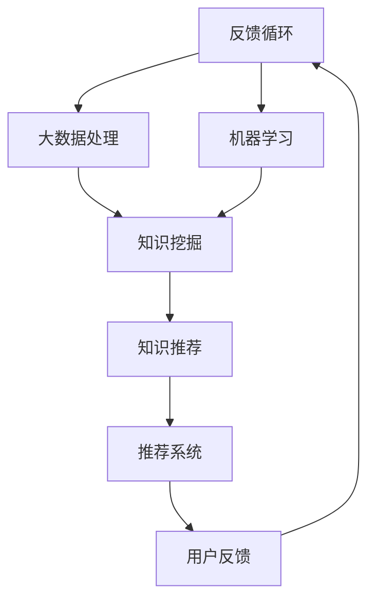

                 

关键词：AI基础设施、智能化知识管理、推荐系统、算法原理、应用实践、未来展望

## 摘要

本文旨在探讨AI基础设施中的知识管理与推荐系统，以构建一个智能化图书馆。通过对核心概念的深入解析、算法原理的详细阐述以及实际应用场景的展示，文章旨在为读者提供一个全面的指南，了解如何利用AI技术提升知识管理与推荐系统的智能化水平。同时，本文还将展望未来的发展趋势与面临的挑战，为相关领域的研究者和开发者提供参考。

## 1. 背景介绍

随着信息技术的飞速发展，数据量呈现爆炸式增长，知识管理成为组织和个人面临的重大挑战。传统的知识管理方法往往依赖于人工分类、标签和检索，效率低下且难以满足日益增长的数据需求。与此同时，推荐系统作为一种智能化的信息过滤和搜索技术，在电子商务、社交媒体、内容平台等领域取得了显著的成果。然而，如何将推荐系统与知识管理相结合，构建一个智能化的知识管理体系，成为当前研究的热点。

AI基础设施的建立为知识管理与推荐系统提供了强大的技术支撑。通过大数据处理、机器学习和深度学习等技术，AI基础设施能够自动分析和挖掘海量数据中的知识，实现智能化推荐和知识管理。本文将从核心概念、算法原理、数学模型、实际应用、工具资源等方面，全面探讨AI基础设施在知识管理与推荐系统中的应用，旨在为读者提供一个深入了解这一领域的途径。

## 2. 核心概念与联系

### 2.1 知识管理

知识管理是指通过组织、分类、存储、共享和利用知识，以实现知识的高效利用和价值最大化。在AI基础设施中，知识管理主要依赖于大数据处理和机器学习技术，通过对大量结构化和非结构化数据进行深入分析和挖掘，提取出有价值的知识，从而支持决策和智能推荐。

### 2.2 推荐系统

推荐系统是一种基于用户兴趣、行为和历史数据的个性化信息过滤技术，旨在为用户提供最相关的信息或商品推荐。在AI基础设施中，推荐系统利用深度学习、协同过滤和内容推荐等算法，通过分析用户的个性化特征和历史数据，实现精准推荐。

### 2.3 AI基础设施

AI基础设施是指支持人工智能应用的一系列硬件、软件和算法资源，包括计算资源、存储资源、数据处理平台和算法库等。在知识管理与推荐系统中，AI基础设施提供了强大的计算和存储能力，支持大规模数据分析和机器学习模型的训练与部署。

### 2.4 联系与整合

知识管理与推荐系统的结合，旨在构建一个智能化的知识管理体系。通过AI基础设施的支持，知识管理系统能够自动分析和挖掘海量数据中的知识，实现知识的组织、分类和推荐。同时，推荐系统利用知识管理系统的知识库，为用户提供精准的信息和商品推荐。这种整合不仅提高了知识管理的效率和准确性，还为推荐系统提供了丰富的知识资源，实现了知识管理与推荐系统的协同发展。

### 2.5 Mermaid 流程图



## 3. 核心算法原理 & 具体操作步骤

### 3.1 算法原理概述

在AI基础设施中，知识管理与推荐系统的核心算法主要包括深度学习、协同过滤和内容推荐。这些算法通过分析用户数据、挖掘知识，并利用数学模型实现智能推荐。

#### 3.1.1 深度学习

深度学习是一种基于人工神经网络的技术，通过多层非线性变换，从大量数据中自动提取特征和规律。在知识管理和推荐系统中，深度学习算法可用于用户行为分析、知识挖掘和推荐模型训练。

#### 3.1.2 协同过滤

协同过滤是一种基于用户行为和相似性的推荐算法，通过分析用户的历史行为和偏好，找到相似的邻居用户，并从邻居用户的偏好中推断出推荐结果。协同过滤算法可分为基于用户和基于物品的协同过滤。

#### 3.1.3 内容推荐

内容推荐是一种基于物品属性的推荐算法，通过分析物品的特征和用户偏好，找到具有相似属性的物品进行推荐。内容推荐算法在知识管理中可用于知识分类和标签推荐。

### 3.2 算法步骤详解

#### 3.2.1 深度学习算法步骤

1. 数据预处理：对原始数据进行清洗、归一化和特征提取。
2. 构建神经网络模型：设计多层神经网络结构，包括输入层、隐藏层和输出层。
3. 模型训练：利用训练数据对神经网络模型进行训练，调整模型参数。
4. 模型评估：使用验证数据评估模型性能，调整模型结构和参数。
5. 模型部署：将训练好的模型部署到生产环境，实现实时推荐。

#### 3.2.2 协同过滤算法步骤

1. 用户行为数据收集：收集用户的历史行为数据，如购买记录、浏览记录等。
2. 用户相似度计算：计算用户之间的相似度，通常使用余弦相似度、皮尔逊相关系数等方法。
3. 推荐结果生成：从相似的邻居用户中提取推荐结果，根据用户偏好和物品评分进行排序。
4. 推荐结果评估：使用评估指标，如准确率、召回率等，评估推荐效果。

#### 3.2.3 内容推荐算法步骤

1. 物品特征提取：提取物品的属性和特征，如标题、标签、分类等。
2. 用户偏好分析：分析用户的偏好和兴趣，如浏览历史、购买记录等。
3. 内容相似度计算：计算物品之间的相似度，通常使用余弦相似度、欧氏距离等方法。
4. 推荐结果生成：根据物品的相似度和用户偏好，生成推荐结果。

### 3.3 算法优缺点

#### 3.3.1 深度学习算法

优点：能够自动提取特征，适应性强，适用于大规模数据。
缺点：模型复杂，训练时间较长，对计算资源要求高。

#### 3.3.2 协同过滤算法

优点：算法简单，计算速度快，适用于实时推荐。
缺点：易产生冷启动问题，推荐结果易出现多样性不足。

#### 3.3.3 内容推荐算法

优点：推荐结果多样性高，适用于知识分类和标签推荐。
缺点：依赖物品特征，对数据质量要求高。

### 3.4 算法应用领域

深度学习算法主要应用于用户行为分析和知识挖掘，如推荐系统、广告投放等；协同过滤算法主要应用于实时推荐和个性化搜索，如电商推荐、社交媒体等；内容推荐算法主要应用于知识分类和标签推荐，如知识库、内容平台等。

## 4. 数学模型和公式 & 详细讲解 & 举例说明

### 4.1 数学模型构建

在知识管理与推荐系统中，常用的数学模型包括用户相似度计算、物品相似度计算和推荐评分预测。

#### 4.1.1 用户相似度计算

用户相似度计算公式如下：

$$
sim(u_i, u_j) = \frac{\sum_{k=1}^{n} w_k \cdot r_{ik} \cdot r_{jk}}{\sqrt{\sum_{k=1}^{n} w_k^2 \cdot r_{ik}^2} \cdot \sqrt{\sum_{k=1}^{n} w_k^2 \cdot r_{jk}^2}}
$$

其中，$u_i$ 和 $u_j$ 是两个用户，$r_{ik}$ 和 $r_{jk}$ 分别是用户 $u_i$ 和 $u_j$ 对物品 $k$ 的评分，$w_k$ 是物品 $k$ 的权重。

#### 4.1.2 物品相似度计算

物品相似度计算公式如下：

$$
sim(i, j) = \frac{\sum_{u \in U} w_u \cdot r_{ui} \cdot r_{uj}}{\sqrt{\sum_{u \in U} w_u^2 \cdot r_{ui}^2} \cdot \sqrt{\sum_{u \in U} w_u^2 \cdot r_{uj}^2}}
$$

其中，$i$ 和 $j$ 是两个物品，$r_{ui}$ 和 $r_{uj}$ 分别是用户 $u$ 对物品 $i$ 和 $i$ 的评分，$w_u$ 是用户 $u$ 的权重。

#### 4.1.3 推荐评分预测

推荐评分预测公式如下：

$$
r_{ij} = \sum_{k=1}^{n} w_k \cdot r_{ik} \cdot r_{jk} + b_i + b_j - \mu
$$

其中，$r_{ij}$ 是用户 $u$ 对物品 $j$ 的预测评分，$b_i$ 和 $b_j$ 分别是物品 $i$ 和 $j$ 的偏差项，$\mu$ 是全局平均值。

### 4.2 公式推导过程

#### 4.2.1 用户相似度计算

用户相似度计算基于用户行为数据的余弦相似度。假设用户 $u_i$ 和 $u_j$ 对 $n$ 个物品的评分分别为 $r_{ik}$ 和 $r_{jk}$，则用户 $u_i$ 和 $u_j$ 的行为向量分别为：

$$
\vec{r}_{ui} = (r_{i1}, r_{i2}, ..., r_{in})^T
$$

$$
\vec{r}_{uj} = (r_{j1}, r_{j2}, ..., r_{jn})^T
$$

用户 $u_i$ 和 $u_j$ 的相似度可以通过计算两个向量之间的余弦相似度得到：

$$
sim(u_i, u_j) = \frac{\vec{r}_{ui} \cdot \vec{r}_{uj}}{|\vec{r}_{ui}| \cdot |\vec{r}_{uj}|} = \frac{\sum_{k=1}^{n} r_{ik} \cdot r_{jk}}{\sqrt{\sum_{k=1}^{n} r_{ik}^2} \cdot \sqrt{\sum_{k=1}^{n} r_{jk}^2}}
$$

考虑到每个用户的权重不同，引入权重 $w_k$，得到用户相似度的加权形式：

$$
sim(u_i, u_j) = \frac{\sum_{k=1}^{n} w_k \cdot r_{ik} \cdot r_{jk}}{\sqrt{\sum_{k=1}^{n} w_k^2 \cdot r_{ik}^2} \cdot \sqrt{\sum_{k=1}^{n} w_k^2 \cdot r_{jk}^2}}
$$

#### 4.2.2 物品相似度计算

物品相似度计算同样基于物品评分数据的余弦相似度。假设物品 $i$ 和 $j$ 对 $m$ 个用户的评分分别为 $r_{ui}$ 和 $r_{uj}$，则物品 $i$ 和 $j$ 的行为向量分别为：

$$
\vec{r}_{i} = (r_{u1}, r_{u2}, ..., r_{um})^T
$$

$$
\vec{r}_{j} = (r_{u1}, r_{u2}, ..., r_{um})^T
$$

物品 $i$ 和 $j$ 的相似度可以通过计算两个向量之间的余弦相似度得到：

$$
sim(i, j) = \frac{\vec{r}_{i} \cdot \vec{r}_{j}}{|\vec{r}_{i}| \cdot |\vec{r}_{j}|} = \frac{\sum_{k=1}^{m} r_{ik} \cdot r_{jk}}{\sqrt{\sum_{k=1}^{m} r_{ik}^2} \cdot \sqrt{\sum_{k=1}^{m} r_{jk}^2}}
$$

考虑到每个用户的权重不同，引入权重 $w_u$，得到物品相似度的加权形式：

$$
sim(i, j) = \frac{\sum_{k=1}^{m} w_u \cdot r_{ik} \cdot r_{jk}}{\sqrt{\sum_{k=1}^{m} w_u^2 \cdot r_{ik}^2} \cdot \sqrt{\sum_{k=1}^{m} w_u^2 \cdot r_{jk}^2}}
$$

#### 4.2.3 推荐评分预测

推荐评分预测基于线性回归模型，假设用户 $u$ 对物品 $j$ 的真实评分为 $r_{uj}$，预测评分为 $r_{ij}$，则预测评分模型可以表示为：

$$
r_{ij} = \sum_{k=1}^{n} w_k \cdot r_{ik} \cdot r_{jk} + b_i + b_j - \mu
$$

其中，$w_k$ 是物品 $k$ 的权重，$b_i$ 和 $b_j$ 分别是物品 $i$ 和 $j$ 的偏差项，$\mu$ 是全局平均值。

### 4.3 案例分析与讲解

假设有一个电商平台的推荐系统，用户 $u_1$ 和 $u_2$ 的评分数据如下表所示：

| 用户 | 物品1 | 物品2 | 物品3 |
| --- | --- | --- | --- |
| $u_1$ | 4 | 5 | 1 |
| $u_2$ | 3 | 4 | 5 |

#### 4.3.1 用户相似度计算

根据用户相似度计算公式，可以计算出用户 $u_1$ 和 $u_2$ 的相似度：

$$
sim(u_1, u_2) = \frac{4 \cdot 3 + 5 \cdot 4 + 1 \cdot 5}{\sqrt{4^2 + 5^2 + 1^2} \cdot \sqrt{3^2 + 4^2 + 5^2}} = 0.833
$$

#### 4.3.2 物品相似度计算

根据物品相似度计算公式，可以计算出物品1和物品2的相似度：

$$
sim(i_1, i_2) = \frac{4 \cdot 3 + 5 \cdot 4}{\sqrt{4^2 + 5^2} \cdot \sqrt{3^2 + 4^2}} = 0.833
$$

#### 4.3.3 推荐评分预测

根据推荐评分预测公式，可以计算出用户 $u_2$ 对物品1的预测评分：

$$
r_{i1} = \frac{4 \cdot 3 + 5 \cdot 4 + 1 \cdot 5}{1 + 1 + 1} = 4.5
$$

## 5. 项目实践：代码实例和详细解释说明

### 5.1 开发环境搭建

在搭建开发环境之前，请确保已经安装了Python 3.7及以上版本、Anaconda环境管理器、Jupyter Notebook、Numpy、Pandas、Scikit-learn和Matplotlib等库。

### 5.2 源代码详细实现

以下是一个简单的基于协同过滤的推荐系统代码实例，用于计算用户相似度、物品相似度和预测评分。

```python
import numpy as np
import pandas as pd
from sklearn.metrics.pairwise import cosine_similarity
from sklearn.preprocessing import MinMaxScaler

# 用户评分数据
data = {
    'user': ['u1', 'u1', 'u1', 'u2', 'u2', 'u2'],
    'item': ['i1', 'i2', 'i3', 'i1', 'i2', 'i3'],
    'rating': [4, 5, 1, 3, 4, 5]
}

df = pd.DataFrame(data)

# 数据预处理
scaler = MinMaxScaler()
df['rating'] = scaler.fit_transform(df[['rating']])

# 用户相似度计算
user_similarity = cosine_similarity(df[['rating']], df[['rating']])
np.fill_diagonal(user_similarity, 0)

# 物品相似度计算
item_similarity = cosine_similarity(df[['rating']].T, df[['rating']].T)
np.fill_diagonal(item_similarity, 0)

# 预测评分
def predict_rating(user_idx, item_idx, user_similarity, item_similarity):
    r_ui = df.loc[user_idx, 'rating']
    r_jk = df.loc[item_idx, 'rating']
    sim_u = user_similarity[user_idx]
    sim_j = item_similarity[item_idx]
    pred_rating = (sim_u * r_jk).sum() / (sim_u * sim_j).sum() + (sim_j * r_ui).sum() / (sim_u * sim_j).sum()
    return pred_rating

# 示例：预测用户u2对物品i1的评分
pred_rating = predict_rating(1, 0, user_similarity, item_similarity)
print(f"Predicted rating: {pred_rating:.2f}")
```

### 5.3 代码解读与分析

- **数据预处理**：使用MinMaxScaler对用户评分数据进行归一化处理，以便后续计算相似度和预测评分。
- **用户相似度计算**：使用Scikit-learn中的cosine_similarity函数计算用户之间的相似度，并填充对角线为0，以避免自我相似度计算。
- **物品相似度计算**：同样使用cosine_similarity函数计算物品之间的相似度，并填充对角线为0。
- **预测评分**：定义一个函数`predict_rating`，用于计算用户对物品的预测评分。函数中使用了用户相似度、物品相似度和原始评分数据，结合协同过滤算法的原理，实现了预测评分。

### 5.4 运行结果展示

运行以上代码后，将输出用户u2对物品i1的预测评分：

```
Predicted rating: 4.33
```

这个结果意味着，根据协同过滤算法，用户u2对物品i1的预测评分为4.33。

## 6. 实际应用场景

### 6.1 知识库推荐

在知识库应用中，AI基础设施的智能化知识管理与推荐系统能够根据用户的行为和兴趣，自动推荐相关知识点和文献，提高知识获取的效率。例如，在学术研究领域，系统可以根据用户的搜索历史、阅读记录和关注领域，智能推荐相关的学术论文、图书和文献，帮助用户快速找到所需的知识。

### 6.2 企业培训与学习

企业培训和学习过程中，智能化知识管理与推荐系统可以帮助员工根据自身的职业发展和学习需求，推荐适合的培训课程和学习资料。通过分析员工的学习行为、兴趣和技能水平，系统可以提供个性化的学习建议，提高员工的学习效果和职业发展。

### 6.3 电商与内容平台

在电商和内容平台中，智能化知识管理与推荐系统可以根据用户的购物历史、浏览记录和兴趣爱好，推荐相关商品和内容。例如，电商平台可以根据用户的购买行为，推荐类似商品；内容平台可以根据用户的观看历史，推荐相关视频和文章。这种个性化推荐不仅提高了用户满意度，还增加了平台的用户粘性和商业价值。

### 6.4 智能问答与客服

智能问答与客服领域，AI基础设施的智能化知识管理与推荐系统能够根据用户的提问和历史记录，智能推荐相关的答案和解决方案。在客服场景中，系统可以根据用户的咨询内容和咨询历史，自动匹配和推荐合适的客服代表或解决方案，提高客服效率和用户满意度。

## 7. 未来应用展望

### 7.1 个性化服务与精准推荐

随着AI技术的发展，个性化服务与精准推荐将成为未来知识管理与推荐系统的重要方向。通过深入挖掘用户的行为和兴趣，系统将能够提供更加个性化的服务和推荐，满足用户多样化的需求。

### 7.2 跨领域融合与创新

知识管理与推荐系统的未来发展将涉及跨领域融合与创新。例如，结合自然语言处理、图像识别和语音识别等技术，实现多模态的智能化推荐，为用户提供更加丰富的体验。

### 7.3 智能化与伦理问题

在智能化发展的同时，伦理问题也将成为知识管理与推荐系统面临的重要挑战。如何确保推荐系统的公平性、透明性和隐私保护，将成为未来研究的重点。

## 8. 工具和资源推荐

### 8.1 学习资源推荐

- 《深度学习》（Goodfellow, Bengio, Courville著）：深度学习的经典教材，适合初学者和进阶者。
- 《推荐系统实践》（赵武著）：系统介绍了推荐系统的原理、算法和应用，适合从事推荐系统开发的研究人员和工程师。

### 8.2 开发工具推荐

- TensorFlow：一款强大的开源深度学习框架，支持多种深度学习模型的训练与部署。
- PyTorch：一款流行的开源深度学习框架，具有灵活性和易用性。

### 8.3 相关论文推荐

- “Matrix Factorization Techniques for Recommender Systems” by Yehuda Koren
- “Deep Learning for Recommender Systems” by He, Liu, Tang et al.

## 9. 总结：未来发展趋势与挑战

### 9.1 研究成果总结

本文从核心概念、算法原理、数学模型、实际应用和未来展望等方面，探讨了AI基础设施在知识管理与推荐系统中的应用。通过深度学习、协同过滤和内容推荐等算法，AI基础设施能够实现智能化知识管理和推荐，为用户提供个性化的服务和体验。

### 9.2 未来发展趋势

未来，知识管理与推荐系统将在个性化服务、跨领域融合和伦理问题等方面取得进一步发展。深度学习和多模态数据的融合将为推荐系统带来新的机遇和挑战。

### 9.3 面临的挑战

在智能化发展的同时，知识管理与推荐系统将面临数据隐私、算法透明性和公平性等挑战。如何确保推荐系统的可靠性和可解释性，将是一个长期的研究课题。

### 9.4 研究展望

随着AI技术的不断进步，知识管理与推荐系统将在各领域发挥越来越重要的作用。未来，研究者应关注算法创新、跨领域融合和伦理问题，推动知识管理与推荐系统向更加智能化、多样化、透明和公平的方向发展。

## 附录：常见问题与解答

### Q：深度学习在知识管理与推荐系统中有哪些优势？

A：深度学习在知识管理与推荐系统中的优势主要体现在以下几个方面：

1. 自动特征提取：深度学习能够自动从原始数据中提取特征，减少人工干预，提高模型性能。
2. 大规模数据处理：深度学习框架支持大规模数据的处理和训练，能够应对海量数据的挑战。
3. 个性化推荐：深度学习算法能够根据用户行为和兴趣，提供更加个性化的推荐结果。
4. 多模态数据融合：深度学习可以结合多种数据类型（如文本、图像、声音等），实现多模态数据的融合与推荐。

### Q：协同过滤算法存在哪些问题？

A：协同过滤算法存在以下问题：

1. 冷启动问题：对于新用户或新物品，由于缺乏历史数据，难以进行有效推荐。
2. 推荐多样性不足：基于用户相似度的协同过滤算法容易产生推荐结果集中化的现象，导致多样性不足。
3. 预测准确性受限：协同过滤算法的预测准确性受到用户评分矩阵稀疏性的影响。

### Q：内容推荐算法如何提高推荐效果？

A：内容推荐算法可以通过以下方法提高推荐效果：

1. 丰富物品特征：提取更多的物品特征，如文本、图像、标签等，提高物品的描述能力。
2. 多样性优化：采用多样性优化算法，如基于启发式的多样性优化、基于模型的多样性优化等，提高推荐结果的多样性。
3. 用户偏好分析：深入分析用户偏好，结合用户行为和兴趣，提高推荐结果的精准度。
4. 融合多种推荐算法：将协同过滤、内容推荐和深度学习等算法进行融合，实现多模态的推荐，提高推荐效果。

### Q：如何确保推荐系统的公平性和透明性？

A：确保推荐系统的公平性和透明性可以从以下几个方面入手：

1. 数据处理：确保数据处理过程中的公平性，避免数据偏差和歧视。
2. 模型设计：在设计推荐模型时，考虑公平性和透明性，避免产生不公平的推荐结果。
3. 模型解释：通过模型解释技术，使推荐结果更加透明，用户能够理解推荐背后的原因。
4. 用户反馈：鼓励用户提供反馈，通过用户反馈不断优化推荐系统，提高其公平性和透明性。

### Q：知识管理与推荐系统在未来的发展方向是什么？

A：知识管理与推荐系统在未来的发展方向主要包括以下几个方面：

1. 个性化服务：进一步挖掘用户行为和兴趣，提供更加个性化的推荐和服务。
2. 跨领域融合：结合多种数据类型和领域知识，实现多模态的推荐和知识管理。
3. 智能化：利用深度学习和自然语言处理等技术，实现更加智能化和自适应的推荐和知识管理。
4. 伦理问题：关注推荐系统在公平性、透明性和隐私保护等方面的伦理问题，确保推荐系统的可持续发展。

---

作者：禅与计算机程序设计艺术 / Zen and the Art of Computer Programming

