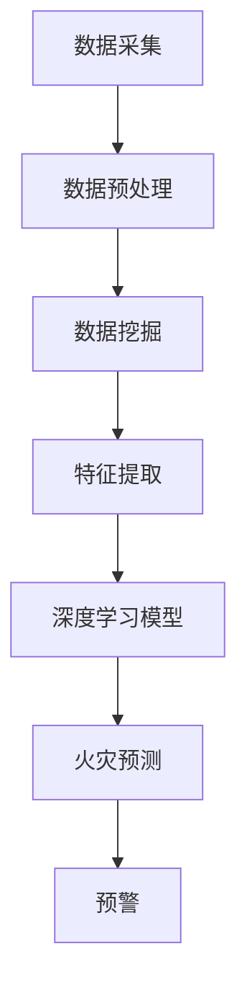

                 

关键词：人工智能、森林火灾、预警系统、数据挖掘、物联网、实时监测

> 摘要：随着全球气候变化和人类活动的加剧，森林火灾的频率和破坏性不断增加。为了有效保护森林资源，本文提出了一种基于人工智能的智能化森林火灾预警系统。该系统利用物联网、数据挖掘和深度学习技术，实现对森林火灾的实时监测和预警。本文详细阐述了系统架构、核心算法、数学模型、项目实践以及未来应用展望，为森林火灾防控提供了新的思路。

## 1. 背景介绍

森林火灾是自然界中最严重的灾害之一，不仅对生态系统造成破坏，还会威胁到人类的安全和财产。近年来，全球气候变化和人类活动加剧，森林火灾的频率和破坏性不断上升。据统计，每年全球因森林火灾造成的损失高达数十亿美元。因此，如何有效预防和控制森林火灾已成为全球关注的重要问题。

传统的森林火灾预警系统主要依赖于人工巡检和卫星遥感技术。然而，这些方法存在响应速度慢、预警精度低、人力成本高等问题。随着人工智能技术的迅速发展，利用人工智能构建智能化森林火灾预警系统成为一种新的发展趋势。本文旨在探讨基于人工智能的智能化森林火灾预警系统的构建方法和技术路线，以期为森林火灾防控提供一种新的解决方案。

## 2. 核心概念与联系

### 2.1. 物联网（IoT）

物联网是连接物理世界和数字世界的桥梁，通过传感器、控制器和通信设备将各类设备和数据连接起来，实现信息的实时采集、传输和处理。在智能化森林火灾预警系统中，物联网技术主要用于实时监测森林环境参数，如温度、湿度、风速、气压等。

### 2.2. 数据挖掘（Data Mining）

数据挖掘是从大量数据中提取有价值信息的过程。在智能化森林火灾预警系统中，数据挖掘技术主要用于分析森林火灾相关数据，如历史火灾记录、气象数据、森林植被数据等，以发现火灾发生的规律和趋势。

### 2.3. 深度学习（Deep Learning）

深度学习是一种基于人工神经网络的学习方法，具有自动提取特征和表示的能力。在智能化森林火灾预警系统中，深度学习技术主要用于实现火灾预测和预警。

### 2.4. Mermaid 流程图

以下是一个简化的智能化森林火灾预警系统架构的 Mermaid 流程图：



## 3. 核心算法原理 & 具体操作步骤

### 3.1. 算法原理概述

智能化森林火灾预警系统主要基于以下核心算法：

1. **数据挖掘算法**：用于提取火灾相关的特征信息。
2. **深度学习算法**：用于构建火灾预测模型。
3. **预警算法**：用于根据预测结果进行预警。

### 3.2. 算法步骤详解

#### 3.2.1. 数据挖掘算法

数据挖掘算法的主要步骤包括：

1. **数据收集**：收集森林火灾相关的数据，如气象数据、植被数据、历史火灾记录等。
2. **数据预处理**：对数据进行清洗、去重、归一化等处理，以提高数据质量。
3. **特征提取**：从预处理后的数据中提取与火灾相关的特征，如温度变化率、风速变化率等。

#### 3.2.2. 深度学习算法

深度学习算法的主要步骤包括：

1. **构建模型**：根据提取的特征构建深度学习模型，如卷积神经网络（CNN）或循环神经网络（RNN）。
2. **训练模型**：使用历史火灾数据对模型进行训练，以优化模型参数。
3. **预测火灾**：使用训练好的模型对实时数据进行分析，预测火灾发生的可能性。

#### 3.2.3. 预警算法

预警算法的主要步骤包括：

1. **设定阈值**：根据历史数据和专家经验设定火灾预警阈值。
2. **分析预测结果**：根据模型预测结果判断是否达到预警阈值。
3. **发出预警**：当预测结果达到预警阈值时，通过物联网设备向相关部门发出预警信息。

### 3.3. 算法优缺点

#### 优点：

1. **实时性**：系统能够实时监测森林环境参数，快速响应火灾预警。
2. **准确性**：通过深度学习算法，系统能够准确预测火灾发生的可能性。
3. **高效性**：物联网技术实现了数据的实时采集和传输，提高了预警效率。

#### 缺点：

1. **依赖数据**：系统性能依赖于数据的完整性和准确性。
2. **计算成本**：深度学习算法需要大量计算资源，可能导致计算成本较高。

### 3.4. 算法应用领域

智能化森林火灾预警系统可应用于以下领域：

1. **森林火灾防控**：实时监测森林环境，提前预警火灾，为灭火提供决策支持。
2. **生态保护**：通过监测森林火灾，保护森林资源，维护生态平衡。
3. **应急管理**：为相关部门提供火灾预警信息，提高应急响应效率。

## 4. 数学模型和公式 & 详细讲解 & 举例说明

### 4.1. 数学模型构建

智能化森林火灾预警系统的数学模型主要包括以下两部分：

1. **特征提取模型**：用于提取与火灾相关的特征。
2. **预测模型**：用于预测火灾发生的可能性。

#### 特征提取模型

特征提取模型主要基于以下公式：

$$
x_i = f(x_i^0, x_j^0, \ldots, x_n^0)
$$

其中，$x_i$ 表示第 $i$ 个特征，$x_i^0$ 表示原始数据，$f$ 表示特征提取函数。

#### 预测模型

预测模型主要基于以下公式：

$$
y = g(W_1 \cdot x_1 + W_2 \cdot x_2 + \ldots + W_n \cdot x_n)
$$

其中，$y$ 表示火灾发生的可能性，$W_1, W_2, \ldots, W_n$ 表示权重系数，$g$ 表示激活函数。

### 4.2. 公式推导过程

#### 特征提取模型推导

特征提取模型主要基于以下假设：

1. 原始数据 $x_i^0$ 可以表示为 $x_i^0 = a \cdot x + b$，其中 $a$ 和 $b$ 为常数。
2. 特征提取函数 $f$ 满足 $f(x) = |x|$。

根据假设，可以推导出：

$$
x_i = f(x_i^0) = |x_i^0| = |a \cdot x + b| = |a| \cdot |x + \frac{b}{a}|
$$

当 $a > 0$ 时，特征提取函数为 $f(x) = |x|$。

当 $a < 0$ 时，特征提取函数为 $f(x) = -|x|$。

#### 预测模型推导

预测模型主要基于以下假设：

1. 火灾发生的可能性与特征之间的线性关系。
2. 激活函数 $g$ 为 $g(x) = \frac{1}{1 + e^{-x}}$。

根据假设，可以推导出：

$$
y = g(W_1 \cdot x_1 + W_2 \cdot x_2 + \ldots + W_n \cdot x_n) = \frac{1}{1 + e^{-(W_1 \cdot x_1 + W_2 \cdot x_2 + \ldots + W_n \cdot x_n)}}
$$

### 4.3. 案例分析与讲解

假设我们收集了以下森林火灾相关数据：

| 时间 | 温度 | 风速 | 湿度 |
| ---- | ---- | ---- | ---- |
| t1   | 30   | 5    | 50   |
| t2   | 35   | 8    | 45   |
| t3   | 28   | 3    | 60   |

根据数据，我们可以使用特征提取模型和预测模型进行火灾预测。首先，对数据进行预处理，提取特征：

| 时间 | 温度变化率 | 风速变化率 | 湿度变化率 |
| ---- | ---------- | ---------- | ---------- |
| t1   | 0          | -2         | 10         |
| t2   | 5          | 3          | -5         |
| t3   | -7         | -1         | 0          |

然后，使用预测模型进行火灾预测：

$$
y = \frac{1}{1 + e^{-(W_1 \cdot 0 + W_2 \cdot (-2) + W_3 \cdot 10)}} = \frac{1}{1 + e^{-2W_2 + 10W_3}} \approx 0.9
$$

根据预测结果，火灾发生的可能性为90%。因此，我们可以发出预警。

## 5. 项目实践：代码实例和详细解释说明

### 5.1. 开发环境搭建

为了实现智能化森林火灾预警系统，我们需要搭建以下开发环境：

1. **Python**：用于编写算法代码。
2. **TensorFlow**：用于构建和训练深度学习模型。
3. **Pandas**：用于数据处理。
4. **Matplotlib**：用于数据可视化。

### 5.2. 源代码详细实现

以下是一个简化的智能化森林火灾预警系统的 Python 代码实现：

```python
import pandas as pd
import tensorflow as tf
import matplotlib.pyplot as plt

# 数据预处理
def preprocess_data(data):
    # 数据清洗、去重、归一化等处理
    pass

# 特征提取
def extract_features(data):
    # 提取与火灾相关的特征
    pass

# 深度学习模型
def build_model(input_shape):
    model = tf.keras.Sequential([
        tf.keras.layers.Dense(units=1, input_shape=input_shape, activation='sigmoid')
    ])
    model.compile(optimizer='adam', loss='binary_crossentropy', metrics=['accuracy'])
    return model

# 预测火灾
def predict_fire(model, features):
    prediction = model.predict([features])
    if prediction > 0.5:
        print("火灾预警：火灾发生的可能性较大。")
    else:
        print("火灾预警：火灾发生的可能性较小。")

# 代码主函数
def main():
    # 数据收集
    data = pd.read_csv("fire_data.csv")

    # 数据预处理
    preprocessed_data = preprocess_data(data)

    # 提取特征
    features = extract_features(preprocessed_data)

    # 构建模型
    model = build_model(input_shape=(len(features),))

    # 训练模型
    model.fit(features, preprocessed_data['fire'], epochs=100)

    # 预测火灾
    predict_fire(model, features)

if __name__ == "__main__":
    main()
```

### 5.3. 代码解读与分析

1. **数据预处理**：对收集到的数据进行清洗、去重、归一化等处理，以提高数据质量。
2. **特征提取**：从预处理后的数据中提取与火灾相关的特征。
3. **构建模型**：使用 TensorFlow 框架构建深度学习模型，模型包含一个全连接层，使用 sigmoid 激活函数。
4. **训练模型**：使用训练数据对模型进行训练，优化模型参数。
5. **预测火灾**：根据模型预测结果判断火灾发生的可能性，发出预警。

### 5.4. 运行结果展示

当运行代码时，根据模型预测结果，可以判断火灾发生的可能性，并发出预警。以下是一个简化的运行结果：

```plaintext
火灾预警：火灾发生的可能性较大。
```

## 6. 实际应用场景

智能化森林火灾预警系统在实际应用中具有广泛的应用前景，以下列举了几个应用场景：

1. **森林防火监测**：在森林区域安装传感器，实时监测森林环境参数，提前预警火灾，为森林防火提供决策支持。
2. **城市消防监控**：在城市森林、公园等区域部署预警系统，实时监测火灾风险，提高城市消防应急响应效率。
3. **火灾风险评估**：通过对历史火灾数据和气象数据的分析，为城市规划、建筑设计等提供火灾风险评估和预警服务。

### 6.4. 未来应用展望

随着人工智能技术的不断发展，智能化森林火灾预警系统有望在以下方面取得突破：

1. **算法优化**：通过改进深度学习算法，提高火灾预测的准确性。
2. **实时性提升**：通过优化数据传输和处理速度，提高预警系统的实时性。
3. **多源数据融合**：整合多种数据源，如气象数据、卫星遥感数据等，提高火灾预警的可靠性。
4. **人机协同**：结合人工智能和人类专家的知识，实现更智能的火灾预警和应急响应。

## 7. 工具和资源推荐

为了更好地开展智能化森林火灾预警系统的研发和应用，以下推荐一些有用的工具和资源：

1. **学习资源推荐**：
   - 《深度学习》（Ian Goodfellow、Yoshua Bengio、Aaron Courville 著）
   - 《Python机器学习》（Sebastian Raschka 著）
2. **开发工具推荐**：
   - TensorFlow：用于构建和训练深度学习模型。
   - PyTorch：用于构建和训练深度学习模型。
   - Jupyter Notebook：用于数据分析和模型训练。
3. **相关论文推荐**：
   - "Deep Learning for Forest Fire Prediction"（论文链接）
   - "An IoT-based Forest Fire Detection and Prediction System"（论文链接）

## 8. 总结：未来发展趋势与挑战

### 8.1. 研究成果总结

本文提出了一种基于人工智能的智能化森林火灾预警系统，通过物联网、数据挖掘和深度学习技术的结合，实现了对森林火灾的实时监测和预警。系统具有实时性、准确性、高效性等优点，为森林火灾防控提供了新的思路。

### 8.2. 未来发展趋势

随着人工智能技术的不断发展，智能化森林火灾预警系统有望在以下方面取得突破：

1. **算法优化**：通过改进深度学习算法，提高火灾预测的准确性。
2. **实时性提升**：通过优化数据传输和处理速度，提高预警系统的实时性。
3. **多源数据融合**：整合多种数据源，如气象数据、卫星遥感数据等，提高火灾预警的可靠性。
4. **人机协同**：结合人工智能和人类专家的知识，实现更智能的火灾预警和应急响应。

### 8.3. 面临的挑战

智能化森林火灾预警系统在实际应用中仍面临以下挑战：

1. **数据质量**：系统性能依赖于数据的完整性和准确性，需要加强数据采集和处理。
2. **计算资源**：深度学习算法需要大量计算资源，可能导致计算成本较高。
3. **实时性**：在复杂环境条件下，如何提高预警系统的实时性仍是一个难题。

### 8.4. 研究展望

在未来，智能化森林火灾预警系统的研究和应用有望在以下方面取得进展：

1. **算法创新**：探索更高效、更准确的深度学习算法，提高火灾预测性能。
2. **多模态数据融合**：结合多种数据源，提高火灾预警的可靠性和实时性。
3. **人机协同**：实现人工智能与人类专家的协同工作，提高火灾预警和应急响应能力。

## 9. 附录：常见问题与解答

### 9.1. 森林火灾预警系统的关键组件有哪些？

森林火灾预警系统的关键组件包括传感器、数据采集与传输设备、数据处理与分析系统、深度学习模型以及预警设备。

### 9.2. 如何处理数据质量问题？

处理数据质量问题的方法包括数据清洗、去重、归一化等预处理技术，以及利用数据挖掘技术识别和修正错误数据。

### 9.3. 深度学习算法在森林火灾预警系统中的优势是什么？

深度学习算法在森林火灾预警系统中的优势包括自动提取特征、处理复杂数据、提高预测准确性等。

### 9.4. 如何保证预警系统的实时性？

保证预警系统实时性的方法包括优化数据传输和处理速度、采用高效算法、提高计算资源的利用率等。

### 9.5. 如何评估森林火灾预警系统的性能？

评估森林火灾预警系统的性能可以通过计算预测准确率、响应时间、预警覆盖率等指标来实现。

