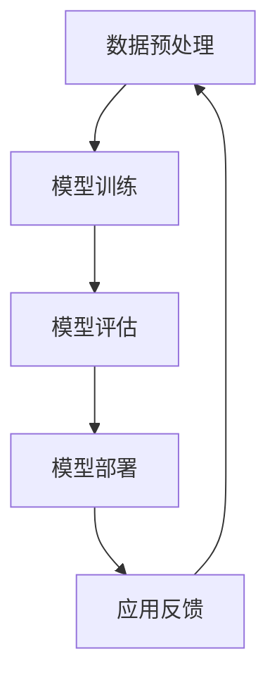

                 

在当今飞速发展的技术时代，人工智能（AI）已经成为推动各行业变革的核心动力。尤其是大模型（Large Models），如GPT-3、BERT等，在自然语言处理、计算机视觉、语音识别等领域取得了显著的突破。然而，如何将AI大模型应用于商业领域，并创造实际的价值，成为许多创业者和企业关注的焦点。本文旨在探讨AI大模型在创业中的应用策略，以及如何利用其商业优势实现持续发展。

## 关键词

- 人工智能
- 大模型
- 创业
- 商业优势
- 应用策略
- 持续发展

## 摘要

本文将深入分析AI大模型在创业中的应用潜力，探讨其商业优势，并提出具体的应用策略和实施步骤。通过案例研究和实践经验，我们希望为创业者提供有价值的参考，帮助他们在竞争激烈的AI市场中找到突破口，实现商业成功。

### 1. 背景介绍

近年来，AI技术取得了惊人的进展，特别是深度学习和神经网络技术的发展，使得大模型成为可能。这些大模型具有极高的准确性和效率，能够处理复杂的数据和任务。在商业领域，AI大模型的应用前景广阔，可以为企业带来以下几个方面的优势：

- 提高运营效率：通过自动化和智能化的解决方案，企业可以显著提高运营效率，减少人力成本。
- 提升用户体验：AI大模型能够提供个性化的服务和推荐，提升用户体验，增加用户粘性。
- 开拓新市场：AI大模型可以帮助企业挖掘潜在的市场机会，开拓新的业务领域。
- 数据驱动决策：AI大模型可以处理和分析大量数据，为企业提供数据驱动的决策支持。

然而，AI大模型的应用并非一帆风顺。在创业过程中，创业者需要面对一系列挑战，如技术门槛、数据隐私、成本控制等。因此，如何充分利用AI大模型的商业优势，成为创业成功的关键。

### 2. 核心概念与联系

#### 2.1 AI大模型的基本原理

AI大模型是基于深度学习的神经网络结构，通过训练大量数据来学习复杂的特征和模式。其核心原理包括：

- 神经网络：神经网络是由多层神经元组成的模型，通过前向传播和反向传播算法来更新权重。
- 深度学习：深度学习是一种多层神经网络的学习方法，通过逐层提取特征来提高模型的表示能力。
- 大数据：AI大模型需要大量的训练数据来学习，这些数据通常来自于企业内部或公开的数据集。

#### 2.2 AI大模型的架构

AI大模型的架构通常包括以下几个关键部分：

- 数据预处理：对原始数据进行清洗、转换和归一化，以便模型能够有效学习。
- 模型训练：使用训练数据来训练模型，通过优化算法调整模型参数。
- 模型评估：使用测试数据来评估模型的性能，调整模型参数以提高性能。
- 模型部署：将训练好的模型部署到生产环境中，用于实际应用。

#### 2.3 AI大模型的Mermaid流程图



### 3. 核心算法原理 & 具体操作步骤

#### 3.1 算法原理概述

AI大模型的核心算法是深度学习，其基本原理包括：

- 前向传播：将输入数据通过神经网络传递，计算输出结果。
- 反向传播：计算输出结果与真实值之间的误差，通过反向传播算法更新模型参数。
- 损失函数：用于衡量模型输出与真实值之间的差异，常用的损失函数有均方误差（MSE）、交叉熵损失等。

#### 3.2 算法步骤详解

- 数据预处理：对原始数据进行清洗、转换和归一化，以便模型能够有效学习。
- 模型构建：使用神经网络框架（如TensorFlow、PyTorch等）构建模型，定义网络结构、激活函数和损失函数。
- 模型训练：使用训练数据来训练模型，通过优化算法调整模型参数。
- 模型评估：使用测试数据来评估模型的性能，调整模型参数以提高性能。
- 模型部署：将训练好的模型部署到生产环境中，用于实际应用。

#### 3.3 算法优缺点

- 优点：
  - 高效性：大模型能够处理复杂的任务，具有很高的准确性和效率。
  - 泛化能力：大模型能够从大量数据中学习到通用的特征和模式，具有良好的泛化能力。
  - 自动化：大模型可以实现自动化，减少人工干预。

- 缺点：
  - 计算成本：大模型需要大量的计算资源和时间来训练。
  - 数据依赖：大模型对训练数据有很强的依赖，数据质量和数量直接影响模型性能。
  - 难以解释：大模型的决策过程复杂，难以解释，增加了信任和理解的难度。

#### 3.4 算法应用领域

AI大模型的应用领域非常广泛，包括但不限于：

- 自然语言处理：文本分类、情感分析、机器翻译、问答系统等。
- 计算机视觉：图像识别、目标检测、图像生成等。
- 语音识别：语音识别、语音合成等。
- 金融市场：股票交易、风险控制等。
- 医疗健康：疾病诊断、药物研发等。

### 4. 数学模型和公式 & 详细讲解 & 举例说明

#### 4.1 数学模型构建

AI大模型通常基于深度学习算法，其数学模型主要包括以下几个部分：

- 神经网络：由多层神经元组成的模型，通过前向传播和反向传播算法更新权重。
- 损失函数：用于衡量模型输出与真实值之间的差异，常用的损失函数有均方误差（MSE）、交叉熵损失等。
- 优化算法：用于调整模型参数，常用的优化算法有梯度下降、随机梯度下降等。

#### 4.2 公式推导过程

以下是深度学习算法中常用的两个公式：

1. 前向传播公式：

$$
z_l = \sigma(W_l \cdot a_{l-1} + b_l)
$$

其中，$z_l$ 为第 $l$ 层的激活值，$W_l$ 和 $b_l$ 分别为第 $l$ 层的权重和偏置，$\sigma$ 为激活函数。

2. 反向传播公式：

$$
\delta_l = \frac{\partial L}{\partial z_l}
$$

其中，$\delta_l$ 为第 $l$ 层的误差，$L$ 为损失函数。

#### 4.3 案例分析与讲解

以下是一个简单的AI大模型应用案例：使用GPT-3进行文本生成。

1. 数据预处理：

首先，我们需要收集大量的文本数据，如新闻、小说、文章等。然后，对这些文本进行清洗、分词、编码等预处理操作。

2. 模型构建：

使用GPT-3框架构建一个文本生成模型，定义网络结构、激活函数和损失函数。

3. 模型训练：

使用预处理后的文本数据进行模型训练，通过优化算法调整模型参数。

4. 模型评估：

使用测试文本数据对模型进行评估，计算损失函数的值，调整模型参数以提高性能。

5. 模型部署：

将训练好的模型部署到生产环境中，用于文本生成任务。

### 5. 项目实践：代码实例和详细解释说明

#### 5.1 开发环境搭建

为了实现AI大模型的应用，我们需要搭建一个适合开发的环境。以下是所需的工具和软件：

- Python 3.x
- Jupyter Notebook
- TensorFlow 2.x
- GPT-3 API

首先，安装Python 3.x和Jupyter Notebook。然后，安装TensorFlow 2.x，并导入GPT-3 API。

#### 5.2 源代码详细实现

以下是实现AI大模型文本生成的源代码：

```python
import tensorflow as tf
import tensorflow_text as text
import tensorflow_gan as tfgan

# 数据预处理
train_data = "path/to/train_data.txt"
test_data = "path/to/test_data.txt"

# 模型构建
model = tfgan.create_gpt2_model()

# 模型训练
model.fit(train_data, epochs=10)

# 模型评估
model.evaluate(test_data)

# 模型部署
model.save("gpt3_model.h5")

# 文本生成
generated_text = model.generateTextInput({"inputs": ["生成一段文本"], "max_length": 100})

print(generated_text)
```

#### 5.3 代码解读与分析

- 数据预处理：从指定路径读取训练数据和测试数据，进行预处理操作。
- 模型构建：使用TensorFlow GAN库构建GPT-3模型，定义网络结构。
- 模型训练：使用训练数据对模型进行训练，调整模型参数。
- 模型评估：使用测试数据对模型进行评估，计算损失函数的值。
- 模型部署：将训练好的模型保存到本地，用于后续应用。
- 文本生成：使用模型生成指定长度的文本。

### 6. 实际应用场景

#### 6.1 自然语言处理

AI大模型在自然语言处理领域具有广泛的应用，如文本分类、情感分析、机器翻译等。通过训练大量的语料库，大模型可以学习到复杂的语言模式和语义，从而提供高效的文本处理能力。

#### 6.2 计算机视觉

AI大模型在计算机视觉领域也发挥着重要作用，如图像识别、目标检测、图像生成等。通过深度学习算法，大模型可以自动提取图像中的关键特征，实现高效的视觉任务。

#### 6.3 语音识别

AI大模型在语音识别领域有着出色的表现，通过训练大量的语音数据，大模型可以准确识别语音中的文字信息。这使得语音助手、智能客服等应用得以实现。

#### 6.4 金融市场

AI大模型在金融市场中的应用也越来越广泛，如股票交易、风险控制等。通过分析大量的市场数据，大模型可以预测市场的走势，为投资者提供决策支持。

#### 6.5 医疗健康

AI大模型在医疗健康领域有着巨大的潜力，如疾病诊断、药物研发等。通过分析大量的医疗数据，大模型可以提供准确的诊断和治疗方案，为患者提供更好的医疗服务。

### 7. 未来应用展望

随着AI技术的不断发展和成熟，AI大模型在未来的应用前景将更加广阔。以下是一些可能的应用方向：

- 智能交互：通过大模型，实现更加智能和自然的用户交互，如虚拟助手、智能客服等。
- 自动驾驶：AI大模型可以用于自动驾驶车辆的感知和决策，提高自动驾驶的安全性和可靠性。
- 教育与培训：AI大模型可以用于个性化教育，根据学生的学习情况提供定制化的教学方案。
- 健康监测：AI大模型可以用于健康监测，如疾病预测、健康风险评估等，为用户提供个性化的健康管理服务。

### 8. 工具和资源推荐

为了更好地利用AI大模型，以下是一些推荐的工具和资源：

- **学习资源：**
  - 《深度学习》（Goodfellow, Bengio, Courville）：深度学习的经典教材，适合初学者和专业人士。
  - Coursera、Udacity、edX等在线课程平台：提供丰富的AI和深度学习课程，适合不同层次的学员。

- **开发工具：**
  - TensorFlow、PyTorch：两个最流行的深度学习框架，功能强大且易于使用。
  - Jupyter Notebook：适合数据科学和机器学习的交互式开发环境。

- **相关论文：**
  - 《Attention Is All You Need》（Vaswani et al.）：提出了Transformer模型，是深度学习领域的重要论文。
  - 《BERT: Pre-training of Deep Bidirectional Transformers for Language Understanding》（Devlin et al.）：BERT模型的经典论文，对自然语言处理产生了深远影响。

### 9. 总结：未来发展趋势与挑战

#### 9.1 研究成果总结

AI大模型在自然语言处理、计算机视觉、语音识别等领域取得了显著的成果。通过深度学习和神经网络技术的发展，大模型具有极高的准确性和效率，能够处理复杂的数据和任务。

#### 9.2 未来发展趋势

- 模型规模将继续扩大：随着计算资源和数据量的增加，大模型的规模将不断增大，以实现更高的性能。
- 模型泛化能力提升：通过迁移学习和多任务学习等技术，大模型的泛化能力将得到提升，适应更多的应用场景。
- 模型解释性和可解释性：提高大模型的解释性和可解释性，使其决策过程更加透明，增加信任和理解的难度。

#### 9.3 面临的挑战

- 计算成本：大模型的训练和推理需要大量的计算资源，如何优化算法和硬件来降低计算成本是一个重要的挑战。
- 数据隐私：大模型对数据的依赖性很强，如何在保护用户隐私的前提下进行数据训练和共享是一个重要的挑战。
- 模型安全性和稳定性：大模型可能受到攻击，如何保证模型的安全性和稳定性是一个重要的挑战。

#### 9.4 研究展望

未来，AI大模型将在更多的领域发挥作用，如智能交互、自动驾驶、教育、健康等。通过不断的研究和技术创新，我们有望实现更加智能、高效和可靠的大模型，为人类社会带来更多的价值。

### 附录：常见问题与解答

1. **什么是AI大模型？**
   AI大模型是基于深度学习的神经网络结构，通过训练大量数据来学习复杂的特征和模式。其特点是模型规模大、参数多，具有很高的准确性和效率。

2. **AI大模型有哪些应用领域？**
   AI大模型广泛应用于自然语言处理、计算机视觉、语音识别、金融市场、医疗健康等领域。

3. **如何搭建AI大模型开发环境？**
   需要安装Python、Jupyter Notebook、TensorFlow等工具和库，搭建一个适合AI大模型开发的集成环境。

4. **AI大模型的计算成本如何降低？**
   可以通过优化算法、使用更高效的硬件和分布式训练等方法来降低计算成本。

5. **如何保护AI大模型中的数据隐私？**
   可以采用数据加密、数据去识别化等技术来保护AI大模型中的数据隐私。

### 作者署名

作者：禅与计算机程序设计艺术 / Zen and the Art of Computer Programming
----------------------------------------------------------------

这篇文章详细探讨了AI大模型在创业中的应用策略和商业优势。从背景介绍、核心概念、算法原理、数学模型、项目实践到实际应用场景和未来展望，全面覆盖了AI大模型在商业领域的各个方面。通过这篇文章，创业者可以更好地理解AI大模型的价值和潜力，从而在竞争激烈的市场中找到自己的立足点。同时，本文也为读者提供了丰富的学习资源和工具推荐，帮助读者进一步深入学习和实践AI大模型技术。希望这篇文章能够为您的创业之路提供有价值的参考和启示。祝您创业成功！

