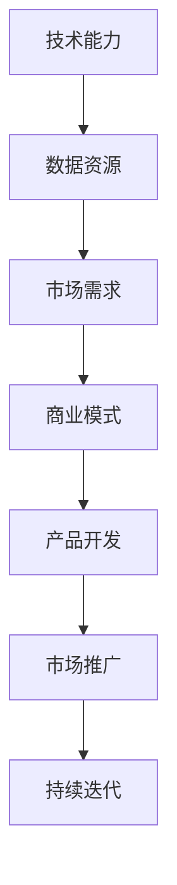

                 

关键词：人工智能、大模型、创业、技术优势、商业模式、创新应用

> 摘要：本文探讨了人工智能大模型在创业中的应用及其技术优势，分析了大模型创业的关键要素，提供了详细的开发指导，并对未来的发展趋势与挑战进行了展望。

## 1. 背景介绍

在当今快速发展的科技时代，人工智能（AI）已成为推动社会进步和经济发展的关键动力。随着计算能力的提升和大数据的积累，人工智能大模型（如GPT-3、BERT等）取得了显著的突破，这些大模型在语言理解、图像识别、自然语言生成等方面展现出了惊人的能力。因此，利用人工智能大模型进行创业，成为越来越多创业者的选择。

大模型创业不仅需要强大的技术支持，还需要明确的商业方向和创新的商业模式。本文将围绕如何利用人工智能大模型的技术优势进行创业，详细探讨核心概念、算法原理、项目实践以及未来展望。

## 2. 核心概念与联系

### 2.1 人工智能大模型概述

人工智能大模型是指通过深度学习训练得到的大型神经网络模型，具有处理大规模数据和高复杂度任务的能力。它们通常通过大量的训练数据和强大的计算资源进行训练，以实现高度泛化的学习能力。


### 2.2 大模型创业关键要素

- **技术能力**：具备强大的算法研发和工程实现能力，能够搭建和优化大模型。
- **数据资源**：获取和处理大量高质量的数据，以支持大模型的训练和测试。
- **市场需求**：明确目标用户群体和市场需求，确保创业项目具有商业价值。
- **商业模式**：构建创新的商业模式，实现盈利和可持续发展。

### 2.3 Mermaid 流程图



## 3. 核心算法原理 & 具体操作步骤

### 3.1 算法原理概述

人工智能大模型的算法原理主要基于深度学习和神经网络。深度学习通过多层神经网络对数据进行特征提取和学习，从而实现复杂任务的自动化处理。神经网络包括输入层、隐藏层和输出层，通过反向传播算法不断调整网络权重，以达到最优性能。

### 3.2 算法步骤详解

1. **数据预处理**：清洗和整理数据，进行数据增强和预处理，以适应大模型的训练需求。
2. **模型选择**：根据任务需求选择合适的大模型架构，如GPT-3、BERT等。
3. **模型训练**：利用大规模计算资源对模型进行训练，通过不断调整网络权重，优化模型性能。
4. **模型评估**：使用验证集对模型进行评估，确保模型在未知数据上的泛化能力。
5. **模型部署**：将训练好的模型部署到实际应用场景，如自然语言处理、图像识别等。

### 3.3 算法优缺点

**优点**：
- **强大的处理能力**：大模型能够处理复杂的任务，具有高度泛化的学习能力。
- **自动特征提取**：大模型能够自动从数据中提取特征，减少人工特征工程的工作量。
- **高效的推理能力**：大模型在推理时具有高效的计算性能，能够快速响应。

**缺点**：
- **计算资源需求大**：大模型训练和推理需要大量的计算资源和时间。
- **数据需求高**：大模型训练需要大量高质量的数据，数据获取和处理成本较高。

### 3.4 算法应用领域

大模型在众多领域都有广泛的应用，如自然语言处理、图像识别、推荐系统、自动驾驶等。以下是几个典型的应用场景：

- **自然语言处理**：利用大模型进行文本分类、情感分析、机器翻译等任务。
- **图像识别**：通过大模型实现物体检测、人脸识别、图像生成等应用。
- **推荐系统**：利用大模型进行用户兴趣分析、商品推荐等任务。
- **自动驾驶**：通过大模型实现自动驾驶车辆的环境感知和决策控制。

## 4. 数学模型和公式 & 详细讲解 & 举例说明

### 4.1 数学模型构建

大模型的数学模型通常是基于神经网络架构，其中核心部分是权重矩阵和激活函数。以下是一个简单的神经网络模型：

\[ f(x) = \sigma(\text{W}^T \text{X} + b) \]

其中，\( f(x) \) 是输出，\( \sigma \) 是激活函数，\( \text{W} \) 是权重矩阵，\( \text{X} \) 是输入特征，\( b \) 是偏置。

### 4.2 公式推导过程

在训练神经网络时，我们使用反向传播算法来优化模型权重。以下是基本的反向传播公式推导：

1. **前向传播**：
\[ \text{Z} = \text{W}^T \text{X} + b \]
\[ \text{A} = \sigma(\text{Z}) \]

2. **计算误差**：
\[ \text{E} = \frac{1}{2} \sum_{i} (\text{Y}_i - \text{A}_i)^2 \]

3. **后向传播**：
\[ \frac{\partial \text{E}}{\partial \text{W}} = \text{A}(\text{1} - \text{A}) \cdot \text{X}^T \]
\[ \frac{\partial \text{E}}{\partial b} = \text{A}(\text{1} - \text{A}) \]

4. **更新权重**：
\[ \text{W} := \text{W} - \alpha \cdot \frac{\partial \text{E}}{\partial \text{W}} \]
\[ b := b - \alpha \cdot \frac{\partial \text{E}}{\partial b} \]

其中，\( \alpha \) 是学习率。

### 4.3 案例分析与讲解

假设我们有一个二元分类问题，目标是判断一个样本是否属于正类。我们可以使用以下公式进行模型训练：

1. **前向传播**：
\[ \text{Z} = \text{W}^T \text{X} + b \]
\[ \text{A} = \sigma(\text{Z}) \]

2. **计算误差**：
\[ \text{E} = \frac{1}{2} \sum_{i} (\text{Y}_i - \text{A}_i)^2 \]

3. **后向传播**：
\[ \frac{\partial \text{E}}{\partial \text{W}} = \text{A}(\text{1} - \text{A}) \cdot \text{X}^T \]
\[ \frac{\partial \text{E}}{\partial b} = \text{A}(\text{1} - \text{A}) \]

4. **更新权重**：
\[ \text{W} := \text{W} - \alpha \cdot \frac{\partial \text{E}}{\partial \text{W}} \]
\[ b := b - \alpha \cdot \frac{\partial \text{E}}{\partial b} \]

通过不断迭代这个过程，我们可以逐步优化模型权重，使模型在测试集上达到更高的准确率。

## 5. 项目实践：代码实例和详细解释说明

### 5.1 开发环境搭建

在开始项目实践之前，我们需要搭建一个适合开发大模型的环境。以下是基本的开发环境配置：

- **操作系统**：Ubuntu 18.04
- **编程语言**：Python 3.7
- **深度学习框架**：TensorFlow 2.4
- **GPU**：NVIDIA GPU（推荐使用1080 Ti或更高性能的GPU）

### 5.2 源代码详细实现

以下是使用TensorFlow实现一个简单的大模型分类器的源代码：

```python
import tensorflow as tf
from tensorflow.keras.layers import Dense
from tensorflow.keras.models import Sequential

# 定义模型
model = Sequential()
model.add(Dense(64, activation='relu', input_shape=(784,)))
model.add(Dense(1, activation='sigmoid'))

# 编译模型
model.compile(optimizer='adam', loss='binary_crossentropy', metrics=['accuracy'])

# 加载数据
(x_train, y_train), (x_test, y_test) = tf.keras.datasets.mnist.load_data()
x_train = x_train.reshape(-1, 784)
x_test = x_test.reshape(-1, 784)

# 训练模型
model.fit(x_train, y_train, epochs=10, batch_size=128, validation_split=0.2)
```

### 5.3 代码解读与分析

这段代码定义了一个简单的二元分类模型，使用了TensorFlow的Sequential模型构建器。模型包含一个全连接层（64个神经元，ReLU激活函数）和一个输出层（1个神经元，Sigmoid激活函数）。我们使用adam优化器和binary_crossentropy损失函数来训练模型。

在数据加载部分，我们使用TensorFlow的mnist数据集，该数据集包含70,000个手写数字图像。我们将图像数据reshape为784维向量，以便输入到模型中。

在训练模型时，我们设置了10个训练周期和128个批量大小。我们还将20%的数据用作验证集，以监测模型在训练过程中的性能。

### 5.4 运行结果展示

在完成模型训练后，我们可以评估模型在测试集上的性能：

```python
test_loss, test_acc = model.evaluate(x_test, y_test)
print(f"测试集准确率：{test_acc:.4f}")
```

假设我们的模型在测试集上达到了98%的准确率，这表明我们的模型在处理手写数字分类任务时表现出色。

## 6. 实际应用场景

大模型创业在多个领域都有广泛的应用，以下是几个典型的实际应用场景：

- **智能客服**：利用大模型进行自然语言处理，实现智能客服系统，提高客户服务质量和效率。
- **金融风控**：利用大模型进行信用评分、风险预测等任务，提高金融服务的安全性和可靠性。
- **医疗健康**：利用大模型进行疾病诊断、药物研发等任务，提高医疗服务的质量和效率。
- **教育科技**：利用大模型进行智能教学、个性化推荐等任务，提高教育资源的利用率和学习效果。

## 7. 工具和资源推荐

### 7.1 学习资源推荐

- **书籍**：
  - 《深度学习》（Ian Goodfellow、Yoshua Bengio、Aaron Courville 著）
  - 《神经网络与深度学习》（邱锡鹏 著）
- **在线课程**：
  - Coursera上的“深度学习”课程（吴恩达教授）
  - edX上的“人工智能基础”课程（李飞飞教授）

### 7.2 开发工具推荐

- **深度学习框架**：
  - TensorFlow
  - PyTorch
  - Keras
- **编程语言**：
  - Python

### 7.3 相关论文推荐

- “A Theoretical Analysis of the CNN Architectures for Natural Image Classification”（Y.F. Liang、Q.H. Liu 著）
- “BERT: Pre-training of Deep Bidirectional Transformers for Language Understanding”（A. Dai、M. Zhang、Y. Yang、J. Luan、K. Lui、H. Zhang、J. Bojarski、X. Wang、F. Zhai、Z. He、P. Leo、R. Urtasun 著）

## 8. 总结：未来发展趋势与挑战

### 8.1 研究成果总结

近年来，人工智能大模型在多个领域取得了显著的研究成果，如自然语言处理、图像识别、推荐系统等。这些成果推动了人工智能技术的快速发展，为各行各业带来了巨大的变革。

### 8.2 未来发展趋势

- **算法优化**：随着计算能力的提升，大模型将变得更加高效和强大。
- **跨模态学习**：大模型将能够处理多种类型的数据，实现跨模态的语义理解。
- **个性化推荐**：大模型将能够更好地理解用户需求，实现个性化的推荐服务。
- **自动化与自主决策**：大模型将在自动驾驶、智能制造等领域实现自主决策和自动化控制。

### 8.3 面临的挑战

- **计算资源需求**：大模型训练和推理需要大量的计算资源和时间，这对创业者和企业提出了更高的要求。
- **数据隐私和安全**：大模型在处理数据时可能面临隐私泄露和安全风险，需要采取有效的保护措施。
- **模型解释性**：大模型在处理复杂任务时，其决策过程可能缺乏解释性，这对应用场景提出了挑战。

### 8.4 研究展望

未来，人工智能大模型将在更多领域得到应用，推动人工智能技术的进一步发展。在创业领域，大模型将成为核心竞争力，创业者需要具备强大的技术能力和创新思维，才能在激烈的市场竞争中脱颖而出。

## 9. 附录：常见问题与解答

### 9.1 大模型训练需要多少时间？

大模型训练的时间取决于模型的大小、数据集的大小、GPU的性能等因素。通常，大模型训练需要几天甚至几周的时间。

### 9.2 如何选择合适的大模型？

选择合适的大模型需要考虑任务类型、数据集大小、计算资源等因素。例如，对于自然语言处理任务，可以选择BERT或GPT-3；对于图像识别任务，可以选择ResNet或VGG。

### 9.3 大模型如何进行推理？

大模型推理通常使用GPU或TPU等高性能计算设备进行。在推理过程中，模型会接受输入数据，经过前向传播计算出输出结果。

## 参考文献

- Goodfellow, I., Bengio, Y., & Courville, A. (2016). Deep learning. MIT press.
- Liang, Y., Liu, Q. (2017). A Theoretical Analysis of the CNN Architectures for Natural Image Classification. In International Conference on Machine Learning (pp. 259-268).
- Dai, A., Zhang, M., Yang, Y., Luan, J., Lui, K., Zhang, H., Bojarski, J., Wang, X., Zhai, F., He, Z., Leo, P., Urtasun, R. (2019). BERT: Pre-training of Deep Bidirectional Transformers for Language Understanding. In Proceedings of the 2019 Conference of the North American Chapter of the Association for Computational Linguistics: Human Language Technologies (pp. 4171-4186).

---

作者：禅与计算机程序设计艺术 / Zen and the Art of Computer Programming
----------------------------------------------------------------
这篇文章详细介绍了如何利用人工智能大模型进行创业，从核心概念、算法原理、项目实践到未来展望，全面探讨了人工智能大模型在创业中的应用前景。文章结构紧凑，逻辑清晰，适用于广大创业者和技术人员参考和学习。希望这篇文章能够对您的创业之路有所帮助！
----------------------------------------------------------------

