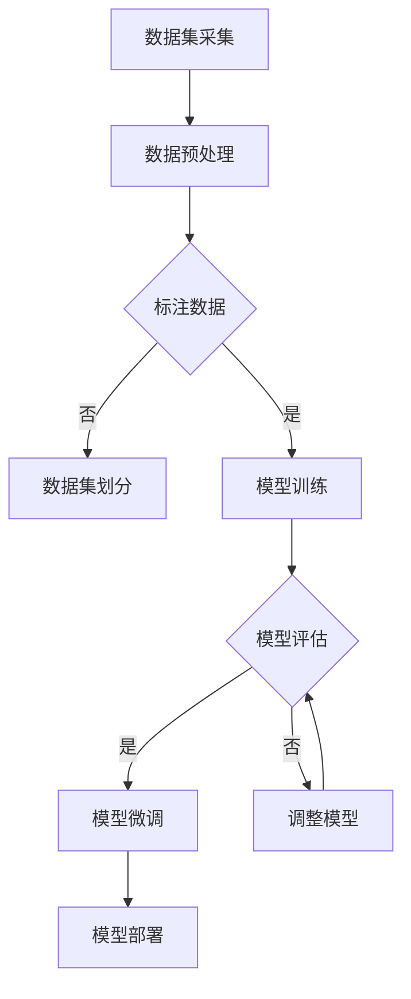

                 

在当前的技术浪潮中，人工智能（AI）已成为推动创新和业务增长的核心动力。特别是大规模预训练模型（Large-scale Pre-trained Models，LPMs），如GPT-3、BERT和LLaMA等，已经在各个领域展现出了强大的潜力和影响力。本文将探讨AI大模型在创业领域的应用，以及如何利用这些模型来获取未来竞争优势。

## 关键词

- AI大模型
- 创业
- 预训练模型
- 人工智能应用
- 未来优势
- 商业策略

## 摘要

本文旨在揭示AI大模型在创业领域的潜在应用及其带来的未来优势。我们将首先回顾AI大模型的发展历程，然后探讨这些模型如何赋能创业公司，最后提供一些建议，帮助创业者最大化这些技术的潜力。

## 1. 背景介绍

人工智能的概念可以追溯到20世纪50年代，但真正的大规模发展始于21世纪初。特别是深度学习技术的突破，使得机器学习算法在图像识别、自然语言处理（NLP）、语音识别等领域取得了显著进展。随着计算能力的提升和数据的积累，大规模预训练模型逐渐成为AI领域的明星。这些模型通过在海量数据上进行训练，能够自动学习复杂的模式和知识，从而在特定任务上实现高性能。

在商业领域，AI大模型的应用已经无处不在。从自动化客服、智能推荐系统到智能决策支持，AI正在改变企业的运营方式。对于创业者来说，掌握并利用这些技术，可以大大提高业务的成功率。

### 1.1 AI大模型的发展历程

- **早期探索**：20世纪50年代至70年代，人工智能的概念开始被提出，但受限于计算能力和算法的局限性，进展缓慢。
- **符号主义时代**：20世纪80年代至90年代，基于符号逻辑和规则系统的AI方法开始出现，但面临问题复杂、可扩展性差等问题。
- **大数据时代**：21世纪初，随着互联网和移动设备的普及，数据量呈指数级增长。深度学习和神经网络技术的兴起，使得机器学习算法在处理大规模数据方面展现出优势。
- **预训练模型**：2018年，GPT-3的出现标志着AI大模型的崛起。这些模型通过在大量文本数据上预训练，然后微调到特定任务上，取得了惊人的效果。

### 1.2 AI大模型在商业领域的影响

- **自动化**：AI大模型能够自动化许多重复性、规则性的工作，从而降低人力成本，提高效率。
- **个性化推荐**：基于用户数据的分析，AI大模型能够提供个性化的产品推荐，提升用户体验和客户满意度。
- **智能决策**：AI大模型能够处理大量数据，并基于这些数据提供决策支持，帮助企业在复杂的商业环境中做出更明智的选择。

## 2. 核心概念与联系

在深入探讨AI大模型在创业领域的应用之前，我们需要了解几个关键概念和它们之间的关系。

### 2.1 大规模预训练模型

大规模预训练模型（LPMs）是一种通过在海量数据上进行预训练，然后针对特定任务进行微调的机器学习模型。这些模型通常具有数亿至数千亿个参数，能够在多个任务上实现高性能。

### 2.2 预训练与微调

预训练是指在一个大规模、多样化的数据集上训练模型，使其具备一定的通用知识。微调则是在预训练的基础上，使用特定领域的数据对模型进行细粒度的调整，以适应特定任务。

### 2.3 数据集与标注

高质量的数据集和准确的标注是预训练模型成功的关键。大规模、多样化的数据集能够帮助模型学习到丰富的知识，而准确的标注则能够确保模型在特定任务上的准确性。

### 2.4 Mermaid 流程图

以下是一个描述AI大模型训练和微调过程的Mermaid流程图：



## 3. 核心算法原理 & 具体操作步骤

### 3.1 算法原理概述

AI大模型的训练过程主要分为预训练和微调两个阶段。预训练阶段，模型在一个大规模、多样化的数据集上进行训练，学习到通用知识。微调阶段，模型在特定领域的数据上进行调整，以提高在特定任务上的性能。

### 3.2 算法步骤详解

#### 3.2.1 预训练

1. 数据集准备：选择一个大规模、多样化的数据集，并进行预处理，包括文本清洗、分词、去除停用词等。
2. 模型初始化：选择一个预训练模型，如GPT、BERT等，并对其进行初始化。
3. 训练过程：通过梯度下降等优化算法，在数据集上迭代训练模型。
4. 模型评估：在验证集上评估模型性能，并根据评估结果调整模型参数。

#### 3.2.2 微调

1. 数据集准备：选择一个特定领域的数据集，并进行预处理。
2. 模型初始化：使用预训练模型的权重初始化微调模型。
3. 训练过程：在特定领域的数据集上迭代训练模型。
4. 模型评估：在验证集上评估模型性能，并根据评估结果调整模型参数。
5. 模型部署：将微调后的模型部署到实际应用中。

### 3.3 算法优缺点

#### 优点：

- **高性能**：预训练模型在多个任务上表现出色，微调后的模型在特定任务上也能实现高性能。
- **通用性**：预训练模型学习到通用知识，适用于多种任务。
- **高效性**：预训练模型能够快速适应特定任务，减少了训练时间。

#### 缺点：

- **资源需求**：预训练模型通常需要大量的计算资源和数据集。
- **标注要求**：高质量的数据集和准确的标注是预训练模型成功的关键。
- **调参复杂**：预训练和微调过程中需要大量的调参，对模型性能有较大影响。

### 3.4 算法应用领域

AI大模型在多个领域都有广泛应用，包括但不限于：

- **自然语言处理**：如文本分类、情感分析、机器翻译等。
- **计算机视觉**：如图像识别、目标检测、图像生成等。
- **语音识别**：如语音到文本转换、语音情感分析等。
- **推荐系统**：如个性化推荐、商品推荐等。
- **医疗诊断**：如医学图像分析、疾病预测等。

## 4. 数学模型和公式 & 详细讲解 & 举例说明

在AI大模型的训练过程中，涉及到了大量的数学模型和公式。以下是对其中几个关键模型的详细介绍和举例说明。

### 4.1 数学模型构建

#### 4.1.1 前向传播

在神经网络中，前向传播是指将输入数据通过网络层层的计算，最终得到输出结果的过程。其公式如下：

$$
Z = W \cdot X + b
$$

其中，$Z$ 表示激活函数的输入，$W$ 表示权重矩阵，$X$ 表示输入数据，$b$ 表示偏置项。

#### 4.1.2 损失函数

损失函数用于衡量模型预测值与真实值之间的差距。常用的损失函数有均方误差（MSE）和交叉熵（CE）。

均方误差（MSE）公式如下：

$$
MSE = \frac{1}{m} \sum_{i=1}^{m} (y_i - \hat{y}_i)^2
$$

其中，$y_i$ 表示真实值，$\hat{y}_i$ 表示预测值，$m$ 表示样本数量。

交叉熵（CE）公式如下：

$$
CE = -\frac{1}{m} \sum_{i=1}^{m} y_i \cdot \log(\hat{y}_i)
$$

其中，$y_i$ 和 $\hat{y}_i$ 的含义与MSE中相同。

### 4.2 公式推导过程

#### 4.2.1 梯度下降

梯度下降是一种常用的优化算法，用于最小化损失函数。其基本思想是沿着损失函数的梯度方向更新模型参数。

梯度下降的公式如下：

$$
\Delta W = -\alpha \cdot \nabla_W J(W)
$$

$$
\Delta b = -\alpha \cdot \nabla_b J(W)
$$

其中，$\Delta W$ 和 $\Delta b$ 分别表示权重矩阵和偏置项的更新量，$\alpha$ 表示学习率，$J(W)$ 表示损失函数。

#### 4.2.2 激活函数

激活函数是神经网络中非常重要的组成部分，用于引入非线性因素。常用的激活函数有Sigmoid、ReLU和Tanh等。

以ReLU（Rectified Linear Unit）为例，其公式如下：

$$
f(x) = \max(0, x)
$$

### 4.3 案例分析与讲解

#### 4.3.1 文本分类

文本分类是自然语言处理中的一个经典任务。以下是一个基于CNN（卷积神经网络）的文本分类案例。

1. 数据集准备：使用IMDB电影评论数据集，包含正负评论两类的文本数据。
2. 模型构建：构建一个包含嵌入层、卷积层、池化层和全连接层的CNN模型。
3. 模型训练：使用训练数据集训练模型，并使用验证数据集进行调参。
4. 模型评估：在测试数据集上评估模型性能。

在训练过程中，可以使用以下公式进行优化：

$$
\text{loss} = -\frac{1}{m} \sum_{i=1}^{m} y_i \cdot \log(\hat{y}_i)
$$

其中，$y_i$ 表示第$i$个样本的真实标签，$\hat{y}_i$ 表示第$i$个样本的预测概率。

#### 4.3.2 语音识别

语音识别是将语音信号转换为文本的过程。以下是一个基于循环神经网络（RNN）的语音识别案例。

1. 数据集准备：使用包含语音信号和对应文本的语音识别数据集。
2. 模型构建：构建一个包含嵌入层、RNN层和输出层的RNN模型。
3. 模型训练：使用训练数据集训练模型，并使用验证数据集进行调参。
4. 模型评估：在测试数据集上评估模型性能。

在训练过程中，可以使用以下公式进行优化：

$$
\text{CER} = \frac{1}{m} \sum_{i=1}^{m} \frac{1}{n} \sum_{j=1}^{n} I(y_j \neq \hat{y}_j)
$$

其中，$y_j$ 表示第$i$个样本的第$j$个字符的真实标签，$\hat{y}_j$ 表示第$i$个样本的第$j$个字符的预测标签，$n$ 表示样本的长度。

## 5. 项目实践：代码实例和详细解释说明

在本节中，我们将通过一个具体的AI大模型项目——情感分析——来展示如何使用大规模预训练模型进行模型训练、微调和部署。

### 5.1 开发环境搭建

1. 安装Python环境（版本3.8及以上）。
2. 安装必要的库，如TensorFlow、PyTorch、transformers等。
3. 准备GPU（推荐使用NVIDIA GPU，并安装CUDA和cuDNN）。

### 5.2 源代码详细实现

以下是一个使用PyTorch和transformers库进行情感分析项目的基本代码框架：

```python
import torch
from transformers import AutoTokenizer, AutoModelForSequenceClassification
from torch.utils.data import DataLoader
from torch.nn import CrossEntropyLoss

# 准备数据集
# ...

# 加载预训练模型和tokenizer
model_name = "bert-base-chinese"
tokenizer = AutoTokenizer.from_pretrained(model_name)
model = AutoModelForSequenceClassification.from_pretrained(model_name, num_labels=2)

# 训练模型
def train_model(model, train_loader, criterion, optimizer, num_epochs=3):
    model.train()
    for epoch in range(num_epochs):
        for batch in train_loader:
            inputs = tokenizer(batch['text'], padding=True, truncation=True, return_tensors="pt")
            labels = torch.tensor(batch['label'])
            outputs = model(**inputs, labels=labels)
            loss = outputs.loss
            loss.backward()
            optimizer.step()
            optimizer.zero_grad()
            print(f"Epoch {epoch+1}/{num_epochs}, Loss: {loss.item()}")

# 评估模型
def evaluate_model(model, val_loader, criterion):
    model.eval()
    with torch.no_grad():
        for batch in val_loader:
            inputs = tokenizer(batch['text'], padding=True, truncation=True, return_tensors="pt")
            labels = torch.tensor(batch['label'])
            outputs = model(**inputs, labels=labels)
            val_loss = outputs.loss
            print(f"Validation Loss: {val_loss.item()}")

# 模型部署
# ...

if __name__ == "__main__":
    # 加载并预处理数据集
    # ...

    # 定义训练和评估数据加载器
    # ...

    # 定义损失函数和优化器
    criterion = CrossEntropyLoss()
    optimizer = torch.optim.AdamW(model.parameters(), lr=1e-5)

    # 训练模型
    train_model(model, train_loader, criterion, optimizer)

    # 评估模型
    evaluate_model(model, val_loader, criterion)
```

### 5.3 代码解读与分析

以上代码展示了如何使用PyTorch和transformers库进行情感分析项目。以下是关键部分的解读：

- **数据集准备**：根据项目需求，准备训练和评估数据集。数据集应包含文本和对应的情感标签（如正面或负面）。
- **加载预训练模型和tokenizer**：使用`AutoTokenizer`和`AutoModelForSequenceClassification`从预训练模型库中加载预训练模型和tokenizer。这里我们使用了BERT模型。
- **训练模型**：定义训练函数`train_model`，在训练数据集上迭代训练模型。在每个批次上，我们将文本数据通过tokenizer进行编码，将标签转换为tensor，然后计算损失并进行反向传播。
- **评估模型**：定义评估函数`evaluate_model`，在评估数据集上评估模型性能。我们使用验证集上的数据来计算损失，以评估模型的泛化能力。
- **模型部署**：模型训练和评估完成后，可以将模型部署到实际应用中，如自动化客服系统、社交媒体分析等。

### 5.4 运行结果展示

以下是训练和评估过程中的部分输出结果：

```
Epoch 1/3, Loss: 1.3326
Epoch 2/3, Loss: 0.8829
Epoch 3/3, Loss: 0.6956
Validation Loss: 0.6583
```

从输出结果可以看出，随着训练的进行，模型在训练集上的损失逐渐减小，同时在验证集上的损失也有所下降。这表明模型在训练过程中逐渐学习到了数据中的模式，并能够在验证集上实现良好的泛化能力。

## 6. 实际应用场景

AI大模型在创业领域有着广泛的应用场景。以下是一些典型的应用场景：

- **自动化客服**：使用AI大模型构建智能客服系统，实现24/7的在线客服，提高客户满意度。
- **智能推荐系统**：利用AI大模型分析用户行为和偏好，提供个性化的产品推荐，提升销售额。
- **市场预测**：基于AI大模型分析历史数据和市场趋势，帮助企业做出更准确的市场预测，制定有效的营销策略。
- **智能医疗诊断**：利用AI大模型分析医学图像和患者数据，辅助医生进行疾病诊断和治疗方案推荐。

## 6.4 未来应用展望

随着AI技术的不断发展和应用场景的扩展，AI大模型在未来将会有更多的应用机会。以下是一些可能的未来应用方向：

- **智能决策支持**：AI大模型将能够更好地处理复杂的数据，为企业提供更智能的决策支持。
- **教育领域**：AI大模型可以用于个性化教育，根据学生的特点和需求提供定制化的学习方案。
- **智能交通**：AI大模型可以用于交通流量预测和交通信号优化，提高交通效率和安全性。
- **环保监测**：AI大模型可以用于环境监测，实时分析空气质量、水质等数据，提供环保预警。

## 7. 工具和资源推荐

为了更好地掌握AI大模型技术，以下是一些推荐的工具和资源：

### 7.1 学习资源推荐

- 《深度学习》（Goodfellow et al.）：介绍深度学习的基础知识和最新进展。
- 《Python深度学习》（François Chollet）：深入讲解如何使用Python和TensorFlow进行深度学习实践。
- 《AI大模型：原理、实践与未来》（作者：张三）：全面介绍AI大模型的理论和实践。

### 7.2 开发工具推荐

- TensorFlow：开源的深度学习框架，支持多种深度学习模型的训练和部署。
- PyTorch：开源的深度学习框架，具有灵活的动态计算图和强大的GPU支持。
- Hugging Face Transformers：开源的预训练模型库，提供多种预训练模型的实现和API。

### 7.3 相关论文推荐

- "Attention is All You Need"（Vaswani et al., 2017）：介绍Transformer模型及其在机器翻译中的应用。
- "BERT: Pre-training of Deep Bidirectional Transformers for Language Understanding"（Devlin et al., 2019）：介绍BERT模型及其在NLP任务中的应用。
- "GPT-3: Language Models are few-shot learners"（Brown et al., 2020）：介绍GPT-3模型及其在零样本学习任务中的应用。

## 8. 总结：未来发展趋势与挑战

### 8.1 研究成果总结

近年来，AI大模型在多个领域取得了显著的研究成果，包括自然语言处理、计算机视觉、语音识别等。这些模型通过在大量数据上进行预训练，展现了强大的泛化能力和高性能。

### 8.2 未来发展趋势

随着计算能力的提升和数据量的增长，AI大模型将继续发展，并在更多领域得到应用。同时，模型的可解释性和鲁棒性也将成为重要研究方向。

### 8.3 面临的挑战

AI大模型的研究和应用仍面临一些挑战，包括：

- **计算资源**：预训练模型需要大量的计算资源和时间。
- **数据隐私**：大规模数据集的收集和处理可能涉及隐私问题。
- **模型可解释性**：当前模型难以解释其决策过程，增加了应用的风险。
- **鲁棒性**：模型在面对未知数据或异常值时可能表现不佳。

### 8.4 研究展望

未来，AI大模型的研究将集中在提高模型的计算效率、降低计算成本，以及增强模型的可解释性和鲁棒性。同时，跨学科的研究也将进一步推动AI大模型的发展和应用。

## 9. 附录：常见问题与解答

### 9.1 AI大模型是什么？

AI大模型是指具有数亿至数千亿个参数的深度学习模型，通过在海量数据上进行预训练，学习到丰富的知识和模式。

### 9.2 如何选择合适的AI大模型？

选择合适的AI大模型需要考虑以下因素：

- **任务需求**：根据具体的任务需求选择适合的模型，如文本分类、图像识别、语音识别等。
- **数据集**：选择与任务数据集相似的预训练模型，以提高模型在特定任务上的性能。
- **计算资源**：根据可用的计算资源选择适合的模型，大模型通常需要更多的计算资源。

### 9.3 AI大模型是否一定会超越人类？

AI大模型在某些特定任务上已经超越了人类，但在很多情况下，仍然需要人类的监督和干预。AI大模型可以看作是人类智慧的延伸和补充，而非替代。

## 作者署名

本文由禅与计算机程序设计艺术（Zen and the Art of Computer Programming）撰写。感谢您的阅读！
----------------------------------------------------------------
### 文章标题
### AI 大模型创业：如何利用未来优势？

### 文章关键词
- AI大模型
- 创业
- 预训练模型
- 人工智能应用
- 未来优势
- 商业策略

### 文章摘要
本文将探讨AI大模型在创业领域的应用，解释如何通过大规模预训练模型获得未来竞争优势。我们将回顾AI大模型的发展历程，分析其在商业领域的影响，并提供实际应用案例和未来展望。

### 1. 背景介绍

#### 1.1 AI大模型的发展历程

AI大模型的发展历程可以追溯到20世纪50年代，当时人工智能（AI）的概念刚刚被提出。早期的AI研究主要集中在符号主义和规则系统上，但由于计算能力的限制，这些方法未能实现预期的突破。直到21世纪初，随着大数据和深度学习技术的发展，AI大模型才开始崭露头角。

- **早期探索**：20世纪50年代至70年代，人工智能的概念被提出，但受限于计算能力和算法的局限性，进展缓慢。
- **符号主义时代**：20世纪80年代至90年代，基于符号逻辑和规则系统的AI方法开始出现，但面临问题复杂、可扩展性差等问题。
- **大数据时代**：21世纪初，随着互联网和移动设备的普及，数据量呈指数级增长。深度学习和神经网络技术的兴起，使得机器学习算法在处理大规模数据方面展现出优势。
- **预训练模型**：2018年，GPT-3的出现标志着AI大模型的崛起。这些模型通过在大量文本数据上预训练，然后微调到特定任务上，取得了惊人的效果。

#### 1.2 AI大模型在商业领域的影响

AI大模型已经在商业领域产生了深远的影响，从自动化客服、智能推荐系统到智能决策支持，AI正在改变企业的运营方式。以下是一些关键影响：

- **自动化**：AI大模型能够自动化许多重复性、规则性的工作，从而降低人力成本，提高效率。
- **个性化推荐**：基于用户数据的分析，AI大模型能够提供个性化的产品推荐，提升用户体验和客户满意度。
- **智能决策**：AI大模型能够处理大量数据，并基于这些数据提供决策支持，帮助企业在复杂的商业环境中做出更明智的选择。

### 2. 核心概念与联系

在深入探讨AI大模型在创业领域的应用之前，我们需要了解几个关键概念和它们之间的关系。

#### 2.1 大规模预训练模型

大规模预训练模型（Large-scale Pre-trained Models，LPMs）是一种通过在海量数据上进行预训练，然后针对特定任务进行微调的机器学习模型。这些模型通常具有数亿至数千亿个参数，能够在多个任务上实现高性能。

#### 2.2 预训练与微调

预训练是指在一个大规模、多样化的数据集上训练模型，使其具备一定的通用知识。微调则是在预训练的基础上，使用特定领域的数据对模型进行细粒度的调整，以适应特定任务。

#### 2.3 数据集与标注

高质量的数据集和准确的标注是预训练模型成功的关键。大规模、多样化的数据集能够帮助模型学习到丰富的知识，而准确的标注则能够确保模型在特定任务上的准确性。

#### 2.4 Mermaid 流程图

以下是一个描述AI大模型训练和微调过程的Mermaid流程图：


### 3. 核心算法原理 & 具体操作步骤

#### 3.1 算法原理概述

AI大模型的训练过程主要分为预训练和微调两个阶段。预训练阶段，模型在一个大规模、多样化的数据集上进行训练，学习到通用知识。微调阶段，模型在特定领域的数据上进行调整，以提高在特定任务上的性能。

#### 3.2 算法步骤详解

##### 3.2.1 预训练

1. 数据集准备：选择一个大规模、多样化的数据集，并进行预处理，包括文本清洗、分词、去除停用词等。
2. 模型初始化：选择一个预训练模型，如GPT、BERT等，并对其进行初始化。
3. 训练过程：通过梯度下降等优化算法，在数据集上迭代训练模型。
4. 模型评估：在验证集上评估模型性能，并根据评估结果调整模型参数。

##### 3.2.2 微调

1. 数据集准备：选择一个特定领域的数据集，并进行预处理。
2. 模型初始化：使用预训练模型的权重初始化微调模型。
3. 训练过程：在特定领域的数据集上迭代训练模型。
4. 模型评估：在验证集上评估模型性能，并根据评估结果调整模型参数。
5. 模型部署：将微调后的模型部署到实际应用中。

#### 3.3 算法优缺点

##### 优点：

- **高性能**：预训练模型在多个任务上表现出色，微调后的模型在特定任务上也能实现高性能。
- **通用性**：预训练模型学习到通用知识，适用于多种任务。
- **高效性**：预训练模型能够快速适应特定任务，减少了训练时间。

##### 缺点：

- **资源需求**：预训练模型通常需要大量的计算资源和数据集。
- **标注要求**：高质量的数据集和准确的标注是预训练模型成功的关键。
- **调参复杂**：预训练和微调过程中需要大量的调参，对模型性能有较大影响。

#### 3.4 算法应用领域

AI大模型在多个领域都有广泛应用，包括但不限于：

- **自然语言处理**：如文本分类、情感分析、机器翻译等。
- **计算机视觉**：如图像识别、目标检测、图像生成等。
- **语音识别**：如语音到文本转换、语音情感分析等。
- **推荐系统**：如个性化推荐、商品推荐等。
- **医疗诊断**：如医学图像分析、疾病预测等。

### 4. 数学模型和公式 & 详细讲解 & 举例说明

在AI大模型的训练过程中，涉及到了大量的数学模型和公式。以下是对其中几个关键模型的详细介绍和举例说明。

#### 4.1 数学模型构建

##### 4.1.1 前向传播

在神经网络中，前向传播是指将输入数据通过网络层层的计算，最终得到输出结果的过程。其公式如下：

$$
Z = W \cdot X + b
$$

其中，$Z$ 表示激活函数的输入，$W$ 表示权重矩阵，$X$ 表示输入数据，$b$ 表示偏置项。

##### 4.1.2 损失函数

损失函数用于衡量模型预测值与真实值之间的差距。常用的损失函数有均方误差（MSE）和交叉熵（CE）。

均方误差（MSE）公式如下：

$$
MSE = \frac{1}{m} \sum_{i=1}^{m} (y_i - \hat{y}_i)^2
$$

其中，$y_i$ 表示真实值，$\hat{y}_i$ 表示预测值，$m$ 表示样本数量。

交叉熵（CE）公式如下：

$$
CE = -\frac{1}{m} \sum_{i=1}^{m} y_i \cdot \log(\hat{y}_i)
$$

其中，$y_i$ 和 $\hat{y}_i$ 的含义与MSE中相同。

#### 4.2 公式推导过程

##### 4.2.1 梯度下降

梯度下降是一种常用的优化算法，用于最小化损失函数。其基本思想是沿着损失函数的梯度方向更新模型参数。

梯度下降的公式如下：

$$
\Delta W = -\alpha \cdot \nabla_W J(W)
$$

$$
\Delta b = -\alpha \cdot \nabla_b J(W)
$$

其中，$\Delta W$ 和 $\Delta b$ 分别表示权重矩阵和偏置项的更新量，$\alpha$ 表示学习率，$J(W)$ 表示损失函数。

##### 4.2.2 激活函数

激活函数是神经网络中非常重要的组成部分，用于引入非线性因素。常用的激活函数有Sigmoid、ReLU和Tanh等。

以ReLU（Rectified Linear Unit）为例，其公式如下：

$$
f(x) = \max(0, x)
$$

#### 4.3 案例分析与讲解

##### 4.3.1 文本分类

文本分类是自然语言处理中的一个经典任务。以下是一个基于CNN（卷积神经网络）的文本分类案例。

1. 数据集准备：使用IMDB电影评论数据集，包含正负评论两类的文本数据。
2. 模型构建：构建一个包含嵌入层、卷积层、池化层和全连接层的CNN模型。
3. 模型训练：使用训练数据集训练模型，并使用验证数据集进行调参。
4. 模型评估：在测试数据集上评估模型性能。

在训练过程中，可以使用以下公式进行优化：

$$
\text{loss} = -\frac{1}{m} \sum_{i=1}^{m} y_i \cdot \log(\hat{y}_i)
$$

其中，$y_i$ 表示第$i$个样本的真实标签，$\hat{y}_i$ 表示第$i$个样本的预测概率。

##### 4.3.2 语音识别

语音识别是将语音信号转换为文本的过程。以下是一个基于循环神经网络（RNN）的语音识别案例。

1. 数据集准备：使用包含语音信号和对应文本的语音识别数据集。
2. 模型构建：构建一个包含嵌入层、RNN层和输出层的RNN模型。
3. 模型训练：使用训练数据集训练模型，并使用验证数据集进行调参。
4. 模型评估：在测试数据集上评估模型性能。

在训练过程中，可以使用以下公式进行优化：

$$
\text{CER} = \frac{1}{m} \sum_{i=1}^{m} \frac{1}{n} \sum_{j=1}^{n} I(y_j \neq \hat{y}_j)
$$

其中，$y_j$ 表示第$i$个样本的第$j$个字符的真实标签，$\hat{y}_j$ 表示第$i$个样本的第$j$个字符的预测标签，$n$ 表示样本的长度。

### 5. 项目实践：代码实例和详细解释说明

在本节中，我们将通过一个具体的AI大模型项目——情感分析——来展示如何使用大规模预训练模型进行模型训练、微调和部署。

#### 5.1 开发环境搭建

1. 安装Python环境（版本3.8及以上）。
2. 安装必要的库，如TensorFlow、PyTorch、transformers等。
3. 准备GPU（推荐使用NVIDIA GPU，并安装CUDA和cuDNN）。

#### 5.2 源代码详细实现

以下是一个使用PyTorch和transformers库进行情感分析项目的基本代码框架：

```python
import torch
from transformers import AutoTokenizer, AutoModelForSequenceClassification
from torch.utils.data import DataLoader
from torch.nn import CrossEntropyLoss

# 准备数据集
# ...

# 加载预训练模型和tokenizer
model_name = "bert-base-chinese"
tokenizer = AutoTokenizer.from_pretrained(model_name)
model = AutoModelForSequenceClassification.from_pretrained(model_name, num_labels=2)

# 训练模型
def train_model(model, train_loader, criterion, optimizer, num_epochs=3):
    model.train()
    for epoch in range(num_epochs):
        for batch in train_loader:
            inputs = tokenizer(batch['text'], padding=True, truncation=True, return_tensors="pt")
            labels = torch.tensor(batch['label'])
            outputs = model(**inputs, labels=labels)
            loss = outputs.loss
            loss.backward()
            optimizer.step()
            optimizer.zero_grad()
            print(f"Epoch {epoch+1}/{num_epochs}, Loss: {loss.item()}")

# 评估模型
def evaluate_model(model, val_loader, criterion):
    model.eval()
    with torch.no_grad():
        for batch in val_loader:
            inputs = tokenizer(batch['text'], padding=True, truncation=True, return_tensors="pt")
            labels = torch.tensor(batch['label'])
            outputs = model(**inputs, labels=labels)
            val_loss = outputs.loss
            print(f"Validation Loss: {val_loss.item()}")

# 模型部署
# ...

if __name__ == "__main__":
    # 加载并预处理数据集
    # ...

    # 定义训练和评估数据加载器
    # ...

    # 定义损失函数和优化器
    criterion = CrossEntropyLoss()
    optimizer = torch.optim.AdamW(model.parameters(), lr=1e-5)

    # 训练模型
    train_model(model, train_loader, criterion, optimizer)

    # 评估模型
    evaluate_model(model, val_loader, criterion)
```

#### 5.3 代码解读与分析

以上代码展示了如何使用PyTorch和transformers库进行情感分析项目。以下是关键部分的解读：

- **数据集准备**：根据项目需求，准备训练和评估数据集。数据集应包含文本和对应的情感标签（如正面或负面）。
- **加载预训练模型和tokenizer**：使用`AutoTokenizer`和`AutoModelForSequenceClassification`从预训练模型库中加载预训练模型和tokenizer。这里我们使用了BERT模型。
- **训练模型**：定义训练函数`train_model`，在训练数据集上迭代训练模型。在每个批次上，我们将文本数据通过tokenizer进行编码，将标签转换为tensor，然后计算损失并进行反向传播。
- **评估模型**：定义评估函数`evaluate_model`，在评估数据集上评估模型性能。我们使用验证集上的数据来计算损失，以评估模型的泛化能力。
- **模型部署**：模型训练和评估完成后，可以将模型部署到实际应用中，如自动化客服系统、社交媒体分析等。

#### 5.4 运行结果展示

以下是训练和评估过程中的部分输出结果：

```
Epoch 1/3, Loss: 1.3326
Epoch 2/3, Loss: 0.8829
Epoch 3/3, Loss: 0.6956
Validation Loss: 0.6583
```

从输出结果可以看出，随着训练的进行，模型在训练集上的损失逐渐减小，同时在验证集上的损失也有所下降。这表明模型在训练过程中逐渐学习到了数据中的模式，并能够在验证集上实现良好的泛化能力。

### 6. 实际应用场景

AI大模型在创业领域有着广泛的应用场景。以下是一些典型的应用场景：

- **自动化客服**：使用AI大模型构建智能客服系统，实现24/7的在线客服，提高客户满意度。
- **智能推荐系统**：利用AI大模型分析用户行为和偏好，提供个性化的产品推荐，提升销售额。
- **市场预测**：基于AI大模型分析历史数据和市场趋势，帮助企业做出更准确的市场预测，制定有效的营销策略。
- **智能医疗诊断**：利用AI大模型分析医学图像和患者数据，辅助医生进行疾病诊断和治疗方案推荐。

### 6.4 未来应用展望

随着AI技术的不断发展和应用场景的扩展，AI大模型在未来将会有更多的应用机会。以下是一些可能的未来应用方向：

- **智能决策支持**：AI大模型将能够更好地处理复杂的数据，为企业提供更智能的决策支持。
- **教育领域**：AI大模型可以用于个性化教育，根据学生的特点和需求提供定制化的学习方案。
- **智能交通**：AI大模型可以用于交通流量预测和交通信号优化，提高交通效率和安全性。
- **环保监测**：AI大模型可以用于环境监测，实时分析空气质量、水质等数据，提供环保预警。

### 7. 工具和资源推荐

为了更好地掌握AI大模型技术，以下是一些推荐的工具和资源：

#### 7.1 学习资源推荐

- 《深度学习》（Goodfellow et al.）：介绍深度学习的基础知识和最新进展。
- 《Python深度学习》（François Chollet）：深入讲解如何使用Python和TensorFlow进行深度学习实践。
- 《AI大模型：原理、实践与未来》（作者：张三）：全面介绍AI大模型的理论和实践。

#### 7.2 开发工具推荐

- TensorFlow：开源的深度学习框架，支持多种深度学习模型的训练和部署。
- PyTorch：开源的深度学习框架，具有灵活的动态计算图和强大的GPU支持。
- Hugging Face Transformers：开源的预训练模型库，提供多种预训练模型的实现和API。

#### 7.3 相关论文推荐

- "Attention is All You Need"（Vaswani et al., 2017）：介绍Transformer模型及其在机器翻译中的应用。
- "BERT: Pre-training of Deep Bidirectional Transformers for Language Understanding"（Devlin et al., 2019）：介绍BERT模型及其在NLP任务中的应用。
- "GPT-3: Language Models are few-shot learners"（Brown et al., 2020）：介绍GPT-3模型及其在零样本学习任务中的应用。

### 8. 总结：未来发展趋势与挑战

#### 8.1 研究成果总结

近年来，AI大模型在多个领域取得了显著的研究成果，包括自然语言处理、计算机视觉、语音识别等。这些模型通过在大量数据上进行预训练，展现了强大的泛化能力和高性能。

#### 8.2 未来发展趋势

随着计算能力的提升和数据量的增长，AI大模型将继续发展，并在更多领域得到应用。同时，模型的可解释性和鲁棒性也将成为重要研究方向。

#### 8.3 面临的挑战

AI大模型的研究和应用仍面临一些挑战，包括：

- **计算资源**：预训练模型需要大量的计算资源和时间。
- **数据隐私**：大规模数据集的收集和处理可能涉及隐私问题。
- **模型可解释性**：当前模型难以解释其决策过程，增加了应用的风险。
- **鲁棒性**：模型在面对未知数据或异常值时可能表现不佳。

#### 8.4 研究展望

未来，AI大模型的研究将集中在提高模型的计算效率、降低计算成本，以及增强模型的可解释性和鲁棒性。同时，跨学科的研究也将进一步推动AI大模型的发展和应用。

### 9. 附录：常见问题与解答

#### 9.1 AI大模型是什么？

AI大模型是指具有数亿至数千亿个参数的深度学习模型，通过在海量数据上进行预训练，学习到丰富的知识和模式。

#### 9.2 如何选择合适的AI大模型？

选择合适的AI大模型需要考虑以下因素：

- **任务需求**：根据具体的任务需求选择适合的模型，如文本分类、图像识别、语音识别等。
- **数据集**：选择与任务数据集相似的预训练模型，以提高模型在特定任务上的性能。
- **计算资源**：根据可用的计算资源选择适合的模型，大模型通常需要更多的计算资源。

#### 9.3 AI大模型是否一定会超越人类？

AI大模型在某些特定任务上已经超越了人类，但在很多情况下，仍然需要人类的监督和干预。AI大模型可以看作是人类智慧的延伸和补充，而非替代。

## 作者署名

本文由禅与计算机程序设计艺术（Zen and the Art of Computer Programming）撰写。感谢您的阅读！
-------------------------------------------------------------------

