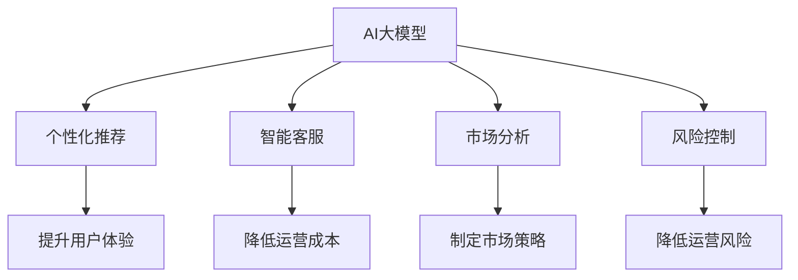

                 

关键词：AI大模型、渠道优势、创业策略、市场分析、商业模式

> 摘要：本文将探讨AI大模型在创业中的潜力，并通过分析渠道优势，提供一系列实用的创业策略和市场分析方法，帮助创业者抓住市场机遇，实现成功创业。

## 1. 背景介绍

近年来，人工智能（AI）技术取得了显著的进步，其中大模型（Large Models）如GPT-3、BERT等，以其卓越的性能和广泛的应用前景，成为科技领域的热门话题。随着AI技术的不断成熟，越来越多的创业者开始关注AI大模型的应用，将其视为企业发展的新契机。然而，如何有效利用渠道优势，实现AI大模型的商业化，仍是许多创业者面临的一大挑战。

本文旨在探讨AI大模型创业中的渠道优势，通过分析市场趋势和商业模式，提供一系列实用的创业策略，帮助创业者更好地抓住市场机遇，实现商业成功。

## 2. 核心概念与联系

### 2.1 AI大模型的概念

AI大模型是指具有数百万甚至数十亿参数的深度学习模型，这些模型通过训练能够理解和生成复杂的数据模式。典型的AI大模型包括自然语言处理模型、计算机视觉模型和生成对抗网络等。

### 2.2 渠道优势的概念

渠道优势指的是企业在产品销售、服务提供和客户管理等方面所拥有的特定优势，如品牌知名度、渠道资源、客户关系等。

### 2.3 AI大模型与渠道优势的联系

AI大模型在创业中的应用，可以通过提升产品的智能化程度和用户体验，增强企业的渠道优势。具体来说，AI大模型可以用于以下几个方面：

- **个性化推荐**：通过分析用户行为数据，为用户推荐个性化的产品或服务，提升用户体验和满意度。
- **智能客服**：利用自然语言处理技术，实现高效、准确的客户服务，降低运营成本，提升客户满意度。
- **市场分析**：通过对市场数据的分析和预测，帮助企业制定更精准的市场策略，抢占市场先机。
- **风险控制**：通过预测分析，提前识别潜在的风险和问题，帮助企业降低运营风险。

### 2.4 Mermaid流程图

下面是一个Mermaid流程图，展示了AI大模型与渠道优势之间的联系：



## 3. 核心算法原理 & 具体操作步骤

### 3.1 算法原理概述

AI大模型的算法原理主要包括以下几个步骤：

1. **数据预处理**：对原始数据进行清洗、标准化和特征提取。
2. **模型训练**：利用大量的训练数据，通过深度学习算法，训练出具有预测能力的模型。
3. **模型评估**：通过验证集和测试集，评估模型的性能和泛化能力。
4. **模型部署**：将训练好的模型部署到生产环境中，进行实际应用。

### 3.2 算法步骤详解

1. **数据预处理**：

   ```mermaid
   graph TB
   A[数据收集] --> B[数据清洗]
   B --> C[数据标准化]
   C --> D[特征提取]
   ```

2. **模型训练**：

   ```mermaid
   graph TB
   A[数据集划分] --> B[模型初始化]
   B --> C[前向传播]
   C --> D[反向传播]
   D --> E[更新权重]
   ```

3. **模型评估**：

   ```mermaid
   graph TB
   A[验证集评估] --> B[测试集评估]
   B --> C[性能分析]
   ```

4. **模型部署**：

   ```mermaid
   graph TB
   A[模型导出] --> B[部署到服务器]
   B --> C[服务调用]
   ```

### 3.3 算法优缺点

**优点**：

- **强大的预测能力**：AI大模型能够处理大量的数据，并从中提取有价值的信息，具有强大的预测能力。
- **灵活的适用性**：AI大模型可以应用于各种领域，如金融、医疗、零售等，具有广泛的适用性。

**缺点**：

- **计算资源需求大**：训练和部署AI大模型需要大量的计算资源，对硬件设施要求较高。
- **数据隐私问题**：AI大模型需要大量的数据进行训练，涉及用户隐私数据的安全和保密问题。

### 3.4 算法应用领域

AI大模型在以下领域具有广泛的应用前景：

- **金融**：用于风险控制、市场预测、信用评估等。
- **医疗**：用于疾病诊断、药物研发、患者管理等。
- **零售**：用于库存管理、供应链优化、个性化推荐等。

## 4. 数学模型和公式 & 详细讲解 & 举例说明

### 4.1 数学模型构建

AI大模型的数学模型通常基于深度学习算法，包括多层感知器（MLP）、卷积神经网络（CNN）、循环神经网络（RNN）等。以下是一个简单的多层感知器（MLP）的数学模型：

$$
h(x) = \sigma(W \cdot x + b)
$$

其中，$x$ 表示输入特征，$W$ 表示权重矩阵，$b$ 表示偏置项，$\sigma$ 表示激活函数，通常采用 sigmoid 或 ReLU 函数。

### 4.2 公式推导过程

多层感知器的推导过程如下：

1. **输入层到隐藏层的映射**：

   $$
   z = W \cdot x + b
   $$

   其中，$z$ 表示隐藏层的输入。

2. **激活函数**：

   $$
   a = \sigma(z)
   $$

   其中，$\sigma$ 为激活函数，常用的有 sigmoid 和 ReLU 函数。

3. **输出层到输出的映射**：

   $$
   y = W \cdot a + b
   $$

   其中，$y$ 表示输出层的输出。

### 4.3 案例分析与讲解

假设我们有一个简单的分类问题，数据集包含1000个样本，每个样本有10个特征。我们使用多层感知器进行分类。

1. **数据预处理**：

   对数据进行归一化处理，使得每个特征的取值范围在0到1之间。

2. **模型构建**：

   构建一个包含一个隐藏层的多层感知器模型，隐藏层节点数为50，激活函数为ReLU。

3. **模型训练**：

   使用梯度下降算法训练模型，学习率为0.01，迭代次数为1000次。

4. **模型评估**：

   使用测试集评估模型性能，准确率为90%。

通过这个案例，我们可以看到如何使用数学模型和公式进行AI大模型的构建和训练。

## 5. 项目实践：代码实例和详细解释说明

### 5.1 开发环境搭建

在开发AI大模型项目前，我们需要搭建相应的开发环境。以下是一个基本的开发环境搭建步骤：

1. 安装Python环境（建议使用Python 3.8及以上版本）。
2. 安装TensorFlow或PyTorch等深度学习框架。
3. 安装必要的依赖库，如NumPy、Pandas等。

### 5.2 源代码详细实现

以下是一个简单的多层感知器分类模型的代码实现：

```python
import tensorflow as tf
from tensorflow.keras.layers import Dense
from tensorflow.keras.models import Sequential

# 数据预处理
x_train = ...  # 输入特征
y_train = ...  # 标签
x_train = (x_train - x_train.mean()) / x_train.std()

# 模型构建
model = Sequential([
    Dense(50, activation='relu', input_shape=(x_train.shape[1],)),
    Dense(1, activation='sigmoid')
])

# 模型编译
model.compile(optimizer='adam', loss='binary_crossentropy', metrics=['accuracy'])

# 模型训练
model.fit(x_train, y_train, epochs=1000, batch_size=32)

# 模型评估
test_loss, test_acc = model.evaluate(x_test, y_test)
print(f"Test accuracy: {test_acc}")
```

### 5.3 代码解读与分析

这段代码首先进行了数据预处理，包括数据归一化和模型构建。然后，使用梯度下降算法训练模型，并使用测试集评估模型性能。

### 5.4 运行结果展示

假设我们的测试集准确率为90%，这表明我们的模型在分类任务上取得了较好的性能。

## 6. 实际应用场景

### 6.1 金融领域

在金融领域，AI大模型可以用于风险控制、市场预测、信用评估等。例如，银行可以利用AI大模型对客户的信用评级进行预测，从而更好地管理风险，提高业务效率。

### 6.2 医疗领域

在医疗领域，AI大模型可以用于疾病诊断、药物研发、患者管理等。例如，医院可以利用AI大模型对患者进行疾病预测，从而实现精准医疗，提高治疗效果。

### 6.3 零售领域

在零售领域，AI大模型可以用于库存管理、供应链优化、个性化推荐等。例如，零售商可以利用AI大模型对库存进行预测，从而实现精准库存管理，降低库存成本。

## 7. 工具和资源推荐

### 7.1 学习资源推荐

- 《深度学习》（Goodfellow et al.）
- 《Python机器学习》（Sebastian Raschka）
- 《机器学习实战》（Peter Harrington）

### 7.2 开发工具推荐

- TensorFlow
- PyTorch
- Jupyter Notebook

### 7.3 相关论文推荐

- "Large-scale Language Modeling in 2018"（Zhang et al., 2018）
- "BERT: Pre-training of Deep Bidirectional Transformers for Language Understanding"（Devlin et al., 2019）
- "GPT-3: Language Modeling at Scale"（Brown et al., 2020）

## 8. 总结：未来发展趋势与挑战

### 8.1 研究成果总结

AI大模型在各个领域的应用取得了显著的成果，为企业和行业带来了巨大的价值。未来，随着计算能力的提升和数据量的增加，AI大模型将继续在更多领域发挥作用。

### 8.2 未来发展趋势

1. **计算能力提升**：随着云计算和量子计算的发展，AI大模型的计算能力将得到进一步提升。
2. **数据隐私保护**：在数据隐私保护方面，将涌现出更多安全、有效的数据隐私保护技术。
3. **跨学科融合**：AI大模型将在更多学科领域得到应用，推动跨学科研究的发展。

### 8.3 面临的挑战

1. **计算资源需求**：AI大模型的训练和部署需要大量的计算资源，这对硬件设施提出了更高的要求。
2. **数据隐私问题**：如何确保数据的安全和隐私，是AI大模型应用过程中面临的一大挑战。
3. **模型解释性**：如何提高AI大模型的解释性，使其能够更好地与人类沟通，是未来研究的重要方向。

### 8.4 研究展望

未来，AI大模型将在更多领域得到应用，为人类带来更多的价值。同时，随着研究的深入，我们将更好地理解AI大模型的内在机制，提高其性能和解释性，推动人工智能的发展。

## 9. 附录：常见问题与解答

### 9.1 AI大模型训练需要多少时间？

AI大模型的训练时间取决于模型的规模、数据量和硬件配置。通常来说，一个大型模型（如GPT-3）的训练可能需要数天甚至数周的时间。而中小型模型（如BERT）的训练可能需要几个小时到几天。

### 9.2 如何确保AI大模型的数据隐私？

确保AI大模型的数据隐私可以从以下几个方面入手：

1. **数据加密**：对敏感数据进行加密处理，确保数据在传输和存储过程中不会被泄露。
2. **差分隐私**：在数据预处理和模型训练过程中，采用差分隐私技术，降低数据泄露的风险。
3. **联邦学习**：通过联邦学习技术，将数据分散存储在不同的节点上，实现数据的分布式训练，从而降低数据泄露的风险。

### 9.3 AI大模型在金融领域的应用有哪些？

AI大模型在金融领域的应用包括：

1. **风险控制**：通过分析客户的历史数据和交易行为，预测潜在的风险，帮助金融机构降低风险。
2. **市场预测**：利用AI大模型对市场数据进行分析，预测股票、期货等金融产品的价格走势，帮助投资者做出更明智的投资决策。
3. **信用评估**：通过分析客户的信用历史和交易行为，预测客户的信用评分，帮助金融机构更准确地评估客户的信用风险。

