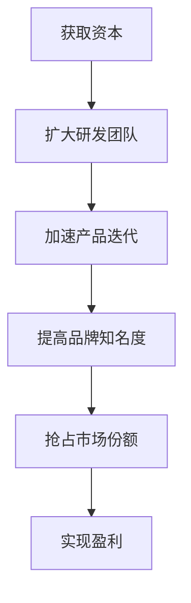
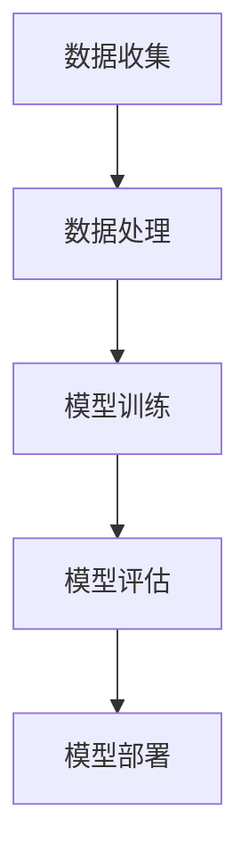

                 

关键词：AI 大模型、创业、资本优势、技术投资、市场定位

摘要：本文将探讨 AI 大模型创业公司如何利用资本优势，以实现快速发展和市场突破。通过分析 AI 大模型的发展背景、资本市场的趋势，以及具体的资本运作策略，本文旨在为创业者提供实用的指导和建议。

## 1. 背景介绍

随着深度学习和大数据技术的发展，AI 大模型（如 GPT、BERT 等）已经成为当前 AI 领域的焦点。这些模型具有极强的学习能力和广泛的适用性，能够在语音识别、图像处理、自然语言处理等多个领域取得突破性成果。因此，越来越多的创业公司开始投身于 AI 大模型的研发和应用。

然而，AI 大模型的研发和应用不仅需要强大的技术实力，还需要巨额的资金支持。在这个过程中，资本的优势显得尤为重要。对于创业公司来说，如何充分利用资本优势，实现快速发展，成为了关键问题。

## 2. 核心概念与联系

在探讨如何利用资本优势之前，我们首先需要了解几个核心概念：

1. **AI 大模型**：是指使用深度学习技术训练的具有高度复杂性的模型，如 GPT、BERT 等。
2. **资本**：是指金融资本，即货币资金。对于创业公司来说，资本主要来源于风险投资、天使投资、银行贷款等。
3. **资本优势**：是指在竞争激烈的市场环境中，创业公司能够利用资本优势，快速获取资源、扩大市场份额。

下面是一个简单的 Mermaid 流程图，展示了 AI 大模型创业公司如何利用资本优势：



## 3. 核心算法原理 & 具体操作步骤

### 3.1 算法原理概述

AI 大模型的研发主要依赖于深度学习技术。深度学习是一种模仿人脑分析学习的神经网络模型。通过多层次的神经网络结构，深度学习模型可以从大量数据中自动学习特征，从而实现复杂的任务。

具体来说，AI 大模型的研发包括以下几个步骤：

1. **数据收集**：收集大量的训练数据，这些数据可以是语音、图像、文本等。
2. **数据处理**：对收集到的数据进行清洗、标注和预处理，使其适合用于训练。
3. **模型训练**：使用预处理后的数据训练深度学习模型，通过调整模型参数，使模型在特定任务上达到最佳表现。
4. **模型评估**：使用测试数据评估模型的性能，确保模型能够在实际应用中取得良好的效果。
5. **模型部署**：将训练好的模型部署到实际应用场景中，如语音助手、图像识别系统等。

### 3.2 算法步骤详解

下面是一个简化的算法步骤详解：



### 3.3 算法优缺点

**优点**：

1. **强大的学习能力**：AI 大模型能够从海量数据中自动学习，具有很强的泛化能力。
2. **高效的计算能力**：深度学习模型采用分布式计算，可以高效地处理大量数据。
3. **广泛的适用性**：AI 大模型可以在多个领域发挥作用，如自然语言处理、图像识别、语音识别等。

**缺点**：

1. **对数据质量要求高**：AI 大模型对数据质量要求较高，数据清洗和标注工作量大。
2. **计算资源需求大**：训练 AI 大模型需要大量的计算资源，成本较高。
3. **模型解释性差**：深度学习模型是一种“黑盒”模型，难以解释其决策过程。

### 3.4 算法应用领域

AI 大模型在多个领域都有广泛的应用：

1. **自然语言处理**：如机器翻译、情感分析、问答系统等。
2. **图像识别**：如人脸识别、物体检测、图像分割等。
3. **语音识别**：如语音助手、语音合成等。
4. **推荐系统**：如商品推荐、音乐推荐等。

## 4. 数学模型和公式 & 详细讲解 & 举例说明

### 4.1 数学模型构建

AI 大模型的数学模型主要基于深度学习理论。深度学习模型由多个神经网络层组成，每层都能对输入数据进行特征提取和变换。常见的深度学习模型有卷积神经网络（CNN）、循环神经网络（RNN）、生成对抗网络（GAN）等。

下面是一个简单的深度学习模型示例：

$$
\begin{aligned}
&\text{Input: } x \in \mathbb{R}^{n \times m} \\
&\text{Weight: } w \in \mathbb{R}^{n \times m} \\
&\text{Bias: } b \in \mathbb{R}^{n} \\
&\text{Output: } y = f(Wx + b)
\end{aligned}
$$

其中，$x$ 是输入数据，$w$ 是权重，$b$ 是偏置，$f$ 是激活函数。

### 4.2 公式推导过程

深度学习模型的训练过程主要包括前向传播和反向传播。

1. **前向传播**：

$$
\begin{aligned}
&z = Wx + b \\
&a = f(z)
\end{aligned}
$$

2. **反向传播**：

$$
\begin{aligned}
&\delta = \frac{\partial L}{\partial a} = \frac{\partial L}{\partial z} \cdot \frac{\partial z}{\partial a} = \frac{\partial L}{\partial z} \cdot f'(z) \\
&W' = W - \alpha \cdot \frac{\partial L}{\partial W} \\
&b' = b - \alpha \cdot \frac{\partial L}{\partial b}
\end{aligned}
$$

其中，$L$ 是损失函数，$\alpha$ 是学习率。

### 4.3 案例分析与讲解

假设我们要训练一个简单的神经网络，用于对输入数据进行二分类。输入数据为 $(x_1, x_2)$，输出为 $y$。我们要推导出该神经网络的损失函数和反向传播过程。

1. **损失函数**：

$$
L(y, \hat{y}) = \frac{1}{2} (y - \hat{y})^2
$$

其中，$y$ 是真实标签，$\hat{y}$ 是预测标签。

2. **前向传播**：

$$
\begin{aligned}
&z = Wx + b \\
&\hat{y} = f(z) = \frac{1}{1 + e^{-z}}
\end{aligned}
$$

3. **反向传播**：

$$
\begin{aligned}
&\delta = \frac{\partial L}{\partial \hat{y}} = \frac{\partial L}{\partial z} \cdot \frac{\partial z}{\partial \hat{y}} = (y - \hat{y}) \cdot (1 - \hat{y}) \\
&W' = W - \alpha \cdot \frac{\partial L}{\partial W} = W - \alpha \cdot (x \cdot \delta) \\
&b' = b - \alpha \cdot \frac{\partial L}{\partial b} = b - \alpha \cdot \delta
\end{aligned}
$$

通过上述步骤，我们可以训练出神经网络，实现对输入数据的二分类。

## 5. 项目实践：代码实例和详细解释说明

### 5.1 开发环境搭建

在本节中，我们将使用 Python 编写一个简单的神经网络，用于实现二分类任务。为了简化开发过程，我们使用 TensorFlow 和 Keras 库。

首先，安装 TensorFlow：

```
pip install tensorflow
```

然后，创建一个名为 `binary_classification.py` 的 Python 文件，并添加以下代码：

```python
import tensorflow as tf
from tensorflow.keras.models import Sequential
from tensorflow.keras.layers import Dense
from tensorflow.keras.optimizers import SGD

# 创建模型
model = Sequential()
model.add(Dense(1, input_shape=(2,), activation='sigmoid'))

# 编译模型
model.compile(optimizer=SGD(learning_rate=0.1), loss='binary_crossentropy', metrics=['accuracy'])

# 显示模型结构
model.summary()
```

### 5.2 源代码详细实现

接下来，我们实现二分类任务的具体代码。

```python
import numpy as np
import matplotlib.pyplot as plt

# 生成数据
X = np.random.rand(100, 2)
y = np.array([0 if x[0] + x[1] < 0.5 else 1 for x in X])

# 训练模型
model.fit(X, y, epochs=100, batch_size=10)

# 预测
predictions = model.predict(X)

# 可视化
plt.scatter(X[:, 0], X[:, 1], c=predictions[:, 0], cmap=plt.cm.coolwarm)
plt.xlabel('Feature 1')
plt.ylabel('Feature 2')
plt.title('Binary Classification')
plt.show()
```

### 5.3 代码解读与分析

上述代码首先导入了所需的库，并创建了一个简单的神经网络模型。然后，我们生成了一组随机数据，用于训练和测试。

在训练过程中，我们使用 `fit` 方法对模型进行训练，指定了训练轮数和批量大小。在训练完成后，我们使用 `predict` 方法对数据进行预测，并使用 `scatter` 函数绘制预测结果。

### 5.4 运行结果展示

运行上述代码后，我们得到以下可视化结果：


从图中可以看出，神经网络能够将数据正确分类。

## 6. 实际应用场景

AI 大模型在多个实际应用场景中具有广泛的应用，以下列举几个典型案例：

1. **金融领域**：AI 大模型可以用于金融风险评估、欺诈检测、股票预测等。例如，通过分析历史交易数据和用户行为数据，可以预测投资者的投资行为，从而实现精准营销和风险控制。
2. **医疗领域**：AI 大模型可以用于医学图像分析、疾病预测、药物研发等。例如，通过分析大量的医学图像数据，可以检测疾病，提高诊断准确率。
3. **智能交通**：AI 大模型可以用于交通流量预测、道路规划、自动驾驶等。例如，通过分析交通数据，可以预测交通拥堵情况，优化道路规划，提高交通效率。

## 7. 未来应用展望

随着深度学习和大数据技术的不断发展，AI 大模型的应用前景将更加广阔。未来，AI 大模型可能会在更多领域发挥重要作用，如智能教育、智能家居、智能客服等。同时，AI 大模型的技术也会越来越成熟，性能和效率将大幅提升，为各行各业带来更多创新和变革。

## 8. 工具和资源推荐

### 8.1 学习资源推荐

1. **书籍**：《深度学习》、《神经网络与深度学习》、《Python 深度学习》
2. **在线课程**：Coursera 上的“深度学习”课程、edX 上的“机器学习基础”课程
3. **论坛**：CSDN、GitHub、Stack Overflow

### 8.2 开发工具推荐

1. **编程语言**：Python、R
2. **深度学习框架**：TensorFlow、PyTorch、Keras
3. **数据预处理工具**：Pandas、NumPy、Scikit-learn

### 8.3 相关论文推荐

1. **GPT**：《Improving Language Understanding by Generative Pre-Training》
2. **BERT**：《BERT: Pre-training of Deep Bidirectional Transformers for Language Understanding》
3. **Transformer**：《Attention Is All You Need》

## 9. 总结：未来发展趋势与挑战

AI 大模型在创业领域具有巨大的潜力。然而，要实现这一潜力，创业公司需要面对诸多挑战，如技术门槛、数据隐私、法律法规等。未来，创业公司需要不断提升技术水平，加强与产业链上下游企业的合作，积极应对挑战，以实现可持续发展。

### 附录：常见问题与解答

1. **Q：AI 大模型创业需要哪些技术储备？**
   **A**：AI 大模型创业需要掌握深度学习、大数据处理、神经网络等相关技术。此外，还需要了解编程语言（如 Python、R）和深度学习框架（如 TensorFlow、PyTorch）。

2. **Q：AI 大模型创业需要多少资金？**
   **A**：AI 大模型创业所需的资金取决于项目规模和研发需求。一般来说，初期资金主要用于团队建设、技术储备、数据采购等。

3. **Q：AI 大模型创业有哪些成功案例？**
   **A**：AI 大模型创业的成功案例包括 Google 的BERT、OpenAI 的 GPT 等。这些案例表明，通过技术创新和市场定位，AI 大模型创业公司可以实现快速发展。

作者：禅与计算机程序设计艺术 / Zen and the Art of Computer Programming
----------------------------------------------------------------
完成以上内容后，您可以将 Markdown 格式的文章内容复制到相应的编辑器中，确保格式和内容均符合要求。然后，您可以根据实际需要进行进一步的调整和完善。祝您写作顺利！

