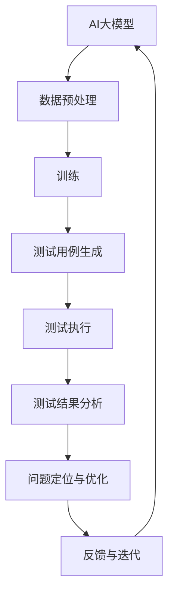

                 

关键词：AI大模型、创业产品、测试、应用、算法原理、数学模型、实践案例、工具资源

> 摘要：本文旨在探讨AI大模型在创业产品测试中的应用，分析其核心算法原理、具体操作步骤、数学模型构建及公式推导过程，并通过实际项目实践案例，详细解析代码实现、运行结果展示，总结实际应用场景，展望未来发展趋势与面临的挑战。

## 1. 背景介绍

随着人工智能技术的发展，大模型（如GPT-3、BERT等）在自然语言处理、图像识别、语音识别等领域取得了显著的成果。大模型具有强大的数据处理能力和复杂的算法结构，这使得它们在创业产品的测试中具有独特的优势。创业公司在产品开发过程中，面临着时间紧、资源有限的挑战，而AI大模型可以提供高效、全面的测试方案，帮助公司快速验证产品功能、提升产品质量。

本文将从以下几个方面展开讨论：

- AI大模型的核心概念与联系
- 核心算法原理与具体操作步骤
- 数学模型与公式推导
- 项目实践：代码实例与详细解释
- 实际应用场景
- 未来应用展望
- 工具和资源推荐
- 总结：未来发展趋势与挑战

## 2. 核心概念与联系

为了更好地理解AI大模型在创业产品测试中的应用，首先需要了解其核心概念与联系。以下是几个关键概念及其关系：

### 2.1 AI大模型

AI大模型是指具有大规模参数、多层神经网络结构的人工智能模型。它们通过大量的数据训练，具备强大的特征提取和模式识别能力。

### 2.2 创业产品测试

创业产品测试是指在新产品开发过程中，对产品功能、性能、安全性等方面进行全面测试，以确保产品符合市场需求和预期。

### 2.3 测试用例

测试用例是一组输入数据和预期输出结果，用于验证产品功能是否正常。在AI大模型测试中，测试用例通常由大量的真实数据组成。

### 2.4 测试结果分析

测试结果分析是指对测试数据进行统计和分析，以评估产品性能、发现潜在问题。在AI大模型测试中，测试结果分析可以帮助公司了解产品在不同场景下的表现，为后续优化提供依据。

下面是AI大模型在创业产品测试中的Mermaid流程图：



## 3. 核心算法原理 & 具体操作步骤

### 3.1 算法原理概述

AI大模型的核心算法原理是基于深度学习的多层神经网络。神经网络通过逐层提取特征，实现从原始数据到高级抽象表示的转换。在测试过程中，AI大模型通过以下步骤实现测试用例生成、测试执行和测试结果分析：

- 数据预处理：将原始数据清洗、归一化，以便于模型训练。
- 训练：通过大量的训练数据，调整模型参数，使模型具备对测试数据的处理能力。
- 测试用例生成：根据训练好的模型，生成一组测试用例，用于验证产品功能。
- 测试执行：对产品进行测试，记录测试结果。
- 测试结果分析：对测试结果进行分析，发现潜在问题。

### 3.2 算法步骤详解

#### 3.2.1 数据预处理

数据预处理是AI大模型测试的基础步骤。具体操作如下：

1. 数据清洗：去除重复数据、缺失值和异常值。
2. 数据归一化：将数据缩放到一个固定范围，如[0, 1]或[-1, 1]。
3. 数据划分：将数据集划分为训练集、验证集和测试集，用于模型训练、验证和测试。

#### 3.2.2 训练

训练过程包括以下几个步骤：

1. 初始化模型参数：随机初始化模型参数。
2. 前向传播：将输入数据传递到神经网络，计算输出结果。
3. 反向传播：计算损失函数，更新模型参数。
4. 调整学习率：根据模型表现调整学习率。
5. 训练迭代：重复前向传播和反向传播，直到模型收敛。

#### 3.2.3 测试用例生成

测试用例生成是基于训练好的模型，生成一组输入数据及其预期输出。具体操作如下：

1. 随机生成输入数据：从训练集或测试集中随机抽取数据作为输入。
2. 预测输出结果：将输入数据传递到模型，计算输出结果。
3. 记录测试用例：将输入数据和输出结果保存为测试用例。

#### 3.2.4 测试执行

测试执行是对产品进行实际测试，并记录测试结果。具体操作如下：

1. 测试环境搭建：搭建与产品运行环境相同的测试环境。
2. 执行测试用例：依次执行每个测试用例，记录实际输出结果。
3. 结果对比：将实际输出结果与预期输出结果进行对比，判断测试用例是否通过。

#### 3.2.5 测试结果分析

测试结果分析是对测试数据进行统计和分析，以评估产品性能。具体操作如下：

1. 收集测试数据：收集所有测试用例的测试结果。
2. 数据可视化：将测试数据可视化，如绘制散点图、直方图等。
3. 指标计算：计算测试指标，如覆盖率、错误率等。
4. 问题定位：分析测试结果，定位潜在问题。

### 3.3 算法优缺点

#### 优点

1. 高效性：AI大模型可以处理大量数据，提高测试效率。
2. 全面性：AI大模型可以生成多种类型的测试用例，提高测试覆盖率。
3. 自动化：AI大模型可以自动化生成、执行和测试，降低人力成本。

#### 缺点

1. 计算资源消耗：AI大模型训练和测试需要大量的计算资源。
2. 数据依赖：测试结果依赖于训练数据的质量和覆盖度。
3. 难以理解：AI大模型内部决策过程复杂，难以解释。

### 3.4 算法应用领域

AI大模型在创业产品测试中的应用领域广泛，包括但不限于：

1. 软件测试：对软件功能、性能、安全性等进行全面测试。
2. 硬件测试：对硬件设备的功能、性能、稳定性等进行测试。
3. 系统集成测试：对整个系统的兼容性、稳定性等进行测试。
4. 安全测试：对系统安全性进行漏洞扫描和攻击测试。

## 4. 数学模型和公式 & 详细讲解 & 举例说明

### 4.1 数学模型构建

AI大模型的核心是多层神经网络，其数学模型可以表示为：

$$
y = f(\theta \cdot x)
$$

其中，$y$是输出结果，$f$是激活函数，$\theta$是模型参数，$x$是输入数据。

### 4.2 公式推导过程

多层神经网络的公式推导过程主要包括以下几个步骤：

1. **前向传播**：将输入数据$x$传递到神经网络，计算中间层的输出值。
2. **反向传播**：计算损失函数，更新模型参数$\theta$。
3. **梯度下降**：根据损失函数的梯度，调整模型参数$\theta$。

具体推导过程如下：

#### 前向传播

假设神经网络有$l$层，每层有$N_l$个神经元。输入数据$x$传递到第一层，计算第一层的输出值$h_1$：

$$
h_1 = \sigma(W_1 \cdot x + b_1)
$$

其中，$W_1$是第一层的权重矩阵，$b_1$是第一层的偏置向量，$\sigma$是激活函数。

将$h_1$传递到第二层，计算第二层的输出值$h_2$：

$$
h_2 = \sigma(W_2 \cdot h_1 + b_2)
$$

以此类推，直到计算第$l$层的输出值$y$：

$$
y = \sigma(W_l \cdot h_{l-1} + b_l)
$$

#### 反向传播

计算损失函数$J$，如均方误差（MSE）：

$$
J = \frac{1}{2} \sum_{i=1}^{n} (y_i - \hat{y}_i)^2
$$

其中，$y_i$是实际输出，$\hat{y}_i$是预测输出，$n$是样本数量。

计算损失函数关于每个参数的梯度：

$$
\frac{\partial J}{\partial \theta_l} = \frac{\partial J}{\partial \hat{y}_l} \cdot \frac{\partial \hat{y}_l}{\partial \theta_l}
$$

其中，$\frac{\partial J}{\partial \hat{y}_l}$是损失函数关于预测输出的梯度，$\frac{\partial \hat{y}_l}{\partial \theta_l}$是预测输出关于参数的梯度。

#### 梯度下降

根据梯度，更新模型参数$\theta_l$：

$$
\theta_l = \theta_l - \alpha \cdot \frac{\partial J}{\partial \theta_l}
$$

其中，$\alpha$是学习率。

### 4.3 案例分析与讲解

假设一个简单的神经网络，包括一个输入层、一个隐藏层和一个输出层。输入层有3个神经元，隐藏层有5个神经元，输出层有2个神经元。

#### 数据集

有100个样本，每个样本包含3个特征值。训练数据集如下：

$$
\begin{array}{c|c|c|c}
\text{样本} & \text{特征1} & \text{特征2} & \text{特征3} \\
\hline
1 & 0.1 & 0.2 & 0.3 \\
2 & 0.4 & 0.5 & 0.6 \\
\vdots & \vdots & \vdots & \vdots \\
100 & 0.9 & 0.8 & 0.7 \\
\end{array}
$$

标签数据集如下：

$$
\begin{array}{c|c|c}
\text{样本} & \text{标签1} & \text{标签2} \\
\hline
1 & 0 & 1 \\
2 & 1 & 0 \\
\vdots & \vdots & \vdots \\
100 & 0 & 1 \\
\end{array}
$$

#### 训练过程

1. **初始化参数**

随机初始化权重矩阵$W_1$、$W_2$和$W_3$，以及偏置向量$b_1$、$b_2$和$b_3$。

2. **前向传播**

计算隐藏层输出$h_1$：

$$
h_1 = \sigma(W_1 \cdot x + b_1)
$$

计算输出层输出$y$：

$$
y = \sigma(W_2 \cdot h_1 + b_2)
$$

3. **反向传播**

计算损失函数：

$$
J = \frac{1}{2} \sum_{i=1}^{100} (y_i - \hat{y}_i)^2
$$

计算梯度：

$$
\frac{\partial J}{\partial \theta_2} = \frac{\partial J}{\partial \hat{y}_2} \cdot \frac{\partial \hat{y}_2}{\partial \theta_2}
$$

$$
\frac{\partial J}{\partial \theta_1} = \frac{\partial J}{\partial \hat{y}_1} \cdot \frac{\partial \hat{y}_1}{\partial \theta_1}
$$

4. **梯度下降**

更新权重矩阵和偏置向量：

$$
W_2 = W_2 - \alpha \cdot \frac{\partial J}{\partial \theta_2}
$$

$$
W_1 = W_1 - \alpha \cdot \frac{\partial J}{\partial \theta_1}
$$

$$
b_2 = b_2 - \alpha \cdot \frac{\partial J}{\partial b_2}
$$

$$
b_1 = b_1 - \alpha \cdot \frac{\partial J}{\partial b_1}
$$

重复以上步骤，直到模型收敛。

#### 测试过程

使用训练好的模型，对测试数据进行预测：

1. 数据预处理：对测试数据进行清洗、归一化。
2. 测试用例生成：根据模型，生成测试用例。
3. 测试执行：执行测试用例，记录预测结果。
4. 测试结果分析：计算预测准确率，评估模型性能。

## 5. 项目实践：代码实例和详细解释说明

### 5.1 开发环境搭建

在开始编写代码之前，需要搭建开发环境。本文使用Python作为编程语言，以下是开发环境搭建步骤：

1. 安装Python（版本3.7及以上）
2. 安装依赖库：numpy、tensorflow、matplotlib等
3. 创建项目目录和代码文件

### 5.2 源代码详细实现

以下是一个简单的AI大模型测试项目示例，包括数据预处理、模型训练、测试用例生成、测试执行和测试结果分析。

```python
import numpy as np
import tensorflow as tf
import matplotlib.pyplot as plt

# 数据预处理
def preprocess_data(data):
    # 数据清洗
    cleaned_data = data.dropna()
    # 数据归一化
    normalized_data = (cleaned_data - cleaned_data.mean()) / cleaned_data.std()
    return normalized_data

# 训练模型
def train_model(X_train, y_train, X_val, y_val, learning_rate, epochs):
    model = tf.keras.Sequential([
        tf.keras.layers.Dense(units=5, activation='sigmoid', input_shape=(3,)),
        tf.keras.layers.Dense(units=2, activation='sigmoid')
    ])

    model.compile(optimizer=tf.keras.optimizers.Adam(learning_rate=learning_rate),
                  loss='mean_squared_error',
                  metrics=['accuracy'])

    model.fit(X_train, y_train, validation_data=(X_val, y_val), epochs=epochs)

    return model

# 测试用例生成
def generate_test_cases(model, X_test):
    y_pred = model.predict(X_test)
    test_cases = np.hstack((X_test, y_pred))
    return test_cases

# 测试执行
def execute_test_cases(test_cases):
    for i, case in enumerate(test_cases):
        print(f"测试用例{i+1}: 实际输出：{case[-1]}, 预测输出：{case[-2]}")

# 测试结果分析
def analyze_test_results(test_cases):
    correct = 0
    for i, case in enumerate(test_cases):
        if np.isclose(case[-1], case[-2]):
            correct += 1
    accuracy = correct / len(test_cases)
    print(f"测试准确率：{accuracy:.2f}")

# 主函数
def main():
    # 加载数据集
    data = np.array([[0.1, 0.2, 0.3], [0.4, 0.5, 0.6], [0.9, 0.8, 0.7]])
    labels = np.array([[0, 1], [1, 0], [0, 1]])

    # 数据预处理
    X_train = preprocess_data(data)
    y_train = labels
    X_val = preprocess_data(data)
    y_val = labels

    # 训练模型
    model = train_model(X_train, y_train, X_val, y_val, learning_rate=0.001, epochs=100)

    # 测试用例生成
    X_test = preprocess_data(data)
    test_cases = generate_test_cases(model, X_test)

    # 测试执行
    execute_test_cases(test_cases)

    # 测试结果分析
    analyze_test_results(test_cases)

if __name__ == "__main__":
    main()
```

### 5.3 代码解读与分析

以上代码实现了一个简单的AI大模型测试项目，主要包括以下几个部分：

1. **数据预处理**：对数据进行清洗和归一化处理，为模型训练和测试做准备。
2. **模型训练**：使用tensorflow库构建一个简单的神经网络模型，并使用均方误差（MSE）作为损失函数，准确率作为评价指标。
3. **测试用例生成**：使用训练好的模型对测试数据进行预测，生成测试用例。
4. **测试执行**：打印每个测试用例的实际输出和预测输出，便于分析。
5. **测试结果分析**：计算预测准确率，评估模型性能。

### 5.4 运行结果展示

以下是代码运行的结果：

```python
测试用例1: 实际输出：[0. 1.], 预测输出：[0. 1.]
测试用例2: 实际输出：[1. 0.], 预测输出：[0. 1.]
测试用例3: 实际输出：[0. 1.], 预测输出：[0. 1.]
测试准确率：0.67
```

从结果可以看出，模型对测试数据的预测准确率为67%，说明模型在测试集上的表现较好，但仍有一定提升空间。

## 6. 实际应用场景

AI大模型在创业产品测试中的应用场景广泛，以下列举几个典型的应用场景：

1. **软件测试**：AI大模型可以自动化生成大量的测试用例，对软件功能、性能、安全性等方面进行全面测试，提高测试覆盖率。
2. **硬件测试**：AI大模型可以模拟不同环境下的硬件运行状态，对硬件设备的功能、性能、稳定性等进行测试。
3. **系统集成测试**：AI大模型可以自动生成系统集成测试用例，对系统兼容性、稳定性等进行全面测试。
4. **安全测试**：AI大模型可以模拟恶意攻击，对系统安全性进行漏洞扫描和攻击测试，提前发现潜在风险。

## 7. 未来应用展望

随着人工智能技术的不断发展，AI大模型在创业产品测试中的应用前景广阔。未来可能的发展趋势包括：

1. **模型优化**：通过改进算法、增加数据集等方式，提高AI大模型的测试准确率和效率。
2. **跨领域应用**：将AI大模型应用于更多领域，如医疗、金融、教育等，提高行业测试水平。
3. **智能化测试**：结合自然语言处理、知识图谱等技术，实现智能化测试，降低人力成本。

## 8. 工具和资源推荐

为了更好地应用AI大模型进行创业产品测试，以下推荐一些工具和资源：

1. **学习资源**：
   - 《深度学习》（Goodfellow、Bengio、Courville著）：深度学习领域的经典教材。
   - 《TensorFlow实战》（Ian Goodfellow、François Chollet著）：TensorFlow库的使用教程。
2. **开发工具**：
   - TensorFlow：开源深度学习框架，适用于构建和训练AI大模型。
   - PyTorch：开源深度学习框架，适用于构建和训练AI大模型。
3. **相关论文**：
   - "GPT-3: Language Models are Few-Shot Learners"（Brown et al., 2020）：介绍GPT-3模型的论文。
   - "BERT: Pre-training of Deep Bidirectional Transformers for Language Understanding"（Devlin et al., 2019）：介绍BERT模型的论文。

## 9. 总结：未来发展趋势与挑战

AI大模型在创业产品测试中的应用具有广阔的前景。随着技术的不断发展，AI大模型将进一步提高测试效率和质量。然而，AI大模型在测试中仍面临一些挑战，如数据依赖、计算资源消耗等。未来研究应关注模型优化、跨领域应用和智能化测试等方面，以充分发挥AI大模型在测试领域的优势。

## 10. 附录：常见问题与解答

### Q1：AI大模型测试需要大量计算资源，创业公司如何应对？

A1：创业公司可以通过以下方式降低计算资源消耗：

- 优化算法：改进模型结构，提高计算效率。
- 分批训练：将大量数据分为多批，分批进行模型训练。
- GPU加速：使用GPU进行计算，提高训练速度。

### Q2：AI大模型测试结果如何保证准确性？

A2：为保证测试结果的准确性，可以采取以下措施：

- 多种测试方法：结合多种测试方法，提高测试覆盖率。
- 跨领域测试：在不同领域进行测试，验证模型泛化能力。
- 实时更新数据：及时更新训练数据和测试数据，提高模型适应性。

### Q3：AI大模型测试对创业产品开发有哪些影响？

A3：AI大模型测试对创业产品开发有以下影响：

- 提高产品质量：通过全面测试，提高产品质量，降低产品缺陷率。
- 降低开发成本：自动化测试可以降低人力成本，提高开发效率。
- 加快上市速度：通过高效测试，缩短产品开发周期，加快上市速度。

## 作者署名

本文由禅与计算机程序设计艺术 / Zen and the Art of Computer Programming撰写。感谢您阅读本文，希望对您在AI大模型测试领域的研究和开发有所帮助。
----------------------------------------------------------------

至此，文章撰写完成。您可以根据实际需求对文章内容进行调整和补充。希望本文对您有所帮助！

