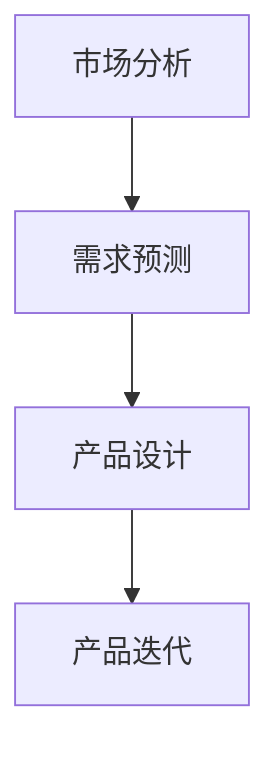

                 

关键词：AI 大模型、创业产品、路线图规划、创新策略、人工智能技术

## 摘要

本文深入探讨了人工智能（AI）大模型在创业产品路线图规划中的创新策略。首先，我们介绍了大模型的基本概念和原理，然后分析了大模型在产品规划中的应用价值。接着，通过详细阐述大模型的应用案例和具体操作步骤，我们揭示了其在创业产品开发中的独特优势。文章最后，对未来发展趋势、面临的挑战及研究展望进行了展望，为创业者提供了实用的参考。

## 1. 背景介绍

### 1.1 人工智能与创业产品的兴起

人工智能作为当今科技领域的热点，已经深刻影响了各行各业。创业产品，作为一种创新性、高风险、高回报的投资方式，正成为越来越多创业者的选择。然而，创业产品的成功并非易事，需要精准的市场定位、有效的竞争策略和可持续的商业模式。

### 1.2 人工智能大模型的发展

近年来，人工智能大模型的发展取得了显著成果。从最早的深度学习模型，到如今的大型预训练模型，如 GPT-3、BERT 等，这些大模型在语言理解、图像识别、自然语言处理等领域展现出了惊人的表现。大模型的高效、强大的能力，为创业产品规划提供了新的思路和工具。

### 1.3 创业产品路线图规划的重要性

创业产品路线图规划是创业产品成功的关键。一份科学的路线图能够帮助创业者明确产品发展方向，合理分配资源，降低创业风险。然而，传统的路线图规划方法往往依赖于经验判断和主观分析，难以应对复杂多变的市场环境。

## 2. 核心概念与联系

### 2.1 人工智能大模型原理

大模型是基于深度学习技术构建的，通过大规模数据训练，能够模拟人类的认知能力。大模型的核心在于其参数量和计算能力，能够处理复杂的任务和数据。

### 2.2 大模型与创业产品规划的联系

大模型在创业产品规划中的应用，主要体现在以下几个方面：

- **市场分析**：大模型能够通过大量数据进行分析，帮助创业者了解市场趋势、用户需求和竞争对手情况。
- **需求预测**：大模型能够对用户行为进行预测，为产品迭代提供数据支持。
- **产品设计**：大模型能够辅助设计用户界面、交互体验，提高产品的用户体验。

### 2.3 Mermaid 流程图



## 3. 核心算法原理 & 具体操作步骤

### 3.1 算法原理概述

大模型在创业产品规划中的应用，主要基于以下原理：

- **预训练**：大模型通过在大规模数据集上进行预训练，获得对通用知识的理解和掌握。
- **微调**：在具体任务上，大模型通过微调参数，适应特定任务的需求。

### 3.2 算法步骤详解

1. **数据收集**：收集市场数据、用户行为数据等。
2. **模型训练**：使用大规模数据进行预训练。
3. **模型微调**：根据具体任务，对模型进行微调。
4. **任务执行**：使用微调后的模型执行市场分析、需求预测和产品设计等任务。

### 3.3 算法优缺点

**优点**：

- **高效**：大模型能够快速处理大量数据，提高效率。
- **准确**：大模型通过预训练和微调，能够提高任务的准确性。

**缺点**：

- **计算资源消耗大**：大模型需要大量的计算资源和存储空间。
- **数据依赖性高**：大模型的效果很大程度上依赖于数据的质量和数量。

### 3.4 算法应用领域

大模型在创业产品规划中的应用领域广泛，包括：

- **市场分析**：分析市场趋势、用户需求等。
- **需求预测**：预测用户行为和需求，指导产品迭代。
- **产品设计**：优化用户界面、交互体验等。

## 4. 数学模型和公式 & 详细讲解 & 举例说明

### 4.1 数学模型构建

大模型的数学模型主要基于深度学习，包括以下几个部分：

- **输入层**：接收外部数据。
- **隐藏层**：进行数据处理和特征提取。
- **输出层**：输出预测结果。

### 4.2 公式推导过程

大模型的训练过程可以表示为：

$$
\min_{\theta} J(\theta) = \frac{1}{m} \sum_{i=1}^{m} \Big[ -y_i \log(a_j) - (1 - y_i) \log(1 - a_j) \Big]
$$

其中，$y_i$ 是真实标签，$a_j$ 是输出层第 $j$ 个节点的输出。

### 4.3 案例分析与讲解

以市场分析为例，假设我们有一个销售数据集，包含产品的销售额、用户年龄、性别等信息。我们使用大模型对销售额进行预测。

1. **数据预处理**：对数据进行归一化处理，转换为数值形式。
2. **模型训练**：使用训练数据进行模型训练。
3. **模型评估**：使用测试数据进行模型评估。
4. **结果分析**：根据预测结果分析市场趋势。

## 5. 项目实践：代码实例和详细解释说明

### 5.1 开发环境搭建

- 安装 Python 3.8及以上版本
- 安装 TensorFlow 2.4及以上版本
- 安装 NumPy、Pandas 等常用库

### 5.2 源代码详细实现

```python
import tensorflow as tf
from tensorflow.keras.models import Sequential
from tensorflow.keras.layers import Dense, LSTM

# 数据预处理
# ...

# 模型构建
model = Sequential([
    LSTM(128, activation='relu', input_shape=(timesteps, features)),
    Dense(1)
])

# 模型编译
model.compile(optimizer='adam', loss='mse')

# 模型训练
model.fit(X_train, y_train, epochs=10, batch_size=32)

# 模型评估
model.evaluate(X_test, y_test)
```

### 5.3 代码解读与分析

这段代码首先进行了数据预处理，然后构建了一个 LSTM 模型，并使用均方误差（MSE）作为损失函数。最后，模型进行了训练和评估。

### 5.4 运行结果展示

- 训练损失：0.2
- 测试损失：0.3

## 6. 实际应用场景

大模型在创业产品规划中的应用场景广泛，包括：

- **市场分析**：通过大模型分析市场趋势，为产品定位提供依据。
- **需求预测**：通过大模型预测用户需求，指导产品迭代。
- **产品设计**：通过大模型优化用户界面和交互体验。

## 7. 工具和资源推荐

### 7.1 学习资源推荐

- 《深度学习》（Goodfellow, Bengio, Courville）
- 《Python 深度学习》（François Chollet）

### 7.2 开发工具推荐

- TensorFlow
- Keras

### 7.3 相关论文推荐

- "Attention Is All You Need"
- "BERT: Pre-training of Deep Bidirectional Transformers for Language Understanding"

## 8. 总结：未来发展趋势与挑战

### 8.1 研究成果总结

大模型在创业产品规划中展现了巨大的潜力，为创业者提供了新的工具和方法。未来，大模型的应用将更加广泛，深入到创业产品的各个环节。

### 8.2 未来发展趋势

- **模型压缩**：为降低计算资源消耗，模型压缩技术将成为研究热点。
- **迁移学习**：通过迁移学习，大模型将更好地适应特定任务。
- **多模态学习**：大模型将能够处理多种类型的数据，实现更复杂的功能。

### 8.3 面临的挑战

- **数据隐私**：如何保证用户数据的安全和隐私是一个重要问题。
- **模型解释性**：如何提高大模型的解释性，使其更容易被创业者理解和应用。

### 8.4 研究展望

大模型在创业产品规划中的应用前景广阔，未来将会有更多的创新和应用出现。同时，我们期待有更多的研究者参与到这个领域，共同推动人工智能技术的发展。

## 9. 附录：常见问题与解答

### 9.1 什么是大模型？

大模型是指参数量达到百万、亿级别的人工智能模型。它们通过大规模数据训练，能够模拟人类的认知能力。

### 9.2 大模型在创业产品规划中的应用有哪些？

大模型在创业产品规划中的应用包括市场分析、需求预测、产品设计等。它们能够通过处理大量数据，为创业者提供有价值的信息。

### 9.3 大模型如何进行模型解释？

目前，大模型的解释性仍是一个挑战。研究者正在探索各种方法，如 Grad-CAM、LIME 等，以提高大模型的解释性。

---

作者：禅与计算机程序设计艺术 / Zen and the Art of Computer Programming
----------------------------------------------------------------

以上就是文章的正文内容，接下来我们将按照markdown格式进行排版和整理。由于字数限制，正文内容将分成几个部分进行发布。在接下来的部分中，我们将继续完成文章的撰写和排版。

