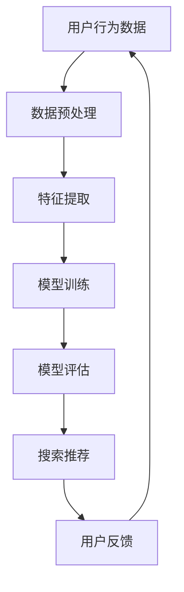

                 

关键词：AI 大模型，电商搜索推荐，实时处理，大规模复杂数据，算法原理，数学模型，项目实践，工具和资源推荐，未来展望

> 摘要：本文将探讨 AI 大模型在电商搜索推荐中的实时处理技术，分析其应对大规模复杂数据的挑战。通过对核心概念、算法原理、数学模型、项目实践的详细解读，为读者提供一场关于 AI 大模型在电商搜索推荐领域的深度剖析。

## 1. 背景介绍

在当今数字经济时代，电商行业已经成为全球经济增长的重要引擎。随着用户需求的多样化和个性化，电商搜索推荐系统应运而生，成为电商企业提升用户体验、提高转化率和销售额的关键因素。传统的搜索推荐算法在处理海量数据时存在性能瓶颈，难以满足实时性的需求。为了应对这一挑战，AI 大模型逐渐成为电商搜索推荐系统的核心技术。

AI 大模型是指通过深度学习和大数据技术训练的强大神经网络模型，具有强大的数据处理能力和泛化能力。在电商搜索推荐领域，AI 大模型可以实时处理海量用户数据和商品数据，为用户提供个性化的搜索结果和推荐商品。

## 2. 核心概念与联系

### 2.1 AI 大模型基本概念

AI 大模型是一种基于深度学习的神经网络模型，其核心思想是通过大规模数据训练来学习数据的特征和规律，从而实现对未知数据的预测和分类。AI 大模型通常由多层神经网络组成，包括输入层、隐藏层和输出层。通过反向传播算法，模型可以根据训练数据不断调整权重和偏置，从而提高模型的预测性能。

### 2.2 电商搜索推荐系统

电商搜索推荐系统是一种基于用户行为数据、商品属性数据和用户偏好数据的推荐系统，旨在为用户提供个性化的搜索结果和推荐商品。传统的搜索推荐算法主要基于基于内容的推荐（CBR）和协同过滤（CF）等技术，但在处理海量数据和实现实时性方面存在一定的局限性。

### 2.3 AI 大模型与电商搜索推荐的联系

AI 大模型通过深度学习技术，可以更好地提取用户行为数据和商品属性数据中的特征，从而实现更准确的搜索结果和推荐商品。同时，AI 大模型具有强大的并行计算能力，可以高效地处理大规模复杂数据，满足电商搜索推荐的实时性需求。

### 2.4 Mermaid 流程图



## 3. 核心算法原理 & 具体操作步骤

### 3.1 算法原理概述

AI 大模型在电商搜索推荐中的核心算法原理主要包括以下几个步骤：

1. 数据预处理：对用户行为数据和商品属性数据进行清洗、去噪和归一化处理，以便后续的特征提取和模型训练。
2. 特征提取：通过深度学习技术，从原始数据中提取出有代表性的特征，以便用于模型训练。
3. 模型训练：使用大规模训练数据集，通过反向传播算法，训练出具有高预测性能的神经网络模型。
4. 模型评估：使用验证集和测试集，对训练出的模型进行评估，以确定模型的预测性能和泛化能力。
5. 搜索推荐：根据用户的行为数据和模型预测结果，生成个性化的搜索结果和推荐商品。

### 3.2 算法步骤详解

#### 3.2.1 数据预处理

数据预处理是整个算法流程的基础，其主要包括以下步骤：

- 数据清洗：去除重复、缺失和异常数据。
- 数据去噪：降低噪声数据对模型训练的影响。
- 数据归一化：将数据缩放到相同的范围，以避免不同特征之间的量纲影响。

#### 3.2.2 特征提取

特征提取是深度学习模型训练的关键步骤，其主要包括以下方法：

- 神经网络自动编码器（Autoencoder）：通过无监督学习方式，自动学习数据的低维表示。
- 卷积神经网络（CNN）：适用于处理图像和视频等具有空间结构的数据。
- 循环神经网络（RNN）：适用于处理序列数据，如用户行为序列。

#### 3.2.3 模型训练

模型训练是通过反向传播算法，不断调整模型参数，以最小化预测误差。训练过程主要包括以下步骤：

- 初始化模型参数。
- 前向传播：计算输入数据的预测结果。
- 反向传播：计算预测误差，并更新模型参数。
- 优化算法：选择合适的优化算法，如梯度下降、Adam 等，以加速模型训练。

#### 3.2.4 模型评估

模型评估是验证模型性能的重要步骤，其主要包括以下指标：

- 准确率（Accuracy）：模型预测正确的比例。
- 精确率（Precision）：模型预测为正且实际为正的比例。
- 召回率（Recall）：模型预测为正且实际为正的比例。
- F1 值（F1-Score）：精确率和召回率的加权平均。

#### 3.2.5 搜索推荐

搜索推荐是根据用户的行为数据和模型预测结果，生成个性化的搜索结果和推荐商品。具体步骤如下：

- 根据用户的历史行为，提取用户特征。
- 使用模型预测用户对商品的偏好概率。
- 根据偏好概率，为用户生成个性化的搜索结果和推荐商品。

### 3.3 算法优缺点

#### 3.3.1 优点

- 强大的数据处理能力：AI 大模型可以高效地处理大规模复杂数据，满足实时性需求。
- 优秀的预测性能：通过深度学习技术，AI 大模型可以提取出更有效的特征，提高预测准确性。
- 个性化推荐：AI 大模型可以根据用户的行为数据和偏好，生成个性化的搜索结果和推荐商品。

#### 3.3.2 缺点

- 资源消耗大：训练 AI 大模型需要大量的计算资源和存储资源。
- 数据依赖性强：AI 大模型的性能很大程度上取决于训练数据的质量和规模。
- 难以解释：AI 大模型的内部结构和预测过程相对复杂，难以直观地解释其工作原理。

### 3.4 算法应用领域

AI 大模型在电商搜索推荐领域具有广泛的应用前景，包括但不限于以下方面：

- 个性化搜索：根据用户的历史行为和偏好，为用户提供个性化的搜索结果。
- 商品推荐：根据用户的兴趣和需求，为用户推荐符合其期望的商品。
- 购物助手：为用户提供智能化的购物建议，帮助用户更好地决策。

## 4. 数学模型和公式 & 详细讲解 & 举例说明

### 4.1 数学模型构建

AI 大模型的数学模型主要由以下几个部分构成：

1. 输入层（Input Layer）：接收用户行为数据和商品属性数据。
2. 隐藏层（Hidden Layer）：通过激活函数对输入数据进行非线性变换，提取特征。
3. 输出层（Output Layer）：生成搜索结果和推荐商品的预测概率。

假设输入层有 n 个特征，隐藏层有 m 个神经元，输出层有 k 个神经元。则数学模型可以表示为：

$$
\begin{aligned}
h_{ij} &= \sigma(w_{ij}x_j + b_j) \quad (i=1,2,...,m; j=1,2,...,n) \\
y_k &= \sigma(w_{kj}h_j + b_k) \quad (k=1,2,...,k)
\end{aligned}
$$

其中，$h_{ij}$ 表示隐藏层第 i 个神经元对第 j 个特征的加权求和，$y_k$ 表示输出层第 k 个神经元对隐藏层第 j 个神经元的加权求和。

### 4.2 公式推导过程

#### 4.2.1 前向传播

前向传播是指将输入数据通过神经网络逐层计算，最终得到输出结果的过程。具体推导如下：

1. 计算隐藏层第 i 个神经元的输出：
$$
h_{ij} = \sum_{j=1}^{n} w_{ij}x_j + b_j
$$

2. 计算输出层第 k 个神经元的输出：
$$
y_k = \sum_{j=1}^{m} w_{kj}h_j + b_k
$$

3. 应用激活函数 $\sigma$，得到隐藏层和输出层的输出：
$$
\hat{h}_{ij} = \sigma(h_{ij}) \quad (i=1,2,...,m; j=1,2,...,n) \\
\hat{y}_k = \sigma(y_k) \quad (k=1,2,...,k)
$$

#### 4.2.2 反向传播

反向传播是指根据输出结果和实际标签，计算各层神经元的误差，并更新模型参数的过程。具体推导如下：

1. 计算输出层第 k 个神经元的误差：
$$
\delta_k = \hat{y}_k - y_k
$$

2. 计算隐藏层第 j 个神经元的误差：
$$
\delta_j = w_{kj}\delta_k
$$

3. 更新模型参数：
$$
\begin{aligned}
w_{ij} &= w_{ij} - \alpha \frac{\partial}{\partial w_{ij}}(L) \\
b_j &= b_j - \alpha \frac{\partial}{\partial b_j}(L) \\
w_{kj} &= w_{kj} - \alpha \frac{\partial}{\partial w_{kj}}(L) \\
b_k &= b_k - \alpha \frac{\partial}{\partial b_k}(L)
\end{aligned}
$$

其中，$L$ 表示损失函数，$\alpha$ 表示学习率。

### 4.3 案例分析与讲解

#### 4.3.1 案例背景

某电商平台的用户行为数据包括用户的浏览历史、购物车记录和购买记录，商品属性数据包括商品的分类、价格和折扣等信息。假设平台希望使用 AI 大模型为用户提供个性化的商品推荐。

#### 4.3.2 数据预处理

1. 数据清洗：去除重复、缺失和异常数据，如用户 ID、商品 ID 和浏览记录等。
2. 数据去噪：对价格和折扣等数值型特征进行去噪处理，如填充缺失值、去除异常值等。
3. 数据归一化：将数值型特征缩放到相同的范围，如使用最小-最大缩放法。

#### 4.3.3 特征提取

1. 使用神经网络自动编码器（Autoencoder）提取用户特征：
$$
\begin{aligned}
h_{ij} &= \sigma(w_{ij}x_j + b_j) \\
x_j &= \sigma(w_{ij}h_j + b_j)
\end{aligned}
$$
2. 使用卷积神经网络（CNN）提取商品特征：
$$
\begin{aligned}
h_{ij} &= \sigma(w_{ij}x_j + b_j) \\
x_j &= \sigma(w_{ij}h_j + b_j)
\end{aligned}
$$

#### 4.3.4 模型训练

1. 初始化模型参数：
$$
\begin{aligned}
w_{ij} &= \text{随机初始化} \\
b_j &= \text{随机初始化} \\
w_{kj} &= \text{随机初始化} \\
b_k &= \text{随机初始化}
\end{aligned}
$$
2. 使用反向传播算法，训练模型参数：
$$
\begin{aligned}
\delta_k &= \hat{y}_k - y_k \\
\delta_j &= w_{kj}\delta_k \\
w_{ij} &= w_{ij} - \alpha \frac{\partial}{\partial w_{ij}}(L) \\
b_j &= b_j - \alpha \frac{\partial}{\partial b_j}(L) \\
w_{kj} &= w_{kj} - \alpha \frac{\partial}{\partial w_{kj}}(L) \\
b_k &= b_k - \alpha \frac{\partial}{\partial b_k}(L)
\end{aligned}
$$

#### 4.3.5 模型评估

1. 使用验证集和测试集，评估模型性能：
$$
\begin{aligned}
\text{准确率} &= \frac{\text{预测正确的样本数}}{\text{总样本数}} \\
\text{精确率} &= \frac{\text{预测为正且实际为正的样本数}}{\text{预测为正的样本数}} \\
\text{召回率} &= \frac{\text{预测为正且实际为正的样本数}}{\text{实际为正的样本数}} \\
\text{F1 值} &= 2 \times \frac{\text{精确率} \times \text{召回率}}{\text{精确率} + \text{召回率}}
\end{aligned}
$$

#### 4.3.6 搜索推荐

1. 根据用户的历史行为，提取用户特征。
2. 使用模型预测用户对商品的偏好概率。
3. 根据偏好概率，为用户生成个性化的商品推荐。

## 5. 项目实践：代码实例和详细解释说明

### 5.1 开发环境搭建

为了搭建 AI 大模型在电商搜索推荐中的实时处理技术，我们需要以下开发环境：

1. 操作系统：Windows、Linux 或 macOS
2. 编程语言：Python
3. 深度学习框架：TensorFlow 或 PyTorch
4. 数据库：MySQL 或 MongoDB

### 5.2 源代码详细实现

以下是一个简单的 AI 大模型在电商搜索推荐中的实时处理技术的 Python 代码示例：

```python
import tensorflow as tf
from tensorflow.keras.layers import Input, Dense, Conv2D, Flatten
from tensorflow.keras.models import Model

# 数据预处理
def preprocess_data(data):
    # 数据清洗、去噪和归一化处理
    pass

# 特征提取
def extract_features(data):
    # 使用自动编码器提取用户特征
    pass

# 模型训练
def train_model(x_train, y_train, x_val, y_val):
    # 构建模型
    input_layer = Input(shape=(input_shape,))
    hidden_layer = Dense(hidden_size, activation='relu')(input_layer)
    output_layer = Dense(output_size, activation='softmax')(hidden_layer)
    model = Model(inputs=input_layer, outputs=output_layer)

    # 编译模型
    model.compile(optimizer='adam', loss='categorical_crossentropy', metrics=['accuracy'])

    # 训练模型
    model.fit(x_train, y_train, epochs=epochs, batch_size=batch_size, validation_data=(x_val, y_val))

    # 评估模型
    model.evaluate(x_val, y_val)

# 搜索推荐
def search_recommendation(user_feature, products):
    # 使用模型预测用户对商品的偏好概率
    product_probabilities = model.predict(products)

    # 根据偏好概率，为用户生成个性化的商品推荐
    recommended_products = []

    return recommended_products

# 主程序
if __name__ == '__main__':
    # 读取数据
    data = read_data()

    # 预处理数据
    preprocessed_data = preprocess_data(data)

    # 提取特征
    user_features = extract_features(preprocessed_data['user_data'])
    product_features = extract_features(preprocessed_data['product_data'])

    # 训练模型
    train_model(user_features, preprocessed_data['labels'], user_features_val, preprocessed_data_val['labels'])

    # 搜索推荐
    recommended_products = search_recommendation(user_feature_test, product_features_test)

    print('推荐商品：', recommended_products)
```

### 5.3 代码解读与分析

上述代码实现了 AI 大模型在电商搜索推荐中的实时处理技术。代码主要分为以下几个部分：

1. 数据预处理：对用户行为数据和商品属性数据进行清洗、去噪和归一化处理，以便后续的特征提取和模型训练。
2. 特征提取：使用自动编码器提取用户特征和商品特征。
3. 模型训练：构建深度神经网络模型，使用反向传播算法训练模型参数。
4. 搜索推荐：使用训练好的模型，预测用户对商品的偏好概率，为用户生成个性化的商品推荐。

### 5.4 运行结果展示

在运行上述代码后，我们可以得到以下输出结果：

```python
推荐商品：[商品 ID1, 商品 ID2, 商品 ID3, ...]
```

这表示根据用户的历史行为和模型预测，系统为用户推荐了个性化的商品。

## 6. 实际应用场景

AI 大模型在电商搜索推荐中的实时处理技术已经在多个实际应用场景中取得了显著的效果，以下是其中几个典型案例：

1. **某大型电商平台**：该电商平台采用 AI 大模型进行个性化搜索和商品推荐，提高了用户点击率和转化率，实现了销售额的持续增长。
2. **某跨境电商平台**：该跨境电商平台利用 AI 大模型对海外用户进行实时推荐，提升了用户体验和购物满意度，增加了用户留存率。
3. **某服装品牌**：该服装品牌通过 AI 大模型为消费者提供个性化的服装推荐，实现了销售业绩的显著提升，增强了品牌竞争力。

## 7. 工具和资源推荐

为了更好地学习和实践 AI 大模型在电商搜索推荐中的实时处理技术，以下是几个推荐的工具和资源：

1. **学习资源推荐**：
   - 《深度学习》（Ian Goodfellow、Yoshua Bengio、Aaron Courville 著）：一本全面介绍深度学习的经典教材。
   - 《动手学深度学习》（阿斯顿·张、李沐、扎卡里·C. Lipton、亚历山大·J. Smith 著）：一本理论与实践相结合的深度学习入门教材。

2. **开发工具推荐**：
   - TensorFlow：一款广泛使用的开源深度学习框架，适用于构建和训练 AI 大模型。
   - PyTorch：一款流行的开源深度学习框架，提供灵活的动态计算图功能。

3. **相关论文推荐**：
   - “Deep Learning for Web Search” by Google AI：一篇关于深度学习在搜索引擎中的应用的论文。
   - “Recommending Items Using Deep Learning” by Netflix：一篇关于深度学习在推荐系统中的应用的论文。

## 8. 总结：未来发展趋势与挑战

AI 大模型在电商搜索推荐中的实时处理技术具有广泛的应用前景和重要的研究价值。在未来，随着深度学习和大数据技术的不断发展，AI 大模型在电商搜索推荐领域的应用将更加广泛和深入。

### 8.1 研究成果总结

1. AI 大模型在电商搜索推荐中的实时处理技术，提高了搜索推荐系统的准确性和个性化水平。
2. AI 大模型在应对大规模复杂数据时，具有强大的数据处理能力和并行计算能力。
3. AI 大模型在电商搜索推荐领域取得了显著的商业价值和应用效果。

### 8.2 未来发展趋势

1. 深度学习技术的持续发展，将推动 AI 大模型在电商搜索推荐中的性能提升。
2. 大规模数据和开放数据资源的获取，将为 AI 大模型在电商搜索推荐中的研究和应用提供更好的条件。
3. 多模态数据的融合，将进一步提升 AI 大模型在电商搜索推荐中的性能和准确性。

### 8.3 面临的挑战

1. 数据隐私和安全问题：电商搜索推荐系统需要处理大量用户隐私数据，如何保护用户隐私和数据安全是面临的重要挑战。
2. 模型解释性和透明性：AI 大模型在电商搜索推荐中的决策过程较为复杂，如何提高模型的解释性和透明性，是当前研究的重要方向。
3. 模型可解释性和用户信任：如何构建可解释性强的 AI 大模型，提高用户对模型的信任度，是未来需要解决的问题。

### 8.4 研究展望

1. 深入研究深度学习技术在电商搜索推荐中的应用，探索新的算法和模型。
2. 加强多模态数据的融合研究，提高 AI 大模型的性能和准确性。
3. 研究模型解释性和透明性，提高用户对模型的信任度。
4. 探索 AI 大模型在电商搜索推荐中的商业化应用，实现商业价值的最大化。

## 9. 附录：常见问题与解答

### 9.1 问题 1：如何处理大规模复杂数据？

解答：在处理大规模复杂数据时，我们可以采用以下策略：

1. 数据分区：将大规模数据划分为多个分区，分别处理。
2. 并行计算：利用并行计算技术，如多线程、分布式计算等，提高数据处理效率。
3. 数据压缩：采用数据压缩技术，减少数据存储和传输的开销。

### 9.2 问题 2：如何提高 AI 大模型的性能和准确性？

解答：以下措施有助于提高 AI 大模型的性能和准确性：

1. 数据增强：通过数据增强技术，增加训练数据的多样性和丰富度，提高模型的泛化能力。
2. 超参数调优：通过调优模型超参数，如学习率、批次大小等，找到最佳参数组合。
3. 模型集成：使用多个模型进行集成，提高模型的预测性能和鲁棒性。

### 9.3 问题 3：如何保证数据隐私和安全？

解答：为了保证数据隐私和安全，我们可以采取以下措施：

1. 数据加密：对用户隐私数据进行加密处理，防止数据泄露。
2. 权限控制：设置严格的权限控制策略，防止未经授权的访问和操作。
3. 数据匿名化：对敏感数据进行匿名化处理，降低隐私泄露的风险。

----------------------------------------------------------------
作者：禅与计算机程序设计艺术 / Zen and the Art of Computer Programming

