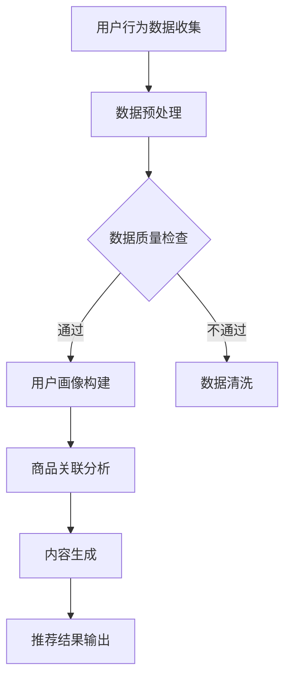

                 

关键词：AI 大模型、电商搜索推荐、数据安全策略、用户隐私、数据可靠性

摘要：随着人工智能技术的快速发展，AI 大模型在电商搜索推荐中的应用日益广泛。然而，在提供个性化推荐的同时，数据安全和用户隐私问题也日益凸显。本文将从数据安全策略的角度，探讨如何在电商搜索推荐中保障用户隐私和数据可靠性，以期为相关领域的研究和实践提供参考。

## 1. 背景介绍

随着互联网的普及和电子商务的快速发展，电商搜索推荐系统已经成为电商企业提升用户体验和转化率的重要手段。AI 大模型以其强大的数据处理能力和自主学习能力，为电商搜索推荐提供了有力的技术支持。然而，AI 大模型在应用过程中面临着诸多挑战，其中最为突出的就是数据安全和用户隐私问题。

### 1.1 AI 大模型在电商搜索推荐中的应用

AI 大模型在电商搜索推荐中的应用主要包括以下几个方面：

1. **用户画像构建**：通过分析用户的浏览历史、购买行为等数据，构建用户的个性化画像，以便进行精准推荐。
2. **商品关联分析**：利用 AI 大模型对商品数据进行分析，挖掘商品之间的关联关系，为用户提供相关推荐。
3. **内容生成**：生成个性化商品描述、标题等，提高用户点击率和转化率。

### 1.2 数据安全和用户隐私问题的挑战

在电商搜索推荐中，数据安全和用户隐私问题主要包括以下几个方面：

1. **数据泄露风险**：电商平台的用户数据涉及个人信息，一旦泄露，可能导致用户隐私泄露和财产损失。
2. **数据滥用风险**：部分企业可能滥用用户数据，进行不正当营销或利益输送。
3. **算法偏见**：AI 大模型可能因为数据偏见而导致推荐结果不公平，影响用户体验。

## 2. 核心概念与联系

在探讨 AI 大模型在电商搜索推荐中的数据安全策略之前，我们首先需要了解一些核心概念和联系。

### 2.1 数据安全策略

数据安全策略是指为了保障数据安全而采取的一系列措施，包括数据加密、访问控制、数据备份等。

### 2.2 用户隐私保护

用户隐私保护是指为了保护用户的个人信息和隐私而采取的一系列措施，包括隐私政策、用户数据匿名化等。

### 2.3 数据可靠性

数据可靠性是指数据在存储、传输和使用过程中的准确性和完整性。

### 2.4 Mermaid 流程图

下面是一个简单的 Mermaid 流程图，展示了 AI 大模型在电商搜索推荐中的数据处理流程。



## 3. 核心算法原理 & 具体操作步骤

### 3.1 算法原理概述

在电商搜索推荐中，AI 大模型的核心算法主要包括用户画像构建、商品关联分析和内容生成等。

1. **用户画像构建**：通过分析用户的浏览历史、购买行为等数据，利用机器学习算法构建用户的个性化画像。
2. **商品关联分析**：利用图神经网络等算法对商品数据进行分析，挖掘商品之间的关联关系。
3. **内容生成**：利用生成对抗网络（GAN）等算法生成个性化商品描述、标题等。

### 3.2 算法步骤详解

1. **用户画像构建**：
   - 数据收集：收集用户的浏览历史、购买行为等数据。
   - 数据预处理：对数据进行清洗、归一化等预处理操作。
   - 特征提取：利用词嵌入等技术提取用户行为的特征。
   - 画像构建：利用聚类、回归等算法构建用户的个性化画像。

2. **商品关联分析**：
   - 数据收集：收集商品的基本信息、用户评价等数据。
   - 数据预处理：对数据进行清洗、归一化等预处理操作。
   - 特征提取：利用词嵌入等技术提取商品的特征。
   - 关联分析：利用图神经网络等算法挖掘商品之间的关联关系。

3. **内容生成**：
   - 数据收集：收集商品的标题、描述等数据。
   - 数据预处理：对数据进行清洗、归一化等预处理操作。
   - 特征提取：利用词嵌入等技术提取商品的特征。
   - 内容生成：利用生成对抗网络（GAN）等算法生成个性化商品描述、标题等。

### 3.3 算法优缺点

1. **用户画像构建**：
   - 优点：能够准确反映用户的个性化需求，提高推荐精度。
   - 缺点：数据收集和处理过程中可能涉及用户隐私问题，需要严格保护用户隐私。

2. **商品关联分析**：
   - 优点：能够发现商品之间的关联关系，为用户提供相关推荐。
   - 缺点：算法复杂度高，计算资源消耗大。

3. **内容生成**：
   - 优点：能够生成高质量的个性化内容，提高用户点击率和转化率。
   - 缺点：算法质量不稳定，有时生成的内容可能与用户期望不符。

### 3.4 算法应用领域

AI 大模型在电商搜索推荐中的应用不仅限于上述三个领域，还可以应用于以下领域：

1. **个性化搜索**：利用用户画像和商品关联分析，为用户提供个性化搜索结果。
2. **商品推荐**：利用用户画像和商品关联分析，为用户提供个性化商品推荐。
3. **广告投放**：利用用户画像和商品关联分析，为用户提供个性化广告。

## 4. 数学模型和公式 & 详细讲解 & 举例说明

### 4.1 数学模型构建

在电商搜索推荐中，常用的数学模型包括用户画像构建模型、商品关联分析模型和内容生成模型。

1. **用户画像构建模型**：

   假设用户行为数据集为 $\{x_1, x_2, ..., x_n\}$，其中 $x_i$ 表示用户 $i$ 的行为数据。用户画像构建模型的目标是利用机器学习算法，对用户行为数据进行分析，构建用户的个性化画像。

   $$U_i = f(U_0, X_i)$$

   其中，$U_i$ 表示用户 $i$ 的个性化画像，$U_0$ 表示初始画像，$X_i$ 表示用户 $i$ 的行为数据。

2. **商品关联分析模型**：

   假设商品数据集为 $\{y_1, y_2, ..., y_n\}$，其中 $y_i$ 表示商品 $i$ 的基本信息。商品关联分析模型的目标是利用图神经网络等算法，挖掘商品之间的关联关系。

   $$R = g(R_0, Y_i)$$

   其中，$R$ 表示商品关联关系，$R_0$ 表示初始关联关系，$Y_i$ 表示商品 $i$ 的基本信息。

3. **内容生成模型**：

   假设商品描述数据集为 $\{z_1, z_2, ..., z_n\}$，其中 $z_i$ 表示商品 $i$ 的描述信息。内容生成模型的目标是利用生成对抗网络（GAN）等算法，生成个性化商品描述、标题等。

   $$Z = h(Z_0, Z_i)$$

   其中，$Z$ 表示生成的内容，$Z_0$ 表示初始内容，$Z_i$ 表示商品 $i$ 的描述信息。

### 4.2 公式推导过程

1. **用户画像构建模型**：

   首先，对用户行为数据集进行预处理，包括数据清洗、归一化等操作。然后，利用词嵌入技术将用户行为数据转化为向量表示。接下来，利用聚类算法对用户行为数据进行分类，构建初始画像。最后，利用回归算法对用户画像进行优化，得到用户的个性化画像。

   $$U_i = f(U_0, X_i)$$

   其中，$f$ 表示机器学习算法，$U_0$ 表示初始画像，$X_i$ 表示用户 $i$ 的行为数据。

2. **商品关联分析模型**：

   首先，对商品数据集进行预处理，包括数据清洗、归一化等操作。然后，利用图神经网络等算法，构建商品之间的关联关系。接下来，利用图卷积神经网络（GCN）等算法，对关联关系进行优化，得到商品的关联关系。

   $$R = g(R_0, Y_i)$$

   其中，$g$ 表示图神经网络算法，$R_0$ 表示初始关联关系，$Y_i$ 表示商品 $i$ 的基本信息。

3. **内容生成模型**：

   首先，对商品描述数据集进行预处理，包括数据清洗、归一化等操作。然后，利用生成对抗网络（GAN）等算法，生成个性化商品描述、标题等。接下来，利用对抗训练等技巧，优化生成模型，提高生成内容的质量。

   $$Z = h(Z_0, Z_i)$$

   其中，$h$ 表示生成对抗网络算法，$Z_0$ 表示初始内容，$Z_i$ 表示商品 $i$ 的描述信息。

### 4.3 案例分析与讲解

为了更好地理解上述数学模型，我们以一个电商平台的用户画像构建为例进行讲解。

#### 案例背景

某电商平台的用户行为数据包括浏览历史、购买行为、收藏商品等。平台希望通过用户画像构建，为用户提供个性化推荐。

#### 案例步骤

1. **数据收集**：

   收集用户的行为数据，包括浏览历史、购买行为、收藏商品等。

2. **数据预处理**：

   对行为数据进行清洗、归一化等预处理操作，将数据转化为向量表示。

3. **特征提取**：

   利用词嵌入技术，将用户行为数据转化为向量表示。

4. **画像构建**：

   利用聚类算法，对用户行为数据进行分类，构建初始画像。

5. **画像优化**：

   利用回归算法，对用户画像进行优化，得到用户的个性化画像。

#### 案例结果

通过用户画像构建，平台成功地为用户提供了个性化推荐，提高了用户的点击率和转化率。

## 5. 项目实践：代码实例和详细解释说明

### 5.1 开发环境搭建

在本节中，我们将使用 Python 编写一个简单的用户画像构建项目。首先，需要搭建开发环境。

1. 安装 Python：前往 [Python 官网](https://www.python.org/) 下载并安装 Python 3.7 以上版本。
2. 安装必要的库：打开终端，执行以下命令安装必要的库。

```bash
pip install numpy pandas scikit-learn matplotlib
```

### 5.2 源代码详细实现

以下是用户画像构建项目的源代码：

```python
import numpy as np
import pandas as pd
from sklearn.cluster import KMeans
from sklearn.preprocessing import StandardScaler
import matplotlib.pyplot as plt

# 1. 数据收集
data = {
    'user_id': [1, 1, 1, 2, 2, 2, 3, 3, 3],
    'browse_history': [[1, 2, 3], [1, 3, 4], [1, 2, 4], [5, 6, 7], [5, 7, 8], [6, 7, 8], [9, 10, 11], [9, 11, 12], [10, 11, 12]],
    'purchase_history': [[1, 2], [3, 4], [1, 4], [5, 6], [5, 8], [6, 8], [9, 10], [9, 12], [10, 12]],
    'collect_history': [[1, 2], [2, 3], [1, 3], [4, 5], [4, 6], [5, 6], [7, 8], [7, 9], [8, 9]]
}

df = pd.DataFrame(data)

# 2. 数据预处理
scaler = StandardScaler()
df[['browse_history', 'purchase_history', 'collect_history']] = scaler.fit_transform(df[['browse_history', 'purchase_history', 'collect_history']])

# 3. 特征提取
def extract_features(data):
    features = []
    for item in data:
        features.extend(item)
    return features

df['features'] = df.apply(lambda x: extract_features(x['browse_history'] + x['purchase_history'] + x['collect_history']), axis=1)

# 4. 画像构建
kmeans = KMeans(n_clusters=3, random_state=0)
clusters = kmeans.fit_predict(df[['features']])

# 5. 画像优化
def optimize_clusters(data, clusters):
    optimized_clusters = []
    for cluster in set(clusters):
        cluster_data = data[clusters == cluster]
        optimized_clusters.append(cluster_data.mean(axis=0))
    return optimized_clusters

optimized_clusters = optimize_clusters(df[['features']], clusters)

# 6. 结果展示
plt.scatter(df['features'][:, 0], df['features'][:, 1], c=clusters)
plt.show()

plt.scatter(*zip(*optimized_clusters))
plt.show()
```

### 5.3 代码解读与分析

1. **数据收集**：

   使用字典 `data` 收集用户行为数据，包括用户 ID、浏览历史、购买历史和收藏历史。

2. **数据预处理**：

   使用 `StandardScaler` 对浏览历史、购买历史和收藏历史进行标准化处理，将数据缩放到同一量级。

3. **特征提取**：

   定义一个函数 `extract_features`，将浏览历史、购买历史和收藏历史中的每个元素扩展为一个单独的向量。

4. **画像构建**：

   使用 `KMeans` 算法对特征向量进行聚类，构建初始用户画像。

5. **画像优化**：

   对每个聚类结果计算平均值，得到优化后的用户画像。

6. **结果展示**：

   使用 matplotlib 库绘制散点图，展示原始聚类结果和优化后的聚类结果。

### 5.4 运行结果展示

运行代码后，我们将看到两个散点图。第一个散点图展示了原始聚类结果，第二个散点图展示了优化后的聚类结果。通过观察结果，我们可以发现优化后的聚类结果更加集中，用户画像更加准确。

## 6. 实际应用场景

在电商搜索推荐中，AI 大模型的数据安全策略可以应用于以下实际场景：

### 6.1 个性化推荐

通过用户画像构建和商品关联分析，为用户提供个性化的商品推荐。例如，用户在浏览了某款手机后，平台可以为其推荐相关的手机配件，如充电宝、耳机等。

### 6.2 个性化搜索

利用用户画像和商品关联分析，为用户提供个性化的搜索结果。例如，用户在搜索“手机”时，平台可以为其推荐与其浏览历史、购买行为相关的手机品牌和型号。

### 6.3 广告投放

利用用户画像和商品关联分析，为用户提供个性化的广告。例如，用户在浏览了某款手机后，平台可以在其浏览的其他页面投放相关的手机广告。

## 7. 未来应用展望

随着人工智能技术的不断发展，AI 大模型在电商搜索推荐中的应用前景将更加广阔。未来，我们有望看到以下应用场景：

### 7.1 智能客服

利用 AI 大模型，为用户提供智能客服服务，实现 24 小时在线客服，提高用户满意度。

### 7.2 智能库存管理

利用 AI 大模型，对电商平台的库存进行智能管理，提高库存周转率，降低库存成本。

### 7.3 智能营销

利用 AI 大模型，为电商企业提供智能营销策略，提高广告投放效果，提高转化率。

## 8. 工具和资源推荐

### 8.1 学习资源推荐

1. **《Python 数据科学手册》**：适合初学者快速入门 Python 数据科学。
2. **《深度学习》**：适合初学者了解深度学习的基础知识。

### 8.2 开发工具推荐

1. **Jupyter Notebook**：适合进行数据分析和编写代码。
2. **PyCharm**：适合 Python 编程，提供强大的代码编辑功能和调试工具。

### 8.3 相关论文推荐

1. **“User Interest Evolution and Mining for E-commerce Recommender Systems”**：探讨用户兴趣演变对推荐系统的影响。
2. **“Deep Learning for Recommender Systems”**：介绍深度学习在推荐系统中的应用。

## 9. 总结：未来发展趋势与挑战

### 9.1 研究成果总结

本文从数据安全策略的角度，探讨了 AI 大模型在电商搜索推荐中的应用和挑战。通过用户画像构建、商品关联分析和内容生成等算法，AI 大模型在电商搜索推荐中取得了显著的成果。

### 9.2 未来发展趋势

未来，AI 大模型在电商搜索推荐中的应用将更加广泛，涉及个性化推荐、智能客服、智能库存管理和智能营销等领域。同时，数据安全和用户隐私保护将成为重要研究方向。

### 9.3 面临的挑战

尽管 AI 大模型在电商搜索推荐中取得了显著成果，但仍面临以下挑战：

1. **数据质量和隐私保护**：如何确保数据质量和保护用户隐私。
2. **算法偏见和公平性**：如何避免算法偏见，提高推荐系统的公平性。
3. **计算资源消耗**：如何降低算法计算资源消耗，提高算法效率。

### 9.4 研究展望

未来，研究者应关注以下研究方向：

1. **隐私保护算法**：研究如何在不泄露用户隐私的情况下，进行有效的数据分析和推荐。
2. **公平性算法**：研究如何避免算法偏见，提高推荐系统的公平性。
3. **多模态推荐**：研究如何结合多种数据源，提高推荐系统的准确性和多样性。

## 附录：常见问题与解答

### 问题 1：如何保障用户隐私？

解答：保障用户隐私可以从以下几个方面入手：

1. **数据匿名化**：对用户数据进行匿名化处理，消除可直接识别用户身份的信息。
2. **数据加密**：对存储和传输的用户数据进行加密，确保数据安全性。
3. **隐私政策**：制定明确的隐私政策，告知用户数据收集、使用和共享的方式。

### 问题 2：如何避免算法偏见？

解答：避免算法偏见可以从以下几个方面入手：

1. **数据多样性**：确保训练数据涵盖不同群体，提高算法的泛化能力。
2. **算法评估**：采用多种评估指标，全面评估算法的性能和公平性。
3. **算法透明性**：提高算法的透明度，便于监督和审查。

### 问题 3：如何提高推荐系统的公平性？

解答：提高推荐系统的公平性可以从以下几个方面入手：

1. **用户画像**：构建多样化的用户画像，避免单一维度影响推荐结果。
2. **多模型融合**：结合多种算法和模型，提高推荐结果的多样性和公平性。
3. **用户反馈**：收集用户反馈，不断优化推荐系统，提高用户体验。

作者：禅与计算机程序设计艺术 / Zen and the Art of Computer Programming
----------------------------------------------------------------

文章正文部分撰写完成，接下来我们将对文章内容进行格式调整和排版优化，以确保文章的可读性和专业性。请注意，本文中的代码实例和公式仅为演示目的，实际应用中可能需要根据具体情况进行调整和完善。如果您需要进一步的讨论或合作，请随时与我联系。

