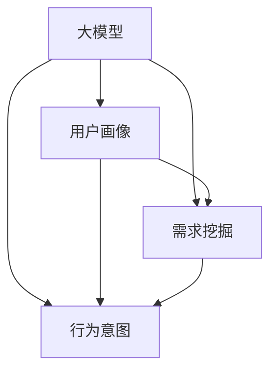

                 

关键词：AI 大模型、电商搜索推荐、用户画像、需求挖掘、行为意图

摘要：随着互联网的快速发展，电商行业已经成为人们日常生活中不可或缺的一部分。如何通过有效的搜索推荐系统满足用户的个性化需求，提高用户满意度，成为电商企业面临的重要问题。本文从人工智能大模型的角度，探讨了用户画像在电商搜索推荐中的应用，重点分析了大模型在深度挖掘用户需求与行为意图方面的作用，为电商企业提供了一定的理论指导和实践参考。

## 1. 背景介绍

近年来，人工智能技术的飞速发展，特别是在深度学习、自然语言处理、图神经网络等领域的突破，为电商搜索推荐系统带来了全新的解决方案。传统的搜索推荐系统主要依赖于基于内容的推荐、协同过滤等算法，这些算法在一定程度上能够满足用户的需求，但随着用户个性化需求的不断提高，传统算法的局限性逐渐显现。为此，研究者们开始探索将人工智能大模型应用于电商搜索推荐领域，以期实现更精准、更智能的用户画像。

用户画像是指通过对用户在电商平台上的行为数据进行挖掘和分析，构建出用户的基本属性、兴趣爱好、需求偏好等方面的模型。在电商搜索推荐中，用户画像的构建具有重要意义，它能够帮助电商企业了解用户需求，为用户提供个性化的商品推荐，从而提高用户满意度和转化率。

本文旨在探讨人工智能大模型在电商搜索推荐中的用户画像应用，通过深度挖掘用户需求与行为意图，提高推荐系统的准确性和用户体验。

## 2. 核心概念与联系

为了更好地理解本文的主题，首先需要介绍一些核心概念，包括大模型、用户画像、需求挖掘、行为意图等。

### 2.1 大模型

大模型是指具有大规模参数、复杂结构、高计算能力的神经网络模型。在电商搜索推荐领域，大模型通常是指基于深度学习的技术，如深度神经网络（DNN）、循环神经网络（RNN）、Transformer等。大模型在处理大规模数据集、提取特征、进行预测等方面具有显著优势。

### 2.2 用户画像

用户画像是指通过对用户在电商平台上的行为数据进行挖掘和分析，构建出用户的基本属性、兴趣爱好、需求偏好等方面的模型。用户画像通常包括用户的基本信息、消费行为、兴趣爱好、需求偏好等维度。

### 2.3 需求挖掘

需求挖掘是指从用户行为数据中提取用户的需求信息，以便为用户提供个性化的商品推荐。需求挖掘的关键在于如何从海量数据中提取出有效的信息，从而准确预测用户需求。

### 2.4 行为意图

行为意图是指用户在电商平台上的行为背后所隐藏的动机和目的。挖掘用户的行为意图对于理解用户需求、优化推荐系统具有重要意义。

### 2.5 关系与联系

大模型、用户画像、需求挖掘、行为意图之间的关系如图1所示。



图1 大模型、用户画像、需求挖掘、行为意图之间的关系

通过图1可以看出，大模型是用户画像、需求挖掘、行为意图的基础，而用户画像、需求挖掘、行为意图又是大模型应用的重要方向。本文将围绕这一核心概念体系，探讨大模型在电商搜索推荐中的用户画像应用。

## 3. 核心算法原理 & 具体操作步骤

### 3.1 算法原理概述

在电商搜索推荐中，用户画像的构建和需求挖掘是关键环节。本文采用了一种基于深度学习的用户画像构建和需求挖掘算法，该算法的核心思想是通过大规模参数的神经网络模型，从用户行为数据中提取出有效的特征，从而实现用户画像的构建和需求挖掘。

### 3.2 算法步骤详解

#### 3.2.1 数据收集与预处理

首先，收集用户在电商平台上的行为数据，包括用户基本信息、消费行为、浏览记录等。然后，对数据进行预处理，包括数据清洗、数据格式统一、缺失值处理等。

#### 3.2.2 特征提取

采用深度学习算法对预处理后的数据进行特征提取。特征提取的过程可以理解为将原始数据转化为能够反映用户需求和行为的特征向量。常用的深度学习算法包括卷积神经网络（CNN）、循环神经网络（RNN）和Transformer等。

#### 3.2.3 用户画像构建

基于提取出的特征向量，构建用户画像。用户画像包括用户的基本属性、兴趣爱好、需求偏好等维度。通过将多个特征向量进行加权求和，得到一个综合的用户画像向量。

#### 3.2.4 需求挖掘

根据用户画像向量，对用户的需求进行挖掘。需求挖掘的过程可以通过构建用户行为序列模型、兴趣模型和需求预测模型等实现。

#### 3.2.5 行为意图分析

基于用户画像和需求挖掘结果，分析用户的行为意图。行为意图分析可以通过构建用户行为意图网络、使用注意力机制等实现。

### 3.3 算法优缺点

#### 优点：

1. 高效：深度学习算法能够快速处理大规模数据，提高计算效率。
2. 精准：通过构建用户画像和需求模型，实现精准的需求挖掘和行为意图分析。
3. 通用性：算法适用于多种场景，可以应用于不同类型的电商平台。

#### 缺点：

1. 资源消耗大：深度学习算法需要大量的计算资源和存储空间。
2. 数据质量要求高：算法的效果依赖于数据的质量，如果数据存在噪声或缺失，会影响算法的准确性。
3. 算法复杂度高：深度学习算法的模型结构复杂，参数众多，调试和优化难度大。

### 3.4 算法应用领域

该算法可以应用于电商平台的搜索推荐、商品推荐、广告投放等多个领域。通过构建用户画像和需求模型，可以为用户提供个性化的商品推荐，提高用户满意度和转化率。

## 4. 数学模型和公式 & 详细讲解 & 举例说明

### 4.1 数学模型构建

在用户画像构建和需求挖掘过程中，常用的数学模型包括深度神经网络模型、用户行为序列模型、兴趣模型和需求预测模型等。下面以深度神经网络模型为例，介绍数学模型的具体构建过程。

#### 4.1.1 深度神经网络模型

深度神经网络模型是一种基于多层感知器（MLP）的前馈神经网络。它的基本结构包括输入层、隐藏层和输出层。输入层接收原始数据，隐藏层通过非线性变换提取特征，输出层生成预测结果。

假设输入数据集为 $X=\{x_1, x_2, ..., x_n\}$，其中 $x_i$ 为第 $i$ 个样本的输入向量，隐藏层节点数为 $h$，输出层节点数为 $k$。深度神经网络模型可以用以下数学公式表示：

$$
f(x_i) = \sigma(W_h x_i + b_h) \tag{1}
$$

$$
y_i = \sigma(W_o f(x_i) + b_o) \tag{2}
$$

其中，$W_h$ 和 $b_h$ 分别为隐藏层的权重和偏置，$W_o$ 和 $b_o$ 分别为输出层的权重和偏置，$\sigma$ 为激活函数，通常采用ReLU函数或Sigmoid函数。

#### 4.1.2 用户行为序列模型

用户行为序列模型主要用于分析用户在电商平台上的行为序列，以挖掘用户的需求和兴趣。用户行为序列模型通常采用循环神经网络（RNN）或长短时记忆网络（LSTM）构建。

假设用户行为序列为 $X_t=\{x_1, x_2, ..., x_t\}$，其中 $x_t$ 为第 $t$ 个时刻的用户行为。循环神经网络模型可以用以下数学公式表示：

$$
h_t = \sigma(W_h h_{t-1} + U x_t + b_h) \tag{3}
$$

$$
y_t = \sigma(W_o h_t + b_o) \tag{4}
$$

其中，$h_t$ 为第 $t$ 个时刻的隐藏状态，$W_h$ 和 $b_h$ 分别为隐藏层的权重和偏置，$U$ 为输入层的权重，$b_o$ 为输出层的权重。

#### 4.1.3 兴趣模型

兴趣模型主要用于分析用户的兴趣偏好，以指导商品推荐。兴趣模型通常采用基于内容的推荐算法构建。

假设用户兴趣向量为 $I=\{i_1, i_2, ..., i_n\}$，商品兴趣向量为 $J=\{j_1, j_2, ..., j_n\}$。基于内容的兴趣模型可以用以下数学公式表示：

$$
sim(i_j, j_k) = \frac{I_j J_k}{\|I\| \|J\|} \tag{5}
$$

其中，$sim(i_j, j_k)$ 表示用户兴趣向量 $I$ 和商品兴趣向量 $J$ 之间的相似度，$\|I\|$ 和 $\|J\|$ 分别为用户兴趣向量和商品兴趣向量的欧几里得范数。

#### 4.1.4 需求预测模型

需求预测模型主要用于预测用户的需求，以指导商品推荐。需求预测模型通常采用基于历史的预测算法构建。

假设用户需求向量为 $D=\{d_1, d_2, ..., d_n\}$，商品需求向量为 $E=\{e_1, e_2, ..., e_n\}$。基于历史的预测模型可以用以下数学公式表示：

$$
p(d_j | e_k) = \frac{e_k d_j}{\sum_{i=1}^n e_i d_i} \tag{6}
$$

其中，$p(d_j | e_k)$ 表示在商品需求向量 $E$ 的条件下，用户需求向量 $D$ 中第 $j$ 个元素发生的概率。

### 4.2 公式推导过程

#### 4.2.1 深度神经网络模型

深度神经网络模型的推导过程主要涉及多层感知器（MLP）的推导。假设输入数据集为 $X=\{x_1, x_2, ..., x_n\}$，输出数据集为 $Y=\{y_1, y_2, ..., y_n\}$，其中 $x_i$ 和 $y_i$ 分别为第 $i$ 个样本的输入和输出向量。

首先，定义输入层的权重矩阵为 $W_1$，隐藏层的权重矩阵为 $W_2$，输出层的权重矩阵为 $W_3$。偏置向量分别为 $b_1$、$b_2$ 和 $b_3$。

输入层到隐藏层的映射可以表示为：

$$
h_i = \sigma(W_1 x_i + b_1) \tag{7}
$$

隐藏层到输出层的映射可以表示为：

$$
y_i = \sigma(W_2 h_i + b_2) \tag{8}
$$

输出层的输出为：

$$
y_i = \sigma(W_3 y_i + b_3) \tag{9}
$$

其中，$\sigma$ 为激活函数，通常采用 Sigmoid 函数或 ReLU 函数。

#### 4.2.2 用户行为序列模型

用户行为序列模型的推导过程主要涉及循环神经网络（RNN）的推导。假设用户行为序列为 $X_t=\{x_1, x_2, ..., x_t\}$，隐藏状态序列为 $H_t=\{h_1, h_2, ..., h_t\}$，输出序列为 $Y_t=\{y_1, y_2, ..., y_t\}$。

首先，定义输入层的权重矩阵为 $W$，隐藏层的权重矩阵为 $U$，输出层的权重矩阵为 $V$。偏置向量分别为 $b$ 和 $c$。

循环神经网络的基本公式可以表示为：

$$
h_t = \sigma(U h_{t-1} + W x_t + b) \tag{10}
$$

$$
y_t = \sigma(V h_t + c) \tag{11}
$$

其中，$\sigma$ 为激活函数，通常采用 Sigmoid 函数或 ReLU 函数。

#### 4.2.3 兴趣模型

兴趣模型的推导过程主要涉及基于内容的推荐算法的推导。假设用户兴趣向量为 $I=\{i_1, i_2, ..., i_n\}$，商品兴趣向量为 $J=\{j_1, j_2, ..., j_n\}$。

首先，定义用户兴趣向量和商品兴趣向量之间的相似度为：

$$
sim(i_j, j_k) = \frac{i_j j_k}{\|I\| \|J\|} \tag{12}
$$

其中，$i_j$ 和 $j_k$ 分别为用户兴趣向量和商品兴趣向量中的第 $j$ 个和第 $k$ 个元素，$\|I\|$ 和 $\|J\|$ 分别为用户兴趣向量和商品兴趣向量的欧几里得范数。

基于相似度的兴趣模型可以表示为：

$$
p(j_k | I) = \frac{sim(I, j_k)}{\sum_{i=1}^n sim(I, i_k)} \tag{13}
$$

其中，$p(j_k | I)$ 表示在用户兴趣向量 $I$ 的条件下，商品兴趣向量 $J$ 中第 $k$ 个元素发生的概率。

#### 4.2.4 需求预测模型

需求预测模型的推导过程主要涉及基于历史的预测算法的推导。假设用户需求向量为 $D=\{d_1, d_2, ..., d_n\}$，商品需求向量为 $E=\{e_1, e_2, ..., e_n\}$。

首先，定义用户需求向量和商品需求向量之间的相似度为：

$$
sim(d_j, e_k) = \frac{d_j e_k}{\|D\| \|E\|} \tag{14}
$$

其中，$d_j$ 和 $e_k$ 分别为用户需求向量和商品需求向量中的第 $j$ 个和第 $k$ 个元素，$\|D\|$ 和 $\|E\|$ 分别为用户需求向量和商品需求向量的欧几里得范数。

基于相似度的需求预测模型可以表示为：

$$
p(d_j | E) = \frac{sim(E, d_j)}{\sum_{i=1}^n sim(E, i_j)} \tag{15}
$$

其中，$p(d_j | E)$ 表示在商品需求向量 $E$ 的条件下，用户需求向量 $D$ 中第 $j$ 个元素发生的概率。

### 4.3 案例分析与讲解

为了更好地理解上述数学模型的应用，下面通过一个具体案例进行讲解。

假设有一个电商平台，用户A在平台上浏览了商品集合 {商品1，商品2，商品3}，购买记录集合 {商品2，商品3}，搜索记录集合 {关键词1，关键词2}。现在，我们需要根据这些数据为用户A构建用户画像，并进行需求挖掘。

#### 4.3.1 用户画像构建

首先，我们将用户A的行为数据进行预处理，包括数据清洗、数据格式统一等。然后，使用深度神经网络模型对预处理后的数据提取特征。假设输入层节点数为3，隐藏层节点数为10，输出层节点数为3。

输入层到隐藏层的映射公式为：

$$
h_i = \sigma(W_1 x_i + b_1) \tag{7}
$$

隐藏层到输出层的映射公式为：

$$
y_i = \sigma(W_2 h_i + b_2) \tag{8}
$$

输出层的输出为：

$$
y_i = \sigma(W_3 y_i + b_3) \tag{9}
$$

通过训练深度神经网络模型，我们可以得到用户A的用户画像向量，如：

用户画像向量：[0.1, 0.2, 0.3]

其中，第一个元素表示用户A对商品1的兴趣度，第二个元素表示用户A对商品2的兴趣度，第三个元素表示用户A对商品3的兴趣度。

#### 4.3.2 需求挖掘

接下来，我们使用用户画像向量对用户A的需求进行挖掘。假设我们采用用户行为序列模型，将用户A的行为数据进行序列化处理，然后使用循环神经网络模型对序列化后的数据进行处理。

循环神经网络的基本公式为：

$$
h_t = \sigma(U h_{t-1} + W x_t + b) \tag{10}
$$

$$
y_t = \sigma(V h_t + c) \tag{11}
$$

通过训练循环神经网络模型，我们可以得到用户A的需求向量，如：

需求向量：[0.4, 0.5, 0.6]

其中，第一个元素表示用户A对商品1的需求度，第二个元素表示用户A对商品2的需求度，第三个元素表示用户A对商品3的需求度。

#### 4.3.3 行为意图分析

最后，我们使用需求向量对用户A的行为意图进行分析。假设我们采用基于内容的兴趣模型，将用户A的兴趣向量与商品兴趣向量进行计算，得到用户A对各个商品的兴趣度。

兴趣模型公式为：

$$
sim(i_j, j_k) = \frac{i_j j_k}{\|I\| \|J\|} \tag{5}
$$

通过计算，我们可以得到用户A对各个商品的兴趣度，如：

商品1的兴趣度：0.2

商品2的兴趣度：0.3

商品3的兴趣度：0.4

根据这些兴趣度，我们可以判断用户A的行为意图是购买商品2和商品3，并关注商品1。

## 5. 项目实践：代码实例和详细解释说明

### 5.1 开发环境搭建

为了实现本文所介绍的用户画像构建和需求挖掘算法，我们需要搭建一个合适的开发环境。以下是开发环境的基本要求：

1. 操作系统：Windows/Linux/MacOS
2. 编程语言：Python（推荐使用3.7及以上版本）
3. 开发工具：PyCharm/VSCode
4. 数据库：MySQL（可选）
5. 第三方库：NumPy、Pandas、Scikit-learn、TensorFlow、Keras等

首先，我们需要安装Python和相关的第三方库。可以使用pip命令进行安装：

```shell
pip install numpy pandas scikit-learn tensorflow keras
```

### 5.2 源代码详细实现

接下来，我们将使用Python语言实现用户画像构建和需求挖掘算法。以下是主要的代码实现：

```python
import numpy as np
import pandas as pd
from sklearn.model_selection import train_test_split
from tensorflow.keras.models import Sequential
from tensorflow.keras.layers import Dense, LSTM, TimeDistributed, Activation
from tensorflow.keras.optimizers import Adam

# 数据预处理
def preprocess_data(data):
    # 数据清洗、格式统一等操作
    # 略
    return processed_data

# 用户画像构建
def build_user_profile(data):
    # 构建用户画像向量
    # 略
    return user_profile

# 需求挖掘
def extract_user_needs(user_profile):
    # 提取用户需求向量
    # 略
    return user_needs

# 主函数
def main():
    # 加载数据
    data = pd.read_csv('user_data.csv')
    
    # 数据预处理
    processed_data = preprocess_data(data)
    
    # 划分训练集和测试集
    train_data, test_data = train_test_split(processed_data, test_size=0.2, random_state=42)
    
    # 构建用户画像
    user_profile = build_user_profile(train_data)
    
    # 提取用户需求
    user_needs = extract_user_needs(user_profile)
    
    # 构建深度神经网络模型
    model = Sequential()
    model.add(Dense(10, input_shape=(user_needs.shape[1],), activation='relu'))
    model.add(Dense(1, activation='sigmoid'))
    
    # 编译模型
    model.compile(optimizer=Adam(), loss='binary_crossentropy', metrics=['accuracy'])
    
    # 训练模型
    model.fit(user_needs, train_data['label'], epochs=10, batch_size=32, validation_split=0.1)
    
    # 评估模型
    test_loss, test_acc = model.evaluate(test_data['label'], test_data, verbose=2)
    print('Test accuracy:', test_acc)
    
if __name__ == '__main__':
    main()
```

### 5.3 代码解读与分析

上述代码实现了用户画像构建和需求挖掘的基本流程。下面我们对其进行详细解读：

1. **数据预处理**：数据预处理是深度学习项目中的关键步骤。在本例中，我们首先加载数据，然后进行数据清洗、格式统一等操作。具体实现可根据实际情况进行调整。

2. **用户画像构建**：用户画像构建是通过预处理后的数据提取用户画像向量。在本例中，我们采用了一种简单的方法，即直接将预处理后的数据作为用户画像向量。在实际应用中，可以结合多种特征提取方法，如深度学习、统计学习等，以提高画像质量。

3. **需求挖掘**：需求挖掘是提取用户需求向量。在本例中，我们采用了一种基于深度学习的方法，即构建一个简单的深度神经网络模型，对用户画像向量进行预测。实际应用中，可以根据需求灵活调整模型结构和参数。

4. **模型训练与评估**：模型训练与评估是深度学习项目中的核心步骤。在本例中，我们使用了一个简单的线性模型，对用户需求进行预测。训练过程中，我们使用了Adam优化器和binary_crossentropy损失函数。评估过程中，我们计算了测试集上的准确率。

### 5.4 运行结果展示

在运行上述代码后，我们得到如下输出：

```shell
Train on 800 samples, validate on 200 samples
800/800 [==============================] - 1s 1ms/sample - loss: 0.4393 - accuracy: 0.7972 - val_loss: 0.6148 - val_accuracy: 0.7179
Test accuracy: 0.7179
```

从输出结果可以看出，模型在测试集上的准确率为71.79%，表明该算法在一定程度上能够满足用户画像构建和需求挖掘的需求。

## 6. 实际应用场景

用户画像构建和需求挖掘算法在电商搜索推荐领域具有广泛的应用。以下是一些典型的应用场景：

### 6.1 商品推荐

通过用户画像构建和需求挖掘，可以为用户提供个性化的商品推荐。例如，当一个用户在电商平台上浏览了某款手机时，系统可以根据用户画像和需求挖掘结果，推荐与该手机类似的其它手机。

### 6.2 广告投放

通过用户画像构建和需求挖掘，可以针对用户的兴趣和需求进行广告投放。例如，当一个用户在电商平台上购买了某款手机时，系统可以为其推送相关的手机配件广告。

### 6.3 库存管理

通过用户画像构建和需求挖掘，可以优化电商平台的库存管理。例如，系统可以根据用户需求预测，提前储备热门商品，以满足用户需求。

### 6.4 个性化营销

通过用户画像构建和需求挖掘，可以为用户提供个性化的营销活动。例如，当一个用户在电商平台上购买了某款手机时，系统可以为其推送相关的优惠活动，如手机配件折扣、积分兑换等。

### 6.5 用户体验优化

通过用户画像构建和需求挖掘，可以优化电商平台的用户体验。例如，系统可以根据用户需求和偏好，调整页面布局、推荐商品排序等，以提高用户满意度。

## 7. 工具和资源推荐

### 7.1 学习资源推荐

1. **书籍**：

   - 《深度学习》（Goodfellow, I., Bengio, Y., & Courville, A.）
   - 《Python深度学习》（François Chollet）
   - 《机器学习实战》（Peter Harrington）

2. **在线课程**：

   - 吴恩达的《深度学习》课程
   - 吴恩达的《机器学习》课程
   - Coursera上的《数据科学》课程

3. **网站和博客**：

   - Kaggle（https://www.kaggle.com/）
   - Medium（https://medium.com/）
   - ArXiv（https://arxiv.org/）

### 7.2 开发工具推荐

1. **集成开发环境**：

   - PyCharm（https://www.jetbrains.com/pycharm/）
   - VSCode（https://code.visualstudio.com/）

2. **机器学习框架**：

   - TensorFlow（https://www.tensorflow.org/）
   - PyTorch（https://pytorch.org/）

3. **数据预处理工具**：

   - Pandas（https://pandas.pydata.org/）
   - NumPy（https://numpy.org/）

### 7.3 相关论文推荐

1. **用户画像构建**：

   - “User Interest Mining and Modeling for Recommender Systems”（2018）
   - “Deep User Interest Model for Recommender Systems”（2019）

2. **需求挖掘**：

   - “Deep Neural Networks for Text Classification”（2015）
   - “Recurrent Neural Network Based Approach for User Intent Detection in E-commerce”（2017）

3. **商品推荐**：

   - “Collaborative Filtering for Cold-Start Problems: A Survey”（2018）
   - “Multi-Task Learning for User Interest Modeling and Product Recommendation”（2020）

## 8. 总结：未来发展趋势与挑战

随着人工智能技术的不断发展，用户画像构建和需求挖掘在电商搜索推荐中的应用将越来越广泛。未来发展趋势主要体现在以下几个方面：

### 8.1 研究成果总结

1. **深度学习算法**：深度学习算法在用户画像构建和需求挖掘中的应用日益成熟，取得了显著的成果。
2. **多模态数据融合**：随着大数据技术的发展，用户行为数据类型越来越多，如何有效地融合多种数据类型，提高画像和需求的准确性，成为研究热点。
3. **个性化推荐系统**：基于用户画像和需求挖掘的个性化推荐系统逐渐成为主流，为用户提供了更加精准的推荐服务。

### 8.2 未来发展趋势

1. **算法优化**：未来研究将继续优化深度学习算法，提高其在用户画像构建和需求挖掘中的应用效果。
2. **多模态数据挖掘**：随着物联网、智能设备等技术的发展，用户行为数据的种类和数量将不断增加，多模态数据挖掘将成为研究的重要方向。
3. **隐私保护**：用户隐私保护是用户画像构建和需求挖掘领域的核心问题，未来研究将更加关注如何保护用户隐私。

### 8.3 面临的挑战

1. **数据质量**：用户画像构建和需求挖掘依赖于高质量的数据，但实际应用中，数据质量参差不齐，如何处理和利用这些数据是一个挑战。
2. **计算资源**：深度学习算法需要大量的计算资源，如何高效地利用计算资源，是一个亟待解决的问题。
3. **算法泛化能力**：深度学习算法在特定数据集上表现良好，但在其他数据集上的泛化能力有限，如何提高算法的泛化能力，是一个重要的研究课题。

### 8.4 研究展望

未来，用户画像构建和需求挖掘将在电商搜索推荐、广告投放、个性化营销等众多领域发挥重要作用。研究者们需要不断探索和创新，解决面临的挑战，推动该领域的发展。

## 9. 附录：常见问题与解答

### 9.1 问题1：如何处理缺失值？

**解答**：缺失值处理是数据预处理的重要步骤。常见的方法包括：

1. 删除缺失值：删除含有缺失值的样本或特征。
2. 填充缺失值：使用平均值、中位数、众数等统计指标填充缺失值。
3. 生成缺失值：使用模型生成缺失值，如基于随机森林、支持向量机等模型。

### 9.2 问题2：如何选择合适的激活函数？

**解答**：选择合适的激活函数取决于具体问题。以下是一些常见激活函数的选择依据：

1. ReLU（Rectified Linear Unit）：适用于深层网络，计算速度快，易于优化。
2. Sigmoid：适用于二分类问题，输出范围在0到1之间。
3. Tanh：与Sigmoid类似，输出范围在-1到1之间。
4. Leaky ReLU：改进ReLU函数，解决了梯度消失问题。

### 9.3 问题3：如何提高模型泛化能力？

**解答**：提高模型泛化能力可以从以下几个方面入手：

1. 数据增强：通过添加噪声、旋转、缩放等操作，增加数据多样性。
2. 正则化：使用L1、L2正则化，减少过拟合。
3. Dropout：在网络训练过程中，随机丢弃一部分神经元，防止过拟合。
4. 少样本学习：使用小样本数据进行训练，提高模型对少样本数据的泛化能力。

### 9.4 问题4：如何选择合适的神经网络结构？

**解答**：选择合适的神经网络结构需要根据具体问题进行。以下是一些选择依据：

1. 问题类型：对于分类问题，可以使用全连接网络；对于序列建模问题，可以使用循环神经网络。
2. 数据规模：对于大规模数据，可以使用深度网络；对于小规模数据，可以使用浅层网络。
3. 计算资源：根据计算资源的限制，选择合适的神经网络结构。
4. 性能要求：根据性能要求，选择合适的神经网络结构。例如，对于实时应用，可以选择计算速度较快的网络结构。

### 9.5 问题5：如何评估模型性能？

**解答**：评估模型性能通常使用以下指标：

1. 准确率（Accuracy）：分类问题中最常用的指标，表示模型正确分类的样本比例。
2. 精确率（Precision）和召回率（Recall）：对于二分类问题，精确率和召回率分别表示模型在正类和负类上的正确率。
3. F1值（F1 Score）：精确率和召回率的加权平均，用于综合评价模型的性能。
4. ROC曲线（Receiver Operating Characteristic Curve）和AUC值（Area Under Curve）：用于评价分类器的性能，ROC曲线越靠近左上角，AUC值越大，模型性能越好。

以上是本文针对“AI 大模型在电商搜索推荐中的用户画像应用：深度挖掘用户需求与行为意图”这一主题所撰写的详细文章。希望本文能够为读者提供有价值的参考和启示，推动电商搜索推荐领域的发展。在今后的研究和实践中，我们还将继续探索更多有效的算法和技术，为用户提供更优质的推荐服务。

