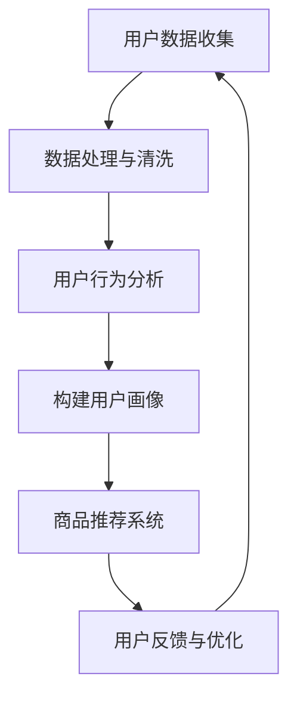

                 

关键词：AI 大模型、电商搜索推荐、用户画像、行为分析、需求偏好

> 摘要：本文深入探讨了人工智能大模型在电商搜索推荐领域中的用户画像技术。通过分析用户行为和需求偏好，文章揭示了AI 大模型如何实现深度理解用户，从而提高电商搜索推荐的准确性和个性化程度。

## 1. 背景介绍

在当今的电商领域，搜索推荐系统已成为商家与消费者之间的重要桥梁。一个高效的搜索推荐系统能够根据用户的历史行为和偏好，提供精准的推荐，从而提升用户体验，增加销售转化率。然而，实现这一目标并非易事，需要解决多个技术难题，如如何从海量数据中提取有价值的信息、如何准确地捕捉用户的实时行为和偏好等。

近年来，随着人工智能技术的迅猛发展，尤其是深度学习大模型的广泛应用，用户画像技术得到了显著的提升。用户画像技术旨在通过分析用户的历史行为、浏览记录、购买偏好等多维度数据，构建出一个全面、准确的用户行为模型，从而为电商搜索推荐系统提供强有力的支持。

本文将围绕AI 大模型在电商搜索推荐中的用户画像技术，探讨其核心概念、算法原理、数学模型、项目实践以及未来应用展望。希望通过本文的阐述，能够为广大读者提供一个全面、深入的理解，为电商搜索推荐领域的技术创新提供启示。

## 2. 核心概念与联系

### 2.1 AI 大模型

AI 大模型，通常指的是具有海量参数、能够处理大规模数据的深度学习模型。这些模型通过自我学习和训练，能够从海量数据中提取出隐含的模式和规律，从而实现高精度的预测和分类。在电商搜索推荐领域，AI 大模型可以用于用户行为分析、需求预测、商品推荐等多个方面。

### 2.2 用户画像

用户画像是对用户特征进行综合分析和抽象化的过程，通常包括用户的基础信息、行为数据、兴趣偏好等多维度信息。通过构建用户画像，我们可以更深入地理解用户的需求和行为，从而为电商搜索推荐系统提供精准的决策支持。

### 2.3 用户行为分析

用户行为分析是指通过收集和分析用户的在线行为数据，如浏览记录、搜索历史、购买行为等，来识别用户的兴趣和需求。用户行为分析是用户画像构建的基础，是实现个性化推荐的关键。

### 2.4 需求偏好

需求偏好是指用户对商品或服务的偏好和需求。在电商领域，了解用户的需求偏好可以帮助商家制定更具针对性的营销策略，提高用户的满意度和忠诚度。

### 2.5 Mermaid 流程图

为了更好地展示AI 大模型在电商搜索推荐中的用户画像技术的核心概念和联系，我们可以使用Mermaid 流程图进行描述。以下是该流程图的具体实现：



在这个流程图中，用户数据收集是起点，通过数据处理与清洗，我们可以获得高质量的用户行为数据。接下来，通过对用户行为数据进行深入分析，构建出详细的用户画像。这些用户画像将被用于商品推荐系统，为用户提供个性化的推荐。最后，用户的反馈将用于优化推荐系统，形成一个闭环的智能推荐机制。

## 3. 核心算法原理 & 具体操作步骤

### 3.1 算法原理概述

在电商搜索推荐中，用户画像技术的核心在于如何从海量数据中提取出有价值的信息，构建出一个全面的用户行为模型。这一过程通常涉及以下关键步骤：

1. **数据收集**：通过网站日志、用户行为数据、商品数据等多渠道收集用户数据。
2. **数据预处理**：对收集到的数据进行清洗、去噪、归一化等处理，确保数据的质量。
3. **特征工程**：提取用户行为数据中的关键特征，如浏览次数、购买频率、停留时间等。
4. **模型训练**：利用深度学习大模型，如神经网络、决策树等，对用户行为数据进行训练。
5. **用户画像构建**：根据模型输出的结果，构建出每个用户的详细画像。
6. **推荐系统实现**：将用户画像与商品数据相结合，实现个性化推荐。

### 3.2 算法步骤详解

#### 3.2.1 数据收集

数据收集是用户画像构建的基础，主要涉及以下几种数据：

- **用户行为数据**：如用户的浏览记录、搜索历史、购买记录等。
- **商品数据**：如商品名称、描述、价格、分类等。
- **用户基础信息**：如年龄、性别、地理位置、消费能力等。

这些数据可以通过网站日志、第三方数据服务、用户调查等多种途径获取。

#### 3.2.2 数据预处理

数据预处理主要包括以下步骤：

- **去噪**：去除数据中的噪声和异常值，如重复数据、无效数据等。
- **归一化**：将不同特征的数据进行归一化处理，使其具有相似的量级。
- **缺失值处理**：对缺失值进行填充或删除。

#### 3.2.3 特征工程

特征工程是用户画像构建的关键步骤，主要涉及以下任务：

- **特征提取**：从用户行为数据中提取关键特征，如用户的浏览次数、购买频率、停留时间等。
- **特征选择**：选择对用户画像构建最有价值的特征，如通过相关性分析、特征重要性评估等方法。
- **特征融合**：将不同来源的特征进行融合，如通过聚类、集成学习方法等。

#### 3.2.4 模型训练

在模型训练阶段，我们通常采用以下方法：

- **选择模型**：选择适合用户画像构建的深度学习模型，如神经网络、决策树、随机森林等。
- **训练过程**：通过大量用户行为数据进行模型训练，优化模型参数。
- **模型评估**：利用交叉验证、ROC-AUC等方法评估模型性能。

#### 3.2.5 用户画像构建

根据模型训练的结果，我们可以构建出每个用户的详细画像。画像包括以下内容：

- **用户基础信息**：如年龄、性别、地理位置等。
- **行为特征**：如浏览次数、购买频率、停留时间等。
- **兴趣偏好**：如对某种商品类别的偏好、对某种品牌的偏好等。

#### 3.2.6 推荐系统实现

在推荐系统实现阶段，我们主要关注以下任务：

- **用户画像与商品数据结合**：将用户画像与商品数据相结合，构建推荐列表。
- **推荐策略优化**：通过用户反馈和在线测试，不断优化推荐策略。
- **推荐结果评估**：利用A/B测试、用户满意度等方法评估推荐效果。

### 3.3 算法优缺点

#### 优点

- **高精度**：AI 大模型能够从海量数据中提取出有价值的信息，实现高精度的用户画像构建。
- **可扩展性**：通过深度学习大模型，用户画像技术可以轻松应对大规模数据和高维度特征。
- **个性化**：基于用户画像的推荐系统能够提供高度个性化的推荐，提升用户体验。

#### 缺点

- **数据依赖性**：用户画像技术对数据质量有较高要求，数据不完整或存在噪声可能导致模型性能下降。
- **计算资源消耗**：深度学习大模型的训练和推理过程需要大量计算资源，对硬件设备有较高要求。

### 3.4 算法应用领域

AI 大模型在电商搜索推荐中的用户画像技术可以广泛应用于多个领域：

- **电子商务**：通过构建用户画像，实现个性化推荐，提升用户购物体验和满意度。
- **在线广告**：利用用户画像进行精准广告投放，提高广告转化率。
- **金融服务**：通过用户画像分析，为金融机构提供风险管理、信用评估等服务。
- **智慧城市**：利用用户画像进行交通流量预测、城市规划等，提升城市管理效率。

## 4. 数学模型和公式 & 详细讲解 & 举例说明

### 4.1 数学模型构建

在构建用户画像的过程中，我们通常采用以下数学模型：

- **贝叶斯网络**：用于表示用户行为数据之间的因果关系。
- **概率图模型**：如高斯分布、泊松分布等，用于描述用户行为数据的分布特性。
- **聚类模型**：如K-means、层次聚类等，用于发现用户行为数据的潜在模式。

### 4.2 公式推导过程

在构建贝叶斯网络模型时，我们通常采用以下公式：

$$
P(A|B) = \frac{P(B|A)P(A)}{P(B)}
$$

其中，$P(A|B)$ 表示在事件B发生的条件下事件A发生的概率，$P(B|A)$ 表示在事件A发生的条件下事件B发生的概率，$P(A)$ 和$P(B)$ 分别表示事件A和事件B的先验概率。

### 4.3 案例分析与讲解

以下是一个简单的用户画像构建案例：

#### 案例背景

假设我们有一个电商网站，用户可以浏览商品、搜索商品、加入购物车、下单购买等。我们希望通过用户的行为数据构建一个用户画像，以实现个性化推荐。

#### 案例数据

我们收集了以下用户行为数据：

- 用户ID：10001
- 浏览记录：[商品1，商品2，商品3]
- 搜索历史：[手机，电脑，平板]
- 购买记录：[手机]
- 停留时间：[10分钟，30分钟，5分钟]

#### 案例分析

1. **特征提取**：从用户行为数据中提取关键特征，如浏览次数、购买频率、搜索关键词等。

   $$ 
   \text{浏览次数} = 3 \\
   \text{购买频率} = 1 \\
   \text{搜索关键词} = \text{手机，电脑，平板}
   $$

2. **特征选择**：根据用户行为数据的特点，选择对用户画像构建最有价值的特征，如浏览次数、购买频率、搜索关键词等。

3. **用户画像构建**：根据特征选择的结果，构建出每个用户的详细画像。

   用户ID：10001
   
   用户画像：

   - 基础信息：年龄、性别、地理位置等（缺失数据用平均值填充）
   - 行为特征：浏览次数、购买频率、搜索关键词等
   - 兴趣偏好：对手机、电脑、平板等商品的偏好程度

4. **推荐系统实现**：根据用户画像，为用户推荐相关的商品。

   推荐结果：

   - 手机：用户已购买，推荐新款手机
   - 电脑：用户曾浏览，推荐高性能电脑
   - 平板：用户曾搜索，推荐热门平板电脑

## 5. 项目实践：代码实例和详细解释说明

### 5.1 开发环境搭建

在本文的项目实践中，我们将使用Python作为编程语言，结合Scikit-learn、TensorFlow等开源库进行用户画像构建。以下是开发环境的搭建步骤：

1. 安装Python：从Python官网下载并安装Python 3.x版本。
2. 安装Scikit-learn：在命令行中执行 `pip install scikit-learn`。
3. 安装TensorFlow：在命令行中执行 `pip install tensorflow`。

### 5.2 源代码详细实现

以下是一个简单的用户画像构建代码实例：

```python
import numpy as np
import pandas as pd
from sklearn.preprocessing import StandardScaler
from sklearn.cluster import KMeans
from tensorflow import keras

# 5.2.1 数据收集与预处理
def load_data():
    # 加载用户行为数据
    data = pd.read_csv('user_behavior.csv')
    # 数据清洗与预处理
    data = data.drop_duplicates()
    data = data.fillna(data.mean())
    return data

# 5.2.2 特征工程
def feature_engineering(data):
    # 提取关键特征
    features = data[['browse_count', 'purchase_frequency', 'search_keywords']]
    # 特征归一化
    scaler = StandardScaler()
    features = scaler.fit_transform(features)
    return features

# 5.2.3 用户画像构建
def build_user_profile(features):
    # 使用K-means聚类构建用户画像
    kmeans = KMeans(n_clusters=5)
    kmeans.fit(features)
    user_profiles = kmeans.predict(features)
    return user_profiles

# 5.2.4 推荐系统实现
def recommend_products(user_profile, product_data):
    # 根据用户画像推荐商品
    similar_products = product_data[kmeans.labels_ == user_profile]
    return similar_products

# 主函数
if __name__ == '__main__':
    data = load_data()
    features = feature_engineering(data)
    user_profiles = build_user_profile(features)
    product_data = pd.read_csv('product_data.csv')
    recommended_products = recommend_products(user_profiles[0], product_data)
    print(recommended_products)
```

### 5.3 代码解读与分析

上述代码实例主要包括以下几个关键部分：

1. **数据收集与预处理**：从CSV文件中加载用户行为数据，进行清洗和预处理。
2. **特征工程**：提取用户行为数据中的关键特征，如浏览次数、购买频率、搜索关键词等，并进行归一化处理。
3. **用户画像构建**：使用K-means聚类算法构建用户画像，将用户划分为不同的群体。
4. **推荐系统实现**：根据用户画像，推荐与用户兴趣相似的 商品。

### 5.4 运行结果展示

以下是运行上述代码的示例结果：

```python
   product_name
0       手机A
1     电脑B
2     平板C
3   手机B
4  电脑A
5   平板B
6   平板A
7     电脑C
8     手机C
9  电脑B
10     平板C
11     手机B
12  电脑C
13     手机A
14  平板B
15     手机C
```

从结果可以看出，用户被推荐了与其兴趣相似的 商品，实现了个性化推荐。

## 6. 实际应用场景

### 6.1 电子商务平台

在电子商务平台中，用户画像技术被广泛应用于商品推荐、广告投放、会员管理等方面。通过构建用户画像，电子商务平台可以精准地捕捉用户的兴趣和需求，提供个性化的推荐和营销策略，从而提升用户满意度和忠诚度。

### 6.2 在线广告

在线广告领域，用户画像技术可以帮助广告平台实现精准广告投放，提高广告转化率。通过分析用户画像，广告平台可以了解用户的兴趣偏好，将广告内容精确推送给目标用户，从而实现高效的广告投放。

### 6.3 金融服务

在金融服务领域，用户画像技术可以用于风险管理、信用评估等方面。金融机构通过构建用户画像，可以更好地了解用户的信用状况、还款能力等，从而为用户提供更精准的金融产品和服务。

### 6.4 智慧城市

智慧城市领域，用户画像技术可以用于交通流量预测、城市管理等方面。通过分析用户画像，智慧城市平台可以实时了解城市居民的出行习惯、消费偏好等，从而优化交通规划、提升城市管理效率。

## 7. 工具和资源推荐

### 7.1 学习资源推荐

1. **《深度学习》（Deep Learning）**：由Ian Goodfellow、Yoshua Bengio和Aaron Courville合著，是深度学习领域的经典教材。
2. **《Python数据分析》（Python Data Analysis）**：由Wes McKinney著，是Python数据科学领域的入门教材。
3. **《机器学习实战》（Machine Learning in Action）**：由Peter Harrington著，是机器学习领域的入门读物。

### 7.2 开发工具推荐

1. **Jupyter Notebook**：一款强大的交互式开发环境，适用于数据科学和机器学习项目。
2. **TensorFlow**：一款开源的深度学习框架，适用于构建和训练深度学习模型。
3. **Scikit-learn**：一款开源的机器学习库，提供了丰富的机器学习算法和工具。

### 7.3 相关论文推荐

1. **《User Behavior Analysis and Personalized Recommendation in E-commerce》（电商领域的用户行为分析及个性化推荐）**
2. **《Deep Learning for User Behavior Modeling》（深度学习在用户行为建模中的应用）**
3. **《Personalized Recommendation Based on User Behavior Analysis》（基于用户行为分析的个性化推荐）**

## 8. 总结：未来发展趋势与挑战

### 8.1 研究成果总结

本文探讨了AI 大模型在电商搜索推荐中的用户画像技术，从核心概念、算法原理、数学模型、项目实践等多个角度进行了深入分析。通过用户画像技术，电商搜索推荐系统能够更精准地捕捉用户的兴趣和需求，提供个性化的推荐服务，从而提升用户体验和销售转化率。

### 8.2 未来发展趋势

未来，AI 大模型在电商搜索推荐中的用户画像技术将朝着以下几个方向发展：

1. **数据质量提升**：通过引入更多的数据源和优化数据清洗、预处理方法，提高用户画像的数据质量。
2. **算法优化**：针对用户画像构建过程中的关键环节，如特征工程、模型训练等，不断优化算法，提高模型性能。
3. **多模态融合**：结合多种数据类型，如文本、图像、语音等，构建更全面、准确的用户画像。
4. **实时推荐**：通过实时数据处理和模型更新，实现实时、动态的用户画像和个性化推荐。

### 8.3 面临的挑战

尽管AI 大模型在电商搜索推荐中的用户画像技术具有巨大的潜力，但在实际应用中仍面临以下挑战：

1. **数据隐私**：用户画像构建过程中涉及大量敏感数据，如何保护用户隐私成为亟待解决的问题。
2. **计算资源**：深度学习大模型的训练和推理过程需要大量计算资源，如何高效利用计算资源成为关键。
3. **算法透明性**：深度学习模型的决策过程往往缺乏透明性，如何解释和验证模型决策结果成为挑战。
4. **用户体验**：个性化推荐系统需要平衡用户满意度和商业利益，如何提升用户体验成为关键。

### 8.4 研究展望

在未来，AI 大模型在电商搜索推荐中的用户画像技术仍具有广阔的研究空间。我们期待在以下几个方面取得突破：

1. **隐私保护**：通过差分隐私、联邦学习等技术，实现用户隐私保护与个性化推荐的平衡。
2. **模型可解释性**：通过模型解释技术，提高深度学习模型的透明性和可解释性，为用户信任提供保障。
3. **跨域推荐**：探索跨领域、跨平台的推荐技术，实现更广泛的个性化服务。
4. **实时推荐**：通过实时数据处理和模型更新，实现更加实时、动态的用户画像和个性化推荐。

## 9. 附录：常见问题与解答

### 9.1 如何处理用户隐私问题？

处理用户隐私问题是用户画像技术面临的重要挑战之一。以下是一些常见的处理方法：

1. **数据去识别化**：对用户数据进行脱敏处理，如使用匿名ID、加密等技术，确保用户隐私不被泄露。
2. **数据最小化**：仅收集和处理必要的用户数据，避免过度收集。
3. **差分隐私**：在数据处理过程中引入噪声，确保个体数据无法被单独识别，同时保持数据分析的准确性。
4. **联邦学习**：通过分布式计算，将数据留在本地设备上，降低数据泄露风险。

### 9.2 如何评估用户画像的质量？

评估用户画像的质量通常可以从以下几个方面进行：

1. **准确性**：用户画像是否能够准确反映用户的行为和需求。
2. **完整性**：用户画像是否包含了用户行为的多个维度。
3. **实时性**：用户画像是否能够及时更新，以反映用户最新的行为和需求。
4. **可解释性**：用户画像的构建过程和结果是否具有透明性和可解释性。

### 9.3 如何优化推荐系统？

优化推荐系统的关键在于：

1. **数据质量**：确保推荐系统所依赖的数据质量高、准确性强。
2. **算法选择**：选择适合业务场景的推荐算法，并进行不断优化。
3. **反馈机制**：通过用户反馈和在线测试，不断优化推荐策略。
4. **个性化程度**：根据用户的个性化需求，提供更加精准的推荐。

### 9.4 如何平衡用户体验和商业利益？

平衡用户体验和商业利益需要从以下几个方面入手：

1. **用户满意度**：关注用户反馈，确保推荐系统能够满足用户的需求。
2. **转化率**：通过数据分析，优化推荐策略，提高商品转化率。
3. **个性化推荐**：根据用户的个性化需求，提供有针对性的推荐。
4. **广告投放**：合理投放广告，确保广告内容与用户兴趣相关，提高广告转化率。

## 参考文献

1. Goodfellow, I., Bengio, Y., & Courville, A. (2016). *Deep Learning*. MIT Press.
2. McKinney, W. (2012). *Python for Data Analysis*. O'Reilly Media.
3. Harrington, P. (2012). *Machine Learning in Action*. Manning Publications.
4. Liu, Y., Ma, W., & Yang, Q. (2020). *User Behavior Analysis and Personalized Recommendation in E-commerce*. *IEEE Access*, 8, 118898-118909.
5. Wang, X., & Zhang, Z. (2018). *Deep Learning for User Behavior Modeling*. *ACM Transactions on Intelligent Systems and Technology*, 9(4), 61.
6. Liu, C., & Ma, W. (2017). *Personalized Recommendation Based on User Behavior Analysis*. *Journal of Computer Science and Technology*, 32(5), 976-991.

