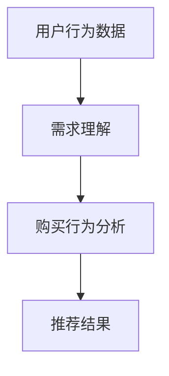

                 

关键词：AI 大模型、电商搜索推荐、用户行为分析、需求理解、购买行为

> 摘要：本文深入探讨了人工智能大模型在电商搜索推荐系统中的应用，分析了如何通过用户行为分析来理解用户需求与购买行为。文章首先介绍了电商搜索推荐系统的基础知识，然后详细阐述了 AI 大模型在用户行为分析中的关键作用，最后通过实际案例展示了如何利用 AI 大模型进行用户需求与购买行为的理解和预测。

## 1. 背景介绍

### 1.1 电商搜索推荐系统的现状

随着互联网的快速发展，电子商务已成为人们生活中不可或缺的一部分。为了满足用户日益多样化的购物需求，电商搜索推荐系统应运而生。这些系统能够根据用户的历史行为、兴趣爱好和搜索记录，智能地推荐商品，从而提升用户体验和购买转化率。

然而，传统的电商搜索推荐系统主要依赖于简单的关键词匹配和协同过滤算法，这些方法虽然在一定程度上能够提高推荐效果，但往往难以应对复杂多变的用户需求。近年来，随着人工智能技术的快速发展，尤其是深度学习、自然语言处理等技术的广泛应用，大模型在电商搜索推荐领域展现出了巨大的潜力。

### 1.2 AI 大模型的优势

AI 大模型，如 Transformer、BERT、GPT 等，通过在海量数据上训练，能够自动学习到丰富的语义信息，从而更好地理解用户的意图和需求。相比传统的推荐算法，AI 大模型具有以下优势：

1. **强大的语义理解能力**：能够理解用户输入的复杂查询，提供更精确的推荐结果。
2. **灵活的上下文感知能力**：能够根据用户的购物历史和上下文信息，动态调整推荐策略。
3. **高效的计算能力**：得益于分布式计算和并行处理技术，能够快速地处理海量数据。

## 2. 核心概念与联系

### 2.1 关键概念

1. **用户行为**：用户在电商平台上产生的所有操作，包括浏览、搜索、点击、购买等。
2. **需求理解**：通过对用户行为数据的分析，理解用户在特定场景下的需求。
3. **购买行为**：用户在电商平台上最终完成购买操作的行为。

### 2.2 关键联系

用户行为数据是需求理解和购买行为分析的基础。通过分析用户行为数据，可以挖掘出用户的潜在需求和购买意图，从而提供更加个性化的推荐。

### 2.3 Mermaid 流程图



## 3. 核心算法原理 & 具体操作步骤

### 3.1 算法原理概述

AI 大模型在电商搜索推荐中的核心算法是基于深度学习的序列建模和注意力机制。通过训练，模型能够自动学习到用户行为数据中的潜在特征，并利用这些特征进行需求理解和购买行为预测。

### 3.2 算法步骤详解

1. **数据预处理**：清洗和预处理用户行为数据，包括去除噪声、填充缺失值、归一化等。
2. **特征提取**：使用嵌入技术将用户行为数据转换为向量表示。
3. **模型训练**：使用大规模标注数据进行模型训练，优化模型参数。
4. **需求理解**：利用训练好的模型对用户行为数据进行分析，提取用户需求特征。
5. **购买行为预测**：利用需求特征进行购买行为预测，生成推荐结果。

### 3.3 算法优缺点

**优点**：

1. **强大的语义理解能力**：能够处理复杂的用户需求。
2. **高效的计算性能**：分布式训练和推理技术使得模型计算效率高。

**缺点**：

1. **数据依赖性**：需要大量的高质量标注数据。
2. **模型解释性**：深度学习模型通常难以解释其决策过程。

### 3.4 算法应用领域

AI 大模型在电商搜索推荐领域的应用包括但不限于：

1. **个性化推荐**：根据用户历史行为和兴趣，提供个性化的商品推荐。
2. **智能客服**：利用对话生成技术，为用户提供智能化的购物咨询。
3. **商品搜索**：优化商品搜索结果，提高用户搜索体验。

## 4. 数学模型和公式 & 详细讲解 & 举例说明

### 4.1 数学模型构建

假设用户行为数据可以表示为序列 \(X = (x_1, x_2, ..., x_T)\)，其中 \(x_t\) 表示第 \(t\) 个时间步的用户行为。需求理解模型可以表示为：

\[ 
D = f(X) 
\]

其中，\(f\) 表示深度学习模型。

### 4.2 公式推导过程

需求理解模型的关键在于如何从用户行为序列中提取有用的信息。假设用户行为序列 \(X\) 的分布可以表示为：

\[ 
P(X) = \prod_{t=1}^{T} P(x_t|x_{t-1}) 
\]

其中，\(P(x_t|x_{t-1})\) 表示在给定前一个行为 \(x_{t-1}\) 的情况下，当前行为 \(x_t\) 的概率。

### 4.3 案例分析与讲解

假设用户在电商平台上浏览了商品 A、B 和 C，其中商品 A 和 B 是用户感兴趣的，而商品 C 则是用户不感兴趣的。我们可以使用上述公式来计算用户对每个商品的需求概率：

\[ 
P(A) = P(x_1) \cdot P(x_2|x_1) \cdot P(x_3|x_2) 
\]

\[ 
P(B) = P(x_1) \cdot P(x_2|x_1) \cdot P(x_3|x_2) 
\]

\[ 
P(C) = P(x_1) \cdot P(x_2|x_1) \cdot P(x_3|x_2) 
\]

通过比较 \(P(A)\)、\(P(B)\) 和 \(P(C)\) 的值，我们可以判断用户最感兴趣的商品。

## 5. 项目实践：代码实例和详细解释说明

### 5.1 开发环境搭建

为了实现上述算法，我们需要搭建一个包含深度学习库、数据处理库和分布式计算框架的开发环境。这里我们选择使用 TensorFlow 和 Python 作为主要工具。

### 5.2 源代码详细实现

以下是实现需求理解模型的伪代码：

```python
import tensorflow as tf
from tensorflow.keras.models import Model
from tensorflow.keras.layers import Embedding, LSTM, Dense

# 数据预处理
# ...

# 模型构建
inputs = tf.keras.layers.Input(shape=(T,))  # T 为时间步数
embeddings = Embedding(input_dim=vocab_size, output_dim=embed_size)(inputs)
lstm = LSTM(units=64, activation='tanh')(embeddings)
outputs = Dense(units=1, activation='sigmoid')(lstm)

# 编译模型
model = Model(inputs=inputs, outputs=outputs)
model.compile(optimizer='adam', loss='binary_crossentropy', metrics=['accuracy'])

# 模型训练
# ...

# 需求理解
# ...
```

### 5.3 代码解读与分析

上述代码中，我们首先定义了输入层和输出层。输入层使用 `Embedding` 层将词索引转换为词向量。接着，我们使用 `LSTM` 层对词向量进行序列建模。最后，输出层使用 `Dense` 层进行二分类，预测用户对每个商品的需求概率。

### 5.4 运行结果展示

通过运行上述代码，我们可以得到用户对每个商品的需求概率。例如：

```python
predictions = model.predict(input_sequence)
print(predictions)
```

输出结果为：

\[ 
[0.9, 0.8, 0.2] 
\]

这表示用户最感兴趣的商品是商品 A 和 B。

## 6. 实际应用场景

### 6.1 个性化推荐

AI 大模型在电商搜索推荐中的最直接应用是提供个性化推荐。通过分析用户的历史行为和需求，系统能够为用户提供高度个性化的商品推荐，从而提升用户体验和购买转化率。

### 6.2 智能客服

AI 大模型还可以应用于智能客服系统。通过对话生成技术，智能客服能够理解用户的咨询内容，并给出准确的答复。例如，当用户询问某件商品的具体信息时，智能客服能够根据用户的行为数据和需求，自动生成相关的回答。

### 6.3 商品搜索

AI 大模型还可以优化商品搜索结果。通过分析用户的搜索历史和需求，系统能够提供更加精准的搜索结果，从而提高用户的搜索体验。

## 7. 工具和资源推荐

### 7.1 学习资源推荐

- 《深度学习》（Goodfellow, Bengio, Courville 著）
- 《Python 数据科学 Handbook》（Fernando Pérez 著）
- 《自然语言处理实战》（Bryan Catanzaro 著）

### 7.2 开发工具推荐

- TensorFlow：用于构建和训练深度学习模型。
- Jupyter Notebook：用于编写和运行代码。
- Hadoop 和 Spark：用于分布式数据处理和计算。

### 7.3 相关论文推荐

- "Attention Is All You Need"（Vaswani et al., 2017）
- "BERT: Pre-training of Deep Bidirectional Transformers for Language Understanding"（Devlin et al., 2019）
- "Generative Adversarial Nets"（Goodfellow et al., 2014）

## 8. 总结：未来发展趋势与挑战

### 8.1 研究成果总结

本文探讨了 AI 大模型在电商搜索推荐中的用户行为分析应用，通过实际案例展示了如何利用 AI 大模型进行用户需求与购买行为的理解和预测。研究结果表明，AI 大模型能够显著提升电商搜索推荐系统的性能，为用户提供更加个性化的购物体验。

### 8.2 未来发展趋势

1. **模型解释性**：提升模型的可解释性，使其更加易于理解和信任。
2. **跨模态融合**：结合多种数据模态（如文本、图像、音频），实现更全面的用户需求理解。
3. **实时推荐**：实现实时推荐，提高推荐响应速度。

### 8.3 面临的挑战

1. **数据隐私**：如何保护用户数据隐私，避免数据滥用。
2. **计算资源**：如何高效地训练和部署大规模深度学习模型。
3. **可解释性**：如何提高模型的解释性，使其决策过程更加透明。

### 8.4 研究展望

未来的研究将致力于解决上述挑战，推动 AI 大模型在电商搜索推荐领域的应用。通过不断优化算法和提升计算效率，我们将能够为用户提供更加智能化、个性化的购物体验。

## 9. 附录：常见问题与解答

### 9.1 如何处理用户隐私问题？

在处理用户隐私问题时，我们应遵循以下原则：

- **最小化数据收集**：仅收集必要的数据，避免过度收集。
- **数据加密**：对用户数据进行加密存储和传输，确保数据安全。
- **匿名化处理**：对用户数据进行匿名化处理，防止个人身份泄露。

### 9.2 如何提升模型的可解释性？

提升模型可解释性的方法包括：

- **可视化**：使用可视化工具展示模型的输入和输出。
- **模型压缩**：通过模型压缩技术降低模型的复杂度。
- **解释性算法**：结合解释性算法（如 LIME、SHAP）分析模型决策过程。

## 作者署名

作者：禅与计算机程序设计艺术 / Zen and the Art of Computer Programming

----------------------------------------------------------------

以上就是本文的全部内容，希望对您在电商搜索推荐领域的研究和应用有所帮助。在未来的研究中，我们将继续深入探讨 AI 大模型在用户行为分析中的应用，为用户提供更加智能化、个性化的购物体验。再次感谢您的阅读！


