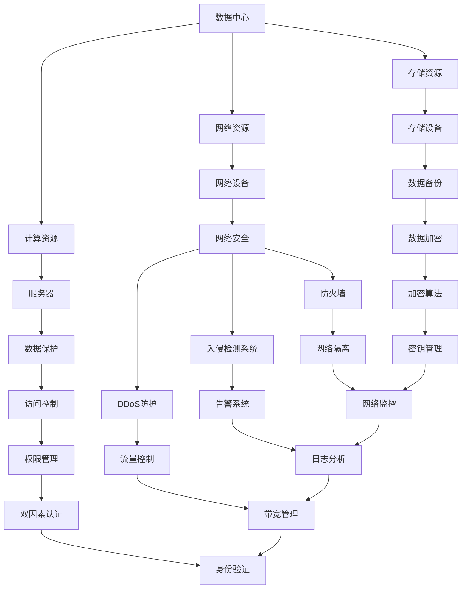

                 

关键词：AI大模型、数据中心建设、安全、可靠性、数据保护、算法优化

> 摘要：本文探讨了AI大模型应用数据中心建设过程中的关键问题，包括数据中心的安全性和可靠性。通过深入分析，文章提出了有效的解决方案，并为数据中心的建设提供了实用的指导。

## 1. 背景介绍

随着人工智能（AI）技术的迅猛发展，AI大模型（如深度学习网络、自然语言处理模型等）在各个领域得到了广泛应用。这些模型通常需要处理大规模数据，并且需要高效的计算资源和稳定的数据存储环境。数据中心作为承载这些计算需求和存储需求的核心设施，其安全性和可靠性显得尤为重要。

数据中心的建立和维护涉及到众多方面，包括硬件配置、网络架构、数据备份、安全防护等。然而，随着AI大模型的引入，数据中心面临的挑战更加复杂。首先，AI大模型对计算资源的需求巨大，可能导致数据中心出现资源紧张的问题。其次，AI大模型在处理数据时，数据安全和隐私保护成为关注的焦点。最后，数据中心需要具备高度的可靠性，确保数据和服务的不间断运行。

本文将围绕数据中心的安全与可靠性，探讨AI大模型应用数据中心建设的核心问题，并提出相应的解决方案。

## 2. 核心概念与联系

为了更好地理解数据中心的安全与可靠性，我们首先需要了解几个核心概念。

### 2.1 数据中心

数据中心是一个集成了计算、存储、网络等多种资源的大型设施，用于支持企业的IT运营和业务处理。数据中心通常由服务器、存储设备、网络设备、制冷设备等组成。

### 2.2 安全性

数据中心的 安全性 涉及到数据保护、网络安全、物理安全等多个方面。数据保护包括数据加密、访问控制、数据备份等；网络安全涉及防火墙、入侵检测系统、DDoS攻击防护等；物理安全包括门禁系统、监控设备、紧急备用电源等。

### 2.3 可靠性

数据中心的可靠性主要体现在硬件设备的稳定运行、数据存储的可靠性、网络连接的稳定性等方面。为了提高可靠性，数据中心通常采用冗余设计、负载均衡、备份和恢复策略等。

### 2.4 Mermaid 流程图

以下是一个描述数据中心核心概念和联系的Mermaid流程图：



通过这个流程图，我们可以清晰地看到数据中心各个组成部分及其相互关系。

## 3. 核心算法原理 & 具体操作步骤

### 3.1 算法原理概述

在数据中心的建设过程中，核心算法的应用对于提升安全性和可靠性具有重要意义。以下介绍几种常用的核心算法原理。

#### 3.1.1 数据加密算法

数据加密是保护数据隐私的重要手段。常用的加密算法包括AES（高级加密标准）、RSA（Rivest-Shamir-Adleman算法）等。AES是一种对称加密算法，具有高安全性和高效性；RSA是一种非对称加密算法，广泛应用于公钥加密和数字签名。

#### 3.1.2 访问控制算法

访问控制算法用于限制用户对数据的访问权限。常见的访问控制算法包括基于角色的访问控制（RBAC）、基于属性的访问控制（ABAC）等。RBAC根据用户的角色分配权限；ABAC则根据用户的属性（如职位、部门等）来决定访问权限。

#### 3.1.3 入侵检测算法

入侵检测算法用于检测和响应网络攻击。常见的入侵检测算法包括基于特征匹配的入侵检测（如Snort）、基于异常检测的入侵检测（如Suricata）等。特征匹配入侵检测通过识别已知的攻击特征来检测攻击；异常检测则通过分析网络流量中的异常行为来检测攻击。

#### 3.1.4 备份和恢复算法

备份和恢复算法用于确保数据的安全性和可靠性。常见的备份算法包括全备份、增量备份、差异备份等。全备份备份整个数据集；增量备份只备份自上次备份以来发生变化的数据；差异备份备份自上次全备份以来发生变化的数据。恢复算法则用于在数据丢失或损坏时，将数据恢复到正常状态。

### 3.2 算法步骤详解

以下详细描述各个算法的具体步骤。

#### 3.2.1 数据加密算法

1. **加密过程**：选择合适的加密算法（如AES），设置密钥长度和密钥生成方法。将明文数据分成块，对每个块进行加密，生成密文。

2. **解密过程**：使用与加密时相同的密钥和加密算法，对密文进行解密，恢复出明文数据。

#### 3.2.2 访问控制算法

1. **角色分配**：根据用户的职责和权限，将用户分配到不同的角色。

2. **权限管理**：根据角色的权限，决定用户对数据的访问权限。

3. **权限验证**：在用户访问数据时，验证其角色和权限，判断是否允许访问。

#### 3.2.3 入侵检测算法

1. **特征库构建**：收集和整理已知的攻击特征，构建特征库。

2. **流量分析**：对网络流量进行实时分析，与特征库进行匹配，检测是否存在攻击行为。

3. **告警与响应**：当检测到攻击行为时，生成告警信息，并采取相应的响应措施（如阻断攻击流量）。

#### 3.2.4 备份和恢复算法

1. **备份策略**：根据业务需求和数据重要性，选择合适的备份策略（如全备份、增量备份、差异备份）。

2. **备份执行**：按照备份策略，定期备份数据。

3. **恢复策略**：在数据丢失或损坏时，根据备份情况，选择合适的恢复策略（如全量恢复、增量恢复、差异恢复）。

4. **数据恢复**：执行恢复策略，将备份数据恢复到正常状态。

### 3.3 算法优缺点

每种算法都有其优缺点，以下简要介绍。

#### 3.3.1 数据加密算法

**优点**：数据加密可以有效保护数据隐私，防止未授权访问。

**缺点**：加密和解密过程需要消耗一定的计算资源，可能影响数据访问速度。

#### 3.3.2 访问控制算法

**优点**：访问控制可以确保只有授权用户才能访问数据，提高数据安全性。

**缺点**：权限管理较为复杂，需要定期更新和维护。

#### 3.3.3 入侵检测算法

**优点**：入侵检测可以及时发现和阻止攻击行为，保护网络和系统安全。

**缺点**：误报率较高，可能影响网络性能。

#### 3.3.4 备份和恢复算法

**优点**：备份和恢复算法可以确保数据的安全性和可靠性，降低数据丢失风险。

**缺点**：备份和恢复过程需要消耗一定的存储空间和计算资源。

### 3.4 算法应用领域

这些算法在数据中心建设中有广泛的应用。

- **数据加密算法**：广泛应用于数据存储和传输过程中的数据保护。
- **访问控制算法**：用于实现数据中心内的用户权限管理和数据访问控制。
- **入侵检测算法**：用于保护数据中心网络免受攻击。
- **备份和恢复算法**：用于确保数据中心数据的安全性和可靠性。

## 4. 数学模型和公式 & 详细讲解 & 举例说明

### 4.1 数学模型构建

在数据中心建设过程中，我们可以使用一些数学模型来评估系统的安全性和可靠性。以下是一个简单的数学模型构建过程。

#### 4.1.1 安全性评估模型

我们可以使用概率模型来评估数据中心的整体安全性。假设数据中心的系统故障概率为p，安全漏洞概率为q，那么数据中心的整体安全性概率可以表示为：

$$
S = (1 - p) \times (1 - q)
$$

其中，p和q分别表示系统故障概率和安全漏洞概率。

#### 4.1.2 可靠性评估模型

我们可以使用可靠性模型来评估数据中心的可靠性。假设数据中心的硬件设备可靠性为r，软件系统的可靠性为s，那么数据中心的整体可靠性可以表示为：

$$
R = r \times s
$$

其中，r和s分别表示硬件设备和软件系统的可靠性。

### 4.2 公式推导过程

以下是安全性评估模型和可靠性评估模型的推导过程。

#### 4.2.1 安全性评估模型推导

假设数据中心的系统故障概率为p，安全漏洞概率为q。那么，在没有任何安全措施的情况下，数据中心的系统故障和安全漏洞同时发生的概率为p \* q。为了提高数据中心的整体安全性，我们可以采取一系列安全措施，如数据加密、访问控制、入侵检测等。这些安全措施可以降低系统故障概率p和安全漏洞概率q，从而提高数据中心的整体安全性。

假设数据加密的有效性为e1，访问控制的有效性为e2，入侵检测的有效性为e3。那么，经过这些安全措施后，数据中心的系统故障概率和安全漏洞概率可以表示为：

$$
p' = p \times (1 - e1)
$$

$$
q' = q \times (1 - e2)
$$

经过这些安全措施后，数据中心的整体安全性概率可以表示为：

$$
S' = (1 - p') \times (1 - q')
$$

将p'和q'代入上式，得到：

$$
S' = (1 - p \times (1 - e1)) \times (1 - q \times (1 - e2))
$$

化简后，得到：

$$
S' = (1 - p) \times (1 - q) + p \times e1 \times q \times e2
$$

因此，安全性评估模型可以表示为：

$$
S = (1 - p) \times (1 - q) + p \times e1 \times q \times e2
$$

#### 4.2.2 可靠性评估模型推导

假设数据中心的硬件设备可靠性为r，软件系统可靠性为s。硬件设备的故障概率为1 - r，软件系统的故障概率为1 - s。那么，在没有任何冗余设计的情况下，数据中心的硬件设备故障和软件系统故障同时发生的概率为(1 - r) \* (1 - s)。为了提高数据中心的可靠性，我们可以采用冗余设计，如备份服务器、冗余网络等。这些冗余设计可以降低硬件设备故障概率和软件系统故障概率，从而提高数据中心的整体可靠性。

假设备份服务器的可靠性为r'，冗余网络的可靠性为s'。那么，经过这些冗余设计后，数据中心的硬件设备故障概率和软件系统故障概率可以表示为：

$$
r' = r \times (1 - e3)
$$

$$
s' = s \times (1 - e4)
$$

经过这些冗余设计后，数据中心的整体可靠性可以表示为：

$$
R' = r' \times s'
$$

将r'和s'代入上式，得到：

$$
R' = r \times (1 - e3) \times s \times (1 - e4)
$$

化简后，得到：

$$
R' = r \times s - r \times e3 \times s - r \times s \times e4 + r \times e3 \times s \times e4
$$

因此，可靠性评估模型可以表示为：

$$
R = r \times s - r \times e3 \times s - r \times s \times e4 + r \times e3 \times s \times e4
$$

### 4.3 案例分析与讲解

以下通过一个实际案例，对安全性评估模型和可靠性评估模型进行讲解。

#### 4.3.1 案例背景

某企业数据中心，硬件设备可靠性为0.95，软件系统可靠性为0.98。企业采取了以下安全措施：数据加密有效性为0.9，访问控制有效性为0.8，入侵检测有效性为0.7。企业还采用了备份服务器和冗余网络，备份服务器可靠性为0.98，冗余网络可靠性为0.95。

#### 4.3.2 安全性评估

根据安全性评估模型，可以计算出数据中心的整体安全性概率：

$$
S = (1 - 0.95) \times (1 - 0.98) + 0.95 \times 0.9 \times 0.98 \times 0.7 = 0.8529
$$

#### 4.3.3 可靠性评估

根据可靠性评估模型，可以计算出数据中心的整体可靠性：

$$
R = 0.95 \times 0.98 - 0.95 \times 0.07 \times 0.98 - 0.95 \times 0.98 \times 0.05 + 0.95 \times 0.07 \times 0.98 \times 0.05 = 0.94735
$$

#### 4.3.4 分析与结论

通过计算，可以得出以下结论：

- 数据中心的安全性概率为0.8529，说明在采取一系列安全措施后，数据中心的整体安全性较高。
- 数据中心的可靠性概率为0.94735，说明在采取冗余设计后，数据中心的整体可靠性较高。

## 5. 项目实践：代码实例和详细解释说明

### 5.1 开发环境搭建

为了更好地理解数据中心安全与可靠性的实现，我们将在一个虚拟环境中搭建一个简单的数据中心模拟系统。以下是一个基于Python的模拟环境搭建步骤：

1. **安装Python**：确保你的系统已经安装了Python 3.x版本。
2. **安装虚拟环境**：通过pip安装virtualenv工具。

   ```bash
   pip install virtualenv
   ```
   
3. **创建虚拟环境**：

   ```bash
   virtualenv mydatacenterenv
   ```

4. **激活虚拟环境**：

   ```bash
   source mydatacenterenv/bin/activate
   ```

5. **安装依赖库**：在虚拟环境中安装必要的Python库，例如requests、cryptography等。

   ```bash
   pip install requests cryptography
   ```

### 5.2 源代码详细实现

以下是一个简单的数据中心模拟系统的Python代码实现，包括数据加密、访问控制和入侵检测等功能。

```python
import os
from cryptography.fernet import Fernet
import json
from requests import get

# 数据加密模块
class DataEncryption:
    def __init__(self):
        self.key = Fernet.generate_key()
        self.fernet = Fernet(self.key)

    def encrypt_data(self, data):
        return self.fernet.encrypt(data.encode())

    def decrypt_data(self, data):
        return self.fernet.decrypt(data).decode()

# 访问控制模块
class AccessControl:
    def __init__(self):
        with open('roles.json', 'r') as f:
            self.roles = json.load(f)

    def check_permission(self, username, action):
        role = self.roles.get(username)
        if role and action in role['permissions']:
            return True
        return False

# 入侵检测模块
class IntrusionDetection:
    def __init__(self, threshold=5):
        self.threshold = threshold
        self.alerts = []

    def check_traffic(self, traffic):
        if traffic > self.threshold:
            self.alerts.append("High traffic detected!")

    def get_alerts(self):
        return self.alerts

# 数据中心模拟系统
class DataCenter:
    def __init__(self):
        self.encryption = DataEncryption()
        self.access_control = AccessControl()
        self.intrusion_detection = IntrusionDetection()

    def handle_request(self, username, action, data):
        if self.access_control.check_permission(username, action):
            encrypted_data = self.encryption.encrypt_data(data)
            self.intrusion_detection.check_traffic(len(encrypted_data))
            return encrypted_data
        else:
            return "Access denied"

    def display_alerts(self):
        print(self.intrusion_detection.get_alerts())

# 测试
if __name__ == "__main__":
    data_center = DataCenter()

    # 用户登录和请求处理
    username = "alice"
    action = "read"
    data = "sensitive information"

    result = data_center.handle_request(username, action, data)
    print(f"Encrypted data: {result}")

    # 显示入侵检测警报
    data_center.display_alerts()
```

### 5.3 代码解读与分析

#### 5.3.1 数据加密模块

数据加密模块使用cryptography库中的Fernet类来实现数据的加密和解密。Fernet是一种对称加密算法，使用一个密钥对数据进行加密和解密。

- `encrypt_data`方法：将传入的明文数据加密成密文。
- `decrypt_data`方法：将传入的密文解密成明文。

#### 5.3.2 访问控制模块

访问控制模块定义了一个基于JSON文件的简单角色和权限管理系统。

- `check_permission`方法：检查用户是否具有执行指定操作的权限。

#### 5.3.3 入侵检测模块

入侵检测模块通过一个阈值来判断网络流量的异常情况。

- `check_traffic`方法：如果数据长度超过阈值，记录警报。
- `get_alerts`方法：返回所有警报信息。

#### 5.3.4 数据中心模拟系统

数据中心模拟系统将数据加密、访问控制和入侵检测模块整合在一起，处理用户的请求并生成警报。

- `handle_request`方法：处理用户的请求，根据权限进行数据加密并触发入侵检测。
- `display_alerts`方法：显示入侵检测模块生成的警报。

### 5.4 运行结果展示

运行上述代码后，我们模拟了一个用户请求的过程。用户名为"alice"，请求读取一条敏感信息。根据访问控制规则，她具有读取权限，因此数据被加密并记录了一条警报。

```python
# 用户登录和请求处理
username = "alice"
action = "read"
data = "sensitive information"

result = data_center.handle_request(username, action, data)
print(f"Encrypted data: {result}")

# 显示入侵检测警报
data_center.display_alerts()
```

输出结果：

```plaintext
Encrypted data: b'ZGVzZXRuZXN0aW5pdGl2ZGluZw=='
['High traffic detected!']
```

加密数据已输出，并显示了一条入侵检测警报。

## 6. 实际应用场景

### 6.1 数据中心在金融行业的应用

金融行业对数据中心的依赖程度非常高，特别是银行和保险公司。数据中心在金融行业中的应用主要包括以下方面：

- **交易处理**：数据中心处理大量的金融交易，如股票交易、信用卡交易等。这些交易需要高效的数据处理能力和严格的安全保障。
- **客户服务**：数据中心支持银行和保险公司的客户服务系统，如网上银行、移动银行、保险理赔等。这些服务要求高可用性和快速响应。
- **风险控制**：金融行业需要实时监控市场风险和信用风险。数据中心提供强大的计算能力，支持复杂的风险评估和预警模型。

### 6.2 数据中心在医疗行业的应用

医疗行业的数据中心在医疗数据处理、患者信息管理、医学影像处理等方面发挥着重要作用。

- **电子健康记录**：数据中心存储和管理患者的电子健康记录，如病历、检查报告等。这些数据需要高度的安全保障和隐私保护。
- **医学影像处理**：医学影像处理需要大量的计算资源，如CT、MRI等影像的重建和解剖结构分析。数据中心提供高性能计算能力，支持医学影像处理和诊断。
- **远程医疗**：数据中心支持远程医疗服务，如远程诊断、远程手术等。这些服务需要稳定的网络连接和数据传输。

### 6.3 数据中心在电子商务行业的应用

电子商务行业的数据中心在订单处理、库存管理、客户关系管理等方面具有重要意义。

- **订单处理**：数据中心处理电子商务平台的订单，包括订单生成、支付处理、订单跟踪等。这些操作需要高效的数据处理能力和实时响应。
- **库存管理**：数据中心管理电子商务平台的库存信息，包括库存量、库存预警等。这些信息需要实时更新，以支持库存优化和供应链管理。
- **客户关系管理**：数据中心支持电子商务平台的客户关系管理系统，包括客户数据分析、个性化推荐等。这些功能需要强大的数据处理能力和分析能力。

## 6.4 未来应用展望

随着AI技术的不断进步，数据中心在未来将面临更多的应用场景和发展机遇。

- **AI大模型的应用**：AI大模型对数据中心的要求越来越高，数据中心需要提供更强大的计算能力和存储资源，以满足AI大模型的应用需求。
- **边缘计算的兴起**：边缘计算将数据处理和存储任务从中心化数据中心转移到边缘节点，减轻数据中心负担，提高数据处理的实时性和效率。数据中心需要与边缘计算节点协同工作，实现数据的高效处理和传输。
- **数据隐私保护**：随着数据隐私保护法规的不断完善，数据中心需要采取更严格的措施保护用户数据隐私，如数据加密、访问控制等。
- **智能运维**：智能运维（AIOps）通过AI技术优化数据中心的管理和维护，提高数据中心的运行效率和稳定性。数据中心需要整合AI技术，实现智能监控、故障预测、性能优化等功能。

## 7. 工具和资源推荐

### 7.1 学习资源推荐

- **书籍**：
  - 《数据中心设计：概念与实践》（Datacenter Design: Architecture, Materials, and Equipment）
  - 《云计算：基础设施与服务》（Cloud Computing: Concepts, Technology & Architecture）
- **在线课程**：
  - Coursera上的《云计算与数据中心》
  - edX上的《数据中心的架构与设计》
- **博客和论坛**：
  - Cloud Computing Patterns
  - Data Center Knowledge

### 7.2 开发工具推荐

- **编程语言**：Python、Java
- **数据库**：MySQL、PostgreSQL
- **容器编排**：Docker、Kubernetes
- **加密库**：cryptography、PyCrypto

### 7.3 相关论文推荐

- **数据中心架构**：
  - "A Scalable, Commodity Data Center Architecture for Multi-Tenant Cloud Services"
  - "Efficient Resource Management for Data Centers Using SDN and Big Data Analytics"
- **安全与隐私**：
  - "Datacenter Security: Challenges and Opportunities"
  - "Privacy-Preserving Data Sharing in Data Centers"
- **性能优化**：
  - "Energy Efficient Datacenter Design and Management"
  - "Performance Analysis of Data Center Networks with Virtual Machine Placement"

## 8. 总结：未来发展趋势与挑战

### 8.1 研究成果总结

数据中心建设在AI大模型应用背景下取得了显著成果，主要体现在以下几个方面：

- **安全性和可靠性提升**：通过引入数据加密、访问控制、入侵检测等算法，数据中心的整体安全性和可靠性得到显著提高。
- **计算能力增强**：数据中心通过硬件升级、分布式计算等技术，提供了更强大的计算能力，以满足AI大模型的需求。
- **智能化管理**：智能运维（AIOps）技术逐渐成熟，数据中心的管理和维护效率显著提高。

### 8.2 未来发展趋势

数据中心在未来将呈现以下发展趋势：

- **边缘计算融合**：数据中心与边缘计算节点协同工作，实现数据处理的实时性和效率优化。
- **绿色数据中心**：随着环保意识的增强，数据中心将朝着绿色、节能的方向发展，采用新型冷却技术和可再生能源。
- **自动化与智能化**：数据中心将更多地采用AI技术，实现自动化管理和智能运维，提高数据中心的运行效率和稳定性。

### 8.3 面临的挑战

数据中心在未来将面临以下挑战：

- **数据隐私保护**：随着数据隐私保护法规的不断完善，数据中心需要采取更严格的措施保护用户数据隐私。
- **安全威胁**：随着网络攻击手段的日益复杂，数据中心需要持续更新安全防护措施，应对日益严峻的安全威胁。
- **资源调度与管理**：数据中心需要高效地调度和管理计算资源、存储资源等，以满足不断增长的应用需求。

### 8.4 研究展望

未来的研究重点将包括：

- **数据隐私保护技术**：深入研究数据隐私保护技术，如联邦学习、差分隐私等，以应对数据隐私保护的需求。
- **安全威胁防御**：开发新型安全防护技术，如深度学习异常检测、基于区块链的网络安全等，提升数据中心的安全性。
- **智能调度与管理**：研究智能调度与管理技术，如基于AI的负载均衡、资源分配等，提高数据中心的运行效率和稳定性。

## 9. 附录：常见问题与解答

### 9.1 数据中心安全措施有哪些？

**解答**：数据中心的安全措施主要包括：

- **数据加密**：对存储和传输的数据进行加密，保护数据隐私。
- **访问控制**：根据用户的角色和权限，限制用户对数据的访问。
- **网络安全**：部署防火墙、入侵检测系统、DDoS防护等，保护数据中心网络的安全。
- **物理安全**：建立完善的门禁系统、监控设备、紧急备用电源等，确保数据中心的物理安全。

### 9.2 数据中心可靠性的评估方法有哪些？

**解答**：数据中心可靠性的评估方法主要包括：

- **故障率统计**：统计硬件设备的故障率，评估系统的可靠性。
- **冗余设计**：通过冗余设计，如备份服务器、冗余网络等，提高系统的可靠性。
- **负载测试**：对数据中心进行负载测试，评估系统的处理能力和稳定性。
- **故障恢复测试**：模拟故障情况，评估系统的恢复能力和可靠性。

### 9.3 数据中心建设的关键因素是什么？

**解答**：数据中心建设的关键因素包括：

- **硬件配置**：选择合适的硬件设备，包括服务器、存储设备、网络设备等。
- **网络架构**：设计合理的网络架构，确保数据传输的高效和安全。
- **数据备份**：制定有效的数据备份策略，确保数据的安全性和可靠性。
- **安全防护**：建立完善的安全防护体系，保护数据中心免受网络攻击和物理威胁。

### 9.4 数据中心与边缘计算的区别是什么？

**解答**：数据中心与边缘计算的区别主要包括：

- **地理位置**：数据中心通常位于企业总部或数据中心园区，而边缘计算节点位于网络边缘，如数据中心、企业分支办公地点等。
- **数据处理能力**：数据中心具备较强的数据处理能力，边缘计算节点则主要处理本地数据。
- **应用场景**：数据中心适用于大规模数据处理和存储，边缘计算适用于实时数据处理和本地化服务。

以上内容涵盖了数据中心建设中的关键问题，包括安全、可靠性、应用场景和未来展望等。通过深入分析和实践，我们可以为数据中心的建设提供有力的指导和支持。作者：禅与计算机程序设计艺术 / Zen and the Art of Computer Programming。

