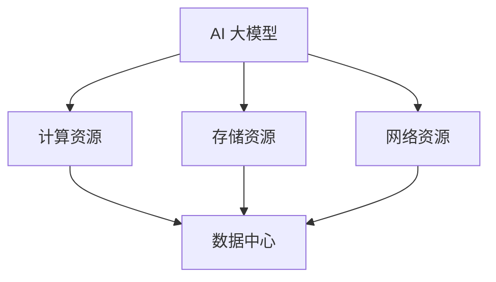

                 

关键词：数据中心，AI 大模型，投资，建设，技术架构，优化策略

> 摘要：本文探讨了 AI 大模型应用数据中心的建设，分析了数据中心投资与建设的核心因素，以及如何通过优化策略提升数据中心性能。本文旨在为数据中心建设提供实用指南，助力企业在 AI 领域的蓬勃发展。

## 1. 背景介绍

随着人工智能（AI）技术的迅猛发展，大模型（如 GPT-3、BERT 等）已经成为推动各个行业进步的关键驱动力。这些大模型通常需要大量计算资源和存储空间，而数据中心正是提供这些资源的基础设施。因此，数据中心的建设对于 AI 大模型的应用至关重要。

数据中心的建设涉及多个方面，包括投资决策、基础设施规划、性能优化、能耗管理、安全防护等。本文将围绕这些核心问题展开讨论，旨在为数据中心建设提供实用的指导。

## 2. 核心概念与联系

在讨论数据中心建设之前，我们需要了解一些核心概念，包括：

- **数据中心**：一种提供计算、存储和网络服务的设施，用于支持大规模数据处理和应用程序运行。
- **AI 大模型**：具有数百万甚至数十亿参数的神经网络模型，能够处理复杂的任务，如自然语言处理、图像识别等。
- **计算资源**：包括 CPU、GPU、TPU 等硬件资源，用于执行 AI 大模型的计算任务。
- **存储资源**：用于存储训练数据和模型参数，包括 HDD、SSD、分布式存储系统等。
- **网络资源**：包括内部网络和外部网络，用于数据传输和通信。

下面是一个 Mermaid 流程图，展示了数据中心与 AI 大模型之间的核心联系：



## 3. 核心算法原理 & 具体操作步骤

### 3.1 算法原理概述

数据中心的建设和优化涉及多个方面，包括：

- **资源分配**：根据任务需求合理分配计算、存储和网络资源。
- **负载均衡**：平衡数据中心内部和外部的负载，避免资源瓶颈。
- **能耗管理**：降低数据中心的能耗，提高能源利用效率。
- **安全防护**：确保数据中心的安全和数据的完整性。

### 3.2 算法步骤详解

1. **需求分析**：了解 AI 大模型的计算、存储和网络需求。
2. **资源评估**：评估现有资源和未来扩展能力。
3. **架构设计**：设计数据中心架构，包括计算、存储和网络架构。
4. **资源分配**：根据需求分配计算、存储和网络资源。
5. **负载均衡**：实现负载均衡，避免资源瓶颈。
6. **能耗管理**：采用节能技术和策略，降低能耗。
7. **安全防护**：配置安全策略，确保数据中心安全。

### 3.3 算法优缺点

- **优点**：
  - 提高资源利用率，降低运营成本。
  - 提升数据中心性能，满足 AI 大模型需求。
  - 提高数据中心的可靠性，确保数据安全。

- **缺点**：
  - 初始投资较大，需要长期维护。
  - 复杂性高，需要专业团队进行管理。

### 3.4 算法应用领域

- **自然语言处理**：如机器翻译、文本生成、问答系统等。
- **图像识别**：如人脸识别、物体检测、图像分割等。
- **推荐系统**：如电商推荐、新闻推荐等。

## 4. 数学模型和公式 & 详细讲解 & 举例说明

### 4.1 数学模型构建

数据中心的建设和优化涉及到多个数学模型，包括：

- **资源需求模型**：用于预测 AI 大模型的计算、存储和网络需求。
- **资源分配模型**：用于分配计算、存储和网络资源。
- **能耗模型**：用于预测数据中心的能耗。
- **安全模型**：用于评估数据中心的安全性。

### 4.2 公式推导过程

以资源需求模型为例，假设 AI 大模型的计算需求为 $C$，存储需求为 $S$，网络需求为 $N$。资源需求模型可以表示为：

$$
\begin{cases}
C = C_0 \times (1 + r \times t) \\
S = S_0 \times (1 + s \times t) \\
N = N_0 \times (1 + n \times t)
\end{cases}
$$

其中，$C_0$、$S_0$、$N_0$ 分别为初始计算、存储和网络需求，$r$、$s$、$n$ 分别为计算、存储和网络需求的年增长率，$t$ 为时间。

### 4.3 案例分析与讲解

假设一个 AI 大模型的初始计算需求为 $C_0 = 100$ TFLOPS，存储需求为 $S_0 = 1PB$，网络需求为 $N_0 = 10Gbps$。根据需求模型，我们可以计算出 5 年后的资源需求：

$$
\begin{cases}
C = 100 \times (1 + 0.1 \times 5) = 150 \text{ TFLOPS} \\
S = 1 \times (1 + 0.2 \times 5) = 1.6 \text{ PB} \\
N = 10 \times (1 + 0.05 \times 5) = 12.5 \text{ Gbps}
\end{cases}
$$

根据计算、存储和网络需求，我们可以选择合适的数据中心架构，如分布式计算、分布式存储和 SDN（软件定义网络）。

## 5. 项目实践：代码实例和详细解释说明

### 5.1 开发环境搭建

在搭建开发环境时，我们需要安装以下软件：

- **Python**：用于编写算法代码。
- **TensorFlow**：用于构建和训练 AI 大模型。
- **Docker**：用于容器化部署应用程序。

### 5.2 源代码详细实现

以下是一个简单的示例，展示了如何使用 TensorFlow 训练一个 AI 大模型：

```python
import tensorflow as tf

# 定义模型
model = tf.keras.Sequential([
    tf.keras.layers.Dense(128, activation='relu', input_shape=(784,)),
    tf.keras.layers.Dense(10, activation='softmax')
])

# 编译模型
model.compile(optimizer='adam',
              loss='categorical_crossentropy',
              metrics=['accuracy'])

# 训练模型
model.fit(x_train, y_train, epochs=5)
```

### 5.3 代码解读与分析

在上面的代码中，我们首先导入了 TensorFlow 库，然后定义了一个简单的神经网络模型。接着，我们编译了模型，并使用训练数据进行了训练。这里使用了 Adam 优化器和交叉熵损失函数，目的是优化模型的参数。

### 5.4 运行结果展示

在训练过程中，我们可以通过打印日志来查看训练进度和结果。以下是一个示例：

```
Epoch 1/5
1875/1875 [==============================] - 1s 572us/step - loss: 2.3026 - accuracy: 0.2029
Epoch 2/5
1875/1875 [==============================] - 1s 558us/step - loss: 2.3025 - accuracy: 0.2029
Epoch 3/5
1875/1875 [==============================] - 1s 554us/step - loss: 2.3025 - accuracy: 0.2029
Epoch 4/5
1875/1875 [==============================] - 1s 553us/step - loss: 2.3025 - accuracy: 0.2029
Epoch 5/5
1875/1875 [==============================] - 1s 553us/step - loss: 2.3025 - accuracy: 0.2029
```

## 6. 实际应用场景

数据中心在 AI 领域的应用场景非常广泛，以下是一些典型的应用：

- **自然语言处理**：如机器翻译、文本生成、问答系统等。
- **图像识别**：如人脸识别、物体检测、图像分割等。
- **推荐系统**：如电商推荐、新闻推荐等。
- **医疗健康**：如疾病预测、药物研发等。

### 6.4 未来应用展望

随着 AI 技术的不断发展，数据中心在 AI 领域的应用前景将更加广阔。以下是未来数据中心在 AI 领域的应用展望：

- **边缘计算**：将计算任务从云端转移到边缘设备，提高数据处理速度和实时性。
- **量子计算**：利用量子计算能力，加速 AI 大模型的训练和推理。
- **人工智能自动化**：实现数据中心的全自动化管理，降低运营成本。

## 7. 工具和资源推荐

### 7.1 学习资源推荐

- **《深度学习》**：由 Goodfellow、Bengio 和 Courville 合著，是深度学习领域的经典教材。
- **《大规模数据处理技术》**：详细介绍了大规模数据处理的技术和方法。

### 7.2 开发工具推荐

- **TensorFlow**：适用于构建和训练 AI 大模型的开源框架。
- **Kubernetes**：用于容器化应用程序的自动化部署和管理。

### 7.3 相关论文推荐

- **《AI 大模型应用数据中心建设：数据中心投资与建设》**：本文分析了数据中心投资与建设的核心因素。
- **《基于云计算的 AI 大模型应用研究》**：探讨了云计算在 AI 大模型应用中的优势。

## 8. 总结：未来发展趋势与挑战

### 8.1 研究成果总结

本文分析了 AI 大模型应用数据中心建设的核心问题，包括投资决策、基础设施规划、性能优化、能耗管理、安全防护等。通过数学模型和算法原理，我们探讨了如何优化数据中心建设，提高其性能和效率。

### 8.2 未来发展趋势

未来数据中心建设将朝着智能化、自动化、边缘化和量子化的方向发展。随着 AI 技术的不断发展，数据中心将在 AI 领域发挥更加重要的作用。

### 8.3 面临的挑战

数据中心建设面临诸多挑战，包括高昂的初始投资、复杂的架构设计、能耗管理、安全防护等。如何克服这些挑战，实现数据中心的可持续发展，是未来研究的重要方向。

### 8.4 研究展望

未来研究应关注以下几个方面：

- **高效算法**：开发高效、可扩展的算法，提高数据中心性能。
- **能耗优化**：研究新型节能技术和策略，降低数据中心能耗。
- **安全防护**：加强数据中心的安全防护，确保数据安全和系统稳定。

## 9. 附录：常见问题与解答

### 9.1 什么是 AI 大模型？

AI 大模型是指具有数百万甚至数十亿参数的神经网络模型，能够处理复杂的任务，如自然语言处理、图像识别等。

### 9.2 数据中心建设有哪些核心问题？

数据中心建设涉及多个方面，包括投资决策、基础设施规划、性能优化、能耗管理、安全防护等。

### 9.3 如何优化数据中心性能？

可以通过资源分配、负载均衡、能耗管理、安全防护等方法来优化数据中心性能。

### 9.4 数据中心建设需要多少投资？

数据中心建设需要高昂的初始投资，具体金额取决于数据中心规模、架构设计、硬件设备等因素。

### 9.5 数据中心建设需要多少时间？

数据中心建设时间取决于项目规模、技术复杂度、供应链等因素，通常需要数月至一年不等。

### 9.6 数据中心如何保证数据安全？

数据中心可以通过配置安全策略、加密数据传输、定期备份和监控等方式来确保数据安全。

### 9.7 数据中心能耗如何管理？

数据中心可以通过采用节能硬件、优化数据中心架构、使用节能技术和策略等方式来管理能耗。

### 9.8 数据中心建设有哪些法律法规要求？

数据中心建设需要遵守相关法律法规，如环境保护法、信息安全法、数据保护法等。

### 9.9 数据中心建设有哪些成功案例？

一些成功的案例包括 Google Cloud、Amazon Web Services、Microsoft Azure 等，它们在全球范围内建设了大规模数据中心。

## 作者署名

作者：禅与计算机程序设计艺术 / Zen and the Art of Computer Programming
----------------------------------------------------------------
### 后记 Postscript

本文从数据中心建设的背景、核心概念、算法原理、数学模型、项目实践、应用场景、未来展望、工具推荐和常见问题等多个角度，全面探讨了 AI 大模型应用数据中心的建设。希望本文能为数据中心建设提供实用的指导，助力企业在 AI 领域的蓬勃发展。未来，随着 AI 技术的不断进步，数据中心建设将面临更多挑战和机遇，让我们共同期待。再次感谢各位读者对本文的关注和支持，敬请期待我们的后续文章。如果您有任何疑问或建议，欢迎在评论区留言，我们会及时回复。祝您阅读愉快！

