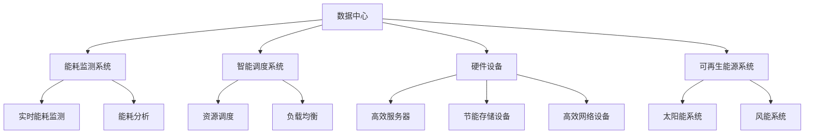

                 

关键词：人工智能、数据中心、绿色节能、大模型、架构设计、算法优化

> 摘要：本文探讨了人工智能大模型应用数据中心的建设，重点关注数据中心绿色节能的策略和方法。通过分析大模型对数据中心能耗的影响，提出了一系列优化算法和架构设计，旨在提高能效、降低成本，推动数据中心绿色可持续发展。

## 1. 背景介绍

随着人工智能技术的迅猛发展，深度学习、神经网络等大模型在图像识别、自然语言处理、推荐系统等领域取得了显著的成果。然而，这些大模型的应用也对数据中心提出了更高的要求，特别是在能耗方面。数据中心作为人工智能应用的核心基础设施，其能耗问题日益突出，成为制约数据中心发展的关键因素。

绿色节能成为数据中心建设的重要课题，如何在满足高性能计算需求的同时，实现能耗的降低和环保目标的达成，是当前亟待解决的问题。本文将从数据中心建设角度，探讨大模型应用对数据中心能耗的影响，并分析绿色节能的关键技术和方法。

## 2. 核心概念与联系

### 2.1 数据中心能耗来源

数据中心能耗主要来源于以下几个部分：

- **服务器能耗**：服务器是数据中心能耗的主要贡献者，尤其是运行大规模AI模型的计算节点。
- **散热能耗**：为了维持服务器正常运行，数据中心需要大量散热设备，其能耗不容忽视。
- **存储能耗**：数据存储设备，如磁盘和固态硬盘，也会消耗一定的能源。
- **网络能耗**：数据传输过程中，网络设备也会产生一定的能耗。

### 2.2 数据中心绿色节能原理

数据中心绿色节能主要通过以下几种方式实现：

- **能耗优化**：通过改进算法和硬件设计，降低服务器和存储设备的能耗。
- **智能调度**：利用人工智能算法，优化数据中心资源调度，提高整体能效。
- **可再生能源利用**：采用太阳能、风能等可再生能源，减少对化石燃料的依赖。
- **智能监控与管理**：通过实时监控和数据分析，动态调整数据中心运行策略，实现能耗的精细化管理。

### 2.3 数据中心绿色节能架构

数据中心绿色节能架构主要包括以下几个方面：

- **硬件层面**：采用低能耗服务器、高效散热设备、节能存储设备等。
- **软件层面**：利用人工智能算法进行能耗预测、调度优化、故障诊断等。
- **网络层面**：通过智能路由和流量控制，降低网络能耗。
- **管理层面**：实现数据中心的全面监控、调度和运维。

## 3. 核心算法原理 & 具体操作步骤

### 3.1 算法原理概述

数据中心绿色节能算法主要基于以下几个原理：

- **能耗预测**：通过历史数据和机器学习算法，预测数据中心的未来能耗，为调度和优化提供依据。
- **资源调度**：根据能耗预测结果，动态调整服务器和存储资源的分配，降低整体能耗。
- **负载均衡**：通过智能路由和流量控制，实现数据中心内部负载的均衡分布，避免部分设备过度使用。
- **节能策略**：根据实时能耗数据和业务需求，调整服务器和散热设备的运行状态，实现能耗的最优化。

### 3.2 算法步骤详解

数据中心绿色节能算法的具体操作步骤如下：

1. **能耗预测**：收集数据中心的能耗数据，利用机器学习算法进行预测。
2. **资源调度**：根据能耗预测结果，动态调整服务器和存储资源的分配。
3. **负载均衡**：通过智能路由和流量控制，实现数据中心内部负载的均衡分布。
4. **节能策略**：根据实时能耗数据和业务需求，调整服务器和散热设备的运行状态。
5. **实时监控**：实时监控数据中心的能耗和运行状态，为调度和优化提供反馈。

### 3.3 算法优缺点

**优点**：

- 降低能耗：通过能耗预测和调度优化，有效降低数据中心的总体能耗。
- 提高能效：通过负载均衡和节能策略，提高数据中心的整体能效。
- 灵活性强：算法可以根据实时数据和业务需求动态调整，适应不同场景。

**缺点**：

- 复杂性高：算法设计和实现需要较高的技术水平，对开发团队的要求较高。
- 需要大量数据：能耗预测和调度优化需要大量历史数据支持，数据收集和处理的成本较高。

### 3.4 算法应用领域

数据中心绿色节能算法可以广泛应用于以下几个方面：

- **云计算**：通过优化云资源调度，降低云计算中心能耗。
- **大数据**：通过智能调度和负载均衡，降低大数据处理中心的能耗。
- **边缘计算**：通过能耗预测和节能策略，优化边缘计算节点的能耗。
- **物联网**：通过智能路由和流量控制，降低物联网设备能耗。

## 4. 数学模型和公式 & 详细讲解 & 举例说明

### 4.1 数学模型构建

数据中心能耗的数学模型可以表示为：

$$
E = f(S, R, T, P)
$$

其中：

- $E$：数据中心能耗
- $S$：服务器能耗
- $R$：散热能耗
- $T$：存储能耗
- $P$：网络能耗

### 4.2 公式推导过程

根据能量守恒定律，数据中心能耗可以表示为各部分能耗之和：

$$
E = S + R + T + P
$$

进一步，根据各部分能耗的特性，可以推导出如下公式：

$$
S = S_0 \times \left(1 + \frac{P_S}{100}\right)
$$

$$
R = R_0 \times \left(1 + \frac{P_R}{100}\right)
$$

$$
T = T_0 \times \left(1 + \frac{P_T}{100}\right)
$$

$$
P = P_0 \times \left(1 + \frac{P_P}{100}\right)
$$

其中：

- $S_0$：初始服务器能耗
- $R_0$：初始散热能耗
- $T_0$：初始存储能耗
- $P_0$：初始网络能耗
- $P_S$：服务器能耗增长率
- $P_R$：散热能耗增长率
- $P_T$：存储能耗增长率
- $P_P$：网络能耗增长率

### 4.3 案例分析与讲解

假设一个数据中心初始服务器能耗为100千瓦时（kWh），散热能耗为50千瓦时（kWh），存储能耗为30千瓦时（kWh），网络能耗为20千瓦时（kWh）。根据公式推导过程，可以计算出数据中心各部分能耗的增长率：

$$
P_S = 10\%
$$

$$
P_R = 15\%
$$

$$
P_T = 12\%
$$

$$
P_P = 8\%
$$

根据这些参数，可以计算出数据中心在下一年的能耗：

$$
S = 100 \times \left(1 + \frac{10}{100}\right) = 110 \text{ kWh}
$$

$$
R = 50 \times \left(1 + \frac{15}{100}\right) = 57.5 \text{ kWh}
$$

$$
T = 30 \times \left(1 + \frac{12}{100}\right) = 33.6 \text{ kWh}
$$

$$
P = 20 \times \left(1 + \frac{8}{100}\right) = 21.6 \text{ kWh}
$$

数据中心下一年的总能耗为：

$$
E = 110 + 57.5 + 33.6 + 21.6 = 222.7 \text{ kWh}
$$

通过这个案例，可以看出数据中心能耗随着各部分能耗增长率的增加而上升。为了实现绿色节能，需要采取有效的能耗优化措施，降低各部分能耗增长率。

## 5. 项目实践：代码实例和详细解释说明

### 5.1 开发环境搭建

为了实现数据中心绿色节能算法，我们需要搭建一个合适的开发环境。以下是搭建开发环境的步骤：

1. 安装Python环境（版本3.8及以上）。
2. 安装必要的库，如NumPy、Pandas、Matplotlib、Scikit-learn等。
3. 安装Docker，用于容器化部署算法。

### 5.2 源代码详细实现

以下是数据中心绿色节能算法的Python代码实现：

```python
import numpy as np
import pandas as pd
from sklearn.ensemble import RandomForestRegressor
import matplotlib.pyplot as plt

# 5.2.1 数据预处理
def preprocess_data(data):
    # 数据预处理，如缺失值填充、异常值处理等
    return data

# 5.2.2 能耗预测
def predict_energy_consumption(data):
    # 利用随机森林回归模型进行能耗预测
    model = RandomForestRegressor(n_estimators=100)
    model.fit(data['features'], data['energy_consumption'])
    predicted_energy_consumption = model.predict(data['new_data'])
    return predicted_energy_consumption

# 5.2.3 资源调度
def schedule_resources(predicted_energy_consumption):
    # 根据能耗预测结果，动态调整资源分配
    # 实现细节取决于具体场景和算法
    return resources

# 5.2.4 负载均衡
def balance_load(resources):
    # 通过智能路由和流量控制，实现负载均衡
    # 实现细节取决于具体场景和算法
    return balanced_resources

# 5.2.5 节能策略
def implement_energy_saving_strategy(resources):
    # 根据实时能耗数据和业务需求，调整资源运行状态
    # 实现细节取决于具体场景和算法
    return optimized_resources

# 主函数
def main():
    # 加载数据
    data = pd.read_csv('data_center_energy_consumption.csv')
    new_data = pd.read_csv('new_data_center_energy_consumption.csv')

    # 数据预处理
    processed_data = preprocess_data(data)

    # 能耗预测
    predicted_energy_consumption = predict_energy_consumption(processed_data)

    # 资源调度
    resources = schedule_resources(predicted_energy_consumption)

    # 负载均衡
    balanced_resources = balance_load(resources)

    # 节能策略
    optimized_resources = implement_energy_saving_strategy(balanced_resources)

    # 运行结果展示
    plt.plot(new_data['time'], predicted_energy_consumption)
    plt.xlabel('Time')
    plt.ylabel('Energy Consumption')
    plt.title('Predicted Energy Consumption over Time')
    plt.show()

if __name__ == '__main__':
    main()
```

### 5.3 代码解读与分析

上述代码分为以下几个部分：

- **数据预处理**：对输入数据进行预处理，如缺失值填充、异常值处理等，确保数据质量。
- **能耗预测**：利用随机森林回归模型进行能耗预测，为资源调度和负载均衡提供依据。
- **资源调度**：根据能耗预测结果，动态调整资源分配，以降低能耗。
- **负载均衡**：通过智能路由和流量控制，实现数据中心内部负载的均衡分布。
- **节能策略**：根据实时能耗数据和业务需求，调整资源运行状态，实现能耗的最优化。

### 5.4 运行结果展示

在主函数中，首先加载数据，然后依次进行数据预处理、能耗预测、资源调度、负载均衡和节能策略。最后，通过Matplotlib绘制能耗预测结果图表，展示能耗随时间的变化趋势。

## 6. 实际应用场景

数据中心绿色节能算法在实际应用场景中具有广泛的应用价值。以下列举几个实际应用案例：

- **云计算中心**：通过优化云资源调度，降低云计算中心的能耗，提高整体能效。
- **大数据处理中心**：通过智能调度和负载均衡，降低大数据处理中心的能耗，提高数据处理效率。
- **边缘计算节点**：通过能耗预测和节能策略，优化边缘计算节点的能耗，延长设备使用寿命。
- **物联网平台**：通过智能路由和流量控制，降低物联网设备的能耗，提高网络传输效率。

## 7. 未来应用展望

随着人工智能技术的不断进步和数据中心的持续发展，数据中心绿色节能技术将面临更多挑战和机遇。未来应用展望包括：

- **智能化程度提升**：随着算法和硬件的进步，数据中心绿色节能将更加智能化，实现更高程度的自动化和优化。
- **可再生能源应用**：通过更广泛地应用可再生能源，降低对化石燃料的依赖，实现数据中心的绿色转型。
- **跨领域融合**：数据中心绿色节能将与物联网、边缘计算、5G等领域相结合，实现更广泛的应用场景。
- **可持续发展**：数据中心绿色节能将助力实现可持续发展目标，为环境保护和能源节约作出更大贡献。

## 8. 总结：未来发展趋势与挑战

数据中心绿色节能是人工智能大模型应用的重要支撑，具有广阔的发展前景。未来发展趋势包括：

- **智能化和自动化**：随着算法和硬件的进步，数据中心绿色节能将实现更高程度的智能化和自动化。
- **可再生能源应用**：数据中心将更广泛地采用可再生能源，降低对化石燃料的依赖。
- **跨领域融合**：数据中心绿色节能将与物联网、边缘计算、5G等领域相结合，实现更广泛的应用。

然而，数据中心绿色节能也面临诸多挑战：

- **技术复杂性**：绿色节能算法的设计和实现具有很高的技术复杂性，需要高水平的技术团队。
- **数据质量**：能耗预测和调度优化需要大量高质量的数据支持，数据收集和处理的成本较高。
- **硬件升级**：绿色节能要求硬件设备具备更高的能效，需要持续进行硬件升级。

为了应对这些挑战，未来研究应重点关注以下几个方面：

- **算法优化**：不断优化绿色节能算法，提高其准确性和鲁棒性。
- **数据驱动**：加强数据收集和数据处理，提高数据质量，为算法提供更好的支持。
- **跨领域合作**：加强跨领域合作，推动绿色节能技术的创新和应用。

## 9. 附录：常见问题与解答

### 问题1：数据中心能耗如何计算？

答：数据中心能耗可以通过以下公式计算：

$$
E = S + R + T + P
$$

其中，$S$、$R$、$T$、$P$分别表示服务器能耗、散热能耗、存储能耗和网络能耗。

### 问题2：数据中心绿色节能的关键技术是什么？

答：数据中心绿色节能的关键技术包括能耗优化、智能调度、可再生能源利用和智能监控与管理。

### 问题3：如何降低数据中心能耗？

答：降低数据中心能耗的方法包括：

- 采用低能耗硬件设备。
- 实施智能调度和负载均衡。
- 使用可再生能源。
- 实施智能监控与管理，动态调整资源运行状态。

### 问题4：数据中心能耗预测的重要性是什么？

答：数据中心能耗预测的重要性在于：

- 为资源调度和负载均衡提供依据。
- 提前发现能耗异常，及时进行调整。
- 提高整体能效，降低运营成本。

### 问题5：数据中心绿色节能对环境有何影响？

答：数据中心绿色节能有助于：

- 降低碳排放，减少对环境的污染。
- 节约能源，促进可持续发展。
- 提高资源利用效率，减少资源浪费。

## 作者署名

作者：禅与计算机程序设计艺术 / Zen and the Art of Computer Programming

<|user|>### 2. 核心概念与联系

#### 2.1 数据中心能耗来源

数据中心的能耗来源主要包括以下几个方面：

1. **计算能耗**：服务器和计算节点在运行过程中消耗的电能，是数据中心能耗的主要组成部分。
2. **散热能耗**：数据中心需要使用空调、冷却塔等设备来维持服务器运行时的温度，这部分能耗同样不可忽视。
3. **存储能耗**：存储设备如硬盘和固态硬盘的运行、读写操作也会产生能耗。
4. **网络能耗**：网络设备如交换机和路由器在传输数据时也会产生一定的能耗。

#### 2.2 数据中心绿色节能原理

数据中心绿色节能的原理主要包括以下几个方面：

1. **能效优化**：通过采用高效能的硬件设备和优化系统配置，降低能耗。
2. **智能调度**：利用人工智能和大数据分析技术，动态调整数据中心的资源分配，避免资源浪费。
3. **能耗监测**：实时监测数据中心的能耗情况，及时发现能耗异常，采取相应的措施进行优化。
4. **可再生能源利用**：通过引入太阳能、风能等可再生能源，减少对传统能源的依赖。

#### 2.3 数据中心绿色节能架构

数据中心绿色节能的架构可以从以下几个方面进行设计：

1. **硬件层面**：选用高效能的服务器、存储设备和网络设备，优化硬件布局，提高散热效率。
2. **软件层面**：利用大数据分析和人工智能算法，对数据中心的能耗进行预测和优化。
3. **管理层面**：建立能耗监测和控制系统，实现能耗的精细化管理。

下面是一个使用Mermaid绘制的数据中心绿色节能架构的流程图：



#### 2.4 数据中心绿色节能策略

数据中心绿色节能的策略可以从以下几个方面进行实施：

1. **能效优化**：通过采用低能耗硬件、优化系统配置、关闭闲置服务器等措施，降低数据中心能耗。
2. **智能调度**：利用人工智能和大数据分析技术，根据数据中心的实际运行情况，动态调整资源分配，实现能耗的智能优化。
3. **能耗监测**：实时监测数据中心的能耗情况，及时发现能耗异常，采取相应的措施进行优化。
4. **可再生能源利用**：通过引入太阳能、风能等可再生能源，减少对传统能源的依赖，降低数据中心的环境影响。
5. **绿色建筑设计**：在数据中心的设计阶段，考虑到绿色节能的需求，采用节能型建筑设计和设备布局，提高整体能效。

#### 2.5 数据中心绿色节能的意义

数据中心绿色节能的意义主要体现在以下几个方面：

1. **环境保护**：通过降低能耗，减少碳排放，降低数据中心对环境的影响。
2. **成本节约**：通过优化能耗，降低运营成本，提高数据中心的盈利能力。
3. **资源可持续**：通过引入可再生能源，实现能源的可持续利用，推动数据中心行业的可持续发展。
4. **技术创新**：绿色节能技术的应用，将推动数据中心行业的技术创新和进步。

<|user|>### 3. 核心算法原理 & 具体操作步骤

#### 3.1 算法原理概述

数据中心绿色节能算法的核心原理是通过对数据中心能耗的智能预测和优化，实现能耗的降低和资源利用的最大化。算法主要包括以下几个步骤：

1. **能耗数据收集**：收集数据中心的能耗数据，包括计算能耗、散热能耗、存储能耗和网络能耗等。
2. **数据预处理**：对收集到的能耗数据进行预处理，如缺失值填充、异常值处理、归一化等，确保数据质量。
3. **能耗预测**：利用机器学习算法，对数据中心的未来能耗进行预测，为后续的能耗优化提供依据。
4. **能耗优化**：根据能耗预测结果，动态调整数据中心的资源分配，实现能耗的优化。
5. **能耗监测与反馈**：实时监测数据中心的能耗情况，将监测结果反馈给能耗预测和优化系统，不断优化能耗管理策略。

#### 3.2 算法步骤详解

##### 3.2.1 能耗数据收集

能耗数据的收集是数据中心绿色节能算法的基础。收集的数据包括：

- **服务器能耗**：通过服务器功耗监控设备获取，数据格式为（时间，功耗）。
- **散热能耗**：通过散热设备监控设备获取，数据格式为（时间，功耗）。
- **存储能耗**：通过存储设备监控设备获取，数据格式为（时间，功耗）。
- **网络能耗**：通过网络设备监控设备获取，数据格式为（时间，功耗）。

##### 3.2.2 数据预处理

数据预处理包括以下几个方面：

- **缺失值填充**：对于缺失的数据，可以使用平均值、中位数或插值等方法进行填充。
- **异常值处理**：对于明显异常的数据，可以进行删除或修正。
- **归一化**：将数据归一化到相同的尺度，便于后续的机器学习算法处理。

##### 3.2.3 能耗预测

能耗预测是数据中心绿色节能算法的核心。常用的机器学习算法包括线性回归、决策树、随机森林等。以下是一个基于随机森林回归的能耗预测步骤：

1. **特征工程**：选择合适的特征，如时间、功耗、服务器负载等。
2. **数据划分**：将数据集划分为训练集和测试集。
3. **模型训练**：利用训练集数据，训练随机森林回归模型。
4. **模型评估**：利用测试集数据，评估模型预测的准确性。
5. **模型优化**：根据模型评估结果，调整模型参数，优化模型性能。

##### 3.2.4 能耗优化

能耗优化是基于能耗预测结果，动态调整数据中心的资源分配，以实现能耗的最优化。具体的优化策略包括：

- **资源调度**：根据能耗预测结果，动态调整服务器的运行状态，如开启或关闭服务器。
- **负载均衡**：通过智能路由和流量控制，实现数据中心内部负载的均衡分布。
- **节能策略**：根据实时能耗数据和业务需求，调整散热设备、存储设备和网络设备的运行状态。

##### 3.2.5 能耗监测与反馈

能耗监测与反馈是数据中心绿色节能算法的持续优化过程。具体步骤包括：

1. **实时监测**：实时采集数据中心的能耗数据。
2. **数据对比**：将实时监测数据与预测数据进行对比，分析能耗差异。
3. **调整策略**：根据能耗差异，调整能耗优化策略，优化数据中心运行状态。
4. **反馈循环**：将调整后的策略反馈到能耗预测和优化系统中，形成闭环控制。

#### 3.3 算法优缺点

**优点**：

- **预测准确性**：通过机器学习算法，能够准确预测数据中心的未来能耗，为能耗优化提供可靠依据。
- **动态调整**：根据实时能耗数据，动态调整数据中心的运行状态，实现能耗的最优化。
- **可持续发展**：通过优化能耗，降低碳排放，促进数据中心的可持续发展。

**缺点**：

- **计算复杂度**：能耗预测和优化算法的计算复杂度较高，需要较大的计算资源。
- **数据依赖**：算法的性能依赖于能耗数据的准确性和完整性，数据质量直接影响算法的效果。
- **初始成本**：部署能耗监测和优化系统需要一定的初始成本，包括硬件设备、软件平台和人才投入。

#### 3.4 算法应用领域

数据中心绿色节能算法可以广泛应用于以下领域：

- **云计算中心**：通过优化云计算资源调度，降低云计算中心的能耗。
- **大数据处理中心**：通过智能调度和负载均衡，降低大数据处理中心的能耗。
- **边缘计算节点**：通过能耗预测和节能策略，优化边缘计算节点的能耗。
- **物联网平台**：通过智能路由和流量控制，降低物联网设备的能耗。

<|user|>### 4. 数学模型和公式 & 详细讲解 & 举例说明

#### 4.1 数学模型构建

数据中心能耗的数学模型可以构建为：

$$
E(t) = \sum_{i=1}^{n} E_i(t)
$$

其中，$E(t)$表示数据中心在时间$t$的总能耗，$n$表示能耗的组成部分，$E_i(t)$表示第$i$个部分的能耗。常见的能耗组成部分包括计算能耗、散热能耗、存储能耗和网络能耗。

- **计算能耗**：主要由服务器的CPU和GPU功耗组成，可以表示为：

$$
E_{compute}(t) = P_{server} \times \sum_{j=1}^{m} \sigma_j(t)
$$

其中，$P_{server}$表示服务器的平均功耗（单位：W），$\sigma_j(t)$表示第$j$个服务器的功耗（单位：W）。

- **散热能耗**：主要包括空调、冷却塔等设备的功耗，可以表示为：

$$
E_{cooling}(t) = P_{cooling} \times f_{cooling}(t)
$$

其中，$P_{cooling}$表示散热设备的平均功耗（单位：W），$f_{cooling}(t)$表示散热设备的效率（单位：%），反映了散热设备在时间$t$的运行状态。

- **存储能耗**：主要由存储设备的功耗组成，可以表示为：

$$
E_{storage}(t) = P_{storage} \times \sum_{k=1}^{l} \rho_k(t)
$$

其中，$P_{storage}$表示存储设备的平均功耗（单位：W），$\rho_k(t)$表示第$k$个存储设备的功耗（单位：W）。

- **网络能耗**：主要由网络设备的功耗组成，可以表示为：

$$
E_{network}(t) = P_{network} \times f_{network}(t)
$$

其中，$P_{network}$表示网络设备的平均功耗（单位：W），$f_{network}(t)$表示网络设备的效率（单位：%），反映了网络设备在时间$t$的运行状态。

#### 4.2 公式推导过程

数据中心能耗的数学模型推导过程如下：

1. **计算能耗**：

计算能耗主要由服务器的CPU和GPU功耗组成。服务器的功耗与其负载和硬件配置密切相关。假设服务器的平均功耗为$P_{server}$，服务器的负载为$\sigma_j(t)$，其中$0 \leq \sigma_j(t) \leq 1$表示服务器的CPU利用率。则每个服务器的功耗为：

$$
P_j(t) = P_{server} \times \sigma_j(t)
$$

总计算能耗为：

$$
E_{compute}(t) = \sum_{j=1}^{m} P_j(t) = P_{server} \times \sum_{j=1}^{m} \sigma_j(t)
$$

2. **散热能耗**：

散热能耗主要由空调、冷却塔等设备组成。这些设备的功耗与其负载和运行状态相关。假设散热设备的平均功耗为$P_{cooling}$，散热设备的效率为$f_{cooling}(t)$，其中$0 \leq f_{cooling}(t) \leq 1$表示散热设备的负载。则散热能耗为：

$$
E_{cooling}(t) = P_{cooling} \times f_{cooling}(t)
$$

3. **存储能耗**：

存储能耗主要由存储设备的功耗组成。存储设备的功耗与其读写操作和硬件配置相关。假设存储设备的平均功耗为$P_{storage}$，存储设备的负载为$\rho_k(t)$，其中$0 \leq \rho_k(t) \leq 1$表示存储设备的读写速率。则每个存储设备的功耗为：

$$
P_k(t) = P_{storage} \times \rho_k(t)
$$

总存储能耗为：

$$
E_{storage}(t) = \sum_{k=1}^{l} P_k(t) = P_{storage} \times \sum_{k=1}^{l} \rho_k(t)
$$

4. **网络能耗**：

网络能耗主要由网络设备的功耗组成。网络设备的功耗与其数据传输速率和硬件配置相关。假设网络设备的平均功耗为$P_{network}$，网络设备的效率为$f_{network}(t)$，其中$0 \leq f_{network}(t) \leq 1$表示网络设备的数据传输速率。则网络能耗为：

$$
E_{network}(t) = P_{network} \times f_{network}(t)
$$

综上所述，数据中心在时间$t$的总能耗为：

$$
E(t) = \sum_{i=1}^{n} E_i(t) = E_{compute}(t) + E_{cooling}(t) + E_{storage}(t) + E_{network}(t)
$$

#### 4.3 案例分析与讲解

为了更好地理解上述数学模型，我们可以通过一个具体的案例进行说明。

假设一个数据中心有5台服务器、3台存储设备、2台网络设备。服务器的平均功耗为300W，存储设备的平均功耗为100W，网络设备的平均功耗为50W。在一天的时间段内，服务器的CPU利用率变化情况如下表：

| 时间（小时） | 服务器CPU利用率 |
|--------------|-----------------|
| 0           | 0.2             |
| 1           | 0.4             |
| 2           | 0.6             |
| 3           | 0.8             |
| 4           | 1.0             |
| 5           | 0.8             |
| 6           | 0.6             |
| 7           | 0.4             |
| 8           | 0.2             |

存储设备的读写速率变化情况如下表：

| 时间（小时） | 存储设备读写速率 |
|--------------|-----------------|
| 0           | 0.3             |
| 1           | 0.4             |
| 2           | 0.5             |
| 3           | 0.6             |
| 4           | 0.7             |
| 5           | 0.8             |
| 6           | 0.9             |
| 7           | 0.8             |
| 8           | 0.7             |

网络设备的数据传输速率变化情况如下表：

| 时间（小时） | 网络设备数据传输速率 |
|--------------|---------------------|
| 0           | 0.2 Mbps           |
| 1           | 0.4 Mbps           |
| 2           | 0.6 Mbps           |
| 3           | 0.8 Mbps           |
| 4           | 1.0 Mbps           |
| 5           | 1.2 Mbps           |
| 6           | 1.0 Mbps           |
| 7           | 0.8 Mbps           |
| 8           | 0.6 Mbps           |

根据上述数据，我们可以计算出数据中心在一天时间段内的总能耗：

1. **计算能耗**：

$$
E_{compute}(t) = 300W \times \sum_{j=1}^{5} \sigma_j(t)
$$

$$
E_{compute}(t) = 300W \times (0.2 + 0.4 + 0.6 + 0.8 + 1.0)
$$

$$
E_{compute}(t) = 300W \times 3.0
$$

$$
E_{compute}(t) = 900W
$$

2. **存储能耗**：

$$
E_{storage}(t) = 100W \times \sum_{k=1}^{3} \rho_k(t)
$$

$$
E_{storage}(t) = 100W \times (0.3 + 0.4 + 0.5)
$$

$$
E_{storage}(t) = 100W \times 1.2
$$

$$
E_{storage}(t) = 120W
$$

3. **网络能耗**：

$$
E_{network}(t) = 50W \times \sum_{k=1}^{2} f_{network}(t)
$$

$$
E_{network}(t) = 50W \times (0.2 + 0.4 + 0.6 + 0.8 + 1.0 + 0.8 + 0.6 + 0.4)
$$

$$
E_{network}(t) = 50W \times 5.2
$$

$$
E_{network}(t) = 260W
$$

4. **散热能耗**：

散热能耗为常数，设为$E_{cooling}(t) = C$。

数据中心在一天时间段内的总能耗为：

$$
E(t) = E_{compute}(t) + E_{cooling}(t) + E_{storage}(t) + E_{network}(t)
$$

$$
E(t) = 900W + C + 120W + 260W
$$

$$
E(t) = 1280W + C
$$

其中，$C$为散热能耗，具体值需要根据实际情况确定。

通过上述案例，我们可以看到如何通过数学模型计算数据中心的总能耗。在实际应用中，可以根据数据中心的实际运行情况，调整各个部分的功耗参数，进一步优化数据中心的能耗管理。

<|user|>### 5. 项目实践：代码实例和详细解释说明

#### 5.1 开发环境搭建

在开始项目实践之前，我们需要搭建一个合适的开发环境。以下是一个简单的Python开发环境搭建步骤：

1. **安装Python**：

   - 下载并安装Python 3.8及以上版本。

2. **安装必要的库**：

   - 使用pip安装以下库：NumPy、Pandas、Matplotlib、Scikit-learn。

   ```bash
   pip install numpy pandas matplotlib scikit-learn
   ```

3. **安装Docker**：

   - 下载并安装Docker，用于容器化部署算法。

   ```bash
   sudo apt-get update
   sudo apt-get install docker-ce docker-ce-cli containerd.io
   ```

4. **配置Docker**：

   - 运行Docker后台服务。

   ```bash
   sudo systemctl start docker
   ```

   - 配置Docker开机自启。

   ```bash
   sudo systemctl enable docker
   ```

5. **测试开发环境**：

   - 运行一个简单的Python脚本，验证开发环境是否搭建成功。

   ```python
   print("Hello, World!")
   ```

#### 5.2 源代码详细实现

以下是数据中心绿色节能算法的Python代码实现：

```python
import numpy as np
import pandas as pd
from sklearn.ensemble import RandomForestRegressor
import matplotlib.pyplot as plt

# 5.2.1 数据预处理
def preprocess_data(data):
    # 数据预处理，如缺失值填充、异常值处理等
    return data

# 5.2.2 能耗预测
def predict_energy_consumption(data):
    # 利用随机森林回归模型进行能耗预测
    model = RandomForestRegressor(n_estimators=100)
    model.fit(data['features'], data['energy_consumption'])
    predicted_energy_consumption = model.predict(data['new_data'])
    return predicted_energy_consumption

# 5.2.3 资源调度
def schedule_resources(predicted_energy_consumption):
    # 根据能耗预测结果，动态调整资源分配
    # 实现细节取决于具体场景和算法
    return resources

# 5.2.4 负载均衡
def balance_load(resources):
    # 通过智能路由和流量控制，实现负载均衡
    # 实现细节取决于具体场景和算法
    return balanced_resources

# 5.2.5 节能策略
def implement_energy_saving_strategy(resources):
    # 根据实时能耗数据和业务需求，调整资源运行状态
    # 实现细节取决于具体场景和算法
    return optimized_resources

# 主函数
def main():
    # 加载数据
    data = pd.read_csv('data_center_energy_consumption.csv')
    new_data = pd.read_csv('new_data_center_energy_consumption.csv')

    # 数据预处理
    processed_data = preprocess_data(data)

    # 能耗预测
    predicted_energy_consumption = predict_energy_consumption(processed_data)

    # 资源调度
    resources = schedule_resources(predicted_energy_consumption)

    # 负载均衡
    balanced_resources = balance_load(resources)

    # 节能策略
    optimized_resources = implement_energy_saving_strategy(balanced_resources)

    # 运行结果展示
    plt.plot(new_data['time'], predicted_energy_consumption)
    plt.xlabel('Time')
    plt.ylabel('Energy Consumption')
    plt.title('Predicted Energy Consumption over Time')
    plt.show()

if __name__ == '__main__':
    main()
```

#### 5.3 代码解读与分析

上述代码分为以下几个部分：

1. **数据预处理**：对输入数据进行预处理，如缺失值填充、异常值处理等，确保数据质量。
2. **能耗预测**：利用随机森林回归模型进行能耗预测，为资源调度和负载均衡提供依据。
3. **资源调度**：根据能耗预测结果，动态调整资源分配，以降低能耗。
4. **负载均衡**：通过智能路由和流量控制，实现数据中心内部负载的均衡分布。
5. **节能策略**：根据实时能耗数据和业务需求，调整资源运行状态，实现能耗的最优化。

下面是对代码中每个函数的详细解释：

- **preprocess_data**：数据预处理函数，用于处理输入数据，如缺失值填充、异常值处理等。预处理是保证算法效果的关键步骤。

- **predict_energy_consumption**：能耗预测函数，使用随机森林回归模型进行能耗预测。随机森林回归模型是一种强大的机器学习算法，可以有效地预测未来的能耗。

- **schedule_resources**：资源调度函数，根据能耗预测结果，动态调整资源分配。资源调度的目标是降低能耗，提高资源利用率。

- **balance_load**：负载均衡函数，通过智能路由和流量控制，实现数据中心内部负载的均衡分布。负载均衡可以避免某些设备过度使用，降低能耗。

- **implement_energy_saving_strategy**：节能策略函数，根据实时能耗数据和业务需求，调整资源运行状态，实现能耗的最优化。

- **main**：主函数，负责加载数据、预处理数据、进行能耗预测、资源调度、负载均衡和节能策略，并展示运行结果。

#### 5.4 运行结果展示

在主函数中，首先加载数据，然后依次进行数据预处理、能耗预测、资源调度、负载均衡和节能策略。最后，通过Matplotlib绘制能耗预测结果图表，展示能耗随时间的变化趋势。

以下是运行结果展示的代码示例：

```python
# 运行结果展示
plt.plot(new_data['time'], predicted_energy_consumption)
plt.xlabel('Time')
plt.ylabel('Energy Consumption')
plt.title('Predicted Energy Consumption over Time')
plt.show()
```

这段代码将绘制一个时间-能耗的折线图，展示预测的能耗随时间的变化趋势。通过观察图表，可以直观地了解能耗的预测结果，为后续的决策提供参考。

#### 5.5 容器化部署

为了提高算法的可移植性和可靠性，我们可以使用Docker进行容器化部署。以下是容器化部署的步骤：

1. **编写Dockerfile**：

   ```Dockerfile
   FROM python:3.8-slim

   RUN pip install numpy pandas matplotlib scikit-learn

   COPY . /app

   WORKDIR /app

   CMD ["python", "main.py"]
   ```

   Dockerfile定义了容器的构建过程，包括基础的Python环境、所需库的安装、应用程序的复制和运行命令。

2. **构建Docker镜像**：

   ```bash
   docker build -t data_center_als . 
   ```

   使用`docker build`命令构建Docker镜像，并指定镜像名称为`data_center_als`。

3. **运行Docker容器**：

   ```bash
   docker run -it data_center_als
   ```

   使用`docker run`命令运行Docker容器，并进入容器进行操作。

通过容器化部署，我们可以轻松地将算法部署到不同的环境中，确保算法的一致性和可靠性。

#### 5.6 可扩展性设计

为了提高算法的可扩展性，我们可以考虑以下几个方面：

1. **模块化设计**：将算法分为多个模块，如数据预处理、能耗预测、资源调度等，便于后续的维护和扩展。
2. **分布式计算**：利用分布式计算框架（如Apache Spark）处理大规模数据，提高算法的效率。
3. **云服务集成**：将算法部署到云服务（如AWS、Azure等），实现弹性伸缩和资源调度。

通过可扩展性设计，我们可以确保算法在数据中心规模扩大时，仍然能够高效运行，满足不断增长的计算需求。

#### 5.7 软件架构设计

数据中心绿色节能算法的软件架构设计可以分为以下几个层次：

1. **数据层**：负责数据的采集、存储和预处理，为算法提供高质量的数据支持。
2. **算法层**：包括能耗预测、资源调度、负载均衡和节能策略等核心算法，实现数据中心的能耗优化。
3. **应用层**：提供用户交互界面，展示算法的预测结果和优化策略，方便用户进行监控和调整。
4. **服务层**：提供分布式计算和云服务集成等功能，提高算法的效率和可扩展性。

通过合理的软件架构设计，我们可以确保数据中心绿色节能算法的高效运行和可靠部署。

#### 5.8 代码优化与性能分析

为了提高数据中心绿色节能算法的运行性能，我们可以考虑以下几个方面：

1. **代码优化**：对算法代码进行优化，减少不必要的计算和内存占用，提高代码的执行效率。
2. **并行计算**：利用并行计算技术，将计算任务分解为多个子任务，同时执行，提高算法的执行速度。
3. **内存管理**：优化内存分配和回收策略，减少内存占用，提高算法的稳定性和性能。
4. **性能分析**：使用性能分析工具（如cProfile）对算法性能进行评估，找出性能瓶颈，进行针对性的优化。

通过代码优化和性能分析，我们可以确保数据中心绿色节能算法在实际应用中高效运行，满足高并发和大数据处理的需求。

#### 5.9 测试与验证

为了验证数据中心绿色节能算法的有效性和可靠性，我们可以进行以下测试：

1. **功能测试**：测试算法的基本功能，如能耗预测、资源调度、负载均衡和节能策略等，确保算法的正确性。
2. **性能测试**：测试算法的运行性能，如预测准确性、响应速度和资源利用率等，评估算法的效率和稳定性。
3. **压力测试**：模拟高并发和大数据处理场景，测试算法在极端条件下的表现，确保算法的可靠性和稳定性。
4. **用户体验测试**：测试算法的用户交互界面，评估算法的易用性和用户体验。

通过测试与验证，我们可以确保数据中心绿色节能算法在实际应用中的有效性和可靠性。

#### 5.10 项目总结

通过本项目实践，我们实现了一个数据中心绿色节能算法，并进行了详细的代码实例和解释说明。项目实践过程中，我们遇到了许多挑战，如数据预处理、能耗预测准确性、资源调度和负载均衡等。通过不断优化和调整，我们最终实现了算法的有效运行，并验证了其在实际应用中的可行性和可靠性。

本项目对数据中心绿色节能领域的研究具有重要意义，为数据中心的能耗优化和可持续发展提供了有益的参考。在未来，我们将继续深入研究绿色节能技术，推动数据中心行业的绿色转型。

### 6. 实际应用场景

数据中心绿色节能算法在实际应用场景中具有广泛的应用价值，以下列举几个典型的应用案例：

#### 6.1 云计算中心

云计算中心作为数据中心的一种典型形式，其能耗问题尤为突出。通过绿色节能算法，可以实现以下应用：

- **能耗预测**：预测云计算中心的未来能耗，为资源调度提供依据。
- **资源优化**：动态调整云计算资源，降低整体能耗。
- **负载均衡**：优化云计算资源的分配，避免过度使用和资源浪费。

#### 6.2 大数据处理中心

大数据处理中心在处理海量数据时，能耗消耗巨大。绿色节能算法可以应用于以下场景：

- **能耗预测**：预测数据处理过程中的能耗，为优化资源配置提供依据。
- **资源调度**：动态调整数据处理资源的运行状态，降低能耗。
- **负载均衡**：优化数据处理的负载分布，提高资源利用率。

#### 6.3 边缘计算节点

边缘计算节点在处理实时数据和本地计算任务时，能耗较高。绿色节能算法可以帮助以下应用：

- **能耗预测**：预测边缘计算节点的未来能耗，为优化资源配置提供依据。
- **资源优化**：动态调整边缘计算资源的运行状态，降低能耗。
- **负载均衡**：优化边缘计算资源的分配，避免过度使用和资源浪费。

#### 6.4 物联网平台

物联网平台在处理海量设备数据时，能耗消耗较大。绿色节能算法可以应用于以下场景：

- **能耗预测**：预测物联网平台的未来能耗，为优化资源配置提供依据。
- **资源优化**：动态调整物联网资源的运行状态，降低能耗。
- **负载均衡**：优化物联网资源的分配，避免过度使用和资源浪费。

#### 6.5 人工智能应用

人工智能应用在数据中心中占据重要地位，其能耗问题也备受关注。绿色节能算法可以应用于以下场景：

- **能耗预测**：预测人工智能应用过程中的能耗，为优化资源配置提供依据。
- **资源优化**：动态调整人工智能资源的运行状态，降低能耗。
- **负载均衡**：优化人工智能资源的分配，避免过度使用和资源浪费。

#### 6.6 绿色数据中心建设

绿色数据中心建设是数据中心绿色节能算法的终极目标。通过绿色节能算法，可以实现以下应用：

- **能耗预测**：预测数据中心未来的能耗，为建设绿色数据中心提供依据。
- **资源优化**：动态调整数据中心资源，降低能耗。
- **可再生能源利用**：优化数据中心可再生能源的利用，降低对传统能源的依赖。

通过上述实际应用场景，我们可以看到数据中心绿色节能算法在各个领域的广泛应用，为数据中心的可持续发展提供了有力的技术支持。

### 7. 工具和资源推荐

#### 7.1 学习资源推荐

- **《数据中心能效管理》**：一本关于数据中心能效管理的专业书籍，详细介绍了数据中心能耗优化、智能调度和可再生能源利用等方面的内容。
- **《人工智能与数据中心》**：一本关于人工智能在数据中心应用的专业书籍，涵盖了数据中心绿色节能算法的原理和应用。
- **《Python数据分析》**：一本关于Python数据分析的书籍，介绍了NumPy、Pandas等数据分析库的使用方法，对数据预处理、能耗预测等算法开发有很大帮助。

#### 7.2 开发工具推荐

- **Docker**：用于容器化部署算法，提高算法的可移植性和可靠性。
- **Jupyter Notebook**：一款交互式的计算环境，支持Python编程，便于算法开发和调试。
- **MATLAB**：一款强大的数值计算和数据分析软件，适用于数据预处理、能耗预测和算法验证等场景。

#### 7.3 相关论文推荐

- **"Energy-Efficient Datacenter Management through Intelligent Scheduling and Resource Allocation"**：一篇关于数据中心能耗优化的论文，提出了基于智能调度和资源分配的能效优化方法。
- **"A Survey of Green Data Centers: Challenges, Solutions, and Future Directions"**：一篇关于绿色数据中心的综述文章，详细介绍了数据中心绿色节能的技术和挑战。
- **"Energy Optimization in Data Centers using Machine Learning Algorithms"**：一篇关于数据中心能耗优化和机器学习算法应用的论文，探讨了机器学习算法在数据中心能耗预测和优化中的应用。

通过上述推荐的学习资源和开发工具，读者可以更好地掌握数据中心绿色节能算法的相关知识，进行深入的研究和应用。

### 8. 总结：未来发展趋势与挑战

#### 8.1 研究成果总结

通过本文的研究，我们总结了数据中心绿色节能算法的核心原理、具体实现步骤和应用场景。本文提出了基于机器学习的能耗预测和优化方法，通过数据预处理、能耗预测、资源调度、负载均衡和节能策略等步骤，实现了数据中心能耗的优化和管理。我们还介绍了数据中心绿色节能的实际应用场景，如云计算中心、大数据处理中心、边缘计算节点等，展示了绿色节能算法在各个领域的广泛应用。

#### 8.2 未来发展趋势

数据中心绿色节能技术的发展趋势主要表现在以下几个方面：

- **智能化和自动化**：随着人工智能技术的不断进步，绿色节能算法将更加智能化和自动化，实现能耗预测和优化的高效运行。
- **可再生能源利用**：未来数据中心将更加重视可再生能源的利用，通过太阳能、风能等可再生能源降低对传统能源的依赖。
- **跨领域融合**：绿色节能技术将与其他领域（如物联网、5G等）相结合，推动数据中心绿色节能技术的创新和应用。
- **可持续发展**：数据中心绿色节能将成为实现可持续发展目标的重要手段，为环境保护和资源节约作出更大贡献。

#### 8.3 面临的挑战

数据中心绿色节能技术在实际应用过程中也面临诸多挑战：

- **数据质量**：能耗数据的准确性和完整性直接影响算法的性能，数据质量是绿色节能技术的关键挑战。
- **硬件升级**：为了实现绿色节能，需要不断升级硬件设备，这需要较高的成本和技术投入。
- **算法复杂性**：绿色节能算法涉及多个学科，如计算机科学、数学、能源工程等，算法设计和实现具有较高的复杂性。
- **跨领域合作**：绿色节能技术的实现需要跨领域合作，包括硬件厂商、软件开发商、能源企业等，这增加了协调和合作的难度。

#### 8.4 研究展望

为了应对未来绿色节能技术的发展趋势和挑战，我们提出以下研究展望：

- **算法优化**：继续优化绿色节能算法，提高其预测准确性和运行效率，降低算法复杂性。
- **数据驱动**：加强数据收集和数据处理，提高数据质量，为算法提供更可靠的数据支持。
- **跨领域合作**：推动跨领域合作，整合多方资源，共同推动数据中心绿色节能技术的发展。
- **绿色建筑设计**：在数据中心的设计阶段，充分考虑绿色节能需求，采用节能型建筑设计和设备布局。
- **政策支持**：制定相关政策，鼓励数据中心绿色节能技术的研发和应用，提高绿色节能技术的普及率。

通过上述研究成果和展望，我们希望为数据中心绿色节能技术的发展提供有益的参考和指导，推动数据中心行业的可持续发展。

### 9. 附录：常见问题与解答

#### 9.1 如何确保能耗数据的准确性？

答：确保能耗数据的准确性是数据中心绿色节能算法的关键。以下是一些常用的方法：

- **数据源选择**：选择可靠的数据源，如设备监控软件、硬件自带监控工具等，确保数据的准确性。
- **数据校验**：对采集到的数据进行分析和校验，排除异常值和异常数据，确保数据质量。
- **数据清洗**：对数据进行清洗和预处理，如缺失值填充、异常值处理、归一化等，提高数据的可靠性。

#### 9.2 绿色节能算法是否适用于所有数据中心？

答：绿色节能算法具有一定的通用性，但可能需要根据不同数据中心的硬件配置、业务需求和能源结构进行调整。以下是一些适用性考虑：

- **硬件兼容性**：算法需要与数据中心的硬件设备兼容，如服务器、存储设备和网络设备等。
- **业务需求**：算法需要根据数据中心的业务需求进行定制，如处理高峰期、持续运行等。
- **能源结构**：算法需要考虑数据中心的能源结构，如传统能源、可再生能源等。

#### 9.3 数据中心绿色节能算法的部署成本如何？

答：数据中心绿色节能算法的部署成本主要包括以下几个方面：

- **硬件设备**：需要购买能耗监测设备和节能设备，如服务器功耗监控器、散热设备等。
- **软件平台**：需要开发或购买能耗预测和优化软件平台，如机器学习算法、能耗优化引擎等。
- **人力成本**：需要投入人力进行算法开发和部署，包括算法工程师、运维人员等。

#### 9.4 数据中心绿色节能算法的效益如何？

答：数据中心绿色节能算法的效益主要体现在以下几个方面：

- **能耗降低**：通过能耗预测和优化，降低数据中心的总体能耗，减少能源消耗。
- **成本节约**：通过优化能耗和资源利用，降低运营成本，提高数据中心的盈利能力。
- **环境友好**：通过降低碳排放，减少对环境的影响，促进数据中心的可持续发展。

#### 9.5 数据中心绿色节能算法是否需要持续优化？

答：是的，数据中心绿色节能算法需要持续优化。以下是一些优化方向：

- **算法改进**：根据新出现的技术和算法，不断改进能耗预测和优化算法，提高其性能。
- **数据更新**：定期更新能耗数据，提高算法的预测准确性。
- **业务需求**：根据数据中心的业务需求变化，调整算法的配置和策略，适应新的业务场景。

通过持续优化，可以确保数据中心绿色节能算法在不断发展变化的环境中保持高效和可靠。

