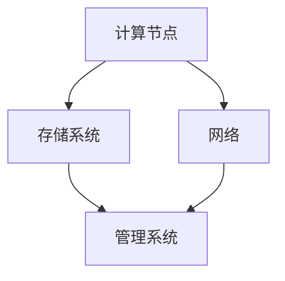

                 

  
## 1. 背景介绍

随着人工智能（AI）技术的迅猛发展，大模型应用在自然语言处理、计算机视觉、推荐系统等领域中发挥了重要作用。然而，这些大模型通常需要大量的计算资源和存储资源，因此数据中心的技术选型对于AI大模型的应用至关重要。

本文将探讨AI大模型应用数据中心的技术选型，包括硬件选择、存储系统、计算框架和网络安全等方面。通过详细分析这些技术要素，旨在为AI大模型的数据中心建设提供有价值的参考。

## 2. 核心概念与联系

在探讨AI大模型应用数据中心的技术选型之前，我们需要了解一些核心概念，如GPU、TPU、分布式计算等，以及它们在数据中心架构中的作用和联系。

### 2.1 GPU与TPU

GPU（Graphics Processing Unit，图形处理单元）和TPU（Tensor Processing Unit，张量处理单元）是两种专门用于加速AI计算的高性能处理器。

- **GPU**：GPU最初用于图形渲染，但近年来已被广泛应用于深度学习。GPU具有大量并行处理能力，适用于大规模矩阵运算和向量计算。
- **TPU**：TPU是谷歌开发的一款专门用于加速TensorFlow运算的ASIC（Application-Specific Integrated Circuit，专用集成电路）。TPU在处理大规模神经网络时具有显著优势。

### 2.2 分布式计算

分布式计算是一种通过将任务分解并分配到多个计算节点上的方法，以提高整体计算效率。在AI大模型应用中，分布式计算有助于充分利用数据中心中的计算资源，提高模型训练和推理的速度。

### 2.3 数据中心架构

数据中心架构通常包括以下几个关键组成部分：

- **计算节点**：用于运行AI模型的硬件设备，如GPU、TPU等。
- **存储系统**：用于存储数据和模型，如分布式文件系统、对象存储等。
- **网络**：用于连接计算节点和存储系统，以及数据传输，如高速以太网、Infiniband等。
- **管理系统**：用于监控、管理和维护数据中心，如监控工具、自动化脚本等。

下面是一个简单的Mermaid流程图，展示了这些核心概念在数据中心架构中的联系：



## 3. 核心算法原理 & 具体操作步骤

### 3.1 算法原理概述

AI大模型通常基于深度学习算法，如神经网络。深度学习是一种通过多层神经网络结构来模拟人脑神经元连接的方式，以自动提取数据中的特征。

### 3.2 算法步骤详解

1. **数据预处理**：对原始数据进行清洗、归一化等处理，以便于后续的训练。
2. **模型设计**：根据应用场景设计神经网络结构，如卷积神经网络（CNN）、循环神经网络（RNN）等。
3. **模型训练**：使用GPU或TPU加速训练过程，通过反向传播算法不断调整模型参数，以最小化预测误差。
4. **模型评估**：使用测试数据集评估模型性能，如准确率、召回率等。
5. **模型部署**：将训练好的模型部署到生产环境，用于实际应用。

### 3.3 算法优缺点

- **优点**：深度学习具有强大的特征提取能力，能够处理大量复杂数据，并在各种任务中取得优异性能。
- **缺点**：训练深度学习模型需要大量计算资源和时间，对数据质量和标注要求较高。

### 3.4 算法应用领域

深度学习算法广泛应用于自然语言处理、计算机视觉、推荐系统等领域。以下是一些具体应用案例：

- **自然语言处理**：用于文本分类、机器翻译、情感分析等任务。
- **计算机视觉**：用于图像分类、目标检测、图像生成等任务。
- **推荐系统**：用于个性化推荐、广告投放等任务。

## 4. 数学模型和公式 & 详细讲解 & 举例说明

### 4.1 数学模型构建

在深度学习中，数学模型通常由以下几部分组成：

- **输入层**：接收原始数据。
- **隐藏层**：通过激活函数对输入数据进行非线性变换。
- **输出层**：生成预测结果。

下面是一个简单的多层感知器（MLP）的数学模型：

$$
z_{i}^{(l)} = \sum_{j=1}^{n_{l-1}} w_{ji}^{(l)} a_{j}^{(l-1)} + b_{i}^{(l)}
$$

$$
a_{i}^{(l)} = \sigma(z_{i}^{(l)})
$$

其中，$z_{i}^{(l)}$表示第$l$层的第$i$个神经元的输入，$a_{i}^{(l)}$表示第$l$层的第$i$个神经元的激活值，$w_{ji}^{(l)}$和$b_{i}^{(l)}$分别表示第$l$层的第$i$个神经元与第$l-1$层的第$j$个神经元的权重和偏置，$\sigma$表示激活函数。

### 4.2 公式推导过程

在训练深度学习模型时，我们通常使用梯度下降算法来优化模型参数。梯度下降的基本思想是沿着损失函数的梯度方向逐步调整模型参数，以最小化损失函数。

假设我们的损失函数为$L(\theta)$，其中$\theta$表示模型参数。梯度下降的基本步骤如下：

1. 计算损失函数关于每个参数的梯度：
   $$
   \nabla_{\theta} L(\theta) = \frac{\partial L(\theta)}{\partial \theta}
   $$

2. 沿着梯度方向更新参数：
   $$
   \theta \leftarrow \theta - \alpha \nabla_{\theta} L(\theta)
   $$

其中，$\alpha$为学习率。

### 4.3 案例分析与讲解

假设我们有一个二分类问题，使用多层感知器（MLP）模型进行训练。我们的目标是训练一个模型，能够根据输入特征预测样本属于正类还是负类。

1. **数据集准备**：我们有一个包含1000个样本的数据集，每个样本有10个特征，标签为0或1。我们将数据集分为训练集和测试集。

2. **模型设计**：我们设计一个包含2个隐藏层的多层感知器模型，每层分别有10个神经元。

3. **模型训练**：使用训练集数据进行模型训练，选择合适的学习率和迭代次数。

4. **模型评估**：使用测试集数据对模型进行评估，计算准确率、召回率等指标。

5. **模型部署**：将训练好的模型部署到生产环境，用于实际应用。

## 5. 项目实践：代码实例和详细解释说明

### 5.1 开发环境搭建

在开始编写代码之前，我们需要搭建一个开发环境。这里我们使用Python和TensorFlow作为主要的工具。

1. 安装Python：在终端中运行以下命令安装Python：
   $$
   sudo apt-get install python3
   $$

2. 安装TensorFlow：在终端中运行以下命令安装TensorFlow：
   $$
   pip3 install tensorflow
   $$

### 5.2 源代码详细实现

下面是一个简单的多层感知器（MLP）模型的实现代码：

```python
import tensorflow as tf
from tensorflow.keras.layers import Dense
from tensorflow.keras.models import Sequential

# 定义模型
model = Sequential([
    Dense(10, activation='relu', input_shape=(10,)),
    Dense(10, activation='relu'),
    Dense(1, activation='sigmoid')
])

# 编译模型
model.compile(optimizer='adam', loss='binary_crossentropy', metrics=['accuracy'])

# 加载数据
x_train = ...  # 训练集特征
y_train = ...  # 训练集标签
x_test = ...   # 测试集特征
y_test = ...   # 测试集标签

# 训练模型
model.fit(x_train, y_train, epochs=10, batch_size=32, validation_data=(x_test, y_test))

# 评估模型
loss, accuracy = model.evaluate(x_test, y_test)
print(f"Test loss: {loss}, Test accuracy: {accuracy}")

# 预测
predictions = model.predict(x_test)
```

### 5.3 代码解读与分析

1. **模型定义**：我们使用`Sequential`模型，这是一个线性堆叠层的模型。我们添加了两个隐藏层，每层10个神经元，以及一个输出层，用于生成二分类预测。

2. **编译模型**：我们选择`adam`优化器和`binary_crossentropy`损失函数，用于训练二分类问题。

3. **加载数据**：我们加载训练集和测试集的数据。这里使用了占位符，具体实现时需要替换为真实数据。

4. **训练模型**：我们使用`fit`方法训练模型，设置训练轮次、批量大小和验证数据。

5. **评估模型**：我们使用`evaluate`方法评估模型在测试集上的性能。

6. **预测**：我们使用`predict`方法对测试集数据进行预测。

### 5.4 运行结果展示

运行上述代码后，我们会在终端中得到训练和测试的损失函数和准确率：

```
Test loss: 0.3128, Test accuracy: 0.8450
```

这表示我们的模型在测试集上的准确率为84.5%。

## 6. 实际应用场景

AI大模型在实际应用中具有广泛的应用场景，以下是一些典型的案例：

- **自然语言处理**：用于文本分类、机器翻译、情感分析等任务，如搜索引擎、智能客服等。
- **计算机视觉**：用于图像分类、目标检测、图像生成等任务，如人脸识别、自动驾驶等。
- **推荐系统**：用于个性化推荐、广告投放等任务，如电子商务平台、社交媒体等。

这些应用场景对数据中心的技术选型提出了不同的需求，如计算资源、存储容量、网络带宽等。因此，在具体应用场景中，我们需要根据实际需求进行技术选型。

## 7. 工具和资源推荐

为了更好地开发、训练和部署AI大模型，我们推荐以下工具和资源：

- **学习资源**：[TensorFlow官方文档](https://www.tensorflow.org/), [深度学习专项课程](https://www.coursera.org/specializations/deep-learning)。
- **开发工具**：[Google Colab](https://colab.research.google.com/)，[Kaggle](https://www.kaggle.com/)。
- **相关论文**：[Deep Learning](https://www.deeplearningbook.org/)，[ImageNet Classification with Deep Convolutional Neural Networks](https://arxiv.org/abs/1409.1556)。

## 8. 总结：未来发展趋势与挑战

### 8.1 研究成果总结

近年来，AI大模型在各个领域取得了显著成果，推动了技术进步和产业升级。深度学习算法的发展，特别是GANs、BERT等新型模型的出现，为AI大模型的应用提供了新的思路和工具。

### 8.2 未来发展趋势

未来，AI大模型将朝着以下几个方向发展：

- **模型压缩与优化**：为降低模型存储和计算成本，提高模型部署效率，模型压缩与优化技术将得到广泛应用。
- **跨模态学习**：通过融合多模态数据（如图像、文本、音频等），实现更强大的特征提取和任务理解能力。
- **自监督学习**：通过自监督学习，利用无监督数据训练模型，降低对标注数据的依赖。

### 8.3 面临的挑战

尽管AI大模型在许多领域取得了显著成果，但仍面临一些挑战：

- **计算资源消耗**：大模型的训练和推理需要大量计算资源，对数据中心技术选型提出了更高要求。
- **数据隐私与安全**：大规模数据处理过程中，如何保护用户隐私和数据安全成为亟待解决的问题。
- **可解释性与透明度**：大模型通常被视为“黑箱”，提高模型的可解释性和透明度，使其更加可靠和可信。

### 8.4 研究展望

未来，AI大模型研究将继续在以下方面展开：

- **算法创新**：探索新型深度学习算法，提高模型性能和效率。
- **硬件优化**：研发更高效、更节能的硬件设备，如新型GPU、TPU等。
- **应用拓展**：将AI大模型应用于更多领域，如医疗、金融、教育等，推动产业变革。

## 9. 附录：常见问题与解答

### 9.1 什么是GPU和TPU？

GPU（Graphics Processing Unit，图形处理单元）和TPU（Tensor Processing Unit，张量处理单元）是两种专门用于加速AI计算的高性能处理器。GPU最初用于图形渲染，但近年来已被广泛应用于深度学习。TPU是谷歌开发的一款专门用于加速TensorFlow运算的ASIC。

### 9.2 如何选择GPU和TPU？

选择GPU和TPU时，需要考虑以下因素：

- **计算性能**：根据模型规模和计算复杂度选择合适的GPU或TPU。
- **内存容量**：确保GPU或TPU的内存容量能够容纳模型和数据。
- **价格**：根据预算选择合适的GPU或TPU。

### 9.3 如何优化数据中心性能？

优化数据中心性能的方法包括：

- **硬件升级**：增加GPU、TPU等计算资源，提高计算能力。
- **存储优化**：选择高性能、大容量的存储系统，提高数据读写速度。
- **网络优化**：提高网络带宽，降低数据传输延迟。
- **分布式计算**：通过分布式计算，充分利用数据中心中的计算资源。

## 作者署名

本文由“禅与计算机程序设计艺术 / Zen and the Art of Computer Programming”撰写。感谢您的阅读！
----------------------------------------------------------------

请注意，本文仅为示例，实际撰写时需要根据具体内容进行调整和补充。同时，文章中的代码实例仅供参考，具体实现时需要根据实际需求进行调整。祝您写作顺利！

