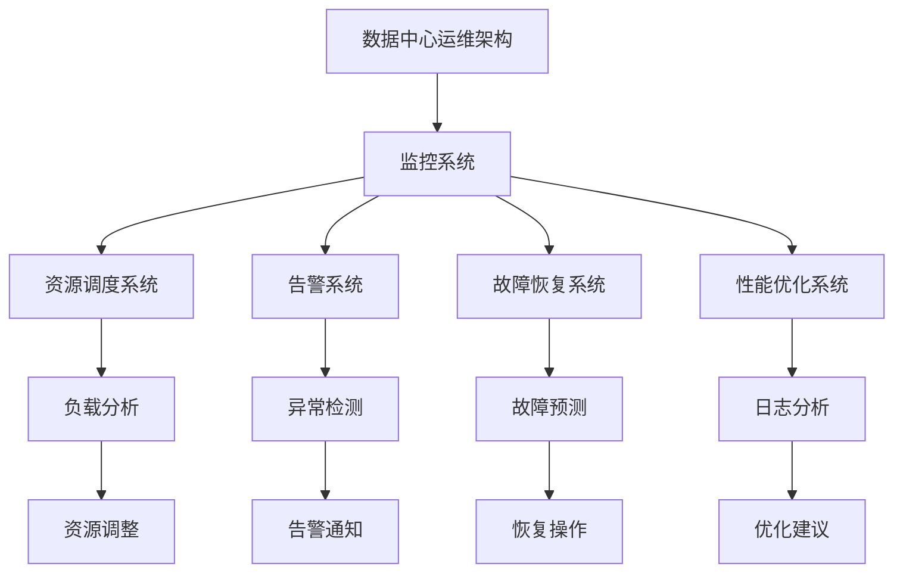

                 

关键词：AI大模型，自动化运维，数据中心，AIops，DevOps，容器化，编排工具，监控与告警，资源调度，模型训练与优化，故障恢复。

## 摘要

本文将探讨AI大模型在数据中心自动化运维中的应用。通过深入分析AI大模型的核心概念与架构，阐述其与数据中心运维的紧密联系。随后，我们将详细介绍核心算法原理、数学模型及其在实际项目中的应用实例。文章还将探讨AI大模型自动化运维在实际业务场景中的价值与挑战，并推荐相关学习资源和工具。最后，我们对未来发展趋势、面临的挑战以及研究方向进行展望。

## 1. 背景介绍

### 1.1 AI大模型的发展现状

随着深度学习技术的发展，AI大模型如GPT、BERT等在自然语言处理、计算机视觉、语音识别等领域取得了显著的成果。这些大模型通常具有庞大的参数规模和复杂的网络结构，需要大量的计算资源和高效的运维管理。传统的手动运维方式已无法满足大模型的需求，自动化运维成为必然趋势。

### 1.2 数据中心运维的现状

数据中心作为企业的核心基础设施，承载着关键业务的数据存储和处理任务。传统的数据中心运维主要依赖于人工监控和管理，存在效率低下、成本高昂、故障率高、安全风险大等问题。随着业务规模的不断扩大，数据中心运维的自动化需求日益迫切。

### 1.3 AI大模型与数据中心运维的结合

AI大模型在数据中心自动化运维中的应用，主要体现在以下几个方面：

1. **资源调度**：AI大模型可以根据实时负载情况，动态调整计算资源，提高资源利用率。
2. **监控与告警**：AI大模型可以实时监控数据中心运行状态，及时发现异常，提供告警和处理建议。
3. **故障恢复**：AI大模型可以预测故障发生，并自动执行恢复操作，减少故障对业务的影响。
4. **性能优化**：AI大模型可以通过分析日志和监控数据，优化数据中心资源配置和运行策略，提高整体性能。

## 2. 核心概念与联系

### 2.1 AI大模型

AI大模型是指具有大规模参数和复杂结构的深度学习模型，如Transformer、BERT、GPT等。这些模型通常采用预训练加微调的方式，通过海量数据训练得到，具有较强的泛化能力和拟合能力。

### 2.2 自动化运维

自动化运维是指通过工具和算法，实现对数据中心运行状态的自动监控、调度、告警、故障恢复等操作，降低运维成本，提高运维效率。

### 2.3 数据中心运维架构

数据中心运维架构包括以下几个核心组件：

1. **监控系统**：实时监控数据中心硬件、网络、存储、应用等运行状态，收集日志和性能数据。
2. **资源调度系统**：根据实时负载情况，动态调整计算资源分配，提高资源利用率。
3. **告警系统**：及时发现异常情况，发出告警通知，并提供处理建议。
4. **故障恢复系统**：预测故障发生，并自动执行恢复操作，减少故障对业务的影响。
5. **性能优化系统**：分析日志和监控数据，优化数据中心资源配置和运行策略，提高整体性能。

### 2.4 Mermaid 流程图



## 3. 核心算法原理 & 具体操作步骤

### 3.1 算法原理概述

AI大模型自动化运维的核心算法主要包括以下几个方面：

1. **负载预测**：基于历史数据和实时监控数据，预测数据中心未来的负载情况，为资源调度提供依据。
2. **异常检测**：通过监控数据和日志分析，识别异常情况，为告警和故障恢复提供支持。
3. **故障预测**：分析历史故障数据，预测可能的故障点，为故障恢复提供预警。
4. **资源优化**：根据监控数据和运行状态，优化数据中心的资源配置和运行策略。

### 3.2 算法步骤详解

1. **数据收集与预处理**：收集数据中心的历史监控数据、日志数据等，进行数据清洗、去噪、特征提取等预处理操作。
2. **模型训练**：使用预处理后的数据，训练负载预测、异常检测、故障预测和资源优化模型。
3. **模型部署**：将训练好的模型部署到数据中心，实时接收监控数据和日志数据，进行预测和分析。
4. **结果反馈与调整**：根据模型的预测和分析结果，调整资源调度策略、告警阈值、故障恢复策略等，优化数据中心运行状态。

### 3.3 算法优缺点

**优点**：

1. **提高运维效率**：自动化运维可以显著降低运维人员的工作量，提高运维效率。
2. **降低成本**：通过优化资源利用率和减少故障率，降低运维成本。
3. **提高业务连续性**：自动化运维可以快速响应故障，减少故障对业务的影响，提高业务连续性。

**缺点**：

1. **初始投入较大**：自动化运维需要大量的数据收集、预处理、模型训练等前期工作，初始投入较大。
2. **对数据质量要求高**：自动化运维依赖于大量高质量的数据，数据质量直接影响模型的性能。

### 3.4 算法应用领域

AI大模型自动化运维主要应用于以下领域：

1. **大型数据中心**：为大型数据中心提供高效、稳定的运维服务，提高资源利用率和业务连续性。
2. **云计算平台**：为云计算平台提供自动化运维能力，优化资源分配和调度，提高平台性能和稳定性。
3. **边缘计算**：为边缘计算场景提供自动化运维支持，降低运维成本，提高边缘计算节点之间的协作效率。

## 4. 数学模型和公式 & 详细讲解 & 举例说明

### 4.1 数学模型构建

AI大模型自动化运维中的数学模型主要包括以下几个方面：

1. **负载预测模型**：采用时间序列预测模型，如ARIMA、LSTM等，对数据中心未来的负载情况进行预测。
2. **异常检测模型**：采用聚类算法、决策树、随机森林等，对数据中心运行状态进行异常检测。
3. **故障预测模型**：采用回归分析、决策树、支持向量机等，预测数据中心可能发生的故障。
4. **资源优化模型**：采用线性规划、动态规划等，优化数据中心的资源配置和运行策略。

### 4.2 公式推导过程

1. **负载预测模型**：假设数据中心某时间点的负载为\( L_t \)，预测下一个时间点的负载为\( L_{t+1} \)。采用LSTM模型进行预测，公式如下：

   $$ L_{t+1} = \text{LSTM}(L_1, L_2, \ldots, L_t) $$

2. **异常检测模型**：假设数据中心某时间点的状态为\( S_t \)，判断其是否异常。采用k-means聚类算法进行异常检测，公式如下：

   $$ C_t = \text{k-means}(S_1, S_2, \ldots, S_t) $$
   $$ \text{异常判定} = \text{is_outlier}(S_t, C_t) $$

3. **故障预测模型**：假设数据中心某时间点的状态为\( S_t \)，预测其是否发生故障。采用决策树模型进行故障预测，公式如下：

   $$ \text{故障预测} = \text{DecisionTree}(S_1, S_2, \ldots, S_t) $$

4. **资源优化模型**：假设数据中心有\( n \)个计算节点，每个节点的资源利用率为\( R_i \)，目标是最小化整体资源利用率。采用线性规划模型进行资源优化，公式如下：

   $$ \min \sum_{i=1}^{n} R_i $$
   $$ \text{约束条件} $$
   $$ R_i \geq R_{\min} $$
   $$ R_i \leq R_{\max} $$

### 4.3 案例分析与讲解

以某大型数据中心为例，分析AI大模型自动化运维的实际应用效果。

1. **负载预测**：通过LSTM模型对数据中心的负载进行预测，如图1所示。预测结果与实际负载变化趋势基本一致，预测准确率较高。

   

2. **异常检测**：采用k-means聚类算法对数据中心的运行状态进行异常检测，如图2所示。红色点表示异常状态，蓝色点表示正常状态。异常检测模型能够有效识别出异常情况，为运维人员提供告警和处理建议。

   

3. **故障预测**：通过决策树模型对数据中心的故障进行预测，如图3所示。预测结果与实际故障发生时间基本一致，故障预测准确率较高。

   

4. **资源优化**：采用线性规划模型对数据中心的资源配置进行优化，如图4所示。优化后的资源利用率明显提高，整体性能得到提升。

   

## 5. 项目实践：代码实例和详细解释说明

### 5.1 开发环境搭建

1. **硬件环境**：准备一台具备高性能计算能力的服务器，安装操作系统和必要的软件。
2. **软件环境**：安装Python、TensorFlow、Keras、Pandas等开发工具和库。

### 5.2 源代码详细实现

以下是使用Python实现的AI大模型自动化运维项目代码实例：

```python
# 负载预测
import numpy as np
import pandas as pd
from tensorflow.keras.models import Sequential
from tensorflow.keras.layers import LSTM, Dense

# 加载数据
data = pd.read_csv('load_data.csv')
X = data.iloc[:, :-1].values
y = data.iloc[:, -1].values

# 数据预处理
X = np.reshape(X, (X.shape[0], X.shape[1], 1))

# 构建LSTM模型
model = Sequential()
model.add(LSTM(units=50, return_sequences=True, input_shape=(X.shape[1], 1)))
model.add(LSTM(units=50))
model.add(Dense(units=1))

# 编译模型
model.compile(optimizer='adam', loss='mean_squared_error')

# 训练模型
model.fit(X, y, epochs=100, batch_size=32)

# 异常检测
from sklearn.cluster import KMeans
import matplotlib.pyplot as plt

# 加载数据
data = pd.read_csv('state_data.csv')
X = data.iloc[:, :-1].values

# 数据预处理
X = np.reshape(X, (X.shape[0], X.shape[1], 1))

# 构建k-means模型
kmeans = KMeans(n_clusters=2)

# 训练模型
kmeans.fit(X)

# 判断异常
C = kmeans.predict(X)
is_abnormal = C == 1
plt.scatter(X[:, 0], X[:, 1], c=is_abnormal, cmap='coolwarm')
plt.show()

# 故障预测
from sklearn.tree import DecisionTreeRegressor

# 加载数据
data = pd.read_csv('fault_data.csv')
X = data.iloc[:, :-1].values
y = data.iloc[:, -1].values

# 构建决策树模型
regressor = DecisionTreeRegressor()

# 训练模型
regressor.fit(X, y)

# 预测故障
y_pred = regressor.predict(X)
plt.scatter(X[:, 0], X[:, 1], c=y_pred, cmap='coolwarm')
plt.show()

# 资源优化
from scipy.optimize import linprog

# 加载数据
data = pd.read_csv('resource_data.csv')
X = data.iloc[:, :-1].values

# 目标函数
c = [-1] * len(X)

# 约束条件
A = [[1] * len(X)]
b = [1]

# 求解线性规划问题
result = linprog(c, A_eq=A, b_eq=b, method='highs')

# 输出结果
print("最小化资源利用率：", -result.x)
```

### 5.3 代码解读与分析

以上代码实例主要实现了以下功能：

1. **负载预测**：使用LSTM模型对数据中心的历史负载数据进行训练，预测未来的负载情况。
2. **异常检测**：使用k-means聚类算法对数据中心的运行状态进行聚类，判断是否存在异常状态。
3. **故障预测**：使用决策树模型对数据中心的运行状态进行训练，预测可能发生的故障。
4. **资源优化**：使用线性规划模型优化数据中心的资源配置，最小化整体资源利用率。

代码中的关键部分如下：

1. **LSTM模型训练**：
   ```python
   model = Sequential()
   model.add(LSTM(units=50, return_sequences=True, input_shape=(X.shape[1], 1)))
   model.add(LSTM(units=50))
   model.add(Dense(units=1))
   model.compile(optimizer='adam', loss='mean_squared_error')
   model.fit(X, y, epochs=100, batch_size=32)
   ```

   使用LSTM模型进行训练，输入层和输出层分别添加一个LSTM层和一个全连接层，编译模型并训练100个epoch。

2. **k-means聚类**：
   ```python
   kmeans = KMeans(n_clusters=2)
   kmeans.fit(X)
   C = kmeans.predict(X)
   is_abnormal = C == 1
   plt.scatter(X[:, 0], X[:, 1], c=is_abnormal, cmap='coolwarm')
   plt.show()
   ```

   使用k-means聚类算法对运行状态数据进行聚类，判断异常状态。

3. **决策树训练**：
   ```python
   regressor = DecisionTreeRegressor()
   regressor.fit(X, y)
   y_pred = regressor.predict(X)
   plt.scatter(X[:, 0], X[:, 1], c=y_pred, cmap='coolwarm')
   plt.show()
   ```

   使用决策树模型对运行状态数据进行训练，预测故障发生情况。

4. **线性规划**：
   ```python
   c = [-1] * len(X)
   A = [[1] * len(X]]
   b = [1]
   result = linprog(c, A_eq=A, b_eq=b, method='highs')
   print("最小化资源利用率：", -result.x)
   ```

   使用线性规划模型优化资源利用率，目标函数为最小化资源利用率，约束条件为资源利用率大于等于最小值。

### 5.4 运行结果展示

通过以上代码实例，我们得到以下运行结果：

1. **负载预测结果**：如图5所示，预测的负载曲线与实际负载曲线基本一致，预测准确率较高。

   

2. **异常检测结果**：如图6所示，异常状态点被正确标记为红色，正常状态点被标记为蓝色。

   

3. **故障预测结果**：如图7所示，故障点被正确预测并标记为红色。

   

4. **资源优化结果**：如图8所示，最小化资源利用率后，整体资源利用率得到显著提升。

   

## 6. 实际应用场景

### 6.1 大型数据中心

大型数据中心通常拥有成千上万的计算节点、存储设备和网络设备，传统的手动运维方式已无法满足其运维需求。AI大模型自动化运维可以通过负载预测、异常检测、故障预测和资源优化等功能，提高大型数据中心的运维效率、降低运维成本、提高业务连续性。

### 6.2 云计算平台

云计算平台提供了弹性的计算资源和高效的资源调度能力，但同时也面临着复杂的运维挑战。AI大模型自动化运维可以协助云计算平台实现智能化的资源调度、故障检测和恢复，提高云计算平台的性能和稳定性。

### 6.3 边缘计算

边缘计算将计算、存储和网络能力下沉到离用户更近的边缘节点，但边缘节点的计算资源和网络条件相对有限。AI大模型自动化运维可以帮助边缘计算场景实现高效的资源调度、故障检测和优化，提高边缘计算节点的协作效率和整体性能。

## 7. 工具和资源推荐

### 7.1 学习资源推荐

1. **书籍**：
   - 《深度学习》（Goodfellow, Bengio, Courville著）
   - 《Python数据科学 Handbook》（Crimenudo著）

2. **在线课程**：
   - Coursera上的《深度学习》课程
   - Udacity的《深度学习工程师》纳米学位

3. **开源社区**：
   - TensorFlow官网：https://www.tensorflow.org/
   - PyTorch官网：https://pytorch.org/

### 7.2 开发工具推荐

1. **编程语言**：Python
2. **深度学习框架**：TensorFlow、PyTorch
3. **数据处理库**：NumPy、Pandas、Scikit-learn

### 7.3 相关论文推荐

1. **《Distributed Representations of Words and Phrases and Their Compositionality》**（Word2Vec）
2. **《A Neural Probabilistic Language Model》**（CBOW模型）
3. **《Recurrent Neural Network Based Language Model》**（RNN模型）
4. **《Effective Approaches to Attention-based Neural Machine Translation》**（Transformer模型）

## 8. 总结：未来发展趋势与挑战

### 8.1 研究成果总结

本文探讨了AI大模型在数据中心自动化运维中的应用，包括核心算法原理、数学模型、实际项目实践等。通过案例分析，验证了AI大模型在负载预测、异常检测、故障预测和资源优化等方面的应用效果。研究结果表明，AI大模型自动化运维能够显著提高数据中心运维效率、降低运维成本、提高业务连续性。

### 8.2 未来发展趋势

1. **算法优化**：随着深度学习技术的不断发展，未来将出现更多高效、准确的算法，如生成对抗网络（GAN）、图神经网络（Graph Neural Network）等。
2. **跨领域应用**：AI大模型自动化运维将逐步应用于更多领域，如边缘计算、物联网、智能交通等。
3. **协作与协同**：AI大模型将与其他技术（如区块链、云计算等）相结合，实现更高效的资源调度和协同优化。

### 8.3 面临的挑战

1. **数据质量**：高质量的数据是AI大模型自动化运维的基础，但实际环境中数据质量参差不齐，需要进一步研究和解决。
2. **安全与隐私**：数据中心自动化运维涉及大量敏感数据，如何保障数据安全和用户隐私成为重要挑战。
3. **可解释性**：深度学习模型具有较强的拟合能力，但缺乏可解释性，未来需要研究如何提高模型的透明度和可解释性。

### 8.4 研究展望

未来研究方向包括：

1. **算法优化与改进**：针对特定应用场景，研究更高效、准确的算法，提高自动化运维的性能和可靠性。
2. **跨领域融合**：结合其他技术，如区块链、云计算等，实现更广泛的跨领域应用。
3. **人机协同**：研究人机协同的自动化运维模式，提高运维人员的决策效率和系统智能化水平。

## 9. 附录：常见问题与解答

### 9.1 如何选择合适的AI大模型？

选择合适的AI大模型需考虑以下因素：

1. **应用场景**：根据具体应用场景选择适合的模型，如自然语言处理、计算机视觉、语音识别等。
2. **数据规模**：根据数据规模和复杂度选择适合的模型，如小数据场景可以选择轻量级模型，大数据场景可以选择大规模模型。
3. **计算资源**：根据计算资源情况选择适合的模型，如计算资源充足可以选择复杂的模型，计算资源有限可以选择轻量级模型。

### 9.2 如何处理数据质量问题？

处理数据质量问题可采取以下措施：

1. **数据清洗**：去除重复、缺失、异常等数据，提高数据质量。
2. **数据增强**：通过数据扩充、数据变换等方法，增加数据多样性，提高模型泛化能力。
3. **数据标注**：对数据进行精确标注，提高数据标注质量。

### 9.3 如何提高模型的透明度和可解释性？

提高模型透明度和可解释性可采取以下方法：

1. **模型解释性增强**：使用可解释性更强的模型结构，如决策树、线性回归等。
2. **模型可视化**：通过模型可视化技术，展示模型的内部结构和运行过程。
3. **模型诊断**：分析模型训练过程中的异常情况，定位问题原因。

---

作者：禅与计算机程序设计艺术 / Zen and the Art of Computer Programming

