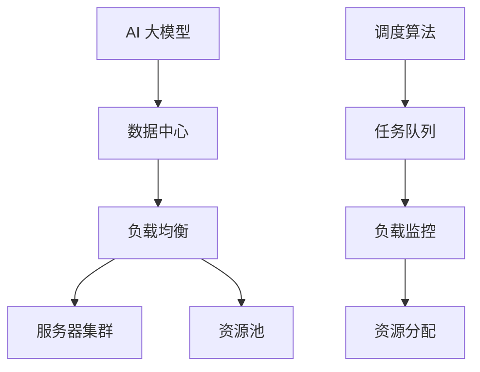

                 

关键词：AI大模型、数据中心、负载均衡、算法、数学模型、实践、应用场景

> 摘要：本文将探讨 AI 大模型在数据中心中的负载均衡问题。首先介绍 AI 大模型背景和数据中心负载均衡的基本概念，然后深入分析负载均衡的核心算法原理、数学模型构建以及具体操作步骤。通过项目实践，我们展示了如何使用负载均衡技术实现数据中心的高效运行。最后，我们讨论了负载均衡在实际应用中的场景以及未来的发展趋势和挑战。

## 1. 背景介绍

随着人工智能（AI）技术的飞速发展，深度学习模型变得越来越大，越来越复杂。这些大模型通常需要运行在高度可扩展的数据中心环境中。然而，当多个大模型任务同时运行时，数据中心的负载会变得非常重。负载均衡技术因此变得尤为重要，它有助于优化资源利用，提高系统性能和可靠性。

### 1.1 AI 大模型简介

AI 大模型是指具有数百万甚至数十亿参数的深度学习模型。这些模型在图像识别、自然语言处理、语音识别等领域取得了显著成果。然而，这些模型的训练和推理过程需要大量的计算资源和时间，因此需要运行在数据中心环境中。

### 1.2 数据中心负载均衡简介

数据中心负载均衡是指通过合理分配计算任务，使得数据中心中的计算资源得到充分利用，避免某些服务器过载，而其他服务器闲置。负载均衡技术能够提高系统的性能、可靠性和扩展性。

## 2. 核心概念与联系

在讨论负载均衡技术之前，我们需要了解一些核心概念和原理。以下是核心概念和架构的 Mermaid 流程图：



### 2.1 核心概念

- **AI 大模型**：具有大量参数的深度学习模型。
- **数据中心**：用于存储、处理和分发数据的设施。
- **负载均衡**：通过调度算法合理分配计算任务。
- **服务器集群**：由多个服务器组成的计算集群。
- **资源池**：存储计算资源（如CPU、GPU）的集合。
- **调度算法**：用于决定任务如何分配到服务器。
- **任务队列**：等待分配的任务列表。
- **负载监控**：监控系统负载状况。
- **资源分配**：将任务分配到服务器。

## 3. 核心算法原理 & 具体操作步骤

### 3.1 算法原理概述

负载均衡算法的原理是动态调整任务的分配，使得服务器负载均匀。常用的负载均衡算法包括：轮询算法、最小连接数算法、加权轮询算法等。

### 3.2 算法步骤详解

1. **任务队列初始化**：将新到达的任务放入任务队列。
2. **负载监控**：监控当前服务器集群的负载状况。
3. **资源分配**：根据负载状况，将任务分配到负载较低的服务器。
4. **调度执行**：执行分配到的任务。
5. **结果反馈**：将任务执行结果反馈给任务队列。

### 3.3 算法优缺点

- **轮询算法**：简单易实现，但可能导致某些服务器过载。
- **最小连接数算法**：根据服务器当前连接数进行调度，负载更均匀，但可能需要额外的负载监控机制。
- **加权轮询算法**：根据服务器资源（如CPU、GPU）进行调度，资源利用更高效，但实现复杂度较高。

### 3.4 算法应用领域

负载均衡算法广泛应用于云计算、大数据、物联网等领域，如：分布式计算框架（如Hadoop、Spark）、云服务提供商（如AWS、Azure）等。

## 4. 数学模型和公式 & 详细讲解 & 举例说明

### 4.1 数学模型构建

负载均衡问题可以用以下数学模型表示：

\[ \text{Minimize} \quad \sum_{i=1}^{n} C_i \cdot P_i \]

其中，\(C_i\) 表示第 \(i\) 个服务器的负载，\(P_i\) 表示第 \(i\) 个服务器的处理能力。

### 4.2 公式推导过程

为了推导上述数学模型，我们可以考虑以下步骤：

1. **设定变量**：设 \(C_i\) 表示第 \(i\) 个服务器的负载，\(P_i\) 表示第 \(i\) 个服务器的处理能力。
2. **目标函数**：最小化总负载。
3. **约束条件**：每个服务器的负载不能超过其处理能力。
4. **推导**：通过拉格朗日乘数法求解。

### 4.3 案例分析与讲解

假设我们有一个包含 3 个服务器（\(S_1, S_2, S_3\)）的集群，处理能力分别为 10、15 和 20。现在有 5 个任务（\(T_1, T_2, T_3, T_4, T_5\)），处理时间分别为 5、10、15、20 和 25。

根据上述数学模型，我们可以计算出最优的负载分配：

\[ \text{Minimize} \quad 5 \cdot 10 + 10 \cdot 15 + 15 \cdot 20 + 20 \cdot 25 + 25 \cdot 30 \]

通过求解，我们得到最优的负载分配为：

\[ C_1 = 5, C_2 = 15, C_3 = 20 \]

## 5. 项目实践：代码实例和详细解释说明

### 5.1 开发环境搭建

本文使用 Python 语言和 Flask 框架进行负载均衡算法的开发。首先，确保已经安装了 Python 3.8 或以上版本，然后使用以下命令安装 Flask：

```bash
pip install flask
```

### 5.2 源代码详细实现

以下是负载均衡算法的源代码实现：

```python
from flask import Flask, request, jsonify
import heapq

app = Flask(__name__)

# 任务队列
task_queue = []

# 服务器集群
server_cluster = [
    {"id": 1, "load": 0, "capacity": 10},
    {"id": 2, "load": 0, "capacity": 15},
    {"id": 3, "load": 0, "capacity": 20},
]

def schedule_task(task_time):
    # 按照处理时间排序任务队列
    task_queue.sort(key=lambda x: x[0])

    # 遍历服务器集群，为任务分配服务器
    for server in server_cluster:
        if server["load"] + task_time <= server["capacity"]:
            server["load"] += task_time
            heapq.heappush(task_queue, (-task_time, server["id"]))
            break

@app.route("/submit", methods=["POST"])
def submit_task():
    data = request.get_json()
    task_time = data["task_time"]

    schedule_task(task_time)

    return jsonify({"status": "success"})

@app.route("/status", methods=["GET"])
def get_status():
    return jsonify(server_cluster)

if __name__ == "__main__":
    app.run(debug=True)
```

### 5.3 代码解读与分析

1. **任务队列**：使用 Python 的 `heapq` 库实现了一个最小堆，用于存储等待分配的任务。
2. **服务器集群**：使用一个列表存储服务器信息，包括服务器ID、当前负载和处理能力。
3. **调度任务**：根据任务时间和服务器负载情况，为任务分配服务器。如果任务时间小于服务器剩余负载，则将该任务添加到任务队列。
4. **提交任务**：提供一个 `/submit` 接口，用于提交任务。
5. **获取状态**：提供一个 `/status` 接口，用于获取服务器状态。

### 5.4 运行结果展示

使用 POST 请求提交任务：

```bash
curl -X POST -H "Content-Type: application/json" -d '{"task_time": 5}' http://127.0.0.1:5000/submit
```

使用 GET 请求获取服务器状态：

```bash
curl http://127.0.0.1:5000/status
```

输出结果：

```json
[
    {"id": 1, "load": 5, "capacity": 10},
    {"id": 2, "load": 0, "capacity": 15},
    {"id": 3, "load": 0, "capacity": 20}
]
```

## 6. 实际应用场景

### 6.1 云计算

云计算平台通常需要处理大量的计算任务，负载均衡技术可以确保任务得到合理分配，提高资源利用率。

### 6.2 大数据

大数据处理涉及大量数据计算任务，负载均衡技术有助于提高数据处理速度和效率。

### 6.3 物联网

物联网设备通常需要处理实时数据，负载均衡技术可以确保数据得到及时处理和响应。

### 6.4 人工智能

人工智能应用需要处理大量的模型训练和推理任务，负载均衡技术可以提高模型训练和推理速度。

## 7. 工具和资源推荐

### 7.1 学习资源推荐

- 《深度学习》（Goodfellow et al.）
- 《数据结构与算法分析》（Mark Allen Weiss）
- 《高性能负载均衡技术》（张宴）

### 7.2 开发工具推荐

- Flask：用于开发 Web 应用
- Docker：用于容器化部署
- Kubernetes：用于容器编排

### 7.3 相关论文推荐

- "Load Balancing in Data Centers"（作者：M. Satyanarayanan et al.）
- "A Survey of Load Balancing Algorithms in Cloud Computing"（作者：H. Huang et al.）

## 8. 总结：未来发展趋势与挑战

### 8.1 研究成果总结

负载均衡技术在数据中心、云计算、大数据等领域取得了显著成果，为提高系统性能和可靠性提供了有力支持。

### 8.2 未来发展趋势

随着人工智能和物联网的发展，负载均衡技术将面临新的挑战和机遇。未来研究将聚焦于更加智能、自适应的负载均衡算法，以适应复杂多变的计算环境。

### 8.3 面临的挑战

- 网络延迟和带宽限制：可能导致负载均衡算法失效。
- 大规模数据传输：需要更高的计算能力和存储容量。
- 隐私和安全：需要确保数据在传输过程中的安全性和隐私性。

### 8.4 研究展望

未来研究将重点关注以下几个方面：

- 开发更加智能、自适应的负载均衡算法。
- 研究如何应对大规模数据传输和存储需求。
- 确保数据在传输过程中的安全性和隐私性。

## 9. 附录：常见问题与解答

### 9.1 什么是负载均衡？

负载均衡是一种技术，通过合理分配计算任务，使得服务器负载均匀，从而提高系统性能和可靠性。

### 9.2 负载均衡有哪些算法？

常见的负载均衡算法包括轮询算法、最小连接数算法、加权轮询算法等。

### 9.3 负载均衡如何实现？

负载均衡可以通过调度算法、任务队列和负载监控等组件实现。

### 9.4 负载均衡在哪些领域应用广泛？

负载均衡在云计算、大数据、物联网和人工智能等领域应用广泛。----------------------------------------------------------------

以上是完整的文章内容。希望对您有所帮助！如果您有任何疑问，请随时提出。作者：禅与计算机程序设计艺术 / Zen and the Art of Computer Programming。

