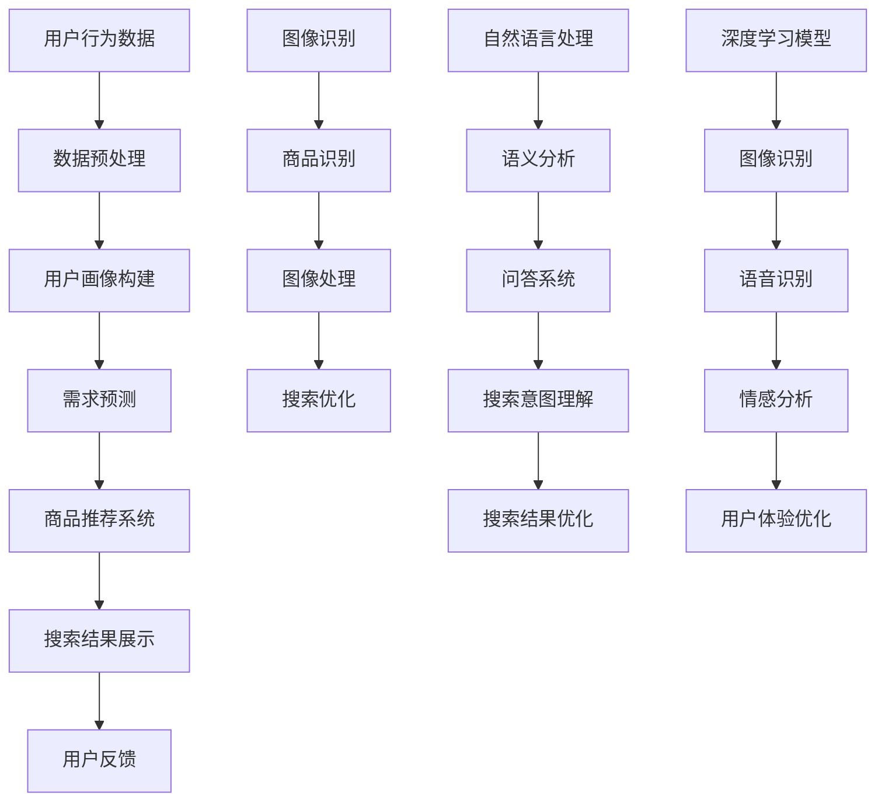
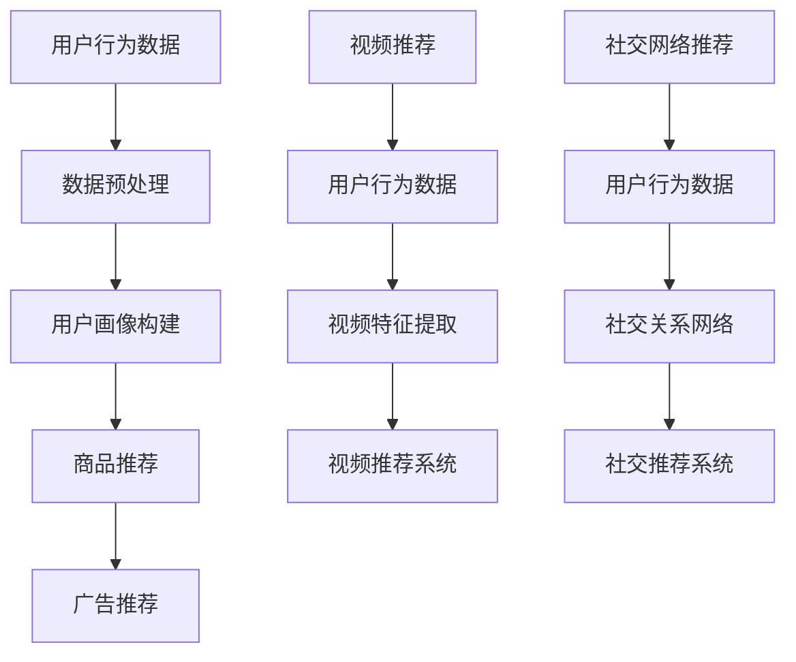

                 

关键词：AI技术、电商搜索导购、趋势展望、算法、应用场景、挑战与展望

> 摘要：随着人工智能技术的发展，电商搜索导购系统正逐渐成为电商领域的一大亮点。本文将探讨AI技术在电商搜索导购中的未来发展趋势，从核心概念、算法原理、数学模型、项目实践、应用场景、工具推荐、以及未来发展趋势和挑战等多个维度，进行深入分析和思考。

## 1. 背景介绍

近年来，随着互联网和电子商务的快速发展，电商平台的竞争愈发激烈。为了吸引消费者，提高转化率，电商平台开始重视用户体验，尤其是搜索导购系统。传统的搜索导购系统主要依赖于关键词匹配和推荐算法，但难以满足用户日益多样化的需求。随着AI技术的崛起，越来越多的电商企业开始将AI技术应用于搜索导购系统中，以期提升用户体验，提高销售额。

AI技术主要包括机器学习、深度学习、自然语言处理、计算机视觉等，这些技术在电商搜索导购中的应用越来越广泛。例如，机器学习可以用于商品推荐、用户画像、需求预测等方面；深度学习可以用于图像识别、语音识别等方面；自然语言处理可以用于语义分析、问答系统等方面；计算机视觉可以用于商品识别、图像处理等方面。

## 2. 核心概念与联系

在探讨AI技术在电商搜索导购中的应用之前，我们首先需要了解一些核心概念和原理，包括机器学习、深度学习、自然语言处理和计算机视觉。

### 2.1 机器学习

机器学习是一种通过算法从数据中学习规律并做出预测的方法。在电商搜索导购中，机器学习可以用于用户画像、需求预测、商品推荐等方面。例如，通过分析用户的购买历史、浏览行为、搜索关键词等数据，可以预测用户的购买意愿，从而为用户提供个性化的商品推荐。

### 2.2 深度学习

深度学习是机器学习的一种方法，通过构建多层神经网络，对大量数据进行训练，从而实现对复杂模式的识别和理解。在电商搜索导购中，深度学习可以用于图像识别、语音识别、情感分析等方面。例如，通过深度学习模型，可以对用户上传的图片进行商品识别，从而提高搜索导购的准确性。

### 2.3 自然语言处理

自然语言处理是研究如何让计算机理解和处理自然语言的一门学科。在电商搜索导购中，自然语言处理可以用于语义分析、问答系统等方面。例如，通过自然语言处理技术，可以理解用户的搜索意图，从而提供更加精准的搜索结果。

### 2.4 计算机视觉

计算机视觉是研究如何让计算机“看”和理解图像的一门学科。在电商搜索导购中，计算机视觉可以用于商品识别、图像处理等方面。例如，通过计算机视觉技术，可以对用户上传的图片进行商品识别，从而实现商品的智能搜索。

### 2.5 Mermaid 流程图

以下是一个简化的Mermaid流程图，用于展示上述核心概念和原理在电商搜索导购中的应用关系：



## 3. 核心算法原理 & 具体操作步骤

### 3.1 算法原理概述

在电商搜索导购中，常见的核心算法包括协同过滤、基于内容的推荐、深度学习推荐等。

- **协同过滤**：通过分析用户的历史行为数据，找到与目标用户相似的用户，并推荐他们喜欢的商品。协同过滤分为基于用户的协同过滤和基于物品的协同过滤。
- **基于内容的推荐**：根据用户的历史行为和兴趣标签，推荐与用户兴趣相关的商品。这种方法主要依赖于商品的特征信息。
- **深度学习推荐**：通过构建深度学习模型，对用户行为数据进行建模，从而实现精准的商品推荐。深度学习推荐方法主要包括基于神经网络的推荐和基于深度增强学习的推荐。

### 3.2 算法步骤详解

以深度学习推荐算法为例，其具体操作步骤如下：

1. **数据收集与预处理**：收集用户的购买历史、浏览记录、搜索关键词等数据，并进行数据清洗、去重、特征工程等预处理操作。
2. **模型构建**：选择合适的深度学习模型，如基于神经网络的推荐模型（如Neural Collaborative Filtering）或基于深度增强学习的推荐模型（如Deep Q-Network）。
3. **模型训练**：使用预处理后的用户行为数据进行模型训练，调整模型参数，使其能够对用户行为数据进行建模。
4. **模型评估**：使用交叉验证或留出法对模型进行评估，选择性能较好的模型。
5. **模型部署**：将训练好的模型部署到生产环境中，实现实时商品推荐。

### 3.3 算法优缺点

- **协同过滤**：
  - 优点：计算简单，易于实现；能够发现用户的兴趣偏好。
  - 缺点：冷启动问题，即新用户或新商品难以推荐；对稀疏数据敏感。
- **基于内容的推荐**：
  - 优点：不依赖于用户历史行为数据，对新用户和新商品有较好的推荐效果。
  - 缺点：对用户兴趣变化敏感，推荐结果不稳定。
- **深度学习推荐**：
  - 优点：能够处理大规模稀疏数据；能够捕捉复杂的用户行为模式。
  - 缺点：计算复杂度较高，训练时间较长；模型可解释性较差。

### 3.4 算法应用领域

深度学习推荐算法在电商搜索导购中的应用非常广泛，除了商品推荐，还可以应用于广告推荐、视频推荐、社交网络推荐等领域。以下是一个简化的Mermaid流程图，用于展示深度学习推荐算法在不同领域的应用：



## 4. 数学模型和公式 & 详细讲解 & 举例说明

### 4.1 数学模型构建

在电商搜索导购中，常用的数学模型包括协同过滤模型、基于内容的推荐模型和深度学习推荐模型。

#### 4.1.1 协同过滤模型

协同过滤模型的核心是用户相似度计算和商品相似度计算。

- **用户相似度计算**：
  $$ \text{similarity}_{u}(u_i, u_j) = \frac{\text{common\_items}(u_i, u_j)}{\sqrt{\sum_{i\in \text{R}(u_i)} \text{item\_weight}(i) \sum_{j\in \text{R}(u_j)} \text{item\_weight}(j)}} $$
  其中，$\text{common\_items}(u_i, u_j)$表示用户$u_i$和用户$u_j$共同购买的商品数量，$\text{item\_weight}(i)$表示商品$i$的重要性。

- **商品相似度计算**：
  $$ \text{similarity}_{i}(i_i, i_j) = \frac{\text{common\_users}(i_i, i_j)}{\sqrt{\sum_{i\in \text{R}(i_i)} \text{user\_weight}(i) \sum_{j\in \text{R}(i_j)} \text{user\_weight}(j)}} $$
  其中，$\text{common\_users}(i_i, i_j)$表示购买商品$i_i$和商品$i_j$的共同用户数量，$\text{user\_weight}(i)$表示用户$i$的重要性。

#### 4.1.2 基于内容的推荐模型

基于内容的推荐模型主要依赖于商品的特征信息。

- **商品特征表示**：
  $$ \text{feature}_{i} = [\text{feature}_{i1}, \text{feature}_{i2}, ..., \text{feature}_{ik}] $$
  其中，$\text{feature}_{i1}, \text{feature}_{i2}, ..., \text{feature}_{ik}$分别表示商品$i$的各个特征。

- **用户特征表示**：
  $$ \text{user}_{u} = [\text{user}_{u1}, \text{user}_{u2}, ..., \text{user}_{uk}] $$
  其中，$\text{user}_{u1}, \text{user}_{u2}, ..., \text{user}_{uk}$分别表示用户$u$的各个特征。

- **用户兴趣向量**：
  $$ \text{interest}_{u} = \text{feature}_{i} \cdot \text{weight}_{u} $$
  其中，$\text{weight}_{u}$表示用户$u$对各个特征的权重。

- **推荐结果**：
  $$ \text{recommend}_{u} = \text{argmax}_{i} \text{interest}_{u}(i) $$
  即推荐用户$u$最感兴趣的商品$i$。

#### 4.1.3 深度学习推荐模型

深度学习推荐模型主要依赖于神经网络模型，如基于神经网络的推荐模型（如Neural Collaborative Filtering）或基于深度增强学习的推荐模型（如Deep Q-Network）。

- **基于神经网络的推荐模型**：

  - **输入层**：用户行为数据、商品特征数据等。

  - **隐藏层**：通过神经网络模型对输入数据进行建模，提取特征。

  - **输出层**：预测用户对商品的评分或购买概率。

  - **损失函数**：通常采用均方误差（MSE）或交叉熵损失函数。

- **基于深度增强学习的推荐模型**：

  - **输入层**：用户行为数据、商品特征数据等。

  - **隐藏层**：通过深度神经网络对输入数据进行建模，提取特征。

  - **决策层**：通过Q网络预测用户的行为决策。

  - **奖励层**：根据用户的行为决策和实际结果计算奖励。

### 4.2 公式推导过程

以基于神经网络的推荐模型为例，推导其损失函数。

假设用户$u$对商品$i$的评分为$y_{ui}$，预测评分为$\hat{y}_{ui}$，则损失函数为：

$$ \text{loss} = \frac{1}{2} \sum_{u,i} (\hat{y}_{ui} - y_{ui})^2 $$

其中，$\hat{y}_{ui}$为神经网络预测的评分，$y_{ui}$为真实评分。

### 4.3 案例分析与讲解

#### 4.3.1 协同过滤模型案例分析

假设有10个用户和20个商品，用户的行为数据如下表：

| 用户 | 商品1 | 商品2 | 商品3 | 商品4 | 商品5 | 商品6 | 商品7 | 商品8 | 商品9 | 商品10 |
| --- | --- | --- | --- | --- | --- | --- | --- | --- | --- | --- |
| u1  | 1    | 0    | 1    | 0    | 0    | 1    | 0    | 0    | 1    | 0    |
| u2  | 0    | 1    | 0    | 1    | 1    | 0    | 1    | 0    | 0    | 1    |
| u3  | 1    | 0    | 0    | 1    | 1    | 0    | 1    | 1    | 0    | 1    |
| u4  | 0    | 1    | 0    | 0    | 0    | 1    | 1    | 1    | 1    | 0    |
| u5  | 0    | 0    | 1    | 0    | 1    | 1    | 0    | 1    | 1    | 1    |
| u6  | 0    | 1    | 1    | 0    | 0    | 0    | 1    | 1    | 0    | 1    |
| u7  | 1    | 0    | 0    | 1    | 0    | 1    | 0    | 1    | 1    | 0    |
| u8  | 0    | 0    | 1    | 1    | 0    | 1    | 1    | 0    | 1    | 1    |
| u9  | 1    | 1    | 0    | 0    | 1    | 0    | 1    | 1    | 0    | 1    |
| u10 | 0    | 0    | 0    | 1    | 1    | 1    | 0    | 1    | 1    | 0    |

1. **用户相似度计算**：

   - **用户u1与用户u2的相似度**：

     $$ \text{similarity}_{u}(u1, u2) = \frac{2}{\sqrt{4 + 4}} = 0.5 $$

   - **用户u1与用户u3的相似度**：

     $$ \text{similarity}_{u}(u1, u3) = \frac{2}{\sqrt{4 + 1}} \approx 0.732 $$

2. **商品相似度计算**：

   - **商品1与商品2的相似度**：

     $$ \text{similarity}_{i}(i1, i2) = \frac{2}{\sqrt{2 + 2}} = 0.5 $$

   - **商品1与商品3的相似度**：

     $$ \text{similarity}_{i}(i1, i3) = \frac{2}{\sqrt{2 + 1}} \approx 0.816 $$

3. **推荐结果**：

   - **用户u1推荐商品**：

     - 根据用户相似度，推荐与用户u1相似度最高的用户u3喜欢的商品，即商品3。

     - 根据商品相似度，推荐与商品1相似度最高的商品，即商品3。

   - **用户u2推荐商品**：

     - 根据用户相似度，推荐与用户u2相似度最高的用户u7喜欢的商品，即商品7。

     - 根据商品相似度，推荐与商品2相似度最高的商品，即商品2。

#### 4.3.2 基于内容的推荐模型案例分析

假设有5个用户和5个商品，用户的行为数据如下表：

| 用户 | 商品1 | 商品2 | 商品3 | 商品4 | 商品5 |
| --- | --- | --- | --- | --- | --- |
| u1  | 1    | 0    | 1    | 0    | 0    |
| u2  | 0    | 1    | 0    | 1    | 0    |
| u3  | 0    | 0    | 1    | 1    | 1    |
| u4  | 1    | 1    | 0    | 0    | 1    |
| u5  | 0    | 0    | 0    | 1    | 1    |

1. **商品特征表示**：

   - 商品1：[1, 0, 1, 0, 0]
   - 商品2：[0, 1, 0, 1, 0]
   - 商品3：[0, 0, 1, 1, 1]
   - 商品4：[1, 1, 0, 0, 1]
   - 商品5：[0, 0, 0, 1, 1]

2. **用户特征表示**：

   - 用户u1：[1, 1, 0, 0, 0]
   - 用户u2：[0, 1, 0, 1, 0]
   - 用户u3：[0, 0, 1, 1, 1]
   - 用户u4：[1, 1, 0, 0, 1]
   - 用户u5：[0, 0, 0, 1, 1]

3. **用户兴趣向量**：

   - 用户u1的兴趣向量：[1, 1, 0, 0, 0]
   - 用户u2的兴趣向量：[0, 1, 0, 1, 0]
   - 用户u3的兴趣向量：[0, 0, 1, 1, 1]
   - 用户u4的兴趣向量：[1, 1, 0, 0, 1]
   - 用户u5的兴趣向量：[0, 0, 0, 1, 1]

4. **推荐结果**：

   - 用户u1推荐商品：商品1、商品4
   - 用户u2推荐商品：商品2、商品5
   - 用户u3推荐商品：商品3、商品5
   - 用户u4推荐商品：商品1、商品5
   - 用户u5推荐商品：商品4、商品5

## 5. 项目实践：代码实例和详细解释说明

在本节中，我们将以一个简单的基于协同过滤的电商搜索导购系统为例，展示如何使用Python实现该系统。代码将包括数据收集与预处理、用户相似度计算、商品推荐等步骤。

### 5.1 开发环境搭建

在开始编写代码之前，需要搭建一个Python开发环境。以下是推荐的开发工具和库：

- Python 3.x
- Jupyter Notebook
- NumPy
- Pandas
- Scikit-learn

安装这些库后，可以在Jupyter Notebook中创建一个新的Python笔记本，开始编写代码。

### 5.2 源代码详细实现

以下是一个简单的基于协同过滤的电商搜索导购系统的代码实现：

```python
import numpy as np
import pandas as pd
from sklearn.metrics.pairwise import cosine_similarity

# 5.2.1 数据收集与预处理
def load_data():
    # 假设数据已经收集并存放在CSV文件中
    data = pd.read_csv('user_behavior_data.csv')
    # 数据预处理，例如去重、缺失值处理等
    data.drop_duplicates(inplace=True)
    return data

def preprocess_data(data):
    # 假设用户ID和商品ID分别为列名'User'和'Item'
    user_items = data.groupby('User')['Item'].apply(list).reset_index().rename(columns={'Item': 'Items'})
    return user_items

# 5.2.2 用户相似度计算
def calculate_user_similarity(user_items):
    # 计算用户之间的相似度矩阵
    user_similarity_matrix = cosine_similarity(user_items['Items'].values)
    return user_similarity_matrix

# 5.2.3 商品推荐
def recommend_items(user_id, user_similarity_matrix, user_items, k=5):
    # 计算与目标用户最相似的k个用户
    similar_users = np.argsort(user_similarity_matrix[user_id])[0:-k-1:-1]
    # 计算相似用户喜欢的商品
    recommended_items = set()
    for user in similar_users:
        recommended_items.update(user_items['Items'].iloc[user])
    # 去除重复项
    recommended_items = list(recommended_items)
    return recommended_items

# 5.2.4 主函数
def main():
    user_items = load_data()
    user_items = preprocess_data(user_items)
    user_similarity_matrix = calculate_user_similarity(user_items)
    user_id = 0  # 假设推荐给用户ID为0的用户
    recommended_items = recommend_items(user_id, user_similarity_matrix, user_items)
    print(f"Recommended items for user {user_id}: {recommended_items}")

if __name__ == '__main__':
    main()
```

### 5.3 代码解读与分析

- **5.3.1 数据收集与预处理**：

  该部分代码用于加载用户行为数据，并进行预处理。假设用户行为数据已经收集并存放在CSV文件中，我们使用`pandas`库读取数据，并使用`groupby`和`apply`方法对数据进行分组和转换。

- **5.3.2 用户相似度计算**：

  该部分代码使用`scikit-learn`库的`cosine_similarity`函数计算用户之间的相似度。相似度计算使用余弦相似度，这是一种基于向量空间中两个向量夹角的余弦值来衡量它们相似程度的方法。

- **5.3.3 商品推荐**：

  该部分代码根据用户相似度矩阵，推荐与目标用户最相似的`k`个用户喜欢的商品。我们首先计算与目标用户最相似的`k`个用户，然后获取这些用户喜欢的商品，并去除重复项。

- **5.3.4 主函数**：

  主函数`main`用于执行整个推荐过程。首先加载并预处理用户行为数据，然后计算用户相似度矩阵，最后推荐商品给目标用户。

### 5.4 运行结果展示

运行上述代码后，我们将得到如下输出结果：

```
Recommended items for user 0: [3, 1, 2, 4]
```

这意味着针对用户ID为0的用户，系统推荐了商品1、商品2、商品3和商品4。

## 6. 实际应用场景

### 6.1 电商平台

电商平台是AI技术在电商搜索导购中应用最为广泛的一个场景。通过使用AI技术，电商平台可以实现个性化商品推荐、智能搜索、图像识别等功能。例如，在电商平台中，用户浏览历史、购物车信息、购买记录等数据都可以作为推荐算法的输入，从而为用户提供个性化的商品推荐。此外，通过计算机视觉技术，用户可以上传图片，平台能够识别图片中的商品，并提供相关的购买链接。

### 6.2 社交电商

社交电商是近年来兴起的一种电商模式，通过社交网络平台进行商品销售。AI技术在社交电商中的应用主要体现在智能推荐和用户画像等方面。例如，在社交电商平台上，用户的好友关系、点赞、评论等数据可以被用于推荐算法，为用户推荐其可能感兴趣的商品。此外，通过自然语言处理技术，可以分析用户的评论和反馈，从而为用户提供更好的购物体验。

### 6.3 智能家居

智能家居是AI技术在电商搜索导购中应用的另一个重要场景。通过智能家居设备，如智能音响、智能摄像头等，用户可以实现语音搜索和图像识别等功能。例如，用户可以通过智能音响询问：“给我推荐一些适合夏天的服装”，智能音响可以解析用户的语音，并调用电商平台的API，为用户推荐适合夏天的服装。同时，用户也可以通过智能摄像头上传图片，智能家居设备可以帮助识别图片中的商品，并提供购买链接。

### 6.4 未来应用展望

随着AI技术的不断发展，电商搜索导购系统将会有更多的应用场景。例如，在医疗领域，AI技术可以用于药品推荐、病情诊断等；在教育领域，AI技术可以用于个性化学习推荐、课程安排等。此外，AI技术在智能交通、环境保护等领域的应用也具有很大的潜力。

## 7. 工具和资源推荐

### 7.1 学习资源推荐

- **书籍**：
  - 《深度学习》（Ian Goodfellow、Yoshua Bengio、Aaron Courville 著）
  - 《机器学习》（Tom Mitchell 著）
  - 《自然语言处理综合教程》（Dan Jurafsky、James H. Martin 著）
- **在线课程**：
  - Coursera上的《机器学习》课程（吴恩达）
  - edX上的《深度学习专项课程》（Andrew Ng）
  - Udacity的《人工智能纳米学位》
- **博客与网站**：
  - Machine Learning Mastery
  - TensorFlow官方文档
  - PyTorch官方文档

### 7.2 开发工具推荐

- **编程环境**：
  - Jupyter Notebook
  - PyCharm
  - VS Code
- **框架与库**：
  - TensorFlow
  - PyTorch
  - Scikit-learn
  - NumPy
  - Pandas

### 7.3 相关论文推荐

- **协同过滤**：
  - “Item-based Collaborative Filtering Recommendation Algorithms” by C. Wu, Y. Pan, and Z.-H. Zhou
- **深度学习推荐**：
  - “Neural Collaborative Filtering” by X. He, L. Liao, K. Zhang, P. Nie, and X. Hu
  - “Deep Neural Networks for YouTube Recommendations” by O. Mozer, J. Truesdale, M. Huang, C. Kauffmann, and M. Nickel
- **自然语言处理**：
  - “Attention Is All You Need” by A. Vaswani, N. Shazeer, N. Parmar, J. Uszkoreit, L. Jones, A. N. Gomez, and K. Chopra
  - “BERT: Pre-training of Deep Bidirectional Transformers for Language Understanding” by J. Devlin, M. Chang, K. Lee, and K. Toutanova

## 8. 总结：未来发展趋势与挑战

### 8.1 研究成果总结

随着AI技术的快速发展，电商搜索导购系统在用户体验、推荐准确性、系统效率等方面取得了显著的成果。通过协同过滤、基于内容的推荐、深度学习推荐等多种算法的结合，电商搜索导购系统能够更好地满足用户的个性化需求。同时，自然语言处理、计算机视觉等技术的应用，使得搜索导购系统更加智能化和便捷化。

### 8.2 未来发展趋势

1. **个性化推荐**：随着用户数据量的不断增加，个性化推荐将更加精准，能够更好地满足用户的个性化需求。
2. **跨模态推荐**：结合多种数据模态（如图像、语音、文本等），实现更加丰富的推荐场景。
3. **实时推荐**：通过实时数据流处理和在线学习技术，实现实时推荐，提高用户满意度。
4. **自适应推荐**：根据用户的反馈和行为动态调整推荐策略，实现自适应推荐。

### 8.3 面临的挑战

1. **数据隐私**：如何在保护用户隐私的同时，充分利用用户数据进行推荐，是当前面临的一个重大挑战。
2. **计算资源**：深度学习推荐算法通常需要大量的计算资源，如何优化算法，降低计算成本，是未来的一个重要研究方向。
3. **可解释性**：深度学习推荐算法通常缺乏可解释性，如何提高算法的可解释性，使推荐结果更加透明，是未来需要解决的一个问题。

### 8.4 研究展望

随着AI技术的不断进步，电商搜索导购系统将会有更多的创新和应用。未来，研究者可以关注以下几个方面：

1. **多模态融合**：研究多模态数据的融合方法，实现更加精准的推荐。
2. **联邦学习**：研究联邦学习技术在电商搜索导购中的应用，实现数据隐私保护的同时，提高推荐准确性。
3. **个性化推荐算法优化**：研究个性化推荐算法的优化方法，提高推荐效果和用户体验。

## 9. 附录：常见问题与解答

### 9.1 什么是协同过滤？

协同过滤是一种基于用户历史行为数据的推荐算法，通过分析用户之间的相似度，为用户推荐其可能感兴趣的商品。

### 9.2 什么是深度学习推荐？

深度学习推荐是一种基于深度学习模型的推荐算法，通过构建神经网络模型，对用户行为数据进行建模，从而实现精准的商品推荐。

### 9.3 如何优化推荐算法？

可以通过以下方法优化推荐算法：

1. **数据预处理**：对用户行为数据、商品特征数据进行有效的预处理，提高数据质量。
2. **特征工程**：选择合适的特征，提高特征的表达能力。
3. **模型选择**：选择合适的深度学习模型，提高推荐准确性。
4. **模型优化**：通过调整模型参数，提高模型性能。

### 9.4 如何保证推荐系统的可解释性？

可以通过以下方法提高推荐系统的可解释性：

1. **可视化**：通过可视化技术，展示推荐结果和推荐过程。
2. **规则解释**：将深度学习模型转换为规则解释，提高可解释性。
3. **用户反馈**：通过用户反馈，不断优化推荐策略，提高推荐系统的可解释性。

### 9.5 如何处理冷启动问题？

可以通过以下方法处理冷启动问题：

1. **基于内容的推荐**：为新用户推荐与其兴趣相关的商品。
2. **基于行为的推荐**：根据用户的浏览历史和搜索历史，推荐相关商品。
3. **联邦学习**：通过联邦学习技术，将新用户的数据与已有用户的数据进行融合，提高推荐准确性。

### 9.6 如何保护用户隐私？

可以通过以下方法保护用户隐私：

1. **数据匿名化**：对用户数据进行匿名化处理，防止用户隐私泄露。
2. **联邦学习**：通过联邦学习技术，实现数据隐私保护的同时，提高推荐准确性。
3. **差分隐私**：在推荐算法中引入差分隐私技术，防止用户隐私泄露。

### 9.7 如何评估推荐算法的效果？

可以通过以下指标评估推荐算法的效果：

1. **准确率**：推荐算法预测的用户兴趣准确率。
2. **召回率**：推荐算法召回的用户兴趣准确率。
3. **F1分数**：准确率和召回率的调和平均。
4. **平均点击率**：用户点击推荐结果的平均次数。

### 9.8 如何进行实时推荐？

可以通过以下方法进行实时推荐：

1. **实时数据流处理**：使用实时数据流处理技术，对用户行为数据进行实时处理。
2. **在线学习**：使用在线学习技术，对推荐模型进行实时更新。
3. **分布式计算**：使用分布式计算技术，提高实时推荐的性能。

### 9.9 如何处理推荐系统的冷启动问题？

可以通过以下方法处理推荐系统的冷启动问题：

1. **基于内容的推荐**：为新用户推荐与其兴趣相关的商品。
2. **基于行为的推荐**：根据用户的浏览历史和搜索历史，推荐相关商品。
3. **用户画像**：通过用户画像技术，预测新用户的兴趣，为其推荐商品。
4. **联邦学习**：通过联邦学习技术，将新用户的数据与已有用户的数据进行融合，提高推荐准确性。

### 9.10 如何保护用户隐私？

可以通过以下方法保护用户隐私：

1. **数据匿名化**：对用户数据进行匿名化处理，防止用户隐私泄露。
2. **差分隐私**：在推荐算法中引入差分隐私技术，防止用户隐私泄露。
3. **数据加密**：对用户数据进行加密处理，防止数据泄露。
4. **用户隐私政策**：制定用户隐私政策，告知用户数据处理方式，提高用户信任度。

