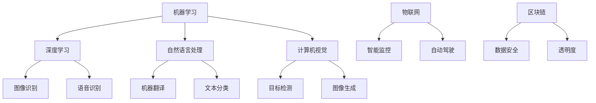

                 

关键词：人工智能，标准化，全球智能互联，算法，数学模型，应用场景，发展趋势

> 摘要：本文深入探讨了人工智能标准化的重要性，分析了全球智能互联的背景与挑战，阐述了核心概念与架构，并详细介绍了核心算法原理、数学模型、项目实践以及未来应用展望。通过本文，读者将全面了解AI标准化在构建全球智能互联中的关键作用，以及面临的挑战与机遇。

## 1. 背景介绍

随着人工智能（AI）技术的飞速发展，我们正迎来一个智能化的新时代。从智能家居到自动驾驶，从医疗诊断到金融决策，AI已经深刻地改变了我们的生活。然而，AI技术的广泛应用也带来了标准化的问题。缺乏统一的标准，不仅影响了AI系统的互操作性，还可能导致数据泄露、隐私风险等问题。

在全球范围内，人工智能的快速发展推动了智能互联的兴起。智能互联不仅涉及不同设备和系统的连接，还包括跨平台的数据共享与协同工作。为了实现全球智能互联，我们需要一套统一的标准体系，确保不同系统之间的兼容性和互操作性。

本文旨在探讨人工智能标准化的重要性，分析全球智能互联的背景与挑战，并详细介绍相关的核心概念、算法原理、数学模型、项目实践以及未来应用展望。希望通过本文的探讨，能为读者提供一个全面理解AI标准化在构建全球智能互联中的关键作用的视角。

## 2. 核心概念与联系

在深入探讨人工智能标准化之前，我们需要明确一些核心概念，这些概念构成了智能互联的基础。

### 2.1 机器学习与深度学习

机器学习（Machine Learning，ML）是AI的核心技术之一，它通过算法使计算机能够从数据中学习，并对新数据进行预测或决策。深度学习（Deep Learning，DL）是机器学习的一个子领域，它使用多层神经网络来提取数据的高级特征。


如图所示，机器学习与深度学习的关系可以类比为一棵树，机器学习是整个树，深度学习是这棵树上的一支主要枝干。深度学习通过增加网络的深度，可以提取出更复杂的数据特征，从而提高模型的准确性。

### 2.2 自然语言处理（NLP）

自然语言处理是AI领域的一个分支，旨在使计算机能够理解、解释和生成人类语言。NLP广泛应用于语音识别、机器翻译、文本分类等领域。


如图所示，NLP的应用领域非常广泛，从日常的语音助手到复杂的自然语言生成，都是NLP技术的具体应用。NLP的关键在于理解自然语言的语法、语义和上下文，从而实现高效的文本处理。

### 2.3 计算机视觉（CV）

计算机视觉是AI的另一个重要分支，它使计算机能够“看到”和理解周围的世界。CV技术广泛应用于图像识别、目标检测、图像生成等领域。


如图所示，计算机视觉的应用领域包括医疗影像分析、自动驾驶、智能监控等。计算机视觉的核心在于从图像中提取有用的信息，并进行特征识别和分类。

### 2.4 人工智能与物联网（IoT）

物联网（Internet of Things，IoT）是一个将物理设备和传感器连接到互联网的技术体系。人工智能与物联网的结合，使得设备能够实现智能化的监控、分析和决策。


如图所示，人工智能与物联网的关系可以类比为一对互补的翅膀，共同推动智能互联的发展。物联网提供大量的数据源，而人工智能则通过对这些数据的处理和分析，实现智能化的决策和优化。

### 2.5 人工智能与区块链

区块链技术以其去中心化、不可篡改的特点，为人工智能提供了新的数据安全和管理机制。人工智能与区块链的结合，可以提升AI系统的透明度和可信度。


如图所示，人工智能与区块链的关系可以类比为一对互相支撑的柱子，共同构建一个可靠、安全的智能互联体系。人工智能利用区块链的数据安全特性，提升系统的可信度，而区块链则利用人工智能的分析能力，提升数据的利用效率。

### 2.6 Mermaid 流程图（核心概念与架构）

下面是一个描述核心概念与架构的Mermaid流程图，它清晰地展示了上述概念之间的联系。



通过这个流程图，我们可以更直观地理解人工智能标准化的核心概念与架构，以及它们在构建全球智能互联中的关键作用。

## 3. 核心算法原理 & 具体操作步骤

在理解了人工智能标准化的核心概念之后，接下来我们将探讨一些核心算法的原理和具体操作步骤。

### 3.1 算法原理概述

人工智能的核心在于算法。算法是通过计算机执行特定任务的一系列步骤。在人工智能领域，常见的算法包括机器学习算法、深度学习算法、自然语言处理算法和计算机视觉算法等。

机器学习算法主要包括监督学习、无监督学习和强化学习。监督学习通过已标记的数据进行训练，从而预测新的数据。无监督学习则不使用标记数据，而是通过自动发现数据中的模式进行训练。强化学习通过试错法，不断调整策略以最大化奖励。

深度学习算法主要基于神经网络，通过多层非线性变换，提取数据的高级特征。常见的深度学习算法包括卷积神经网络（CNN）、循环神经网络（RNN）和生成对抗网络（GAN）等。

自然语言处理算法主要包括文本分类、情感分析、命名实体识别和机器翻译等。计算机视觉算法主要包括图像识别、目标检测和图像生成等。

### 3.2 算法步骤详解

#### 3.2.1 机器学习算法

以监督学习算法为例，其基本步骤如下：

1. **数据预处理**：清洗数据，处理缺失值和异常值。
2. **特征提取**：将原始数据转换为特征向量。
3. **模型选择**：选择合适的机器学习模型，如线性回归、决策树、支持向量机等。
4. **模型训练**：使用训练数据对模型进行训练。
5. **模型评估**：使用验证数据评估模型的性能。
6. **模型优化**：根据评估结果，调整模型参数，提高模型性能。
7. **预测**：使用训练好的模型对新的数据进行预测。

#### 3.2.2 深度学习算法

以卷积神经网络（CNN）为例，其基本步骤如下：

1. **数据预处理**：与机器学习算法相同，清洗数据，处理缺失值和异常值。
2. **卷积操作**：使用卷积核在输入数据上滑动，提取局部特征。
3. **激活函数**：对卷积后的特征进行非线性变换。
4. **池化操作**：对特征进行降维处理，减少参数数量。
5. **全连接层**：将池化后的特征映射到输出层。
6. **损失函数**：计算输出层与真实标签之间的差异。
7. **反向传播**：通过反向传播算法，更新网络权重。
8. **迭代训练**：重复上述步骤，直到模型收敛。

#### 3.2.3 自然语言处理算法

以文本分类算法为例，其基本步骤如下：

1. **数据预处理**：与机器学习算法相同，清洗数据，处理缺失值和异常值。
2. **分词**：将文本分割成词或短语。
3. **词向量表示**：将文本转换为向量表示。
4. **模型构建**：构建合适的自然语言处理模型，如卷积神经网络、递归神经网络等。
5. **模型训练**：使用训练数据对模型进行训练。
6. **模型评估**：使用验证数据评估模型的性能。
7. **模型优化**：根据评估结果，调整模型参数，提高模型性能。
8. **预测**：使用训练好的模型对新的文本数据进行分类预测。

#### 3.2.4 计算机视觉算法

以目标检测算法为例，其基本步骤如下：

1. **数据预处理**：与机器学习算法相同，清洗数据，处理缺失值和异常值。
2. **特征提取**：使用卷积神经网络或其他方法提取图像的特征。
3. **边界框检测**：使用边界框回归算法，预测图像中的目标位置。
4. **类别预测**：使用分类算法，预测目标类别。
5. **模型评估**：使用验证数据评估模型的性能。
6. **模型优化**：根据评估结果，调整模型参数，提高模型性能。
7. **预测**：使用训练好的模型对新的图像数据进行目标检测。

### 3.3 算法优缺点

每种算法都有其优缺点，以下是一些常见算法的优缺点：

#### 3.3.1 监督学习算法

**优点**：
- 预测准确性高。
- 应用广泛，包括分类和回归问题。

**缺点**：
- 需要大量的标记数据。
- 对新数据的泛化能力较弱。

#### 3.3.2 深度学习算法

**优点**：
- 能自动提取数据的高级特征。
- 在大量数据上有很好的泛化能力。

**缺点**：
- 计算复杂度高，训练时间长。
- 需要大量的数据和计算资源。

#### 3.3.3 自然语言处理算法

**优点**：
- 能处理自然语言的复杂性。
- 应用广泛，包括文本分类、情感分析和机器翻译等。

**缺点**：
- 需要大量的语料库和标注数据。
- 对语言多样性和上下文的理解仍有挑战。

#### 3.3.4 计算机视觉算法

**优点**：
- 能处理复杂的图像数据。
- 在图像识别和目标检测等领域有很好的性能。

**缺点**：
- 对光照、角度和背景的变化敏感。
- 需要大量的训练数据和计算资源。

### 3.4 算法应用领域

每种算法都有其特定的应用领域，以下是一些常见算法的应用领域：

#### 3.4.1 监督学习算法

- 分类问题：例如，垃圾邮件分类、文本分类。
- 回归问题：例如，股票价格预测、住房价格预测。

#### 3.4.2 深度学习算法

- 图像识别：例如，人脸识别、物体检测。
- 自然语言处理：例如，机器翻译、语音识别。
- 语音生成：例如，文本到语音转换。

#### 3.4.3 自然语言处理算法

- 文本分类：例如，新闻分类、情感分析。
- 情感分析：例如，社交媒体情绪分析、用户评论分析。
- 命名实体识别：例如，信息抽取、文本挖掘。

#### 3.4.4 计算机视觉算法

- 自动驾驶：例如，车辆检测、道路识别。
- 医疗影像分析：例如，癌症检测、骨折诊断。
- 智能监控：例如，目标检测、行为分析。

通过上述内容，我们详细介绍了核心算法的原理、步骤、优缺点以及应用领域。这些算法构成了人工智能标准化的基础，为全球智能互联的实现提供了技术支撑。

### 4. 数学模型和公式 & 详细讲解 & 举例说明

在人工智能领域，数学模型是理解和分析数据的关键工具。本节我们将详细介绍几个核心的数学模型和公式，并对其推导过程和实际应用进行讲解。

#### 4.1 数学模型构建

数学模型是通过对现实世界问题的抽象和简化，使用数学语言描述和解决问题的方法。在人工智能领域，常见的数学模型包括线性回归模型、逻辑回归模型和神经网络模型。

#### 4.2 公式推导过程

##### 4.2.1 线性回归模型

线性回归模型是机器学习中最基础的模型之一，主要用于预测连续值变量。其基本公式为：

$$y = \beta_0 + \beta_1 \cdot x + \epsilon$$

其中，$y$ 是因变量，$x$ 是自变量，$\beta_0$ 和 $\beta_1$ 是模型参数，$\epsilon$ 是误差项。

线性回归模型的推导过程如下：

1. **设定目标函数**：为了最小化误差，我们设定目标函数为损失函数，常用的有均方误差（MSE）：

$$J(\theta) = \frac{1}{2m} \sum_{i=1}^{m} (h_\theta(x^{(i)}) - y^{(i)})^2$$

其中，$m$ 是样本数量，$h_\theta(x)$ 是线性回归模型的预测值，$\theta$ 是模型参数。

2. **求导数**：为了找到使得损失函数最小的参数值，我们对损失函数关于参数求导：

$$\frac{\partial J(\theta)}{\partial \theta} = \frac{1}{m} \sum_{i=1}^{m} (h_\theta(x^{(i)}) - y^{(i)}) \cdot x^{(i)}$$

3. **设置梯度下降**：将求导结果设置为梯度下降的步长：

$$\theta = \theta - \alpha \cdot \frac{\partial J(\theta)}{\partial \theta}$$

其中，$\alpha$ 是学习率。

##### 4.2.2 逻辑回归模型

逻辑回归模型主要用于分类问题，其基本公式为：

$$\pi(x) = \frac{1}{1 + e^{-(\beta_0 + \beta_1 \cdot x)}$$

其中，$\pi(x)$ 是概率分布函数，$\beta_0$ 和 $\beta_1$ 是模型参数。

逻辑回归模型的推导过程如下：

1. **设定目标函数**：与线性回归类似，逻辑回归也使用损失函数，常用的有对数损失函数：

$$J(\theta) = -\frac{1}{m} \sum_{i=1}^{m} [y^{(i)} \cdot \log(\pi(x^{(i)})) + (1 - y^{(i)}) \cdot \log(1 - \pi(x^{(i)}))]$$

2. **求导数**：对损失函数关于参数求导：

$$\frac{\partial J(\theta)}{\partial \theta} = \frac{1}{m} \sum_{i=1}^{m} [y^{(i)} \cdot (1 - \pi(x^{(i)})) - (1 - y^{(i)}) \cdot \pi(x^{(i)})] \cdot x^{(i)}$$

3. **设置梯度下降**：与线性回归相同，使用梯度下降算法更新参数：

$$\theta = \theta - \alpha \cdot \frac{\partial J(\theta)}{\partial \theta}$$

##### 4.2.3 神经网络模型

神经网络模型是深度学习的基础，其基本公式为：

$$a_{ij}^{(l)} = \sigma \left( \sum_{k=1}^{n_{l-1}} w_{ik}^{(l)} \cdot a_{jk}^{(l-1)} + b_i^{(l)} \right)$$

其中，$a_{ij}^{(l)}$ 是第 $l$ 层的第 $i$ 个神经元的输出，$w_{ik}^{(l)}$ 是连接第 $l-1$ 层的第 $k$ 个神经元和第 $l$ 层的第 $i$ 个神经元的权重，$b_i^{(l)}$ 是第 $l$ 层的第 $i$ 个神经元的偏置，$\sigma$ 是激活函数，通常使用的是 sigmoid 函数或 ReLU 函数。

神经网络模型的推导过程如下：

1. **前向传播**：从输入层开始，逐层计算每个神经元的输出值。
2. **反向传播**：计算每个神经元的梯度，并更新权重和偏置。
3. **优化算法**：使用梯度下降或其他优化算法，更新网络参数。

#### 4.3 案例分析与讲解

为了更好地理解上述数学模型的实际应用，我们来看一个简单的案例：使用线性回归模型预测房价。

##### 4.3.1 案例背景

假设我们有一个包含房屋面积（$x$）和房价（$y$）的数据集，我们需要使用线性回归模型预测一个新的房屋面积对应的房价。

##### 4.3.2 数据预处理

1. **数据清洗**：检查数据集中的缺失值和异常值，并进行处理。
2. **数据标准化**：将房屋面积和房价进行标准化处理，以消除数据量级差异。

##### 4.3.3 模型训练

1. **设定模型参数**：初始化线性回归模型的参数 $\beta_0$ 和 $\beta_1$。
2. **计算损失函数**：使用均方误差（MSE）计算损失函数。
3. **求导数**：计算损失函数关于参数的导数。
4. **更新参数**：使用梯度下降算法更新模型参数。

##### 4.3.4 模型评估

1. **验证数据**：使用验证数据集评估模型的性能。
2. **调整参数**：根据验证结果，调整模型参数。

##### 4.3.5 模型预测

使用训练好的模型预测新的房屋面积对应的房价。

通过上述案例，我们可以看到线性回归模型在房价预测中的应用，以及如何通过数学模型和公式来实现这一预测任务。

### 5. 项目实践：代码实例和详细解释说明

为了更好地理解前面介绍的数学模型和算法，我们将通过一个具体的项目实践来展示如何在实际中实现这些算法。本项目将使用Python和Scikit-learn库来实现线性回归模型，并对其进行详细解释。

#### 5.1 开发环境搭建

在开始项目之前，我们需要搭建一个Python开发环境。以下是所需的步骤：

1. **安装Python**：下载并安装Python 3.x版本。
2. **安装Scikit-learn**：在命令行中运行以下命令安装Scikit-learn：

   ```bash
   pip install scikit-learn
   ```

3. **安装Jupyter Notebook**：Jupyter Notebook是一个交互式开发环境，可以方便我们编写和运行代码。在命令行中运行以下命令安装Jupyter Notebook：

   ```bash
   pip install notebook
   ```

安装完成后，我们可以启动Jupyter Notebook：

```bash
jupyter notebook
```

这将打开一个Web浏览器窗口，显示Jupyter Notebook的主页。

#### 5.2 源代码详细实现

在Jupyter Notebook中，我们将编写以下代码来实现线性回归模型：

```python
# 导入所需的库
import numpy as np
from sklearn.linear_model import LinearRegression
from sklearn.model_selection import train_test_split
from sklearn.metrics import mean_squared_error

# 生成模拟数据集
np.random.seed(0)
X = np.random.rand(100, 1) * 100  # 房屋面积（1列，100行）
y = 2 * X + np.random.randn(100, 1) * 10 + 100  # 房价（1列，100行）

# 数据标准化
X_std = (X - X.mean()) / X.std()
y_std = (y - y.mean()) / y.std()

# 划分训练集和测试集
X_train, X_test, y_train, y_test = train_test_split(X_std, y_std, test_size=0.2, random_state=0)

# 实例化线性回归模型
model = LinearRegression()

# 训练模型
model.fit(X_train, y_train)

# 预测测试集
y_pred = model.predict(X_test)

# 计算均方误差
mse = mean_squared_error(y_test, y_pred)
print(f"测试集均方误差：{mse}")

# 可视化结果
import matplotlib.pyplot as plt

plt.scatter(X_test, y_test, color='red', label='实际值')
plt.plot(X_test, y_pred, color='blue', label='预测值')
plt.xlabel('房屋面积')
plt.ylabel('房价')
plt.legend()
plt.show()
```

#### 5.3 代码解读与分析

上述代码实现了线性回归模型，并对其进行了详细解读。

1. **导入库**：我们首先导入了Python的标准库 `numpy` 和机器学习库 `sklearn` 中的 `LinearRegression`、`train_test_split` 和 `mean_squared_error` 函数。

2. **生成模拟数据集**：我们使用 `numpy.random.rand` 函数生成一个包含100个样本的模拟数据集，其中每个样本由房屋面积（$X$）和房价（$y$）组成。房价由房屋面积和随机噪声组成。

3. **数据标准化**：为了消除数据量级差异，我们对数据进行了标准化处理。标准化后的数据可以更好地反映模型的真实性能。

4. **划分训练集和测试集**：我们使用 `train_test_split` 函数将数据集划分为训练集和测试集，其中测试集占20%。

5. **实例化线性回归模型**：我们创建了一个 `LinearRegression` 对象，这是线性回归模型的实例。

6. **训练模型**：使用 `fit` 方法对模型进行训练，模型将自动计算参数 $\beta_0$ 和 $\beta_1$。

7. **预测测试集**：使用 `predict` 方法对测试集进行预测，得到预测房价。

8. **计算均方误差**：使用 `mean_squared_error` 函数计算测试集的均方误差，这是评估模型性能的一个常用指标。

9. **可视化结果**：我们使用 `matplotlib.pyplot` 绘制了实际值和预测值的关系图，可以直观地看到线性回归模型的预测效果。

通过这个项目实践，我们不仅实现了线性回归模型，还对其进行了详细的解读和分析。这个过程不仅让我们更好地理解了线性回归模型的原理和实现方法，也为我们提供了一个实际操作的范例。

### 6. 实际应用场景

人工智能标准化在全球智能互联的实际应用场景中发挥着至关重要的作用。以下是一些具体的应用场景和案例。

#### 6.1 自动驾驶

自动驾驶是人工智能在交通领域的典型应用，它依赖于大量的数据采集、处理和分析。为了实现自动驾驶的标准化，需要定义统一的数据格式、接口规范和通信协议，以确保不同系统和设备之间的兼容性和互操作性。例如，自动驾驶车辆需要与交通信号灯、道路标识和周边车辆进行实时通信，这要求所有设备都遵循相同的通信标准。

#### 6.2 智能医疗

智能医疗通过人工智能技术，提高医疗诊断的准确性、效率和便捷性。标准化在这里的意义在于，确保不同医疗机构之间能够共享和交换医疗数据，实现资源的最大化利用。例如，电子病历系统的标准化，使得医生可以在不同的医疗机构中访问和更新患者的医疗记录，从而提供更全面、个性化的医疗服务。

#### 6.3 智能家居

智能家居通过连接各种家庭设备，实现家庭自动化管理。为了实现智能家居的标准化，需要制定统一的数据交换协议和接口规范，以方便不同设备之间的数据共享和协同工作。例如，智能门锁、智能灯光和智能空调等设备，需要能够无缝地集成到同一个智能家居系统中，实现一键控制。

#### 6.4 智慧城市

智慧城市是人工智能在城市建设和管理中的典型应用。智慧城市通过物联网、大数据和人工智能技术，实现城市管理的智能化和高效化。为了实现智慧城市的标准化，需要制定统一的城市数据标准和通信协议，以确保不同系统和设备之间的数据共享和协同工作。例如，智慧交通系统、智能能源管理和智能环保监测等，都需要遵循相同的标准化规范。

#### 6.5 金融科技

金融科技（FinTech）通过人工智能技术，提升金融服务的效率和安全性。标准化在金融科技中的应用，主要体现在数据安全、合规性和互操作性等方面。例如，区块链技术的标准化，确保金融交易的数据透明性和不可篡改性，同时，API接口的标准化，使得不同金融平台和服务之间能够无缝对接，提高用户体验。

通过上述实际应用场景，我们可以看到，人工智能标准化在全球智能互联中的重要性。它不仅推动了人工智能技术的广泛应用，也确保了不同系统和设备之间的兼容性和互操作性，为构建全球智能互联提供了坚实的基础。

### 6.4 未来应用展望

随着人工智能技术的不断进步和全球智能互联的深入发展，AI标准化将在未来发挥更加重要的作用。以下是对未来应用场景的展望：

#### 6.4.1 自动驾驶的全面普及

自动驾驶技术的标准化将推动自动驾驶车辆的全面普及。未来，自动驾驶将不仅限于特定场景，如高速公路和特定区域，还将扩展到城市道路和复杂环境。为了实现这一目标，需要制定更加严格和全面的自动驾驶标准，包括车辆感知、决策和控制等各个层面。此外，5G网络的普及将为自动驾驶提供高速、低延迟的通信支持，进一步推动自动驾驶技术的发展。

#### 6.4.2 智慧医疗的个性化服务

智慧医疗将更加注重个性化服务。通过AI标准化，可以实现医疗数据的跨机构共享和实时更新，从而为患者提供更加精准的诊疗建议。例如，基于患者电子病历的个性化健康管理计划，以及针对特定病种的精准治疗方案。未来，人工智能将进一步与医疗数据相结合，通过深度学习和自然语言处理等技术，实现更高效、更精准的医疗诊断和治疗。

#### 6.4.3 智能家居的生态系统建设

智能家居的标准化将促进生态系统的建设，实现不同设备和平台的互操作。未来，智能家居将不再局限于单个设备的控制，而是通过统一的通信协议和数据标准，实现整个家居系统的智能化管理。例如，用户可以通过一个智能控制中心，统一管理家中的灯光、温度、安防系统等。此外，AI标准化还将推动智能家居与智慧城市系统的融合，实现城市资源的优化配置和管理。

#### 6.4.4 智慧城市的数据治理

智慧城市的数据治理将更加依赖于AI标准化。未来，智慧城市将产生海量数据，如何高效、安全地存储、处理和利用这些数据，是一个重要课题。通过制定统一的数据标准和管理规范，可以确保数据的质量、一致性和互操作性。例如，交通流量数据的标准化，可以实现交通系统的实时监控和优化调度，提高交通效率。此外，AI标准化还将推动智慧城市中的数据隐私和安全保护，确保公民的个人隐私不被泄露。

#### 6.4.5 金融科技的创新应用

金融科技的创新应用将依赖于AI标准化。未来，金融科技将更加注重用户体验和安全性。通过制定统一的数据标准和接口规范，可以实现金融服务的无缝对接和跨平台操作。例如，区块链技术的标准化，将推动数字货币和跨境支付的发展。此外，AI标准化还将推动金融科技与人工智能结合，实现更加智能化的金融风险管理和服务。

综上所述，人工智能标准化在未来应用场景中将发挥关键作用。它不仅将推动人工智能技术的广泛应用，还将促进全球智能互联的发展，为人类创造更加智能、高效和便捷的生活环境。

### 7. 工具和资源推荐

为了更好地学习和应用人工智能标准化技术，以下是一些推荐的工具和资源：

#### 7.1 学习资源推荐

1. **《深度学习》（Deep Learning）**：由Ian Goodfellow、Yoshua Bengio和Aaron Courville所著，是深度学习的经典教材，涵盖了从基础理论到实践应用的各个方面。
2. **《Python机器学习》（Python Machine Learning）**：由Sebastian Raschka和Vahid Mirhoseini所著，介绍了如何使用Python实现机器学习算法，适合初学者和进阶者。
3. **《机器学习实战》（Machine Learning in Action）**：由Peter Harrington所著，通过实例引导读者学习机器学习算法，注重实际操作。

#### 7.2 开发工具推荐

1. **Jupyter Notebook**：一个交互式的开发环境，适合编写和运行代码，特别是适用于机器学习和数据科学项目。
2. **TensorFlow**：由Google开发的开源机器学习框架，适用于构建和训练各种深度学习模型。
3. **Scikit-learn**：一个基于Python的机器学习库，提供了丰富的机器学习算法和工具。

#### 7.3 相关论文推荐

1. **“Deep Learning: A Theoretical Perspective”**：由Yoshua Bengio等人所著，从理论角度介绍了深度学习的各个方面。
2. **“Machine Learning: A Probabilistic Perspective”**：由Kevin P. Murphy所著，详细介绍了机器学习的概率模型。
3. **“Deep Learning for Computer Vision”**：由Karen Simonyan和Andrew Zisserman所著，探讨了深度学习在计算机视觉领域的应用。

通过这些资源和工具，读者可以系统地学习和掌握人工智能标准化技术，为构建全球智能互联做出贡献。

### 8. 总结：未来发展趋势与挑战

随着人工智能技术的不断进步，人工智能标准化在全球智能互联中的重要性日益凸显。在未来，人工智能标准化将呈现以下发展趋势：

首先，人工智能标准化将更加注重数据隐私和安全。随着数据量的激增，如何保护用户的隐私和数据安全成为重要议题。标准化规范将推动数据加密、匿名化和访问控制等技术的应用，确保数据在采集、传输和存储过程中不被泄露或滥用。

其次，人工智能标准化将推动跨领域的融合。智慧城市、智慧医疗、智能制造等各个领域都将依赖于人工智能技术，而这些领域的发展又需要统一的标准化规范，以确保不同系统之间的互操作性和兼容性。未来，跨领域的标准化合作将更加紧密，形成统一的全球智能互联标准。

最后，人工智能标准化将促进人工智能技术的普及和应用。通过制定统一的开发框架、接口规范和数据标准，可以降低开发者的门槛，促进人工智能技术的普及和应用，从而推动全球智能互联的快速发展。

然而，人工智能标准化也面临诸多挑战。首先，如何平衡技术创新和标准化进程是一个重要问题。过快的标准化可能导致技术发展滞后，而过慢的标准化则可能阻碍技术的广泛应用。其次，不同国家和地区之间的标准化冲突和利益博弈也是一个难题。全球智能互联需要一个统一的标准体系，但这需要各国共同努力，克服利益冲突，达成共识。

此外，人工智能标准化还面临技术更新快速、应用场景复杂等问题。随着人工智能技术的不断演进，标准化规范需要及时更新，以适应新的技术趋势和应用场景。同时，人工智能系统的复杂性使得标准化工作的难度增加，需要更多的专业知识和经验。

总之，人工智能标准化在未来将发挥重要作用，推动全球智能互联的发展。然而，这也需要我们不断克服挑战，不断探索和创新，以实现标准化与技术创新的和谐发展。

### 8.4 研究展望

展望未来，人工智能标准化研究将朝着以下几个方向深入发展：

首先，随着量子计算、边缘计算等新兴技术的发展，人工智能标准化需要进一步探索如何将这些技术纳入标准化框架。量子计算的潜力巨大，但标准化技术还需要充分研究其应用场景和安全问题。边缘计算则要求标准化协议能够在低延迟、高带宽的环境中高效运行。

其次，人工智能标准化将更加关注伦理和责任问题。随着AI系统的广泛应用，如何确保AI系统的公正性、透明性和可解释性成为重要议题。标准化研究需要制定相应的规范，确保AI系统在设计和应用过程中遵循伦理原则，减少偏见和歧视。

第三，标准化研究需要加强国际合作，推动全球统一标准的制定。不同国家和地区在AI领域的研究和应用存在差异，通过国际合作，可以共享技术成果，促进全球智能互联的发展。

最后，人工智能标准化研究需要不断更新和完善，以适应快速变化的技术环境。标准化机构需要密切关注技术前沿，及时更新标准规范，确保其适用性和前瞻性。

通过上述努力，人工智能标准化将为构建全球智能互联提供坚实的基础，推动人工智能技术的健康、有序发展。

