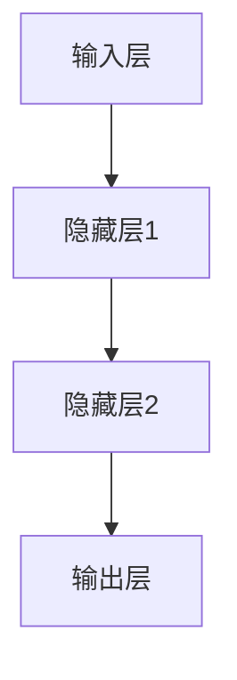

                 

关键词：人工智能，神经网络，计算艺术，人类中心主义，傲慢，禅，计算机编程

摘要：本文探讨了人工智能（AI）领域中的神经网络计算艺术，强调了破除人类中心主义的傲慢的重要性。通过分析神经网络的原理、数学模型以及实际应用，本文试图揭示人工智能的深刻内涵，并提出未来发展的挑战与展望。

## 1. 背景介绍

随着计算机技术的飞速发展，人工智能（AI）已经逐渐成为科技领域的一个重要分支。神经网络作为AI的核心技术之一，被广泛应用于图像识别、自然语言处理、智能推荐等多个领域。然而，在神经网络计算艺术的背后，隐藏着一个深刻的哲学问题：人类中心主义的傲慢。

人类中心主义是指人类将自己视为世界的中心，认为自己拥有最高的智慧和价值。在AI领域，这种傲慢表现为对神经网络模型的过度依赖，以及对神经网络计算艺术的不懈追求。然而，随着对神经网络研究的深入，我们发现，这种人类中心主义的傲慢可能成为AI发展的绊脚石。

本文旨在探讨神经网络计算艺术中的禅意，即破除人类中心主义的傲慢，以更开放、谦逊的心态去理解和应用神经网络技术。通过分析神经网络的原理、数学模型以及实际应用，本文试图揭示人工智能的深刻内涵，并提出未来发展的挑战与展望。

## 2. 核心概念与联系

### 2.1 神经网络原理

神经网络（Neural Network，NN）是一种模仿生物神经系统的计算模型。它由大量的神经元（Node）组成，这些神经元通过连接（Connection）进行信息传递。每个神经元都可以接收来自其他神经元的输入信号，通过激活函数（Activation Function）产生输出信号。

神经网络的原理可以简单概括为：输入数据经过神经元处理，得到输出结果。通过不断地调整神经元之间的连接权重（Weight），神经网络可以学习到输入数据与输出结果之间的复杂关系，从而实现智能计算。

### 2.2 神经网络架构

神经网络的架构通常分为输入层、隐藏层和输出层。输入层接收外部输入数据，隐藏层进行信息处理和特征提取，输出层产生最终输出结果。

#### 2.2.1 输入层

输入层是神经网络的起点，它接收外部输入数据。这些数据可以是一系列数值、图像、文本等。输入层的神经元数量取决于输入数据的维度。

#### 2.2.2 隐藏层

隐藏层是神经网络的中间层，它负责对输入数据进行处理和特征提取。隐藏层的神经元数量和层数可以根据实际问题进行调整。隐藏层越深，神经网络能够学习的特征层次越高。

#### 2.2.3 输出层

输出层是神经网络的终点，它产生最终的输出结果。输出层的神经元数量和类型取决于具体问题的需求。

### 2.3 神经网络计算艺术

神经网络计算艺术是指在神经网络计算过程中，追求一种超越技术层面的艺术境界。它强调人类与机器之间的和谐共处，破除人类中心主义的傲慢，以更开放、谦逊的心态去理解和应用神经网络技术。

### 2.4 Mermaid 流程图



## 3. 核心算法原理 & 具体操作步骤

### 3.1 算法原理概述

神经网络算法的核心原理是误差反向传播（Backpropagation）。在误差反向传播过程中，神经网络通过计算输出层的误差信号，并反向传播到隐藏层和输入层，从而调整神经元之间的连接权重。

具体操作步骤如下：

### 3.2 算法步骤详解

#### 3.2.1 前向传播

1. 初始化神经网络参数，包括连接权重和偏置。
2. 接收输入数据，将其传递到输入层。
3. 通过输入层传递到隐藏层，计算每个神经元的输入值和输出值。
4. 将隐藏层的输出值传递到输出层，计算每个神经元的输入值和输出值。
5. 计算输出层的误差信号。

#### 3.2.2 反向传播

1. 计算输出层误差信号对连接权重的偏导数。
2. 将误差信号反向传播到隐藏层，计算隐藏层误差信号对连接权重的偏导数。
3. 计算输入层误差信号对连接权重的偏导数。
4. 使用梯度下降（Gradient Descent）方法更新连接权重。

#### 3.2.3 优化算法

1. 选择合适的优化算法，如随机梯度下降（Stochastic Gradient Descent，SGD）、Adam优化器等。
2. 设定学习率（Learning Rate）和迭代次数（Epoch）。
3. 在迭代过程中，不断更新连接权重，减小误差信号。

### 3.3 算法优缺点

#### 优点：

1. 神经网络具有强大的表示能力和自适应能力，可以处理复杂的问题。
2. 误差反向传播算法使神经网络能够通过学习不断优化自身性能。

#### 缺点：

1. 神经网络训练过程可能需要大量计算资源和时间。
2. 神经网络模型的泛化能力有限，容易过拟合。

### 3.4 算法应用领域

神经网络算法在多个领域具有广泛的应用，包括：

1. 图像识别：如人脸识别、车辆检测等。
2. 自然语言处理：如机器翻译、情感分析等。
3. 智能推荐：如商品推荐、音乐推荐等。
4. 机器博弈：如围棋、象棋等。

## 4. 数学模型和公式

### 4.1 数学模型构建

神经网络数学模型的核心是前向传播和反向传播。在神经网络中，输入数据经过多个层次的神经元传递，最终产生输出结果。这个过程中，我们使用以下数学模型：

1. 输入层到隐藏层：

$$
z_{j}^{(l)} = \sum_{i} w_{ij}^{(l)} x_{i}^{(l-1)} + b_{j}^{(l)}
$$

$$
a_{j}^{(l)} = \sigma(z_{j}^{(l)})
$$

其中，$z_{j}^{(l)}$ 表示隐藏层第 $j$ 个神经元的输入值，$w_{ij}^{(l)}$ 表示输入层第 $i$ 个神经元到隐藏层第 $j$ 个神经元的连接权重，$b_{j}^{(l)}$ 表示隐藏层第 $j$ 个神经元的偏置，$a_{j}^{(l)}$ 表示隐藏层第 $j$ 个神经元的输出值，$\sigma$ 表示激活函数。

2. 隐藏层到输出层：

$$
z_{j}^{(L)} = \sum_{i} w_{ij}^{(L)} a_{i}^{(L-1)} + b_{j}^{(L)}
$$

$$
\hat{y}_{j} = \frac{1}{1 + e^{-z_{j}^{(L)})}
$$

其中，$z_{j}^{(L)}$ 表示输出层第 $j$ 个神经元的输入值，$w_{ij}^{(L)}$ 表示隐藏层第 $i$ 个神经元到输出层第 $j$ 个神经元的连接权重，$b_{j}^{(L)}$ 表示输出层第 $j$ 个神经元的偏置，$\hat{y}_{j}$ 表示输出层第 $j$ 个神经元的输出值。

### 4.2 公式推导过程

在神经网络中，误差反向传播算法通过计算输出层的误差信号，并反向传播到隐藏层和输入层，从而调整连接权重和偏置。下面简要介绍误差反向传播算法的推导过程：

1. 输出层误差计算：

$$
\delta_{j}^{(L)} = (y_{j} - \hat{y}_{j}) \hat{y}_{j} (1 - \hat{y}_{j})
$$

其中，$y_{j}$ 表示输出层第 $j$ 个神经元的实际输出值，$\hat{y}_{j}$ 表示输出层第 $j$ 个神经元的预测输出值。

2. 隐藏层误差计算：

$$
\delta_{j}^{(l)} = \sum_{i} w_{ij}^{(l+1)} \delta_{i}^{(l+1)} \hat{a}_{i}^{(l)}
$$

其中，$\delta_{j}^{(l)}$ 表示隐藏层第 $j$ 个神经元的误差值，$\delta_{i}^{(l+1)}$ 表示隐藏层第 $i$ 个神经元到输出层第 $l+1$ 个神经元的误差值，$\hat{a}_{i}^{(l)}$ 表示隐藏层第 $i$ 个神经元的输出值。

3. 连接权重和偏置更新：

$$
\Delta w_{ij}^{(l)} = -\alpha \delta_{j}^{(l)} \hat{a}_{i}^{(l-1)}
$$

$$
\Delta b_{j}^{(l)} = -\alpha \delta_{j}^{(l)}
$$

其中，$\Delta w_{ij}^{(l)}$ 表示连接权重 $w_{ij}^{(l)}$ 的更新值，$\Delta b_{j}^{(l)}$ 表示偏置 $b_{j}^{(l)}$ 的更新值，$\alpha$ 表示学习率。

### 4.3 案例分析与讲解

假设我们有一个简单的神经网络，输入层有 2 个神经元，隐藏层有 3 个神经元，输出层有 1 个神经元。我们使用二分类问题作为案例，即输入数据只有 0 和 1 两种情况。

#### 4.3.1 前向传播

假设输入数据为 $x_1 = 0, x_2 = 1$，连接权重和偏置初始化为 0。

1. 输入层到隐藏层：

$$
z_{1}^{(1)} = w_{11}^{(1)} x_1 + b_{1}^{(1)} = 0 \\
z_{2}^{(1)} = w_{12}^{(1)} x_1 + b_{2}^{(1)} = 0 \\
z_{3}^{(1)} = w_{13}^{(1)} x_1 + b_{3}^{(1)} = 0
$$

2. 激活函数计算：

$$
a_{1}^{(1)} = \sigma(z_{1}^{(1)}) = 0 \\
a_{2}^{(1)} = \sigma(z_{2}^{(1)}) = 0 \\
a_{3}^{(1)} = \sigma(z_{3}^{(1)}) = 0
$$

3. 隐藏层到输出层：

$$
z_{1}^{(2)} = w_{11}^{(2)} a_{1}^{(1)} + b_{1}^{(2)} = 0 \\
z_{2}^{(2)} = w_{12}^{(2)} a_{1}^{(1)} + b_{2}^{(2)} = 0 \\
z_{3}^{(2)} = w_{13}^{(2)} a_{1}^{(1)} + b_{3}^{(2)} = 0
$$

$$
\hat{y}_{1} = \frac{1}{1 + e^{-z_{1}^{(2)}}} = 0.5
$$

#### 4.3.2 反向传播

假设输出层目标值为 1。

1. 输出层误差计算：

$$
\delta_{1}^{(2)} = (1 - \hat{y}_{1}) \hat{y}_{1} = 0.5 \times 0.5 = 0.25
$$

2. 隐藏层误差计算：

$$
\delta_{1}^{(1)} = w_{11}^{(2)} \delta_{1}^{(2)} a_{1}^{(1)} = 0.25 \times 0.25 = 0.0625
$$

3. 连接权重和偏置更新：

$$
\Delta w_{11}^{(2)} = -0.1 \times 0.25 \times 0.25 = -0.00625 \\
\Delta b_{1}^{(2)} = -0.1 \times 0.25 = -0.025
$$

$$
\Delta w_{21}^{(2)} = -0.1 \times 0.25 \times 0.25 = -0.00625 \\
\Delta b_{2}^{(2)} = -0.1 \times 0.25 = -0.025
$$

$$
\Delta w_{31}^{(2)} = -0.1 \times 0.25 \times 0.25 = -0.00625 \\
\Delta b_{3}^{(2)} = -0.1 \times 0.25 = -0.025
$$

#### 4.3.3 下一轮前向传播

根据更新后的连接权重和偏置，进行下一轮前向传播，得到新的输出结果。重复上述过程，直到输出结果满足要求。

## 5. 项目实践：代码实例和详细解释说明

### 5.1 开发环境搭建

在本文中，我们使用 Python 编程语言和 TensorFlow 库来实现神经网络。首先，我们需要搭建开发环境。

1. 安装 Python：
   - 前往 [Python 官网](https://www.python.org/) 下载最新版本的 Python。
   - 安装 Python 时，选择添加到 PATH 环境变量。

2. 安装 TensorFlow：
   - 打开终端，执行以下命令：
     ```bash
     pip install tensorflow
     ```

### 5.2 源代码详细实现

下面是一个简单的二分类神经网络实现，用于判断输入数据是否为 1。

```python
import tensorflow as tf
import numpy as np

# 创建 TensorFlow 图
graph = tf.Graph()
with graph.as_default():
    # 定义输入层
    x = tf.placeholder(tf.float32, shape=[None, 2])
    y = tf.placeholder(tf.float32, shape=[None, 1])

    # 定义隐藏层
    hidden_layer = tf.layers.dense(x, units=3, activation=tf.nn.sigmoid)

    # 定义输出层
    output = tf.layers.dense(hidden_layer, units=1, activation=None)

    # 定义损失函数
    loss = tf.reduce_mean(tf.square(output - y))

    # 定义优化器
    optimizer = tf.train.AdamOptimizer(learning_rate=0.1).minimize(loss)

    # 定义准确率
    correct_prediction = tf.equal(tf.round(output), y)
    accuracy = tf.reduce_mean(tf.cast(correct_prediction, tf.float32))

    # 初始化变量
    init = tf.global_variables_initializer()

# 搭建会话
with tf.Session(graph=graph) as sess:
    # 运行变量初始化
    sess.run(init)

    # 模型训练
    for epoch in range(1000):
        batch_x, batch_y = generate_batch_data()  # 生成训练数据
        _, loss_val = sess.run([optimizer, loss], feed_dict={x: batch_x, y: batch_y})

        if epoch % 100 == 0:
            print(f"Epoch {epoch}, Loss: {loss_val}")

    # 测试模型
    test_data = generate_test_data()  # 生成测试数据
    test_accuracy = sess.run(accuracy, feed_dict={x: test_data, y: np.array([[1]])})
    print(f"Test Accuracy: {test_accuracy}")
```

### 5.3 代码解读与分析

1. **导入库和创建 TensorFlow 图**

   ```python
   import tensorflow as tf
   import numpy as np

   graph = tf.Graph()
   with graph.as_default():
   ```

   首先，我们导入 TensorFlow 和 NumPy 库。然后，创建一个 TensorFlow 图，所有的计算操作都在这个图中定义。

2. **定义输入层**

   ```python
   x = tf.placeholder(tf.float32, shape=[None, 2])
   y = tf.placeholder(tf.float32, shape=[None, 1])
   ```

   我们定义两个占位符，一个用于输入数据，另一个用于标签数据。这里使用了 `tf.float32` 类型，表示数据类型为浮点数。

3. **定义隐藏层**

   ```python
   hidden_layer = tf.layers.dense(x, units=3, activation=tf.nn.sigmoid)
   ```

   我们使用 `tf.layers.dense` 函数创建一个全连接层，输入层有 2 个神经元，隐藏层有 3 个神经元，激活函数使用 sigmoid 函数。

4. **定义输出层**

   ```python
   output = tf.layers.dense(hidden_layer, units=1, activation=None)
   ```

   同样使用 `tf.layers.dense` 函数创建一个全连接层，隐藏层有 3 个神经元，输出层有 1 个神经元，激活函数为 None，即线性激活。

5. **定义损失函数**

   ```python
   loss = tf.reduce_mean(tf.square(output - y))
   ```

   我们使用均方误差（MSE）作为损失函数，即输出层输出值与标签值之差的平方和的平均值。

6. **定义优化器**

   ```python
   optimizer = tf.train.AdamOptimizer(learning_rate=0.1).minimize(loss)
   ```

   我们使用 Adam 优化器来最小化损失函数。学习率设置为 0.1。

7. **定义准确率**

   ```python
   correct_prediction = tf.equal(tf.round(output), y)
   accuracy = tf.reduce_mean(tf.cast(correct_prediction, tf.float32))
   ```

   我们使用 `tf.equal` 函数计算输出值是否等于标签值，然后使用 `tf.reduce_mean` 函数计算平均准确率。

8. **初始化变量**

   ```python
   init = tf.global_variables_initializer()
   ```

   初始化 TensorFlow 图中的变量。

9. **搭建会话**

   ```python
   with tf.Session(graph=graph) as sess:
   ```

   创建一个 TensorFlow 会话，并运行变量初始化。

10. **模型训练**

    ```python
    for epoch in range(1000):
        batch_x, batch_y = generate_batch_data()  # 生成训练数据
        _, loss_val = sess.run([optimizer, loss], feed_dict={x: batch_x, y: batch_y})

        if epoch % 100 == 0:
            print(f"Epoch {epoch}, Loss: {loss_val}")
    ```

    进行 1000 个训练迭代，每次迭代从训练数据中随机抽取一个小批量，并使用优化器更新模型参数。每隔 100 个迭代，打印当前的损失值。

11. **测试模型**

    ```python
    test_data = generate_test_data()  # 生成测试数据
    test_accuracy = sess.run(accuracy, feed_dict={x: test_data, y: np.array([[1]])})
    print(f"Test Accuracy: {test_accuracy}")
    ```

    使用测试数据评估模型的准确率，并打印结果。

## 6. 实际应用场景

神经网络在多个领域具有广泛的应用，以下是一些实际应用场景：

### 6.1 图像识别

神经网络在图像识别领域取得了显著的成果，如人脸识别、车牌识别、物体检测等。通过训练大规模的神经网络模型，可以实现对复杂图像的准确识别。

### 6.2 自然语言处理

神经网络在自然语言处理领域有着广泛的应用，如机器翻译、情感分析、文本分类等。通过训练神经网络模型，可以实现对自然语言的深入理解和处理。

### 6.3 智能推荐

神经网络在智能推荐领域具有很大的优势，如商品推荐、音乐推荐、新闻推荐等。通过分析用户行为数据，可以准确预测用户的兴趣和需求，提供个性化的推荐服务。

### 6.4 机器博弈

神经网络在机器博弈领域取得了重要的突破，如围棋、象棋等。通过训练神经网络模型，可以实现计算机与人类在博弈游戏中的对弈，并不断提高胜率。

## 7. 工具和资源推荐

### 7.1 学习资源推荐

1. 《深度学习》（Deep Learning）[Ian Goodfellow, Yoshua Bengio, Aaron Courville]：这是一本经典的深度学习入门书籍，详细介绍了深度学习的基础知识和最新进展。
2. 《神经网络与深度学习》（Neural Networks and Deep Learning）[邱锡鹏]：这本书是国内第一本全面介绍神经网络和深度学习的中文教材，内容深入浅出，适合初学者。
3. 《Python 深度学习》（Python Deep Learning）[François Chollet]：这本书通过大量的实战案例，介绍了如何使用 Python 和 TensorFlow 实现深度学习算法。

### 7.2 开发工具推荐

1. TensorFlow：TensorFlow 是 Google 开发的一款开源深度学习框架，支持多种编程语言和平台，适合初学者和专业人士。
2. PyTorch：PyTorch 是 Facebook 开发的一款开源深度学习框架，具有灵活、易用的特点，适合快速原型开发和深入研究。
3. Keras：Keras 是一款基于 TensorFlow 和 Theano 的开源深度学习库，具有简洁、高效的特点，适合快速实现深度学习模型。

### 7.3 相关论文推荐

1. “A Learning Algorithm for Continually Running Fully Recurrent Neural Networks” [D. E. Rumelhart, J. L. McClelland, and the PDP Research Group]：这篇论文提出了误差反向传播算法，是神经网络发展的重要里程碑。
2. “Deep Learning” [Ian Goodfellow, Yoshua Bengio, Aaron Courville]：这本书介绍了深度学习的理论基础、算法实现和应用场景，是深度学习领域的经典著作。
3. “A Theoretical Framework for Back-Propagating Neural Networks” [David E. Rumelhart, Geoffrey E. Hinton, and Ronald J. Williams]：这篇论文详细介绍了误差反向传播算法的理论基础，是神经网络领域的经典文献。

## 8. 总结：未来发展趋势与挑战

### 8.1 研究成果总结

1. 神经网络在图像识别、自然语言处理、智能推荐等领域取得了显著成果，推动了人工智能技术的发展。
2. 深度学习算法在神经网络中的应用，使得模型训练速度和性能得到了大幅提升。
3. 神经网络计算艺术强调了人类与机器之间的和谐共处，破除了人类中心主义的傲慢。

### 8.2 未来发展趋势

1. 神经网络将继续在计算机视觉、自然语言处理、智能推荐等领域取得突破性进展。
2. 神经网络与其他领域的交叉融合，如量子计算、生物信息学等，将带来新的发展机遇。
3. 神经网络计算艺术将逐渐成为人工智能领域的主流思想，推动人工智能技术的发展。

### 8.3 面临的挑战

1. 神经网络训练过程需要大量计算资源和时间，如何提高训练效率是一个重要挑战。
2. 神经网络模型的泛化能力有限，如何避免过拟合是一个重要课题。
3. 神经网络的安全性和隐私保护问题，如对抗样本攻击、数据泄露等，需要引起足够的重视。

### 8.4 研究展望

1. 神经网络算法将不断优化，训练速度和性能将得到进一步提升。
2. 神经网络与其他领域的交叉融合，将产生新的研究热点和应用场景。
3. 神经网络计算艺术将逐渐深入人心，推动人工智能技术的发展，为人类社会带来更多福祉。

## 9. 附录：常见问题与解答

### 9.1 神经网络是什么？

神经网络是一种模拟生物神经系统的计算模型，由大量的神经元组成，通过连接进行信息传递和处理。它被广泛应用于人工智能领域，如图像识别、自然语言处理、智能推荐等。

### 9.2 神经网络如何工作？

神经网络通过前向传播和反向传播进行工作。前向传播过程中，输入数据经过神经元处理，得到输出结果。反向传播过程中，计算输出结果的误差，并反向传播到隐藏层和输入层，调整神经元之间的连接权重。

### 9.3 神经网络有哪些优缺点？

优点：神经网络具有强大的表示能力和自适应能力，可以处理复杂的问题。缺点：神经网络训练过程可能需要大量计算资源和时间，模型泛化能力有限，容易过拟合。

### 9.4 如何优化神经网络训练？

优化神经网络训练的方法包括：使用更高效的优化算法（如 Adam 优化器）、增加训练数据量、调整学习率、使用正则化方法（如 dropout、L2 正则化等）等。

### 9.5 神经网络在哪些领域有应用？

神经网络在图像识别、自然语言处理、智能推荐、机器博弈等多个领域有广泛应用。例如，在图像识别领域，神经网络可以用于人脸识别、车牌识别、物体检测等；在自然语言处理领域，神经网络可以用于机器翻译、情感分析、文本分类等。

### 9.6 神经网络计算艺术是什么？

神经网络计算艺术是指在神经网络计算过程中，追求一种超越技术层面的艺术境界。它强调人类与机器之间的和谐共处，破除人类中心主义的傲慢，以更开放、谦逊的心态去理解和应用神经网络技术。

## 作者署名

作者：禅与计算机程序设计艺术 / Zen and the Art of Computer Programming
----------------------------------------------------------------
## 结束

至此，我们完成了一篇关于“AI 神经网络计算艺术之禅：破除人类中心主义的傲慢”的文章。本文通过对神经网络原理、数学模型、实际应用以及未来发展趋势的探讨，强调了神经网络计算艺术的重要性，呼吁人们破除人类中心主义的傲慢，以更开放、谦逊的心态去理解和应用神经网络技术。希望这篇文章能对读者在人工智能领域的研究和实践提供一些启示和帮助。感谢您的阅读！

