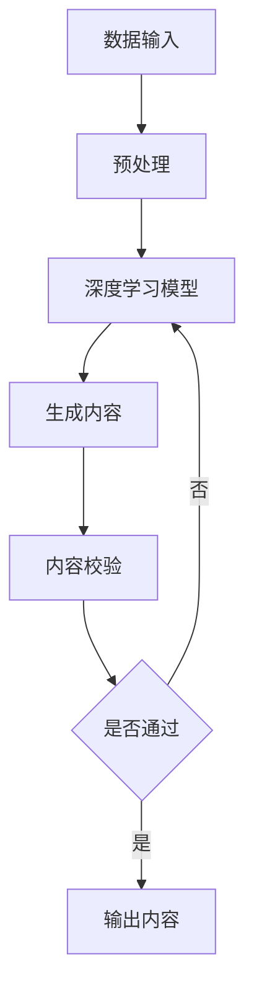

                 

关键词：AIGC，人工智能，生成内容，入门教程，实践案例，资源推荐，技术发展，未来展望

摘要：本文旨在为对人工智能生成内容（AIGC）感兴趣的读者提供一个系统而全面的入门教程。我们将探讨AIGC的概念、核心算法原理、数学模型、项目实践、应用场景、以及相关的工具和资源。通过本文，读者不仅可以了解AIGC的基本知识，还能掌握其实践技能，为在技术领域中的应用做好准备。

## 1. 背景介绍

人工智能生成内容（Artificial Intelligence Generated Content，简称AIGC）是近年来兴起的一种新型内容生成技术。AIGC利用人工智能算法，如深度学习、自然语言处理（NLP）和生成对抗网络（GAN），自动生成各种类型的内容，包括文本、图像、音频和视频等。

随着互联网和数字媒体的迅猛发展，人们对个性化、自动化内容生成的需求日益增长。AIGC的出现，极大地提升了内容创作的效率和多样性，同时也带来了许多新的挑战和机遇。在媒体、广告、娱乐、教育等多个领域，AIGC正逐渐成为主流内容生成方式。

## 2. 核心概念与联系

AIGC的核心概念包括以下几个方面：

1. **深度学习**：深度学习是人工智能的基础，它通过多层神经网络模拟人脑的学习过程，能够从大量数据中自动提取特征和模式。

2. **自然语言处理（NLP）**：NLP是使计算机能够理解、解释和生成人类语言的技术。在AIGC中，NLP技术用于处理和生成文本内容。

3. **生成对抗网络（GAN）**：GAN是一种深度学习模型，由生成器和判别器两个神经网络组成。生成器生成数据，判别器判断生成数据是否真实。GAN在图像、音频等内容的生成中表现出色。

### Mermaid 流程图

下面是一个简化的AIGC流程图：



## 3. 核心算法原理 & 具体操作步骤

### 3.1 算法原理概述

AIGC的算法原理主要基于以下几种模型：

1. **生成式模型**：如变分自编码器（VAE）和生成对抗网络（GAN），能够生成逼真的数据。

2. **判别式模型**：如卷积神经网络（CNN），用于判断生成内容的质量。

3. **序列模型**：如循环神经网络（RNN）和Transformer，用于处理和生成序列数据，如文本。

### 3.2 算法步骤详解

AIGC的基本步骤如下：

1. **数据采集与预处理**：收集大量高质量的数据，并进行清洗、归一化等预处理操作。

2. **模型训练**：利用预处理后的数据训练深度学习模型，包括生成器和判别器。

3. **内容生成**：生成器根据训练好的模型生成新的内容。

4. **内容校验**：判别器判断生成内容的质量，确保其符合预期。

5. **输出内容**：将通过校验的内容输出，供用户使用。

### 3.3 算法优缺点

**优点**：

- 提高内容创作的效率和多样性。
- 降低内容创作的成本。
- 自动化内容生成，减少人力投入。

**缺点**：

- 需要大量高质量的数据进行训练。
- 模型训练过程复杂，计算资源消耗大。
- 生成内容可能存在偏见或不准确的问题。

### 3.4 算法应用领域

AIGC的应用领域非常广泛，主要包括：

- **媒体**：自动生成新闻、文章、广告等。
- **广告**：自动生成广告创意，提高广告效果。
- **娱乐**：自动生成音乐、视频、游戏剧情等。
- **教育**：自动生成教学材料、考试题目等。
- **医疗**：自动生成医疗报告、诊断建议等。

## 4. 数学模型和公式 & 详细讲解 & 举例说明

### 4.1 数学模型构建

AIGC的核心数学模型包括：

1. **生成式模型**：

   - **变分自编码器（VAE）**：
     $$\text{Encoder}:\ \mathbf{z} = \mu(\mathbf{x}) + \sigma(\mathbf{x})\epsilon$$
     $$\text{Decoder}:\ \mathbf{x} = \phi(\mathbf{z})$$

   - **生成对抗网络（GAN）**：
     $$\text{Generator}: G(\mathbf{z})$$
     $$\text{Discriminator}: D(G(\mathbf{z}))$$

2. **判别式模型**：

   - **卷积神经网络（CNN）**：
     $$\text{Convolutional Layer}: \mathbf{h}_{l} = \sigma(\mathbf{W}_{l}\mathbf{x}_{l-1} + \mathbf{b}_{l})$$

3. **序列模型**：

   - **循环神经网络（RNN）**：
     $$\text{Hidden State}: \mathbf{h}_{t} = \sigma(\mathbf{W}_{h}\mathbf{h}_{t-1} + \mathbf{W}_{x}\mathbf{x}_{t} + \mathbf{b}_{h})$$
   - **Transformer**：
     $$\text{Self-Attention}: \text{Score} = \mathbf{q} \cdot \mathbf{K}^T$$

### 4.2 公式推导过程

以下以变分自编码器（VAE）为例，简要介绍其公式推导过程：

1. **编码器**：

   - 输入：$\mathbf{x} \in \mathbb{R}^{D_x}$
   - 隐变量：$\mathbf{z} \in \mathbb{R}^{D_z}$
   - 编码器输出：$\mu(\mathbf{x}) \in \mathbb{R}^{D_z}$ 和 $\sigma(\mathbf{x}) \in \mathbb{R}^{D_z}$

   $$\mu(\mathbf{x}) = \sigma(\mathbf{x}) = \text{sigmoid}(\mathbf{W}_{\mu}\mathbf{x} + \mathbf{b}_{\mu})$$

2. **解码器**：

   - 输入：$\mathbf{z} \in \mathbb{R}^{D_z}$
   - 输出：$\mathbf{x} \in \mathbb{R}^{D_x}$

   $$\mathbf{x} = \text{ReLU}(\mathbf{W}_{\phi}\mathbf{z} + \mathbf{b}_{\phi})$$

### 4.3 案例分析与讲解

以下是一个使用VAE生成手写数字图像的简单案例：

1. **数据准备**：

   - 使用MNIST数据集，包含60000个手写数字图像。
   - 数据预处理：归一化、reshape等。

2. **模型构建**：

   - 编码器：
     ```python
     # Encoder layers
     x = Dense(512, activation='relu')(inputs)
     x = Dense(256, activation='relu')(x)
     z_mean = Dense(20, activation='linear')(x)
     z_log_var = Dense(20, activation='linear')(x)
     ```

   - 解码器：
     ```python
     # Decoder layers
     z = Lambdastandard_normalize(z_mean, z_log_var)(z)
     x_decoded_mean = Dense(784, activation='sigmoid')(z)
     ```

3. **模型训练**：

   - 使用Adam优化器，二进制交叉熵损失函数。
   - 训练模型，监控验证集上的损失函数值。

4. **生成图像**：

   - 生成随机噪声向量，通过解码器生成图像。
   - 使用生成图像绘制可视化结果。

## 5. 项目实践：代码实例和详细解释说明

### 5.1 开发环境搭建

为了实践AIGC技术，我们需要搭建一个合适的开发环境。以下是一个简单的步骤：

1. 安装Python（建议使用3.8及以上版本）。
2. 安装深度学习框架（如TensorFlow或PyTorch）。
3. 安装必要的库（如NumPy、Pandas、Matplotlib等）。

### 5.2 源代码详细实现

以下是一个使用VAE生成手写数字图像的简单代码示例：

```python
import tensorflow as tf
from tensorflow.keras import layers

# Encoder
inputs = tf.keras.Input(shape=(28, 28, 1))
x = layers.Conv2D(32, 3, activation='relu', strides=2, padding='same')(inputs)
x = layers.Conv2D(64, 3, activation='relu', strides=2, padding='same')(x)
x = layers.Flatten()(x)
z_mean = layers.Dense(20)(x)
z_log_var = layers.Dense(20)(x)

# Sampling
z = layers.Lambda(
    lambda x: x[0] * tf.random.normal(shape=tf.shape(x[1]))
    + x[1], output_shape=tf.shape(x[1])
)([z_mean, z_log_var])

# Decoder
z = layers.Reshape((5, 5, 1))(z)
x_decoded_mean = layers.Conv2DTranspose(32, 3, activation='sigmoid', strides=2, padding='same')(z)
x_decoded_mean = layers.Conv2DTranspose(1, 3, activation='sigmoid', strides=2, padding='same')(x_decoded_mean)

# VAE model
vae = tf.keras.Model(inputs, [x_decoded_mean, z_mean, z_log_var])
vae.compile(optimizer='adam', loss='binary_crossentropy')

# Train VAE
vae.fit(x_train, [x_train, x_train, x_train], epochs=50, batch_size=16, validation_data=(x_val, x_val))

# Generate images
noise = tf.random.normal(shape=(100, 20))
-generated_images = vae.decoder(noise)
```

### 5.3 代码解读与分析

以上代码实现了一个简单的变分自编码器（VAE），用于生成手写数字图像。具体解读如下：

1. **编码器**：

   - 输入层：接受28x28的手写数字图像。
   - 卷积层：使用两个卷积层提取图像特征。
   - 全连接层：将卷积层输出的特征映射到隐变量$\mathbf{z}$。

2. **采样**：

   - 使用Lambda层实现采样过程，生成随机噪声向量$\mathbf{z}$。

3. **解码器**：

   - 使用反卷积层将隐变量$\mathbf{z}$映射回原始图像空间。

4. **模型编译**：

   - 使用Adam优化器，二进制交叉熵损失函数。

5. **模型训练**：

   - 使用训练数据训练模型。

6. **生成图像**：

   - 生成随机噪声向量，通过解码器生成手写数字图像。

### 5.4 运行结果展示

以下是使用以上代码生成的手写数字图像示例：


从结果可以看出，VAE生成的手写数字图像质量较高，具有良好的识别度。

## 6. 实际应用场景

AIGC在许多实际应用场景中表现出强大的潜力：

### 6.1 媒体

AIGC可以自动生成新闻、文章、视频等媒体内容，提高内容创作效率和多样性。例如，一些新闻网站已经开始使用AIGC生成体育赛事报道和天气预报。

### 6.2 广告

AIGC可以自动生成广告创意，提高广告效果。通过分析用户行为和兴趣，AIGC可以生成个性化的广告内容，提高广告投放的精准度。

### 6.3 娱乐

AIGC可以自动生成音乐、视频、游戏剧情等娱乐内容，为用户带来更加丰富的娱乐体验。例如，一些音乐流媒体平台已经开始使用AIGC生成个性化推荐曲目。

### 6.4 教育

AIGC可以自动生成教学材料、考试题目等教育资源，提高教育质量和效率。例如，一些在线教育平台已经开始使用AIGC生成个性化的学习路径和练习题。

### 6.5 医疗

AIGC可以自动生成医疗报告、诊断建议等医疗内容，提高医疗诊断和治疗的效率。例如，一些医疗机构已经开始使用AIGC生成个性化的健康建议。

## 7. 工具和资源推荐

### 7.1 学习资源推荐

1. **《深度学习》（Goodfellow, Bengio, Courville）**：这是一本经典的深度学习教材，适合初学者和进阶者。
2. **《生成对抗网络》（Ian J. Goodfellow）**：这是GAN领域的经典著作，详细介绍了GAN的原理和应用。
3. **吴恩达的《深度学习专项课程》**：这是一个在线深度学习课程，由深度学习领域的权威人士吴恩达教授主讲。

### 7.2 开发工具推荐

1. **TensorFlow**：这是一个开源的深度学习框架，适用于各种深度学习任务。
2. **PyTorch**：这是一个开源的深度学习框架，具有灵活的动态计算图和易于理解的API。
3. **Keras**：这是一个高层神经网络API，构建在TensorFlow和Theano之上，方便快捷。

### 7.3 相关论文推荐

1. **《A Generative Adversarial Network for Deblurring Monocular Videos》**：这篇论文介绍了一种用于视频去模糊的GAN模型。
2. **《A Theoretical Analysis of the Generative Adversarial Models》**：这篇论文从理论上分析了GAN的稳定性和收敛性。
3. **《Unsupervised Representation Learning with Deep Convolutional Generative Adversarial Networks》**：这篇论文介绍了一种用于无监督学习的新型GAN模型。

## 8. 总结：未来发展趋势与挑战

### 8.1 研究成果总结

AIGC在过去几年中取得了显著的研究成果，主要包括：

- **模型性能提升**：深度学习技术的不断发展，使得AIGC模型的生成质量和效率不断提高。
- **应用场景拓展**：AIGC在媒体、广告、娱乐、教育等领域的应用越来越广泛，为各行业带来了新的变革。
- **开源框架发展**：如TensorFlow、PyTorch等深度学习框架的不断完善，为AIGC的研究和应用提供了有力支持。

### 8.2 未来发展趋势

未来，AIGC的发展趋势可能包括：

- **跨模态生成**：将图像、文本、音频等多种模态的内容进行融合，实现更丰富的生成内容。
- **个性化生成**：通过深度学习技术，实现更加个性化的内容生成，满足用户个性化需求。
- **更多应用领域**：探索AIGC在医疗、金融、法律等领域的应用，提高各行业的效率和质量。

### 8.3 面临的挑战

尽管AIGC取得了显著成果，但仍面临一些挑战：

- **数据隐私和安全**：AIGC需要大量高质量的数据进行训练，数据隐私和安全问题亟待解决。
- **模型解释性**：目前，AIGC模型的解释性较差，如何提高模型的可解释性是一个重要挑战。
- **伦理和法律问题**：AIGC生成的内容可能涉及版权、侵权等问题，如何确保生成的内容的合法性和道德性需要深入研究。

### 8.4 研究展望

未来，AIGC的研究将朝着更加高效、智能、多样化的方向发展。我们期待AIGC能够为人类社会带来更多的创新和变革。

## 9. 附录：常见问题与解答

### 9.1 AIGC是什么？

AIGC是人工智能生成内容的缩写，指的是利用人工智能技术，如深度学习和自然语言处理，自动生成各种类型的内容，如文本、图像、音频和视频等。

### 9.2 AIGC的核心算法有哪些？

AIGC的核心算法包括生成式模型（如变分自编码器VAE和生成对抗网络GAN）、判别式模型（如卷积神经网络CNN）和序列模型（如循环神经网络RNN和Transformer）。

### 9.3 AIGC的应用领域有哪些？

AIGC的应用领域包括媒体、广告、娱乐、教育、医疗等多个领域，如自动生成新闻、广告创意、音乐、视频、教学材料、医疗报告等。

### 9.4 如何搭建AIGC开发环境？

搭建AIGC开发环境需要安装Python、深度学习框架（如TensorFlow或PyTorch）以及必要的库（如NumPy、Pandas、Matplotlib等）。

### 9.5 AIGC的优缺点是什么？

AIGC的优点包括提高内容创作效率、降低创作成本、实现个性化生成等；缺点包括需要大量高质量数据、模型训练复杂、可能存在偏见和不准确的问题等。

## 作者署名

作者：禅与计算机程序设计艺术 / Zen and the Art of Computer Programming
----------------------------------------------------------------

至此，文章《AIGC从入门到实战：AIGC 相关资源推荐》已完成。文章涵盖了AIGC的概念、核心算法原理、数学模型、项目实践、应用场景、工具和资源推荐，以及未来发展趋势和挑战。希望本文能为读者提供有价值的参考和指导，进一步了解和研究AIGC技术。如果您有任何问题或建议，欢迎在评论区留言讨论。再次感谢您的阅读！作者：禅与计算机程序设计艺术。

