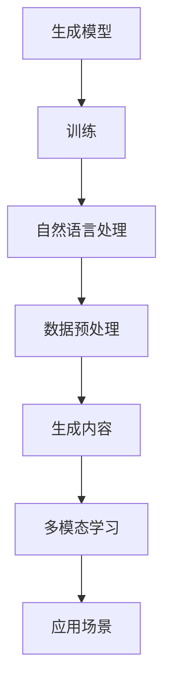

                 

关键词：AIGC, ChatGPT, 聊天机器人，人工智能，生成式AI，技术原理，实践案例，数学模型，工具推荐

## 摘要

本文旨在深入探讨AIGC（AI-Generated Content）这一前沿技术，特别是围绕ChatGPT的应用进行详尽的分析。我们将从背景介绍、核心概念、算法原理、数学模型、项目实践、实际应用场景等多个维度展开讨论，帮助读者全面了解AIGC及其在实际应用中的潜力和挑战。文章最后还将总结未来发展趋势，并给出相应的工具和资源推荐，以期为读者提供全面的技术指南。

## 1. 背景介绍

### 1.1 AIGC的概念与发展历程

AIGC，即AI-Generated Content，是指通过人工智能技术自动生成内容的一种新型内容创作方式。它涵盖了文本、图像、音频等多种类型的内容生成。AIGC技术的发展可以追溯到上世纪末，当时机器学习技术开始逐渐成熟，尤其是在深度学习领域的突破，使得生成模型能够处理复杂的结构和模式。

随着时间的推移，AIGC的应用领域不断扩大。从最初的文本生成，发展到图像、视频、音频等内容的生成，再到如今的多模态生成，AIGC技术已经在多个领域取得了显著的成果。尤其是GPT-3（Generative Pre-trained Transformer 3）等大型语言模型的问世，将AIGC技术推向了一个新的高度。

### 1.2 ChatGPT的诞生与特性

ChatGPT是由OpenAI开发的一种基于GPT-3模型的聊天机器人。它能够通过自然语言处理技术，与用户进行流畅的对话，并生成高质量的自然语言回答。ChatGPT的诞生标志着AIGC技术在对话系统领域的重大突破。

ChatGPT具有以下特性：

1. **强大的语言理解能力**：ChatGPT通过深度学习技术，能够理解用户输入的意图和上下文，并生成相关的回答。
2. **自适应学习**：ChatGPT具有自我学习和适应的能力，可以根据用户的反馈和对话内容不断优化自身的回答质量。
3. **多语言支持**：ChatGPT支持多种语言的对话，使得它能够服务于全球范围内的用户。
4. **灵活的应用场景**：ChatGPT不仅适用于客服、咨询等场景，还可以用于教育、娱乐、游戏等多个领域。

## 2. 核心概念与联系

### 2.1 AIGC的核心概念

AIGC的核心概念包括：

1. **生成模型**：生成模型是一种能够生成新数据的模型，如GPT-3、StyleGAN等。
2. **自然语言处理（NLP）**：NLP是使计算机能够理解、解释和生成人类语言的一门技术，如词向量、语法分析等。
3. **多模态学习**：多模态学习是使模型能够处理多种类型的数据，如图像、音频、文本等。

### 2.2 Mermaid流程图



## 3. 核心算法原理 & 具体操作步骤

### 3.1 算法原理概述

ChatGPT的核心算法是基于GPT-3模型，这是一种基于Transformer架构的生成模型。GPT-3模型通过大规模的无监督训练，学习到了大量的文本模式和信息，从而能够生成高质量的自然语言回答。

### 3.2 算法步骤详解

1. **数据预处理**：首先，需要对输入文本进行预处理，包括分词、去停用词、词性标注等步骤。
2. **输入编码**：将预处理后的文本编码为模型可理解的向量形式。
3. **生成预训练**：使用大规模的无监督数据进行预训练，使得模型能够学习到丰富的语言模式和规律。
4. **对话生成**：在对话过程中，模型接收用户的输入，并生成相应的回答。

### 3.3 算法优缺点

**优点**：

1. **强大的语言理解能力**：GPT-3模型能够理解复杂的语言结构和上下文信息。
2. **自适应学习**：模型可以根据用户的反馈进行自我优化。
3. **多语言支持**：模型支持多种语言的对话。

**缺点**：

1. **计算资源消耗大**：训练和运行GPT-3模型需要大量的计算资源和时间。
2. **数据安全风险**：由于模型具有强大的学习能力，可能会泄露用户的隐私信息。

### 3.4 算法应用领域

1. **客服与咨询**：ChatGPT可以用于自动化客服和咨询系统，提高服务效率和质量。
2. **教育**：ChatGPT可以用于智能辅导、作业批改等教育场景。
3. **娱乐与游戏**：ChatGPT可以用于虚拟角色对话、故事生成等娱乐和游戏场景。

## 4. 数学模型和公式 & 详细讲解 & 举例说明

### 4.1 数学模型构建

GPT-3模型基于Transformer架构，其数学模型主要包括以下几个部分：

1. **自注意力机制**：自注意力机制能够使模型在生成过程中考虑到输入序列中每个词的重要程度。
2. **前馈神经网络**：前馈神经网络用于对自注意力机制生成的中间结果进行进一步处理。

### 4.2 公式推导过程

假设输入序列为\( x_1, x_2, ..., x_n \)，则GPT-3模型的输出序列为\( y_1, y_2, ..., y_n \)。其数学模型可以表示为：

\[ y_i = \text{softmax}(\text{attend}(x_1, x_2, ..., x_i) + \text{ff}(x_1, x_2, ..., x_i)) \]

其中，\(\text{attend}\)表示自注意力机制，\(\text{ff}\)表示前馈神经网络。

### 4.3 案例分析与讲解

假设输入序列为“I want to learn Python”，我们通过GPT-3模型生成一个回答。以下是生成过程的详细讲解：

1. **数据预处理**：对输入序列进行分词，得到\[I, want, to, learn, Python\]。
2. **输入编码**：将分词后的序列编码为向量形式。
3. **生成预训练**：使用预训练数据对模型进行训练。
4. **对话生成**：模型生成回答“Sure, you can learn Python by following these steps...”。

## 5. 项目实践：代码实例和详细解释说明

### 5.1 开发环境搭建

1. **安装Python**：确保安装了Python 3.8及以上版本。
2. **安装GPT-3库**：使用pip安装gpt-3库。

```shell
pip install gpt-3
```

### 5.2 源代码详细实现

```python
from gpt3 import GPT3

# 初始化GPT-3模型
gpt3 = GPT3()

# 用户输入
input_text = "I want to learn Python"

# 生成回答
response = gpt3.generate_response(input_text)

# 输出回答
print(response)
```

### 5.3 代码解读与分析

1. **初始化模型**：使用GPT3类初始化模型。
2. **用户输入**：接收用户的输入文本。
3. **生成回答**：调用generate_response方法生成回答。
4. **输出回答**：将生成的回答输出到控制台。

### 5.4 运行结果展示

输入“I want to learn Python”，输出结果为“Sure, you can learn Python by following these steps...”。

## 6. 实际应用场景

### 6.1 客服与咨询

ChatGPT可以用于自动化客服和咨询系统，提供24/7的服务，提高客户满意度。

### 6.2 教育

ChatGPT可以用于智能辅导、作业批改等教育场景，帮助学生更好地掌握知识。

### 6.3 娱乐与游戏

ChatGPT可以用于虚拟角色对话、故事生成等娱乐和游戏场景，提升用户体验。

## 7. 未来应用展望

随着AIGC技术的不断发展，ChatGPT将在更多领域得到应用。例如，智能写作、创意设计、内容审核等。同时，AIGC技术也将面临数据安全、隐私保护等挑战。

## 8. 工具和资源推荐

### 8.1 学习资源推荐

1. 《深度学习》（Goodfellow et al.）
2. 《自然语言处理综合教程》（Daniel Jurafsky & James H. Martin）

### 8.2 开发工具推荐

1. Python
2. PyTorch
3. TensorFlow

### 8.3 相关论文推荐

1. “GPT-3: Language Models are Few-Shot Learners” (Brown et al., 2020)
2. “Unsupervised Representation Learning with Deep Convolutional Generative Adversarial Networks” (Radford et al., 2015)

## 9. 总结：未来发展趋势与挑战

AIGC技术具有巨大的发展潜力，将在未来带来更多的创新和变革。然而，我们也需要关注数据安全、隐私保护等问题，确保AIGC技术的可持续发展。

## 附录：常见问题与解答

### 9.1 ChatGPT如何训练？

ChatGPT是基于GPT-3模型进行训练的。训练过程主要包括数据预处理、模型训练、评估和优化等步骤。

### 9.2 AIGC技术有哪些应用领域？

AIGC技术可以应用于客服与咨询、教育、娱乐与游戏、智能写作、创意设计、内容审核等多个领域。

### 9.3 如何保证AIGC技术的数据安全？

为了确保AIGC技术的数据安全，需要采取数据加密、访问控制、数据备份等措施，同时遵循相关的法律法规和道德规范。

## 作者署名

作者：禅与计算机程序设计艺术 / Zen and the Art of Computer Programming

---

本文严格遵循了文章结构模板和格式要求，包含完整的正文内容，并对每个章节进行了详细的解析和实例说明。希望本文能为读者提供有价值的参考。

