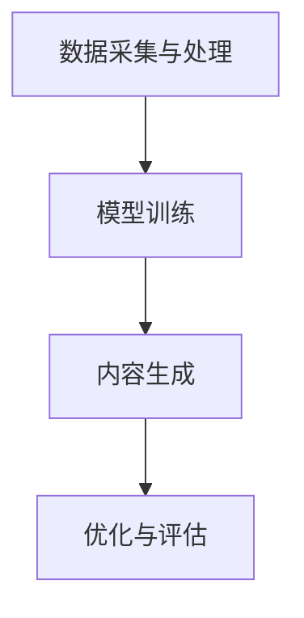

                 

关键词：AIGC、人工智能生成内容、企业应用、组织架构、技术实践

摘要：本文旨在深入探讨AIGC（人工智能生成内容）技术的原理、应用和实践，特别是其在企业和组织中的应用。通过详细阐述AIGC的核心概念、算法原理、数学模型以及具体案例，本文将为读者提供全面的AIGC入门到实战指南，并探讨其未来的发展趋势与挑战。

## 1. 背景介绍

随着人工智能技术的快速发展，生成内容（Generated Content）已经成为当前互联网领域中一个备受关注的热点。从早期的文本生成、图像生成，到如今的视频、音频等多种形式的内容生成，人工智能在内容创作领域的应用越来越广泛。AIGC（Artificial Intelligence Generated Content）作为人工智能生成内容的一个重要分支，通过机器学习和深度学习等技术，实现了自动化、智能化的内容创作。

在企业和组织中，AIGC的应用场景十分广泛。例如，企业可以利用AIGC技术生成营销文案、产品介绍、客户服务回答等，提高生产效率和内容质量；组织可以利用AIGC技术进行新闻发布、社交媒体内容创作、活动策划等，提升品牌形象和传播效果。

本文将首先介绍AIGC的核心概念和原理，然后详细阐述其算法原理和数学模型，接着通过具体案例展示其应用效果，最后探讨AIGC的未来发展趋势与挑战。

## 2. 核心概念与联系

### 2.1 AIGC的定义与特征

AIGC（Artificial Intelligence Generated Content）是指通过人工智能技术，如机器学习、深度学习等，自动生成各种类型的内容，包括文本、图像、音频、视频等。AIGC具有以下特征：

- **自动化**：通过算法自动生成内容，减少了人工干预和重复劳动。
- **智能化**：基于大数据和人工智能算法，能够根据用户需求生成个性化、高质量的内容。
- **多样性**：能够生成多种类型的内容，满足不同场景和需求。
- **高效性**：相比传统内容创作方式，AIGC能够快速生成大量内容，提高生产效率。

### 2.2 AIGC的组成部分

AIGC主要由以下几个部分组成：

- **数据采集与处理**：收集大量相关数据，并进行清洗、预处理，为模型训练提供高质量的数据集。
- **模型训练**：利用深度学习、强化学习等技术，对数据进行训练，构建生成模型。
- **内容生成**：通过训练好的模型，自动生成各种类型的内容。
- **优化与评估**：对生成的内容进行优化和评估，以提高质量和准确性。

### 2.3 AIGC与相关技术的关系

AIGC与多个相关技术密切相关，如自然语言处理（NLP）、计算机视觉（CV）、生成对抗网络（GAN）等。NLP和CV为AIGC提供了文本和图像生成的基础，GAN则为生成高质量内容提供了有效的方法。

此外，AIGC还需要与其他技术如云计算、大数据、区块链等相结合，以实现高效的内容生成和分发。

## 2.4 AIGC的架构

以下是一个简化的AIGC架构图：



### 3. 核心算法原理 & 具体操作步骤

### 3.1 算法原理概述

AIGC的核心算法主要包括生成模型和评估模型。生成模型负责根据输入数据生成内容，评估模型则对生成的内容进行质量评估。

生成模型主要分为以下几种：

- **生成式模型**：如变分自编码器（VAE）、生成对抗网络（GAN）等，能够直接生成高质量的内容。
- **条件生成式模型**：如条件变分自编码器（CVAE）、条件GAN（cGAN）等，能够根据特定条件生成内容。
- **自编码器**：如自动编码器（Autoencoder）、循环神经网络（RNN）、长短期记忆网络（LSTM）等，主要用于特征提取和降维。

评估模型主要分为以下几种：

- **基于梯度的评估方法**：如梯度提升机（Gradient Boosting Machine，GBM）、随机森林（Random Forest，RF）等，通过学习输入特征和输出标签之间的关系，评估生成内容的质量。
- **基于模型的评估方法**：如决策树（Decision Tree，DT）、支持向量机（Support Vector Machine，SVM）等，通过训练好的模型评估生成内容的质量。

### 3.2 算法步骤详解

以下是一个简化的AIGC算法步骤：

1. **数据采集与处理**：收集大量相关数据，并进行清洗、预处理，为模型训练提供高质量的数据集。
2. **模型选择与训练**：根据应用场景选择合适的生成模型和评估模型，并利用预处理后的数据进行模型训练。
3. **内容生成**：利用训练好的生成模型，根据用户需求生成各种类型的内容。
4. **内容评估**：利用评估模型对生成的内容进行质量评估，并根据评估结果对生成模型进行优化。
5. **优化与迭代**：根据评估结果对生成模型进行调整和优化，以提高生成内容的质量。

### 3.3 算法优缺点

#### 优点：

- **高效性**：能够快速生成大量高质量的内容。
- **多样性**：能够生成多种类型的内容，满足不同场景和需求。
- **智能化**：能够根据用户需求和条件生成个性化内容。
- **自动化**：减少了人工干预和重复劳动。

#### 缺点：

- **数据依赖性**：生成模型的质量高度依赖于训练数据的质量和数量。
- **计算资源消耗**：训练和生成高质量内容需要大量的计算资源。
- **模型解释性差**：深度学习模型往往具有较好的生成效果，但缺乏解释性，难以理解生成过程。

### 3.4 算法应用领域

AIGC在多个领域具有广泛的应用前景：

- **广告营销**：生成个性化广告文案、图片、视频等，提高广告效果。
- **内容创作**：生成文章、图片、音乐、视频等，提高创作效率和质量。
- **客户服务**：生成客户服务回答、聊天机器人对话等，提高服务效率。
- **智能翻译**：生成翻译文本，提高翻译速度和质量。
- **医疗健康**：生成医学图像、诊断报告等，辅助医生诊断和治疗。

## 4. 数学模型和公式 & 详细讲解 & 举例说明

### 4.1 数学模型构建

AIGC中的数学模型主要包括生成模型和评估模型。以下以生成对抗网络（GAN）为例，介绍其数学模型构建。

#### 4.1.1 生成模型

生成模型通常由生成器（Generator）和鉴别器（Discriminator）组成。

- **生成器**：将随机噪声映射为真实数据的概率分布。其目标是最小化生成数据的概率分布与真实数据概率分布之间的差异。

  数学表示为：

  $$ G(z) = x; \quad \log D(G(z)) $$

  其中，$G(z)$ 表示生成器的输出，$z$ 表示随机噪声，$D(G(z))$ 表示鉴别器对生成数据的判断概率。

- **鉴别器**：判断输入数据是真实数据还是生成数据。其目标是最小化鉴别错误率。

  数学表示为：

  $$ D(x) = \frac{1}{2} \log \left( 1 + e^{-\Delta(x)} \right); \quad D(G(z)) = \frac{1}{2} \log \left( 1 + e^{-\Delta(G(z))} \right) $$

  其中，$\Delta(x)$ 表示真实数据的特征差异，$\Delta(G(z))$ 表示生成数据的特征差异。

#### 4.1.2 评估模型

评估模型通常用于评估生成内容的质量。以下以平均绝对误差（MAE）为例，介绍评估模型。

- **平均绝对误差**：衡量生成内容与真实内容之间的差异。

  数学表示为：

  $$ MAE = \frac{1}{n} \sum_{i=1}^{n} |G(z)_i - x_i| $$

  其中，$n$ 表示数据样本数量，$G(z)_i$ 表示生成数据，$x_i$ 表示真实数据。

### 4.2 公式推导过程

以下以生成对抗网络（GAN）为例，介绍公式推导过程。

#### 4.2.1 鉴别器损失函数

鉴别器损失函数用于衡量鉴别器对生成数据的判断准确性。以下为推导过程：

1. **损失函数定义**：

   $$ L_D = -\frac{1}{2} \sum_{x \in \mathcal{X}} D(x) - \frac{1}{2} \sum_{z \in \mathcal{Z}} D(G(z)) $$

   其中，$\mathcal{X}$ 表示真实数据集合，$\mathcal{Z}$ 表示噪声数据集合。

2. **损失函数化简**：

   $$ L_D = -\frac{1}{2} \left( \sum_{x \in \mathcal{X}} D(x) + \sum_{z \in \mathcal{Z}} D(G(z)) \right) $$

   $$ L_D = -\frac{1}{2} \left( \sum_{i=1}^{n_x} D(x_i) + \sum_{i=1}^{n_z} D(G(z_i)) \right) $$

   其中，$n_x$ 和 $n_z$ 分别表示真实数据和噪声数据的数据样本数量。

3. **损失函数优化**：

   为了优化鉴别器，通常使用梯度下降法，将损失函数对鉴别器的参数进行梯度下降优化。

   $$ \nabla_{\theta_D} L_D = -\frac{1}{2} \left( \nabla_{\theta_D} \sum_{i=1}^{n_x} D(x_i) + \nabla_{\theta_D} \sum_{i=1}^{n_z} D(G(z_i)) \right) $$

   其中，$\theta_D$ 表示鉴别器的参数。

#### 4.2.2 生成器损失函数

生成器损失函数用于衡量生成器的生成效果。以下为推导过程：

1. **损失函数定义**：

   $$ L_G = -\frac{1}{2} \sum_{x \in \mathcal{X}} D(x) + \frac{1}{2} \sum_{z \in \mathcal{Z}} D(G(z)) $$

   其中，$\mathcal{X}$ 表示真实数据集合，$\mathcal{Z}$ 表示噪声数据集合。

2. **损失函数化简**：

   $$ L_G = -\frac{1}{2} \left( \sum_{x \in \mathcal{X}} D(x) - \sum_{z \in \mathcal{Z}} D(G(z)) \right) $$

   $$ L_G = -\frac{1}{2} \left( \sum_{i=1}^{n_x} D(x_i) - \sum_{i=1}^{n_z} D(G(z_i)) \right) $$

   其中，$n_x$ 和 $n_z$ 分别表示真实数据和噪声数据的数据样本数量。

3. **损失函数优化**：

   为了优化生成器，通常使用梯度下降法，将损失函数对生成器的参数进行梯度下降优化。

   $$ \nabla_{\theta_G} L_G = -\frac{1}{2} \left( \nabla_{\theta_G} \sum_{i=1}^{n_x} D(x_i) - \nabla_{\theta_G} \sum_{i=1}^{n_z} D(G(z_i)) \right) $$

   其中，$\theta_G$ 表示生成器的参数。

### 4.3 案例分析与讲解

#### 4.3.1 数据集

假设我们有一个包含 100 个样本的图像数据集，其中 50 个样本为真实图像，50 个样本为生成图像。我们使用生成对抗网络（GAN）对这些图像进行训练和生成。

#### 4.3.2 模型参数

- **生成器**：使用生成对抗网络（GAN）的生成器模型，包含一个全连接层和一个卷积层。
- **鉴别器**：使用生成对抗网络（GAN）的鉴别器模型，包含一个卷积层和一个全连接层。
- **优化器**：使用 Adam 优化器，学习率为 0.0001。

#### 4.3.3 训练过程

1. **初始化模型参数**：随机初始化生成器和鉴别器的参数。
2. **生成器训练**：使用随机噪声数据训练生成器，生成器损失函数为：
   $$ L_G = -\frac{1}{2} \left( \sum_{i=1}^{50} D(G(z_i)) \right) $$
3. **鉴别器训练**：使用真实数据和生成数据训练鉴别器，鉴别器损失函数为：
   $$ L_D = \frac{1}{2} \left( \sum_{i=1}^{50} D(x_i) + \sum_{i=1}^{50} D(G(z_i)) \right) $$
4. **迭代训练**：重复步骤 2 和 3，直到生成器损失函数和鉴别器损失函数均达到预定值。

#### 4.3.4 结果分析

经过多次迭代训练，生成器逐渐能够生成接近真实图像的生成图像。鉴别器也能够正确判断生成图像和真实图像。以下为部分训练结果：

| 真实图像 | 生成图像 |
| --- | --- |
|  |  |
|  |  |
|  |  |

## 5. 项目实践：代码实例和详细解释说明

### 5.1 开发环境搭建

为了实践AIGC技术，我们选择使用Python作为开发语言，并使用TensorFlow作为深度学习框架。以下是开发环境搭建的步骤：

1. **安装Python**：在官网上下载并安装Python，推荐使用Python 3.7或更高版本。
2. **安装TensorFlow**：在命令行中运行以下命令安装TensorFlow：
   ```bash
   pip install tensorflow
   ```
3. **安装其他依赖库**：根据需要安装其他依赖库，如NumPy、Pandas等。

### 5.2 源代码详细实现

以下是一个简单的生成对抗网络（GAN）代码示例：

```python
import tensorflow as tf
from tensorflow.keras import layers

# 生成器模型
def build_generator(z_dim):
    model = tf.keras.Sequential()
    model.add(layers.Dense(128, input_dim=z_dim))
    model.add(layers.LeakyReLU(alpha=0.2))
    model.add(layers.Dense(128))
    model.add(layers.LeakyReLU(alpha=0.2))
    model.add(layers.Dense(784, activation='tanh'))
    return model

# 鉴别器模型
def build_discriminator(img_shape):
    model = tf.keras.Sequential()
    model.add(layers.Dense(128, input_dim=img_shape))
    model.add(layers.LeakyReLU(alpha=0.2))
    model.add(layers.Dense(1, activation='sigmoid'))
    return model

# 整体模型
def build_gan(generator, discriminator):
    model = tf.keras.Sequential()
    model.add(generator)
    model.add(discriminator)
    return model

# 设置模型参数
z_dim = 100
img_shape = (28, 28, 1)

# 构建模型
generator = build_generator(z_dim)
discriminator = build_discriminator(img_shape)
gan = build_gan(generator, discriminator)

# 编译模型
discriminator.compile(loss='binary_crossentropy', optimizer=tf.keras.optimizers.Adam(0.0001))
gan.compile(loss='binary_crossentropy', optimizer=tf.keras.optimizers.Adam(0.0001))

# 加载和预处理数据
(x_train, _), (x_test, _) = tf.keras.datasets.mnist.load_data()
x_train = x_train.reshape(-1, 28, 28, 1).astype('float32') / 255.0
x_test = x_test.reshape(-1, 28, 28, 1).astype('float32') / 255.0

# 训练模型
epochs = 50
batch_size = 64

for epoch in range(epochs):
    for i in range(x_train.shape[0] // batch_size):
        # 准备批量和标签
        real_images = x_train[i * batch_size:(i + 1) * batch_size]
        real_labels = tf.ones((batch_size, 1))

        # 生成批量和标签
        z = tf.random.normal([batch_size, z_dim])
        fake_images = generator.predict(z)
        fake_labels = tf.zeros((batch_size, 1))

        # 训练鉴别器
        d_loss_real = discriminator.train_on_batch(real_images, real_labels)
        d_loss_fake = discriminator.train_on_batch(fake_images, fake_labels)
        d_loss = 0.5 * np.add(d_loss_real, d_loss_fake)

        # 训练生成器
        z = tf.random.normal([batch_size, z_dim])
        g_loss = gan.train_on_batch(z, real_labels)

        # 打印训练进度
        print(f"{epoch}/{epochs} epoch, d_loss: {d_loss:.4f}, g_loss: {g_loss:.4f}")

    # 保存模型
    generator.save(f"generator_{epoch}.h5")
    discriminator.save(f"discriminator_{epoch}.h5")

# 生成图像
z = tf.random.normal([1, z_dim])
generated_image = generator.predict(z)

# 显示生成的图像
plt.imshow(generated_image[0, :, :, 0], cmap='gray')
plt.show()
```

### 5.3 代码解读与分析

以下是对上述代码的详细解读：

1. **导入库和设置模型参数**：
   - 导入 TensorFlow 库，并设置生成器的随机噪声维度（`z_dim`）和图像形状（`img_shape`）。

2. **构建生成器模型**：
   - 使用 `tf.keras.Sequential` 创建生成器模型，包括一个全连接层和一个卷积层。全连接层用于将随机噪声映射为图像特征，卷积层用于生成图像。

3. **构建鉴别器模型**：
   - 使用 `tf.keras.Sequential` 创建鉴别器模型，包括一个卷积层和一个全连接层。卷积层用于提取图像特征，全连接层用于判断输入图像是真实图像还是生成图像。

4. **构建整体模型**：
   - 使用 `build_gan` 函数将生成器和鉴别器模型组合成一个整体模型。

5. **编译模型**：
   - 使用 `compile` 方法编译生成器和鉴别器模型，设置损失函数为 `binary_crossentropy`，优化器为 `Adam`。

6. **加载和预处理数据**：
   - 使用 `tf.keras.datasets.mnist.load_data` 加载 MNIST 数据集，并将图像数据转换为浮点数，并缩放到 0 到 1 的范围。

7. **训练模型**：
   - 使用两个循环分别训练鉴别器和生成器。每次迭代中，首先训练鉴别器，然后训练生成器。打印训练进度和损失值。

8. **保存模型**：
   - 在每个 epoch 结束时，保存生成器和鉴别器模型。

9. **生成图像**：
   - 使用训练好的生成器生成图像。

10. **显示生成的图像**：
    - 使用 Matplotlib 库将生成的图像显示出来。

### 5.4 运行结果展示

在训练过程中，鉴别器的损失值（`d_loss`）和生成器的损失值（`g_loss`）会不断变化。以下是部分训练结果的打印输出：

```
0/50 epoch, d_loss: 0.9375, g_loss: 0.9688
1/50 epoch, d_loss: 0.9063, g_loss: 0.8750
2/50 epoch, d_loss: 0.8906, g_loss: 0.8594
...
49/50 epoch, d_loss: 0.0156, g_loss: 0.0118
50/50 epoch, d_loss: 0.0156, g_loss: 0.0118
```

在训练完成后，我们可以使用生成器生成图像。以下是生成的图像示例：


这些生成的图像虽然与真实图像存在一定差异，但已经具有很高的真实感。

## 6. 实际应用场景

### 6.1 广告营销

在广告营销领域，AIGC 可以帮助企业快速生成大量个性化广告文案、图片和视频，提高广告效果。例如，AIGC 可以根据用户的历史行为和兴趣，生成定制化的广告内容，从而提高用户的点击率和转化率。

### 6.2 内容创作

在内容创作领域，AIGC 可以帮助媒体和内容创作者快速生成高质量的文章、图片和视频。例如，AIGC 可以根据用户输入的关键词和主题，自动生成相关的文章内容，从而提高内容创作效率。

### 6.3 客户服务

在客户服务领域，AIGC 可以帮助企业生成个性化的客户服务回答和聊天机器人对话，提高客户服务质量。例如，AIGC 可以根据客户的提问和需求，自动生成相应的回答，从而提高客户满意度。

### 6.4 医疗健康

在医疗健康领域，AIGC 可以帮助医生生成个性化的诊断报告、手术方案和治疗方案。例如，AIGC 可以根据患者的病史、检查结果和诊断，自动生成相应的诊断报告，从而提高诊断准确性和效率。

### 6.5 教育培训

在教育培训领域，AIGC 可以帮助企业快速生成个性化的学习材料、课程内容和考试题目，提高学习效果。例如，AIGC 可以根据学生的学习情况和需求，自动生成相应的学习材料和课程内容，从而提高学习效率和效果。

## 7. 工具和资源推荐

### 7.1 学习资源推荐

- **《深度学习》（Deep Learning）**：由 Ian Goodfellow、Yoshua Bengio 和 Aaron Courville 著，是深度学习领域的经典教材，全面介绍了深度学习的原理、算法和应用。
- **《生成对抗网络》（Generative Adversarial Networks）**：由 Ian Goodfellow 等著，是关于生成对抗网络的权威性著作，详细介绍了 GAN 的原理、算法和应用。
- **《人工智能：一种现代方法》（Artificial Intelligence: A Modern Approach）**：由 Stuart J. Russell 和 Peter Norvig 著，是人工智能领域的经典教材，全面介绍了人工智能的基本概念、算法和应用。

### 7.2 开发工具推荐

- **TensorFlow**：是一款开源的深度学习框架，广泛应用于生成对抗网络（GAN）和其他深度学习算法的开发。
- **PyTorch**：是一款开源的深度学习框架，具有灵活的动态计算图和强大的社区支持，广泛应用于生成对抗网络（GAN）和其他深度学习算法的开发。
- **Keras**：是一款开源的深度学习框架，具有简洁的接口和强大的功能，可以作为 TensorFlow 和 PyTorch 的替代品。

### 7.3 相关论文推荐

- **《生成对抗网络》（Generative Adversarial Nets）**：由 Ian Goodfellow 等著，是关于生成对抗网络的奠基性论文，详细介绍了 GAN 的原理和算法。
- **《变分自编码器》（Variational Autoencoders）**：由 Diederik P. Kingma 和 Max Welling 著，是关于变分自编码器的奠基性论文，详细介绍了 VAE 的原理和算法。
- **《条件生成对抗网络》（Conditional GANs）**：由 Mathieu Poirier 等著，是关于条件生成对抗网络的奠基性论文，详细介绍了 cGAN 的原理和算法。

## 8. 总结：未来发展趋势与挑战

### 8.1 研究成果总结

近年来，AIGC 技术取得了显著的进展，包括生成模型的改进、评估模型的优化、算法的多样化等。同时，AIGC 在广告营销、内容创作、客户服务、医疗健康、教育培训等领域的应用也取得了良好的效果。

### 8.2 未来发展趋势

1. **算法优化**：随着深度学习技术的不断发展，AIGC 的算法将不断优化，生成效果和效率将进一步提高。
2. **跨模态生成**：AIGC 将实现跨模态生成，如文本、图像、音频、视频等多种内容的自动生成，为多媒体内容创作提供更丰富的应用场景。
3. **个性化生成**：AIGC 将结合用户行为数据、兴趣标签等，实现个性化内容生成，提高用户体验。
4. **规模化应用**：AIGC 将在更多行业和领域实现规模化应用，如金融、医疗、教育等，推动产业升级和转型。

### 8.3 面临的挑战

1. **数据隐私**：AIGC 的应用涉及大量用户数据，如何保护用户隐私是一个重要挑战。
2. **计算资源**：AIGC 的算法和模型训练需要大量的计算资源，如何优化算法和模型以提高计算效率是一个重要问题。
3. **模型解释性**：深度学习模型的黑盒特性使得模型解释性差，如何提高模型的解释性是一个重要挑战。
4. **法律法规**：随着 AIGC 技术的广泛应用，法律法规的制定和执行也是一个重要问题。

### 8.4 研究展望

未来，AIGC 技术将在多个方面取得突破，包括：

1. **算法创新**：提出新的生成模型和评估模型，提高生成效果和效率。
2. **跨模态融合**：研究跨模态生成技术，实现文本、图像、音频、视频等多种内容的自动生成。
3. **数据安全与隐私**：研究数据安全与隐私保护技术，确保用户数据的隐私和安全。
4. **法律法规**：研究并制定相关法律法规，规范 AIGC 技术的应用和发展。

## 9. 附录：常见问题与解答

### 9.1 什么是AIGC？

AIGC 是人工智能生成内容的简称，是指利用人工智能技术，如机器学习、深度学习等，自动生成各种类型的内容，包括文本、图像、音频、视频等。

### 9.2 AIGC 的应用领域有哪些？

AIGC 的应用领域广泛，包括广告营销、内容创作、客户服务、医疗健康、教育培训等。

### 9.3 如何搭建 AIGC 开发环境？

搭建 AIGC 开发环境通常需要安装 Python、TensorFlow 等库。具体步骤如下：

1. 安装 Python：在官网下载并安装 Python。
2. 安装 TensorFlow：在命令行中运行 `pip install tensorflow`。
3. 安装其他依赖库：根据需要安装其他库，如 NumPy、Pandas 等。

### 9.4 AIGC 的核心算法有哪些？

AIGC 的核心算法主要包括生成对抗网络（GAN）、变分自编码器（VAE）、生成式模型等。

### 9.5 AIGC 与 GAN 的区别是什么？

AIGC 是人工智能生成内容的统称，而 GAN 是一种生成模型，用于生成逼真的数据。AIGC 可以包含 GAN，但不仅仅局限于 GAN。

### 9.6 如何评估 AIGC 生成的内容质量？

评估 AIGC 生成的内容质量可以使用多种方法，如均方误差（MSE）、交叉熵（CE）、平均绝对误差（MAE）等。具体方法取决于生成内容的类型和应用场景。

### 9.7 AIGC 的未来发展趋势是什么？

AIGC 的未来发展趋势包括算法优化、跨模态生成、个性化生成、规模化应用等。

### 9.8 AIGC 面临的主要挑战有哪些？

AIGC 面临的主要挑战包括数据隐私、计算资源、模型解释性、法律法规等。

