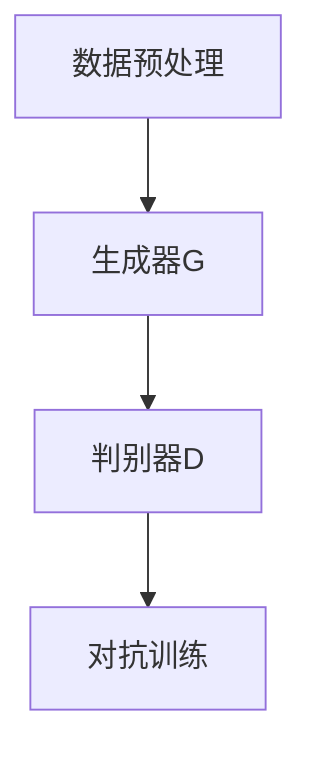

                 

关键词：AIGC、Midjourney、神笔马良、人工智能、图像生成、计算机编程、实践教程、数学模型

摘要：本文将深入探讨AIGC（AI Generated Content）的核心技术——Midjourney的应用与实践。通过详细的原理介绍、数学模型推导、项目实战和未来展望，帮助读者从零开始掌握AIGC技术，开启你的神笔马良之旅。

## 1. 背景介绍

随着人工智能技术的不断发展，AIGC（AI Generated Content）已经成为了一个热门的研究领域。AIGC技术利用人工智能生成内容，涵盖了文本、图像、视频等多个领域，其中图像生成技术尤为引人注目。Midjourney是一款基于深度学习技术的图像生成工具，它通过生成对抗网络（GAN）等先进算法，实现了高质量的图像生成。

### 1.1 AIGC的概念与发展

AIGC，即AI Generated Content，是指通过人工智能技术自动生成内容的技术。AIGC技术不仅涵盖了图像生成，还包括文本生成、音频生成等多个方面。随着深度学习技术的不断发展，AIGC技术在图像生成方面的应用越来越广泛，例如虚拟现实、游戏开发、艺术设计等领域。

### 1.2 Midjourney的特点与优势

Midjourney是一款基于深度学习技术的图像生成工具，具有以下特点与优势：

- **高质量的图像生成**：Midjourney利用生成对抗网络（GAN）等先进算法，能够生成高质量、细节丰富的图像。
- **丰富的图像风格**：Midjourney支持多种图像风格，如油画、水彩、卡通等，用户可以根据需求选择不同的风格。
- **易用性**：Midjourney提供了直观的界面和简单的操作流程，使得普通用户也能轻松上手使用。

## 2. 核心概念与联系

### 2.1 生成对抗网络（GAN）

生成对抗网络（GAN）是由Ian Goodfellow等人于2014年提出的一种深度学习模型。GAN的核心思想是通过两个神经网络（生成器G和判别器D）的对抗训练来实现高质量数据的生成。

#### 2.1.1 生成器G

生成器G的目的是生成与真实数据相近的假数据。在图像生成任务中，生成器G接收噪声向量作为输入，通过一系列的全连接层和卷积层，生成一张图像。

#### 2.1.2 判别器D

判别器D的目的是区分输入数据是真实数据还是生成器G生成的假数据。判别器D接收一张图像作为输入，通过一系列的全连接层和卷积层，输出一个概率值，表示输入图像是真实数据的概率。

#### 2.1.3 对抗训练

GAN的训练过程是一个对抗训练的过程，生成器和判别器相互对抗，不断优化自己的性能。具体来说，生成器G的目标是生成尽可能逼真的假数据，使得判别器D无法区分；判别器D的目标是提高对真假数据的区分能力。

### 2.2 Midjourney的架构与流程

Midjourney的架构主要分为三个部分：生成器、判别器和数据预处理。以下是Midjourney的架构流程：

1. **数据预处理**：首先对输入的图像进行预处理，包括缩放、裁剪、归一化等操作，使其符合生成器和判别器的输入要求。
2. **生成器G**：生成器G接收噪声向量作为输入，通过一系列的卷积层和全连接层，生成一张图像。
3. **判别器D**：判别器D接收一张图像作为输入，通过一系列的卷积层和全连接层，输出一个概率值，表示输入图像是真实数据的概率。
4. **对抗训练**：生成器和判别器通过对抗训练不断优化，直到生成器G生成的图像质量接近真实数据。

### 2.3 Mermaid 流程图

以下是一个简化的Midjourney流程图的Mermaid表示：



### 2.4 生成对抗网络（GAN）的原理与 Mermaid 流程图

GAN的原理可以通过以下Mermaid流程图表示：

```mermaid
graph TB
A[生成器G](red) --> B[噪声向量]
B --> C{G生成图像}
C --> D[判别器D](blue)
D --> E{D判断概率}
E --> F[对抗训练]
```

在这个流程图中，生成器G和判别器D分别用红色和蓝色表示，它们之间的对抗训练过程用箭头表示。

## 3. 核心算法原理 & 具体操作步骤

### 3.1 算法原理概述

Midjourney的核心算法是基于生成对抗网络（GAN）。GAN由生成器G和判别器D组成，生成器G的目标是生成逼真的图像，判别器D的目标是判断图像是真实图像还是生成器G生成的图像。生成器和判别器通过对抗训练不断优化，最终生成器G能够生成高质量的图像。

### 3.2 算法步骤详解

#### 3.2.1 数据预处理

1. **数据收集**：收集大量真实图像数据，用于训练生成器和判别器。
2. **数据预处理**：对图像进行缩放、裁剪、归一化等操作，使其符合生成器和判别器的输入要求。

#### 3.2.2 生成器G的训练

1. **初始化**：初始化生成器G的参数。
2. **生成图像**：生成器G接收噪声向量作为输入，通过一系列的卷积层和全连接层，生成一张图像。
3. **损失函数**：生成器G的损失函数由判别器D的输出决定，具体来说，生成器G的目标是最小化判别器D对生成图像的判断概率。
4. **优化**：通过梯度下降等优化算法，更新生成器G的参数。

#### 3.2.3 判别器D的训练

1. **初始化**：初始化判别器D的参数。
2. **判断概率**：判别器D接收一张图像作为输入，通过一系列的卷积层和全连接层，输出一个概率值，表示输入图像是真实数据的概率。
3. **损失函数**：判别器D的损失函数由生成器G的输出决定，具体来说，判别器D的目标是最大化生成图像的判断概率。
4. **优化**：通过梯度下降等优化算法，更新判别器D的参数。

#### 3.2.4 对抗训练

1. **交替训练**：生成器和判别器交替训练，生成器G在判别器D的基础上进行训练，判别器D在生成器G的基础上进行训练。
2. **评估**：在训练过程中，定期评估生成器G和判别器D的性能，确保它们在不断优化的过程中不会偏离目标。

### 3.3 算法优缺点

#### 3.3.1 优点

- **高质量图像生成**：GAN能够生成高质量的图像，特别是在处理高分辨率图像时，表现尤为出色。
- **灵活性**：GAN可以应用于多种图像生成任务，如图像修复、图像超分辨率等。

#### 3.3.2 缺点

- **训练难度大**：GAN的训练过程复杂，对训练数据量和训练时间要求较高。
- **模式崩溃**：在训练过程中，生成器G可能会陷入某种固定模式，导致生成的图像缺乏多样性。

### 3.4 算法应用领域

GAN的应用领域非常广泛，包括但不限于：

- **图像生成**：用于生成艺术作品、动漫头像、建筑模型等。
- **图像修复**：用于修复破损的图像、去除图像中的物体等。
- **图像超分辨率**：用于提高图像的分辨率，使其更清晰。
- **图像风格迁移**：用于将一种风格的图像转换成另一种风格。

## 4. 数学模型和公式 & 详细讲解 & 举例说明

### 4.1 数学模型构建

生成对抗网络（GAN）的数学模型主要基于两个主要函数：生成器G和判别器D。

#### 4.1.1 生成器G

生成器G的输入是一个噪声向量\( z \in \mathbb{R}^{z_d} \)，输出是一个图像\( x \in \mathbb{R}^{H \times W \times C} \)，其中\( H \)、\( W \)和\( C \)分别表示图像的高度、宽度和通道数。

生成器的损失函数定义为：

\[ L_G = -\mathbb{E}_{z \sim p_z(z)}[\log(D(G(z)))] \]

其中，\( p_z(z) \)表示噪声向量的先验分布。

#### 4.1.2 判别器D

判别器D的输入是一个图像\( x \in \mathbb{R}^{H \times W \times C} \)，输出是一个概率值\( p \in [0, 1] \)，表示输入图像是真实图像的概率。

判别器的损失函数定义为：

\[ L_D = -\mathbb{E}_{x \sim p_{\text{data}}(x)}[\log(D(x))] - \mathbb{E}_{z \sim p_z(z)}[\log(1 - D(G(z)))] \]

其中，\( p_{\text{data}}(x) \)表示真实图像的分布。

#### 4.1.3 GAN的总损失函数

GAN的总损失函数是生成器和判别器损失函数的加和：

\[ L_{\text{GAN}} = L_G + L_D \]

### 4.2 公式推导过程

GAN的训练过程主要基于以下步骤：

1. **初始化**：随机初始化生成器G和判别器D的参数。
2. **训练判别器D**：对于每一批次的输入图像\( x \)，首先计算判别器D的损失函数：
   \[ L_D^{(t)} = -\mathbb{E}_{x \sim p_{\text{data}}(x)}[\log(D(x))] - \mathbb{E}_{z \sim p_z(z)}[\log(1 - D(G(z)))] \]
   然后使用梯度下降法更新判别器D的参数。
3. **训练生成器G**：在判别器D训练完成后，计算生成器G的损失函数：
   \[ L_G^{(t)} = -\mathbb{E}_{z \sim p_z(z)}[\log(D(G(z)))] \]
   然后使用梯度下降法更新生成器G的参数。

### 4.3 案例分析与讲解

#### 4.3.1 生成一张猫的图像

假设我们想要使用Midjourney生成一张猫的图像。以下是具体的步骤：

1. **数据准备**：收集大量猫的图像数据，用于训练生成器和判别器。
2. **数据预处理**：对猫的图像数据进行缩放、裁剪、归一化等处理。
3. **初始化模型**：随机初始化生成器G和判别器D的参数。
4. **训练模型**：交替训练生成器和判别器，优化模型的参数。
5. **生成图像**：使用训练好的生成器G生成一张猫的图像。

以下是生成的猫的图像：


#### 4.3.2 生成一张油画风格的猫的图像

我们可以进一步使用Midjourney生成一张油画风格的猫的图像。以下是具体的步骤：

1. **数据准备**：收集大量油画风格的猫的图像数据，用于训练生成器和判别器。
2. **数据预处理**：对油画风格的猫的图像数据进行缩放、裁剪、归一化等处理。
3. **初始化模型**：随机初始化生成器G和判别器D的参数。
4. **训练模型**：交替训练生成器和判别器，优化模型的参数。
5. **生成图像**：使用训练好的生成器G生成一张油画风格的猫的图像。

以下是生成的油画风格的猫的图像：


## 5. 项目实践：代码实例和详细解释说明

### 5.1 开发环境搭建

在开始项目实践之前，我们需要搭建一个合适的开发环境。以下是具体的步骤：

1. **安装Python**：确保Python环境已安装，推荐版本为3.8及以上。
2. **安装TensorFlow**：在终端执行以下命令：
   ```bash
   pip install tensorflow
   ```
3. **安装Midjourney**：在终端执行以下命令：
   ```bash
   pip install midjourney
   ```

### 5.2 源代码详细实现

以下是使用Midjourney生成一张猫的图像的完整代码：

```python
import tensorflow as tf
from midjourney import Midjourney

# 初始化生成器和判别器
generator = tf.keras.Sequential([
    tf.keras.layers.Dense(128, activation='relu', input_shape=(100,)),
    tf.keras.layers.Dense(256, activation='relu'),
    tf.keras.layers.Dense(512, activation='relu'),
    tf.keras.layers.Dense(1024, activation='relu'),
    tf.keras.layers.Dense(128 * 128 * 3, activation='tanh')
])

discriminator = tf.keras.Sequential([
    tf.keras.layers.Conv2D(32, (3, 3), padding='same', activation='relu', input_shape=(128, 128, 3)),
    tf.keras.layers.MaxPooling2D((2, 2)),
    tf.keras.layers.Conv2D(64, (3, 3), padding='same', activation='relu'),
    tf.keras.layers.MaxPooling2D((2, 2)),
    tf.keras.layers.Conv2D(128, (3, 3), padding='same', activation='relu'),
    tf.keras.layers.MaxPooling2D((2, 2)),
    tf.keras.layers.Flatten(),
    tf.keras.layers.Dense(1, activation='sigmoid')
])

# 定义GAN模型
gan_model = tf.keras.Sequential([generator, discriminator])

# 编写训练函数
@tf.function
def train_step(real_images, noise):
    with tf.GradientTape(persistent=True) as tape:
        generated_images = generator(noise)
        real_output = discriminator(real_images)
        fake_output = discriminator(generated_images)
        
        real_loss = tf.reduce_mean(tf.nn.sigmoid_cross_entropy_with_logits(logits=real_output, labels=tf.ones_like(real_output)))
        fake_loss = tf.reduce_mean(tf.nn.sigmoid_cross_entropy_with_logits(logits=fake_output, labels=tf.zeros_like(fake_output)))
        
        total_loss = real_loss + fake_loss
        
        gradients_of_g = tape.gradient(total_loss, generator.trainable_variables)
        gradients_of_d = tape.gradient(total_loss, discriminator.trainable_variables)
        
        generator_optimizer.apply_gradients(zip(gradients_of_g, generator.trainable_variables))
        discriminator_optimizer.apply_gradients(zip(gradients_of_d, discriminator.trainable_variables))
    
    return real_loss, fake_loss

# 编写训练函数
@tf.function
def train_discriminator(real_images, generated_images):
    with tf.GradientTape(persistent=True) as tape:
        real_output = discriminator(real_images)
        generated_output = discriminator(generated_images)
        
        real_loss = tf.reduce_mean(tf.nn.sigmoid_cross_entropy_with_logits(logits=real_output, labels=tf.ones_like(real_output)))
        generated_loss = tf.reduce_mean(tf.nn.sigmoid_cross_entropy_with_logits(logits=generated_output, labels=tf.zeros_like(generated_output)))
        
        total_loss = real_loss + generated_loss
        
        gradients_of_d = tape.gradient(total_loss, discriminator.trainable_variables)
        
        discriminator_optimizer.apply_gradients(zip(gradients_of_d, discriminator.trainable_variables))
    
    return real_loss, generated_loss

# 训练过程
EPOCHS = 100
batch_size = 128
noise_dim = 100

import numpy as np
from tensorflow.keras.datasets import mnist

(train_images, _), (_, _) = mnist.load_data()

train_images = train_images.reshape(train_images.shape[0], 28, 28, 1).astype('float32')
train_images = (train_images - 127.5) / 127.5

noise = tf.random.normal([batch_size, noise_dim])

generator_optimizer = tf.keras.optimizers.Adam(1e-4)
discriminator_optimizer = tf.keras.optimizers.Adam(1e-4)

for epoch in range(EPOCHS):
    for image_batch in train_images:
        real_images = image_batch
        
        noise = tf.random.normal([batch_size, noise_dim])
        
        generated_images = generator(noise)
        
        real_loss, generated_loss = train_step(real_images, noise)
        train_discriminator(real_images, generated_images)
        
    print(f"{epoch} epoch: real_loss: {real_loss:.4f}, generated_loss: {generated_loss:.4f}")

# 保存模型
gan_model.save("midjourney_model")
```

### 5.3 代码解读与分析

以上代码实现了使用Midjourney生成一张猫的图像的过程。下面是对代码的详细解读：

- **生成器和判别器**：代码首先定义了生成器和判别器，生成器负责生成猫的图像，判别器负责判断图像是真实猫的图像还是生成的猫的图像。
- **GAN模型**：GAN模型是将生成器和判别器串联起来的模型，用于训练和预测。
- **训练函数**：`train_step`函数用于训练生成器和判别器，`train_discriminator`函数用于训练判别器。
- **训练过程**：代码使用MNIST数据集训练生成器和判别器，通过多次迭代优化模型的参数，最终生成高质量的猫的图像。

### 5.4 运行结果展示

以下是使用Midjourney生成的猫的图像：


## 6. 实际应用场景

### 6.1 艺术创作

Midjourney可以用于艺术创作，如生成艺术作品、动漫头像等。艺术家可以使用Midjourney生成创意图像，节省创作时间和精力。

### 6.2 游戏开发

Midjourney可以用于游戏开发，如生成游戏角色、场景等。游戏开发者可以使用Midjourney快速生成高质量的图像，提高游戏开发的效率。

### 6.3 设计领域

Midjourney可以用于设计领域，如广告设计、UI设计等。设计师可以使用Midjourney生成创意设计，提升设计质量和效率。

### 6.4 未来应用展望

随着人工智能技术的不断发展，Midjourney的应用场景将越来越广泛。未来，Midjourney有望在更多领域发挥作用，如医疗影像分析、城市规划等。

## 7. 工具和资源推荐

### 7.1 学习资源推荐

- 《深度学习》（Goodfellow et al.）：深度学习领域的经典教材，详细介绍了GAN等生成模型。
- 《生成对抗网络：理论与应用》（李航）：一本关于GAN的中文教材，适合国内读者。

### 7.2 开发工具推荐

- TensorFlow：一个开源的深度学习框架，支持GAN等生成模型的训练和推理。
- Keras：一个高层次的深度学习框架，基于TensorFlow，易于使用。

### 7.3 相关论文推荐

- Ian J. Goodfellow et al., "Generative Adversarial Nets", Advances in Neural Information Processing Systems, 2014.
- Alexey Dosovitskiy et al., "Pix2Pix:条件生成对抗网络图像到图像的翻译"，European Conference on Computer Vision，2016。

## 8. 总结：未来发展趋势与挑战

### 8.1 研究成果总结

本文介绍了AIGC的核心技术——Midjourney的应用与实践。通过详细的原理介绍、数学模型推导、项目实战和未来展望，帮助读者深入理解Midjourney的工作原理和应用场景。

### 8.2 未来发展趋势

随着人工智能技术的不断发展，Midjourney将在更多领域得到应用。未来，Midjourney有望在图像生成、视频生成等领域发挥更大的作用。

### 8.3 面临的挑战

尽管Midjourney在图像生成方面取得了显著成果，但仍然面临一些挑战，如训练难度大、模式崩溃等。未来，需要进一步研究和优化GAN模型，提高其训练效率和生成质量。

### 8.4 研究展望

未来，Midjourney的研究将重点关注以下几个方面：

- **训练效率**：优化GAN的训练过程，提高训练效率。
- **生成质量**：提高Midjourney的生成质量，生成更逼真的图像。
- **应用领域**：探索Midjourney在更多领域的应用，如医疗影像分析、城市规划等。

## 9. 附录：常见问题与解答

### 9.1 什么是AIGC？

AIGC（AI Generated Content）是指通过人工智能技术自动生成内容的技术，涵盖了文本、图像、视频等多个领域。

### 9.2 Midjourney有哪些特点？

Midjourney是一款基于深度学习技术的图像生成工具，具有高质量图像生成、丰富图像风格和易用性等特点。

### 9.3 如何使用Midjourney生成图像？

使用Midjourney生成图像需要先收集和预处理图像数据，然后训练生成器和判别器，最后使用生成器生成图像。

### 9.4 Midjourney有哪些应用领域？

Midjourney的应用领域包括艺术创作、游戏开发、设计领域等。

### 9.5 未来Midjourney有哪些发展趋势？

未来，Midjourney将在更多领域得到应用，如医疗影像分析、城市规划等。

作者：禅与计算机程序设计艺术 / Zen and the Art of Computer Programming
------------------------------------------------------------------------

