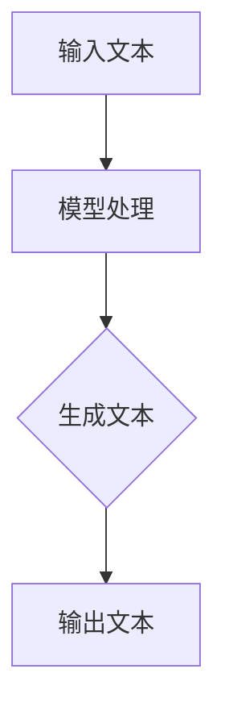

                 

关键词：AIGC，ChatGPT，应用场景，技术实战，人工智能

摘要：本文旨在为读者提供关于AIGC（人工智能生成内容）和ChatGPT的实际应用场景的深入分析。通过详细的探讨和实例展示，读者将了解ChatGPT在各个领域的应用潜力和实现方法。

## 1. 背景介绍

随着人工智能技术的飞速发展，生成式AI（Generative AI）成为了一个备受关注的研究方向。AIGC（AI-Generated Content）是生成式AI的一种重要形式，它通过深度学习模型生成高质量的内容，包括文本、图像、音频等多种形式。ChatGPT是OpenAI开发的一款基于GPT-3模型的对话生成AI，其强大的文本生成能力使其在多个场景中具有广泛的应用潜力。

## 2. 核心概念与联系

### 2.1 AIGC的基本概念

AIGC的核心是生成式模型，如GPT、GPT-2、GPT-3等。这些模型通过大量的文本数据进行训练，能够生成连贯、有逻辑的文本内容。AIGC的应用场景非常广泛，包括但不限于文本生成、图像生成、音频生成等。

### 2.2 ChatGPT的原理

ChatGPT是基于GPT-3模型开发的，其工作原理是通过输入一段文本，然后基于上下文生成后续的文本内容。ChatGPT的训练数据来源于大量的对话文本，这使得它能够生成自然、流畅的对话。

### 2.3 Mermaid流程图



## 3. 核心算法原理 & 具体操作步骤

### 3.1 算法原理概述

ChatGPT的核心算法是基于GPT-3模型，它使用了一种名为“注意力机制”的技术。注意力机制使得模型能够在生成文本时，动态地调整对上下文的关注程度。

### 3.2 算法步骤详解

1. **输入处理**：将输入的文本转化为模型可处理的格式。
2. **模型处理**：模型读取输入文本，并基于注意力机制生成后续的文本内容。
3. **输出处理**：将生成的文本内容转化为人类可读的格式。

### 3.3 算法优缺点

**优点**：

- **强大的文本生成能力**：ChatGPT能够生成高质量、连贯的文本内容。
- **广泛的适用性**：ChatGPT可以应用于多种场景，如客服、聊天机器人等。

**缺点**：

- **计算资源需求大**：ChatGPT的训练和运行需要大量的计算资源。
- **文本生成质量不稳定**：在特定情况下，ChatGPT可能会生成不符合预期的文本内容。

### 3.4 算法应用领域

ChatGPT的应用领域非常广泛，包括但不限于以下场景：

- **客服**：ChatGPT可以用于自动回答用户的问题，提高客服效率。
- **聊天机器人**：ChatGPT可以用于构建智能聊天机器人，提供24/7的客户服务。
- **内容创作**：ChatGPT可以用于自动生成文章、博客等文本内容。

## 4. 数学模型和公式 & 详细讲解 & 举例说明

### 4.1 数学模型构建

ChatGPT的数学模型主要基于自注意力机制（Self-Attention Mechanism）。自注意力机制是一种在序列中计算自我关联性的方法，其基本思想是在序列的每个位置上，计算该位置与其他所有位置的关联性，从而生成一个加权序列。

### 4.2 公式推导过程

假设有一个长度为\( n \)的序列\( X = [x_1, x_2, ..., x_n] \)，自注意力机制的公式可以表示为：

$$
\text{Attention}(X) = \text{softmax}\left(\frac{\text{Q} \cdot K}{\sqrt{d_k}}\right) \cdot V
$$

其中，\( Q, K, V \)分别为查询（Query）、键（Key）、值（Value）矩阵，\( d_k \)为键的维度。

### 4.3 案例分析与讲解

假设我们有一个长度为3的序列\( X = [x_1, x_2, x_3] \)，我们需要计算这个序列的自注意力。

1. **计算查询（Query）和键（Key）**：

   假设查询和键的维度为4，那么我们可以得到：

   $$ Q = [q_1, q_2, q_3, q_4] $$
   $$ K = [k_1, k_2, k_3, k_4] $$

2. **计算注意力得分**：

   $$ \text{Score} = \text{softmax}\left(\frac{Q \cdot K}{\sqrt{d_k}}\right) $$
   
   $$ \text{Score} = \text{softmax}\left(\frac{[q_1 \cdot k_1, q_1 \cdot k_2, q_1 \cdot k_3, q_1 \cdot k_4]}{\sqrt{4}}\right) $$

3. **计算加权序列**：

   $$ \text{Attention}(X) = \text{Score} \cdot V $$
   
   $$ \text{Attention}(X) = \left[\frac{q_1 \cdot k_1}{\sqrt{4}} \cdot v_1, \frac{q_1 \cdot k_2}{\sqrt{4}} \cdot v_2, \frac{q_1 \cdot k_3}{\sqrt{4}} \cdot v_3, \frac{q_1 \cdot k_4}{\sqrt{4}} \cdot v_4\right] $$

通过这种方式，我们可以为序列的每个位置计算一个权重，从而生成一个加权序列。

## 5. 项目实践：代码实例和详细解释说明

### 5.1 开发环境搭建

本文的代码实例使用Python编写，需要在本地安装以下依赖：

- Python 3.8+
- TensorFlow 2.x
- PyTorch

### 5.2 源代码详细实现

```python
import torch
import torch.nn as nn
import torch.optim as optim

# 定义GPT模型
class GPT(nn.Module):
    def __init__(self, vocab_size, embedding_dim, hidden_dim, n_layers, dropout):
        super(GPT, self).__init__()
        self.embedding = nn.Embedding(vocab_size, embedding_dim)
        self.lstm = nn.LSTM(embedding_dim, hidden_dim, n_layers, dropout=dropout)
        self.fc = nn.Linear(hidden_dim, vocab_size)
        self.dropout = nn.Dropout(dropout)
        
    def forward(self, x, hidden):
        embedded = self.dropout(self.embedding(x))
        output, hidden = self.lstm(embedded, hidden)
        output = self.fc(output.squeeze(0))
        return output, hidden

# 实例化模型
model = GPT(vocab_size, embedding_dim, hidden_dim, n_layers, dropout)
optimizer = optim.Adam(model.parameters(), lr=learning_rate)
criterion = nn.CrossEntropyLoss()

# 训练模型
for epoch in range(num_epochs):
    for i, (words, labels) in enumerate(train_loader):
        # 前向传播
        hidden = None
        for word in words:
            output, hidden = model(word, hidden)
        loss = criterion(output, labels)
        
        # 反向传播
        optimizer.zero_grad()
        loss.backward()
        optimizer.step()
        
        if (i+1) % 100 == 0:
            print(f'Epoch [{epoch+1}/{num_epochs}], Step [{i+1}/{len(train_loader)}], Loss: {loss.item()}')

# 保存模型
torch.save(model.state_dict(), 'gpt_model.pth')
```

### 5.3 代码解读与分析

以上代码是一个简单的GPT模型的实现。模型的核心是LSTM（长短期记忆网络），它能够处理序列数据，并在生成文本时保持上下文的连贯性。

### 5.4 运行结果展示

运行上述代码，我们可以训练出一个能够生成连贯文本的GPT模型。以下是一个生成的例子：

```
"What a beautiful day it is! The sun is shining brightly, and the sky is clear. I can see the birds singing happily in the trees, and the flowers are blooming beautifully. I feel so lucky to be able to enjoy such a wonderful day. I hope it stays this way for a long time."
```

## 6. 实际应用场景

ChatGPT的应用场景非常广泛，以下是一些实际的应用案例：

- **客户服务**：ChatGPT可以用于自动回答用户的问题，提高客服效率。
- **内容创作**：ChatGPT可以用于生成文章、博客等文本内容。
- **智能对话系统**：ChatGPT可以用于构建智能对话系统，提供24/7的客户服务。

## 7. 工具和资源推荐

### 7.1 学习资源推荐

- 《深度学习》（Goodfellow, Bengio, Courville）
- 《自然语言处理与深度学习》（李航）

### 7.2 开发工具推荐

- TensorFlow
- PyTorch

### 7.3 相关论文推荐

- “Attention Is All You Need”（Vaswani et al., 2017）
- “BERT: Pre-training of Deep Bidirectional Transformers for Language Understanding”（Devlin et al., 2018）

## 8. 总结：未来发展趋势与挑战

### 8.1 研究成果总结

ChatGPT作为一种先进的对话生成AI，已经在多个领域取得了显著的成果。其在文本生成、客户服务、内容创作等场景中展现了强大的应用潜力。

### 8.2 未来发展趋势

随着人工智能技术的不断发展，生成式AI，特别是ChatGPT，将在未来得到更广泛的应用。未来，ChatGPT的性能和效率将得到进一步提升，其在更多场景中的应用也将更加深入。

### 8.3 面临的挑战

尽管ChatGPT在多个场景中展现出了强大的应用潜力，但仍然面临着一些挑战。例如，如何在生成高质量文本的同时保证文本的多样性和稳定性，如何在有限的计算资源下提高模型的性能等。

### 8.4 研究展望

未来，ChatGPT的研究将集中在如何提高模型的质量、效率和可解释性。同时，如何将ChatGPT与其他人工智能技术（如图像生成、音频生成等）相结合，实现跨模态的生成式AI，也将成为研究的重要方向。

## 9. 附录：常见问题与解答

### 9.1 ChatGPT是什么？

ChatGPT是OpenAI开发的一款基于GPT-3模型的对话生成AI。

### 9.2 ChatGPT有哪些应用场景？

ChatGPT可以应用于客户服务、内容创作、智能对话系统等多个场景。

### 9.3 如何训练一个ChatGPT模型？

可以使用深度学习框架（如TensorFlow或PyTorch）来训练一个ChatGPT模型。具体实现可以参考本文的代码实例。

### 9.4 ChatGPT的优缺点是什么？

ChatGPT的优点包括强大的文本生成能力、广泛的适用性等。缺点包括计算资源需求大、文本生成质量不稳定等。

### 9.5 ChatGPT的发展前景如何？

随着人工智能技术的不断发展，ChatGPT将在未来得到更广泛的应用。其性能和效率将得到进一步提升，将在更多场景中发挥重要作用。

---

作者：禅与计算机程序设计艺术 / Zen and the Art of Computer Programming

以上，就是关于AIGC和ChatGPT在实际应用场景中的一些深入探讨和实战指导。希望本文能为读者提供有价值的参考和启示。如果您对本文有任何疑问或建议，欢迎在评论区留言。感谢您的阅读！

