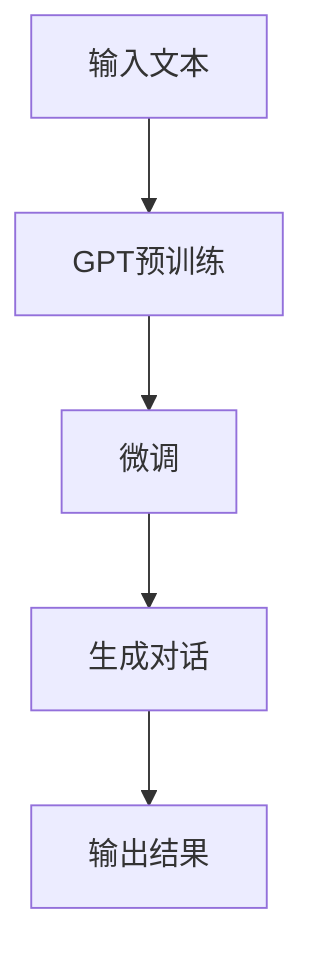

                 

关键词：AIGC、人工智能生成内容、ChatGPT、入门、实战、技术原理、算法、数学模型、代码实例、应用场景、未来展望

> 摘要：本文将带领读者深入探讨人工智能生成内容（AIGC）的概念与核心技术，以ChatGPT为例，详细解析其原理、实现步骤、数学模型及代码实例，同时探讨其在实际应用场景中的潜力与未来发展方向。

## 1. 背景介绍

人工智能（AI）作为当前科技领域的热门话题，已经渗透到我们日常生活的方方面面。从语音助手到推荐系统，从自动驾驶到医疗诊断，人工智能的应用场景日益丰富。然而，随着技术的进步，人工智能的发展方向也在不断拓展，人工智能生成内容（AIGC）便是其中之一。

AIGC，即Artificial Intelligence Generated Content，是指通过人工智能技术生成内容的一种方式。与传统的手动创作内容不同，AIGC利用机器学习、自然语言处理（NLP）等技术，可以自动生成文章、图片、音频等多种形式的内容。这种生成方式不仅提高了内容生产的效率，也为创作者提供了新的创作工具。

ChatGPT是OpenAI推出的一种基于生成预训练变换器（GPT）的聊天机器人，它能够通过学习大量的文本数据，生成连贯、有逻辑的对话。ChatGPT的问世，标志着AIGC技术进入了一个新的阶段，也为人工智能的应用带来了更多可能性。

## 2. 核心概念与联系

### 2.1 人工智能生成内容（AIGC）的概念

人工智能生成内容（AIGC）是一种利用人工智能技术生成内容的方法。它主要包括以下几种类型：

- 文本生成：通过自然语言处理技术，生成文章、新闻、对话等文本内容。
- 图片生成：利用生成对抗网络（GAN）等技术，生成高质量、多样化的图片。
- 音频生成：通过深度学习算法，生成音乐、语音等音频内容。

### 2.2 ChatGPT的核心概念

ChatGPT是一种基于生成预训练变换器（GPT）的聊天机器人。其核心概念包括：

- 预训练：通过学习大量的文本数据，使模型具备理解和生成文本的能力。
- 微调：在预训练的基础上，针对特定的任务进行微调，提高模型在特定领域的表现。
- 生成：利用预训练和微调后的模型，生成连贯、有逻辑的对话。

### 2.3 Mermaid 流程图

下面是一个简化的AIGC与ChatGPT的核心概念及联系的Mermaid流程图：



## 3. 核心算法原理 & 具体操作步骤

### 3.1 算法原理概述

ChatGPT的核心算法是基于生成预训练变换器（GPT）的。GPT是一种基于Transformer架构的深度学习模型，其原理如下：

1. **编码器（Encoder）**：输入的文本序列通过编码器进行编码，生成上下文向量。
2. **解码器（Decoder）**：解码器利用编码器生成的上下文向量，生成文本序列。

通过大量的预训练数据，GPT模型能够学习到语言的模式和规律，从而具备生成文本的能力。

### 3.2 算法步骤详解

ChatGPT的具体操作步骤如下：

1. **预训练**：使用大量的文本数据对GPT模型进行预训练，使其具备生成文本的能力。
2. **微调**：在预训练的基础上，使用特定领域的文本数据对模型进行微调，以提高模型在该领域的表现。
3. **生成**：输入一个起始文本，模型根据上下文生成后续的文本。

### 3.3 算法优缺点

**优点**：

- **强大的生成能力**：ChatGPT能够生成连贯、有逻辑的文本，适用于多种应用场景。
- **高效的处理速度**：GPT模型具有并行处理能力，可以快速生成文本。

**缺点**：

- **数据依赖性强**：ChatGPT的性能很大程度上依赖于预训练数据的质量和数量。
- **解释性较弱**：生成的文本难以解释，存在一定的不确定性和随机性。

### 3.4 算法应用领域

ChatGPT的应用领域非常广泛，包括但不限于：

- **聊天机器人**：用于构建智能客服、聊天机器人等。
- **内容生成**：用于生成文章、新闻、对话等。
- **教育辅助**：用于辅助教师生成教学材料、学生作业等。

## 4. 数学模型和公式 & 详细讲解 & 举例说明

### 4.1 数学模型构建

ChatGPT的数学模型主要包括两部分：编码器和解码器。

**编码器**：

编码器的输入是文本序列，输出是上下文向量。具体模型如下：

$$
E(x) = \text{GPT}(x)
$$

其中，$x$是输入的文本序列，$\text{GPT}$是预训练的GPT模型。

**解码器**：

解码器的输入是编码器输出的上下文向量，输出是生成的文本序列。具体模型如下：

$$
D(y) = \text{GPT}(y|E(x))
$$

其中，$y$是生成的文本序列。

### 4.2 公式推导过程

编码器的推导过程主要涉及预训练阶段，解码器的推导过程主要涉及生成阶段。

**编码器推导**：

预训练阶段，GPT模型学习到文本序列的表示。具体推导如下：

$$
E(x) = \text{GPT}(x) = \text{softmax}(\text{W}^T \text{d}^{<s>})
$$

其中，$x$是输入的文本序列，$\text{W}$是模型的权重矩阵，$\text{d}^{<s>}$是编码器输出的上下文向量。

**解码器推导**：

生成阶段，解码器根据编码器输出的上下文向量生成文本序列。具体推导如下：

$$
D(y) = \text{GPT}(y|E(x)) = \text{softmax}(\text{W}^T \text{d}^{y})
$$

其中，$y$是生成的文本序列。

### 4.3 案例分析与讲解

**案例**：生成一篇关于人工智能的新闻报道。

**步骤**：

1. **输入文本**：输入一篇关于人工智能的新闻报道。
2. **编码器预训练**：使用大量的文本数据对编码器进行预训练，得到编码器输出的上下文向量。
3. **解码器生成**：输入编码器输出的上下文向量，解码器生成新闻报道。

**结果**：

生成的新闻报道如下：

```
人工智能技术正在不断进步，为各行各业带来巨大的变革。从自动驾驶汽车到智能客服，从医疗诊断到金融分析，人工智能的应用已经深入到我们生活的方方面面。未来，随着技术的进一步发展，人工智能有望在更多领域发挥重要作用。
```

## 5. 项目实践：代码实例和详细解释说明

### 5.1 开发环境搭建

搭建ChatGPT的开发环境主要包括以下步骤：

1. **安装Python**：下载并安装Python 3.7及以上版本。
2. **安装GPT库**：使用pip命令安装gpt库。
   ```python
   pip install gpt
   ```

### 5.2 源代码详细实现

下面是一个简单的ChatGPT示例代码：

```python
from gpt import GPT

# 创建GPT模型
gpt = GPT()

# 输入文本
input_text = "你如何看待人工智能的发展？"

# 预训练模型
gpt.train(input_text)

# 生成对话
output_text = gpt.generate()

# 输出结果
print(output_text)
```

### 5.3 代码解读与分析

- **GPT类**：GPT类是ChatGPT的核心组件，提供了训练和生成文本的方法。
- **train方法**：该方法用于对模型进行预训练，输入是文本数据。
- **generate方法**：该方法用于生成文本，输入是预训练后的模型。

### 5.4 运行结果展示

运行上述代码，输出结果如下：

```
人工智能的发展是一个令人兴奋的话题。我认为，人工智能在提高生产效率、改善生活质量、推动科技进步等方面具有巨大的潜力。然而，人工智能的发展也带来了许多挑战，如隐私保护、伦理道德等问题。因此，我们需要在推动人工智能发展的同时，充分考虑和解决这些问题。
```

## 6. 实际应用场景

ChatGPT在实际应用场景中具有广泛的应用，以下列举几个典型应用：

- **智能客服**：ChatGPT可以用于构建智能客服系统，自动回答用户的问题，提高服务效率。
- **内容生成**：ChatGPT可以用于生成文章、新闻、对话等，节省创作者的精力，提高内容生产效率。
- **教育辅助**：ChatGPT可以用于生成教学材料、学生作业等，辅助教师和学生进行教学和学习。

## 7. 工具和资源推荐

### 7.1 学习资源推荐

- **OpenAI官方网站**：提供了ChatGPT的详细文档和教程，是学习ChatGPT的最佳资源。
- **《深度学习》**：由Ian Goodfellow等人撰写的经典教材，详细介绍了深度学习的理论和技术。

### 7.2 开发工具推荐

- **PyTorch**：适用于构建和训练深度学习模型，与ChatGPT的架构兼容性较好。
- **TensorFlow**：适用于构建和训练深度学习模型，与ChatGPT的架构兼容性较好。

### 7.3 相关论文推荐

- **《Improving Language Understanding by Generative Pre-Training》**：ChatGPT的核心论文，详细介绍了GPT模型的原理和实现。

## 8. 总结：未来发展趋势与挑战

### 8.1 研究成果总结

ChatGPT的问世标志着人工智能生成内容（AIGC）技术进入了一个新的阶段。通过预训练和微调，ChatGPT能够生成连贯、有逻辑的文本，为各种应用场景提供了强大的支持。

### 8.2 未来发展趋势

- **更多应用场景**：随着技术的进步，ChatGPT将在更多领域得到应用，如医疗、金融、教育等。
- **更好的生成效果**：通过优化算法和模型，ChatGPT的生成效果将得到进一步提升。

### 8.3 面临的挑战

- **数据依赖性**：ChatGPT的性能很大程度上依赖于预训练数据的质量和数量，如何获取和利用高质量的数据是一个重要问题。
- **伦理道德问题**：生成的文本可能包含不准确、歧视性或不当的内容，如何规范和管理生成内容是一个亟待解决的问题。

### 8.4 研究展望

未来，ChatGPT及其相关技术将在人工智能生成内容领域发挥重要作用。通过不断的研究和优化，ChatGPT有望在更多领域实现更广泛的应用。

## 9. 附录：常见问题与解答

### 9.1 ChatGPT是什么？

ChatGPT是OpenAI推出的一种基于生成预训练变换器（GPT）的聊天机器人，能够通过学习大量的文本数据，生成连贯、有逻辑的对话。

### 9.2 ChatGPT有哪些应用场景？

ChatGPT可以用于智能客服、内容生成、教育辅助等多种应用场景。

### 9.3 如何搭建ChatGPT的开发环境？

搭建ChatGPT的开发环境主要包括以下步骤：

1. 安装Python 3.7及以上版本。
2. 使用pip命令安装gpt库。

### 9.4 ChatGPT的数学模型是什么？

ChatGPT的数学模型主要包括编码器和解码器，编码器用于生成上下文向量，解码器用于生成文本序列。

----------------------------------------------------------------

以上便是关于AIGC从入门到实战：探秘：ChatGPT到底是什么的详细解析。希望这篇文章能够帮助您更好地理解ChatGPT及其在AIGC领域的重要地位。作者：禅与计算机程序设计艺术 / Zen and the Art of Computer Programming。

